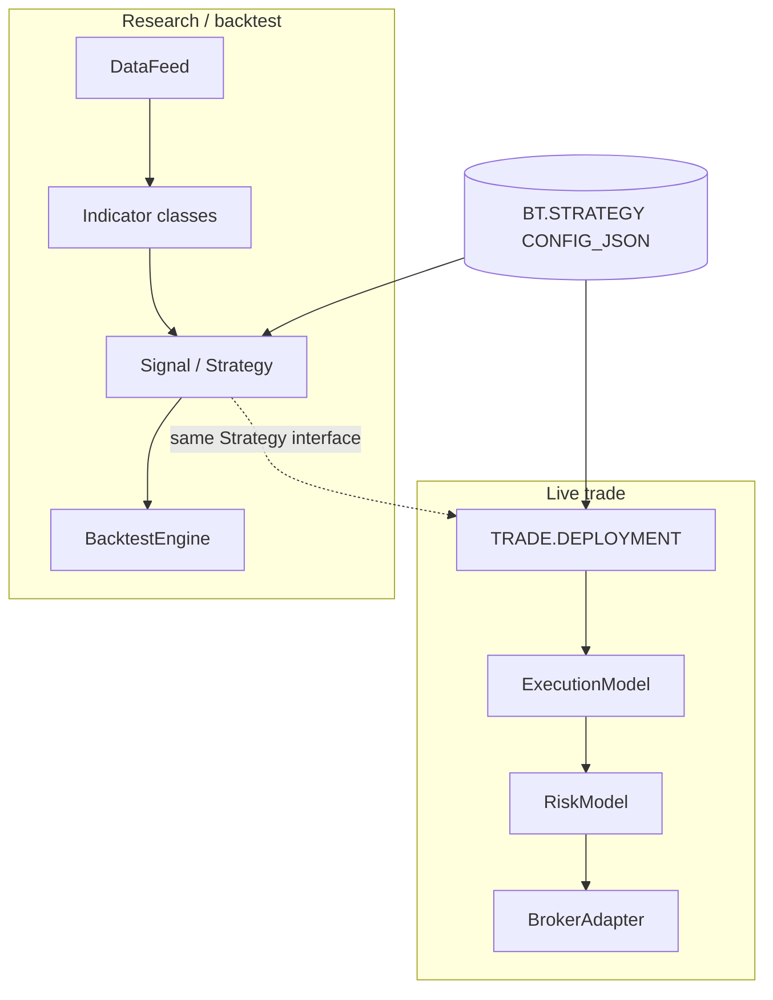
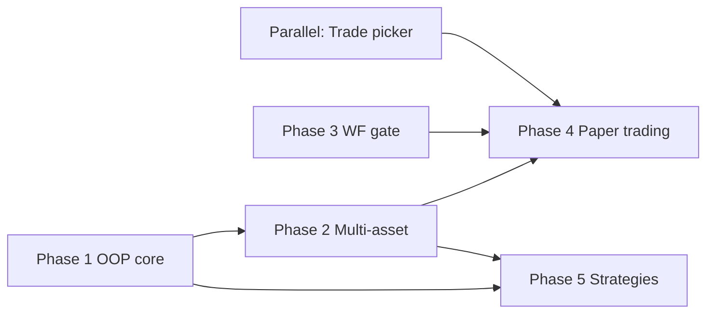
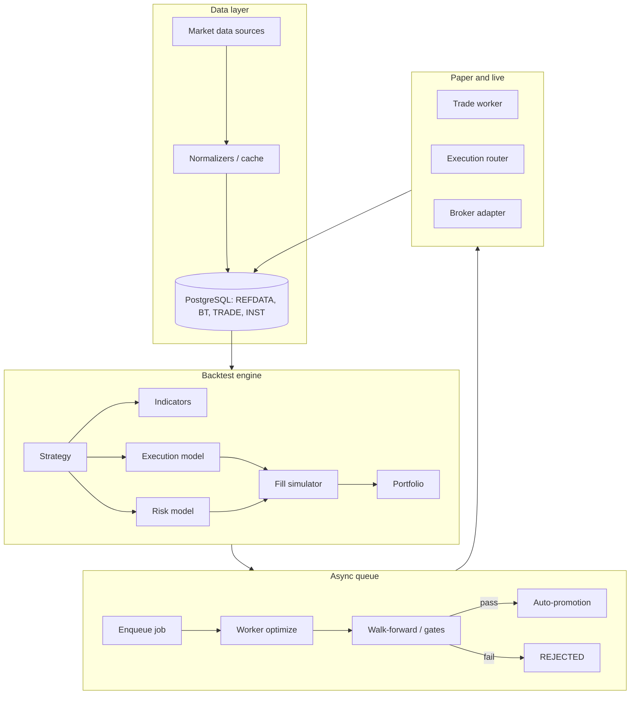
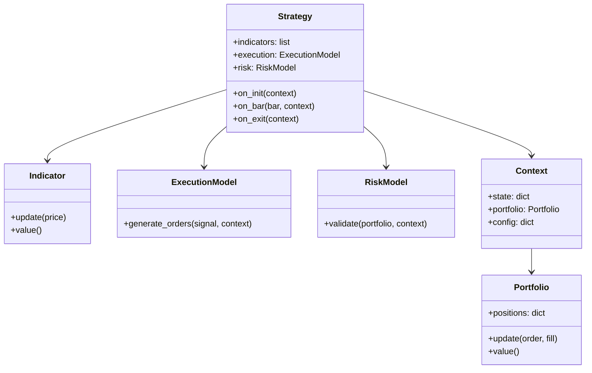

# Comparison to Professional Quant Firms

Honest assessment of our current architecture and direction — synthesized from
university lecture notes on systematic trading and mapped to this codebase for
**further strategy enablement** (research → production).

See also: [System Overview](overview.md), [Plan to Profit](../design/plan-to-profit.md),
[Futu Trading (OOP)](../design/futu-trading.md), [Decisions log](../decisions.md).

---

## Strengths: where we are ahead of most small quant teams

### Database discipline

Our system uses:

- Stored procedures (no raw DML from application code)
- Soft-versioning (`TRANSACT_TO_TS`, `IS_BEST_IND`, deployment VIDs)
- Liquibase migrations
- Audit trails and temporal versioning

Most small quant teams rely on CSVs, SQLite, or ad-hoc schemas. Our approach
resembles mid-tier systematic funds with proper separation of concerns and
production-grade data governance. Details: [Database](database.md).

### REFDATA-driven configuration

Indicators, promotion metrics, strategies, and UI dropdowns are defined in
PostgreSQL reference tables rather than hardcoded Python constants. This mirrors
institutional configuration patterns (central catalog, versioned seeds, Redis
snapshot at API boot).

### Pipeline architecture

We maintain clear boundaries between:

| Stage | Schema / module | Role |
|-------|-----------------|------|
| Backtest | `quant/strategy/`, FastAPI sync routes | Grid search, walk-forward |
| Queue | `BT.QUEUE`, `quant/queue/` | Async jobs, rate limits |
| Worker | `quant/queue/worker.py` | Claim, optimize, write `BT.RESULT` |
| Promotion | `BT.PROMOTION`, `quant/promotion/` | Auto-promote vs best VID |
| Trade | `TRADE.DEPLOYMENT`, `quant/trade/` | Pin strategy → broker account |

The asynchronous queue-based backtest with auto-promotion is a genuine
differentiator. Most small teams run monolithic notebooks without lifecycle
separation. See [Pipeline](pipeline.md) and [Best-VID Promotion](../design/best-vid-promotion.md).

### Deployment and infrastructure

We use Liquibase, ECR, GitHub Actions CI/CD, SSM Parameter Store, and
CloudFormation. This is production-level infrastructure that many 5–10 person
quant teams never build. See [Infrastructure](infrastructure.md).

### Documentation culture

MkDocs, decision logs, design diagrams, and architectural notes give us a level
of clarity that even larger firms often lack.

---

## Gaps: where professional quant firms differ

| Area | Our system | Typical quant firm | Gap |
|------|------------|-------------------|-----|
| **Alpha research** | Single grid search + walk-forward | Multi-stage pipeline: universe screening, factor modelling, portfolio construction | **Large** |
| **Data pipeline** | Yahoo / Glassnode, single-asset | Tick data, order book, alt-data, QA, point-in-time correctness | **Medium** |
| **Risk management** | Max DD + Sharpe gates (`REFDATA.PROMOTION_METRIC`) | Exposure limits, correlation monitoring, VaR/CVaR, margin | **Large** |
| **Execution** | Market orders, simple fills (planned) | Smart routing, TWAP/VWAP, slippage models, TCA | **Medium** |
| **Strategy count** | Handful of signal types | Hundreds of signals, portfolio optimisation | **Large** |
| **Backtesting realism** | Fee-adjusted returns | Bias checks, market impact, PnL attribution | **Medium** |
| **Team tooling** | Shared strategy pool, VID comparison | Experiment tracking, reproducible research envs | **Small** |

---

## Our real advantage: foundation-to-production ratio

Most quant projects are:

- **~90% research notebooks**
- **~10% infrastructure**

We are closer to the inverse today:

- **Strong infrastructure**
- **Lean research surface area**

That is the harder part to build — and the part that scales. When we add a
second strategy or a second user, much of the lifecycle already exists:

- Queue → Result → Promotion → Deploy → Audit trail

Many teams hit a wall here because they never built the plumbing.

---

## The missing piece: OOP and the trading system

We are implementing OOP (see [Futu Trading](../design/futu-trading.md)), but
**research lecture patterns have not yet fully shaped how strategies plug into
backtest, promotion, and live trade**. That integration is the next enablement
layer.

### Why OOP matters in a trading system

A proper trading engine benefits from OOP because it enables:

- **Strategy polymorphism** — one interface, many implementations
- **Reusable execution logic** — same adapter for backtest and live
- **Encapsulation of indicators and signals** — stateful, testable units
- **Plug-and-play deployment** — promote a VID without rewriting the worker

Today our **infra is strong**; the **strategy layer is still largely procedural**
(function dispatch from REFDATA `METHOD_NAME` / `FUNC_NAME`). OOP is the
abstraction that turns infra into a **framework**.

### Where OOP should integrate



| Layer | Target pattern | Today | Target home |
|-------|----------------|-------|-------------|
| **Strategy** | Common lifecycle (`on_init`, `on_bar`, …) | REFDATA-linked functions in `quant/strategy/` | Shared `Strategy` protocol; serialize config to `CONFIG_JSON` |
| **Indicators** | Stateful objects with `update()` / `value()` | Mostly functional helpers | Indicator classes reused by backtest + live worker |
| **Execution** | `ExecutionModel.generate_orders(signal, context)` | Not wired to trade worker | `quant/trade/` adapter layer ([Trade API](../design/trade-api.md)) |
| **Risk** | `RiskModel.validate(portfolio, context)` | HARD/SOFT gates in promotion only | Pre-trade checks in worker + promotion |
| **Engine** | Orchestrates feed, strategy, execution, risk | Optimize loop in worker / CLI | Single engine interface for backtest and paper/live |

!!! note "Illustrative — not current API"
    The Python sketches below come from **university lecture notes** and
    describe **target** abstractions for strategy enablement. They are not
    implemented verbatim in the repo today.

**Strategy interface (target):**

```python
class Strategy:
    def on_init(self, context): ...
    def on_bar(self, bar, context): ...
    def on_exit(self, context): ...
```

**Indicator class (target):**

```python
class EMA:
    def __init__(self, period): ...
    def update(self, price): ...
    def value(self): ...
```

**Execution model (target):**

```python
class ExecutionModel:
    def generate_orders(self, signal, context): ...
```

Examples: market, TWAP/VWAP, slippage-aware execution.

**Risk model (target):**

```python
class RiskModel:
    def validate(self, portfolio, context): ...
```

Promotion HARD/SOFT rules ([Best-VID Promotion](../design/best-vid-promotion.md))
are the first step; live trading needs a pluggable pre-trade risk component.

Once these exist, new strategies become “implement interface + register in REFDATA”
instead of one-off procedural paths.

---

## What we can implement (from lecture notes)

Distilled, actionable backlog mapped to this repo. Status reflects the codebase
**today** (not aspirations).

**Legend:** ✅ exists · 🟡 partial · ⬜ not started

### Summary matrix

| # | Initiative | Status | Effort | Blocks / depends on |
|---|------------|--------|--------|---------------------|
| 1 | Strategy OOP framework | 🟡 | **Large** | Nothing — unlocks 6–9 |
| 2 | Walk-forward HARD gate | 🟡 | **Small** | OOS metrics in `BT.RESULT` payload |
| 3 | Multi-asset | 🟡 | **Medium** | `INST.PRODUCT`, per-factor symbol in config |
| 4 | Paper trading loop | 🟡 | **Medium** | [Trade Deployment Rollout](../design/trade-deployment-rollout.md) 1.7 |
| 5 | More strategies | 🟡 | **Small each** | REFDATA seeds + `signals.py` |
| 6 | Indicator library (OOP) | 🟡 | **Medium** | #1 or incremental wrap of `TechnicalAnalysis` |
| 7 | Execution models | ⬜ | **Medium → Large** | #1, trade worker |
| 8 | Risk models (live) | 🟡 | **Small → Large** | Promotion HARD rules exist; live pre-trade ⬜ |
| 9 | Backtest engine refactor | 🟡 | **Large** | #1, #6, #7, #8 |

---

### 1. Strategy OOP framework

**Goal:** Turn infra into a composable quant framework (biggest missing piece).

| Component | Target | Today | Implement in |
|-----------|--------|-------|----------------|
| `Strategy` protocol | `on_init` / `on_bar` / `on_exit` | Function dispatch via REFDATA `FUNC_NAME` | `quant/strategy/base.py` (new) |
| `Context` | Bar clock, config, services | Scattered locals in optimizer | `quant/strategy/context.py` (new) |
| `Portfolio` | Positions, cash, PnL | Implicit in `performance.py` | `quant/strategy/portfolio.py` (new) |
| `Indicator` classes | Stateful `update()` / `value()` | `TechnicalAnalysis` methods on full DataFrame | `quant/strategy/indicators/` (new package) |
| `ExecutionModel` | `generate_orders(signal, ctx)` | ⬜ not in backtest or trade worker | `quant/trade/execution/` (new) |
| `RiskModel` | `validate(portfolio, ctx)` | Promotion only (`quant/promotion/evaluate.py`) | `quant/strategy/risk/` + `quant/trade/risk/` |

**First slice (minimal):**

1. Define `Protocol` / ABC for `Strategy` — no worker change yet.
2. Wrap one existing signal (e.g. Bollinger momentum) as a class; still callable from `signals.py`.
3. Serialize strategy params into existing `CONFIG_JSON` (no schema break).

**Do not block on this** for items 2, 4, 5 — those can ship on the procedural path.

---

### 2. Walk-forward as a HARD promotion gate

**Goal:** `Backtest → Walk-forward → Gate → Promotion`. If OOS Sharpe &lt; threshold → `REJECTED`.

| Piece | Status | Notes |
|-------|--------|-------|
| Walk-forward math | ✅ | `quant/strategy/walk_forward.py`, API `/backtest/walk-forward` |
| Inline WF on optimize | ✅ | `walk_forward=True` in optimize request (`backtest_service.py`) |
| WF in queue worker | ⬜ | Worker optimize path may not persist WF/OOS into `PAYLOAD_JSON` |
| Promotion reads OOS | ⬜ | `_extract_metric` only reads `performance.strategy_metrics` |
| REFDATA gate row | ⬜ | Add e.g. `oos_sharpe_gate` to `REFDATA.PROMOTION_METRIC` |

**Implementation steps (small, high impact):**

1. **Worker:** after optimize, run walk-forward (or reuse inline WF) and attach `walk_forward.oos_metrics` to result payload written by `SP_INS_RESULT`.
2. **Promotion:** extend `_extract_metric` to read `walk_forward.oos_metrics["Sharpe Ratio"]` (or normalized key).
3. **REFDATA:** Liquibase seed — HARD metric `oos_sharpe_gt_0` with threshold (configurable).
4. **UI:** show WF gate in Promotion comparison panel (already shows HARD gates from snapshot).

No queue schema change. No OOP required.

---

### 3. Multi-asset support

**Goal:** Strategy receives `dict[symbol → bar]`; portfolio and execution per symbol.

| Piece | Status | Notes |
|-------|--------|-------|
| `INST.PRODUCT` / xref | ✅ | Instrument cache, product selector in UI |
| Per-factor symbol in config | ✅ | `factors[].symbol` in optimize request |
| Optimizer multi-asset loop | 🟡 | Effectively one primary series today |
| Live multi-symbol deployment | ⬜ | One `INTERNAL_CUSIP` per deployment row |

**Implementation steps:**

1. Optimizer: iterate factors with distinct symbols; align calendars.
2. `Portfolio`: map `symbol → position` (new class or extend performance).
3. Trade: one deployment per symbol **or** extend `CONFIG_JSON` with symbol list + qty map.
4. Paper worker: route orders per symbol via `INST.PRODUCT_XREF`.

Unlocks 5–10 crypto pairs without full OOP refactor if signals stay procedural.

---

### 4. Paper trading integration

**Goal:** `backtest → paper → live` lifecycle with reconciliation.

| Piece | Status | Notes |
|-------|--------|-------|
| Trade UI + deployments | ✅ | Phase 1.2–1.5 |
| `FutuTrader` (paper flag) | ✅ | `quant/trade/futu_trader.py` |
| Bybit adapter dry-run | ⬜ | Plan 1.3 |
| Trade worker / scheduler | ⬜ | No loop polling `TRADE.DEPLOYMENT` yet |
| Fill simulator (backtest-style) | ⬜ | For crypto paper without exchange |
| `EXECUTION_EVENT` writes | ⬜ | SP exists; worker ⬜ |
| Promotion rule: paper before live | ⬜ | REFDATA or deployment status check |

**Implementation steps:** follow [Trade Deployment Rollout](../design/trade-deployment-rollout.md) (picker → dry-run → apply → execution log). Add promotion HARD gate: “must have paper deployment with N days / M fills” later.

---

### 5. More strategies

**Goal:** Stress-test pipeline with diverse signal types.

| Approach | Effort | Path |
|----------|--------|------|
| New REFDATA `SIGNAL_TYPE` + signal func | **Small each** | [Adding Strategies](../guides/adding-strategies.md) |
| Grid search over params | ✅ | Already works |
| Auto-promotion | ✅ | Worker + `REFDATA.PROMOTION_METRIC` |

**Candidates from notes:** mean reversion, breakout, vol breakout, trend following — many map to existing indicators (RSI, Bollinger, SMA/EMA cross) in `quant/strategy/indicators.py` + new rows in `signals.py`.

**No OOP required** — fastest way to add alpha surface area.

---

### 6. Indicator library (OOP)

**Goal:** Reusable stateful indicators across backtest and live.

| Indicator | Procedural today | OOP target |
|-----------|------------------|------------|
| EMA / SMA | ✅ `get_ema`, `get_sma` | `EMA(period).update(price)` |
| RSI | ✅ | `RSI(period)` |
| Bollinger | ✅ | `BollingerBands(period)` |
| ATR | ⬜ | New class |
| MACD | ⬜ | New class |
| Stochastic | ✅ | Wrap existing |

**Incremental path:** introduce `quant/strategy/indicators/ema.py` etc.; `TechnicalAnalysis` delegates to classes internally (no breaking API). Live worker imports same classes bar-by-bar.

---

### 7. Execution models

| Model | Backtest | Live | Priority |
|-------|----------|------|----------|
| Market | 🟡 fee-adjusted returns | ⬜ adapters | **P0** |
| Limit | ⬜ | ⬜ | P1 |
| Slippage / partial fill | ⬜ | ⬜ | P1 |
| TWAP / VWAP | ⬜ | ⬜ | P2 |
| Smart routing | ⬜ | ⬜ | P3 |

Start with `MarketExecutionModel` in backtest (wrap current fill logic), then same interface in `quant/trade/execution/`.

---

### 8. Risk models

| Rule | Promotion (HARD) | Live pre-trade |
|------|------------------|----------------|
| Max drawdown | ✅ `max_dd_gate` in REFDATA | ⬜ |
| Sharpe &gt; 0 | ✅ `sharpe_gate` | ⬜ |
| Max position size | ⬜ | ⬜ |
| Max leverage | ⬜ | ⬜ |
| Correlation / factor exposure | ⬜ | ⬜ |
| VaR / CVaR | ⬜ | ⬜ |

Promotion gates = research-stage risk. Live `RiskModel.validate()` runs **before** `ExecutionModel.generate_orders()` in the trade worker.

---

### 9. Backtest engine refactor

**Goal:** Engine composes `DataFeed → Strategy → ExecutionModel → RiskModel → Portfolio`.

| Module today | Role after refactor |
|--------------|---------------------|
| `optimizer.py` | Grid driver; calls engine per param set |
| `performance.py` | Becomes portfolio + metrics reporter |
| `backtest_service.py` | HTTP/CLI shell; unchanged surface |
| `walk_forward.py` | Uses same engine on IS/OOS splits |

Refactor **after** protocols exist (#1); migrate optimizer internals one path at a time.

---

## Recommended implementation order

Sequenced plan aligned with lecture notes and this codebase. Full detail:
[OOP Strategy Framework](oop-framework.md).

| Phase | Duration | Goal |
|-------|----------|------|
| **1 — OOP core** | 1–2 weeks | Strategy / Indicator / Execution / Risk bases; Portfolio + Context; engine refactor |
| **2 — Multi-asset** | ~1 week | Multi-symbol bars, per-symbol portfolio, execution routing |
| **3 — Walk-forward gate** | 2–3 days | OOS Sharpe HARD gate in promotion + rejection logging |
| **4 — Paper trading** | 1–2 weeks | Trade worker, fill simulator, reconciliation, backtest → paper → live rule |
| **5 — Strategy expansion** | Ongoing | Mean reversion, breakout, trend following, multi-asset variants |

### Phase 1 — OOP core

1. Create `Strategy` base class (`quant/strategy/base.py`)
2. Create `Indicator` base + 5–10 indicators (`quant/strategy/indicators/`)
3. Create `ExecutionModel` base (`quant/trade/execution/`)
4. Create `RiskModel` base (`quant/strategy/risk/`)
5. Implement `Portfolio` and `Context`
6. Refactor backtest engine to compose these (`quant/strategy/engine.py`)

### Phase 2 — Multi-asset

1. Strategy accepts `dict[symbol → bar]` in `on_bar`
2. Portfolio tracks per-symbol positions
3. Execution model routes orders by symbol

### Phase 3 — Walk-forward gate

1. Worker persists OOS Sharpe in `BT.RESULT` payload
2. Extend `quant/promotion/evaluate.py` + REFDATA `PROMOTION_METRIC` row
3. Log `REJECTED` with gate snapshot (worker already writes promotion outcome)

### Phase 4 — Paper trading

1. Trade worker polling `TRADE.DEPLOYMENT`
2. Fill simulator for crypto paper
3. Reconciliation loop vs broker / sim state
4. Promotion rule: require paper deployment before live apply

### Phase 5 — Strategy expansion (ongoing)

Add via OOP registry or procedural `signals.py` until migration completes:
mean reversion, breakout, volatility breakout, trend following, multi-asset variants.

### Parallel track (no OOP dependency)

Ship alongside Phase 1 without blocking the framework:

- **Phase 3** walk-forward gate (2–3 days, high impact)
- **Trade 1.6–1.7** strategy picker + paper apply ([rollout](../design/trade-deployment-rollout.md))
- **Procedural strategies** — REFDATA + `signals.py` ([Adding Strategies](../guides/adding-strategies.md))



---

## What we have vs what we need

### Already in place

| Area | Status |
|------|--------|
| Infra / CI/CD | ✅ Docker, ECR, GitHub Actions, SSM |
| Database discipline | ✅ Stored procedures, Liquibase, versioning |
| Promotion pipeline | ✅ Auto-promote, REFDATA HARD/SOFT gates |
| Documentation | ✅ MkDocs wiki + design docs |
| Queue system | ✅ `BT.QUEUE`, worker, rate limits |
| Deployment automation | ✅ Trade tab, Promotion → Deploy |
| Walk-forward math | ✅ Not yet wired as promotion gate |
| Broker paper API | ✅ `FutuTrader(paper=True)` |

### Still needed

| Area | Phase |
|------|-------|
| OOP strategy layer | 1 |
| Multi-asset support | 2 |
| Walk-forward promotion gate | 3 |
| Paper trading worker + reconciliation | 4 |
| More strategies | 5 |
| Execution models (market → TWAP) | 1 → 4 |
| Live risk models (beyond promotion) | 1 → 4 |

Once Phases 1–4 are done, the system resembles a **small systematic fund**
lifecycle (research → validate → paper → live) rather than a notebook-style repo.

---

## Architecture diagrams

### System architecture (high level)



### OOP class diagram (target)

Canonical diagram, folder layout, and Python skeletons: [OOP Strategy Framework](oop-framework.md).



---

## Roadmap (strategy enablement)

### Short term

- Add 2–3 more strategies via existing REFDATA + grid search path (#5)
- Enforce walk-forward as a promotion HARD gate (#2)
- [Trade Deployment Rollout](../design/trade-deployment-rollout.md): strategy picker → paper apply (#4)
- Expand to multi-asset via `INST.PRODUCT` / per-factor symbol (#3)

### Medium term

- Complete OOP integration (#1, #6, #7, #8, #9)
- Paper-trading validation loop with execution log (#4)
- Experiment tracking: VID lineage + metrics (MLflow-style, not necessarily MLflow)

### Long term

- Multi-strategy portfolio construction
- Advanced execution (TWAP, slippage models)
- Real-time risk engine alongside promotion rules

---

## Related docs

| Topic | Page |
|-------|------|
| Live trading OOP (Futu) | [Futu Trading](../design/futu-trading.md) |
| OOP framework (target) | [OOP Strategy Framework](oop-framework.md) |
| Trade apply pipeline | [Trade Deployment Rollout](../design/trade-deployment-rollout.md) |
| Promotion gates | [Best-VID Promotion](../design/best-vid-promotion.md) |
| Adding strategies (today) | [Adding Strategies](../guides/adding-strategies.md) |
| Product roadmap | [Plan to Profit](../design/plan-to-profit.md) |
