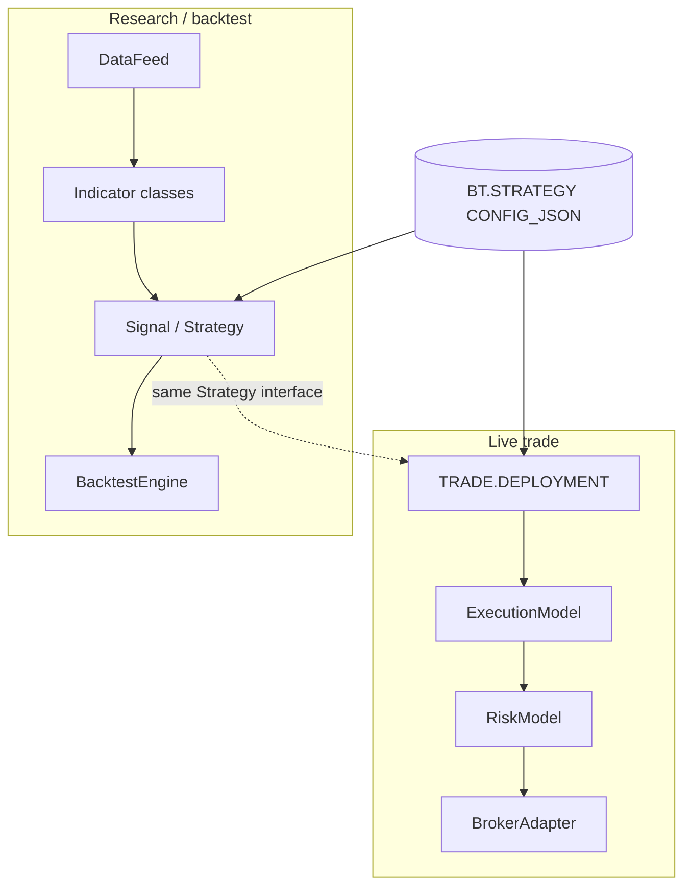
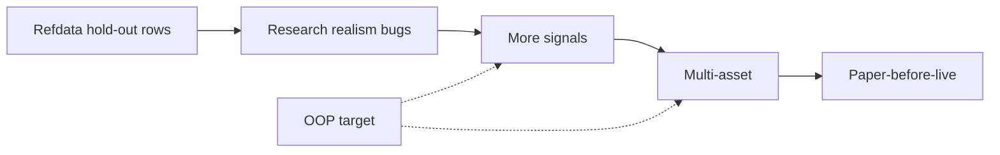
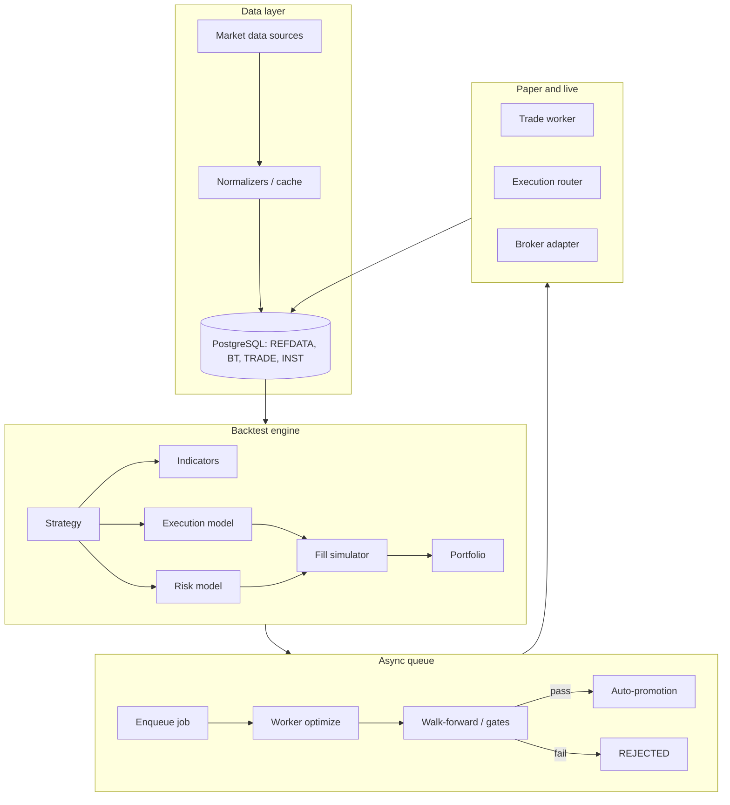
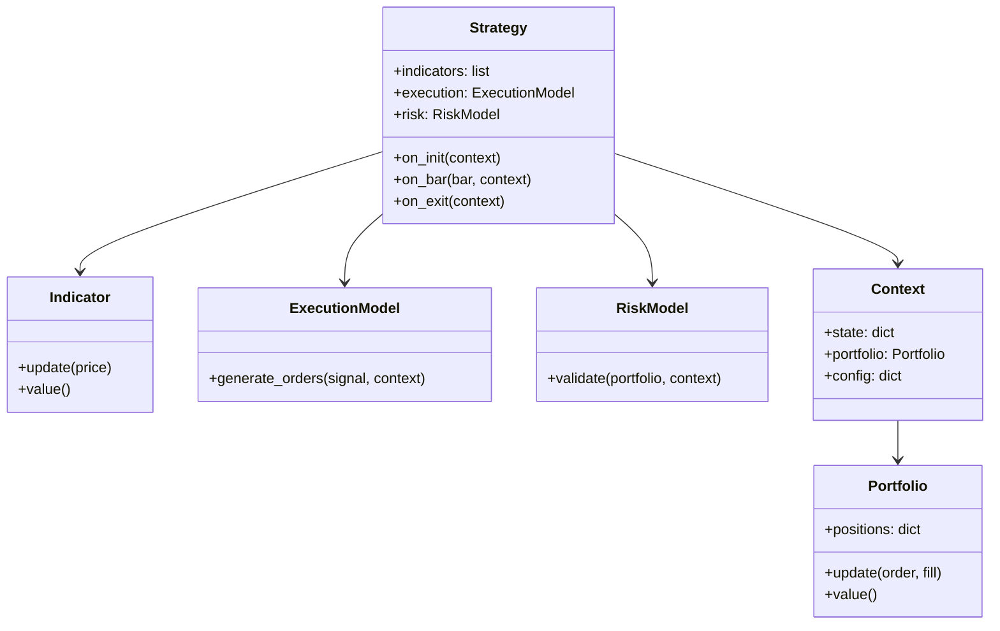

# Comparison to Professional Quant Firms

Honest assessment of our current architecture and direction — synthesized from
university lecture notes on systematic trading and mapped to this codebase for
**further strategy enablement** (research → production).

See also: [System Overview](overview.md), [Plan to Profit](../design/plan-to-profit.md),
[Futu Trading (OOP)](../design/futu-trading.md), [Decisions log](../decisions.md).

---

## Strengths: where we are ahead of most small quant teams

### Database discipline

Our system uses:

- Stored procedures (no raw DML from application code)
- Soft-versioning (`TRANSACT_TO_TS`, `IS_BEST_IND`, deployment VIDs)
- Liquibase migrations
- Audit trails and temporal versioning

Most small quant teams rely on CSVs, SQLite, or ad-hoc schemas. Our approach
resembles mid-tier systematic funds with proper separation of concerns and
production-grade data governance. Details: [Database](database.md).

### REFDATA-driven configuration

Indicators, promotion metrics, strategies, and UI dropdowns are defined in
PostgreSQL reference tables rather than hardcoded Python constants. This mirrors
institutional configuration patterns (central catalog, versioned seeds, Redis
snapshot at API boot).

### Pipeline architecture

We maintain clear boundaries between:

| Stage | Schema / module | Role |
|-------|-----------------|------|
| Backtest | `quant/strategy/`, queue worker | Grid search and walk-forward. The SPA enqueues a job; the worker calls `run_optimize` |
| Queue | `BT.QUEUE`, `quant/queue/` | Async jobs, rate limits |
| Worker | `quant/queue/worker.py` | Claim, optimize, write `BT.RESULT` |
| Promotion | `BT.PROMOTION`, `quant/promotion/` | Auto-promote vs best VID |
| Trade | `TRADE.DEPLOYMENT`, `quant/trade/` | Pin strategy → broker account |

The asynchronous queue-based backtest with auto-promotion is a genuine
differentiator. Most small teams run monolithic notebooks without lifecycle
separation. See [Pipeline](pipeline.md) and [Best-VID Promotion](../design/best-vid-promotion.md).

### Deployment and infrastructure

We use Liquibase, ECR, GitHub Actions CI/CD, SSM Parameter Store, and
CloudFormation. This is production-level infrastructure that many 5–10 person
quant teams never build. See [Infrastructure](infrastructure.md).

### Documentation culture

MkDocs, decision logs, design diagrams, and architectural notes give us a level
of clarity that even larger firms often lack.

---

## Gaps: where professional quant firms differ

| Area | Our system | Typical quant firm | Gap |
|------|------------|-------------------|-----|
| **Alpha research** | Single grid search + one walk-forward cut | Multi-stage pipeline: universe screening, factor modelling, portfolio construction | **Large** |
| **Data pipeline** | Interval OHLCV from ccxt (Bybit), Futu, Yahoo, Glassnode, AlphaVantage, and Nasdaq. Per-factor symbols in config. The optimizer still scores one primary series | Tick data, order book, alt-data, QA, point-in-time correctness | **Medium** |
| **Risk management** | Promotion HARD/SOFT in `CONFIG.PROMOTION_METRIC`: max drawdown, full-sample Sharpe, and — once the refdata rows are applied — hold-out Sharpe and Sharpe versus buy-and-hold. No live pre-trade check | Exposure limits, correlation monitoring, VaR/CVaR, margin | **Large** |
| **Execution** | Market orders on the live path (ccxt). Backtest fills are fee-adjusted closes | Smart routing, TWAP/VWAP, slippage models, TCA | **Medium** |
| **Strategy count** | Handful of signal types | Hundreds of signals, portfolio optimisation | **Large** |
| **Backtesting realism** | Fee-adjusted returns and one walk-forward cut. Open: stochastic uses the traded coin's high/low/close, and the out-of-sample slice restarts the indicator. Long-only AND used to score as OR; the combiner now vetoes a flat factor, and stored AND results from before that fix still match OR until flagged ([AlgoDaemon bug report](../design/2026-09-27-algodaemon-bug-report.md)) | Bias checks, market impact, PnL attribution | **Medium** |
| **Team tooling** | Shared strategy pool, VID comparison | Experiment tracking, reproducible research envs | **Small** |

---

## Our real advantage: foundation-to-production ratio

Most quant projects are:

- **~90% research notebooks**
- **~10% infrastructure**

We are closer to the inverse today:

- **Strong infrastructure**
- **Lean research surface area**

That is the harder part to build — and the part that scales. When we add a
second strategy or a second user, much of the lifecycle already exists:

- Queue → Result → Promotion → Deploy → Audit trail

Many teams hit a wall here because they never built the plumbing.

---

## The missing piece: OOP and the trading system

The production strategy layer is procedural: REFDATA `METHOD_NAME` / `FUNC_NAME`
dispatch in `quant/strategy/`. Live apply is the trade worker and the ccxt
adapter, not a `Strategy` class. The lecture-note interfaces below are the
target in [OOP Strategy Framework](oop-framework.md). New signals ship on the
procedural path ([Adding Strategies](../guides/adding-strategies.md)). A rewrite
of `signals.py`, `optimizer.py`, and `TechnicalAnalysis` is not required for
the hold-out gate or for Trade.

### Why OOP matters in a trading system

A proper trading engine benefits from OOP because it enables:

- **Strategy polymorphism** — one interface, many implementations
- **Reusable execution logic** — same adapter for backtest and live
- **Encapsulation of indicators and signals** — stateful, testable units
- **Plug-and-play deployment** — promote a VID without rewriting the worker

The infra is strong and the strategy layer is procedural. The interfaces below
are how a later framework would share one strategy between backtest and live.
They are not the engine that runs today.

### Where OOP should integrate


```mermaid
flowchart TB
  subgraph research [Research / backtest]
    DF[DataFeed]
    IND[Indicator classes]
    SIG[Signal / Strategy]
    BT[BacktestEngine]
  end
  subgraph live [Live trade]
    DEP[TRADE.DEPLOYMENT]
    EXEC[ExecutionModel]
    RISK[RiskModel]
    ADP[BrokerAdapter]
  end
  CONFIG[(BT.STRATEGY CONFIG_JSON)]
  DF --> IND --> SIG --> BT
  CONFIG --> SIG
  CONFIG --> DEP
  DEP --> EXEC
  EXEC --> RISK
  RISK --> ADP
  SIG -.->|same Strategy interface| DEP
```

| Layer | Target pattern | Today | Target home |
|-------|----------------|-------|-------------|
| **Strategy** | Common lifecycle (`on_init`, `on_bar`, …) | REFDATA-linked functions in `quant/strategy/` | Shared `Strategy` protocol; serialize config to `CONFIG_JSON` |
| **Indicators** | Stateful objects with `update()` / `value()` | Mostly functional helpers | Indicator classes reused by backtest + live worker |
| **Execution** | `ExecutionModel.generate_orders(signal, context)` | Not wired to trade worker | `quant/trade/` adapter layer ([Trade API](../design/trade-api.md)) |
| **Risk** | `RiskModel.validate(portfolio, context)` | HARD/SOFT gates in promotion only | Pre-trade checks in worker + promotion |
| **Engine** | Orchestrates feed, strategy, execution, risk | Optimize loop in worker / CLI | Single engine interface for backtest and paper/live |

!!! note "Illustrative — not current API"
    The Python sketches below come from **university lecture notes** and
    describe **target** abstractions for strategy enablement. They are not
    implemented verbatim in the repo today.

**Strategy interface (target):**

```python
class Strategy:
    def on_init(self, context): ...
    def on_bar(self, bar, context): ...
    def on_exit(self, context): ...
```

**Indicator class (target):**

```python
class EMA:
    def __init__(self, period): ...
    def update(self, price): ...
    def value(self): ...
```

**Execution model (target):**

```python
class ExecutionModel:
    def generate_orders(self, signal, context): ...
```

Examples: market, TWAP/VWAP, slippage-aware execution.

**Risk model (target):**

```python
class RiskModel:
    def validate(self, portfolio, context): ...
```

Promotion HARD/SOFT rules ([Best-VID Promotion](../design/best-vid-promotion.md))
are the first step; live trading needs a pluggable pre-trade risk component.

Once these exist, new strategies become “implement interface + register in REFDATA”
instead of one-off procedural paths.

---

## What we can implement (from lecture notes)

Distilled, actionable backlog mapped to this repo. Status reflects the codebase
**today** (not aspirations).

**Legend:** ✅ exists · 🟡 partial · ⬜ not started

Rows 2–5 are the procedural backlog. Rows 1 and 6–9 are the target framework
in [OOP Strategy Framework](oop-framework.md). Their “implement in” paths are
the later modules, and the running code stays `signals.py`, `optimizer.py`,
and `TechnicalAnalysis`.

### Summary matrix

| # | Initiative | Status | Effort | Blocks / depends on |
|---|------------|--------|--------|---------------------|
| 1 | Strategy OOP framework | 🟡 | **Large** | Target. Items 2–5 ship on the procedural path |
| 2 | Walk-forward HARD gate | 🟡 | **Small** | Evaluator is done. Remaining work is the refdata `1.26.0` migrate |
| 3 | Multi-asset | 🟡 | **Medium** | `INST.PRODUCT`, per-factor symbol in config |
| 4 | Paper trading loop | 🟡 | **Medium** | Worker and market apply exist. Fill simulator and paper-before-live remain |
| 5 | More strategies | 🟡 | **Small each** | REFDATA seeds + `signals.py` |
| 6 | Indicator library (OOP) | 🟡 | **Medium** | #1 or incremental wrap of `TechnicalAnalysis` |
| 7 | Execution models | ⬜ | **Medium → Large** | #1, trade worker |
| 8 | Risk models (live) | 🟡 | **Small → Large** | Promotion HARD rules exist; live pre-trade ⬜ |
| 9 | Backtest engine refactor | 🟡 | **Large** | #1, #6, #7, #8 |

---

### 1. Strategy OOP framework

**Goal (target):** a shared strategy interface. The hold-out gate, new signals, and Trade ship without it.

| Component | Target | Today | Implement in |
|-----------|--------|-------|----------------|
| `Strategy` protocol | `on_init` / `on_bar` / `on_exit` | Function dispatch via REFDATA `FUNC_NAME` | `quant/strategy/base.py` (new) |
| `Context` | Bar clock, config, services | Scattered locals in optimizer | `quant/strategy/context.py` (new) |
| `Portfolio` | Positions, cash, PnL | Implicit in `performance.py` | `quant/strategy/portfolio.py` (new) |
| `Indicator` classes | Stateful `update()` / `value()` | `TechnicalAnalysis` methods on full DataFrame | `quant/strategy/indicators/` (new package) |
| `ExecutionModel` | `generate_orders(signal, ctx)` | ⬜ not in backtest or trade worker | `quant/trade/execution/` (new) |
| `RiskModel` | `validate(portfolio, ctx)` | Promotion only (`quant/promotion/evaluate.py`) | `quant/strategy/risk/` + `quant/trade/risk/` |

**First slice (minimal):**

1. Define `Protocol` / ABC for `Strategy` — no worker change yet.
2. Wrap one existing signal (e.g. Bollinger momentum) as a class; still callable from `signals.py`.
3. Serialize strategy params into existing `CONFIG_JSON` (no schema break).

**Do not block on this** for items 2, 4, 5 — those can ship on the procedural path.

---

### 2. Walk-forward as a HARD promotion gate

**Goal:** `Backtest → Walk-forward → Gate → Promotion`. If OOS Sharpe &lt; threshold → `REJECTED`.

| Piece | Status | Notes |
|-------|--------|-------|
| Walk-forward math | ✅ | `quant/strategy/walk_forward.py`, API `/backtest/walk-forward` |
| Inline WF on optimize | ✅ | `walk_forward=True` in optimize request (`backtest_service.py`) |
| WF in queue worker | ✅ | `worker` stores `OptimizeResponse.model_dump()`, which includes `walk_forward.oos_metrics` |
| Promotion reads OOS | ✅ | `_extract_metric` reads `OOS Sharpe Ratio` and `Sharpe Excess` (decision #83) |
| REFDATA gate row | 🟡 | `db/liquidbase/refdata/releases/1.26.0-promotion-holdout-gates.xml` seeds `oos_sharpe_gate` and `sharpe_excess_gate`, and raises `sharpe_gate` from 0 to 1. Context `refdata,prod-deploy`. The `bt` release `1.26.0` is the `SP_GET_RESULT` signature and does not seed these rows |

The worker already stores the inline walk-forward, and `_extract_metric` already reads both keys. The Promotion panel lists whatever HARD gates the snapshot returns. The rows take effect when that **refdata** release is migrated, then `POST /api/v1/refdata/refresh`. Until then production keeps the previous Sharpe threshold.

No queue schema change. No OOP required.

---

### 3. Multi-asset support

**Goal:** Strategy receives `dict[symbol → bar]`; portfolio and execution per symbol.

| Piece | Status | Notes |
|-------|--------|-------|
| `INST.PRODUCT` / xref | ✅ | Instrument cache, product selector in UI |
| Per-factor symbol in config | ✅ | `factors[].symbol` in optimize request |
| Optimizer multi-asset loop | 🟡 | Effectively one primary series today |
| Live multi-symbol deployment | ⬜ | One `INTERNAL_CUSIP` per deployment row |

**Implementation steps:**

1. Optimizer: iterate factors with distinct symbols; align calendars.
2. `Portfolio`: map `symbol → position` (new class or extend performance).
3. Trade: one deployment per symbol **or** extend `CONFIG_JSON` with symbol list + qty map.
4. Paper worker: route orders per symbol via `INST.PRODUCT_XREF`.

Unlocks 5–10 crypto pairs without full OOP refactor if signals stay procedural.

---

### 4. Paper trading integration

**Goal:** `backtest → paper → live` lifecycle with reconciliation.

| Piece | Status | Notes |
|-------|--------|-------|
| Trade UI + deployments | ✅ | Phase 1.2–1.5 |
| `FutuTrader` (paper flag) | ✅ | `quant/trade/futu_trader.py` |
| Bybit adapter dry-run | ✅ | Plan 1.3 — `quant/trade/dry_run.py`, ccxt adapter |
| Trade worker / scheduler | ✅ | Platform tick via `POST /api/v1/scheduler/tick` + in-process `SchedulePoller` (dev) |
| Fill simulator (backtest-style) | ⬜ | For crypto paper without exchange |
| `EXECUTION_EVENT` writes | ✅ | `live_apply.py` → `SP_INS_EXECUTION_EVENT`; read UI in release 1.8.0 |
| Promotion rule: paper before live | ⬜ | REFDATA or deployment status check |

Picker, dry-run, live apply, and the execution log have shipped (execution log in trade `1.8.0`; see [Trade Deployment Rollout](../archive/trade-deployment-rollout.md)). Still open: a fill simulator for crypto paper that does not hit the exchange, and a promotion rule that requires a paper deployment before live apply.

---

### 5. More strategies

**Goal:** Stress-test pipeline with diverse signal types.

| Approach | Effort | Path |
|----------|--------|------|
| New REFDATA `SIGNAL_TYPE` + signal func | **Small each** | [Adding Strategies](../guides/adding-strategies.md) |
| Grid search over params | ✅ | Already works |
| Auto-promotion | ✅ | Worker + `CONFIG.PROMOTION_METRIC` |

**Candidates from notes:** mean reversion, breakout, vol breakout, trend following — many map to existing indicators (RSI, Bollinger, SMA/EMA cross) in `quant/strategy/indicators.py` + new rows in `signals.py`.

**No OOP required** — fastest way to add alpha surface area.

---

### 6. Indicator library (OOP)

**Goal:** Reusable stateful indicators across backtest and live.

| Indicator | Procedural today | OOP target |
|-----------|------------------|------------|
| EMA / SMA | ✅ `get_ema`, `get_sma` | `EMA(period).update(price)` |
| RSI | ✅ | `RSI(period)` |
| Bollinger | ✅ | `BollingerBands(period)` |
| ATR | ⬜ | New class |
| MACD | ⬜ | New class |
| Stochastic | ✅ | Wrap existing |

**Incremental path:** introduce `quant/strategy/indicators/ema.py` etc.; `TechnicalAnalysis` delegates to classes internally (no breaking API). Live worker imports same classes bar-by-bar.

---

### 7. Execution models

| Model | Backtest | Live | Priority |
|-------|----------|------|----------|
| Market | 🟡 fee-adjusted returns | ✅ ccxt live apply | **P0** |
| Limit | ⬜ | ⬜ | P1 |
| Slippage / partial fill | ⬜ | ⬜ | P1 |
| TWAP / VWAP | ⬜ | ⬜ | P2 |
| Smart routing | ⬜ | ⬜ | P3 |

Start with `MarketExecutionModel` in backtest (wrap current fill logic), then same interface in `quant/trade/execution/`.

---

### 8. Risk models

| Rule | Promotion (HARD) | Live pre-trade |
|------|------------------|----------------|
| Max drawdown | ✅ HARD gate in `CONFIG.PROMOTION_METRIC` ("Max DD LTE 40%") | ⬜ |
| Sharpe &gt; 1 | 🟡 — refdata `1.26.0-promotion-holdout-gates` raises `sharpe_gate` from 0 to 1 on migrate. Not the `bt` `1.26.0` procedure change | ⬜ |
| Max position size | ⬜ | ⬜ |
| Max leverage | ⬜ | ⬜ |
| Correlation / factor exposure | ⬜ | ⬜ |
| VaR / CVaR | ⬜ | ⬜ |

Promotion gates = research-stage risk. Live `RiskModel.validate()` runs **before** `ExecutionModel.generate_orders()` in the trade worker.

---

### 9. Backtest engine refactor

**Goal:** Engine composes `DataFeed → Strategy → ExecutionModel → RiskModel → Portfolio`.

| Module today | Role after refactor |
|--------------|---------------------|
| `optimizer.py` | Grid driver; calls engine per param set |
| `performance.py` | Becomes portfolio + metrics reporter |
| `backtest_service.py` | HTTP/CLI shell; unchanged surface |
| `walk_forward.py` | Uses same engine on IS/OOS splits |

Refactor **after** protocols exist (#1); migrate optimizer internals one path at a time.

---

## Recommended next work

The queue, promotion evaluator, and live apply already run on the procedural
path. The hold-out gate and new signals do not wait on the OOP target.
[OOP Strategy Framework](oop-framework.md) stays the later shape.

| Order | Work | Where it stands |
|-------|------|-----------------|
| 1 | Apply refdata `1.26.0-promotion-holdout-gates` | Evaluator already reads the keys. Migrate, then `POST /api/v1/refdata/refresh` |
| 2 | Research realism on the current scorer | [AlgoDaemon bug report](../design/2026-09-27-algodaemon-bug-report.md): stochastic high/low/close, walk-forward restart. AND-as-OR is fixed in the combiner; stored results still need flagging |
| 3 | More signal types | REFDATA `SIGNAL_TYPE` + `signals.py` ([Adding Strategies](../guides/adding-strategies.md)) |
| 4 | Multi-asset | Per-factor symbol exists. Optimizer scores one primary series. One `INTERNAL_CUSIP` per deployment |
| 5 | Paper-before-live, fill simulator | Trade worker, market apply, and the execution log exist (execution log in trade `1.8.0`) |
| 6 | OOP framework | Target only. Rows 1–5 stay on `signals.py`, `optimizer.py`, and `TechnicalAnalysis` |

### Target framework (not scheduled work)

If the procedural path is later wrapped, the lecture-note order is:

1. `Strategy`, `Indicator`, `ExecutionModel`, `RiskModel`, `Portfolio`, `Context`
2. Engine composes feed → strategy → execution → risk → portfolio
3. `on_bar` takes `dict[symbol → bar]` and the portfolio tracks a position per symbol

That sequence is [OOP Strategy Framework](oop-framework.md). It is not the next release.


```mermaid
flowchart LR
  G[Refdata hold-out rows] --> R[Research realism bugs]
  R --> S[More signals]
  S --> M[Multi-asset]
  M --> P[Paper-before-live]
  T[OOP target] -.-> S
  T -.-> M
```

---

## What we have vs what we need

### Already in place

| Area | Status |
|------|--------|
| Infra / CI/CD | ✅ Docker, ECR, GitHub Actions, SSM |
| Database discipline | ✅ Stored procedures, Liquibase, versioning |
| Promotion pipeline | ✅ Auto-promote, REFDATA HARD/SOFT gates |
| Documentation | ✅ MkDocs wiki + design docs |
| Queue system | ✅ `BT.QUEUE`, worker, rate limits |
| Deployment automation | ✅ Trade tab, Promotion → Deploy |
| Walk-forward math | ✅ Inline on the queued optimize. Promotion reads OOS Sharpe and Sharpe excess when those REFDATA rows are in the snapshot |
| Live apply | ✅ Trade worker, ccxt market orders, execution log (trade `1.8.0`) |
| Broker paper API | ✅ `FutuTrader(paper=True)` |

### Still needed

| Area | Phase |
|------|-------|
| Refdata hold-out rows on the snapshot | 1 |
| Research realism bugs (stochastic, walk-forward restart; stored AND results still to flag) | 2 |
| More strategies on `signals.py` | 3 |
| Multi-asset portfolio | 4 |
| Paper-before-live rule and a fill simulator | 5 |
| OOP strategy layer | Target — [OOP Strategy Framework](oop-framework.md) |
| Execution beyond a market order | Target |
| Live risk beyond the promotion gates | Target |

Research → validate → paper → live already exists as queue, promotion, and
deploy. What is thin is the research surface: few signals, one primary series,
hold-out rows that apply only after the refdata migrate, and no live risk
check in front of the order.

---

## Architecture diagrams

### System architecture (high level)

The Data, Queue, and Live boxes match the running system. The Backtest box is
the target composition from the section above. Today's backtest is the optimize
loop in the worker (`optimizer.py`, `performance.py`, `walk_forward.py`).


```mermaid
flowchart TD
    subgraph Data["Data layer"]
        A1[Market data sources] --> A2[Normalizers / cache]
        A2 --> A3[(PostgreSQL: REFDATA, BT, TRADE, INST)]
    end

    subgraph Backtest["Backtest engine"]
        B1[Strategy] --> B2[Indicators]
        B1 --> B3[Execution model]
        B1 --> B4[Risk model]
        B3 --> B5[Fill simulator]
        B4 --> B5
        B5 --> B6[Portfolio]
    end

    subgraph Queue["Async queue"]
        Q1[Enqueue job] --> Q2[Worker optimize]
        Q2 --> Q3[Walk-forward / gates]
        Q3 -->|pass| Q4[Auto-promotion]
        Q3 -->|fail| Q5[REJECTED]
    end

    subgraph Live["Paper and live"]
        L1[Trade worker]
        L2[Execution router]
        L3[Broker adapter]
    end

    A3 --> Backtest
    Backtest --> Queue
    Queue --> Live
    Live --> A3
```

### OOP class diagram (target)

Canonical diagram, folder layout, and Python skeletons: [OOP Strategy Framework](oop-framework.md).


```mermaid
classDiagram
    class Strategy {
        +on_init(context)
        +on_bar(bar, context)
        +on_exit(context)
        +indicators: list
        +execution: ExecutionModel
        +risk: RiskModel
    }

    class Indicator {
        +update(price)
        +value()
    }

    class ExecutionModel {
        +generate_orders(signal, context)
    }

    class RiskModel {
        +validate(portfolio, context)
    }

    class Portfolio {
        +positions: dict
        +update(order, fill)
        +value()
    }

    class Context {
        +state: dict
        +portfolio: Portfolio
        +config: dict
    }

    Strategy --> Indicator
    Strategy --> ExecutionModel
    Strategy --> RiskModel
    Strategy --> Context
    Context --> Portfolio
```

---

## Roadmap (strategy enablement)

### Short term

- Migrate refdata `1.26.0-promotion-holdout-gates` and refresh the REFDATA snapshot
- Fix the open scorer bugs in the [AlgoDaemon bug report](../design/2026-09-27-algodaemon-bug-report.md) on the procedural path
- Add 2–3 more strategies via REFDATA + `signals.py`

### Medium term

- Multi-asset: distinct factor symbols through the optimizer, one position map, still one deployment per symbol until the schema grows
- Paper-before-live promotion rule, and a fill simulator that does not hit the exchange
- Experiment tracking: VID lineage + metrics (MLflow-style, not necessarily MLflow)

### Long term

- OOP framework, as specified in [OOP Strategy Framework](oop-framework.md)
- Multi-strategy portfolio construction
- Advanced execution (TWAP, slippage models)
- Real-time risk engine alongside the promotion gates

---

## Related docs

| Topic | Page |
|-------|------|
| Live trading OOP (Futu) | [Futu Trading](../design/futu-trading.md) |
| OOP framework (target) | [OOP Strategy Framework](oop-framework.md) |
| Trade apply pipeline | [Trade Deployment Rollout](../archive/trade-deployment-rollout.md) |
| Promotion gates | [Best-VID Promotion](../design/best-vid-promotion.md) |
| Adding strategies (today) | [Adding Strategies](../guides/adding-strategies.md) |
| Product roadmap | [Plan to Profit](../design/plan-to-profit.md) |
