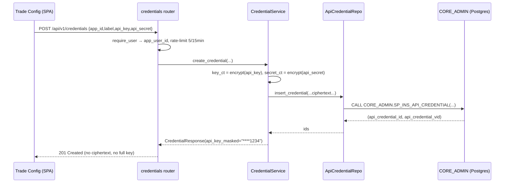

# Exchange Credential Encryption

How broker API keys (Bybit, Binance, Futu) are saved, encrypted at rest,
masked on read, and decrypted only at the trade-adapter boundary.

See [FastAPI Backend](api.md) for the surrounding endpoint surface and
[Login & Authentication](../design/login.md) for the session/auth layer that
gates these routes.

---

## Layers

| Layer | File | Responsibility |
|-------|------|----------------|
| Router | `quant/api/credentials/router.py` | `/api/v1/credentials` routes, `require_user`, rate limits, 404-on-not-owned |
| Service | `quant/api/credentials/service.py` (`CredentialService`) | Orchestrates **encrypt → SP → mask**; the only layer that sees plaintext |
| Repo | `quant/api/credentials/repo.py` (`ApiCredentialRepo`) | `CALL CORE_ADMIN.SP_*_API_CREDENTIAL`; returns raw rows incl. ciphertext |
| Crypto | `quant/shared/secrets_crypto.py` (`CredentialCrypto`) | Fernet encrypt / decrypt / mask |
| Schemas | `quant/api/credentials/schemas.py` | Request/response models — **responses never carry ciphertext** |

`CredentialCrypto` and `CredentialService` are built **once** at FastAPI
startup (`lifespan` in `quant/api/main.py`) and stored
on `app.state`. The repo is built per-request against `app.state.db_conninfo`.

---

## Encryption — Fernet

`CredentialCrypto` wraps a single symmetric **Fernet** key
(`cryptography.fernet`). Fernet provides AES-128-CBC + HMAC authentication, so a
tampered ciphertext raises `InvalidToken` on decrypt rather than returning
garbage.

```python
crypto = CredentialCrypto()        # reads EXCHANGE_SECRETS_KEY from env
token  = crypto.encrypt("my-key")  # → URL-safe base64 Fernet token (str)
plain  = crypto.decrypt(token)     # → "my-key"
masked = CredentialCrypto.mask("abcd1234")  # → "****1234"
```

### The key — `EXCHANGE_SECRETS_KEY`

| Environment | Behaviour |
|-------------|-----------|
| **prod** (`APP_ENV=prod`) | Key **must** be set or `CredentialCrypto()` raises at API boot — fail-fast (same pattern as `JWT_SECRET`). Stored in SSM `/quant/prod/EXCHANGE_SECRETS_KEY`. |
| **dev** | If unset, an **ephemeral** key is auto-generated with a loud warning. Credentials encrypted with it do **not** survive a restart. |

Generate a key:

```bash
python -c "from cryptography.fernet import Fernet; print(Fernet.generate_key().decode())"
```

!!! warning "Rotation invalidates stored ciphertext"
    `EXCHANGE_SECRETS_KEY` must be **stable**. Rotating it makes every stored
    `api_key_ciphertext` / `api_secret_ciphertext` undecryptable until users
    re-save their keys. There is no envelope-key re-wrap step today. The key
    must also be identical across all app instances sharing one database.

---

## Storage — `CORE_ADMIN.API_CREDENTIAL`

Writes go **only** through stored procedures (no raw DML):

| Operation | Stored procedure | Repo method |
|-----------|------------------|-------------|
| Create / rotate | `CORE_ADMIN.SP_INS_API_CREDENTIAL` | `insert_credential()` |
| List (current + active) | `CORE_ADMIN.SP_GET_API_CREDENTIAL` | `list_credentials()` |
| Get one | `CORE_ADMIN.SP_GET_API_CREDENTIAL` | `get_credential()` |
| Revoke (soft) | `CORE_ADMIN.SP_UPD_API_CREDENTIAL_REVOKE` | `revoke_credential()` |

The table stores only ciphertext columns — plaintext keys are never persisted.
Credentials are **soft-versioned**: rotate inserts a new `API_CREDENTIAL_VID`
for the same `API_CREDENTIAL_ID` rather than updating in place; revoke flips
`IS_ACTIVE_IND='N'` and clears ciphertext.

---

## Create flow (encrypt → store → mask)



**Read masking:** `list`/`get` decrypt the stored ciphertext only to compute the
last-4 mask (`CredentialCrypto.mask`); if decrypt fails (e.g. key rotated) the
mask falls back to `****`. The full plaintext never leaves `CredentialService`.

---

## Decrypt boundary (trade adapter only)

`CredentialService.decrypt_credential()` returns `(api_key, api_secret)` in
plaintext. It is the **only** method that emits full secrets and must be called
**only from the worker / broker-adapter boundary** — never from an HTTP handler.
It returns `None` when the credential is not found or not owned by the caller.

---

## Security properties

- **Ownership:** every SP call passes `CurrentUser.app_user_id`. Cross-user ids
  return **404** (not 403) so existence is not leaked.
- **At rest:** only Fernet ciphertext is stored; plaintext is never persisted or
  logged.
- **In transit out:** response schemas (`CredentialResponse`) structurally omit
  ciphertext; only `api_key_masked` is exposed.
- **Rate limited:** `POST` and `PUT` are capped at `5/15minutes` per client.
- **Tamper-evident:** Fernet HMAC means altered ciphertext raises `InvalidToken`.

---

## Endpoints

| Method | Path | Purpose |
|--------|------|---------|
| `GET` | `/api/v1/credentials` | List active credentials (masked) |
| `GET` | `/api/v1/credentials/{id}` | One credential (masked); 404 if not owned |
| `POST` | `/api/v1/credentials` | Save new account (encrypted); `201` |
| `PUT` | `/api/v1/credentials/{id}` | Rotate keys (soft-version bump) |
| `DELETE` | `/api/v1/credentials/{id}` | Soft-revoke (`IS_ACTIVE_IND='N'`); `204` |

---

## Related

- [FastAPI Backend](api.md) — full endpoint catalogue
- [Login & Authentication](../design/login.md) — session/auth gating these routes
- [Trade Deployment Rollout](../design/trade-deployment-rollout.md) — where decrypted keys are consumed
- [Infrastructure](infrastructure.md#ssm-parameters) — `EXCHANGE_SECRETS_KEY` in SSM
