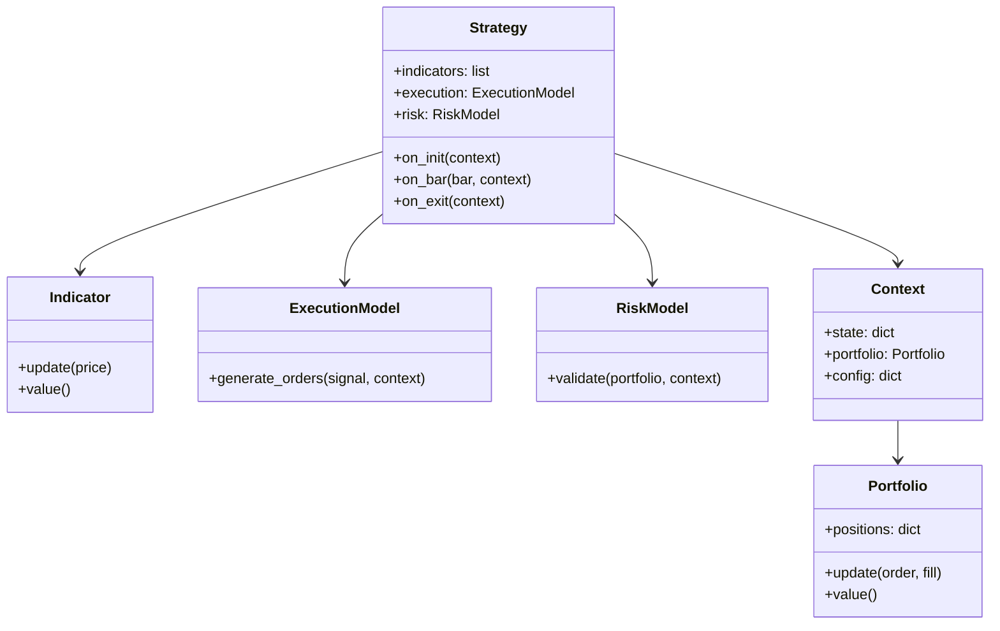

# OOP Strategy Framework (Target)

Target architecture for turning the backtest and trade pipeline into a composable
quant framework. Maps lecture-note abstractions to concrete modules in this repo.

See also: [Comparison to Pro Quant Firms](comparison.md) · [Pipeline](pipeline.md) ·
[Adding Strategies](../guides/adding-strategies.md) · [Trade Deployment Rollout](../design/trade-deployment-rollout.md)

!!! note "Target design — not fully implemented"
    Procedural paths (`signals.py`, `optimizer.py`, `TechnicalAnalysis`) remain
    the production path until migration completes. New code should follow these
    interfaces incrementally.

---

## Class diagram



| Class | Responsibility | Owns |
|-------|----------------|------|
| **Strategy** | Signal logic per bar; composes indicators, execution, risk | Lifecycle hooks only — no direct broker calls |
| **Indicator** | Stateful bar-by-bar computation | Single series; reusable in backtest + live |
| **ExecutionModel** | Turn signal → orders | Fill assumptions (market, limit, slippage) |
| **RiskModel** | Pre-trade validation | Position limits, leverage, drawdown |
| **Portfolio** | Positions, cash, PnL | Per-symbol map after Phase 2 |
| **Context** | Shared runtime state | Clock, config, portfolio reference |

---

## Folder structure (target)

```
quant/strategy/
├── base.py              # Strategy ABC / Protocol
├── context.py           # Context dataclass
├── portfolio.py         # Portfolio + Fill types
├── engine.py            # BacktestEngine: feed → strategy → execution → risk
├── signals.py           # (existing) procedural path + StrategyConfig JSON
├── indicators.py        # (existing) TechnicalAnalysis — delegates to package below
├── indicators/          # NEW — stateful indicator classes
│   ├── __init__.py
│   ├── base.py          # Indicator ABC
│   ├── sma.py
│   ├── ema.py
│   ├── rsi.py
│   ├── bollinger.py
│   ├── atr.py
│   └── macd.py
├── strategies/          # NEW — OOP strategy implementations
│   ├── __init__.py
│   ├── bollinger_momentum.py
│   ├── mean_reversion.py
│   └── registry.py      # name → class; mirrors REFDATA SIGNAL_TYPE
├── risk/                # NEW — backtest-time risk
│   ├── __init__.py
│   ├── base.py
│   └── max_drawdown.py
├── optimizer.py         # (existing) grid driver → calls engine
├── performance.py       # (existing) metrics; eventually reads Portfolio
├── walk_forward.py      # (existing) uses same engine on IS/OOS splits
└── backtest_service.py  # (existing) HTTP/CLI shell — unchanged API surface

quant/trade/
├── execution/           # NEW — live/paper execution models
│   ├── __init__.py
│   ├── base.py
│   ├── market.py
│   └── simulator.py     # fill simulator for paper without exchange
├── risk/                # NEW — pre-trade risk (live worker)
│   ├── __init__.py
│   └── position_limit.py
├── worker.py            # NEW — polls TRADE.DEPLOYMENT, runs Strategy bar loop
├── futu_trader.py       # (existing) broker adapter
└── ...
```

Keep **broker adapters** (`FutuTrader`, future Bybit) separate from **execution
models**. Adapters place orders; execution models decide *what* to place.

---

## Python skeletons

### Strategy base

```python
# quant/strategy/base.py
from __future__ import annotations

from abc import ABC, abstractmethod
from typing import Any

from quant.strategy.context import Context
from quant.strategy.indicators.base import Indicator
from quant.trade.execution.base import ExecutionModel
from quant.strategy.risk.base import RiskModel


class Strategy(ABC):
    """Bar-driven strategy — shared by backtest engine and trade worker."""

    indicators: list[Indicator]
    execution: ExecutionModel
    risk: RiskModel

    def __init__(
        self,
        *,
        indicators: list[Indicator],
        execution: ExecutionModel,
        risk: RiskModel,
    ) -> None:
        self.indicators = indicators
        self.execution = execution
        self.risk = risk

    @abstractmethod
    def on_init(self, context: Context) -> None: ...

    @abstractmethod
    def on_bar(self, bar: dict[str, Any], context: Context) -> float | None:
        """Return target signal (-1..1 or discrete); None = flat / no change."""
        ...

    @abstractmethod
    def on_exit(self, context: Context) -> None: ...
```

### Indicator base

```python
# quant/strategy/indicators/base.py
from __future__ import annotations

from abc import ABC, abstractmethod


class Indicator(ABC):
    @abstractmethod
    def update(self, price: float) -> None: ...

    @abstractmethod
    def value(self) -> float | None: ...

    def reset(self) -> None:
        """Optional — called on walk-forward window boundaries."""
```

### Execution and risk

```python
# quant/trade/execution/base.py
from abc import ABC, abstractmethod
from quant.strategy.context import Context


class ExecutionModel(ABC):
    @abstractmethod
    def generate_orders(self, signal: float, context: Context) -> list[dict]:
        """Return order dicts: symbol, side, qty, order_type, ..."""
        ...


# quant/strategy/risk/base.py
from abc import ABC, abstractmethod
from quant.strategy.context import Context
from quant.strategy.portfolio import Portfolio


class RiskModel(ABC):
    @abstractmethod
    def validate(self, portfolio: Portfolio, context: Context) -> bool:
        """False → block order generation for this bar."""
        ...
```

### Portfolio and context

```python
# quant/strategy/portfolio.py
from __future__ import annotations

from dataclasses import dataclass, field


@dataclass
class Portfolio:
    cash: float = 0.0
    positions: dict[str, float] = field(default_factory=dict)

    def update(self, order: dict, fill: dict) -> None:
        symbol = fill["symbol"]
        qty = fill["qty"] * (1 if fill["side"] == "BUY" else -1)
        self.positions[symbol] = self.positions.get(symbol, 0.0) + qty
        self.cash -= fill["price"] * fill["qty"]

    def value(self, marks: dict[str, float]) -> float:
        equity = self.cash
        for sym, qty in self.positions.items():
            equity += qty * marks.get(sym, 0.0)
        return equity


# quant/strategy/context.py
from __future__ import annotations

from dataclasses import dataclass, field
from datetime import datetime

from quant.strategy.portfolio import Portfolio


@dataclass
class Context:
    portfolio: Portfolio
    config: dict
    clock: datetime | None = None
    state: dict = field(default_factory=dict)
```

### Backtest engine (orchestrator)

```python
# quant/strategy/engine.py
from quant.strategy.base import Strategy
from quant.strategy.context import Context


class BacktestEngine:
    def run(self, strategy: Strategy, bars: list[dict], context: Context) -> Context:
        strategy.on_init(context)
        for bar in bars:
            context.clock = bar["timestamp"]
            signal = strategy.on_bar(bar, context)
            if signal is None:
                continue
            if not strategy.risk.validate(context.portfolio, context):
                continue
            orders = strategy.execution.generate_orders(signal, context)
            for order in orders:
                fill = self._simulate_fill(order, bar)  # MarketExecution first
                context.portfolio.update(order, fill)
        strategy.on_exit(context)
        return context
```

---

## Migration: procedural → OOP

Migrate **one path at a time**. Do not big-bang replace `optimizer.py`.

| Step | Action | Risk |
|------|--------|------|
| 1 | Add `base.py`, `context.py`, `portfolio.py` — no callers yet | None |
| 2 | Add `indicators/ema.py`; make `TechnicalAnalysis.get_ema` delegate | Low — same outputs |
| 3 | Wrap one strategy (Bollinger momentum) as OOP class + `registry.py` | Low — run both paths in unit test |
| 4 | Add `engine.py`; run single-param backtest beside optimizer; diff metrics | Medium |
| 5 | Point `walk_forward.py` at `BacktestEngine` for IS/OOS splits | Medium |
| 6 | Wire worker optimize to engine (optional flag in `CONFIG_JSON`) | Medium |
| 7 | Add `quant/trade/execution/market.py`; trade worker uses same Strategy | High — paper only first |
| 8 | Deprecate direct `SignalDirection` calls once all REFDATA strategies migrated | Low after 7 |

**Compatibility rule:** `StrategyConfig.to_json()` / `from_json()` remain the
persistence format for `BT.STRATEGY.CONFIG_JSON`. OOP strategies deserialize
config into indicator periods and thresholds — no schema migration required.

**REFDATA:** `SIGNAL_TYPE.FUNC_NAME` today points at procedural functions.
Phase 1 adds parallel `CLASS_NAME` column (or convention: `oop:<registry_key>`)
when ready — seed in Liquibase, not hardcoded in Python.

---

## Implementation plan (sequenced)

Realistic phases with effort estimates. Items marked **parallel** do not block Phase 1.

| Phase | Duration | Goal | Deliverables |
|-------|----------|------|--------------|
| **1 — OOP core** | 1–2 weeks | Real quant framework | Strategy / Indicator / Execution / Risk bases; Portfolio + Context; engine refactor |
| **2 — Multi-asset** | ~1 week | Per-symbol bars and positions | `on_bar(dict[symbol→bar])`; portfolio map; execution routing |
| **3 — Walk-forward gate** | 2–3 days | OOS Sharpe HARD promotion | Worker persists OOS metrics; `REFDATA.PROMOTION_METRIC`; rejection logging |
| **4 — Paper trading** | 1–2 weeks | backtest → paper → live | Trade worker, fill simulator, reconciliation, promotion rule |
| **5 — Strategy expansion** | Ongoing | Pipeline stress-test | Mean reversion, breakout, trend, multi-asset variants |

### Phase 1 checklist

- [ ] `quant/strategy/base.py` — Strategy ABC
- [ ] `quant/strategy/indicators/base.py` + EMA, SMA, RSI, Bollinger, ATR, MACD
- [ ] `quant/trade/execution/base.py` + `market.py`
- [ ] `quant/strategy/risk/base.py` + max-drawdown stub
- [ ] `quant/strategy/portfolio.py`, `context.py`
- [ ] `quant/strategy/engine.py` — refactor optimizer to call engine
- [ ] Unit tests: indicator parity vs `TechnicalAnalysis`; engine vs legacy metrics

### Parallel track (no OOP dependency)

These can ship while Phase 1 is in progress:

- **Phase 3** walk-forward gate — uses existing `walk_forward.py` + promotion evaluator
- **Trade 1.6–1.7** — strategy picker + paper apply ([rollout doc](../design/trade-deployment-rollout.md))
- **Phase 5 (procedural)** — new `SIGNAL_TYPE` rows + `signals.py` functions

---

## What we have vs what we need

### Already in place

| Area | Evidence |
|------|----------|
| Infra / CI/CD | GitHub Actions deploy, Docker, ECR, SSM secrets |
| Database discipline | Stored procedures, Liquibase, soft-versioning, audit columns |
| Promotion pipeline | `quant/promotion/`, REFDATA gates, auto-promote worker step |
| Documentation | MkDocs wiki, design docs, decisions log |
| Queue system | `BT.QUEUE`, worker loop, rate limits |
| Deployment automation | Trade tab, `TRADE.DEPLOYMENT`, Promotion → Deploy |
| Walk-forward math | `quant/strategy/walk_forward.py` (not yet a promotion gate) |
| Broker paper mode | `FutuTrader(paper=True)` |

### Still needed

| Area | Unblocks |
|------|----------|
| OOP strategy layer | Shared backtest + live; indicator reuse |
| Multi-asset | 5–10 crypto pairs, portfolio construction |
| Paper trading worker | Lifecycle gate backtest → paper → live |
| More strategies | Research surface area |
| Execution models | Realistic fills, then TWAP/VWAP |
| Live risk models | Pre-trade checks beyond promotion gates |

Once Phase 1–4 land, the system behaves like a **mini systematic fund** rather
than a notebook-style hobby repo — same lifecycle shape as mid-tier shops, at
smaller scale.

---

## Related docs

| Topic | Page |
|-------|------|
| Gap analysis vs pro firms | [Comparison](comparison.md) |
| Promotion HARD/SOFT gates | [Best-VID Promotion](../design/best-vid-promotion.md) |
| Trade apply without queue changes | [Trade Deployment Rollout](../design/trade-deployment-rollout.md) |
| Futu OOP adapter (today) | [Futu Trading](../design/futu-trading.md) |
