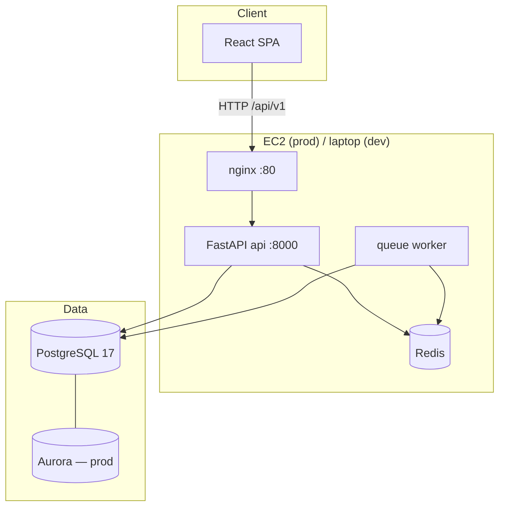
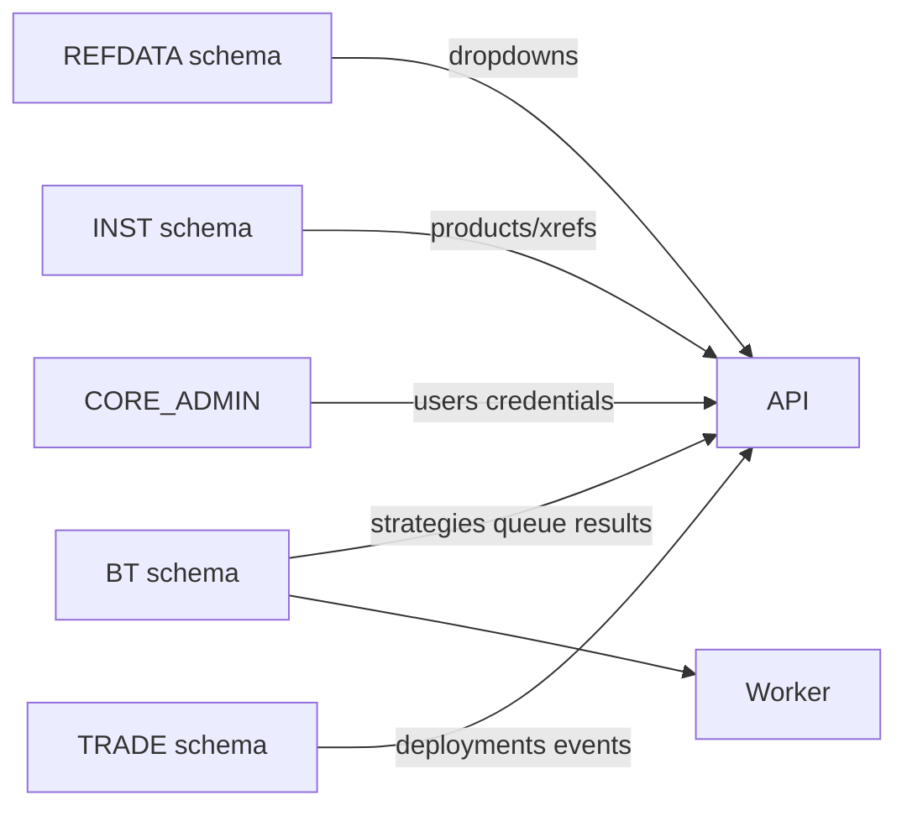

# System Overview

Quant Strategies is a **backtest + trade** platform: researchers configure multi-factor strategies in a React SPA, run grid-search jobs via a Postgres-backed queue, and (Phase 1+) deploy pinned strategy versions to exchange accounts.

For an honest comparison to professional quant firms, a phased implementation plan,
and OOP target architecture, see [Comparison to Pro Quant Firms](comparison.md)
and [OOP Strategy Framework](oop-framework.md).

---

## High-level architecture



| Layer | Technology | Role |
|-------|------------|------|
| **Frontend** | React 19, Vite, MUI, TanStack Query | Backtest UI + Trade UI (config, apply, deployments) |
| **API** | FastAPI, uvicorn | Auth, backtest, jobs, REFDATA, instruments, trade, credentials |
| **Worker** | `quant.queue.worker_loop` | Claims `BT.QUEUE` rows, runs optimize, writes `BT.RESULT` |
| **Cache** | Redis | REFDATA snapshots (`refdata:*`), queue wake channel |
| **Database** | PostgreSQL 17 (Aurora prod) | REFDATA, BT, TRADE, INST, CORE_ADMIN |
| **Secrets** | SSM Parameter Store | JWT, DB creds, Fernet key for exchange API keys |
| **Deploy** | Docker Compose + ECR + GitHub Actions | `quant-app`, `quant-nginx` images on EC2 |

Deep dives: [Pipeline](pipeline.md) · [API](api.md) · [Frontend](frontend.md) · [Database](database.md) · [Infrastructure](infrastructure.md) · [Dev vs Prod](dev-vs-prod.md)

---

## Repository layout

```
quant/                          # Python package
├── api/                        # FastAPI — HTTP only
│   ├── main.py                 # App factory, lifespan, router registration
│   ├── auth/                   # Login, JWT cookie, require_user
│   ├── credentials/            # Phase 1.1 — exchange API keys (Fernet)
│   ├── routers/                # backtest, jobs, refdata, inst, deployments
│   ├── services/               # jobs enqueue/list
│   └── deps.py                 # DataCaches dependency
├── refdata/                    # Redis REFDATA publisher + reader
├── data/                       # sources, instruments, backtest cache
├── strategy/                   # indicators, signals, performance, optimizer (runtime)
├── queue/                      # worker + BT.QUEUE repo
├── trade/                      # deployment service + TradeRepo
└── shared/                     # config, db gateway, secrets_crypto, logging

frontend/src/                   # React SPA
db/liquidbase/                  # Liquibase DDL per schema
aws/cfn/                        # CloudFormation
docker-compose*.yml             # prod stack
scripts/                        # appctl, dbctl, liquibase-deploy
```

---

## Product surfaces

| Surface | Routes | Backend prefix |
|---------|--------|----------------|
| **Backtest** | `/backtest` | `/api/v1/backtest/*`, `/api/v1/backtest/jobs/*` |
| **Trade — Config** | `/trade/config` | `/api/v1/credentials` |
| **Trade — Apply** | `/trade/apply` | `/api/v1/trade/deployments`, `/api/v1/strategies` (1.6) |
| **Shared** | all authenticated pages | `/api/v1/refdata/*`, `/api/v1/inst/*` |

UI mode does **not** change URL prefixes — each page calls the appropriate API.

---

## Data domains



| Schema | Tables (high level) | Written by |
|--------|---------------------|------------|
| `REFDATA` | `APP`, `INDICATOR`, `SIGNAL_TYPE`, … | Liquibase seeds; read via Redis |
| `INST` | `PRODUCT`, `PRODUCT_XREF`, … | Admin / bootstrap |
| `BT` | `STRATEGY`, `QUEUE`, `RESULT`, `API_REQUEST` | Jobs API, worker, backtest cache |
| `CORE_ADMIN` | `APP_USER`, `API_CREDENTIAL` | Auth + credentials API |
| `TRADE` | `DEPLOYMENT`, `EXECUTION_EVENT`, `TRANSACTION` | Deployments API (apply path 1.7+) |

All application **writes** go through stored procedures — see [Database](database.md).

---

## Authentication & secrets

| Secret | Env / SSM | Used by |
|--------|-----------|---------|
| `JWT_SECRET` | `/quant/<env>/JWT_SECRET` | Session cookie (`qs_token`) |
| `EXCHANGE_SECRETS_KEY` | `/quant/prod/EXCHANGE_SECRETS_KEY` | Fernet encrypt for `API_CREDENTIAL` (**required in prod**) |
| `QUANTDB_*` | SSM | Postgres connection |

Prod **fail-fast** if `EXCHANGE_SECRETS_KEY` is missing at API boot. Dev auto-generates an ephemeral key with a warning.

See [Login design](../design/login.md) and [Plan to Profit §5.5](../design/plan-to-profit.md#55-auth-security-guardrails).

---

## Phase 1 progress (Trade pipeline)

| Phase | Status | Deliverable |
|-------|--------|-------------|
| 1.1 User secrets | **done** | `/api/v1/credentials`, Fernet, `CORE_ADMIN.API_CREDENTIAL` |
| 1.2 Trade schema + apply API | **done** | `TRADE.DEPLOYMENT`, `/api/v1/trade/deployments` |
| 1.3 Bybit dry run | planned | Adapter validates keys; no live orders |
| 1.4 Trade UI shell | **done** | `TradeLayout`, toolbar, routes |
| 1.5 Exchange config UI | **done** | Accounts table, add/rotate/revoke |
| 1.6 Strategy picker | planned | `GET /api/v1/strategies` + `StrategyPicker` |
| 1.7 Live apply | planned | Dry-run → apply with ownership checks |
| 1.8 Execution log | planned | Events UI + `EXECUTION_EVENT` writes |

Roadmap: [Plan to Profit](../design/plan-to-profit.md)

---

## Runtime topologies

### Production (EC2)

```
docker compose -f docker-compose.yml -f docker-compose.prod.yml up -d
```

| Container | Image | Notes |
|-----------|-------|-------|
| `quant-nginx` | ECR `quant-nginx` | Serves SPA; proxies `/api` → api |
| `quant-api` | ECR `quant-app` | uvicorn, 2 workers; `/health/ready` = DB ping |
| `quant-worker` | ECR `quant-app` | `python -m quant.queue.worker_loop`; starts after api healthy |
| `quant-redis` | `redis:7-alpine` | REFDATA + queue wake |

Liquibase is **manual** on deploy — not run by CI. See [Database § Deployment](database.md#deployment).

### Local development

**Default:** SSM tunnel to Aurora on `localhost:5433`, uvicorn + Vite on host.

**Optional:** `DB_TARGET=local` → Postgres 17 on `:5432`, Redis + worker via `docker-compose.dev.yml`. See [Dev vs Prod](dev-vs-prod.md).

---

## Key design boundaries

| Concern | Where it lives | Do not |
|---------|----------------|--------|
| Backtest **signal type** dropdown | REFDATA `SIGNAL_TYPE` + `FactorCard` | Confuse with `BT.STRATEGY` catalog |
| Persisted **strategy** for trade | `BT.STRATEGY` + `/api/v1/strategies` (1.6) | Reuse ConfigDrawer for picker |
| Exchange **credentials** | `CORE_ADMIN.API_CREDENTIAL` + `/api/v1/credentials` | Cache in Redis |
| **REFDATA** dropdowns | Redis via `RefDataPublisher` | Query Postgres from handlers |
| **DB writes** | Stored procedures via `DbGateway` | Raw INSERT/UPDATE/DELETE from Python |

---

## Related docs

- [Trade API](../design/trade-api.md) — deployment and strategy endpoint specs
- [Backtest Queue](../design/backtest-queue.md) — worker and `BT.QUEUE` state machine
- [Plan to Profit](../design/plan-to-profit.md) — phased roadmap to live trading
- [User isolation](../design/user-isolation.md) — `APP_USER_ID` vs `USER_ID`, enforcement matrix, Phase 1.7 requirements
