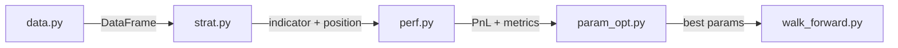

# Pipeline Architecture

## Data Flow



```
data.py ──► strat.py ──► perf.py ──► param_opt.py ──► walk_forward.py
  │            │           │              │                  │
  │            │           │              │                  └─ Split data into in-sample / out-of-sample,
  │            │           │              │                     optimize on IS, evaluate on OOS, report
  │            │           │              │                     overfitting ratio
  │            │           │              │
  │            │           │              └─ N-dimensional grid search over param_grid
  │            │           │                 (window, signal, factor, indicator, strategy),
  │            │           │                 returns best Sharpe
  │            │           │
  │            │           └─ Computes PnL, cumulative return, drawdown,
  │            │              Sharpe, Calmar vs buy-and-hold benchmark
  │            │
  │            └─ TechnicalAnalysis: calculates indicator values (SMA, EMA, RSI,
  │               Bollinger Z, Stochastic) on the factor column.
  │               SignalDirection: generates position array {-1, 0, 1} from
  │               indicator vs threshold signal.
  │
  └─ Fetches daily close prices from YahooFinance (or AlphaVantage/Glassnode/FutuOpenD)
```

`main.py` orchestrates the full flow.

## Module Responsibilities

| Module | Class / Function | Role |
|--------|-----------------|------|
| `data.py` | `YahooFinance`, `AlphaVantage`, `Glassnode`, `FutuOpenD` | Fetch OHLCV data, return normalized DataFrame |
| `strat.py` | `TechnicalAnalysis` | Calculate indicator values on the `factor` column |
| `strat.py` | `SignalDirection` | Generate position array `{-1, 0, 1}` from indicator vs threshold |
| `strat.py` | `StrategyConfig`, `SubStrategy` | Immutable config carrying strategy identity |
| `strat.py` | `combine_positions()` | AND / OR / FILTER conjunction logic with strength-based tiebreak |
| `perf.py` | `Performance` | PnL engine — single or multi-factor, with transaction costs |
| `param_opt.py` | `ParametersOptimization` | Grid search (Cartesian or Optuna TPE/Grid sampler) |
| `walk_forward.py` | `WalkForward` | IS/OOS split, optimize on IS, evaluate on OOS |
| `trade.py` | `FutuTrader` | Paper/live order execution via Futu OpenD |

## Multi-Factor Flow

For multi-factor backtests, the pipeline computes each factor independently, then combines:

1. For each `SubStrategy` in `config.substrategies`:
     - Set `data['factor'] = data[sub.data_column]` (e.g. price or volume)
     - Compute indicator → position array
2. Call `combine_positions(positions, conjunction)`:
     - **AND** — position taken only when all factors agree; strength-based tiebreak via `np.searchsorted` percentile rank
     - **OR** — position taken when any factor signals; strongest signal wins
     - **FILTER** — factor 1 is a gate (must be non-zero); factor 2 provides direction
3. Compute PnL from the combined `FinalPosition` column
