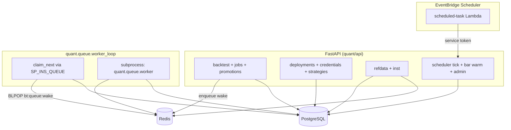
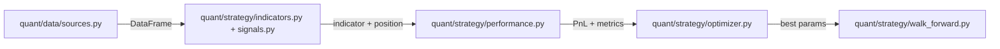

# Pipeline Architecture

See also [System Overview](overview.md) for the full stack (API, worker, Redis, schemas).

## System context


```mermaid
flowchart TB
  subgraph HTTP["FastAPI (quant/api)"]
    BT_R[backtest + jobs + promotions]
    TR_R[deployments + credentials + strategies]
    RD[refdata + inst]
    SCH[scheduler tick + bar warm + admin]
  end

  subgraph Worker["quant.queue.worker_loop"]
    CL[claim_next via SP_INS_QUEUE]
    SP[subprocess: quant.queue.worker]
  end

  subgraph Lambda["EventBridge Scheduler"]
    LBD[scheduled-task Lambda]
  end

  REDIS[(Redis)]
  PG[(PostgreSQL)]

  LBD -->|service token| SCH
  BT_R --> PG
  TR_R --> PG
  RD --> REDIS
  RD --> PG
  SCH --> PG
  CL --> PG
  SP --> PG
  SP --> REDIS
  BT_R -->|enqueue wake| REDIS
  CL -->|BLPOP bt:queue:wake| REDIS
```

## Backtest data flow


```mermaid
graph LR
    A[quant/data/sources.py] -->|DataFrame| B[quant/strategy/indicators.py + signals.py]
    B -->|indicator + position| C[quant/strategy/performance.py]
    C -->|PnL + metrics| D[quant/strategy/optimizer.py]
    D -->|best params| E[quant/strategy/walk_forward.py]
```

```
quant/data/sources.py ► quant/strategy/{indicators,signals}.py ► performance.py / objective.py ► optimizer.py ► walk_forward.py
  │                       │                                       │                │                │
  │                       │                                       │                │                └─ Split data into in-sample / out-of-sample,
  │                       │                                       │                │                   optimize on IS, evaluate on OOS, report
  │                       │                                       │                │                   overfitting ratio
  │                       │                                       │                │
  │                       │                                       │                └─ N-dimensional grid search over param_grid
  │                       │                                       │                   (window, signal, factor, indicator, strategy),
  │                       │                                       │                   returns best Sharpe
  │                       │                                       │
  │                       │                                       └─ Computes PnL, cumulative return, drawdown,
  │                       │                                          Sharpe, Calmar vs buy-and-hold benchmark
  │                       │
  │                       └─ TechnicalAnalysis (indicators.py): SMA, EMA, RSI, Bollinger Z, Stochastic on the factor column.
  │                          SignalDirection (signals.py): position array {-1, 0, 1} from indicator vs threshold.
  │
  └─ Fetches daily OHLCV from YahooFinance / AlphaVantage / Glassnode / NasdaqDataLink / FutuOpenD
```

`quant.cli` (entry point: `python -m quant.cli`) orchestrates the full flow.

## Module Responsibilities

| Module | Class / Function | Role |
|--------|-----------------|------|
| `quant/shared/db.py` | `DbGateway` | Sole owner of `psycopg` in `quant/`. Strict-OOP base — `_call_get` / `_call_write` / `_query` / `health_check` / `close`. `__init__(conninfo, user_id, *, persistent=False)` opts into a long-lived held connection. |
| `quant/refdata/reader.py` | `RedisRefData` | Read-only REFDATA accessor backed by Redis. Checks `refdata:version` on every `get()` and rebuilds its local snapshot lazily on bump. Typed resolvers (`resolve_app_id`, `resolve_queue_status_id`, `get_interval_period`, …) live here so callers never parse raw rows. |
| `quant/refdata/publisher.py` | `RefDataPublisher(DbGateway)` | The only Postgres → Redis writer for REFDATA. Discovers tables via `information_schema`, `CALL REFDATA.SP_GET_ENUM` per table, writes `refdata:<table>` + bumps `refdata:version`. Invoked from FastAPI lifespan and `POST /api/v1/refdata/refresh`. |
| `quant/refdata/bundle.py` | `DataCaches` | Composes `RedisRefData` + `InstrumentCache` + `BacktestCache` so API and worker wire identically. |
| `quant/data/backtest_cache.py` | `BacktestCache(DbGateway)` | BT schema read/write (`persistent=True`) — split API: `read_payload()` (read-only, raises `CacheMissError` on miss) and `refresh_payload(fetcher=...)` (fetches the full range and inserts a new `API_REQUEST` version; SP write failures propagate). |
| `quant/data/instruments.py` | `InstrumentCache(DbGateway)` | INST schema cache (`persistent=True`) — products + vendor-symbol xrefs, exposed via `/api/v1/inst/products`. |
| `quant/data/sources.py` | `YahooFinance`, `AlphaVantage`, `Glassnode`, `NasdaqDataLink`, `FutuOpenD` | Fetch OHLCV data, return normalized DataFrame. |
| `quant/market_data/repo.py` | `PriceBarRepo(DbGateway)` | MARKET_DATA SP wrappers (`persistent=True`) — coverage probe, range read, one-bar insert. |
| `quant/market_data/fetcher.py` | `CcxtBarFetcher` | Paginated public-data fetch (`fetch_bars`) over ccxt's `fetch_ohlcv`. No API credentials — bars are public data. |
| `quant/market_data/service.py` | `PriceBarService` | Freshness check, gap fill, and `read_bars()` in the same DataFrame shape `fetch_df` produces. `load_window()` composes the two for live apply and fails closed rather than signalling on an incomplete window. `find_gaps()` / `backfill()` repair continuity over an explicit range — the rolling lookback alone leaves permanent holes after a long outage — and report rather than raise. All reads scope to one `source_app_id`. |
| `quant/trade/bar_source.py` | `PriceBarServiceFactory`, `resolve_signal_source` | Binds a deployment's `APP_ID` to the venue its bars come from; one service per broker over a shared repo connection. `resolve_signal_source` states the venue-decides rule (#45) in one place so the live apply and the dry run cannot disagree about which series a signal came from. |
| `quant/shared/intervals.py` | `parse_period`, `floor_to_period`, `last_closed_bar`, `next_run_at`, `ccxt_timeframe` | Interval arithmetic from `REFDATA.TM_INTERVAL.PERIOD_LENGTH`; shared by price bars and the scheduler. Pure — the lookup is `RedisRefData.get_interval_period`. |
| `quant/strategy/indicators.py` | `TechnicalAnalysis` | Calculate indicator values on the `factor` column. |
| `quant/strategy/signals.py` | `SignalDirection` | Generate position array `{-1, 0, 1}` from indicator vs threshold. |
| `quant/strategy/signals.py` | `StrategyConfig`, `SubStrategy` | Immutable config carrying strategy identity. |
| `quant/strategy/signals.py` | `combine_positions()` | AND / OR / FILTER conjunction logic with strength-based tiebreak. |
| `quant/strategy/performance.py` | `Performance` | PnL engine — single or multi-factor, with transaction costs. Owns Sharpe sample size (`get_metric_n_obs`). Canonical path for metrics, equity curves, and live position. |
| `quant/strategy/objective.py` | `Objective`, `IndicatorCache` | Scalar Sharpe for the search loop — indicators cached by window, numpy PnL. Tested against `Performance`. |
| `quant/strategy/optimizer.py` | `ParametersOptimization`, `SearchStrategy` | Exhaustive Cartesian product (recorded into an optuna study) or Optuna TPE when `n_trials` is smaller than the space. See [backtest-speed.md](../design/backtest-speed.md). |
| `quant/strategy/walk_forward.py` | `WalkForward` | IS/OOS split, optimize on IS, evaluate on OOS. |
| `quant/trade/futu_trader.py` | `FutuTrader` | Paper/live order execution via Futu OpenD (CLI / legacy). |
| `quant/trade/service.py` | `TradeService` | Deployment create/list/apply — validates then calls `TradeRepo` SPs. |
| `quant/trade/db_repo.py` | `TradeRepo` | `CALL TRADE.SP_*` via `DbGateway`. |
| `quant/trade/live_apply.py` | `LiveApplyOrchestrator` | One live-apply cycle — signal, order, execution diary. |
| `quant/trade/dry_run.py` | `run_dry_run()` | Preflight without placing orders. |
| `quant/trade/account.py` | `fetch_account_snapshot()` | Live balances and positions from the exchange. |
| `quant/trade/registry.py` | `AdapterRegistry` | Resolves `APP_ID` → ccxt/Futu adapter. |
| `quant/trade/scheduler/sweep.py` | `ScheduleSweeper` | Hourly platform tick — one pass per interval. |
| `quant/trade/scheduler/tick.py` | `ScheduleTickRunner` | Apply one due deployment per interval pass. |
| `quant/market_data/warm.py` | `BarWarmer`, `InstrumentSource` | Pre-fetch bars for every series a deployment or a subscription wants. |
| `quant/market_data/subscriptions.py` | `BarSubscriptionRepo`, `BarSubscriptionService` | Capture requests with no deployment behind them, plus coverage and backfill. |
| `quant/strategy/live_service.py` | `bars_loader`, `load_window` | Live signal computation from `MARKET_DATA.PRICE_BAR`. |
| `quant/promotion/evaluate.py` | promotion gates | HARD/SOFT metric evaluation for auto-promote. |
| `quant/promotion/repo.py` | `PromotionRepo` | `CALL BT.SP_INS_PROMOTION` via `DbGateway`. |
| `quant/api/credentials/service.py` | `CredentialService` | Fernet encrypt/decrypt; masks keys in API responses (Phase 1.1). |
| `quant/api/credentials/repo.py` | `ApiCredentialRepo` | `CALL CORE_ADMIN.SP_*_API_CREDENTIAL` via `DbGateway`. |
| `quant/shared/secrets_crypto.py` | `CredentialCrypto` | Resolves `EXCHANGE_SECRETS_KEY` (prod fail-fast); Fernet wrapper. |
| `quant/cli.py` | `main()` | CLI entry point (`python -m quant.cli`) — orchestrates the full pipeline for single-symbol scripted runs. |
| `quant/queue/worker_loop.py` | `main()` | Long-lived daemon — orphan recovery, `claim_next`, spawn worker subprocesses, BLPOP wake channel. |
| `quant/queue/worker.py` | `WorkerRepo`, `main()` | Per-job backtest worker (`python -m quant.queue.worker <queue_id>`) — reads frozen `CONFIG_JSON`, runs optimize, writes `BT.RESULT`, drives `BT.QUEUE` terminal transitions. |

## Multi-Factor Flow

For multi-factor backtests, the pipeline computes each factor independently, then combines:

1. For each `SubStrategy` in `config.substrategies`:
     - Set `data['factor'] = data[sub.data_column]` (e.g. price or volume)
     - Compute indicator → position array
2. Call `combine_positions(positions, conjunction)`:
     - **AND** — position taken only when all factors agree; strength-based tiebreak via `np.searchsorted` percentile rank
     - **OR** — position taken when any factor signals; strongest signal wins
     - **FILTER** — factor 1 is the **Gate** (must be non-zero); factor 2 is the **Signal** (direction). The drawer labels the cards Gate / Signal; adding a second factor under FILTER inserts it as the gate.
3. Compute PnL from the combined `FinalPosition` column
