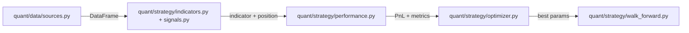

# Pipeline Architecture

## Data Flow


```mermaid
graph LR
    A[quant/data/sources.py] -->|DataFrame| B[quant/strategy/indicators.py + signals.py]
    B -->|indicator + position| C[quant/strategy/performance.py]
    C -->|PnL + metrics| D[quant/strategy/optimizer.py]
    D -->|best params| E[quant/strategy/walk_forward.py]
```

```
quant/data/sources.py ► quant/strategy/{indicators,signals}.py ► performance.py ► optimizer.py ► walk_forward.py
  │                       │                                       │                │                │
  │                       │                                       │                │                └─ Split data into in-sample / out-of-sample,
  │                       │                                       │                │                   optimize on IS, evaluate on OOS, report
  │                       │                                       │                │                   overfitting ratio
  │                       │                                       │                │
  │                       │                                       │                └─ N-dimensional grid search over param_grid
  │                       │                                       │                   (window, signal, factor, indicator, strategy),
  │                       │                                       │                   returns best Sharpe
  │                       │                                       │
  │                       │                                       └─ Computes PnL, cumulative return, drawdown,
  │                       │                                          Sharpe, Calmar vs buy-and-hold benchmark
  │                       │
  │                       └─ TechnicalAnalysis (indicators.py): SMA, EMA, RSI, Bollinger Z, Stochastic on the factor column.
  │                          SignalDirection (signals.py): position array {-1, 0, 1} from indicator vs threshold.
  │
  └─ Fetches daily OHLCV from YahooFinance / AlphaVantage / Glassnode / FutuOpenD
```

`quant.cli` (entry point: `python -m quant.cli`) orchestrates the full flow.

## Module Responsibilities

| Module | Class / Function | Role |
|--------|-----------------|------|
| `quant/shared/db.py` | `DbGateway` | Sole owner of `psycopg` in `quant/` + `api/`. Strict-OOP base — `_call_get` / `_call_write` / `_query` / `health_check` / `close`. `__init__(conninfo, user_id, *, persistent=False)` opts into a long-lived held connection. |
| `quant/refdata/reader.py` | `RedisRefData` | Read-only REFDATA accessor backed by Redis. Checks `refdata:version` on every `get()` and rebuilds its local snapshot lazily on bump. |
| `quant/refdata/publisher.py` | `RefDataPublisher(DbGateway)` | The only Postgres → Redis writer for REFDATA. Discovers tables via `information_schema`, `CALL REFDATA.SP_GET_ENUM` per table, writes `refdata:<table>` + bumps `refdata:version`. Invoked from FastAPI lifespan and `POST /api/v1/refdata/refresh`. |
| `quant/refdata/bundle.py` | `DataCaches` | Composes `RedisRefData` + `InstrumentCache` + `BacktestCache` so API and worker wire identically. |
| `quant/data/backtest_cache.py` | `BacktestCache(DbGateway)` | BT schema read/write (`persistent=True`) — two-mode `get_or_fetch_payload(refresh=False|True)`. Read-only mode raises `CacheMissError` on miss; refresh mode fetches the full range and inserts a new `API_REQUEST` version. |
| `quant/data/instruments.py` | `InstrumentCache(DbGateway)` | INST schema cache (`persistent=True`) — products + vendor-symbol xrefs, exposed via `/api/v1/inst/products`. |
| `quant/data/sources.py` | `YahooFinance`, `AlphaVantage`, `Glassnode`, `FutuOpenD` | Fetch OHLCV data, return normalized DataFrame. |
| `quant/strategy/indicators.py` | `TechnicalAnalysis` | Calculate indicator values on the `factor` column. |
| `quant/strategy/signals.py` | `SignalDirection` | Generate position array `{-1, 0, 1}` from indicator vs threshold. |
| `quant/strategy/signals.py` | `StrategyConfig`, `SubStrategy` | Immutable config carrying strategy identity. |
| `quant/strategy/signals.py` | `combine_positions()` | AND / OR / FILTER conjunction logic with strength-based tiebreak. |
| `quant/strategy/performance.py` | `Performance` | PnL engine — single or multi-factor, with transaction costs. |
| `quant/strategy/optimizer.py` | `ParametersOptimization` | Grid search (Cartesian or Optuna TPE/Grid sampler). |
| `quant/strategy/walk_forward.py` | `WalkForward` | IS/OOS split, optimize on IS, evaluate on OOS. |
| `quant/trade.py` | `FutuTrader` | Paper/live order execution via Futu OpenD. |
| `quant/cli.py` | `main()` | CLI entry point (`python -m quant.cli`) — orchestrates the full pipeline for single-symbol scripted runs. |
| `quant/queue/worker.py` | `WorkerRepo`, `main()` | Per-job backtest worker (`python -m quant.queue.worker <queue_id>`) — reads frozen `CONFIG_JSON`, runs optimize, writes `BT.RESULT`, drives `BT.QUEUE` terminal transitions. |

## Multi-Factor Flow

For multi-factor backtests, the pipeline computes each factor independently, then combines:

1. For each `SubStrategy` in `config.substrategies`:
     - Set `data['factor'] = data[sub.data_column]` (e.g. price or volume)
     - Compute indicator → position array
2. Call `combine_positions(positions, conjunction)`:
     - **AND** — position taken only when all factors agree; strength-based tiebreak via `np.searchsorted` percentile rank
     - **OR** — position taken when any factor signals; strongest signal wins
     - **FILTER** — factor 1 is a gate (must be non-zero); factor 2 provides direction
3. Compute PnL from the combined `FinalPosition` column
