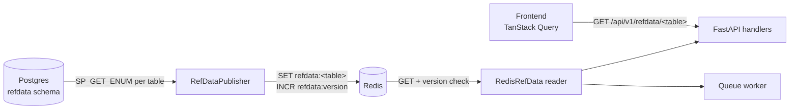

# REFDATA Cache

How reference data (config dimensions like indicators, strategies, asset types,
promotion rules) flows from Postgres → Redis → API handlers and the worker. This
is the mechanism behind the project rule that **all UI dropdown values come from
`REFDATA`, never hardcoded**.

See [FastAPI Backend](api.md) for the request surface and
[Database](database.md) for the `REFDATA` schema tables.

---

## Why

REFDATA enums change rarely and are admin-only, but they're read on nearly every
request (dropdowns, grid-search defaults, promotion gates). Rather than query
Postgres each time, the app publishes a JSON snapshot to Redis once at startup
and reads from there, with a version stamp so long-lived processes stay in sync
without polling the DB.

---

## Components

| Component | File | Role |
|-----------|------|------|
| Publisher | [`quant/refdata/publisher.py`](../../quant/refdata/publisher.py) (`RefDataPublisher`) | Discovers tables, calls `SP_GET_ENUM`, writes JSON to Redis, bumps version |
| Reader | [`quant/refdata/reader.py`](../../quant/refdata/reader.py) (`RedisRefData`) | Read-only accessor; version-checked local snapshot |
| Bundle | [`quant/refdata/bundle.py`](../../quant/refdata/bundle.py) (`DataCaches`) | Wires `RedisRefData` + instrument/backtest caches for handlers |
| Router | [`quant/api/routers/refdata.py`](../../quant/api/routers/refdata.py) | `GET /api/v1/refdata/{table}` + `POST /api/v1/refdata/refresh` |

---

## Redis keys

| Key | Contents |
|-----|----------|
| `refdata:<table>` | JSON array of rows for that REFDATA table (e.g. `refdata:indicator`) |
| `refdata:version` | Integer bumped on every publish; readers compare against it |
| `refdata:invalidate` | Pub/sub channel — best-effort fan-out notification (optional) |

---

## Publish (`RefDataPublisher.publish_all`)

1. **Discover** every base table in the `refdata` schema via `information_schema`
   (excluding the two Liquibase bookkeeping tables). This is the one place raw
   `SELECT` on a catalog is allowed.
2. **Fetch** each table through `CALL refdata.sp_get_enum(<table>)`. A failing
   table logs a warning and is published as an empty list rather than aborting
   the whole snapshot.
3. **Write atomically** in a single Redis `MULTI` pipeline: `SET refdata:<table>`
   for every table, then `INCR refdata:version` last — so all data lands before
   the version bump that triggers reader refresh.
4. **Fan-out** a best-effort `PUBLISH refdata:invalidate *` (non-fatal if it
   fails).

**When it runs:**

- FastAPI **startup** (`lifespan` in [`quant/api/main.py`](../../quant/api/main.py)) — seeds Redis before handlers serve.
- `POST /api/v1/refdata/refresh` — admin re-publish (any authenticated user today; no admin role yet).
- CLI: `python -m quant.refdata.publisher` for ad-hoc reseeding.

If Redis is unreachable at startup the publisher logs the failure but the server
still boots — REFDATA endpoints return **503** until a refresh succeeds, keeping
`/health` useful for diagnosis.

---

## Read (`RedisRefData`)

`get(table)` is the core accessor:

1. **`_check_version()`** — read `refdata:version`. If it differs from the
   locally cached version, **drop the local snapshot** so the next read rebuilds
   it lazily. This keeps long-lived API/worker processes in sync without pub/sub.
2. Return the cached rows, or **lazily load** the table from `refdata:<table>`.

Failure modes are deliberate and fail-fast (short 2s socket timeouts):

- Redis unreachable → `RuntimeError` (surfaces at the right log line, not at boot).
- Table key missing → `ValueError` ("publisher may not have run yet").
- Table present but empty → `ValueError` (an empty REFDATA table is a config bug).

### Typed resolvers

Beyond raw `get(table)`, the reader exposes domain helpers used across the app:

| Method | Returns |
|--------|---------|
| `get_indicator_defaults()` | `{method_name: {win_min, win_max, win_step, sig_min, sig_max, sig_step, is_bounded_ind}}` — grid-search defaults |
| `resolve_app_id(name)` | Broker `app_id` for a name |
| `resolve_app_metric_id(app_id, metric_nm)` | Metric id for a broker |
| `resolve_queue_status_id(name)` | Queue status id (raises if missing) |
| `get_promotion_metrics()` | `PROMOTION_METRIC` rows sorted by priority |
| `get_promotion_states()` / `validate_promotion_state(name)` | Valid promotion-state names |

---

## Frontend

The SPA fetches `GET /api/v1/refdata/{table}` and caches client-side with
TanStack Query (stale-while-revalidate). There is **no TTL** server-side —
changes are rare and admin-triggered via the refresh endpoint.

---

## Adding a new REFDATA table

1. Create the table under the `refdata` schema (Liquibase — see the
   [db-ddl](../../.github/skills/db-ddl/SKILL.md) conventions) and ensure
   `REFDATA.SP_GET_ENUM` returns its rows.
2. Seed rows via a Liquibase `<sql>` changeset.
3. Nothing else is required for publish — `_discover_tables()` picks it up
   automatically on the next startup or `POST /api/v1/refdata/refresh`.
4. Consume it via `caches.refdata.get("<table>")` in a handler, or add a typed
   resolver to `RedisRefData` if it needs domain logic.

---

## Related

- [FastAPI Backend](api.md) — endpoint catalogue and cache wiring
- [Database](database.md) — `REFDATA` schema tables
- [Decisions](../decisions.md) — REFDATA as single source of truth for UI dropdowns
