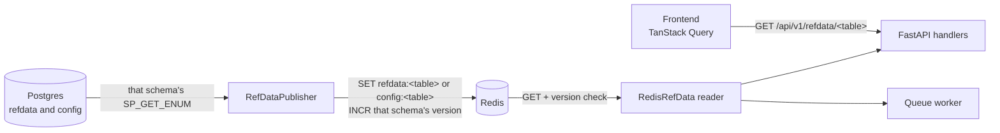

# REFDATA Cache

How reference data (config dimensions like indicators, strategies, asset types,
promotion rules) flows from Postgres → Redis → API handlers and the worker. This
is the mechanism behind the project rule that **all UI dropdown values come from
`REFDATA`, never hardcoded**.

See [FastAPI Backend](api.md) for the request surface and
[Database](database.md) for the `REFDATA` schema tables.

---

## Why

REFDATA enums change rarely and are admin-only, but they're read on nearly every
request (dropdowns, grid-search defaults, promotion gates). Rather than query
Postgres each time, the app publishes a JSON snapshot to Redis once at startup
and reads from there, with a version stamp so long-lived processes stay in sync
without polling the DB.



---

## Components

| Component | File | Role |
|-----------|------|------|
| Publisher | `quant/refdata/publisher.py` (`RefDataPublisher`) | Discovers tables, calls `REFDATA.SP_GET_ENUM` or `CONFIG.SP_GET_ENUM`, writes JSON to Redis, bumps version |
| Reader | `quant/refdata/reader.py` (`RedisRefData`) | Read-only accessor; version-checked local snapshot |
| Bundle | `quant/refdata/bundle.py` (`DataCaches`) | Wires `RedisRefData` + instrument/backtest caches for handlers |
| Router | `quant/api/routers/refdata.py`, `quant/api/routers/config.py` | `GET /api/v1/refdata/{table}` and `POST /api/v1/refdata/refresh` for catalogs. `GET /api/v1/config/{table}` and `POST /api/v1/config/refresh` for policy rows. |

---

## Redis keys

| Key | Contents |
|-----|----------|
| `refdata:<table>` | JSON array of rows for that REFDATA catalog (e.g. `refdata:indicator`) |
| `refdata:version` | Integer bumped when REFDATA is published; readers drop only catalog rows |
| `refdata:invalidate` | Pub/sub channel for the catalog snapshot |
| `config:<table>` | JSON array of rows for that CONFIG policy table (e.g. `config:promotion_metric`) |
| `config:version` | Integer bumped when CONFIG is published; readers drop only policy rows |
| `config:invalidate` | Pub/sub channel for the policy snapshot |

---

## Publish (`RefDataPublisher.publish_all`)

1. **Discover** every base table in the `refdata` and `config` schemas via `information_schema`
   (excluding the two Liquibase bookkeeping tables). This is the one place raw
   `SELECT` on a catalog is allowed.
2. **Fetch** each catalog through `CALL refdata.sp_get_enum(<table>)` and each
   policy table through `CALL config.sp_get_enum(<table>)`. A failing
   table logs a warning and is published as an empty list rather than aborting
   the whole snapshot.
3. **Write atomically** in a single Redis `MULTI` pipeline: `SET refdata:<table>`
   or `SET config:<table>` for every table in that schema, drop any other key
   under the same prefix, then `INCR` that schema's version — so the snapshot
   is exactly the tables in the schema before the stamp that drops it.
4. **Fan-out** a best-effort `PUBLISH` on `refdata:invalidate` and
   `config:invalidate` (non-fatal if it fails).

**When it runs:**

- FastAPI **startup** (`lifespan` in `quant/api/main.py`) — seeds Redis before handlers serve.
- `POST /api/v1/refdata/refresh` — rewrites the catalog snapshot.
- `POST /api/v1/config/refresh` — rewrites the policy snapshot.
- CLI: `python -m quant.refdata.publisher` for ad-hoc reseeding.

If Redis is unreachable at startup the publisher logs the failure but the server
still boots — REFDATA endpoints return **503** until a refresh succeeds, keeping
`/health` useful for diagnosis.

---

## Read (`RedisRefData`)

`get(table)` is the core accessor:

1. **`_check_version(schema)`** — read `refdata:version` or `config:version`.
   If it differs from the locally cached stamp, **drop that schema's rows**
   so the next read rebuilds them. The other schema's rows stay.
2. Return the cached rows, or **lazily load** the table from `refdata:<table>`
   or `config:<table>`.

Failure modes are deliberate and fail-fast (short 2s socket timeouts):

- Redis unreachable → `RuntimeError` (surfaces at the right log line, not at boot).
- Table key missing → `ValueError` ("publisher may not have run yet").
- Table present but empty → `ValueError` (an empty REFDATA table is a config bug).

### Typed resolvers

Beyond raw `get(table)`, the reader exposes domain helpers used across the app:

| Method | Returns |
|--------|---------|
| `get_indicator_defaults()` | `{method_name: {win_min, win_max, win_step, sig_min, sig_max, sig_step, is_bounded_ind}}` — grid-search defaults |
| `resolve_app_id(name)` | Broker `app_id` for a name |
| `resolve_app_metric_id(app_id, metric_nm)` | Metric id for a broker |
| `resolve_queue_status_id(name)` | Queue status id (raises if missing) |
| `get_promotion_metrics()` | `PROMOTION_METRIC` rows sorted by priority |
| `get_promotion_states()` / `validate_promotion_state(name)` | Valid promotion-state names |

---

## Frontend

The SPA fetches catalogs with `GET /api/v1/refdata/{table}` and policy rows
with `GET /api/v1/config/{table}` (`usePromotionMetrics` calls
`promotion_metric`). TanStack Query keys are `['refdata', …]` and
`['config', …]`. There is **no TTL** server-side. `POST /api/v1/refdata/refresh`
rewrites catalogs. `POST /api/v1/config/refresh` rewrites policy rows.

---

## Adding a new REFDATA table

1. Create the table under the `refdata` schema (Liquibase — see the
   db-ddl (`.github/skills/db-ddl/SKILL.md`) conventions) and ensure
   `REFDATA.SP_GET_ENUM` returns its rows.
2. Seed rows via a Liquibase `<sql>` changeset.
3. Nothing else is required for publish — `_discover_tables()` picks it up
   automatically on the next startup or `POST /api/v1/refdata/refresh`.
4. Consume it via `caches.refdata.get("<table>")` in a handler, or add a typed
   resolver to `RedisRefData` if it needs domain logic.

## Adding a CONFIG policy table

1. Create the table under the `config` schema. `CONFIG.SP_GET_ENUM` returns
   its rows.
2. `POST /api/v1/config/refresh` publishes it. Startup `publish_all()` does too.
3. Read it with `caches.refdata.get_config("<table>")` or
   `GET /api/v1/config/{table}`.

---

## After REFDATA changes in production

REFDATA is one **cache layer** on top of Aurora. Seeds that reference new Python
symbols (e.g. `FUNC_NAME_BAND = momentum_band_signal_long_only`) also require a
**`quant-app` deploy** — refreshing Redis alone leaves the worker on old code.
See **[Production Rollout](../guides/prod-rollout.md)** for the full five-layer
checklist (Aurora, containers, Redis, nginx, browser), partial-deploy failure
modes, SSO, and agent approval.

**Refresh prod Redis only** (when Aurora already has the rows and `quant-app` is
current):

```bash
# Logged into prod site:
curl -X POST "https://<your-domain>/api/v1/refdata/refresh" -b "qs_token=…"

# Or on EC2 (requires aws sso login — see prod-rollout guide):
docker exec quant-api python -m quant.refdata.publisher
```

Verify: `refdata:version` and `config:version` incremented, and `GET refdata:<table>` or `GET config:<table>` matches Aurora.

---

## Related

- [Production Rollout](../guides/prod-rollout.md) — Aurora + containers + Redis + nginx sync
- [FastAPI Backend](api.md) — endpoint catalogue and cache wiring
- [Database](database.md) — `REFDATA` schema tables
- [Decisions](../decisions.md) — REFDATA as single source of truth for UI dropdowns
