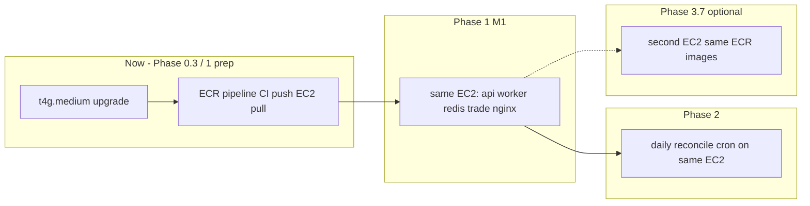

# Phase 0.3 — Deploy Topology Decision

**Date:** 2026-05-20  
**Depends on:** [Phase 0.2 capacity](phase-0.2-capacity.md)  
**Blocks:** Phase 3.7 (optional TRADE host / ECR split) only — not Phase 1.

---

## Decisions (summary)

| Question | Decision |
|----------|----------|
| **TRADE executor (Phase 1.7) — where?** | **Same EC2** (`quant-server`) after **t4g.medium** RAM upgrade |
| **ECR / CI build pipeline — when?** | **Now** — adopt ECR pull deploy before Phase 1 app work lands (see [deploy-build-pipeline.md](deploy-build-pipeline.md)) |
| **Separate TRADE host — when?** | **Phase 3.7 only** if t4g.medium proves tight in production |
| **Daily Sharpe reconcile (Phase 2.2) — where?** | **Same EC2** — cron / one-shot container on `quant-server` |
| **Reconcile vs trade executor — same box?** | **Yes** on upgraded host; stagger reconcile off peak hours |

---

## 1. TRADE on same EC2 vs separate host vs ECR

### Chosen path: same host + RAM upgrade (Phase 1)

For **M1 (profit pipeline)** — Trade tab, dry-run, live apply, execution log:

```
quant-server (EC2 t4g.medium, 4 GiB)
├── nginx
├── api (FastAPI)
├── worker (queue worker_loop)
├── redis
├── trade          ← NEW compose service (Phase 1.7)
└── (optional) certbot
```

**Why same host for Phase 1**

- One deploy surface (`docker compose pull` + ECR tags via GitHub Actions → SSM).
- No second EIP, SG rules, or cross-host secret sync yet.
- Phase 0.2: t4g.small is **NO** for +1 trade worker; **t4g.medium (4 GiB)** is enough for api + worker + redis + trade + reconcile cron with normal overlap.
- Phase 0.1 **WATCH**: dry-run and paper paths can proceed; live apply stays gated on strategy health + Phase 2 reconcile anyway.

**Action before Phase 1.7 live apply**

1. CFN stack update: `InstanceType` → `t4g.medium` in `aws/params/prod.json` (**done in repo**; apply via `bash aws/deploy.sh compute` or push to `main` to trigger CI).
2. **ECR pipeline live:** `00-ecr.yml` stack, CI `buildx` push, EC2 pull-only deploy (no `docker compose build` on prod).
3. Add `trade` service to `docker-compose.yml` (or prod overlay) when adapter exists — reuses app `Dockerfile` / same ECR `quant-app` image.
4. Run `aws/scripts/capacity_snapshot.sh` after upgrade to confirm headroom.

### Deferred: separate TRADE host (Phase 3.7)

Revisit **only if** post-upgrade live capture shows sustained memory &gt; 85% with trade + one backtest child, or ops wants hard isolation between research queue and live execution.

Then: second small EC2 pulling the same ECR images — see §2 in [deploy-build-pipeline.md](deploy-build-pipeline.md#ecr-implementation-checklist-file-by-file).

### ECR deploy pipeline (adopted now)

Prod deploy **does not build on EC2**. Full file-by-file checklist: [deploy-build-pipeline.md § ECR implementation checklist](deploy-build-pipeline.md#ecr-implementation-checklist-file-by-file).

---

## 2. ECR timing (deploy pipeline + TRADE images)

| Milestone | ECR scope |
|-----------|-----------|
| **Now (Phase 0.3 → Phase 1 prep)** | **ECR on.** CFN repos, CI `build-and-push`, EC2 `pull` + `up` only. Cut over from build-on-EC2 in one deploy (keep prior git SHA tag for rollback). |
| **Phase 1.7+** | New `trade` compose service uses existing **`quant-app`** ECR image (different `command:`). |
| **Phase 3.7 (if needed)** | Same ECR repos on a **second EC2** — no new registry |

**Rationale:** Direct ECR avoids coupling Phase 1 delivery to fragile on-host builds; cost/complexity is bounded (two repos, one workflow change).

Resolves open decision **#4** in [plan-to-profit.md](plan-to-profit.md) §8.

---

## 3. Daily Sharpe reconcile (Phase 2.2) — host placement

**Same EC2 as API and trade executor.**

| Property | Detail |
|----------|--------|
| Runtime | Cron on host **or** `docker compose run --rm api python -m …` once daily |
| Image | Reuse FastAPI app image (has DB + pipeline deps) |
| Duration | Minutes per day |
| RAM | ~50–150 MiB while running (Phase 0.2: **YES** even on t4g.small) |
| Schedule | Off-peak UTC (e.g. 00:30) — avoid overlap with heavy queue jobs if possible |

Reconcile reads `TRADE.LOG` / deployment snapshots — co-locating with Postgres access path (SSM + same VPC as Aurora) keeps networking simple. No separate reconcile host unless the whole app moves to ECS later.

**Trade executor + reconcile on same box:** acceptable on **t4g.medium** — reconcile is ephemeral; trade idle footprint is modest vs backtest worker spikes.

---

## 4. Phase 1 vs Phase 2 vs Phase 3 topology



---

## 5. What we are explicitly not doing now

- No second EC2 for TRADE in Phase 1.
- No ECS migration (future note in [infrastructure.md](../architecture/infrastructure.md)).
- No moving API or queue worker off `quant-server` for Phase 1.
- No `docker compose build` on production EC2 after ECR cutover.

---

## 6. Checklist (implementation order)

| Step | When | Owner |
|------|------|-------|
| **ECR CI pipeline** (repos, IAM, workflow, compose `image:`) | **Steps 1–3 done** — ECR pull deploy live — [checklist](deploy-build-pipeline.md#ecr-implementation-checklist-file-by-file) |
| Upgrade `quant-server` to t4g.medium | **Done** |
| Build Phase 1 trade compose service on same host | Phase 1.3–1.7 | App |
| Add reconcile cron on same host | Phase 2.2 | App + ops |
| Separate TRADE host (same ECR pull) | Phase 3.7 if metrics warrant | Infra |

---

*Phase 0.3 exit criteria met: recorded topology; **ECR adopted now** (decision #35 revised).*
