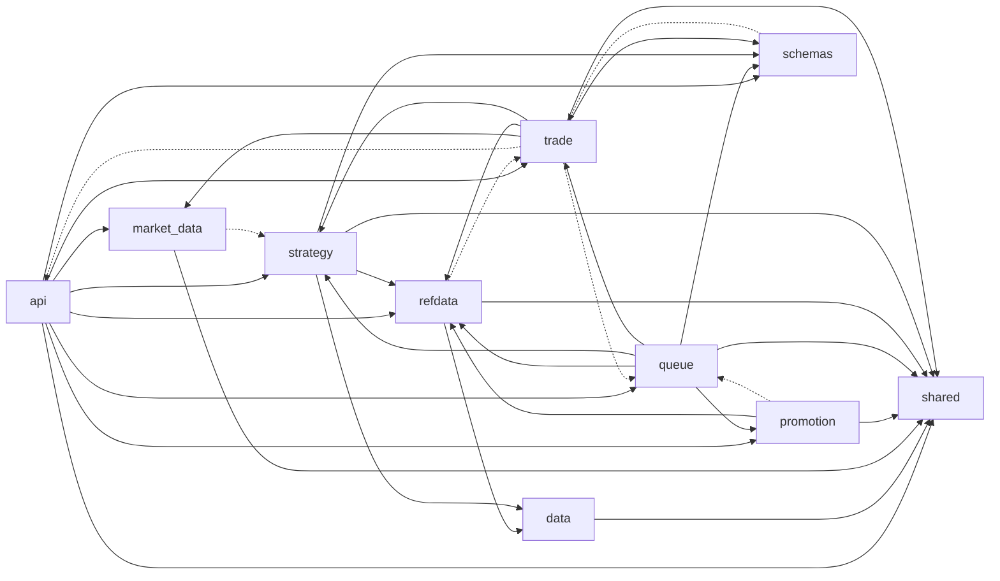

# Dependency and OOP review (2026-09-29)

**Doc type:** design review. No application code in this change.
**Checked against:** `main` at `413f17763cb1b5d0acf845532e1f1fdda7618bf0` (2026-09-29). Line numbers below are from that commit.
**Standards:** [Coding standards](coding-standards.md), in particular [OOP ownership](coding-standards.md#1-oop-ownership), [no hard-coded values](coding-standards.md#3-no-hard-coded-values), and [live trading](coding-standards.md#live-trading).
**Earlier reviews, not repeated here:** [Code quality review (2026-09-26)](2026-09-26-code-quality-review.md) (its [OOP section](2026-09-26-code-quality-review.md#object-oriented-design) and [boundaries](2026-09-26-code-quality-review.md#boundaries)), [Backtest review (2026-09-25)](2026-09-25-backtest-review.md), and [Long-term fixes (2026-09-29)](2026-09-29-long-term-fixes-b1-rangeparam-datacolumn.md).

## Summary

Module import cycles inside `quant/` are still zero, including imports written inside functions. The packages are not acyclic. An AST walk found **32** simple cycles among eight packages. Five of them are two-package loops. Every one of those loops is closed by an edge that points the wrong way against the layering in the coding standards, or by `quant/queue/worker.py` importing the trade bar factory while `quant/trade` imports `BtQueueRepo`.

The classes the last review measured are the same size. `PriceBarService` is still **647** lines. `PromotionTab.tsx` grew from 775 lines to **800**. Radon reports no function above cyclomatic complexity **13**, and **11** blocks at rank C.

Five of the seven live-trading failure paths Alfred named have no test at the seam that can send a second order or drop a fill. Broker rejection and the confirm-poll timeout are tested. A timeout on the submit call, an open partial fill, a stale position read, a failed transaction write after a fill, a duplicate submit on retry, and a tick that dies between two due rows are not.

The order of work below starts with tests and with deleting the second copy of promotion ranking, then breaks the `api`/`trade` cycle by moving credentials, and leaves gateway and repo splits until those tests exist.

## Method

Commands run on this commit, from the repo root:

```bash
git rev-parse HEAD
# 413f17763cb1b5d0acf845532e1f1fdda7618bf0

python3 --version
# Python 3.12.3

python3 -m radon --version
# 6.0.1

python3 -m radon raw quant -s -j
python3 -m radon cc quant -s -j
wc -l frontend/src/components/PromotionTab.tsx \
      frontend/src/components/ConfigDrawer.tsx \
      frontend/src/pages/BacktestPage.tsx \
      quant/market_data/service.py
```

`radon` 6.0.1 was installed in the sandbox for this measurement (`python3 -m pip install radon`). It is not a project dependency.

The import graph is a walk of `quant/**/*.py` with the standard-library `ast` module. **128** modules parsed, **0** syntax errors. An import inside a function is counted as lazy. An import under `if TYPE_CHECKING` is not a runtime edge. One of those would have looked like a broker importing a repo: `quant/trade/brokers/ccxt/adapter.py` line 30 imports `InstrumentCache` only for type checking. It is excluded below.

A runtime import is upward when the target package sits above the source in this order, top to bottom: `api`, `queue`, `promotion` and `trade` together, `strategy`, `market_data`, `refdata` and `data` together, `schemas`, `shared`. That order matches the coding standards (routes, then services, then repos, then brokers, with `shared` at the bottom) and puts HTTP schemas and `shared` where every layer may import them. `quant/cli.py` is an entry-point module, not a package. It imports `data`, `shared`, and `strategy` at module level (one, one, and four statements).

Class and function lengths are `end_lineno - lineno + 1` on the same AST. That counts every line in the span, including blanks and comments. Radon `raw` reports source lines (`sloc`) separately. Cyclomatic complexity is radon's. Radon does not parse TypeScript, so the frontend figures are file lengths from `wc -l` only.

Package cycles are every simple cycle in the runtime package graph. Each cycle is recorded once, starting at its alphabetically first package. There are **32**. The longest has six packages. `data` and `shared` are in no cycle.

## 1. Module dependency graph

### What the graph is

**137** module-level import statements cross a package boundary, and **10** more do so from inside a function. **35** distinct package pairs have at least one runtime edge.



Solid arrows point downward or sideways. Dotted arrows point upward against the order in [Method](#method).

| Edge | Module-level statements | Lazy | Direction |
|---|---:|---:|---|
| `api` → `market_data`, `promotion`, `queue`, `refdata`, `schemas`, `shared`, `strategy`, `trade` | 5, 4, 8, 11, 8, 13, 1, 8 | 0, 1, 0, 0, 1, 0, 7 | downward |
| `trade` → `api` | 8 | 0 | upward |
| `trade` → `queue` | 4 | 0 | upward |
| `promotion` → `queue` | 1 | 0 | upward |
| `refdata` → `trade` | 2 | 0 | upward |
| `schemas` → `trade` | 3 | 0 | upward |
| `market_data` → `strategy` | 1 | 0 | upward |
| `queue` → `trade` | 1 | 0 | downward, and it closes a cycle |
| `strategy` → `data`, `refdata`, `schemas`, `shared` | 3, 1, 2, 1 | 0 | downward |
| `data` → `shared`, `market_data` → `shared`, `refdata` → `data` and `shared` | 2, 5, 2, 2 | 0, 0, 0, 1 | downward |

### Module cycles, including lazy imports

**0** module cycles on module-level imports. **0** again when the 12 function-level internal imports are added. That re-measures the result in the [code quality review](2026-09-26-code-quality-review.md#boundaries). The lazy imports are not hiding a cycle.

The 12 function-level imports are:

- `quant/api/main.py` lines 54, 72, 73, 86, 101, and 105 to 109, all inside `lifespan`. They build the credential helper, the adapter registry, the venue-limit publisher, the bar factory, and the schedule sweeper after the app object exists.
- `quant/refdata/publisher.py` line 115 imports `quant.shared.config` inside a method.
- `quant/trade/registry.py` line 45 imports `create_ccxt_adapter` inside the registry builder, so importing the registry module does not import ccxt.

### Package cycles

The eight packages `api`, `market_data`, `promotion`, `queue`, `refdata`, `schemas`, `strategy`, and `trade` form one strongly connected component. It contains **32** simple cycles: **5** of length 2, **7** of length 3, **11** of length 4, **7** of length 5, and **2** of length 6.

The five loops between two packages are:

1. `api` → `trade` → `api`
2. `promotion` → `queue` → `promotion`
3. `queue` → `trade` → `queue`
4. `refdata` → `trade` → `refdata`
5. `schemas` → `trade` → `schemas`

The longer cycles are those same edges joined by ordinary downward imports (`strategy` → `refdata`, `trade` → `strategy`, `trade` → `market_data`, `queue` → `strategy`). Fixing the six upward edges below removes all 32 cycles. No new package has to be invented to do that.

### Finding: `trade` imports `api`

- **Severity:** blocks fixes. A credential change is also a trade change, and the other way around, because the packages import each other.
- **Where:** `quant/trade/account.py` lines 14 to 15, `quant/trade/dry_run.py` lines 8 to 9, `quant/trade/live_apply.py` lines 11 to 12, and `quant/trade/service.py` lines 8 to 9. Each imports `ApiCredentialRepo` and `CredentialService`.
- **How did this happen?** The credential HTTP routes were built under `quant/api/credentials/`, and the trade orchestrators then imported that package to decrypt a key. The [boundaries section](2026-09-26-code-quality-review.md#boundaries) already records the eight imports. This measurement adds the cycle they close with `api` → `trade`.
- **Owning class:** `CredentialService` in `quant/api/credentials/service.py`, and `ApiCredentialRepo` beside it.
- **Fix:** Move both classes into a package `trade` is allowed to import (a `quant/credentials/` package, or under `quant/trade/` if the only callers are trade and the credential router). Update the four trade modules, the credential router, and `quant/api/main.py` in the same pull request. Delete the old modules. Leave no re-export.

### Finding: `trade` and `queue` import each other

- **Severity:** causes ripple. A bar-factory change and a queue-repo change edit both packages.
- **Where:** `BtQueueRepo` is imported by `quant/trade/db_repo.py` line 11, `quant/trade/dry_run.py` line 10, `quant/trade/live_apply.py` line 13, and `quant/trade/service.py` line 10. The other way, `quant/queue/worker.py` line 44 imports `PriceBarServiceFactory` from `quant/trade/bar_source.py`.
- **How did this happen?** The coding standards require `TradeRepo` to take a `BtQueueRepo` so `sp_get_strategy` has one owner. That edge is the composition the standards ask for. The cycle appeared when the worker also needed a bar service and imported it from `quant/trade`, the package that holds the deployment binding.
- **Owning class:** `BtQueueRepo` keeps `sp_get_strategy`. `PriceBarServiceFactory` (`quant/trade/bar_source.py` line 24) owns the per-broker `PriceBarService`.
- **Fix:** Keep the `BtQueueRepo` injection. Move the worker's import off `quant.trade` by having the process entry point pass a constructed `PriceBarServiceFactory` into `BacktestWorker`, the same way `lifespan` already constructs one. `quant/queue/worker.py` then takes the factory as an argument and does not import `quant.trade`. Update `quant/queue/worker.py` and its tests in the same pull request. Do not leave a wrapper import.

### Finding: `promotion` imports `queue`, and `queue` imports `promotion`

- **Severity:** tidy-up. The [boundaries section](2026-09-26-code-quality-review.md#boundaries) already calls this the intended composition: `PromotionRepo` takes a `BtQueueRepo`, and the worker takes a `PromotionRepo`. It is not a module cycle.
- **Where:** `quant/promotion/repo.py` line 15, and `quant/queue/worker.py` line 40.
- **How did this happen?** One stored-procedure wrapper, injected, which is what the standards require. The package cycle is the shape of that injection plus the worker calling `PromotionRepo.run`.
- **Owning class:** `BtQueueRepo` for the strategy read. `PromotionRepo` for the promotion writes.
- **Fix:** Leave the injection. The change that belongs here is in [section 2](#finding-promotionrepo-both-decides-and-writes): `PromotionRepo.run` should stop owning the decision, which is what makes the worker depend on the policy module through the repo.

### Finding: `schemas` and `refdata` import `trade`

- **Severity:** causes ripple. Already listed in the [boundaries section](2026-09-26-code-quality-review.md#boundaries). Re-measured: the same three schema imports and the same two bundle imports, at the same lines.
- **Where:** `quant/schemas/apply.py` line 7 (`IntendedAction`, `OrderRejectReason`). `quant/schemas/dry_run.py` lines 8 to 9 (`KeyProfile`, `IntendedAction`). `quant/refdata/bundle.py` lines 12 to 13 (`RedisKeyProfiles`, `RedisVenueLimits`).
- **How did this happen?** The domain enums were defined next to the broker, and the HTTP models then imported them. The cache bundle was written as the one object API and worker both construct, so it learned about broker caches.
- **Owning class:** the enums belong with the domain (`quant/trade/models/`). `DataCaches` is the composition root and should not live in the reader package.
- **Fix:** Move `IntendedAction`, `OrderRejectReason`, and `KeyProfile` to a module both `schemas` and `trade` may import, update every importer in the same pull request, and delete the old names. Move `DataCaches` out of `quant/refdata/bundle.py` to the composition site (`quant/api/main.py` and the worker already construct it). `RedisRefData` stays the reader and does not import `quant.trade`.

### Finding: `market_data` imports `strategy`

- **Severity:** causes ripple. One function call is why a bar warmer depends on the backtest engine. The [boundaries section](2026-09-26-code-quality-review.md#boundaries) names the import. The cycle it joins (`market_data` → `strategy` → `refdata` → `trade` → `market_data`) is the new measurement.
- **Where:** `quant/market_data/warm.py` line 37 imports `live_lookback_bars`, and line 46 sets `DEFAULT_WARM_LOOKBACK = live_lookback_bars(110)`.
- **How did this happen?** The warmer was moved out of `quant/trade` so it would not know about deployments. The lookback length stayed a call into `Performance`.
- **Owning class:** `BarWarmer`. The length formula stays on `Performance.live_lookback_bars` (`quant/strategy/performance.py` line 30).
- **Fix:** `BarWarmer` takes the lookback as a constructor argument. The market-data route, which already builds the warmer (`quant/api/market_data/router.py` line 53), passes the number. Delete the import in `warm.py`. Update that caller and the tests in the same pull request. The literal `110` is a separate hard-coded value, covered in [section 5](#5-hard-coded-values).

`strategy` does not import `trade` or `api`. A signal still cannot see a broker. That boundary from the earlier review still holds.

## 2. Layer leaks

Inside the packages, modules were classed as route, service, repo (`DbGateway` subclasses), broker (`quant/trade/brokers/`, `quant/trade/adapters/`, and `CcxtBarFetcher`), domain, or `shared` and schemas at the bottom. A lower layer importing an upper one is a leak. Services importing a schema is ordinary: the schema sits at the bottom.

Runtime leaks under that rule, after dropping `TYPE_CHECKING` imports:

| From | To | Where |
|---|---|---|
| repo | policy module | `quant/promotion/repo.py` line 14 imports `evaluate_promotion` and the outcome constants |
| refdata bundle | repos and trade caches | `quant/refdata/bundle.py` lines 9 to 13, the same composition as the package finding above |

No service module builds a `SELECT`, `INSERT`, `UPDATE`, or `DELETE`. The only application SQL outside `DbGateway` is the catalog query in `RefDataPublisher` (`quant/refdata/publisher.py` line 53, `information_schema.tables`), which the standards allow, and `DbGateway` itself. `BtQueueRepo.sp_get_queued_count` (`quant/queue/repo.py` line 146) calls `cur.execute` on a `CALL`, because the count column sits in front of the status triplet and `_call_write` cannot return it. That call stays inside the repo.

`BacktestWorker`, `WorkerLoop`, and `RefDataPublisher` call `open_pool`. They are process entry points. Request services receive a repo.

### Routes and repos

Most routes construct a repo and hand it to a service. That is the composition root, and it is allowed. `quant/api/routers/jobs.py` line 48, `quant/api/routers/strategies.py` line 29, `quant/api/routers/promotion.py` line 28, and `quant/api/routers/deployments.py` line 43 do this and do not call stored procedures themselves.

Two routes call a repo method from the handler:

- `quant/api/auth/router.py` line 101 calls `repo.update_last_login` after `AuthService` has already verified the password and issued the token.
- `quant/api/admin/router.py` line 60 calls `repo.summarize()` on `LogProcRepo`.

### Finding: login stamps the repo from the route

- **Severity:** causes ripple. The next login rule has two homes, `AuthService` and the route.
- **Where:** `quant/api/auth/router.py` lines 99 to 103. The handler catches every exception so a failed stamp does not fail login.
- **How did this happen?** The stamp was added as a fire-and-forget beside the cookie, instead of as a method on `AuthService`, which already owns `verify_credentials`, `create_token`, and `cache_user`.
- **Owning class:** `AuthService`.
- **Fix:** `AuthService` gains the stamp and the "failure does not fail login" rule, including the `logger.exception` the standards require for that pattern. The route calls that method. Delete the `repo` use from the handler. Update the route tests in the same pull request.

### Log-proc summary stays on the repo

`LogProcRepo.summarize` is one stored-procedure call. No service owns a policy around it. Adding a service would be a wrapper whose only job is to forward the call, which the standards reject. The route may keep constructing `LogProcRepo` and calling `summarize`.

### Finding: `PromotionRepo` both decides and writes

- **Severity:** blocks fixes. A promotion-rule change edits the repo, because the repo is what the worker calls.
- **Where:** `PromotionRepo.run` at `quant/promotion/repo.py` line 118 calls `evaluate_promotion` (line 140) and then `_apply` (line 148). The only caller is `quant/queue/worker.py` line 165. `PromotionService` (`quant/api/services/promotion.py`) is read-only and does not own this flow.
- **How did this happen?** The repo was the class the worker already had, so the "evaluate, then flip, then insert" sequence was added there. The pure decision already lived in `evaluate_promotion`.
- **Owning class:** `evaluate_promotion` owns the decision. `PromotionRepo.flip_best` and `ins_promotion` own the writes.
- **Fix:** Delete `PromotionRepo.run`. A function next to `evaluate_promotion` (same module, not a new package) loads the best row through the injected `BtQueueRepo`, calls `evaluate_promotion`, then calls the two write methods. `BacktestWorker` calls that function. Update `quant/queue/worker.py` and the promotion tests in the same pull request. Do not keep `run` as a deprecated alias.

### Broker types in strategy code

A search of `quant/strategy` for venue names (`bybit`, `ccxt`, `futu`, `USDT`) hits comments only: the fee note on `Performance` line 101, and an example cusip in `signals.py` line 46. `strategy` does not import `trade`. The live path is still `quant/strategy/live_service.py` called by the trade stack, which the [OOP section](2026-09-26-code-quality-review.md#object-oriented-design) already describes. No new leak.

### Frontend copies of backend rules

`PromotionTab` still re-ranks. Re-measured: the file is **800** lines (`wc -l`). On the 2026-09-26 commit it was 775. `compareMetric` is now lines 35 to 44, called at lines 423, 499, and 547. The server copy is still `quant/promotion/evaluate.py` `_compare`, lines 71 to 75. The [UI finding](2026-09-26-code-quality-review.md#7-promotiontab-re-implements-ranking-and-it-is-the-largest-ui-file) stands. One extra copy is in the same file: lines 76 to 87 pick a "recommended" row by the highest `sharpe_ratio` among `is_best_ind = 'Y'` rows, which is a ranking the promotion response already decided.

- **Severity:** causes ripple.
- **How did this happen?** The tab was built to explain a comparison before the API returned gate rows, and the explanation stayed after the API grew `OOS Sharpe Ratio` and `Sharpe Excess`.
- **Owning class:** `evaluate_promotion` on the server. The tab owns presentation.
- **Fix:** Delete `compareMetric` and the Sharpe reducer. Render `gate_results` and the outcome the API returns. Split the deploy action, which already has `DeploymentDialog`, from the list. Update `PromotionTab.tsx` and `PromotionTab.test.tsx` in the same pull request. Leave no second comparison function.

Annualisation is a second frontend rule. `ConfigDrawer` lines 145 to 149 multiply `REFDATA.ASSET_TYPE.TRADING_PERIOD` by `barsPerDay` from `frontend/src/utils/interval.ts` (lines 37 to 39). The Python parser for the same interval text is `parse_period` in `quant/shared/intervals.py` line 28. The engine then trusts whatever `trading_period` the request carries (`Performance` line 108). The CLI still has its own year lengths, which [finding 10 of the backtest review](2026-09-25-backtest-review.md#10-the-cli-year-length-is-a-separate-constant) already records (`quant/cli.py` lines 78 to 80, `crypto` 365 and `equity` 252).

- **Severity:** causes ripple. An hourly Sharpe is scaled in the drawer and unscaled on any other caller.
- **How did this happen?** The drawer had to speak HTTP, so it reimplemented the interval arithmetic the API does not return.
- **Owning class:** `RedisRefData`, which already reads `ASSET_TYPE` and `TM_INTERVAL`. The strategy builder proposed in the [long-term fixes](2026-09-29-long-term-fixes-b1-rangeparam-datacolumn.md#shared-owner-the-strategy-builder) is the place that applies the scale once.
- **Fix:** The builder sets `trading_period` from ref data and the interval. The drawer sends the interval id and stops multiplying. Delete `annualization` in `ConfigDrawer` and the CLI's `ASSET_TRADING_PERIODS` in the same pull request, and update the CLI to call the builder or retire it, which is the decision already asked in the long-term fixes. Callers of `trading_period` on the request that used to supply the scaled number are updated in that same pull request.

`validateBacktestConfig` (`frontend/src/utils/validate.ts` line 11) checks that required fields are filled. It does not know indicator floors or data columns. It is not a second copy of those rules. Those stay with the strategy builder.

## 3. Oversized classes and functions

`radon raw` on `quant/`: **128** modules, **17,185** lines, **11,186** source lines.

`radon cc` on `quant/`: **980** blocks (192 classes, 548 methods, 240 functions). Ranks: **A 905**, **B 64**, **C 11**. Mean complexity **2.53**. Maximum **13**. No block is rank D or above.

The review trigger in the coding standards is about 300 lines for a class and about 50 for a function. AST spans:

| Lines | Methods | Class | Where |
|---:|---:|---|---|
| 647 | 19 | `PriceBarService` | `quant/market_data/service.py` lines 148 to 794 |
| 586 | 23 | `TradeRepo` | `quant/trade/db_repo.py` lines 33 to 618 |
| 364 | 25 | `CcxtTradeGateway` | `quant/trade/brokers/ccxt/gateway.py` lines 64 to 427 |
| 363 | 17 | `TradeService` | `quant/trade/service.py` lines 37 to 399 |
| 292 | 27 | `Performance` | `quant/strategy/performance.py` lines 99 to 390 |
| 286 | 9 | `LiveApplyOrchestrator` | `quant/trade/live_apply.py` lines 37 to 322 |
| 263 | 26 | `RedisRefData` | `quant/refdata/reader.py` lines 39 to 301 |
| 258 | 13 | `BtQueueRepo` | `quant/queue/repo.py` lines 32 to 289 |
| 243 | 11 | `WorkerLoop` | `quant/queue/worker_loop.py` lines 123 to 365 |
| 242 | 12 | `InstrumentCache` | `quant/data/instruments.py` lines 25 to 266 |
| 235 | 11 | `FutuTrader` | `quant/trade/futu_trader.py` lines 37 to 271 |
| 231 | 11 | `JobsService` | `quant/api/services/jobs.py` lines 56 to 286 |
| 231 | 8 | `CcxtBarFetcher` | `quant/market_data/fetcher.py` lines 89 to 319 |
| 229 | 9 | `BacktestCache` | `quant/data/backtest_cache.py` lines 19 to 247 |
| 228 | 11 | `BarSubscriptionService` | `quant/market_data/subscriptions.py` lines 132 to 359 |
| 222 | 23 | `CcxtTradeAdapter` | `quant/trade/brokers/ccxt/adapter.py` lines 60 to 281 |

**192** classes in total. **16** are 200 lines or longer. **4** are over 300.

`PriceBarService` is unchanged from the [code quality review](2026-09-26-code-quality-review.md#7-promotiontab-re-implements-ranking-and-it-is-the-largest-ui-file): the file is still **794** lines, and the class still starts at line 148. That review's conclusion stands. The class is wide because freshness, backfill, and the signal window share one fail-closed rule. Splitting it does not unblock the dependency cycles above. It waits until the tests around it are the reason for a change.

**28** functions and methods span 51 lines or more. Seven span 80 or more:

| Lines | Complexity | Where |
|---:|---:|---|
| 126 | (module `main`, not in the C list) | `quant/cli.py` `main`, lines 149 to 274 |
| 107 | 12 | `quant/strategy/backtest_service.py` `fetch_df`, lines 170 to 276 |
| 98 | | `quant/strategy/backtest_service.py` `_fetch_exchange_df`, lines 70 to 167 |
| 87 | 10 | `PriceBarService.backfill`, lines 288 to 374 |
| 85 | | `quant/api/main.py` `lifespan`, lines 41 to 125 |
| 85 | | `InstrumentCache.create_instrument`, lines 182 to 266 |
| 82 | | `quant/trade/dry_run.py` `run_dry_run`, lines 24 to 105 |

The eleven rank-C blocks are all between 11 and 13:

| Complexity | Where |
|---:|---|
| 13 | `TradeService.update_deployment`, line 218 |
| 13 | `FutuTrader.apply_signal`, line 231 |
| 13 | `quant/trade/brokers/ccxt/confirm.py` `_parse_terminal`, line 36 |
| 12 | `OptimizeResult.extract_plots`, line 64 |
| 12 | `fetch_df`, line 170 |
| 12 | `KeyRouter.connect`, line 62 |
| 11 | `Performance.__init__`, line 106 |
| 11 | `quant/promotion/evaluate.py` `_extract_metric`, line 49 |
| 11 | `OrderRetryPolicy.is_retryable`, line 109 |
| 11 | `CcxtTradeAdapter.place_order`, line 206 |
| 11 | `CcxtTradeGateway.fetch_open_positions`, line 336 |

### Finding: `TradeService.update_deployment` decides and writes in one method

- **Severity:** causes ripple.
- **Where:** `quant/trade/service.py` lines 218 to 290. Complexity 13, 73 lines.
- **How did this happen?** Each new deployment field (schedule, paper flag, enablement) added another branch to the one method the route already called.
- **Owning class:** `TradeService`.
- **Fix:** Keep one public `update_deployment`. Split the schedule decision and the status decision into methods on `TradeService` that return the row to write, and let `update_deployment` perform the single `TradeRepo` write. The route keeps calling `update_deployment`. Tests in `tests/unit/test_trade_service.py` are updated in the same pull request. No second service.

### Finding: `fetch_df` still chooses the source

- **Severity:** tidy-up. The exchange path is already `_fetch_exchange_df` (98 lines). `fetch_df` is the remaining branch.
- **Where:** `quant/strategy/backtest_service.py` lines 170 to 276. Complexity 12.
- **How did this happen?** Provider and exchange loads grew inside the function the optimizer already called.
- **Owning class:** the data load in `quant/strategy/backtest_service.py`. The strategy builder from the long-term fixes owns validation, not the fetch.
- **Fix:** `run_optimize`, `run_performance`, and `run_walk_forward` call either the exchange loader or the provider loader. Delete the branch inside `fetch_df`. Update those three callers and their tests in the same pull request.

### Finding: `CcxtTradeGateway` is three clients

- **Severity:** tidy-up until the failure tests in [section 6](#6-live-trading-failure-path-tests) exist, then causes ripple, because every order bug is edited in a 364-line class.
- **Where:** `quant/trade/brokers/ccxt/gateway.py` lines 64 to 427. 25 methods: session setup, `create_market_order` (line 249), positions (line 378), balances (line 306), and market limits.
- **How did this happen?** ccxt's exchange object was wrapped once, and each new call (`fetch_positions`, `fetch_balance`, `load_markets`) was added to that wrapper.
- **Owning class:** `CcxtTradeGateway` today. After the split, order submission stays on a class the adapter uses for `create_order`, `cancel_order`, and `fetch_order`. Account reads and market metadata are separate classes.
- **Fix:** Do this only after the gateway tests in section 6. Then replace `CcxtTradeGateway` with those classes, update `CcxtTradeAdapter` and `KeyRouter` in the same pull request, and delete `CcxtTradeGateway`. No facade left behind. Live-trading risk is high because the order payload path moves, so this is last in the [refactor order](#refactor-order).

### Finding: `TradeRepo` is one schema, and it also checks statuses

- **Severity:** tidy-up for the line count. The status check is a real policy leak, severity causes ripple.
- **Where:** `quant/trade/db_repo.py` lines 33 to 618, 23 methods, **532** source lines. `SCHEDULE_STATUSES` is line 18. The check that uses it is line 257.
- **How did this happen?** Every `TRADE` procedure wrapper went on the one repo the service already held. The comment on line 17 says the status column has no database constraint, so the allowed set was written next to the wrapper.
- **Owning class:** `TradeRepo` owns the procedure calls. It should not own the set of legal statuses. See [section 5](#finding-schedule-statuses-are-a-python-set).
- **Fix:** Do not split the repo into several classes to shorten it. The wrappers are one schema. Move the status set out as in section 5, and leave the `CALL`s here. A split of the class waits until a second caller needs a subset and is copying methods.

### Frontend files

`wc -l` on `frontend/src` (107 TypeScript files, **15,233** lines). Files at 400 lines or more:

| Lines | File |
|---:|---|
| 800 | `frontend/src/components/PromotionTab.tsx` |
| 752 | `frontend/src/components/ConfigDrawer.test.tsx` |
| 581 | `frontend/src/components/ConfigDrawer.tsx` |
| 518 | `frontend/src/pages/BacktestPage.tsx` |
| 500 | `frontend/src/pages/MarketDataPage.tsx` |
| 463 | `frontend/src/components/trade/DeploymentDialog.tsx` |
| 380 | `frontend/src/pages/trade/TradeApplyPage.tsx` |

`ConfigDrawer.tsx` is still **581** lines, the same length the [OOP section](2026-09-26-code-quality-review.md#object-oriented-design) recorded. `BacktestPage.tsx` is **518** lines. That review described it as about 480. It is still a container: it enqueues, switches tabs, and refetches. It does not compute a signal. The split that matters is `PromotionTab`, in section 2. `ConfigDrawer` gets smaller when `annualization` and the `?? 5` window defaults leave, which is the builder work already specified in the long-term fixes. No new component hierarchy.

## 4. Duplicated facts

Each row is one fact with more than one home. Facts already specified in the long-term fixes are listed so this page points at the owner, and the design is not rewritten.

| Fact | Copies measured on this commit | Single owner |
|---|---|---|
| Queue status id for a name | Python callers use `RedisRefData.resolve_queue_status_id`. Two SQL routines hard-code `QUEUE_STATUS_ID IN (1,2,3)`. See [section 5](#finding-queue-status-ids-are-literals-in-sql). | `RedisRefData.resolve_queue_status_id` for Python. The procedure joins `REFDATA.QUEUE_STATUS` on `NAME`. |
| Factor series and the 80% date coverage | `Performance._factor_series_for_sub` line 168 and `_validate_factor_coverage` line 251 (`coverage < 0.80` at line 262). `Objective` copies both at lines 95 and 103 (`coverage < 0.80` at line 109). | The `FactorInput` resolver in [long-term fixes, item C](2026-09-29-long-term-fixes-b1-rangeparam-datacolumn.md#c-b26-data_column-is-not-validated). Not redesigned here. |
| Data column `"v"` / `"price"` / `"factor"` | Still the defaults named in that same item: `SubStrategy` line 34, `StrategyConfig.single` line 57, `strategy_to_json` line 355, `config_from_json` line 399, `get_substrategies` line 92, `FactorConfig` line 32. | The strategy builder, same item. |
| Window and signal bounds | `RangeParam` (`quant/schemas/backtest.py` line 5) still has no floor. | The strategy builder, [item B](2026-09-29-long-term-fixes-b1-rangeparam-datacolumn.md#b-window-and-signal-range-bounds). |
| Sharpe ratio | `Performance.get_sharpe_ratio` lines 312 to 323. `Objective._sharpe` lines 74 to 93, whose docstring calls itself the numpy form of the same ratio (decision #63). `tests/unit/test_objective.py` asserts they match. | `Performance.get_sharpe_ratio`. `Objective._sharpe` calls it, or both call one function that `Performance` owns. Delete the second formula. Update `Objective` and the parity test in the same pull request. |
| Annualisation scale | Drawer (`ConfigDrawer` lines 145 to 149), CLI (`quant/cli.py` lines 78 to 80), engine (`Performance` line 108, which uses the number it is given). | The strategy builder, as in [section 2](#frontend-copies-of-backend-rules). |
| Settlement currency | `_FALLBACK_SETTLEMENT_CCY = "USDT"` at `quant/trade/live_apply.py` line 34, used at line 290. This is the known-debt row in the coding standards. No second literal was found in `quant/`. | `LiveApplyOrchestrator._settlement_ccy`, reading `INST.PRODUCT.CCY`. Delete the fallback in the pull request that touches this method. Callers that depended on a missing `CCY` becoming `USDT` are updated in that same pull request: a missing currency raises. |
| Promotion comparison | `_compare` and `compareMetric`, plus the Sharpe reducer at `PromotionTab` lines 76 to 87. | `evaluate_promotion`. See [section 2](#frontend-copies-of-backend-rules). |
| Bar-window coverage versus factor-date coverage | `_MIN_WINDOW_COVERAGE = 0.8` at `quant/market_data/service.py` line 43 is the share of a lookback that must exist before a signal runs. The `0.80` in `Performance` and `Objective` is the share of the main product's dates a second instrument must cover. Same number, different facts. | `PriceBarService` owns the window fraction. The factor resolver owns the date fraction. They stay different owners. The literals still belong in config, in [section 5](#5-hard-coded-values). |
| Retry budget | `ScheduleTickRunner` uses `DEFAULT_MAX_ATTEMPTS = 3` and `DEFAULT_RETRY_BACKOFF_S = 5.0` (`quant/trade/scheduler/tick.py` lines 41 and 45). `OrderRetryPolicy` defaults to `max_attempts=5` and `backoff_s=2.0` (`quant/trade/order_policy.py` line 92). A tick therefore retries the whole apply three times, and each apply retries the order five times. | One policy object. `ScheduleTickRunner` and `OrderRetryExecutor` both take it. Delete the two defaults. Where the numbers live is a [decision](#decisions-for-alfred). |

### Finding: two Sharpe formulas

- **Severity:** causes ripple. A change to the ratio that updates only `Performance` leaves the search on the old formula until the parity test fails.
- **How did this happen?** Decision #63 put a numpy path on the objective so the search would not build a `Performance` per cell. The formula was copied, and a parity test was added to keep the copy honest.
- **Owning class:** `Performance`.
- **Fix:** One function, owned by `Performance`, computes the ratio from a pnl series and a `trading_period`. `Objective._sharpe` calls it. Delete the second arithmetic. Update `quant/strategy/objective.py` and `tests/unit/test_objective.py` in the same pull request. No compatibility wrapper that accepts the old private helper.

## 5. Hard-coded values

The known-debt table in the [coding standards](coding-standards.md#3-no-hard-coded-values) is still accurate and is not copied here: `OPTUNA_MAX_TRIALS`, `OPTUNA_SEED`, `sorted_df.head(10)`, `_FALLBACK_SETTLEMENT_CCY`, and the worker-loop timeouts. `DEFAULT_RETRY_BACKOFF_S` and the two `DEFAULT_SETTLE_S` constants (`quant/market_data/warm.py` line 52 and `quant/trade/scheduler/sweep.py` line 42, both `10.0`) are the examples that table already names.

These are further values on this commit. Decision #65 and decision #84 already set the default fee at 10 bps and added `CONFIG.APP_ISSUE_FEE` for the Bybit future schedule. `Performance.DEFAULT_FEE_BPS` (line 101) and `fee_bps: float = 10.0` on `OptimizeRequest` and `PerformanceRequest` (`quant/schemas/backtest.py` lines 60 and 95) are that decision, not a new finding. The open piece is the one decision #84 already states: the drawer does not read `CONFIG.APP_ISSUE_FEE` yet. `MIN_METRIC_OBS = 60` (`Performance` line 104) is decision #63 and stays on `Performance`.

### Finding: queue status ids are literals in SQL

- **Severity:** blocks fixes. Insert order in `REFDATA.QUEUE_STATUS` is the only thing that makes `1`, `2`, and `3` mean `QUEUED`, `RUNNING`, and `CANCEL_REQUESTED`. Python never uses those integers. It calls `resolve_queue_status_id(name)`.
- **Where:** `db/liquidbase/bt/procedures/SP_GET_QUEUE_FOR_TERMINAL.sql` lines 51 and 73, and `db/liquidbase/bt/functions/FN_GET_QUEUE_FOR_TERMINAL.sql` line 62. The seed (`db/liquidbase/refdata/data/QUEUE_STATUS.sql` lines 11 to 16) inserts `QUEUED`, `RUNNING`, `CANCEL_REQUESTED` first and does not set the identity values.
- **How did this happen?** The procedure was written when those three rows were the first identity values, and the filter was never switched to `NAME`. The table comment mentions `IS_TERMINAL_IND`, and the table has no such column (`db/liquidbase/refdata/tables/QUEUE_STATUS.sql`).
- **Owning class:** the procedure and the function. Python's owner is `RedisRefData.resolve_queue_status_id`.
- **Fix:** Both routines join `REFDATA.QUEUE_STATUS` and filter on `NAME IN ('QUEUED', 'RUNNING', 'CANCEL_REQUESTED')`, or on a real terminal flag if Alfred adds that column. Delete the integer list. This is a new Liquibase changeset with context `bt` only. The previous changesets that point at these files are archived, so editing the body does nothing until that changeset exists. Blast radius: schema `BT`, one changeset, two routine bodies replaced (`SP_GET_QUEUE_FOR_TERMINAL` and `FN_GET_QUEUE_FOR_TERMINAL`). Do not add `prod-deploy` until Alfred asks. Callers of the routines are unchanged because the signature stays. Any test or client that assumed ids `1, 2, 3` is updated in the same pull request.

### Finding: job priority and the per-user cap

- **Severity:** causes ripple.
- **Where:** `PRIORITY_MAP = {"normal": 100, "high": 0}` at `quant/api/schemas/jobs.py` line 14. `MAX_QUEUED_PER_USER = 30` at line 17. `JobsService` enforces the cap.
- **How did this happen?** The queue UI needed a label and a limit before a `CONFIG` row existed, and the numbers were written on the request schema.
- **Owning class:** `JobsService` for the cap. Priority labels belong in `REFDATA`, next to `QUEUE_STATUS`, read through `RedisRefData`.
- **Fix:** A `REFDATA` row for the two labels and their integer priorities, and a `CONFIG` row for the cap. `JobsService` reads both. Delete `PRIORITY_MAP` and `MAX_QUEUED_PER_USER`. Update the jobs router, the frontend label map, and the tests in the same pull request.

### Finding: backfill size and the warm lookback

- **Severity:** causes ripple for the lookback (it is also the upward import). Tidy-up for the backfill cap, which is a time budget written up in the comment at `quant/market_data/service.py` lines 45 to 59.
- **Where:** `MAX_BACKFILL_BARS = 10_000` at line 60. `live_lookback_bars(110)` at `quant/market_data/warm.py` line 46.
- **How did this happen?** Both were sized against a proxy timeout and a typical indicator window, and left as module constants.
- **Owning class:** `PriceBarService` for the backfill cap. `BarWarmer` for the lookback count, with the formula staying on `Performance`.
- **Fix:** The backfill cap is process tuning (it tracks the proxy timeout), so it becomes an environment variable documented in `docs/env-vars.md`, read by `PriceBarService`. Delete the constant. The lookback count is a business window: a `CONFIG` row, passed into `BarWarmer` as in [section 1](#finding-market_data-imports-strategy). Update callers in the same pull request as each change. Do not batch them with the gateway split.

### Finding: schedule statuses are a Python set

- **Severity:** causes ripple.
- **Where:** `SCHEDULE_STATUSES` at `quant/trade/db_repo.py` line 18: `PENDING`, `SUCCESS`, `FAILED`. The comment says the column has no check constraint.
- **How did this happen?** The procedure accepts any string, so the repo grew a set to reject typos.
- **Owning class:** `TradeRepo` today. The names belong in `REFDATA`, read by `RedisRefData`, and checked by `TradeService` before the write.
- **Fix:** A `REFDATA` table for schedule status, a `RedisRefData` resolver, and `TradeService` rejects an unknown name. Delete `SCHEDULE_STATUSES`. Update `TradeRepo`, `TradeService`, and `tests/unit/test_trade_db_repo.py` in the same pull request. A database check constraint can follow in the same changeset. Context `bt` until Alfred adds `prod-deploy`.

### Finding: confirm delays and the two retry budgets

- **Severity:** causes ripple for the two budgets, because a timeout is retried on both clocks. Tidy-up for the poll delays.
- **Where:** `_CONFIRM_DELAYS_S = (0.3, 0.6, 1.2, 2.4, 3.5)` at `quant/trade/brokers/ccxt/confirm.py` line 12. The retry defaults are in [section 4](#4-duplicated-facts).
- **How did this happen?** The poll was tuned once against the venue and never given a home. The tick and the order executor were written separately, each with a budget that looked small on its own.
- **Owning class:** `confirm_market_order` owns the poll. `OrderRetryPolicy` should own every retry count. `ScheduleTickRunner` should take that policy.
- **Fix:** One `OrderRetryPolicy` constructed from a `CONFIG` row (attempts and backoff) or, if Alfred classes both as process tuning, from environment variables documented in `docs/env-vars.md`. `ScheduleTickRunner` and `OrderRetryExecutor` receive it. Delete `DEFAULT_MAX_ATTEMPTS`, `DEFAULT_RETRY_BACKOFF_S`, and the defaults on `OrderRetryPolicy.__init__`. The confirm delays are process tuning and move to the same kind of home in the pull request that touches `confirm.py`. Update `quant/trade/scheduler/tick.py`, `quant/trade/order_policy.py`, and their tests in the same pull request.

`split_ratio: float = 0.5` (`quant/schemas/backtest.py` line 87) is a research default of the same shape as the Optuna seed. It belongs on the `CONFIG.BACKTEST_SEARCH` row already proposed in the long-term fixes, not a new table. The drawer defaults `win_min ?? 5`, `win_max ?? 100`, `win_step ?? 5` at `ConfigDrawer.tsx` lines 157 to 160 are the literals item B of those fixes already tells the drawer to drop.

Other module constants (`DEFAULT_POLL_INTERVAL_S`, `DEFAULT_MAX_DRAIN_PASSES`, `KEY_PROFILE_TTL_S`, the two-second Redis socket timeouts) are process tuning with no environment variable. They are the same shape as the worker timings in the known-debt table. The pull request that next touches each module moves that constant to an environment variable and documents it. They are not a batch of their own.

## 6. Live-trading failure-path tests

Checked by reading `quant/trade/` (live apply, brokers, adapters, scheduler) and searching `tests/` for each path. Paths that already have a test are recorded so they are not rebuilt. Design items are only for the gaps. Each later pull request is tests plus the production change that makes the new assertion true, with a run on `main` quoted first, as the coding standards require.

Prefer a small fake exchange or a fake repo over `MagicMock`. `tests/unit/test_bybit_adapter.py` (989 lines) patches ccxt and the gateway heavily. The new tests should follow `StubRefData` and `FakeProc`: a real object with the methods the production code calls.

### Broker rejects an order: tested above the gateway

These tests exist:

- `tests/unit/test_ccxt_confirm.py` line 52, `test_rejected_is_failure`, for a fetched order with `status=rejected`.
- `tests/unit/test_bybit_adapter.py` line 792, `test_place_order_broker_error_returns_failed_result`, which stubs `create_market_order` to raise `BrokerConnectionError`.
- Size and region rejects before submit, in the same file (lines 819 and 409).
- `tests/unit/test_live_apply.py` line 273, `test_reject_reason_reaches_the_report`.
- `tests/unit/test_schedule_tick.py` line 248, `test_rejected_order_counts_as_a_failure`.

No test constructs `CcxtTradeGateway` and has `exchange.create_order` raise `ccxt.InvalidOrder` or `ccxt.InsufficientFunds`. The mapping is `quant/trade/brokers/ccxt/gateway.py` lines 253 to 256. A search of `tests/` found no call that reaches `create_order` on the exchange object.

### Design item: gateway maps a venue reject

- **Severity:** blocks fixes. The next edit to `create_market_order` can drop the exception type and nothing in `tests/` fails.
- **How did this happen?** The adapter tests inject `BrokerConnectionError`, so the gateway's `except` clauses were never the subject of a test.
- **Owning class:** `CcxtTradeGateway`.
- **What the test asserts:** A fake exchange whose `create_order` raises `ccxt.InvalidOrder` produces `BrokerConnectionError` with `invalid order` in the message, and `ccxt.InsufficientFunds` produces `insufficient funds`. The adapter's `place_order` then returns `success=False` and does not call `confirm_market_order`. No second `create_order`.
- **Fakes:** A hand-written exchange object with `create_order`, `market`, and `markets`. Not `MagicMock`.
- **Size:** One test class beside the existing adapter tests. `tests/unit/test_ccxt_confirm.py` is 145 lines and covers the poll loop. This class is a fraction of that file.
- **Live-trading risk:** none while the test passes on current `main`. If it fails, the fix is inside `CcxtTradeGateway.create_market_order` only, and the adapter tests are updated in that same pull request.

### Broker times out: the poll is tested, the submit is not

`tests/unit/test_ccxt_confirm.py` line 113, `test_timeout_returns_unconfirmed`, covers a fetch that stays `open` until `_CONFIRM_DELAYS_S` is spent. `tests/unit/test_order_policy.py` lines 59 and 71 treat the word `timeout` in a message as retryable. `tests/unit/test_live_apply.py` line 300 retries an unconfirmed result.

No test has `exchange.create_order` raise `ccxt.RequestTimeout` or `ccxt.NetworkError`. `create_market_order` wraps every other `ccxt.BaseError` as `create_order failed: ...` (gateway line 259) and the adapter returns a failed `OrderResult` with `vendor_order_id=None` (`adapter.py` lines 225 to 230). Whether that message is retried depends on `OrderRetryPolicy.is_retryable` seeing the word `timeout`. Nothing asserts the outcome.

### Design item: a submit timeout does not become a second order

- **Severity:** blocks fixes. This is the path that does not know whether the venue accepted the order.
- **How did this happen?** The confirm poll was tested because it returns a domain `OrderResult`. The exception on `create_order` was left to the generic `BaseError` handler.
- **Owning class:** `CcxtTradeGateway` for the mapping. `OrderRetryExecutor` for what happens next.
- **What the test asserts:** A fake exchange whose `create_order` raises `ccxt.RequestTimeout` produces one failed result carrying the vendor's message, and `OrderRetryExecutor` does not call `apply_signal` a second time unless the result is classified retryable on purpose. If the classification says retryable, the second attempt sends the same client order id as the first (that id is the [duplicate-submission item](#design-item-one-client-order-id-for-a-retry) below, and this test lands in that same pull request so the two assertions share one fake).
- **Fakes:** The same hand-written exchange. It records every `create_order` argument.
- **Size:** A second test on that fake, in the same module as the reject test.
- **Live-trading risk:** the retry rule is live behavior. The pull request quotes the current `main` result before changing it.

### Partial fill: a terminal partial is tested, an open partial is not

`tests/unit/test_ccxt_confirm.py` line 38, `test_partial_fill_on_cancel_is_success`, and line 72, `test_expired_with_fill_is_success`, assert that a canceled or expired order with `filled > 0` is a success and keeps `filled_qty`.

An order that is still `open` with `filled > 0` makes `_parse_terminal` return `None` (`confirm.py` lines 45 to 66). When the poll budget ends, `confirm_market_order` returns an unconfirmed `OrderResult` that does not set `filled_qty` (lines 110 to 121). `OrderRetryExecutor` then cancels and calls `apply_signal` again for the full quantity (`order_policy.py` lines 160 to 164). No test uses an open order whose `filled` is already non-zero.

### Design item: an open partial is remembered

- **Severity:** blocks fixes. A retry that ignores the filled part buys the remainder twice if the cancel does not roll the fill back.
- **How did this happen?** `_parse_terminal` only returns once the status is terminal, and the timeout result was written for the `filled == 0` case the unit test uses.
- **Owning class:** `confirm_market_order`.
- **What the test asserts:** A fake gateway whose `fetch_order` returns `status=open` and `filled` equal to half the request, for every poll, produces an unconfirmed result whose `filled_qty` is that half. `OrderRetryExecutor` does not submit a second order for the original full quantity. The later client-order-id pull request is what makes the second assertion true. Until that id exists, this test fails on `main`, which is the evidence the standards ask for.
- **Fakes:** A fake gateway with `fetch_order` returning that dict. The executor test uses a fake adapter whose `apply_signal` records quantity, not `MagicMock`.
- **Size:** Two tests, one on `confirm_market_order` and one on `OrderRetryExecutor`.
- **Live-trading risk:** high once the executor stops sending the second full order. Ship it with the client-order-id pull request, not as a silent change to retry policy.

### Position read lags or is stale: no test

The [stuck-schedule finding](2026-09-26-code-quality-review.md#1-a-stuck-schedule-re-applies-every-tick-a-second-fill-needs-a-lagging-position-read) already explains the mechanism. `OrderRetryExecutor.execute` re-reads `get_position_qty` every attempt (`order_policy.py` line 146). `intended_side` returns `HOLD` when the book already matches the signal. A lagging read returns the old quantity, so the next attempt sends another order. `tests/unit/test_order_policy.py` sets `get_position_qty` to a constant `0.0`. `tests/unit/test_bybit_adapter.py` covers a fresh position (lines 506, 527, 546) and does not cover a read that is still flat after a fill.

`tests/unit/test_schedule_tick.py` line 348, `test_applied_but_not_advanced_is_reported_as_stuck`, covers the schedule write throwing. It does not cover the position endpoint.

### Design item: a stale position does not send a second order

- **Severity:** blocks fixes. This is the live path the earlier review left open.
- **How did this happen?** The position tests assert the happy shapes ccxt returns. They never sequence "fill, then a read that still shows flat".
- **Owning class:** `OrderRetryExecutor`, with `CcxtTradeAdapter` sending a client order id derived the way that earlier review describes: from the deployment and the scheduled time.
- **What the test asserts:** First attempt fills. Second attempt's `get_position_qty` still returns `0`. The fake exchange records one `create_order`, and a repeated submit with the same client order id comes back as the original fill, `success=True`, not a second position.
- **Fakes:** A fake exchange that stores orders by client id. A fake adapter is not enough on its own, because the bug is the second submit reaching the venue.
- **Size:** One test class. The production change is the client order id on `CcxtTradeAdapter.place_order` and `CcxtTradeGateway.create_market_order`. Update every caller of `create_market_order` in that same pull request (the adapter is the caller).
- **Live-trading risk:** high. The order payload gains an id. Say so in that pull request. No production deploy from the branch.

### The database write after a successful order: the audit is tested, the fill row is not

`LiveApplyOrchestrator._write_transaction` (`quant/trade/live_apply.py` lines 243 to 278) catches every exception, logs it, and lets the apply report success. `tests/unit/test_live_apply.py` line 377, `test_audit_failure_does_not_crash`, sets `sp_ins_execution_event` to raise. A search of `tests/` found no test that sets `sp_ins_transaction` to raise. The success tests assert it was called once (line 205).

The schedule-cursor failure is a different write. It is tested (`test_applied_but_not_advanced_is_reported_as_stuck`) and discussed in the stuck-schedule finding. It is not this gap.

### Design item: a failed fill row does not hide the fill, and does not send another order

- **Severity:** blocks fixes. The handler is the "best-effort, never fails the cycle" pattern the standards allow only with a docstring and `logger.exception`. The docstring is there (line 253). No test locks it.
- **How did this happen?** The audit write was tested because it loops over attempts. The transaction write was left on the happy-path assertion.
- **Owning class:** `LiveApplyOrchestrator`.
- **What the test asserts:** The fake repo's `sp_ins_transaction` raises `RuntimeError`. `run` still returns `order_success=True` and the vendor order id. `apply_signal` was called once. The exception is logged (the test captures the log record). The report does not claim the transaction row exists.
- **Fakes:** A small repo object with the methods `run` calls, `sp_ins_transaction` raising. The adapter is a small class with a fixed fill, not `MagicMock`.
- **Size:** One test in `tests/unit/test_live_apply.py` (that file is 539 lines).
- **Live-trading risk:** none if the test passes on current `main`. The pull request quotes that run.

### Duplicate submission on retry: no idempotency test

`tests/unit/test_order_policy.py` line 144, `test_unconfirmed_cancels_and_retries_to_exhaustion`, asserts `cancel_order` and `apply_signal` each run three times. The adapter has no client order id. The only mention in `quant/trade` is the comment in `ScheduleTickRunner._advance` (`quant/trade/scheduler/tick.py` lines 298 to 300): neither an in-flight lease nor an idempotent client order id exists. That comment, and the correction that a current position usually prevents the second fill, is the stuck-schedule finding. The missing test is still missing.

### Design item: one client order id for a retry

- **Severity:** blocks fixes.
- **How did this happen?** Cancel-and-retry was implemented as a new `apply_signal`, which builds a new `OrderRequest` with no id tying it to the attempt that timed out.
- **Owning class:** `CcxtTradeAdapter` and `CcxtTradeGateway`. `OrderRetryExecutor` passes the id through.
- **What the test asserts:** Two attempts for the same deployment and scheduled time call `create_order` with one client id. The fake exchange, asked to create that id again, returns the first order and does not increase the position. A successful first fill followed by a retry is one position, not two.
- **Fakes:** The same fake exchange as the stale-position item. These two design items are one pull request. Shipping them separately would leave a retry rule with no id, or an id with no retry test.
- **Size:** The id parameter on `create_market_order`, the adapter, the executor, and the tests. `quant/trade/order_policy.py` is 188 lines. The change is a slice of that plus the gateway method.
- **Live-trading risk:** high. One pull request, called out as a live path.

### Scheduler tick crash mid-cycle: a whole interval is tested, a row in the middle is not

`ScheduleSweeper.sweep` catches an exception from `run_interval` and continues (`quant/trade/scheduler/sweep.py` lines 70 to 76). `tests/unit/test_schedule_sweep.py` line 44, `test_a_failing_interval_does_not_stop_the_others`, covers that.

Inside one interval, `ScheduleTickRunner._run_one` catches exceptions from the apply callable (`tick.py` lines 191 to 198). `tests/unit/test_schedule_tick.py` line 218, `test_a_failing_row_does_not_stop_the_others`, covers a row whose apply raises.

`run_interval` builds the result list with a comprehension (`tick.py` line 177). Anything `_run_one` does not catch, including a row that lacks `deployment_id` (line 189, before the `try`), escapes `run_interval`. Rows later in that interval never run. The sweeper then logs and drops the interval report, including rows already applied. No test feeds two due rows where the second raises outside the apply `try`.

`SchedulePoller.run` (`quant/trade/scheduler/poller.py` lines 66 to 77) lets any exception other than `CancelledError` stop the loop. The sweep absorbs per-interval failures, so this fires when `interval_ids()` itself raises. No poller test covers that. It is the start of a pass, not the middle. It is recorded here so it is not mistaken for the mid-cycle gap.

### Design item: one bad row does not drop the rest of the interval

- **Severity:** causes ripple. A crash after the first order has already been sent skips every later deployment on that interval, and the sweeper's report no longer lists the one that traded.
- **How did this happen?** The comprehension treats `_run_one` as infallible once the apply `try` was added. The key read sits outside that `try`.
- **Owning class:** `ScheduleTickRunner`.
- **What the test asserts:** Two due rows. The first apply succeeds and the schedule advance is called. The second row has no `deployment_id`. `run_interval` returns a report that contains the first row as `APPLIED` and the second as a failed outcome, and does not raise. A fake repo records that the second row was not advanced and was not applied.
- **Fakes:** A repo object with `sp_get_missed_due_deployments`, `sp_ins_deployment_schedule_status`, and `write_deployment`. The apply callable is a function, which the tick already accepts.
- **Size:** One test in `tests/unit/test_schedule_tick.py` (355 lines) and the `try` moved so it wraps the whole row.
- **Live-trading risk:** medium. Today that exception aborts the rest of the interval. After the fix, later rows still trade. The pull request says so.

## Refactor order

Each step is one pull request. Callers of any changed interface are updated in that same pull request. No shims, aliases, or fallbacks. Safest and most unblocking first.

1. **Gateway reject and submit-timeout tests.** Scope: `CcxtTradeGateway` and a fake exchange, tests first. Rules 4 and 5. Unblocks every later edit to `create_market_order`. Live-trading risk: none if the tests pass on `main`. If a mapping is wrong, the fix stays inside the gateway.
2. **Transaction-write failure test.** Scope: `LiveApplyOrchestrator._write_transaction` and one test. Rule 4. Unblocks edits to the fill-row path. Live-trading risk: none while production code is unchanged.
3. **Delete the second promotion ranking.** Scope: `PromotionTab.tsx` and its test. Drop `compareMetric` and the Sharpe reducer. Render the API outcome. Rules 1 and 2. Unblocks promotion-rule changes so they stop requiring a UI edit. Live-trading risk: none.
4. **`BarWarmer` takes its lookback.** Scope: `quant/market_data/warm.py` and `quant/api/market_data/router.py`. Removes the `market_data` → `strategy` edge and the cycles that use it. Rules 1 and 3 (the literal `110` moves in this pull request only if the [decision](#decisions-for-alfred) on its home is made; otherwise the route passes `live_lookback_bars(110)` and the import leaves `market_data`). Live-trading risk: low. The warm pass is best-effort. Apply still fails closed in `PriceBarService.ensure_fresh`.
5. **Move credentials out of `quant.api`.** Scope: `CredentialService`, `ApiCredentialRepo`, the four trade importers, the credential router, `quant/api/main.py`. Removes `trade` → `api` and every cycle that uses it. Rules 1 and 2. Unblocks credential fixes from touching the trade package's imports. Live-trading risk: medium, because live apply imports these classes. Behavior of decrypt and fetch stays the same. The pull request lists the live path.
6. **Promotion decision leaves the repo.** Scope: delete `PromotionRepo.run`, call the evaluate-then-write function from `BacktestWorker`. Rules 1 and 2. Unblocks promotion policy from being edited inside a `DbGateway`. Live-trading risk: none. This is the backtest worker.
7. **Tick contains one bad row.** Scope: `ScheduleTickRunner.run_interval` and one test. Rules 1 and 4. Unblocks a partial interval from disappearing out of the sweep report. Live-trading risk: medium. Later rows in the interval keep trading.
8. **Client order id, open partial, and stale position.** One pull request. Scope: `CcxtTradeAdapter`, `CcxtTradeGateway.create_market_order`, `OrderRetryExecutor`, and the fakes in section 6. Rules 1, 2, and 4. Unblocks retries that cannot double-fill. Live-trading risk: high. The order payload changes.
9. **Queue status ids in the two SQL routines.** Scope: one Liquibase changeset, context `bt`, replacing `SP_GET_QUEUE_FOR_TERMINAL` and `FN_GET_QUEUE_FOR_TERMINAL`. Rule 3. Unblocks a re-seed of `REFDATA.QUEUE_STATUS` from changing who shows up in the jobs list. Live-trading risk: none. Do not add `prod-deploy` in that pull request.
10. **Gateway and `TradeRepo` splits.** Only after steps 1, 2, and 8. `CcxtTradeGateway` becomes order submission, account reads, and market metadata, and the old class is deleted. `TradeRepo` stays one repo. The status set moves in the schedule-status pull request, not here. Live-trading risk: high for the gateway split, low for leaving `TradeRepo` whole.

Hard-coded limits other than the ones a step above already moves (job cap, priority labels, backfill cap, confirm delays) are each taken in the pull request that next edits that module. They are not a single cleanup pull request.

## Decisions for Alfred

These are choices. Everything else above has an owner and a fix that follows the standards.

1. **Warm lookback `110`.** Pass `live_lookback_bars(110)` from the market-data route so `market_data` stops importing `strategy` now, or put the count on a `CONFIG` row in that same pull request?
2. **A tick row that raises outside `apply`.** Should later deployments on that interval still trade (step 7), or should the interval keep aborting as it does today?
3. **Retry budget.** One policy for the tick and the order executor. Is the number the tick's 3 attempts and 5 seconds, the executor's 5 attempts and 2 seconds, or a new pair? Does it live in `CONFIG`, or in environment variables as process tuning?
4. **Client order id.** The [stuck-schedule finding](2026-09-26-code-quality-review.md#1-a-stuck-schedule-re-applies-every-tick-a-second-fill-needs-a-lagging-position-read) already recommends an id derived from the deployment and the scheduled time, and treating "already filled" as success. Confirm that this is what the tests in step 8 must assert.
5. **`prod-deploy` for the queue-status changeset (step 9).** The changeset is staged with context `bt` only. Adding `prod-deploy` queues it for the production migrate job. Say so if that should happen. Until then it waits for a manual database deploy.

Already asked, and not re-opened here: the `StrategyBuilder` and the CLI's retirement ([long-term fixes](2026-09-29-long-term-fixes-b1-rangeparam-datacolumn.md#shared-owner-the-strategy-builder)), and the fee home (decisions #65 and #84).
