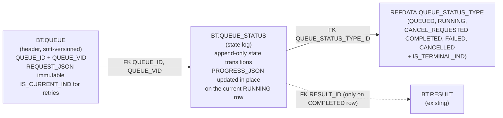
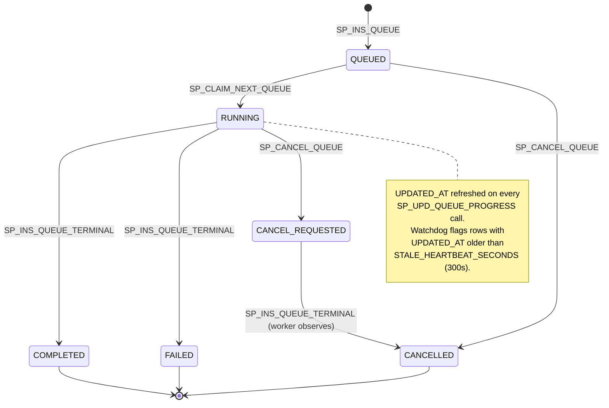

# Backtest Queue — v3 Schema Review (TEMPORARY)

**Status:** review-only. After approval this content folds back into [`backtest-queue.md`](backtest-queue.md) and decision #26, then this file is deleted.
**Updated:** 2026-04-30 (revision 2 — drops cancel flag, slims JSON columns, renames REFDATA, removes defaults).
**Scope:** database layer only (SQL + Liquibase). The Python repo (`src/jobs.py`), API (`api/queue/`), and frontend wait until this is approved.

---

## What changed since revision 1 (responding to review)

| Concern | Resolution |
|---|---|
| Defaults baked into schema | Dropped. `BT.QUEUE.PRIORITY` now has no `DEFAULT`; caller must supply. |
| `IS_CURRENT_STATE_IND` confusing | Renamed to `IS_CURRENT_IND` to match the existing soft-versioning convention (`BT.STRATEGY`, etc.). The table name disambiguates header vs. status. |
| `CANCEL_REQUESTED_IND` redundant with status | Dropped the column. Added `CANCEL_REQUESTED` to `REFDATA.QUEUE_STATUS_TYPE` as a non-terminal status. Cancel flow: `SP_CANCEL_QUEUE` flips RUNNING → CANCEL_REQUESTED via the normal status-row mechanism. Worker sees the new state and finalizes. |
| Too many JSON columns | Cut from 5 to 2. Kept `REQUEST_JSON` (header, immutable input) and `PROGRESS_JSON` (heartbeat). Dropped `SUMMARY_JSON` (UI derives from REQUEST_JSON). Dropped `RESULT_JSON` — full computed metrics already live in `BT.RESULT`, queue carries only `RESULT_ID` FK. Replaced `ERROR_JSON` with plain `ERROR_TEXT`. |
| `NOTES` not needed | Dropped. The status row sequence is the audit trail; freeform text adds no value. |
| `REFDATA.QUEUE_STATUS` naming | Renamed to `REFDATA.QUEUE_STATUS_TYPE` (PK `QUEUE_STATUS_TYPE_ID`). FK on `BT.QUEUE_STATUS` is also `QUEUE_STATUS_TYPE_ID` for clarity. |
| `UPDATED_AT` bumped on flips (caught while reviewing AGENTS.md) | Per AGENTS.md: don't update `UPDATED_AT` for `IS_CURRENT_IND` flips. All `UPDATE … SET IS_CURRENT_IND='N'` now leave `UPDATED_AT` alone — the demoted RUNNING row keeps its last-heartbeat timestamp, which is the right audit answer. |

---

## Architecture



### Why this shape

1. **Header is immutable per VID.** Once a row is inserted into `BT.QUEUE`, only `IS_CURRENT_IND` ever flips (and only on retry). Saves the row from MVCC churn during long runs.
2. **Status log is append-only for transitions.** Each state change inserts a new row and flips the prior `IS_CURRENT_IND` from `'Y'` to `'N'`. Full audit trail without a separate event table.
3. **Progress heartbeats are NOT new rows.** During `RUNNING`, the worker UPDATEs `PROGRESS_JSON` and `UPDATED_AT` on the single current RUNNING row. ~5 rows per job lifetime, even for 20k-trial sweeps.
4. **REFDATA owns the enum.** `REFDATA.QUEUE_STATUS_TYPE` carries `NAME` + `IS_TERMINAL_IND`. Application code joins to it instead of hard-coding strings.
5. **Cancellation is a status transition, not a flag.** `SP_CANCEL_QUEUE` flips RUNNING → CANCEL_REQUESTED via the same row-flip mechanism every other transition uses. The worker learns about it because its next `SP_UPD_QUEUE_PROGRESS` returns `OUT_CURRENT_STATUS = 'CANCEL_REQUESTED'`. No flag column to keep in sync.
6. **No `TIMEOUT_SECONDS`.** Backtest runtime varies (50-trial debug vs 20k-trial walk-forward). Heartbeat watchdog reads `UPDATED_AT` on the current RUNNING row; if older than `STALE_HEARTBEAT_SECONDS` (backend constant, default 300 s) → stale.
7. **Two JSON columns total.** `REQUEST_JSON` on header (immutable input). `PROGRESS_JSON` on status log (heartbeat-mutable). Errors → plain `ERROR_TEXT`. Computed results → `RESULT_ID` FK to `BT.RESULT`.

---

## DDL

### `REFDATA.QUEUE_STATUS_TYPE`

```sql
CREATE TABLE REFDATA.QUEUE_STATUS_TYPE (
    QUEUE_STATUS_TYPE_ID  INTEGER GENERATED ALWAYS AS IDENTITY PRIMARY KEY,
    NAME                  TEXT NOT NULL,
    DISPLAY_NAME          TEXT,
    DESCRIPTION           TEXT,
    IS_TERMINAL_IND       CHAR(1) NOT NULL,
    USER_ID               TEXT,
    UPDATED_AT            TIMESTAMPTZ
);
```

Seed data:

| ID | NAME | IS_TERMINAL_IND | DESCRIPTION |
|---|---|---|---|
| 1 | QUEUED           | N | Waiting in line for a worker slot. |
| 2 | RUNNING          | N | Worker is executing this job. |
| 3 | CANCEL_REQUESTED | N | User asked to cancel a running job; worker has not acknowledged. |
| 4 | COMPLETED        | Y | Job finished successfully. |
| 5 | FAILED           | Y | Job raised an unhandled exception or worker crashed. |
| 6 | CANCELLED        | Y | Job was cancelled by the user (queued or via cooperative cancel). |

### `BT.QUEUE` (header)

```sql
CREATE TABLE BT.QUEUE (
    QUEUE_ID        UUID NOT NULL,
    QUEUE_VID       INTEGER NOT NULL,
    QUEUE_NM        TEXT,
    PRIORITY        INTEGER NOT NULL,
    REQUEST_JSON    JSONB NOT NULL,
    IS_CURRENT_IND  CHAR(1) NOT NULL,
    USER_ID         TEXT NOT NULL,
    CREATED_AT      TIMESTAMPTZ NOT NULL,
    PRIMARY KEY (QUEUE_ID, QUEUE_VID)
);

CREATE INDEX IX_QUEUE_USER_CURRENT
    ON BT.QUEUE (USER_ID, CREATED_AT DESC)
    WHERE IS_CURRENT_IND = 'Y';
```

Notes:
- `QUEUE_NM` is optional — auto-derived from `REQUEST_JSON` at the API layer when blank.
- `PRIORITY` has no DB default — UI passes 100 ("normal") or 0 ("Run Now"). Lower wins.
- No `SUMMARY_JSON` — UI/API computes display fields from `REQUEST_JSON` at read time.
- No `UPDATED_AT` — only `IS_CURRENT_IND` ever flips and AGENTS.md says soft-version flips don't justify it.

### `BT.QUEUE_STATUS` (state log)

```sql
CREATE TABLE BT.QUEUE_STATUS (
    QUEUE_STATUS_ID         BIGINT GENERATED ALWAYS AS IDENTITY PRIMARY KEY,
    QUEUE_ID                UUID NOT NULL,
    QUEUE_VID               INTEGER NOT NULL,
    QUEUE_STATUS_TYPE_ID    INTEGER NOT NULL,
    IS_CURRENT_IND          CHAR(1) NOT NULL,
    PROGRESS_JSON           JSONB,
    ERROR_TEXT              TEXT,
    RESULT_ID               BIGINT,
    USER_ID                 TEXT,
    CREATED_AT              TIMESTAMPTZ NOT NULL,
    UPDATED_AT              TIMESTAMPTZ NOT NULL
);

CREATE INDEX IX_QUEUE_STATUS_LOOKUP
    ON BT.QUEUE_STATUS (QUEUE_ID, QUEUE_VID, CREATED_AT DESC);

CREATE INDEX IX_QUEUE_STATUS_CURRENT
    ON BT.QUEUE_STATUS (QUEUE_STATUS_TYPE_ID, UPDATED_AT)
    WHERE IS_CURRENT_IND = 'Y';
```

Notes:
- `IS_CURRENT_IND='Y'` flags the latest state row per `(QUEUE_ID, QUEUE_VID)`. Every transition flips the prior current row to `'N'` (without bumping its `UPDATED_AT`) and inserts a new `'Y'` row.
- `PROGRESS_JSON` is **updated in place** on the current RUNNING row by `SP_UPD_QUEUE_PROGRESS`. No new row per heartbeat.
- `ERROR_TEXT` is plain text (one line + optional traceback). Set only on FAILED rows.
- `RESULT_ID` is the FK to `BT.RESULT`. Set only on COMPLETED rows.
- `UPDATED_AT` doubles as the heartbeat — drives the stale-RUNNING watchdog.
- No `CANCEL_REQUESTED_IND` — cancellation is signaled by inserting a CANCEL_REQUESTED status row.
- No `NOTES` — the status sequence itself is the audit trail.
- No FK from `BT.QUEUE_STATUS.QUEUE_ID/QUEUE_VID` to `BT.QUEUE` in v1 — defer to phase 2 once shape is proven.

### `BT.V_QUEUE_CURRENT` (convenience view)

```sql
CREATE OR REPLACE VIEW BT.V_QUEUE_CURRENT AS
SELECT
    q.QUEUE_ID,
    q.QUEUE_VID,
    q.QUEUE_NM,
    q.PRIORITY,
    q.REQUEST_JSON,
    q.USER_ID,
    q.CREATED_AT             AS SUBMITTED_AT,
    s.QUEUE_STATUS_ID,
    s.QUEUE_STATUS_TYPE_ID,
    rs.NAME                  AS STATUS_NAME,
    rs.IS_TERMINAL_IND,
    s.PROGRESS_JSON,
    s.ERROR_TEXT,
    s.RESULT_ID,
    s.CREATED_AT             AS STATE_ENTERED_AT,
    s.UPDATED_AT             AS LAST_HEARTBEAT_AT
  FROM BT.QUEUE q
  JOIN BT.QUEUE_STATUS s
    ON  q.QUEUE_ID  = s.QUEUE_ID
    AND q.QUEUE_VID = s.QUEUE_VID
    AND s.IS_CURRENT_IND = 'Y'
  JOIN REFDATA.QUEUE_STATUS_TYPE rs
    ON s.QUEUE_STATUS_TYPE_ID = rs.QUEUE_STATUS_TYPE_ID
 WHERE q.IS_CURRENT_IND = 'Y';
```

Used by:
- `list_active()` — `WHERE IS_TERMINAL_IND = 'N'`
- `list_history()` — `WHERE IS_TERMINAL_IND = 'Y' ORDER BY LAST_HEARTBEAT_AT DESC LIMIT 50`
- `find_stale_running()` — `WHERE STATUS_NAME = 'RUNNING' AND LAST_HEARTBEAT_AT < NOW() - INTERVAL '%s seconds'`
- `get_current(queue_id)` — `WHERE QUEUE_ID = %s`

---

## Procedures (6 total)

| Procedure | Purpose | Key behavior |
|---|---|---|
| `BT.SP_INS_QUEUE` | First submission. Inserts `BT.QUEUE` (VID=1) + `BT.QUEUE_STATUS` (QUEUED). | Caller supplies PRIORITY (no default). |
| `BT.SP_RETRY_QUEUE` | Retry. Snapshots current header, flips IS_CURRENT_IND → 'N' (no UPDATED_AT bump), inserts new VID + fresh QUEUED row. | Returns `OUT_NEW_QUEUE_VID`. |
| `BT.SP_CLAIM_NEXT_QUEUE` | Atomic dequeue. `SELECT … FOR UPDATE SKIP LOCKED` to find next QUEUED row. Demote it (no UPDATED_AT bump), insert RUNNING. | Returns `(QUEUE_ID, QUEUE_VID, REQUEST_JSON, USER_ID)`. |
| `BT.SP_UPD_QUEUE_PROGRESS` | In-place UPDATE of `PROGRESS_JSON` and `UPDATED_AT` on the current RUNNING row. | Returns `OUT_CURRENT_STATUS` so the worker learns about CANCEL_REQUESTED in the same round-trip. |
| `BT.SP_INS_QUEUE_TERMINAL` | Demote current row (must be RUNNING or CANCEL_REQUESTED — no UPDATED_AT bump), append terminal row with ERROR_TEXT / RESULT_ID. | Errors out if prior state is anything else. |
| `BT.SP_CANCEL_QUEUE` | QUEUED → insert CANCELLED row. RUNNING → insert CANCEL_REQUESTED row. CANCEL_REQUESTED / terminal → no-op. | Returns `OUT_PRIOR_STATUS`. |

All procedures:
- Use the project's standard `OUT_SQLSTATE / OUT_SQLMSG / OUT_SQLERRMC` pattern (SQLSTATE first so `DbGateway._call_write` works unchanged).
- Call `CORE_ADMIN.CORE_INS_LOG_PROC('BT', '<proc_name>', V_START_TS, NULL, V_OTHER_TEXT, IN_USER_ID, V_LOG_STATE, V_LOG_MSG)` on success.
- Wrap the body in `EXCEPTION WHEN OTHERS THEN GET STACKED DIAGNOSTICS …`.
- Emit `pg_notify(<channel>, <compact json>)` on state-changing transitions.

NOTIFY channels:

| Channel | Emitted by |
|---|---|
| `bt_queue_enqueued` | `SP_INS_QUEUE`, `SP_RETRY_QUEUE` |
| `bt_queue_started` | `SP_CLAIM_NEXT_QUEUE` |
| `bt_queue_progress` | `SP_UPD_QUEUE_PROGRESS` (only on accepted heartbeats) |
| `bt_queue_cancel_requested` | `SP_CANCEL_QUEUE` (RUNNING branch) |
| `bt_queue_completed` / `bt_queue_failed` / `bt_queue_cancelled` | `SP_INS_QUEUE_TERMINAL` (and `SP_CANCEL_QUEUE` QUEUED branch for `bt_queue_cancelled`) |

Payload format: `{"queue_id": "...", "queue_vid": N, "user_id": "..."}` — well under PG's 8000-byte limit.

---

## State machine



---

## Worker cancel flow (cooperative, no flag column)

```text
loop forever:
    do_some_trials()
    progress = build_progress_payload()
    out_status = CALL SP_UPD_QUEUE_PROGRESS(queue_id, vid, progress, user_id)

    if out_status == 'RUNNING':
        continue                         # heartbeat accepted, keep working
    elif out_status == 'CANCEL_REQUESTED':
        CALL SP_INS_QUEUE_TERMINAL(queue_id, vid, 'CANCELLED', NULL, NULL, user_id)
        return                           # exit cleanly
    else:
        # Job already terminated externally (watchdog, race) — log and exit.
        return
```

The worker never has to query the cancel flag separately; the heartbeat itself is the probe.

---

## Read examples

**Active queue (running + queued, ordered by dequeue priority):**
```sql
SELECT *
  FROM BT.V_QUEUE_CURRENT
 WHERE IS_TERMINAL_IND = 'N'
 ORDER BY (STATUS_NAME = 'RUNNING') DESC,
          PRIORITY ASC,
          SUBMITTED_AT ASC;
```

**Per-user history (last 50 terminal rows):**
```sql
SELECT *
  FROM BT.V_QUEUE_CURRENT
 WHERE IS_TERMINAL_IND = 'Y'
   AND USER_ID = $1
 ORDER BY LAST_HEARTBEAT_AT DESC
 LIMIT 50;
```

**Stale-RUNNING watchdog:**
```sql
SELECT QUEUE_ID, QUEUE_VID, LAST_HEARTBEAT_AT
  FROM BT.V_QUEUE_CURRENT
 WHERE STATUS_NAME = 'RUNNING'
   AND LAST_HEARTBEAT_AT < NOW() - ($1::int * INTERVAL '1 second');
```

**Full audit trail of one job:**
```sql
SELECT s.CREATED_AT, rs.NAME AS STATUS,
       s.PROGRESS_JSON, s.ERROR_TEXT, s.RESULT_ID
  FROM BT.QUEUE_STATUS s
  JOIN REFDATA.QUEUE_STATUS_TYPE rs
    ON s.QUEUE_STATUS_TYPE_ID = rs.QUEUE_STATUS_TYPE_ID
 WHERE s.QUEUE_ID = $1 AND s.QUEUE_VID = $2
 ORDER BY s.CREATED_AT ASC;
```

---

## Write examples (inside the worker / API)

**Enqueue:**
```sql
CALL BT.SP_INS_QUEUE(
    %s::uuid,    -- queue_id
    %s::text,    -- queue_nm
    %s::integer, -- priority
    %s::jsonb,   -- request_json
    %s::text,    -- user_id
    NULL, NULL, NULL  -- OUT
);
```

**Worker progress checkpoint (every ~25 trials or 1s, whichever first):**
```sql
CALL BT.SP_UPD_QUEUE_PROGRESS(
    %s::uuid, %s::integer,                -- queue_id, queue_vid
    %s::jsonb,                            -- progress_json
    %s::text,                             -- user_id
    NULL, NULL, NULL,                     -- OUT_SQLSTATE / OUT_SQLMSG / OUT_SQLERRMC
    NULL                                   -- OUT_CURRENT_STATUS
);
```

**Worker terminal write on success:**
```sql
CALL BT.SP_INS_QUEUE_TERMINAL(
    %s::uuid, %s::integer,                -- queue_id, queue_vid
    'COMPLETED'::text,
    NULL::text,                           -- error_text
    %s::bigint,                           -- result_id (FK to BT.RESULT)
    %s::text,                             -- user_id
    NULL, NULL, NULL                      -- OUT
);
```

**Worker terminal write on failure:**
```sql
CALL BT.SP_INS_QUEUE_TERMINAL(
    %s::uuid, %s::integer,
    'FAILED'::text,
    %s::text,                             -- error_text (message + optional traceback)
    NULL::bigint,
    %s::text,
    NULL, NULL, NULL
);
```

---

## What this slice ships

After review approval, only these files change.

**Created:**
- `db/liquidbase/refdata/tables/QUEUE_STATUS_TYPE.sql`
- `db/liquidbase/refdata/data/QUEUE_STATUS_TYPE.sql`
- `db/liquidbase/bt/tables/QUEUE.sql`
- `db/liquidbase/bt/tables/QUEUE_STATUS.sql`
- `db/liquidbase/bt/views/V_QUEUE_CURRENT.sql`
- Six `db/liquidbase/bt/procedures/SP_*_QUEUE*.sql`
- New changeset entries in both changelogs

**Deleted (already done in revision 1):**
- All v2 `BACKTEST_JOB*` artifacts and changesets `220–235`.

**Not touched in this slice:**
- `src/jobs.py` (Python `QueueRepo`)
- `api/queue/` (manager, worker, lifespan)
- `api/routers/jobs.py`
- `frontend/`
- `docs/design/backtest-queue.md` (canonical doc — folded back after v3 lands)
- `docs/decisions.md` (decision #26 — updated alongside the canonical doc)
