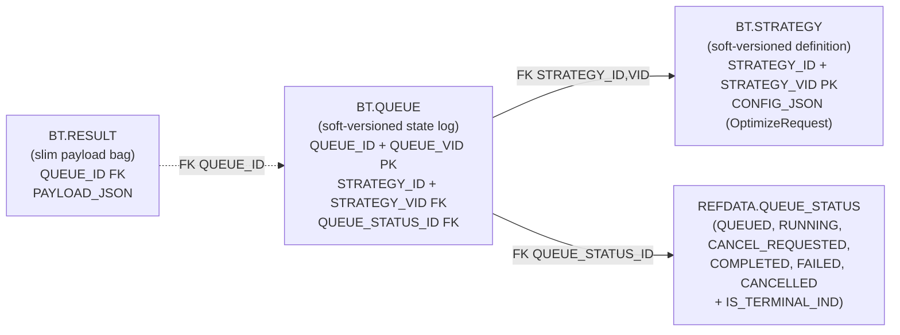
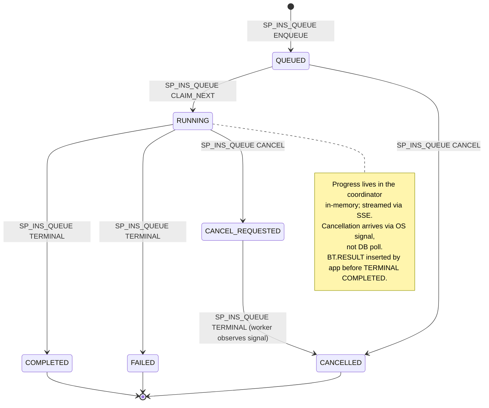

# Backtest Queue — v4b Schema Review (TEMPORARY)

**Status:** review-only. After approval this content folds back into [`backtest-queue.md`](backtest-queue.md) and decision #26, then this file is deleted.
**Updated:** 2026-04-30 (revision 3 — v4b: unify into BT.STRATEGY + soft-versioned BT.QUEUE + slim BT.RESULT).
**Scope:** database layer only (SQL + Liquibase). The Python repo (`src/jobs.py`), API (`api/queue/`), and frontend wait until this is approved.

---

## What changed since revision 2 (responding to review)

| Concern | Resolution |
|---|---|
| `BT.RESULT` outdated; `BT.QUEUE` / `BT.RESULT` / `BT.STRATEGY` duplicated logic | Consolidated. **BT.STRATEGY** is the soft-versioned definition (CONFIG_JSON = full OptimizeRequest). **BT.QUEUE** is the soft-versioned state log. **BT.RESULT** is a slim payload bag. |
| `REQUEST_JSON` / `STRAT_JSON` naming on definition table | Renamed to **`CONFIG_JSON`**. |
| `REFDATA.QUEUE_STATUS_TYPE` naming felt heavy | Renamed back to **`REFDATA.QUEUE_STATUS`**, FK column **`QUEUE_STATUS_ID`**. |
| `RESULT_ID` on `BT.QUEUE` not available at insert time | Dropped from `BT.QUEUE`. `BT.RESULT.QUEUE_ID` references the queue submission — **workers `INSERT BT.RESULT` directly** (**`AGENTS.md`** carve-out), then **`CALL BT.SP_INS_QUEUE`** with **`IN_ACTION='TERMINAL'`** and optional **`IN_RESULT_ID`** for NOTIFY. |
| `BT.QUEUE` needed soft versioning to make `IS_CURRENT_IND` meaningful | Done. PK is now `(QUEUE_ID, QUEUE_VID)`. Each state transition inserts a new VID and flips the prior row's `IS_CURRENT_IND` from `'Y'` to `'N'`. |
| `BT.QUEUE_STATUS` separate table | Removed. The single `BT.QUEUE` table is the state log. |
| `PROGRESS_JSON` write rate concern | Progress is no longer stored in DB. Coordinator keeps it in-memory and streams via SSE. Cancellation uses OS signals delivered by the coordinator, not DB polling. |
| `BT.V_QUEUE_CURRENT` view | Removed. Direct queries are simple enough (`WHERE IS_CURRENT_IND = 'Y'`); join to REFDATA when status name is needed. |
| `SP_RETRY_QUEUE` separate from `SP_INS_QUEUE` | Removed. Retry = new `QUEUE_ID` with VID=1 referencing the same `(STRATEGY_ID, STRATEGY_VID)` — `SP_INS_QUEUE` handles both first-submit and retry. |
| `SP_UPD_QUEUE_PROGRESS` heartbeat proc | Removed (DB no longer tracks progress). |

---

## Architecture


```mermaid
flowchart LR
    refdata["REFDATA.QUEUE_STATUS<br/>(QUEUED, RUNNING, CANCEL_REQUESTED,<br/>COMPLETED, FAILED, CANCELLED<br/>+ IS_TERMINAL_IND)"]
    strat["BT.STRATEGY<br/>(soft-versioned definition)<br/>STRATEGY_ID + STRATEGY_VID PK<br/>CONFIG_JSON (OptimizeRequest)"]
    queue["BT.QUEUE<br/>(soft-versioned state log)<br/>QUEUE_ID + QUEUE_VID PK<br/>STRATEGY_ID + STRATEGY_VID FK<br/>QUEUE_STATUS_ID FK"]
    result["BT.RESULT<br/>(slim payload bag)<br/>QUEUE_ID FK<br/>PAYLOAD_JSON"]

    queue -->|"FK STRATEGY_ID,VID"| strat
    queue -->|"FK QUEUE_STATUS_ID"| refdata
    result -.->|"FK QUEUE_ID"| queue
```

### Why this shape

1. **Strategy = definition; queue = state.** `BT.STRATEGY` carries the full `OptimizeRequest` payload in `CONFIG_JSON`. Editing a strategy bumps `STRATEGY_VID` and flips `IS_CURRENT_IND`. No duplication of factors / ranges / conjunction across tables.
2. **Single state log with soft versioning.** `BT.QUEUE` collapses the v3 split tables into one. PK `(QUEUE_ID, QUEUE_VID)`. Every transition inserts a new VID and flips the prior `IS_CURRENT_IND` — same pattern as `BT.STRATEGY`. ~3 rows per submission lifetime (QUEUED → RUNNING → terminal).
3. **One queue submission = one stable QUEUE_ID.** Retries / re-runs of the same strategy create new `QUEUE_ID`s with VID=1; strategy ID remains stable. Decouples "definition versioning" from "execution attempts".
4. **Progress is in-memory.** No `PROGRESS_JSON`, no heartbeat proc. The coordinator streams trial counts to the frontend via SSE; cancellation is delivered by OS signal to the worker process. Keeps the DB write rate at O(transitions), not O(trials).
5. **`BT.SP_INS_QUEUE`** alone drives **`BT.QUEUE`**. **TERMINAL** does not touch **`BT.RESULT`** — **`INSERT`** the row in application code first, then pass **`IN_RESULT_ID`** **only for NOTIFY enrichment**.
6. **REFDATA owns the enum.** `REFDATA.QUEUE_STATUS` carries `NAME` + `IS_TERMINAL_IND`. Application code joins instead of hard-coding strings.
7. **Cancellation is a status transition.** **`IN_ACTION=CANCEL`** on **`BT.SP_INS_QUEUE`** flips RUNNING → CANCEL_REQUESTED the same way the old standalone cancel proc did.

---

## DDL

### `REFDATA.QUEUE_STATUS`

```sql
CREATE TABLE REFDATA.QUEUE_STATUS (
    QUEUE_STATUS_ID  INTEGER GENERATED ALWAYS AS IDENTITY PRIMARY KEY,
    NAME             TEXT NOT NULL,
    DISPLAY_NAME     TEXT,
    DESCRIPTION      TEXT,
    IS_TERMINAL_IND  CHAR(1) NOT NULL,
    USER_ID          TEXT,
    UPDATED_AT       TIMESTAMPTZ
);
```

Seed data:

| ID | NAME | IS_TERMINAL_IND | DESCRIPTION |
|---|---|---|---|
| 1 | QUEUED           | N | Waiting in line for a worker slot. |
| 2 | RUNNING          | N | Worker is executing this job. |
| 3 | CANCEL_REQUESTED | N | User asked to cancel a running job; worker has not acknowledged. |
| 4 | COMPLETED        | Y | Job finished successfully. |
| 5 | FAILED           | Y | Job raised an unhandled exception or worker crashed. |
| 6 | CANCELLED        | Y | Job was cancelled by the user (queued or via cooperative cancel). |

### `BT.STRATEGY` (soft-versioned definition)

```sql
CREATE TABLE BT.STRATEGY (
    STRATEGY_ID    UUID NOT NULL,
    STRATEGY_VID   INTEGER NOT NULL,
    STRATEGY_NM    TEXT,
    CONFIG_JSON    JSONB NOT NULL,
    IS_CURRENT_IND CHAR(1) NOT NULL,
    USER_ID        TEXT NOT NULL,
    CREATED_AT     TIMESTAMPTZ NOT NULL,
    PRIMARY KEY (STRATEGY_ID, STRATEGY_VID)
);
```

Notes:
- `CONFIG_JSON` = the full `OptimizeRequest` payload (factors[], ranges, conjunction, ticker, trading_period, …). Single source of truth for "what this backtest is".
- Editing a strategy = `SP_INS_STRATEGY` with the same `STRATEGY_ID` (bumps VID, flips prior IS_CURRENT_IND).
- Legacy columns dropped: `TICKER`, `CONJUNCTION`, `TRADING_PERIOD` (now inside CONFIG_JSON).

### `BT.QUEUE` (soft-versioned state log)

```sql
CREATE TABLE BT.QUEUE (
    QUEUE_ID          UUID NOT NULL,
    QUEUE_VID         INTEGER NOT NULL,
    STRATEGY_ID       UUID NOT NULL,
    STRATEGY_VID      INTEGER NOT NULL,
    QUEUE_STATUS_ID   INTEGER NOT NULL,
    IS_CURRENT_IND    CHAR(1) NOT NULL,
    PRIORITY          INTEGER NOT NULL,
    ERROR_TEXT        TEXT,
    USER_ID           TEXT NOT NULL,
    CREATED_AT        TIMESTAMPTZ NOT NULL,
    PRIMARY KEY (QUEUE_ID, QUEUE_VID)
);

CREATE INDEX IX_QUEUE_USER_CURRENT
    ON BT.QUEUE (USER_ID, CREATED_AT DESC)
    WHERE IS_CURRENT_IND = 'Y';

CREATE INDEX IX_QUEUE_STATUS_CURRENT
    ON BT.QUEUE (QUEUE_STATUS_ID, PRIORITY, CREATED_AT)
    WHERE IS_CURRENT_IND = 'Y';

CREATE INDEX IX_QUEUE_STRATEGY
    ON BT.QUEUE (STRATEGY_ID, STRATEGY_VID, CREATED_AT DESC);
```

Notes:
- Soft-versioned. `IS_CURRENT_IND='Y'` flags the latest VID per `QUEUE_ID`. Each transition flips the prior current row to `'N'` (no `UPDATED_AT` bump per AGENTS.md) and inserts a new VID.
- Lifecycle row count: ~3 (QUEUED → RUNNING → terminal). Plus 1 row for CANCEL_REQUESTED if cancel hits a RUNNING job.
- `STRATEGY_ID` / `STRATEGY_VID` denormalized on every row (mild redundancy; saves a join on the worker dequeue path).
- `PRIORITY` denormalized too — **`SP_INS_QUEUE`** **`CLAIM_NEXT`** orders by it without joining `BT.STRATEGY`.
- No `RESULT_ID` (caller can't supply it at terminal-write time — `BT.RESULT.QUEUE_ID` is the link).
- No `PROGRESS_JSON`, no `UPDATED_AT` — progress lives in coordinator memory.

### `BT.RESULT` (slim payload bag)

```sql
CREATE TABLE BT.RESULT (
    RESULT_ID    INTEGER GENERATED ALWAYS AS IDENTITY PRIMARY KEY,
    QUEUE_ID     UUID NOT NULL,
    PAYLOAD_JSON JSONB NOT NULL,
    USER_ID      TEXT,
    CREATED_AT   TIMESTAMPTZ NOT NULL
);

CREATE INDEX IX_RESULT_QUEUE ON BT.RESULT (QUEUE_ID);
```

Notes:
- One row per COMPLETED submission: application **`INSERT INTO BT.RESULT`**, then **`TERMINAL`** on **`SP_INS_QUEUE`**.
- `QUEUE_ID` links back to the queue submission. Strategy info is reachable via `BT.QUEUE` (one extra join). Avoids duplicating `STRATEGY_ID` / `STRATEGY_VID`.
- `PAYLOAD_JSON` merges legacy `METRICS_JSON` + `WALK_FORWARD_JSON` + run metadata (run_at, data_start, data_end, ticker, fee_bps, …) into one document. The API shapes the response.
- No FK constraint — `BT.QUEUE` PK is composite; the result is associated with the submission, not a single transition. Index covers the lookup.

---

## Procedures

Detailed signature: `db/liquidbase/bt/procedures/SP_INS_QUEUE.sql`. Authoring rules: **db-ddl** skill at `.github/skills/db-ddl/SKILL.md`.

**Liquibase checksum note:** changeSet `211-bt-proc-sp-ins-result` became a `DROP PROCEDURE` only. If a dev DB already executed the old SQL file, run `liquibase clearCheckSums` (or equivalent) once for the `bt` changelog.

<a id="procedure-reference"></a>

### Procedure reference

**`BT.SP_INS_STRATEGY`** — unchanged. Versioned strategy row with **`CONFIG_JSON`**. Returns **`OUT_STRATEGY_VID`**.

**`BT.SP_INS_QUEUE`** — **single entry point for every `BT.QUEUE` mutation.** Pass **`IN_ACTION`** (case-insensitive): **`ENQUEUE`**, **`CLAIM_NEXT`**, **`TERMINAL`**, **`CANCEL`**. Pass only the **IN_** parameters relevant to that branch; others may be **`NULL`**.

| `IN_ACTION` | Required `IN_*` (non-null) | Effect |
|---|---|---|
| **`ENQUEUE`** | `IN_QUEUE_ID`, `IN_STRATEGY_ID`, `IN_STRATEGY_VID`, `IN_PRIORITY`, `IN_USER_ID` | First row `QUEUE_VID=1`, **QUEUED**. **`bt_queue_enqueued`**. |
| **`CLAIM_NEXT`** | *(none required; `IN_USER_ID` optional for logging fallback)* | **`FOR UPDATE SKIP LOCKED`** next **QUEUED** current row → **RUNNING**; fills **`OUT_QUEUE_ID`**, **`OUT_QUEUE_VID`**, **`OUT_STRATEGY_ID`**, **`OUT_STRATEGY_VID`**, **`OUT_CONFIG_JSON`**, **`OUT_OWNER_USER_ID`**. Empty queue → **`OUT_QUEUE_ID` IS NULL** and the procedure **returns before** `CORE_INS_LOG_PROC`. **`bt_queue_started`**. |
| **`TERMINAL`** | `IN_QUEUE_ID`, `IN_TERMINAL_NAME` (`COMPLETED` / `FAILED` / `CANCELLED`), `IN_USER_ID`; `IN_ERROR_TEXT` for failures | Current row must be **RUNNING** or **CANCEL_REQUESTED**. **`BT.RESULT` is not written here** — call site **`INSERT`s the result row first**, then passes optional **`IN_RESULT_ID`** for **`pg_notify` JSON** only. **`bt_queue_completed`** / **`bt_queue_failed`** / **`bt_queue_cancelled`**. |
| **`CANCEL`** | `IN_QUEUE_ID`, `IN_USER_ID` | **QUEUED** → terminal **CANCELLED**; **RUNNING** → **CANCEL_REQUESTED**; idempotent no-op if already terminal or cancel-pending; **`OUT_PRIOR_STATUS`** populated. **`bt_queue_cancelled`** / **`bt_queue_cancel_requested`**. |

Outputs **`OUT_SQLSTATE`**, **`OUT_SQLMSG`**, **`OUT_SQLERRMC`** on every path; claim / cancel / terminal populate the additional **OUT_** columns listed in the SQL file.

**`BT.RESULT`** — **direct `INSERT` from application code** (**`AGENTS.md`** carve-out). No `BT.SP_INS_RESULT` procedure.

**`CORE_ADMIN.CORE_INS_LOG_PROC`** — still called once on success (except early **`RETURN`** paths: empty **`CLAIM_NEXT`**, idempotent **`CANCEL`**).

---

### Summary

| Artifact | Role |
|---|---|
| `BT.SP_INS_STRATEGY` | Persist versioned strategy (**`CONFIG_JSON`**) |
| `BT.SP_INS_QUEUE` | **All** `BT.QUEUE` transitions via **`IN_ACTION`** |
| **`INSERT` `BT.RESULT`** | Payload rows from queue worker (not a stored procedure) |

**Stored procedure authoring** (db-ddl): `CREATED_AT` **`NOW()`** in SQL `INSERT`s; `SP_INS_QUEUE` does not `CALL` nested BT procedures — only `CORE_INS_LOG_PROC`.

**`pg_notify`** channels (unchanged behaviour, new dispatch site):

| Channel | `IN_ACTION` |
|---|---|
| `bt_queue_enqueued` | `ENQUEUE` |
| `bt_queue_started` | `CLAIM_NEXT` (claimed) |
| `bt_queue_cancel_requested` | `CANCEL` (RUNNING branch) |
| `bt_queue_completed` / `bt_queue_failed` / `bt_queue_cancelled` | `TERMINAL` (and `CANCEL` queued→cancelled) |

Payload format: `{"queue_id": "...", "queue_vid": N, "user_id": "...", "result_id": ...}` (keys present as applicable) — under PG's NOTIFY size cap.

---

## State machine


```mermaid
stateDiagram-v2
    [*] --> QUEUED: SP_INS_QUEUE ENQUEUE
    QUEUED --> RUNNING: SP_INS_QUEUE CLAIM_NEXT
    QUEUED --> CANCELLED: SP_INS_QUEUE CANCEL
    RUNNING --> COMPLETED: SP_INS_QUEUE TERMINAL
    RUNNING --> FAILED: SP_INS_QUEUE TERMINAL
    RUNNING --> CANCEL_REQUESTED: SP_INS_QUEUE CANCEL
    CANCEL_REQUESTED --> CANCELLED: SP_INS_QUEUE TERMINAL (worker observes signal)
    COMPLETED --> [*]
    FAILED --> [*]
    CANCELLED --> [*]
    note right of RUNNING
        Progress lives in the coordinator
        in-memory; streamed via SSE.
        Cancellation arrives via OS signal,
        not DB poll.
        BT.RESULT inserted by app before TERMINAL COMPLETED.
    end note
```

---

## Read examples

**Active queue (running + queued, ordered by dequeue priority):**
```sql
SELECT q.QUEUE_ID, q.QUEUE_VID, q.STRATEGY_ID, q.STRATEGY_VID,
       q.PRIORITY, rs.NAME AS STATUS_NAME, q.CREATED_AT
  FROM BT.QUEUE q
  JOIN REFDATA.QUEUE_STATUS rs USING (QUEUE_STATUS_ID)
 WHERE q.IS_CURRENT_IND = 'Y'
   AND rs.IS_TERMINAL_IND = 'N'
 ORDER BY (rs.NAME = 'RUNNING') DESC,
          q.PRIORITY ASC,
          q.CREATED_AT ASC;
```

**Per-user history (last 50 terminal submissions):**
```sql
SELECT q.QUEUE_ID, q.STRATEGY_ID, q.STRATEGY_VID,
       rs.NAME AS STATUS_NAME, q.ERROR_TEXT, q.CREATED_AT
  FROM BT.QUEUE q
  JOIN REFDATA.QUEUE_STATUS rs USING (QUEUE_STATUS_ID)
 WHERE q.IS_CURRENT_IND  = 'Y'
   AND rs.IS_TERMINAL_IND = 'Y'
   AND q.USER_ID          = $1
 ORDER BY q.CREATED_AT DESC
 LIMIT 50;
```

**Full audit trail of one submission:**
```sql
SELECT q.QUEUE_VID, q.CREATED_AT, rs.NAME AS STATUS,
       q.ERROR_TEXT
  FROM BT.QUEUE q
  JOIN REFDATA.QUEUE_STATUS rs USING (QUEUE_STATUS_ID)
 WHERE q.QUEUE_ID = $1
 ORDER BY q.QUEUE_VID ASC;
```

**Get the result for a completed submission:**
```sql
SELECT r.PAYLOAD_JSON
  FROM BT.RESULT r
 WHERE r.QUEUE_ID = $1
 ORDER BY r.CREATED_AT DESC
 LIMIT 1;
```

---

## Write examples (inside the worker / API)

Unified procedure: always **`CALL BT.SP_INS_QUEUE`** with **`IN_ACTION`** first. **IN**: 9 args after **`IN_ACTION`**; **OUT**: 10 (**`OUT_SQLSTATE` … `OUT_PRIOR_STATUS`**) — see `db/liquidbase/bt/procedures/SP_INS_QUEUE.sql`. Drivers bind placeholders for **`OUT`**; in **`psql`**, wrap in **`DO`** with local variables.

**Submit a new backtest (strategy + enqueue in one transaction):**
```sql
CALL BT.SP_INS_STRATEGY(...);
CALL BT.SP_INS_QUEUE(
    'ENQUEUE'::text,
    %s::uuid,    -- IN_QUEUE_ID
    %s::uuid,    -- IN_STRATEGY_ID
    %s::integer, -- IN_STRATEGY_VID
    %s::integer, -- IN_PRIORITY
    NULL::text, NULL::text, NULL::integer, -- IN_TERMINAL_NAME / IN_ERROR_TEXT / IN_RESULT_ID (unused on ENQUEUE)
    %s::text,    -- IN_USER_ID
    NULL::text, NULL::text, NULL::text,   -- OUT_SQLSTATE / OUT_SQLMSG / OUT_SQLERRMC
    NULL::uuid, NULL::integer, NULL::uuid, NULL::integer, NULL::jsonb, NULL::text, NULL::text
                                           -- OUT_QUEUE_ID … OUT_PRIOR_STATUS
);
```

**Rerun an existing strategy:** same **`ENQUEUE`** row as above with non-null **`IN_QUEUE_ID`**, **`IN_STRATEGY_ID`**, **`IN_STRATEGY_VID`**, **`IN_PRIORITY`**, **`IN_USER_ID`**.

**Coordinator claims next job:**
```sql
CALL BT.SP_INS_QUEUE(
    'CLAIM_NEXT'::text,
    NULL::uuid, NULL::uuid, NULL::integer, NULL::integer,
    NULL::text, NULL::text, NULL::integer,
    NULL::text,                          -- IN_USER_ID (positional only; CLAIM_NEXT ignores it)
    NULL::text, NULL::text, NULL::text,
    NULL::uuid, NULL::integer, NULL::uuid, NULL::integer, NULL::jsonb, NULL::text, NULL::text
);
```

**Worker success** — **1)** `INSERT INTO BT.RESULT (...) VALUES (queue_id, payload, user_id, NOW()) RETURNING RESULT_ID`; **2)** terminal:
```sql
CALL BT.SP_INS_QUEUE(
    'TERMINAL'::text,
    %s::uuid, NULL::uuid, NULL::integer, NULL::integer,
    'COMPLETED'::text,
    NULL::text,
    %s::integer,  -- IN_RESULT_ID from INSERT … RETURNING (optional; NOTIFY enrichment only)
    %s::text,     -- IN_USER_ID
    NULL::text, NULL::text, NULL::text,
    NULL::uuid, NULL::integer, NULL::uuid, NULL::integer, NULL::jsonb, NULL::text, NULL::text
);
```

**Worker failure:**
```sql
CALL BT.SP_INS_QUEUE(
    'TERMINAL'::text,
    %s::uuid, NULL::uuid, NULL::integer, NULL::integer,
    'FAILED'::text,
    %s::text,      -- IN_ERROR_TEXT
    NULL::integer, -- IN_RESULT_ID
    %s::text,      -- IN_USER_ID
    NULL::text, NULL::text, NULL::text,
    NULL::uuid, NULL::integer, NULL::uuid, NULL::integer, NULL::jsonb, NULL::text, NULL::text
);
```

**Cancel:**
```sql
CALL BT.SP_INS_QUEUE(
    'CANCEL'::text,
    %s::uuid, NULL::uuid, NULL::integer, NULL::integer,
    NULL::text, NULL::text, NULL::integer,
    %s::text,    -- IN_USER_ID
    NULL::text, NULL::text, NULL::text,
    NULL::uuid, NULL::integer, NULL::uuid, NULL::integer, NULL::jsonb, NULL::text, NULL::text
);
```

---

## What this slice ships

After review approval, only these files change.

**Created:**
- `db/liquidbase/refdata/tables/QUEUE_STATUS.sql`
- `db/liquidbase/refdata/data/QUEUE_STATUS.sql`
- `db/liquidbase/bt/tables/QUEUE.sql` (rewritten v4)
- `db/liquidbase/bt/procedures/SP_INS_QUEUE.sql` — unified queue state machine (**`IN_ACTION`**)
- New / replaced Liquibase changesets (incl. **`211`** `DROP` for removed **`SP_INS_RESULT`**, **`236`** legacy overload **`DROP`s**)

**Reshaped:**
- `STRATEGY.sql` / **`SP_INS_STRATEGY.sql`** — **`CONFIG_JSON`** model
- **`RESULT.sql`** — slim **`QUEUE_ID` + `PAYLOAD_JSON`** (**no** **`BT.SP_INS_RESULT`**)
- **`bt-changelog.xml`** — **`BT.SP_*`** queue helpers collapsed to **`SP_INS_QUEUE`**, removed **`232`/`234`/`235`**

**Deleted:**
- Separate queue procedure files (**`SP_CLAIM_NEXT_QUEUE`**, **`SP_INS_QUEUE_TERMINAL`**, **`SP_CANCEL_QUEUE`**, **`SP_INS_RESULT`**)
- `db/liquidbase/refdata/tables/QUEUE_STATUS_TYPE.sql` (renamed)
- `db/liquidbase/refdata/data/QUEUE_STATUS_TYPE.sql` (renamed)
- `db/liquidbase/bt/tables/QUEUE_STATUS.sql` (folded into BT.QUEUE)
- `db/liquidbase/bt/views/V_QUEUE_CURRENT.sql` (no view needed)
- `db/liquidbase/bt/procedures/SP_RETRY_QUEUE.sql` (folded into SP_INS_QUEUE)
- `db/liquidbase/bt/procedures/SP_UPD_QUEUE_PROGRESS.sql` (progress moved out of DB)

**Not touched in this slice:**
- `src/jobs.py` (Python `QueueRepo`)
- `api/queue/` (manager, worker, lifespan)
- `api/routers/jobs.py`
- `frontend/`
- `docs/design/backtest-queue.md` (§6.3, §7 note, §10.3 v4b bridge only — body still draft v2 **`BACKTEST_JOB`** narrative)
- `docs/decisions.md` (decision #26 — updated alongside the canonical doc)
