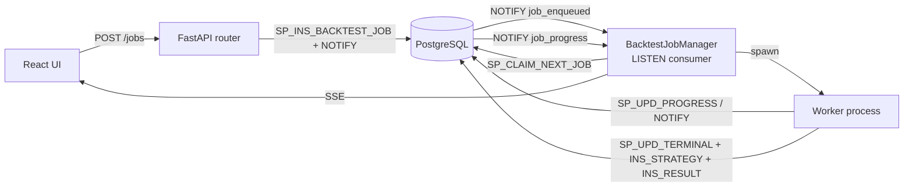

# Design: Queued Background Backtests

**Status:** Draft v2 — not yet implemented. Direction (Postgres-backed FIFO + `LISTEN/NOTIFY`) ratified in [decision #26](../decisions.md). v2 incorporates review feedback (drop VID, slim procedures, cooperative cancel in Phase 1, explicit module placement).
**Date:** 2026-04-30
**Scope:** `src/jobs.py`, `api/queue/`, `api/routers/jobs.py`, `frontend/`, `db/liquidbase/bt/`

---

## 1. Problem

Large backtests and parameter optimizations are CPU-heavy. A run with 20,000 iterations can take long enough that the current single-run UI becomes limiting:

1. The user can only focus on one optimization at a time.
2. There is no persistent queue of pending jobs.
3. There is no backend-managed notion of `QUEUED`, `RUNNING`, `COMPLETED`, `FAILED`, or `CANCELLED`.
4. The UI cannot continue editing or queueing strategies while one run is in progress.

There is also an implementation constraint:

1. Python threads do not provide useful CPU parallelism for heavy pure-Python or mixed pandas/numpy workloads (GIL).
2. A thread is still useful for request detachment or I/O orchestration, but not as the main scaling primitive for many large concurrent backtests.

---

## 2. Goals

### Functional

1. The backend accepts multiple backtest jobs and runs them one at a time in queue order.
2. The UI shows a queue panel with `QUEUED`, `RUNNING`, `COMPLETED`, `FAILED`, `CANCELLED` jobs.
3. The running job shows progress as iterations completed vs total.
4. The user can add more jobs while another job is running.
5. The user can cancel any job (queued **or** running) from the UI.
6. The running job automatically advances to the next queued job when complete.
7. Completed jobs retain summary and result references.

### UX

1. Editing the current strategy config never mutates submitted jobs.
2. The queue updates live without manual refresh.
3. The user can inspect any job (running or historical) separately from the editable draft form.

### Technical

1. Use process-based execution for CPU-bound optimization work.
2. Persist queue state in PostgreSQL so jobs survive API restarts.
3. Reuse existing backtest pipeline and existing `BT.SP_INS_STRATEGY` / `BT.SP_INS_RESULT` procedures.
4. Drive live updates via PostgreSQL `LISTEN/NOTIFY`, not polling.

---

## 3. Non-Goals

1. Running many backtests concurrently in v1.
2. Distributed scheduling across multiple worker hosts.
3. Replacing the current optimization logic.
4. Introducing Celery, Redis, or external queue infrastructure.
5. Auto-retry of failed jobs (manual retry only).

---

## 4. Module Placement

The queue spans the DB layer, the FastAPI process, and the React frontend. Following the existing repo pattern (`BacktestCache` lives in `src/data.py` even though only the API uses it):

| Component | Location | Reason |
|---|---|---|
| `BacktestJobRepo` (`DbGateway` subclass — wraps SP calls and read queries) | `src/jobs.py` | Pure DB access. Reusable from tests, debug CLIs, and any future inspection tool. No FastAPI dependency. |
| `BacktestJobManager` (lifespan-owned coordinator, `LISTEN/NOTIFY` consumer, child-process supervisor) | `api/queue/manager.py` | Tightly coupled to FastAPI lifespan. No meaning outside the API process. |
| Worker entry point | `api/queue/worker.py` | Spawned as a child process. Imports the pipeline from `src/`. |
| HTTP endpoints | `api/routers/jobs.py` | Mirrors `routers/backtest.py`. |
| Pydantic request/response schemas | `api/schemas/jobs.py` | Mirrors `schemas/backtest.py`. |
| Frontend queue panel + state | `frontend/src/features/queue/` | New feature folder; unlocks the deferred "Backtest feature module" item from the [Frontend Audit](frontend-audit.md). |

The CLI (`src/main.py`) is **not** modified — it runs synchronously and has no use for queueing.

---

## 5. Architecture

### 5.1 High-level model

Three roles inside the same FastAPI deployment unit:

1. **API server** — accepts job submissions, queue mutations, queue queries, and SSE subscriptions.
2. **Job manager** — runs inside FastAPI lifespan. Reacts to `LISTEN/NOTIFY` events. Spawns and supervises one worker process at a time. Maintains in-memory SSE subscriber lists.
3. **Worker process** — executes exactly one backtest job in a separate Python process. Writes progress and terminal state directly to the DB via stored procedures.



### 5.2 Why a single worker first

The requested behaviour is explicitly serial: one job runs, then the next queued job starts. A single worker matches this and avoids resource contention, duplicate data fetches, and CPU starvation. Multi-worker scaling is a future concern.

### 5.3 Why process-based execution

1. Avoids GIL contention for CPU-heavy backtest loops.
2. Prevents a long optimization from blocking the API event loop.
3. Provides a clean failure boundary — a worker crash doesn't take down the API.

Recommended primitive: `multiprocessing.Process` (not `ProcessPoolExecutor`). Explicit lifecycle control makes cancellation, timeout, and termination cleaner than a pooled future.

### 5.4 Why `LISTEN/NOTIFY` over polling

The original draft proposed a 1-second polling loop. With `NOTIFY` triggered on every state change we react in <10 ms with zero idle DB load. A slow watchdog poll (every 30 s) is kept only as a safety net for missed notifications (e.g. transient connection drop).

---

## 6. Data Model

Two new tables under the `BT` schema.

### 6.1 `BT.BACKTEST_JOB`

Purpose: durable queue item and current job state. **One row per job, mutated in place** (no soft-versioning — the audit trail lives in `BACKTEST_JOB_EVENT`).

| Column | Type | Notes |
|---|---|---|
| `BACKTEST_JOB_ID` | `UUID` | PK. UUID v7 (time-ordered). |
| `BACKTEST_JOB_NM` | `TEXT` | Optional display name. Auto-generated from request if blank, like `STRATEGY_NM`. |
| `JOB_STATE` | `TEXT` | `QUEUED`, `RUNNING`, `COMPLETED`, `FAILED`, `CANCELLED`. |
| `PRIORITY` | `INTEGER` | Default `100`. Lower = sooner. `Run Now` enqueues with `0`. Dequeue order: `(PRIORITY, CREATED_AT)`. |
| `CANCEL_REQUESTED_IND` | `CHAR(1)` | Default `'N'`. Set to `'Y'` to ask a `RUNNING` worker to exit cleanly. |
| `TIMEOUT_SECONDS` | `INTEGER` | Default `1800` (30 min). Worker self-terminates if exceeded. Coordinator marks stale `RUNNING` jobs as `FAILED` on startup if `STARTED_AT + TIMEOUT_SECONDS < now()`. |
| `REQUEST_JSON` | `JSONB` | Authoritative replayable input — full optimize request payload. |
| `SUMMARY_JSON` | `JSONB` | User-facing summary for queue table rendering (symbol, mode, indicator, strategy, total_trials). Computed at enqueue. |
| `PROGRESS_JSON` | `JSONB` | Overwritten in place. `{ trial, total, best_sharpe, started_at }`. |
| `RESULT_JSON` | `JSONB` | Compact summary for queue display only (best params, top metrics). Full analytics fetched via `BT.RESULT`. |
| `ERROR_JSON` | `JSONB` | `{ type, message, traceback }` on failure. |
| `STRATEGY_VID` | `INTEGER` | Nullable FK → `BT.STRATEGY(STRATEGY_VID)`. Set on completion. Lets "view result" load the canonical strategy. |
| `RESULT_ID` | `BIGINT` | Nullable FK → `BT.RESULT(RESULT_ID)`. Set on completion. |
| `STARTED_AT` | `TIMESTAMPTZ` | Set on `RUNNING` transition. |
| `FINISHED_AT` | `TIMESTAMPTZ` | Set on terminal transition. |
| `USER_ID` | `TEXT` | The submitting user. Indexed. |
| `CREATED_AT` | `TIMESTAMPTZ` | Default `now()`. |
| `UPDATED_AT` | `TIMESTAMPTZ` | Updated on every state mutation. |

Indexes:

- `(USER_ID, JOB_STATE, PRIORITY, CREATED_AT)` — supports both per-user queue listing and the dequeue scan.
- `(JOB_STATE, STARTED_AT)` partial index `WHERE JOB_STATE = 'RUNNING'` — supports stale-job recovery scan.

**Removed from v1:**

- ~~`BACKTEST_JOB_VID`~~ — soft-versioning is for things like `STRATEGY` where edit history matters. A job has a state machine, not a version history.
- ~~`QUEUE_POS`~~ — computed on read via `ROW_NUMBER() OVER (ORDER BY PRIORITY, CREATED_AT) WHERE JOB_STATE = 'QUEUED'`. Storing it would race with concurrent inserts/cancels.

### 6.2 `BT.BACKTEST_JOB_EVENT`

Purpose: append-only audit log of **state transitions only** — not per-trial progress.

| Column | Type | Notes |
|---|---|---|
| `BACKTEST_JOB_EVENT_ID` | `BIGINT GENERATED ALWAYS AS IDENTITY` | PK. Monotonic — supports SSE `Last-Event-ID` resume. |
| `BACKTEST_JOB_ID` | `UUID` | FK → `BACKTEST_JOB`. |
| `EVENT_TYPE` | `TEXT` | `ENQUEUED`, `STARTED`, `COMPLETED`, `FAILED`, `CANCELLED`, `CANCEL_REQUESTED`, `TIMEOUT`. |
| `PAYLOAD_JSON` | `JSONB` | Optional event-specific detail. |
| `USER_ID` | `TEXT` | Who triggered the event (system or user). |
| `CREATED_AT` | `TIMESTAMPTZ` | Default `now()`. |

Indexed on `(BACKTEST_JOB_ID, BACKTEST_JOB_EVENT_ID)`.

**No per-trial events** — that would be ~20k rows per large optimization. Per-trial progress lives in `BACKTEST_JOB.PROGRESS_JSON`, overwritten in place.

### 6.3 Existing BT tables

Untouched. The queue **orchestrates** but does not replace:

1. `BT.STRATEGY` (versioned) via `BT.SP_INS_STRATEGY`
2. `BT.RESULT` (append-only) via `BT.SP_INS_RESULT`

The job row links to those records via `STRATEGY_VID` + `RESULT_ID` after completion.

---

## 7. Stored Procedures

Six procedures (down from the original eight).

| Procedure | Purpose | Triggers `NOTIFY` |
|---|---|---|
| `BT.SP_INS_BACKTEST_JOB` | Enqueue a job. Inserts row + `ENQUEUED` event. | `job_enqueued` |
| `BT.SP_CLAIM_NEXT_JOB` | Atomic dequeue. `SELECT ... FOR UPDATE SKIP LOCKED` on the next `QUEUED` row, transition to `RUNNING`, set `STARTED_AT`, insert `STARTED` event. Returns the claimed job (or null). | `job_started` |
| `BT.SP_UPD_BACKTEST_JOB_PROGRESS` | In-place update of `PROGRESS_JSON` + `UPDATED_AT`. No event row. | `job_progress` |
| `BT.SP_UPD_BACKTEST_JOB_TERMINAL` | One call writes `JOB_STATE` (`COMPLETED`/`FAILED`/`CANCELLED`/`TIMEOUT`) + `RESULT_JSON` or `ERROR_JSON` + `STRATEGY_VID` + `RESULT_ID` + `FINISHED_AT` + corresponding event row. | `job_completed` / `job_failed` / `job_cancelled` |
| `BT.SP_CANCEL_BACKTEST_JOB` | If `JOB_STATE = QUEUED`: transition to `CANCELLED` directly. If `RUNNING`: set `CANCEL_REQUESTED_IND = 'Y'` and insert `CANCEL_REQUESTED` event (worker observes flag at next checkpoint). | `job_cancelled` or `job_cancel_requested` |
| `BT.SP_INS_BACKTEST_JOB_EVENT` | Append-only event insert. Called internally by the procedures above. | varies by event type |

Reads (`GET /jobs`, `GET /jobs/{id}`) use plain `SELECT` per the project's "SELECT queries are unrestricted" rule.

### State transitions

```
                   ┌──────────┐
                   │  QUEUED  │
                   └────┬─────┘
              ┌─────────┴─────────┐
              ▼                   ▼
       ┌───────────┐        ┌──────────┐
       │ CANCELLED │        │ RUNNING  │
       └───────────┘        └────┬─────┘
                                 │
                  ┌──────────────┼──────────────┬─────────────┐
                  ▼              ▼              ▼             ▼
           ┌───────────┐ ┌────────────┐ ┌───────────┐ ┌──────────┐
           │ COMPLETED │ │   FAILED   │ │ CANCELLED │ │ TIMEOUT  │
           └───────────┘ └────────────┘ └───────────┘ └──────────┘
```

Terminal states (`COMPLETED`, `FAILED`, `CANCELLED`, `TIMEOUT`) are immutable. To re-run, the user submits a new job (Phase 2 adds a one-click "Retry" that copies `REQUEST_JSON`).

---

## 8. Backend API

All endpoints require auth (`require_user`).

### 8.1 Endpoints

| Method | Path | Purpose |
|---|---|---|
| `POST` | `/api/v1/backtest/jobs` | Enqueue. Returns `{ job_id, queue_pos }`. **Rate limit:** caller may have at most 20 `QUEUED` jobs at a time → `429` otherwise. |
| `GET` | `/api/v1/backtest/jobs` | List queue + recent history (last 50 terminal jobs). Supports `?state=RUNNING` etc. filter. |
| `GET` | `/api/v1/backtest/jobs/{job_id}` | Full job detail incl. `REQUEST_JSON`, current progress, links to result. |
| `GET` | `/api/v1/backtest/jobs/{job_id}/result` | Resolves `STRATEGY_VID` + `RESULT_ID` → returns the same payload shape as today's `POST /backtest/optimize` response, so the existing analysis components reuse unchanged. |
| `POST` | `/api/v1/backtest/jobs/{job_id}/cancel` | Cancels a `QUEUED` or `RUNNING` job (cooperative for running). Idempotent. |
| `DELETE` | `/api/v1/backtest/jobs/{job_id}` | Hard delete a terminal-state job from history. Returns `409` if not terminal. |
| `GET` | `/api/v1/backtest/jobs/stream` | SSE stream of queue events. Supports `Last-Event-ID` header backed by `BACKTEST_JOB_EVENT_ID` for reconnection. |

### 8.2 Enqueue request

```json
{
  "job_name": "BTC Bollinger 2016-now",
  "priority": "normal",
  "request": {
    "symbol": "BTC-USD",
    "start": "2016-01-01",
    "end": "2026-04-25",
    "trading_period": 365,
    "fee_bps": 5,
    "data_source": "yahoo",
    "factors": [
      {
        "indicator": "bollinger",
        "strategy": "momentum",
        "data_column": "price",
        "window_range": { "min": 5, "max": 100, "step": 5 },
        "signal_range": { "min": 0.25, "max": 2.5, "step": 0.25 }
      }
    ],
    "walk_forward": true,
    "split_ratio": 0.5
  }
}
```

`priority` is `"normal"` (→ DB priority `100`) or `"high"` (→ DB priority `0`, jumps the queue). The frontend's "Add to Queue" sends `normal`; "Run Now" sends `high`.

### 8.3 Queue row response

```json
{
  "job_id": "uuid",
  "job_name": "BTC Bollinger 2016-now",
  "state": "RUNNING",
  "queue_pos": 0,
  "priority": "normal",
  "submitted_at": "2026-04-25T12:00:00Z",
  "started_at": "2026-04-25T12:00:03Z",
  "summary": {
    "symbol": "BTC-USD",
    "n_factors": 1,
    "factors": [{ "indicator": "bollinger", "strategy": "momentum" }],
    "total_trials": 20000
  },
  "progress": {
    "trial": 734,
    "total": 20000,
    "remaining": 19266,
    "pct": 3.67,
    "best_sharpe": 1.4321
  },
  "cancel_requested": false
}
```

### 8.4 SSE event types

| Event | When | Payload |
|---|---|---|
| `snapshot` | On connect | Full queue + recent history rows |
| `job_enqueued` | After `SP_INS_BACKTEST_JOB` | Full row |
| `job_started` | After `SP_CLAIM_NEXT_JOB` | Full row |
| `job_progress` | Throttled by worker | `{ job_id, progress }` |
| `job_completed` / `job_failed` / `job_cancelled` / `job_timeout` | Terminal transition | Full row |
| `job_cancel_requested` | User asked to cancel a running job | `{ job_id }` |

Each SSE event includes `id: <BACKTEST_JOB_EVENT_ID>` so reconnects can resume via `Last-Event-ID`.

---

## 9. Job Manager (coordinator)

`BacktestJobManager` is created in FastAPI lifespan and torn down on shutdown.

### 9.1 Startup

1. Open a dedicated psycopg connection in autocommit mode for `LISTEN`.
2. `LISTEN job_enqueued, job_progress, job_completed, job_failed, job_cancelled, job_cancel_requested`.
3. Run **stale-job recovery**: any `RUNNING` job with `STARTED_AT + TIMEOUT_SECONDS < now()` (or no live worker process) → mark `FAILED` with reason `restart_during_run`. **Don't auto-requeue** (non-idempotent side effects already written to `BT.RESULT` would double up).
4. Try to claim and start the next `QUEUED` job (in case one was added while the API was down).

### 9.2 Event loop

The manager runs a single asyncio task that:

1. Awaits notifications on the `LISTEN` connection.
2. On `job_enqueued` or `job_completed`/`job_failed`/`job_cancelled` (anything that frees the slot) — if no worker is currently running, attempt `SP_CLAIM_NEXT_JOB` and spawn the worker if one is returned.
3. On `job_progress` — fan out to subscribed SSE clients.
4. On `job_cancel_requested` — the running worker observes the flag itself; the manager just relays the SSE event.

A separate watchdog task wakes every 30 s and:

1. Re-runs stale-job recovery.
2. If the worker handle is `None` but a `QUEUED` job exists, attempt to claim again (catches missed notifications).

### 9.3 Worker supervision

- `multiprocessing.Process` with `target=run_worker, args=(job_id, db_conninfo, ...)`.
- Manager retains the `Process` handle and the `job_id`.
- On process exit:
  - If the worker wrote a terminal state → fine, NOTIFY arrives, slot frees.
  - If the worker died without writing terminal state → manager calls `SP_UPD_BACKTEST_JOB_TERMINAL(state='FAILED', error={crash, exit_code})`.

### 9.4 SSE fanout

A simple in-memory `set[asyncio.Queue]` of subscriber queues. Each connected SSE client gets its own queue. The `LISTEN` task `put`s each event onto every subscriber queue. Disconnections clean up via `finally`.

---

## 10. Worker process

`api/queue/worker.py` exposes a `run(job_id, db_conninfo)` entry point that runs in the child process.

### 10.1 Flow

1. Open its own DB connection (separate from the API's pool).
2. `SELECT REQUEST_JSON, TIMEOUT_SECONDS FROM BT.BACKTEST_JOB WHERE BACKTEST_JOB_ID = :id`.
3. Reconstruct the existing `OptimizeRequest` Pydantic model.
4. Set up a deadline: `deadline = now + TIMEOUT_SECONDS`.
5. Call the existing optimization pipeline (`api.services.backtest.run_optimize`) with a per-trial callback.

### 10.2 Per-trial callback

Throttled — runs the body only when:

- `trial % PROGRESS_EVERY_N_TRIALS == 0` (default 25), **or**
- `now() - last_progress_at > PROGRESS_EVERY_T_SECONDS` (default 1.0)

When it runs:

1. `SP_UPD_BACKTEST_JOB_PROGRESS(job_id, trial, total, best_sharpe)`.
2. Re-read `CANCEL_REQUESTED_IND` and check the deadline:
   - `CANCEL_REQUESTED_IND = 'Y'` → raise `JobCancelled`.
   - `now() > deadline` → raise `JobTimeout`.

### 10.3 Termination

- **Normal completion:** `SP_INS_STRATEGY` → `SP_INS_RESULT` → `SP_UPD_BACKTEST_JOB_TERMINAL(state='COMPLETED', result=summary, strategy_vid=..., result_id=...)`.
- **`JobCancelled`:** `SP_UPD_BACKTEST_JOB_TERMINAL(state='CANCELLED')`.
- **`JobTimeout`:** `SP_UPD_BACKTEST_JOB_TERMINAL(state='TIMEOUT', error={...})`.
- **Any other exception:** `SP_UPD_BACKTEST_JOB_TERMINAL(state='FAILED', error={type, message, traceback})`.

The worker process exits with code 0 on terminal state written, non-zero on crash.

---

## 11. Frontend

### 11.1 State split

| State | Owner | Source |
|---|---|---|
| `draftConfig` | `BacktestPage` (replaces today's `config`) | `useState` |
| `queue` | `useJobsStream()` hook | TanStack Query + SSE |
| `selectedJobId` | `BacktestPage` | URL param `?job=<uuid>` |

URL-driven `selectedJobId` makes job views shareable and survives refresh.

### 11.2 Layout

| Region | Width | Content |
|---|---|---|
| Left main column | ~70% desktop | Draft config drawer trigger + selected job's results (charts, metrics, top-10 table) |
| Right side panel | ~30% desktop | Queue table (running, queued, recent terminal) |

Mobile: queue collapses into a bottom sheet or a tab.

### 11.3 Queue table columns

| Column | Notes |
|---|---|
| State | Coloured chip (grey/blue/green/red/orange) |
| Position | Empty for non-queued |
| Name | Click → loads result into main panel |
| Symbol + factor summary | One-liner |
| Submitted | Relative time ("2 min ago") |
| Progress | Bar + `734 / 20000` for running; full bar for completed; empty for queued |
| Best Sharpe | Live for running, final for completed |
| Actions | Cancel (queued or running) · Retry (failed/cancelled — Phase 2) · Delete (terminal only) |

### 11.4 Editable UI while jobs run

- Editing the draft form never mutates submitted jobs.
- "Add to Queue" snapshots the current draft into a new job (priority `normal`).
- "Run Now" snapshots and enqueues with priority `high` — bumps to head of queue but does **not** preempt the running job.
- Clicking a queue row sets `selectedJobId`; the right panel highlights it; the main panel shows that job's result.
- Closing the drawer doesn't lose the draft — it's preserved in component state.

### 11.5 SSE reconnection

`useJobsStream()` stores the latest `BACKTEST_JOB_EVENT_ID` it processed. On reconnect it sends `Last-Event-ID` so the server can replay missed events from `BT.BACKTEST_JOB_EVENT`.

---

## 12. Failure handling

| Scenario | Behaviour |
|---|---|
| Worker raises | `SP_UPD_BACKTEST_JOB_TERMINAL(state='FAILED', error={...})` → SSE `job_failed` → manager picks next queued job. |
| Worker crashes (process exit ≠ 0 with no terminal state written) | Manager writes `FAILED` with `{reason: 'worker_crash', exit_code}`. |
| Worker exceeds `TIMEOUT_SECONDS` | Worker self-terminates with `TIMEOUT` state. If worker is unresponsive, manager kills the process after `TIMEOUT_SECONDS + 60` and writes `FAILED`. |
| API restart during a `RUNNING` job | On startup, mark stale `RUNNING` jobs `FAILED` with reason `restart_during_run`. **Never auto-requeue** — `BT.RESULT` writes from the partial run may already exist. User retries explicitly. |
| DB unreachable mid-run | Worker's progress writes will fail; on its next attempt, the worker exits non-zero. API marks `FAILED` once it can reach the DB again. |
| Many users hammer enqueue | `429` after 20 `QUEUED` jobs per user. |

---

## 13. Test strategy

| Layer | Tests |
|---|---|
| DB (`tests/integration/test_jobs_db.py`) | Each procedure round-trip. Concurrent `SP_CLAIM_NEXT_JOB` from two transactions claims at most one job (`FOR UPDATE SKIP LOCKED` correctness). Cancel of QUEUED transitions directly; cancel of RUNNING flips the flag. Stale-job recovery query. |
| Worker (`tests/unit/test_worker.py`) | Stub the optimization pipeline. Test progress throttling, cancellation observation, timeout enforcement, terminal state writes for each exit path. |
| Manager (`tests/unit/test_job_manager.py`) | Mock psycopg `LISTEN` connection. Test event-driven claim, watchdog claim on missed notification, fanout to multiple SSE subscribers, stale-job recovery on startup. |
| API (`tests/unit/test_jobs_api.py`) | Auth, rate limiting (20 queued cap), enqueue → list → cancel → delete flow. SSE reconnect with `Last-Event-ID`. |
| Frontend (`useJobsStream.test.tsx`) | Apply each event type to local state. Reconnect carries `Last-Event-ID`. Cancel button calls the API. |

---

## 14. Performance considerations

1. Single worker prevents CPU oversubscription.
2. DB progress writes throttled to ~1/s (or every 25 trials) regardless of trial rate.
3. SSE payloads are small (~500 B); no chart data on the stream.
4. Queue list endpoint returns at most current queue + 50 most-recent terminal jobs. Older history loaded on demand.
5. `LISTEN/NOTIFY` is in-process to PostgreSQL — no extra hop.

---

## 15. Security

1. All queue endpoints under `require_user`.
2. `USER_ID` stamped on every job and event. Read endpoints filter by user (admins later).
3. `REQUEST_JSON` is treated as data — no `eval`, no SP that interprets it directly.
4. Rate limit: max 20 `QUEUED` jobs per user.
5. Cancel/delete authorized only for the owning user.

---

## 16. Phased implementation plan

Each slice is independently shippable.

### Slice A — Schema + procedures (1–2 days)

1. Liquibase changesets for `BT.BACKTEST_JOB`, `BT.BACKTEST_JOB_EVENT` and indexes.
2. The 6 procedures in §7, each with proper `LANGUAGE plpgsql` + `EXCEPTION WHEN OTHERS` + `CORE_INS_LOG_PROC`.
3. `src/jobs.py` — `BacktestJobRepo` (DbGateway subclass) wrapping the procedures and reads.
4. Integration tests against the live DB.

### Slice B — Manager + worker (2–3 days)

1. `api/queue/manager.py` and `api/queue/worker.py` per §9–§10.
2. Wire into FastAPI lifespan in `api/main.py`.
3. Stale-job recovery on startup.
4. Cooperative cancel + timeout enforcement.
5. Unit tests with mocked subprocess.

### Slice C — HTTP API + SSE (1–2 days)

1. `api/routers/jobs.py`, `api/schemas/jobs.py`.
2. `Last-Event-ID` SSE replay from the events table.
3. Auth + rate limiting.
4. Integration tests against the real procedures from Slice A.

### Slice D — Frontend queue panel (2–3 days)

1. New `frontend/src/features/queue/` folder.
2. `useJobsStream()` hook, queue panel component, cancel button, retry placeholder.
3. URL-driven `selectedJobId`.
4. Replace `Run Optimization` button with `Add to Queue` + `Run Now`.
5. Move existing analysis rendering to be driven by `selectedJobId` instead of local state.

### Phase 2 — quality of life (after Phase 1 is stable)

1. Retry button (copies `REQUEST_JSON` into a new job).
2. Queue reorder (drag and drop) — adds `priority` to the API.
3. Per-job event log viewer (reads `BACKTEST_JOB_EVENT` table).
4. Search/filter terminal history.

### Phase 3 — scale-out (only if needed)

1. Multi-worker via configurable slot count (`SELECT ... FOR UPDATE SKIP LOCKED` already supports this).
2. Heartbeat-based stale detection finer than `TIMEOUT_SECONDS`.
3. Optional partial result persistence so a restart can resume mid-run.

---

## 17. Open questions

1. **Removing terminal jobs — hard delete or soft delete?** Recommendation: hard delete (the events table preserves the audit trail).
2. **Per-user queue or global queue?** Recommendation: global queue, but `USER_ID` stamped and surfaced. A single trader running multiple strategies is the v1 reality.
3. **Run Now jumping the queue — fair?** Recommendation: yes for single-tenant. Revisit if multi-user.
4. **Should the queue stream multiplex with the existing optimize SSE?** Recommendation: no. Keep them separate — different lifetimes (queue stream is connection-long; optimize stream is run-long).

---

## 18. Recommendation

Build slices A → B → C → D in order. Each is independently reviewable and merges to `main` without breaking the existing single-shot `POST /backtest/optimize` path (which remains as a fallback throughout Phase 1).

---

## 19. Technology choice — Why Postgres, not Kafka or Redis

This section documents why the queue is built on PostgreSQL rather than a dedicated broker.

### 19.1 What we actually need

| Need | Required by Quant Strategies today |
|---|---|
| Durable job state across API restarts | Yes |
| FIFO ordering with backpressure | Yes |
| At-most-one worker pulling at a time | Yes (Phase 1) |
| Live progress events to one browser session | Yes (SSE) |
| Multi-consumer fan-out of the same event stream | No |
| Millions of events / second | No |
| Cross-service event distribution | No |
| Schema registry, partitions, consumer groups | No |

### 19.2 Why not Kafka

Kafka solves problems we do not have:

1. **Operational weight.** Kafka requires a broker cluster, KRaft (or ZooKeeper), partition planning, retention policies, and typically a schema registry. Not justified for a single-tenant FastAPI backend.
2. **Wrong primitive.** Kafka is a high-throughput append-only log designed for fan-out to many independent consumers. Our queue has exactly one consumer and needs `SELECT ... FOR UPDATE SKIP LOCKED` semantics, which a log does not natively provide.
3. **Volume mismatch.** A backtest job is one row every few seconds at most.
4. **No existing dependency.** Adding Kafka means a new container, credentials, monitoring surface — versus reusing the Postgres cluster we already operate.

Kafka becomes interesting only if we add (a) a live tick-data ingestion pipeline, or (b) cross-service event distribution.

### 19.3 Why not Redis

1. **New stateful service.** Another piece of infrastructure to back up, monitor, secure.
2. **No transactional coupling.** Job-completion writes (job state + `BT.RESULT`) become a two-phase coordination problem instead of one transaction.
3. **Loss of SQL inspection.** `SELECT * FROM BT.BACKTEST_JOB WHERE JOB_STATE = 'FAILED'` from psql is invaluable for debugging.

Redis is worth re-evaluating if (a) submission rate grows past several per second sustained, or (b) we need pub/sub fan-out for live progress to many browser tabs simultaneously.

### 19.4 Why Postgres fits

1. **Already operated.** Cluster, credentials, backups, Liquibase migrations all in place.
2. **`SELECT ... FOR UPDATE SKIP LOCKED`** gives the dequeue semantics for free.
3. **`LISTEN/NOTIFY`** drives live SSE without a broker.
4. **Transactional integrity** between job state and result rows is free.
5. **No new failure mode** — if Postgres is down, the API is already down.

Throughput ceiling on a single Aurora instance for this pattern is comfortably in the hundreds of jobs per second, well beyond requirements.

### 19.5 Lighter still — when even a queue is overkill

If usage stays single-user and one optimization at a time is acceptable, an `asyncio.Semaphore(1)` in `api/services/backtest.py` is sufficient and adds zero schema. The full design above is justified once any of:

1. Multiple users submitting concurrently
2. The user wants to enqueue several runs and walk away
3. Optimizations routinely exceed a few minutes and tying up a uvicorn worker becomes painful

The current usage already meets condition 2, which is why this design moves forward.

### 19.6 Decision

Postgres-backed FIFO queue, single worker, `LISTEN/NOTIFY` for live updates, cooperative cancel and timeout in Phase 1. Re-evaluate Redis if submission rate or fan-out grows; re-evaluate Kafka only if a live market-data ingestion pipeline is added.
