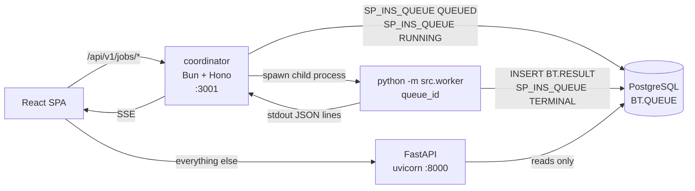

# Design: Queued Background Backtests

**Status:** v5 — TypeScript coordinator + Python worker. Slice A–B complete (DB + coordinator skeleton in Compose); further coordinator/worker slices pending.
**Date:** 2026-05-03
**Scope:** `coordinator/` (new TS service), `src/jobs.py`, `src/worker.py` (new), `frontend/`, `db/liquidbase/bt/`

---

## 1. Problem

Large backtests and parameter optimizations are CPU-heavy. A run with 20,000 iterations can take long enough that the current single-run UI becomes limiting:

1. The user can only focus on one optimization at a time.
2. There is no persistent queue of pending jobs.
3. There is no backend-managed notion of `QUEUED`, `RUNNING`, `COMPLETED`, `FAILED`, or `CANCELLED`.
4. The UI cannot continue editing or queueing strategies while one run is in progress.

Implementation constraints:

1. Python threads do not give CPU parallelism for pandas/numpy workloads (GIL).
2. CPython processes have heavy cold-start; coordination work (event loops, SSE fan-out, LISTEN/NOTIFY consumption) is better served by a runtime built for it.
3. We want a polyglot boundary that lets us swap or add languages later without rewriting the queue contract.

---

## 2. Goals

### Functional

1. The backend accepts multiple backtest jobs and runs them one at a time in queue order.
2. The UI shows a queue panel with `QUEUED`, `RUNNING`, `COMPLETED`, `FAILED`, `CANCELLED` jobs.
3. The running job shows progress as iterations completed vs total.
4. The user can add more jobs while another job is running.
5. The user can cancel any job (queued **or** running) from the UI.
6. The running job automatically advances to the next queued job when complete.
7. Completed jobs retain summary and result references.

### UX

1. Editing the current strategy config never mutates submitted jobs.
2. The queue updates live without manual refresh.
3. The user can inspect any job (running or historical) separately from the editable draft form.

### Technical

1. CPU-bound work runs in a separate Python process per job (no GIL contention with the coordinator).
2. Queue state persists in PostgreSQL — survives restarts of any process.
3. Coordinator process owns: HTTP for `/jobs/*`, SSE fan-out, child-process supervision, `LISTEN/NOTIFY` consumption.
4. Worker process owns: DB read of strategy config, optimization compute, `INSERT INTO BT.RESULT`, queue terminal transition via `BT.SP_INS_QUEUE`.
5. Coordinator and worker communicate **only** through PostgreSQL + process spawn + stdout JSON lines + exit code. Neither imports the other.
6. FastAPI is untouched in this slice — `/optimize`, `/refdata`, `/auth`, `/inst` all stay where they are. Only `/api/v1/jobs/*` is owned by the new coordinator.

---

## 3. Non-Goals

1. Multi-worker concurrency in v1 (design supports it; default slot count is 1).
2. Replacing FastAPI wholesale — that's a future phase, tracked separately.
3. Replacing the existing optimization pipeline.
4. Introducing Celery, Redis, or Kafka.
5. Auto-retry of failed jobs (manual retry only).
6. Rewriting any pandas/numpy code in TypeScript.

---

## 4. Module Placement

| Component | Location | Runtime | Notes |
|---|---|---|---|
| Coordinator entrypoint | `coordinator/src/index.ts` | Bun (or Node 22 LTS) | Boots HTTP server, manager, LISTEN consumer. |
| HTTP routes (`/api/v1/jobs/*`) | `coordinator/src/http/routes/` | Bun | Hono framework. |
| SSE fan-out | `coordinator/src/queue/sse.ts` | Bun | `Set<ReadableStreamDefaultController>`. |
| Job manager (event loop, watchdog, claim) | `coordinator/src/queue/manager.ts` | Bun | Owns the wakeup loop. |
| Process supervisor (spawn, parse stdout, signal) | `coordinator/src/queue/supervisor.ts` | Bun | `child_process.spawn`. |
| DB repo (typed SQL) | `coordinator/src/queue/repo.ts` | Bun | Uses `postgres` (porsager). |
| LISTEN consumer (autocommit conn) | `coordinator/src/queue/notify.ts` | Bun | Future: when `pg_notify` is added to `SP_INS_QUEUE`. |
| Shared zod schemas | `coordinator/src/types/queue.ts` | Bun + frontend | Re-exported by frontend for type-safe fetch. |
| Python worker entrypoint | `src/worker.py` | CPython | `python -m src.worker <queue_id>`. |
| Python DB repo (used by worker self-writes) | `src/jobs.py` | CPython | Existing `BacktestJobRepo`. |
| Frontend queue panel | `frontend/src/features/queue/` | Browser | TanStack Query + EventSource. |
| FastAPI `/optimize`, `/refdata`, `/auth`, `/inst` | `api/` | CPython | **Unchanged.** |

The CLI (`src/main.py`) is **not** modified — it runs synchronously with no use for the queue.

`api/queue/` (the previous Python coordinator) is removed.

---

## 5. Architecture

### 5.1 Process topology


```mermaid
flowchart LR
    UI[React SPA] -->|/api/v1/jobs/*| Coord[coordinator<br/>Bun + Hono<br/>:3001]
    UI -->|everything else| FA[FastAPI<br/>uvicorn :8000]
    Coord -->|SP_INS_QUEUE QUEUED<br/>SP_INS_QUEUE RUNNING| DB[(PostgreSQL<br/>BT.QUEUE)]
    Coord -->|spawn child process| Worker[python -m src.worker<br/>queue_id]
    Worker -->|stdout JSON lines| Coord
    Worker -->|INSERT BT.RESULT<br/>SP_INS_QUEUE TERMINAL| DB
    FA -->|reads only| DB
    Coord -->|SSE| UI
```

**Key invariants:**

1. Coordinator and FastAPI share **only** PostgreSQL. They never make HTTP calls to each other.
2. Coordinator and worker share **only** PostgreSQL + stdout pipe + exit code. Worker never imports coordinator code, coordinator never imports Python.
3. Worker is the only writer of its own COMPLETED/CANCELLED row. Coordinator writes FAILED only as recovery when the worker died without writing terminal state.

### 5.2 Why this split

| Concern | Owner | Reason |
|---|---|---|
| HTTP fan-out, SSE to many clients | Coordinator (TS) | Node/Bun event loop handles 10k+ idle SSE connections per process trivially. CPython + uvicorn fights the GIL the moment any sync code sneaks in. |
| Heavy compute (pandas/numpy/optimization) | Worker (Python) | Library ecosystem. Rewriting in TS would lose `Decimal`, NaN/NA semantics, timezone handling, and `pandas`/`numpy`/`scipy`. |
| Queue durability + ordering | PostgreSQL | Already operated. `SELECT ... FOR UPDATE SKIP LOCKED` + `LISTEN/NOTIFY` give us everything for free. |
| Type safety end-to-end | zod schemas in `coordinator/src/types/` shared with frontend | Eliminates API contract drift. |

### 5.3 Why process-per-job

1. Avoids GIL contention.
2. Clean failure boundary — a worker crash doesn't take down the coordinator.
3. Easy cancellation via `SIGTERM`.
4. Hard timeout enforcement via `SIGKILL` after grace period.
5. Trivial horizontal scale later: coordinator with `MAX_WORKERS=N` spawns up to N children.

### 5.4 Why TypeScript for the coordinator (not Python)

Documented in §19. Short version: the coordinator is 100% I/O — HTTP, SSE, child-process supervision, LISTEN/NOTIFY. That's the workload Node/Bun is built for. CPython is wrong-tool for this slice.

### 5.5 Submit flow (separation of concerns)

| Step | Location | Responsibility |
|---|---|---|
| 1 | `coordinator/src/http/routes/jobs.ts` | HTTP boundary: parse + zod-validate, auth check, call `repo.submit()`, notify manager, return 202. |
| 2 | `coordinator/src/db/repo.ts — submit()` | Generate `queue_id`, resolve `QUEUED` status ID from REFDATA cache, `CALL BT.SP_INS_QUEUE(...)`. |
| 3 | `coordinator/src/manager/manager.ts` | Wakeup → claim loop: `SELECT` next QUEUED row + `SP_INS_QUEUE RUNNING` + `supervisor.spawn(queue_id)`. |
| 4 | `coordinator/src/manager/supervisor.ts` | `child_process.spawn('python', ['-m', 'src.worker', queue_id], {env: {DB_URL: ...}})`. |

---

## 6. Data Model

### 6.1 `BT.QUEUE` (implemented — v4b)

Soft-versioned queue table. **One row per state transition** — old rows are closed by setting `TRANSACT_TO_TS = now()`; new rows are inserted with `TRANSACT_TO_TS = '9999-12-31'`. `QUEUE_ID` is stable across transitions; `QUEUE_VID` increments on each transition.

| Column | Type | Notes |
|---|---|---|
| `QUEUE_ID` | `UUID` | Stable job identity. Generated by the coordinator before enqueue. |
| `QUEUE_VID` | `INTEGER` | Increments on each state transition. `(QUEUE_ID, QUEUE_VID)` is PK. |
| `STRATEGY_ID` | `UUID` | FK → `BT.STRATEGY`. The exact version submitted — never updated mid-queue. |
| `STRATEGY_VID` | `INTEGER` | Exact strategy version submitted. Join on `(STRATEGY_ID, STRATEGY_VID)` — not `IS_CURRENT_IND`. |
| `TRANSACT_FROM_TS` | `TIMESTAMPTZ` | Row effective from. |
| `TRANSACT_TO_TS` | `TIMESTAMPTZ` | `'9999-12-31'` = active row. Set to `now()` on transition. |
| `QUEUE_STATUS_ID` | `INTEGER` | FK → `REFDATA.QUEUE_STATUS`. |
| `PRIORITY` | `INTEGER` | Default `100`. Lower = higher priority. `0` = "Run Now". Dequeue order: `(PRIORITY ASC, CREATED_AT ASC)`. |
| `ERROR_TEXT` | `TEXT` | Error message on FAILED / CANCELLED. |
| `USER_ID` | `TEXT` | Submitting user. |
| `CREATED_AT` | `TIMESTAMPTZ` | Row insert time. |

Active rows: `WHERE TRANSACT_TO_TS = TIMESTAMPTZ '9999-12-31'`.

### 6.2 `REFDATA.QUEUE_STATUS` (implemented)

| `QUEUE_STATUS_ID` | `NAME` | Notes |
|---|---|---|
| 1 | `QUEUED` | Waiting to be claimed |
| 2 | `RUNNING` | Claimed by coordinator, worker spawned |
| 3 | `CANCEL_REQUESTED` | User requested cancel; worker observes at next checkpoint |
| 4 | `COMPLETED` | Worker finished successfully |
| 5 | `FAILED` | Worker error or coordinator crash recovery |
| 6 | `CANCELLED` | Worker observed cancel request and exited cleanly |

IDs are assigned by `IDENTITY` at seed time. `FN_GET_QUEUE_FOR_TERMINAL` uses `QUEUE_STATUS_ID IN (1,2,3)` (active states) — hardcoded to match these seed values.

### 6.3 `BT.STRATEGY` (existing — unchanged)

Queue rows store `(STRATEGY_ID, STRATEGY_VID)` at submission time. The worker joins on this exact pair so queue rows remain valid even if the user updates the strategy mid-queue. `IS_CURRENT_IND` is exposed as `STRAT_CURRENT_IND` in `FN_GET_QUEUE_FOR_TERMINAL` for UI display only.

### 6.4 `BT.RESULT` (existing — unchanged)

Worker `INSERT`s directly with `QUEUE_ID` + `PAYLOAD_JSON`. No `SP_INS_RESULT` procedure — this is the one table exempt from the "no direct DML" rule per `AGENTS.md`.

### 6.5 State transitions

```
              ┌──────────┐
              │  QUEUED  │
              └────┬─────┘
       ┌───────────┴─────────────┐
       ▼                         ▼
┌───────────┐            ┌─────────────────┐
│  RUNNING  │            │   FAILED (*)    │
└─────┬─────┘            └─────────────────┘
      │
      ├── coordinator marks FAILED on worker crash
      │
      ├──→ CANCEL_REQUESTED ──→ CANCELLED
      │
      ├──→ COMPLETED
      │
      └──→ FAILED
```

`(*)` Coordinator also transitions QUEUED→FAILED on stale-job recovery (coordinator restart with orphaned RUNNING rows). Terminal states are immutable — every change is a new row with closed `TRANSACT_TO_TS`.

---

## 7. Stored Procedures

All queue writes go through `BT.SP_INS_QUEUE`. Reads use the two GET procedures or plain `SELECT`. `BT.RESULT` rows are `INSERT`ed directly by the worker (no procedure).

### 7.1 `BT.SP_INS_QUEUE` (see `bt-002-procedures` in `db/liquidbase/bt/bt-changelog.xml`)

Signature: `IN_QUEUE_ID UUID, IN_STRATEGY_ID UUID, IN_STRATEGY_VID INTEGER, IN_QUEUE_STATUS_ID INTEGER, IN_PRIORITY INTEGER, IN_ERROR_TEXT TEXT, IN_USER_ID TEXT` + 3 OUT params (`OUT_SQLSTATE`, `OUT_SQLMSG`, `OUT_SQLERRMC`).

Temporal versioning steps:
1. `MAX(QUEUE_VID) + 1` for the new VID.
2. Close current row: `UPDATE SET TRANSACT_TO_TS = now() WHERE TRANSACT_TO_TS = '9999-12-31'`.
3. Insert new row with `TRANSACT_TO_TS = '9999-12-31'`.

Called for every state transition: QUEUED → RUNNING → COMPLETED/FAILED/CANCELLED. Callable from both TypeScript (`postgres` driver) and Python (`psycopg`) — pure SQL.

!!! note "SP_CLAIM_NEXT — future"
    An atomic `SP_CLAIM_NEXT` (`SELECT ... FOR UPDATE SKIP LOCKED` + `SP_INS_QUEUE RUNNING` in one transaction) will replace the current two-statement SELECT + call pattern. Required before multi-coordinator deployment.

!!! note "pg_notify — future"
    `SP_INS_QUEUE` will emit `pg_notify('job_enqueued', queue_id::text)` on QUEUED inserts and `pg_notify('job_cancel_requested', queue_id::text)` on CANCEL_REQUESTED inserts. The coordinator's `db/notify.ts` consumes these. Until that's added, the HTTP route calls `manager.notifyEnqueued()` directly in-process.

### 7.2 `BT.SP_GET_QUEUE` (REFCURSOR — `bt-002-procedures`)

Coordinator `queryQueue()` uses `CALL bt.sp_get_queue(...)` + `FETCH` on the OUT refcursor (not a table function).

- If `IN_QUEUE_ID` provided → returns all VIDs for that job (full history).
- Otherwise → active rows only (`TRANSACT_TO_TS` sentinel); other params are optional filters.

`BT.FN_GET_QUEUE` is not deployed; any prior function with that name is dropped by `bt-000-precleanup`.

### 7.3 `BT.FN_GET_QUEUE_FOR_TERMINAL` (see `bt-003-fn-terminal`)

`FUNCTION RETURNS TABLE` — `SELECT * FROM bt.fn_get_queue_for_terminal(IN_USER_ID, IN_QUEUE_STATUS_ID)` (both nullable).

Active rows with `QUEUE_STATUS_ID IN (1,2,3)`, joined to `BT.STRATEGY` on exact `(STRATEGY_ID, STRATEGY_VID)`.

Returns: `QUEUE_ID, STRATEGY_ID, STRATEGY_VID, STRATEGY_NM, STRAT_CURRENT_IND, TRANSACT_FROM_TS, QUEUE_STATUS, PRIORITY, USER_ID, CONFIG_JSON, ERROR_TEXT`.

Used by `coordinator/src/queue/repo.ts — queryTerminal()` / `claimNext()` and (if present) `BacktestJobRepo.query_queue_for_terminal()` in `src/jobs.py`.

`SP_GET_QUEUE_FOR_TERMINAL` (REFCURSOR) is also deployed for clients that use the stored-procedure + cursor pattern.

### 7.4 State transition reference

| Caller | Action | `IN_QUEUE_STATUS_ID` |
|---|---|---|
| Coordinator HTTP route `POST /jobs` | Enqueue | `QUEUED` (1) |
| Coordinator manager `_claimNext()` | Claim | `RUNNING` (2) |
| Coordinator HTTP route `POST /jobs/:id/cancel` (running) | Request cancel | `CANCEL_REQUESTED` (3) |
| Coordinator HTTP route `POST /jobs/:id/cancel` (queued) | Cancel directly | `CANCELLED` (6) |
| Worker — success | Terminal | `COMPLETED` (4) |
| Worker — exception | Terminal | `FAILED` (5) |
| Worker — observed cancel | Terminal | `CANCELLED` (6) |
| Coordinator — crash recovery | Terminal | `FAILED` (5) |

---

## 8. Coordinator HTTP API

All endpoints under `/api/v1/jobs/*` are served by the coordinator. Auth: validates the existing `qs_token` JWT cookie (HS256, secret from `JWT_SECRET` env shared with FastAPI) — no separate session table read needed.

### 8.1 Endpoints

| Method | Path | Purpose |
|---|---|---|
| `POST` | `/api/v1/jobs` | Enqueue. Returns `{ queue_id, queue_pos }`. **Rate limit:** caller may have at most 20 `QUEUED` jobs → `429`. |
| `GET` | `/api/v1/jobs` | Active queue + recent history (last 50 terminal). `?status=RUNNING` etc. filter. |
| `GET` | `/api/v1/jobs/:id` | Full history (all VIDs) of one job. |
| `GET` | `/api/v1/jobs/:id/result` | Resolves `STRATEGY_VID` + `RESULT_ID` → returns same payload shape as today's FastAPI `POST /backtest/optimize` response. Existing analysis components reuse unchanged. |
| `POST` | `/api/v1/jobs/:id/cancel` | Cancels QUEUED or RUNNING job. Idempotent. |
| `DELETE` | `/api/v1/jobs/:id` | Hard delete a terminal job from history. `409` if not terminal. |
| `GET` | `/api/v1/jobs/stream` | SSE stream of queue events. |
| `GET` | `/health` | Coordinator liveness — returns 200 if process up + DB reachable. |

### 8.2 Enqueue request (zod schema in `coordinator/src/types/queue.ts`)

```ts
z.object({
  strategy_id: z.string().uuid(),
  strategy_vid: z.number().int().positive(),
  priority: z.enum(['normal', 'high']).default('normal'),
})
```

The strategy and its `CONFIG_JSON` are persisted by the existing FastAPI `POST /backtest/optimize` flow (which writes `BT.STRATEGY`). The job submit endpoint only references that strategy by `(STRATEGY_ID, STRATEGY_VID)`. **The optimization request payload is no longer duplicated into the queue table.**

`priority` is `"normal"` (→ DB priority `100`) or `"high"` (→ DB priority `0`, jumps the queue). The frontend's "Add to Queue" sends `normal`; "Run Now" sends `high`.

### 8.3 Queue row response

```json
{
  "queue_id": "uuid",
  "queue_vid": 2,
  "strategy_id": "uuid",
  "strategy_vid": 5,
  "strategy_nm": "BTC Bollinger 2016-now",
  "status": "RUNNING",
  "priority": 100,
  "transact_from_ts": "2026-04-25T12:00:03Z",
  "user_id": "alfred",
  "progress": {
    "trial": 734,
    "total": 20000,
    "best_sharpe": 1.4321
  }
}
```

`progress` is in-memory in the coordinator (last value forwarded from the worker's stdout JSON line). It is **not** persisted to the DB.

### 8.4 SSE event types

| Event | When | Payload |
|---|---|---|
| `snapshot` | On connect | `{ active: QueueRow[], recent: QueueRow[] }` |
| `enqueued` | After `SP_INS_QUEUE QUEUED` | Full row |
| `claimed` | After `SP_INS_QUEUE RUNNING` | Full row |
| `progress` | Throttled by worker (≤ 1 Hz) | `{ queue_id, trial, total, best_sharpe }` |
| `terminal` | COMPLETED / FAILED / CANCELLED | Full row + `status` |
| `cancel_requested` | After `SP_INS_QUEUE CANCEL_REQUESTED` | `{ queue_id }` |

SSE event IDs use `(queue_id, queue_vid)` so reconnects can detect missed transitions and refetch.

---

## 9. Coordinator (TypeScript)

`coordinator/` is a Bun project. Hono for HTTP, `postgres` (porsager) for DB.

### 9.1 File layout

```
coordinator/
├── package.json
├── tsconfig.json
├── Dockerfile
├── src/
│   ├── index.ts                  # boot: load REFDATA cache, start queue, start HTTP
│   ├── config.ts                 # env: DB_URL, MAX_WORKERS=1, PYTHON_BIN, JWT_SECRET, LOG_LEVEL
│   ├── db/
│   │   └── client.ts             # postgres.js singleton (shared connection pool only)
│   ├── queue/                    # all job-queue logic — the coordinator's core domain
│   │   ├── repo.ts               # submit, claimNext, markTerminal, queryQueue, queryTerminal
│   │   ├── manager.ts            # wakeup queue, event loop, watchdog, stale recovery
│   │   ├── supervisor.ts         # spawn child process, parse stdout, signal on cancel
│   │   ├── sse.ts                # subscriber set + broadcast
│   │   └── notify.ts             # LISTEN job_enqueued / job_cancel_requested
│   ├── http/
│   │   ├── server.ts             # Hono app + auth middleware (verify qs_token JWT)
│   │   └── routes/
│   │       ├── jobs.ts
│   │       └── stream.ts
│   ├── refdata/
│   │   ├── repo.ts               # raw SQL for REFDATA tables
│   │   └── cache.ts              # in-process REFDATA dict (loaded at startup, refresh endpoint)
│   └── types/
│       └── queue.ts              # zod schemas — exported for frontend consumption
└── tests/
    └── queue.test.ts             # bun:test
```

> **Layout rationale:** `src/db/` holds only the shared connection pool — infrastructure with no domain knowledge. All queue-specific logic (SQL, event loop, process supervision, SSE, LISTEN) lives under `src/queue/` — the coordinator's core domain. Future domains (`src/refdata/`, `src/inst/`) follow the same pattern: each owns its own repo + cache alongside its domain logic.

### 9.2 Startup sequence (`index.ts`)

1. Load env (`config.ts`). Fail fast if `DB_URL` or `JWT_SECRET` missing.
2. Open Postgres pool. Ping. Fail fast on error.
3. Load REFDATA cache (`QUEUE_STATUS`, etc.) — coordinator needs `QUEUED` / `RUNNING` IDs.
4. **Stale-job recovery**: any active row with `QUEUE_STATUS_ID = 2 (RUNNING)` and no live child process → call `SP_INS_QUEUE FAILED` with `error_text = "coordinator restarted while job was running"`. Never auto-requeue.
5. Start `manager` (event loop + 30 s watchdog).
6. (Future) Start `notify` consumer with autocommit conn + `LISTEN job_enqueued`.
7. Try one initial claim (in case work queued while coordinator was down).
8. Start Hono HTTP server on port 3001.
9. Install SIGTERM handler: stop accepting new HTTP, drain in-flight, send SIGTERM to active worker, wait `SHUTDOWN_GRACE_SECONDS` then exit.

### 9.3 Manager — wakeup queue

A single in-process channel: `private wakeup = new Set<string>()` plus a resolved `Promise` chain. Wakeup sources:

- HTTP `POST /jobs` → `manager.notifyEnqueued()`
- `notify.ts` (future) → `manager.notifyEnqueued()` from LISTEN payload
- `supervisor` → `manager.notifyWorkerExit()` when child exits
- `watchdog` → every 30 s

On every wakeup the loop runs:

```ts
async function tick() {
  await supervisor.reapDead();          // mark FAILED if worker exited without terminal write
  await manager.recoverStale();         // optional, only inside watchdog ticks
  await manager.maybeClaimAndSpawn();   // claim next QUEUED if a slot is free
}
```

### 9.4 Claim (`_claimNext`)

```sql
-- Phase 1: two-statement, single coordinator (safe)
SELECT q.queue_id, q.strategy_id, q.strategy_vid, q.priority, q.user_id
  FROM bt.queue q
  JOIN refdata.queue_status rs ON q.queue_status_id = rs.queue_status_id
 WHERE rs.name = 'QUEUED'
   AND q.transact_to_ts = TIMESTAMPTZ '9999-12-31'
 ORDER BY q.priority ASC, q.created_at ASC
 LIMIT 1;

CALL bt.sp_ins_queue(:queue_id, :strategy_id, :strategy_vid, 2 /* RUNNING */,
                     :priority, NULL, :user_id, ...);
```

When `SP_CLAIM_NEXT` is added (Phase 2) this collapses to one atomic call.

### 9.5 Supervisor

```ts
const child = spawn(PYTHON_BIN, ['-m', 'src.worker', queueId], {
  env: { ...process.env, DB_URL, WORKER_PROGRESS_EVERY_N: '25', WORKER_PROGRESS_EVERY_T: '1.0' },
  stdio: ['ignore', 'pipe', 'pipe'],
});
```

- `stdout` is line-buffered → JSON-parsed → `manager.handleWorkerEvent(queueId, event)`.
- `stderr` is forwarded to the coordinator log.
- On `child.on('exit', code)` → `manager.notifyWorkerExit(queueId, code)`. If exit code ≠ 0 and no terminal row exists in DB → coordinator writes FAILED.
- On `POST /jobs/:id/cancel` for the currently running job: write `CANCEL_REQUESTED` row, then `child.kill('SIGTERM')`. Worker observes either via signal handler or via the next DB checkpoint poll.
- Hard kill: if SIGTERM doesn't take effect within 60 s, send `SIGKILL`.

### 9.6 SSE fanout

`Set<{ controller, lastEventId }>`. `subscribe()` adds; the route's `try/finally` removes on disconnect. `broadcast(event)` writes `id: <queue_id>:<queue_vid>\nevent: <type>\ndata: <json>\n\n` to every controller. Bun's stream backpressure is honoured via `await controller.write()`.

---

## 10. Worker process — `src/worker.py`

The worker is a normal Python module invoked as `python -m src.worker <queue_id>`. It is the **entire** Python contract the coordinator depends on.

### 10.1 Invocation contract

```bash
python -m src.worker <queue_id>
```

| Channel | Use |
|---|---|
| `argv[1]` | Queue ID (UUID string) |
| `stdin` | Unused |
| `stdout` | Newline-delimited JSON events (see §10.3). One object per line, terminated by `\n`. |
| `stderr` | Human logs (forwarded to coordinator log) |
| Exit code | `0` = terminal state written to DB. `1` = uncaught crash. `2` = config error. `137`/`143` = SIGKILL/SIGTERM. |

### 10.2 Environment (passed by coordinator)

| Var | Purpose |
|---|---|
| `DB_URL` | psycopg conninfo |
| `WORKER_PROGRESS_EVERY_N` | Default `25`. Emit progress every N trials. |
| `WORKER_PROGRESS_EVERY_T` | Default `1.0` (seconds). Emit progress at most once per T regardless of N. |
| `WORKER_TIMEOUT_SECONDS` | Optional hard deadline. Worker self-terminates on exceed. |

### 10.3 stdout JSON protocol

```json
{"type":"started","queue_id":"...","ts":"2026-05-03T12:00:00Z"}
{"type":"progress","queue_id":"...","trial":250,"total":20000,"best_sharpe":1.12,"ts":"..."}
{"type":"terminal","queue_id":"...","status":"COMPLETED","result_id":"...","ts":"..."}
```

`progress` is forwarded to SSE subscribers as-is. `terminal` is a fast-path notification — the DB is still the source of truth, but emitting it on stdout lets SSE update before the coordinator polls.

Malformed lines are logged but do not kill the worker.

### 10.4 Flow

1. Parse `queue_id` from `sys.argv[1]`. Exit 2 if invalid UUID.
2. Open psycopg connection from `DB_URL` (no pool).
3. `CALL BT.SP_GET_QUEUE_LATEST(queue_id)` → active `BT.QUEUE` row joined to frozen `CONFIG_JSON` (`BT.STRATEGY` on `STRATEGY_VID`). Exit 2 if no row.
4. Reconstruct `OptimizeRequest` from `CONFIG_JSON`.
5. Install `SIGTERM` handler: set `cancel_flag = True` → next callback raises `JobCancelled`.
6. Set `deadline = now + WORKER_TIMEOUT_SECONDS` (if set).
7. Emit `started` JSON.
8. Run `param_opt` with the per-trial callback (§10.5).
9. On normal completion: generate `RESULT_ID` (UUID), `CALL BT.SP_INS_RESULT(...)`, then `CALL BT.SP_INS_QUEUE(..., COMPLETED, ...)`.
10. On `JobCancelled`: `CALL BT.SP_INS_QUEUE(..., CANCELLED, ...)`.
11. On any other exception: `CALL BT.SP_INS_QUEUE(..., FAILED, error_text=traceback)`.
12. Emit `terminal` JSON. Exit 0.

### 10.5 Per-trial callback (throttled)

Body runs only when `trial % N == 0` **or** `time.monotonic() - last >= T`.

```python
def callback(trial: int, total: int, best: float):
    if not _should_emit(trial):
        return
    if cancel_flag or _cancel_requested_in_db():
        raise JobCancelled
    if deadline and time.time() > deadline:
        raise JobTimeout
    print(json.dumps({
        "type": "progress", "queue_id": qid, "trial": trial,
        "total": total, "best_sharpe": best, "ts": _iso_now(),
    }), flush=True)
```

`_cancel_requested_in_db()` issues a single-row read on `BT.QUEUE` for the active row's `QUEUE_STATUS_ID`. Cheap (~1 ms) at the throttled cadence.

### 10.6 Signal handling

- `SIGTERM` → set `cancel_flag = True`. Callback raises `JobCancelled` on next checkpoint. Worker exits 0 after writing CANCELLED.
- `SIGKILL` → process dies immediately. Coordinator's `child.on('exit')` sees code `137` and writes FAILED with `error_text = "killed by SIGKILL"`.

### 10.7 Why the worker is the only writer of its own success

The DB row is the single source of truth. If the coordinator wrote COMPLETED based on a stdout `terminal` event, a stdout flush race could mark a job COMPLETED that actually crashed mid-write. Letting the worker write its own success keeps the invariant: **coordinator only writes FAILED, and only when the worker is provably dead with no terminal row.**

---

## 11. Frontend

### 11.1 State split

| State | Owner | Source |
|---|---|---|
| `draftConfig` | `BacktestPage` | `useState` |
| `queue` | `useJobsStream()` | TanStack Query + EventSource |
| `selectedJobId` | `BacktestPage` | URL param `?job=<uuid>` |

URL-driven `selectedJobId` makes job views shareable and survives refresh.

### 11.2 Type sharing with coordinator

`coordinator/src/types/queue.ts` exports zod schemas + inferred TS types. Frontend imports them via a workspace package or relative path (depending on monorepo setup) so request/response types are guaranteed to match.

### 11.3 Layout

| Region | Width | Content |
|---|---|---|
| Left main column | ~70% desktop | Draft config drawer trigger + selected job's results (charts, metrics, top-10) |
| Right side panel | ~30% desktop | Queue table (running, queued, recent terminal) |

Mobile: queue collapses into a bottom sheet or a tab.

### 11.4 Queue table columns

| Column | Notes |
|---|---|
| State | Coloured chip |
| Position | Empty for non-queued |
| Strategy name | Click → loads result into main panel |
| Submitted | Relative time |
| Progress | Bar + `734 / 20000` for running |
| Best Sharpe | Live for running, final for completed |
| Actions | Cancel · Delete (terminal only) |

### 11.5 Editable UI while jobs run

- Editing the draft form never mutates submitted jobs.
- "Add to Queue" calls `POST /api/v1/jobs` with priority `normal`.
- "Run Now" calls `POST /api/v1/jobs` with priority `high` (jumps queue, does **not** preempt running job).
- Clicking a queue row sets `selectedJobId`; main panel shows that job's result.

### 11.6 SSE reconnection

`useJobsStream()` uses native `EventSource`. On disconnect, browser auto-reconnects with `Last-Event-ID` header. Coordinator parses `(queue_id, queue_vid)` and replays any newer events from the DB before resuming live broadcast.

### 11.7 Vite dev proxy

```ts
// frontend/vite.config.ts
proxy: {
  '/api/v1/jobs': 'http://localhost:3001',     // coordinator
  '/api':         'http://localhost:8000',     // FastAPI (everything else)
}
```

In production the same routing happens at nginx.

---

## 12. Failure handling

| Scenario | Behaviour |
|---|---|
| Worker raises | Worker writes FAILED via `SP_INS_QUEUE` itself → emits `terminal` JSON → coordinator broadcasts SSE → claims next. |
| Worker crashes (exit ≠ 0, no terminal row) | Coordinator writes FAILED with `error_text = "worker crashed exit=N"`. |
| Worker exceeds `WORKER_TIMEOUT_SECONDS` | Worker self-terminates with FAILED + `error_text = "timeout after N seconds"`. If unresponsive, coordinator SIGKILLs after grace and writes FAILED. |
| Coordinator restart during RUNNING | Stale recovery on startup marks orphaned RUNNING jobs FAILED. **Never auto-requeue** — partial `BT.RESULT` writes may already exist. |
| Coordinator can't reach DB at startup | Fail fast (process exits ≠ 0). Container restarts. |
| Worker can't reach DB | Worker exits 1. Coordinator handles as crash. |
| > 20 QUEUED per user | `429`. |

---

## 13. Test strategy

| Layer | Tests |
|---|---|
| DB (`tests/integration/test_jobs_db.py`) | Each procedure/function round-trip from psycopg. State transition correctness. `FN_GET_QUEUE_FOR_TERMINAL` filtering. |
| Worker (`tests/unit/test_worker.py`) | Stub the optimization pipeline. Test progress throttling, cancellation observation, timeout enforcement, terminal state writes for each exit path. Verify exit codes. |
| Coordinator manager (`coordinator/tests/manager.test.ts`) | Mock `repo` + `supervisor`. Test event loop, watchdog, stale recovery on startup, SSE fanout, idempotent cancel. |
| Coordinator HTTP (`coordinator/tests/http.test.ts`) | Auth, rate limiting (20-queued cap), enqueue → list → cancel → delete flow, SSE reconnect with `Last-Event-ID`. |
| Frontend (`useJobsStream.test.tsx`) | Apply each event type to local state. Reconnect uses native EventSource. Cancel button calls API. |
| End-to-end (`tests/e2e/test_queue_loop.py`) | Spawn coordinator + Python worker against live DB. Submit → claim → complete. Submit + cancel mid-run. Coordinator restart with orphaned RUNNING. |

---

## 14. Performance considerations

1. Single worker (default) prevents CPU oversubscription. Set `MAX_WORKERS=N` later.
2. Worker progress polls DB at most every `WORKER_PROGRESS_EVERY_T` seconds.
3. SSE payloads ~500 B. No chart data on the stream.
4. `GET /api/v1/jobs` returns active queue + 50 most-recent terminal jobs. Older history loaded on demand.
5. Coordinator process is ~30 MB resident (Bun) vs ~150 MB for the FastAPI process — easier to autoscale.
6. `LISTEN/NOTIFY` (when added) is in-process to PostgreSQL — no extra hop.

---

## 15. Security

1. All `/api/v1/jobs/*` endpoints validate the `qs_token` JWT cookie. Same secret as FastAPI (`JWT_SECRET` env).
2. `USER_ID` stamped on every queue row. Read endpoints filter by user (admins later).
3. `CONFIG_JSON` is data — never `eval`'d. Worker reconstructs Pydantic model with strict validation.
4. Rate limit: max 20 QUEUED per user.
5. Cancel/delete authorized only for the owning user.
6. Worker child process inherits only `DB_URL` + worker tunables — no `JWT_SECRET`, no API keys it doesn't need.

---

## 16. Phased implementation plan

Each slice is independently shippable.

### Slice A — Schema + procedures ✅ Done

1. ~~Liquibase: squashed `db/liquidbase/bt/bt-changelog.xml` (`bt-000` … `bt-003`) — tables, procedures, `FN_GET_QUEUE_FOR_TERMINAL`, legacy drops.~~
2. ~~`SP_INS_QUEUE`, `SP_INS_RESULT`, `SP_GET_QUEUE`, `SP_GET_QUEUE_FOR_TERMINAL`, `FN_GET_QUEUE_FOR_TERMINAL`, …~~
3. ~~`src/jobs.py` — `BacktestJobRepo` (read methods used by worker; writes used for terminal transitions).~~

### Slice B — Coordinator skeleton ✅ Done

1. ~~`coordinator/` Bun project: `package.json`, `tsconfig.json`, `Dockerfile`, `bun:test` setup.~~
2. ~~`db/client.ts` + `queue/repo.ts` — `queryQueue()`; Hono `GET /api/v1/jobs` returns real DB rows (paths differ slightly from the original `db/repo.ts` sketch).~~
3. ~~`http/server.ts` — Hono app, `/health`, `/health/ready`.~~
4. ~~`docker-compose.yml` — `coordinator` service on port **3001** (`COORDINATOR_PORT` override supported).~~
5. ~~Smoke test: `curl` **examples** (after `docker compose up coordinator` or `bun run start` in `coordinator/` with env set):~~
   - `curl -sS "http://localhost:3001/health"`
   - `curl -sS "http://localhost:3001/api/v1/jobs"` — JSON with `rows` when DB is reachable and Liquibase BT objects exist.
   - **Compose note:** set **`QUANTDB_URL`** and **`JWT_SECRET`** in `.env` (see `.env.example`). For Postgres on the host (SSM tunnel), use something like `host.docker.internal` / the host IP in `QUANTDB_URL`.

### Slice C — Submit + claim + spawn

1. `repo.submit()` → `SP_INS_QUEUE QUEUED`. Returns `queue_id`.
2. `repo.claimNext()` → SELECT + `SP_INS_QUEUE RUNNING`.
3. `manager.ts` — wakeup queue, event loop.
4. `supervisor.ts` — `child_process.spawn`, exit detection.
5. `src/worker.py` — minimal version (no progress, no cancel): read config → run optimize → write RESULT → `SP_INS_QUEUE COMPLETED`.
6. **End-to-end milestone**: `POST /api/v1/jobs` → coordinator claims → spawns Python → DB shows COMPLETED. No frontend yet.

### Slice D — Worker progress + cancel + timeout

1. `src/worker.py` per-trial callback (throttled progress + cancel poll + deadline).
2. Stdout JSON protocol parsing in `supervisor.ts`.
3. `POST /jobs/:id/cancel` → `SP_INS_QUEUE CANCEL_REQUESTED` + `SIGTERM`.
4. SIGKILL after grace period.
5. Stale recovery on coordinator startup.
6. Unit + e2e tests.

### Slice E — SSE + frontend

1. `manager/sse.ts` + `http/routes/stream.ts`.
2. Frontend `coordinator/src/types/queue.ts` shared with `frontend/`.
3. `frontend/src/features/queue/` — `useJobsStream()`, queue panel, cancel button.
4. URL-driven `selectedJobId`.
5. Replace `Run Optimization` button with `Add to Queue` + `Run Now`.

### Slice F — Authentication

1. JWT verification middleware in `coordinator/src/http/server.ts` using `jose`.
2. Shared `JWT_SECRET` env between coordinator and FastAPI.
3. `USER_ID` propagation into `repo.submit()`.
4. Rate limiting (20 QUEUED per user).

### Phase 2 — Quality of life

1. `SP_CLAIM_NEXT` stored procedure for atomic claim.
2. `pg_notify` in `SP_INS_QUEUE` + `coordinator/src/db/notify.ts` LISTEN consumer.
3. Retry button (copies config into a new job).
4. Per-job event log viewer.

### Phase 3 — Scale-out (only if needed)

1. `MAX_WORKERS=N` configurable.
2. Multiple coordinator instances behind ALB (requires `SP_CLAIM_NEXT` from Phase 2).
3. Heartbeat-based stale detection finer than `WORKER_TIMEOUT_SECONDS`.
4. Optional partial-result persistence so a restart can resume mid-run.

---

## 17. Open questions

1. **Monorepo layout for type sharing.** Either (a) `coordinator/src/types/queue.ts` exported as a workspace package consumed by `frontend/`, or (b) symlink / build-time copy. Recommendation: workspace package once `frontend/` is moved into a top-level `pnpm`/`bun` workspace.
2. **Per-user queue or global queue?** Global queue, `USER_ID` stamped and surfaced. Single trader running multiple strategies is the v1 reality.
3. **Run Now jumping the queue — fair?** Yes for single-tenant. Revisit if multi-user.
4. **Should the SSE stream multiplex with the existing FastAPI optimize SSE?** No. Different lifetimes. Keep them on separate endpoints.
5. **Auth — share JWT secret or have coordinator query session table?** Phase 1: share `JWT_SECRET` env (verify-only, no signing). Phase 2: revisit if FastAPI moves to asymmetric keys.

---

## 18. Recommendation

Build slices A → F in order. Each is independently reviewable. FastAPI is untouched throughout — `/optimize` stays as the legacy single-shot path until the queue is fully wired through the frontend, then it can be retired (or kept as an admin-only path).

The TS-coordinator + Python-worker split is the long-term shape (see §19). Doing it now as a focused slice — replacing only the deleted `api/queue/` — proves the boundary at low risk before any further FastAPI ports are considered.

---

## 19. Why this architecture (TS coordinator + Python worker + Postgres)

This split is the standard polyglot pattern at small scale: a thin gateway in the runtime built for I/O, fanning out to compute services in the runtime built for the workload, with the database as the only shared contract.

### 19.1 What we actually need

| Need | Required today | Right runtime |
|---|---|---|
| Durable job state across restarts | Yes | PostgreSQL |
| FIFO with priority | Yes | PostgreSQL (`ORDER BY PRIORITY, CREATED_AT`) |
| At-most-one worker per slot | Yes (Phase 1) | `SELECT FOR UPDATE SKIP LOCKED` (future) |
| Push-based wakeup | Yes | `LISTEN/NOTIFY` (future) |
| SSE fan-out to many browser tabs | Yes | Node/Bun |
| Heavy pandas/numpy compute | Yes | CPython |
| Hard CPU isolation per job | Yes | OS process |
| Cross-language type contract | Yes | zod schemas (TS) ↔ Pydantic (Python) ↔ DB |

### 19.2 Why TypeScript for the coordinator

1. **I/O concurrency.** The coordinator is 100% I/O — HTTP, SSE, child-process pipes, LISTEN/NOTIFY. Node/Bun's event loop handles 10k+ idle SSE connections per process trivially. CPython + uvicorn struggles past a few hundred without careful tuning.
2. **Faster cold start.** ~50 ms (Bun) vs ~1–2 s (Python + FastAPI + pandas import). Matters for autoscaling, serverless, and CI.
3. **Type sharing with the React frontend.** `zod` schemas in the coordinator are imported by the frontend — eliminates an entire class of API contract drift.
4. **Edge deployability.** Hono runs unchanged on Cloudflare Workers / Deno Deploy / Vercel Edge. Python doesn't. Even if we never deploy to the edge, keeping the option open is cheap.
5. **Lower memory.** ~30 MB resident vs ~150 MB. Easier to run many coordinator replicas.

### 19.3 Why Python for the worker

1. **Library ecosystem.** `pandas`, `numpy`, `scipy`, `optuna`, the existing `param_opt` pipeline. Rewriting in TS would lose `Decimal`, `NaN` vs `NA` distinction, timezone handling, `DataFrame` ergonomics.
2. **Existing code.** The whole `src/` pipeline already exists and is tested. Worker is 200 lines of glue, not a rewrite.
3. **Process isolation = GIL irrelevant.** One worker = one process = no GIL contention with the coordinator.

### 19.4 Why Postgres as the only contract

1. **Single source of truth.** Coordinator and worker can't disagree about job state — there's only one place to read it from.
2. **Already operated.** Cluster, credentials, backups, Liquibase all in place.
3. **No new failure mode.** If Postgres is down, the system is already down.
4. **Clean migration path.** Worker could be rewritten in Rust tomorrow; coordinator could be rewritten in Go. As long as both speak `BT.SP_INS_QUEUE` + `INSERT INTO BT.RESULT`, they interoperate.

### 19.5 Why not pure Python (FastAPI + multiprocessing)

This was the v3/v4 design. Rejected for v5 because:

1. SSE fan-out under uvicorn doesn't scale past a few hundred concurrent subscribers without async-everything discipline that's easy to violate.
2. Coordinator and HTTP API contend for the same event loop. A slow REFDATA query stalls SSE delivery.
3. No type sharing with the frontend — every endpoint shape duplicated in Pydantic and TS.
4. Python's `multiprocessing.Process` semantics differ between Linux (fork) and macOS (spawn), making local dev painful.
5. Locks us into Python for any future service. A TS coordinator is a clean boundary that lets us add Go/Rust services later without changing the queue contract.

### 19.6 Why not Kafka or Redis

Unchanged from previous designs — both are real infrastructure adding ops weight without solving anything our scale needs. Postgres queues comfortably handle hundreds of jobs per second on a single Aurora instance, well beyond requirements. Re-evaluate Redis only if SSE fan-out exceeds ~5000 concurrent subscribers; re-evaluate Kafka only if we add live tick-data ingestion.

### 19.7 Decision

TypeScript coordinator (Bun + Hono) + Python worker (`src/worker.py`) + PostgreSQL queue. Coordinator owns HTTP for `/jobs/*`, SSE, supervision, LISTEN/NOTIFY. Worker owns one backtest run end to end. FastAPI keeps everything else until a separate decision retires it.

---

## 20. Future migration candidates (beyond the queue)

This slice introduces the coordinator and proves the polyglot boundary. Once it ships, the same pattern can absorb the rest of the FastAPI surface incrementally. Each row below is a **candidate**, not a commitment — order is risk-adjusted, easiest first.

### 20.1 FastAPI router-by-router assessment

| Router | Endpoints | Has numeric compute? | Recommended action | Priority |
|---|---|---|---|---|
| `api/routers/refdata.py` | `GET /refdata/{table}`, `POST /refdata/refresh` | No — pure SQL reads + in-process dict | **Port to coordinator.** REFDATA cache becomes the single source of truth in TS. FastAPI version deleted. | 1 (easiest) |
| `api/routers/inst.py` | `GET /inst/products`, `GET /inst/products/:id/xrefs`, `POST /inst/refresh` | No — pure SQL reads via `InstrumentCache` | **Port to coordinator.** Same shape as REFDATA. | 2 |
| `api/auth/router.py` | `POST /auth/login`, `POST /auth/logout`, `GET /auth/me` | No — bcrypt/argon2 verify + JWT sign | **Port to coordinator.** Use `argon2` (Node) and `jose` for JWT. Removes the need to share `JWT_SECRET` across runtimes. | 3 |
| `api/routers/backtest.py — /performance` | `POST /backtest/performance` | **Yes** — runs `perf.py` (single backtest, returns equity curve + metrics) | **Move to a dedicated Python service** invoked by the coordinator over HTTP, **or** queue it through the existing job system as a "single-trial" job. Recommendation: queue route — reuses the worker. | 4 |
| `api/routers/backtest.py — /walk-forward` | `POST /backtest/walk-forward` | **Yes** — runs `walk_forward.py` | Same as `/performance`: queue as a single-trial job. The frontend already accepts async job results. | 4 |
| `api/routers/backtest.py — /optimize` + `/optimize/stream` | Synchronous + SSE | **Yes** — runs `param_opt.py` | **Retire** once the queue is fully wired. Every optimization becomes a queued job. The legacy sync path can stay as an admin-only fallback. | 5 |
| `api/services/backtest.py` | Internal | **Yes** — orchestrates `data → strat → perf → param_opt` | **Stays in Python.** Becomes the worker entry point that `src/worker.py` calls into. Nothing to port. | n/a |
| `src/data.py`, `strat.py`, `perf.py`, `param_opt.py`, `walk_forward.py` | Library modules | **Yes** | **Stay in Python forever.** Library ecosystem reasons (§19.3). | n/a |

### 20.2 Migration order — strangler-fig pattern

Once the queue (Slices A–F) is stable:

1. **Refdata port** — coordinator reads `REFDATA.SP_GET_ENUM` and serves `/api/v1/refdata/*`. Frontend repointed via Vite proxy. Delete `api/routers/refdata.py` + `api/services/refdata_cache.py` *(if separate)*. Sanity check: TanStack Query cache invalidation still works.
2. **Inst port** — same pattern. Delete `api/routers/inst.py`.
3. **Auth port** — port `qs_token` issue/verify into TS. Frontend unaffected (still sets `HttpOnly` cookie). FastAPI loses its auth middleware. Coordinator becomes the only origin issuing the cookie.
4. **`/performance` and `/walk-forward` queueing** — extend `BT.QUEUE` with a `JOB_KIND` column (`'OPTIMIZE' | 'PERFORMANCE' | 'WALK_FORWARD'`). Worker dispatches on kind. Frontend submits these as ordinary queue jobs.
5. **Retire `/optimize` (sync) and `/optimize/stream`** — once all callers are queued. Phase out FastAPI.

After step 5, the FastAPI deployment unit can be removed entirely. The coordinator handles all HTTP. Python only ever runs as a child process under coordinator supervision.

### 20.3 Things that explicitly stay in Python

| Component | Why |
|---|---|
| `src/data.py` (data sources, `RefDataCache`, `BacktestCache`) | pandas/numpy DataFrames, vendor SDKs (`futu`, glassnode) are Python-only. |
| `src/strat.py`, `src/perf.py`, `src/param_opt.py`, `src/walk_forward.py` | Heavy numerics. |
| `src/db.py` (`DbGateway`) | Used by both worker and any debug CLI. |
| `src/main.py` (CLI backtest) | Synchronous local-dev tool. No queue benefit. |
| Liquibase migrations (`db/liquidbase/`) | Java-based, runtime-agnostic. |
| Any future ML / training scripts | Python ecosystem. |

### 20.4 Components beyond the API to consider

| Component | Current | Long-term option |
|---|---|---|
| **Frontend build** (`frontend/vite.config.ts`) | Vite + Vitest | Already TS — no change. Once coordinator exists, consider a top-level `bun`/`pnpm` workspace so `coordinator/` and `frontend/` share `types/`. |
| **Nginx routing** (`docker/nginx/nginx.conf`) | Routes `/api/*` → FastAPI | Add `location /api/v1/jobs/ { proxy_pass http://coordinator:3001; }` first. Expand as routers port. |
| **Docker Compose** (`docker-compose.yml`) | `api`, `frontend`, `nginx` | Add `coordinator` service. After full migration, remove `api`. |
| **CI / CD** (`.github/workflows/`) | Builds Python + frontend | Add coordinator build (Bun image) + tests (`bun test`). |
| **Observability** | Logging only | Add OpenTelemetry early — Python and TS both export to the same collector. Critical once requests hop runtimes. |
| **Trade execution** (`backup/deco/`, future `src/trade.py`) | Python (Futu, Bybit SDKs) | **Stays Python** — broker SDKs only ship Python/C++. Coordinator could expose `/api/v1/trade/*` HTTP and dispatch to a long-running Python trade process via the same DB-only contract used for workers. |
| **Live market data ingestion** (future) | Not built | If/when added, evaluate Go for the ingestion daemon (binary deployable, small footprint). Coordinator stays the HTTP boundary. |

### 20.5 What this enables long-term

- **Independent scaling** — coordinator (I/O) and workers (CPU) scale on different curves. Today's deployment can run 1 coordinator + 1 worker; tomorrow's can run 3 coordinators behind an ALB + 16 workers across hosts without changing application code.
- **Heterogeneous workers** — `python -m src.worker` today, `python -m src.worker_gpu` for GPU jobs, `cargo run --bin fast_worker` for Rust hot-paths. Same DB contract.
- **Edge-deployable read paths** — once `/refdata/*` and `/inst/*` are TS, they can be cached at Cloudflare/Vercel edge with no Python in the request path.
- **Cleaner blast radius** — a worker crash, a coordinator OOM, or a FastAPI bug each affect only their own process. Today everything shares one uvicorn worker.

### 20.6 Non-decision

This section is a **roadmap**, not a commitment. Each future port should be a separate decision with its own design note in `docs/design/`. The only thing this design *commits* to is the queue itself (§1–§19). Everything in §20 is here so the boundary established by the queue is understood as a deliberate stepping stone, not an accident.
