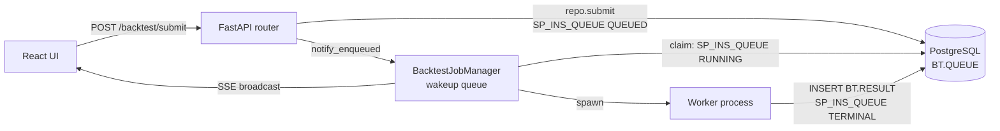

# Design: Queued Background Backtests

**Status:** Partially implemented — v4b (BT.QUEUE soft-versioning). Slice A complete; Slice B manager done, worker pending.
**Date:** 2026-05-03
**Scope:** `src/jobs.py`, `api/queue/`, `api/routers/backtest.py`, `frontend/`, `db/liquidbase/bt/`

---

## 1. Problem

Large backtests and parameter optimizations are CPU-heavy. A run with 20,000 iterations can take long enough that the current single-run UI becomes limiting:

1. The user can only focus on one optimization at a time.
2. There is no persistent queue of pending jobs.
3. There is no backend-managed notion of `QUEUED`, `RUNNING`, `COMPLETED`, `FAILED`, or `CANCELLED`.
4. The UI cannot continue editing or queueing strategies while one run is in progress.

There is also an implementation constraint:

1. Python threads do not provide useful CPU parallelism for heavy pure-Python or mixed pandas/numpy workloads (GIL).
2. A thread is still useful for request detachment or I/O orchestration, but not as the main scaling primitive for many large concurrent backtests.

---

## 2. Goals

### Functional

1. The backend accepts multiple backtest jobs and runs them one at a time in queue order.
2. The UI shows a queue panel with `QUEUED`, `RUNNING`, `COMPLETED`, `FAILED`, `CANCELLED` jobs.
3. The running job shows progress as iterations completed vs total.
4. The user can add more jobs while another job is running.
5. The user can cancel any job (queued **or** running) from the UI.
6. The running job automatically advances to the next queued job when complete.
7. Completed jobs retain summary and result references.

### UX

1. Editing the current strategy config never mutates submitted jobs.
2. The queue updates live without manual refresh.
3. The user can inspect any job (running or historical) separately from the editable draft form.

### Technical

1. Use process-based execution for CPU-bound optimization work.
2. Persist queue state in PostgreSQL so jobs survive API restarts.
3. Reuse existing backtest pipeline with `BT.SP_INS_STRATEGY`; persist completed payloads with **`INSERT INTO BT.RESULT`** and drive queue transitions only through **`CALL BT.SP_INS_QUEUE`** (**`AGENTS.md`**).
4. Drive live updates via PostgreSQL `LISTEN/NOTIFY`, not polling.

---

## 3. Non-Goals

1. Running many backtests concurrently in v1.
2. Distributed scheduling across multiple worker hosts.
3. Replacing the current optimization logic.
4. Introducing Celery, Redis, or external queue infrastructure.
5. Auto-retry of failed jobs (manual retry only).

---

## 4. Module Placement

The queue spans the DB layer, the FastAPI process, and the React frontend. Following the existing repo pattern (`BacktestCache` lives in `src/data.py` even though only the API uses it):

| Component | Location | Reason |
|---|---|---|
| `BacktestJobRepo` (`DbGateway` subclass — wraps SP calls and read queries) | `src/jobs.py` | Pure DB access. Reusable from tests, debug CLIs, and any future inspection tool. No FastAPI dependency. |
| `BacktestJobManager` (lifespan-owned coordinator, `LISTEN/NOTIFY` consumer, child-process supervisor) | `api/queue/manager.py` | Tightly coupled to FastAPI lifespan. No meaning outside the API process. |
| Worker entry point | `api/queue/worker.py` | Spawned as a child process. Imports the pipeline from `src/`. |
| HTTP endpoints | `api/routers/jobs.py` | Mirrors `routers/backtest.py`. |
| Pydantic request/response schemas | `api/schemas/jobs.py` | Mirrors `schemas/backtest.py`. |
| Frontend queue panel + state | `frontend/src/features/queue/` | New feature folder; unlocks the deferred "Backtest feature module" item from the [Frontend Audit](frontend-audit.md). |

The CLI (`src/main.py`) is **not** modified — it runs synchronously and has no use for queueing.

---

## 5. Architecture

### 5.1 High-level model

Three roles inside the same FastAPI deployment unit:

1. **API server** — accepts job submissions, queue mutations, queue queries, and SSE subscriptions.
2. **Job manager** — runs inside FastAPI lifespan. Reacts to wakeup signals from the router and a 30 s watchdog. Spawns and supervises one worker process at a time. Maintains in-memory SSE subscriber lists.
3. **Worker process** — executes exactly one backtest job in a separate Python process. Writes progress and terminal state directly to the DB via stored procedures.


```mermaid
flowchart LR
    UI[React UI] -->|POST /backtest/submit| API[FastAPI router]
    API -->|repo.submit<br/>SP_INS_QUEUE QUEUED| DB[(PostgreSQL<br/>BT.QUEUE)]
    API -->|notify_enqueued| Mgr[BacktestJobManager<br/>wakeup queue]
    Mgr -->|claim: SP_INS_QUEUE RUNNING| DB
    Mgr -->|spawn| Worker[Worker process]
    Worker -->|INSERT BT.RESULT<br/>SP_INS_QUEUE TERMINAL| DB
    Mgr -->|SSE broadcast| UI
```

!!! note "LISTEN/NOTIFY — deferred"
    The original design used PostgreSQL `LISTEN/NOTIFY` for push-based wakeups. This is **not yet implemented**: `SP_INS_QUEUE` does not call `pg_notify`. Instead the router calls `manager.notify_enqueued()` directly after a successful enqueue. A 30 s watchdog catches any missed wakeups. When `SP_CLAIM_NEXT` is added (multi-instance), switch to a dedicated autocommit psycopg connection with `LISTEN job_enqueued`.

**Submit flow (separation of concerns):**

| Step | Location | Responsibility |
|---|---|---|
| 1 | `api/routers/backtest.py` | HTTP boundary: parse + validate request, call `repo.submit()`, notify manager, return 202 |
| 2 | `src/jobs.py — BacktestJobRepo.submit()` | Business logic: generate `queue_id`, resolve `QUEUED` status ID, call `SP_INS_QUEUE` → `BT.QUEUE` |
| 3 | `api/queue/manager.py` | Claim loop: `SELECT` next QUEUED row + `SP_INS_QUEUE RUNNING` + spawn worker |

### 5.2 Why a single worker first

The requested behaviour is explicitly serial: one job runs, then the next queued job starts. A single worker matches this and avoids resource contention, duplicate data fetches, and CPU starvation. Multi-worker scaling is a future concern.

### 5.3 Why process-based execution

1. Avoids GIL contention for CPU-heavy backtest loops.
2. Prevents a long optimization from blocking the API event loop.
3. Provides a clean failure boundary — a worker crash doesn't take down the API.

Recommended primitive: `multiprocessing.Process` (not `ProcessPoolExecutor`). Explicit lifecycle control makes cancellation, timeout, and termination cleaner than a pooled future.

### 5.4 Why `LISTEN/NOTIFY` over polling

The original draft proposed a 1-second polling loop. With `NOTIFY` triggered on every state change we react in <10 ms with zero idle DB load. A slow watchdog poll (every 30 s) is kept only as a safety net for missed notifications (e.g. transient connection drop).

---

## 6. Data Model

### 6.1 `BT.QUEUE` (implemented — v4b)

Soft-versioned queue table. **One row per state transition** — old rows are closed by setting `TRANSACT_TO_TS = now()`; new rows are inserted with `TRANSACT_TO_TS = '9999-12-31'`. `QUEUE_ID` is stable across transitions; `QUEUE_VID` increments on each transition.

| Column | Type | Notes |
|---|---|---|
| `QUEUE_ID` | `UUID` | Stable job identity. Generated by the caller (router) before enqueue. |
| `QUEUE_VID` | `INTEGER` | Increments on each state transition. `(QUEUE_ID, QUEUE_VID)` is PK. |
| `STRATEGY_ID` | `UUID` | FK → `BT.STRATEGY`. The exact version submitted — never updated mid-queue. |
| `STRATEGY_VID` | `INTEGER` | Exact strategy version submitted. Join on `(STRATEGY_ID, STRATEGY_VID)` — not `IS_CURRENT_IND`. |
| `TRANSACT_FROM_TS` | `TIMESTAMPTZ` | Row effective from. |
| `TRANSACT_TO_TS` | `TIMESTAMPTZ` | `'9999-12-31'` = active row. Set to `now()` on transition. |
| `QUEUE_STATUS_ID` | `INTEGER` | FK → `REFDATA.QUEUE_STATUS`. |
| `PRIORITY` | `INTEGER` | Default `100`. Lower = higher priority. `0` = "Run Now". Dequeue order: `(PRIORITY ASC, CREATED_AT ASC)`. |
| `ERROR_TEXT` | `TEXT` | Error message on FAILED / CANCELLED. |
| `USER_ID` | `TEXT` | Submitting user. |
| `CREATED_AT` | `TIMESTAMPTZ` | Row insert time. |

Active rows: `WHERE TRANSACT_TO_TS = TIMESTAMPTZ '9999-12-31'`

### 6.2 `REFDATA.QUEUE_STATUS` (implemented)

| `QUEUE_STATUS_ID` | `NAME` | Notes |
|---|---|---|
| 1 | `QUEUED` | Waiting to be claimed |
| 2 | `RUNNING` | Claimed by manager, worker spawned |
| 3 | `CANCEL_REQUESTED` | User requested cancel; worker observes at next checkpoint |
| 4 | `COMPLETED` | Worker finished successfully |
| 5 | `FAILED` | Worker error or manager crash recovery |
| 6 | `CANCELLED` | Worker observed cancel request and exited cleanly |

IDs are assigned by `IDENTITY` at seed time. `SP_GET_QUEUE_FOR_TERMINAL` uses `QUEUE_STATUS_ID IN (1,2,3)` (active states) — hardcoded to match these seed values.

### 6.3 `BT.STRATEGY` (existing — unchanged)

Queue rows store `(STRATEGY_ID, STRATEGY_VID)` at submission time. The worker joins on this exact pair — not filtered by `IS_CURRENT_IND` — so queue rows remain valid even if the user updates the strategy mid-queue. `IS_CURRENT_IND` is exposed as `STRAT_CURRENT_IND` in `SP_GET_QUEUE_FOR_TERMINAL` for UI display only.

### 6.4 `BT.RESULT` (existing — unchanged)

Worker **`INSERT`s** directly with `QUEUE_ID` + `PAYLOAD_JSON`. No `SP_INS_RESULT` procedure — this is the one table exempt from the "no direct DML" rule per `AGENTS.md`.

### 6.5 State transitions (v4b)

```
              ┌──────────┐
              │  QUEUED  │
              └────┬─────┘
       ┌───────────┴─────────────┐
       ▼                         ▼
┌───────────┐            ┌─────────────────┐
│  RUNNING  │            │   FAILED (*)    │
└─────┬─────┘            └─────────────────┘
      │
      ├── manager marks FAILED on crash
      │
      ├──→ CANCEL_REQUESTED ──→ CANCELLED
      │
      ├──→ COMPLETED
      │
      └──→ FAILED
```

`(*)` Manager also transitions QUEUED→FAILED on stale-job recovery (API restart).
Terminal states (`COMPLETED`, `FAILED`, `CANCELLED`) are immutable — new row with closed `TRANSACT_TO_TS` only.

!!! note "v2 draft tables superseded"
    The earlier draft described `BT.BACKTEST_JOB` and `BT.BACKTEST_JOB_EVENT`. These were **never implemented**. The canonical implementation uses `BT.QUEUE` + `REFDATA.QUEUE_STATUS` as described above.

---

## 7. Stored Procedures

All queue writes go through `BT.SP_INS_QUEUE`. Reads use plain `SELECT` or the two GET procedures. `BT.RESULT` rows are **`INSERT`**ed directly by the worker (no procedure).

### 7.1 `BT.SP_INS_QUEUE` (implemented — changeset 250)

Signature: `IN_QUEUE_ID UUID, IN_STRATEGY_ID UUID, IN_STRATEGY_VID INTEGER, IN_QUEUE_STATUS_ID INTEGER, IN_PRIORITY INTEGER, IN_ERROR_TEXT TEXT, IN_USER_ID TEXT` + 3 OUT params (`OUT_SQLSTATE`, `OUT_SQLMSG`, `OUT_SQLERRMC`).

Temporal versioning steps:
1. `MAX(QUEUE_VID) + 1` for the new VID.
2. Close current row: `UPDATE SET TRANSACT_TO_TS = now() WHERE TRANSACT_TO_TS = '9999-12-31'`.
3. Insert new row with `TRANSACT_TO_TS = '9999-12-31'`.

Called for every state transition: QUEUED → RUNNING → COMPLETED/FAILED/CANCELLED.

!!! note "SP_CLAIM_NEXT — future"
    An atomic `SP_CLAIM_NEXT` (`SELECT ... FOR UPDATE SKIP LOCKED` + `SP_INS_QUEUE RUNNING` in one transaction) will replace the current two-connection SELECT + call pattern in `BacktestJobManager._claim_next()`. Required before multi-instance deployment.

### 7.2 `BT.SP_GET_QUEUE` (implemented — changeset 250)

Dynamic SQL reader. Signature: `IN_QUEUE_ID UUID, IN_STRATEGY_ID UUID, IN_QUEUE_STATUS_ID INTEGER, IN_USER_ID TEXT, IN_LIMIT INTEGER` + 4 OUT params (REFCURSOR + 3 status).

- If `IN_QUEUE_ID` is provided → returns all VIDs for that job (full history).
- Otherwise → active rows only (`TRANSACT_TO_TS = '9999-12-31'`), all other params optional filters.

Returns: `QUEUE_ID, QUEUE_VID, STRATEGY_ID, STRATEGY_VID, TRANSACT_FROM_TS, QUEUE_STATUS_ID, QUEUE_STATUS, PRIORITY, ERROR_TEXT, USER_ID`.

Used by `BacktestJobRepo.query_queue()`.

### 7.3 `BT.SP_GET_QUEUE_FOR_TERMINAL` (implemented — changeset 251)

Static SQL. Signature: `IN_USER_ID TEXT, IN_QUEUE_STATUS_ID INTEGER, IN_LIMIT INTEGER` + 4 OUT params.

Active rows (`TRANSACT_TO_TS = '9999-12-31'`) with `QUEUE_STATUS_ID IN (1,2,3)` (QUEUED/RUNNING/CANCEL_REQUESTED), joined to `BT.STRATEGY` on exact `(STRATEGY_ID, STRATEGY_VID)` — no `IS_CURRENT_IND` filter, to keep queue rows valid if strategy is updated mid-queue.

Returns: `QUEUE_ID, STRATEGY_ID, STRATEGY_VID, STRATEGY_NM, STRAT_CURRENT_IND, TRANSACT_FROM_TS, QUEUE_STATUS, PRIORITY, USER_ID, CONFIG_JSON, ERROR_TEXT`.

Used by `BacktestJobRepo.query_queue_for_terminal()` for the UI terminal panel.

### 7.4 State transitions reference

| Caller | Action | `IN_QUEUE_STATUS_ID` |
|---|---|---|
| `BacktestJobRepo.submit()` | Enqueue | `QUEUED` (1) |
| `BacktestJobManager._claim_next()` | Claim | `RUNNING` (2) |
| Router cancel endpoint | Request cancel on running job | `CANCEL_REQUESTED` (3) |
| Router cancel endpoint | Cancel queued job directly | `CANCELLED` (6) |
| Worker — success | Terminal | `COMPLETED` (4) |
| Worker — exception | Terminal | `FAILED` (5) |
| Worker — cancel observed | Terminal | `CANCELLED` (6) |
| Manager — crash recovery | Terminal | `FAILED` (5) |

### 7.5 v2 draft procedures (superseded — never implemented)

The earlier draft described `SP_INS_BACKTEST_JOB`, `SP_CLAIM_NEXT_JOB`, `SP_UPD_BACKTEST_JOB_PROGRESS`, `SP_UPD_BACKTEST_JOB_TERMINAL`, `SP_CANCEL_BACKTEST_JOB`, `SP_INS_BACKTEST_JOB_EVENT`. **None of these exist in the DB.** They are replaced by `SP_INS_QUEUE` + `SP_GET_QUEUE` + `SP_GET_QUEUE_FOR_TERMINAL`.

---

## 8. Backend API

All endpoints require auth (`require_user`).

### 8.1 Endpoints

| Method | Path | Purpose |
|---|---|---|
| `POST` | `/api/v1/backtest/jobs` | Enqueue. Returns `{ job_id, queue_pos }`. **Rate limit:** caller may have at most 20 `QUEUED` jobs at a time → `429` otherwise. |
| `GET` | `/api/v1/backtest/jobs` | List queue + recent history (last 50 terminal jobs). Supports `?state=RUNNING` etc. filter. |
| `GET` | `/api/v1/backtest/jobs/{job_id}` | Full job detail incl. `REQUEST_JSON`, current progress, links to result. |
| `GET` | `/api/v1/backtest/jobs/{job_id}/result` | Resolves `STRATEGY_VID` + `RESULT_ID` → returns the same payload shape as today's `POST /backtest/optimize` response, so the existing analysis components reuse unchanged. |
| `POST` | `/api/v1/backtest/jobs/{job_id}/cancel` | Cancels a `QUEUED` or `RUNNING` job (cooperative for running). Idempotent. |
| `DELETE` | `/api/v1/backtest/jobs/{job_id}` | Hard delete a terminal-state job from history. Returns `409` if not terminal. |
| `GET` | `/api/v1/backtest/jobs/stream` | SSE stream of queue events. Supports `Last-Event-ID` header backed by `BACKTEST_JOB_EVENT_ID` for reconnection. |

### 8.2 Enqueue request

```json
{
  "job_name": "BTC Bollinger 2016-now",
  "priority": "normal",
  "request": {
    "symbol": "BTC-USD",
    "start": "2016-01-01",
    "end": "2026-04-25",
    "trading_period": 365,
    "fee_bps": 5,
    "data_source": "yahoo",
    "factors": [
      {
        "indicator": "bollinger",
        "strategy": "momentum",
        "data_column": "price",
        "window_range": { "min": 5, "max": 100, "step": 5 },
        "signal_range": { "min": 0.25, "max": 2.5, "step": 0.25 }
      }
    ],
    "walk_forward": true,
    "split_ratio": 0.5
  }
}
```

`priority` is `"normal"` (→ DB priority `100`) or `"high"` (→ DB priority `0`, jumps the queue). The frontend's "Add to Queue" sends `normal`; "Run Now" sends `high`.

### 8.3 Queue row response

```json
{
  "job_id": "uuid",
  "job_name": "BTC Bollinger 2016-now",
  "state": "RUNNING",
  "queue_pos": 0,
  "priority": "normal",
  "submitted_at": "2026-04-25T12:00:00Z",
  "started_at": "2026-04-25T12:00:03Z",
  "summary": {
    "symbol": "BTC-USD",
    "n_factors": 1,
    "factors": [{ "indicator": "bollinger", "strategy": "momentum" }],
    "total_trials": 20000
  },
  "progress": {
    "trial": 734,
    "total": 20000,
    "remaining": 19266,
    "pct": 3.67,
    "best_sharpe": 1.4321
  },
  "cancel_requested": false
}
```

### 8.4 SSE event types

| Event | When | Payload |
|---|---|---|
| `snapshot` | On connect | Full queue + recent history rows |
| `job_enqueued` | After `SP_INS_BACKTEST_JOB` | Full row |
| `job_started` | After `SP_CLAIM_NEXT_JOB` | Full row |
| `job_progress` | Throttled by worker | `{ job_id, progress }` |
| `job_completed` / `job_failed` / `job_cancelled` / `job_timeout` | Terminal transition | Full row |
| `job_cancel_requested` | User asked to cancel a running job | `{ job_id }` |

Each SSE event includes `id: <BACKTEST_JOB_EVENT_ID>` so reconnects can resume via `Last-Event-ID`.

---

## 9. Job Manager (coordinator)

`BacktestJobManager` is implemented in `api/queue/manager.py`. It is created in FastAPI lifespan and torn down on shutdown.

### 9.1 Startup

1. Run **stale-job recovery** (synchronous, in executor): any `RUNNING` job with no live worker process → `SP_INS_QUEUE FAILED` with `error_text = "API restarted while job was running"`. Does not auto-requeue.
2. Try to claim and start the next `QUEUED` job (in case one was added while the API was down).
3. Start two asyncio background tasks: `_event_loop` and `_watchdog`.

### 9.2 Wakeup mechanism

Uses `asyncio.Queue[str]` (not `asyncio.Event`) as the internal wakeup channel:

- **Never coalesces** — each `put_nowait` produces one wakeup.
- **Thread-safe** — callers on other threads use `loop.call_soon_threadsafe(self._wakeup.put_nowait, ...)`.
- Carries a reason string (`"enqueued"` / `"watchdog"`) for debug logging.

### 9.3 Event loop (`_event_loop` task)

```
loop:
    reason = await wakeup.get()
    _handle_worker_exit_if_done()   # crash detection
    _maybe_claim_and_spawn()        # claim next QUEUED if slot free
```

Wakeup sources:
- Router → `notify_enqueued()` after successful `repo.submit()`
- Manager → after worker exit (free slot)
- Watchdog → every 30 s

### 9.4 Watchdog task (`_watchdog` task)

Every 30 s:
1. `_handle_worker_exit_if_done()` — catch any worker that exited without triggering a wakeup.
2. `_recover_stale()` — mark orphaned RUNNING jobs FAILED.
3. `wakeup.put_nowait("watchdog")` — triggers the event loop to attempt a claim.

### 9.5 Claim (`_claim_next`)

```python
# Connection A — plain SELECT (no FOR UPDATE — single manager, no race)
SELECT QUEUE_ID, STRATEGY_ID, STRATEGY_VID, PRIORITY, USER_ID
  FROM BT.QUEUE q JOIN REFDATA.QUEUE_STATUS rs ...
 WHERE rs.NAME = 'QUEUED' AND TRANSACT_TO_TS = '9999-12-31'
 ORDER BY PRIORITY ASC, CREATED_AT ASC LIMIT 1

# Connection B — SP_INS_QUEUE RUNNING
repo.insert_queue(queue_id, ..., status=RUNNING)
```

Two separate connections are used because `DbGateway` is connection-per-call. This is safe with a single manager. When `SP_CLAIM_NEXT` is added, replace with one atomic call.

### 9.6 Worker supervision

- `multiprocessing.Process(target=run_worker, args=(queue_id, conninfo), daemon=True)`.
- Manager retains the `Process` handle and `queue_id`.
- `_handle_worker_exit_if_done()` checks `process.is_alive()` on every wakeup.
- If the worker exited but the queue row is still `RUNNING` → `SP_INS_QUEUE FAILED` with crash error text.
- After marking FAILED, posts `"enqueued"` wakeup to claim the next job.

### 9.7 SSE fanout

`set[asyncio.Queue]` of subscriber queues. `subscribe()` returns a new queue; `unsubscribe()` removes it. `broadcast(event)` puts onto every subscriber. SSE router manages subscribe/unsubscribe in `try/finally`.

!!! note "v2 draft LISTEN/NOTIFY details"
    Sections 9.1–9.4 of the original draft described a dedicated psycopg autocommit connection with `LISTEN job_enqueued`, `job_progress`, etc. This is deferred. The current implementation uses direct `notify_enqueued()` from the router instead.

---

## 10. Worker process

`api/queue/worker.py` exposes a `run(job_id, db_conninfo)` entry point that runs in the child process.

### 10.1 Flow

1. Open its own DB connection (separate from the API's pool).
2. `SELECT REQUEST_JSON, TIMEOUT_SECONDS FROM BT.BACKTEST_JOB WHERE BACKTEST_JOB_ID = :id`.
3. Reconstruct the existing `OptimizeRequest` Pydantic model.
4. Set up a deadline: `deadline = now + TIMEOUT_SECONDS`.
5. Call the existing optimization pipeline (`api.services.backtest.run_optimize`) with a per-trial callback.

### 10.2 Per-trial callback

Throttled — runs the body only when:

- `trial % PROGRESS_EVERY_N_TRIALS == 0` (default 25), **or**
- `now() - last_progress_at > PROGRESS_EVERY_T_SECONDS` (default 1.0)

When it runs:

1. Check `BT.QUEUE` for `CANCEL_REQUESTED` status on this `QUEUE_ID`.
2. If cancel observed → raise `JobCancelled`.
3. Check deadline: `now() > deadline` → raise `JobTimeout`.
4. Fan out progress estimate to manager via shared state (in-memory; manager SSE-broadcasts to clients).

### 10.3 Termination

All `BT.QUEUE` transitions go through `SP_INS_QUEUE(IN_QUEUE_STATUS_ID=...)`. `BT.RESULT` is inserted directly before the COMPLETED transition.

- **Normal completion:** `SP_INS_STRATEGY` → `INSERT INTO BT.RESULT (...) RETURNING RESULT_ID` → `SP_INS_QUEUE(status=COMPLETED)`.
- **`JobCancelled`:** `SP_INS_QUEUE(status=CANCELLED)`.
- **`JobTimeout`:** `SP_INS_QUEUE(status=FAILED, error_text='Timeout after N seconds')`.
- **Any other exception:** `SP_INS_QUEUE(status=FAILED, error_text=formatted traceback)`.

The worker process exits with code 0 on terminal state written, non-zero on crash. Manager detects non-zero exit + non-terminal DB state → writes FAILED.

---

## 11. Frontend

### 11.1 State split

| State | Owner | Source |
|---|---|---|
| `draftConfig` | `BacktestPage` (replaces today's `config`) | `useState` |
| `queue` | `useJobsStream()` hook | TanStack Query + SSE |
| `selectedJobId` | `BacktestPage` | URL param `?job=<uuid>` |

URL-driven `selectedJobId` makes job views shareable and survives refresh.

### 11.2 Layout

| Region | Width | Content |
|---|---|---|
| Left main column | ~70% desktop | Draft config drawer trigger + selected job's results (charts, metrics, top-10 table) |
| Right side panel | ~30% desktop | Queue table (running, queued, recent terminal) |

Mobile: queue collapses into a bottom sheet or a tab.

### 11.3 Queue table columns

| Column | Notes |
|---|---|
| State | Coloured chip (grey/blue/green/red/orange) |
| Position | Empty for non-queued |
| Name | Click → loads result into main panel |
| Symbol + factor summary | One-liner |
| Submitted | Relative time ("2 min ago") |
| Progress | Bar + `734 / 20000` for running; full bar for completed; empty for queued |
| Best Sharpe | Live for running, final for completed |
| Actions | Cancel (queued or running) · Retry (failed/cancelled — Phase 2) · Delete (terminal only) |

### 11.4 Editable UI while jobs run

- Editing the draft form never mutates submitted jobs.
- "Add to Queue" snapshots the current draft into a new job (priority `normal`).
- "Run Now" snapshots and enqueues with priority `high` — bumps to head of queue but does **not** preempt the running job.
- Clicking a queue row sets `selectedJobId`; the right panel highlights it; the main panel shows that job's result.
- Closing the drawer doesn't lose the draft — it's preserved in component state.

### 11.5 SSE reconnection

`useJobsStream()` stores the latest `BACKTEST_JOB_EVENT_ID` it processed. On reconnect it sends `Last-Event-ID` so the server can replay missed events from `BT.BACKTEST_JOB_EVENT`.

---

## 12. Failure handling

| Scenario | Behaviour |
|---|---|
| Worker raises | `SP_UPD_BACKTEST_JOB_TERMINAL(state='FAILED', error={...})` → SSE `job_failed` → manager picks next queued job. |
| Worker crashes (process exit ≠ 0 with no terminal state written) | Manager writes `FAILED` with `{reason: 'worker_crash', exit_code}`. |
| Worker exceeds `TIMEOUT_SECONDS` | Worker self-terminates with `TIMEOUT` state. If worker is unresponsive, manager kills the process after `TIMEOUT_SECONDS + 60` and writes `FAILED`. |
| API restart during a `RUNNING` job | On startup, mark stale `RUNNING` jobs `FAILED` with reason `restart_during_run`. **Never auto-requeue** — `BT.RESULT` writes from the partial run may already exist. User retries explicitly. |
| DB unreachable mid-run | Worker's progress writes will fail; on its next attempt, the worker exits non-zero. API marks `FAILED` once it can reach the DB again. |
| Many users hammer enqueue | `429` after 20 `QUEUED` jobs per user. |

---

## 13. Test strategy

| Layer | Tests |
|---|---|
| DB (`tests/integration/test_jobs_db.py`) | Each procedure round-trip. Concurrent `SP_CLAIM_NEXT_JOB` from two transactions claims at most one job (`FOR UPDATE SKIP LOCKED` correctness). Cancel of QUEUED transitions directly; cancel of RUNNING flips the flag. Stale-job recovery query. |
| Worker (`tests/unit/test_worker.py`) | Stub the optimization pipeline. Test progress throttling, cancellation observation, timeout enforcement, terminal state writes for each exit path. |
| Manager (`tests/unit/test_job_manager.py`) | Mock psycopg `LISTEN` connection. Test event-driven claim, watchdog claim on missed notification, fanout to multiple SSE subscribers, stale-job recovery on startup. |
| API (`tests/unit/test_jobs_api.py`) | Auth, rate limiting (20 queued cap), enqueue → list → cancel → delete flow. SSE reconnect with `Last-Event-ID`. |
| Frontend (`useJobsStream.test.tsx`) | Apply each event type to local state. Reconnect carries `Last-Event-ID`. Cancel button calls the API. |

---

## 14. Performance considerations

1. Single worker prevents CPU oversubscription.
2. DB progress writes throttled to ~1/s (or every 25 trials) regardless of trial rate.
3. SSE payloads are small (~500 B); no chart data on the stream.
4. Queue list endpoint returns at most current queue + 50 most-recent terminal jobs. Older history loaded on demand.
5. `LISTEN/NOTIFY` is in-process to PostgreSQL — no extra hop.

---

## 15. Security

1. All queue endpoints under `require_user`.
2. `USER_ID` stamped on every job and event. Read endpoints filter by user (admins later).
3. `REQUEST_JSON` is treated as data — no `eval`, no SP that interprets it directly.
4. Rate limit: max 20 `QUEUED` jobs per user.
5. Cancel/delete authorized only for the owning user.

---

## 16. Phased implementation plan

Each slice is independently shippable.

### Slice A — Schema + procedures ✅ Done

1. ~~Liquibase changesets for `BT.QUEUE`, `REFDATA.QUEUE_STATUS` and indexes.~~ (changesets 120, 170, 210, 212, 221, 231, 232, 240, 241)
2. ~~`SP_INS_QUEUE` (changeset 250), `SP_GET_QUEUE` (changeset 250), `SP_GET_QUEUE_FOR_TERMINAL` (changeset 251).~~
3. ~~`src/jobs.py` — `BacktestJobRepo` with `query_queue`, `query_queue_for_terminal`, `insert_queue`, `get_status_id`, `insert_result`.~~
4. Integration tests against the live DB — **pending**.
5. `BacktestJobRepo.submit()` — **pending** (next step in Slice B).

### Slice B — Manager + worker 🔄 In progress

1. ~~`api/queue/manager.py` — `BacktestJobManager` with event loop, watchdog, claim, spawn, crash detection, SSE fanout.~~
2. `api/queue/worker.py` — **pending**.
3. Wire `BacktestJobManager` into `api/main.py` lifespan — **pending**.
4. `BacktestJobRepo.submit()` in `src/jobs.py` — **pending**.
5. Stale-job recovery on startup — implemented in manager, needs live testing.
6. Cooperative cancel + timeout enforcement — **pending** (worker).
7. Unit tests — **pending**.

### Slice C — HTTP API + SSE (not started)

1. `api/routers/backtest.py` jobs endpoints (submit, list, cancel).
2. `api/schemas/jobs.py`.
3. SSE endpoint + `subscribe`/`unsubscribe` wiring to manager.
4. Auth + rate limiting.
5. Integration tests.

### Slice D — Frontend queue panel (not started)

1. New `frontend/src/features/queue/` folder.
2. `useJobsStream()` hook, queue panel component, cancel button.
3. URL-driven `selectedJobId`.
4. Replace `Run Optimization` button with `Add to Queue` + `Run Now`.
5. Move existing analysis rendering to be driven by `selectedJobId`.

### Phase 2 — quality of life (after Phase 1 stable)

1. Retry button (copies config into a new job).
2. Queue reorder (drag and drop).
3. `SP_CLAIM_NEXT` stored procedure for atomic claim (pre-requisite for multi-instance).
4. `LISTEN/NOTIFY` wiring in manager to replace direct `notify_enqueued()`.
5. Per-job event log viewer.

### Phase 3 — scale-out (only if needed)

1. Multi-worker via configurable slot count (`SELECT ... FOR UPDATE SKIP LOCKED` already supports this).
2. Heartbeat-based stale detection finer than `TIMEOUT_SECONDS`.
3. Optional partial result persistence so a restart can resume mid-run.

---

## 17. Open questions

1. **Removing terminal jobs — hard delete or soft delete?** Recommendation: hard delete (the events table preserves the audit trail).
2. **Per-user queue or global queue?** Recommendation: global queue, but `USER_ID` stamped and surfaced. A single trader running multiple strategies is the v1 reality.
3. **Run Now jumping the queue — fair?** Recommendation: yes for single-tenant. Revisit if multi-user.
4. **Should the queue stream multiplex with the existing optimize SSE?** Recommendation: no. Keep them separate — different lifetimes (queue stream is connection-long; optimize stream is run-long).

---

## 18. Recommendation

Build slices A → B → C → D in order. Each is independently reviewable and merges to `main` without breaking the existing single-shot `POST /backtest/optimize` path (which remains as a fallback throughout Phase 1).

---

## 19. Technology choice — Why Postgres, not Kafka or Redis

This section documents why the queue is built on PostgreSQL rather than a dedicated broker.

### 19.1 What we actually need

| Need | Required by Quant Strategies today |
|---|---|
| Durable job state across API restarts | Yes |
| FIFO ordering with backpressure | Yes |
| At-most-one worker pulling at a time | Yes (Phase 1) |
| Live progress events to one browser session | Yes (SSE) |
| Multi-consumer fan-out of the same event stream | No |
| Millions of events / second | No |
| Cross-service event distribution | No |
| Schema registry, partitions, consumer groups | No |

### 19.2 Why not Kafka

Kafka solves problems we do not have:

1. **Operational weight.** Kafka requires a broker cluster, KRaft (or ZooKeeper), partition planning, retention policies, and typically a schema registry. Not justified for a single-tenant FastAPI backend.
2. **Wrong primitive.** Kafka is a high-throughput append-only log designed for fan-out to many independent consumers. Our queue has exactly one consumer and needs `SELECT ... FOR UPDATE SKIP LOCKED` semantics, which a log does not natively provide.
3. **Volume mismatch.** A backtest job is one row every few seconds at most.
4. **No existing dependency.** Adding Kafka means a new container, credentials, monitoring surface — versus reusing the Postgres cluster we already operate.

Kafka becomes interesting only if we add (a) a live tick-data ingestion pipeline, or (b) cross-service event distribution.

### 19.3 Why not Redis

1. **New stateful service.** Another piece of infrastructure to back up, monitor, secure.
2. **No transactional coupling.** Job-completion writes (job state + `BT.RESULT`) become a two-phase coordination problem instead of one transaction.
3. **Loss of SQL inspection.** `SELECT * FROM BT.BACKTEST_JOB WHERE JOB_STATE = 'FAILED'` from psql is invaluable for debugging.

Redis is worth re-evaluating if (a) submission rate grows past several per second sustained, or (b) we need pub/sub fan-out for live progress to many browser tabs simultaneously.

### 19.4 Why Postgres fits

1. **Already operated.** Cluster, credentials, backups, Liquibase migrations all in place.
2. **`SELECT ... FOR UPDATE SKIP LOCKED`** gives the dequeue semantics for free.
3. **`LISTEN/NOTIFY`** drives live SSE without a broker.
4. **Transactional integrity** between job state and result rows is free.
5. **No new failure mode** — if Postgres is down, the API is already down.

Throughput ceiling on a single Aurora instance for this pattern is comfortably in the hundreds of jobs per second, well beyond requirements.

### 19.5 Lighter still — when even a queue is overkill

If usage stays single-user and one optimization at a time is acceptable, an `asyncio.Semaphore(1)` in `api/services/backtest.py` is sufficient and adds zero schema. The full design above is justified once any of:

1. Multiple users submitting concurrently
2. The user wants to enqueue several runs and walk away
3. Optimizations routinely exceed a few minutes and tying up a uvicorn worker becomes painful

The current usage already meets condition 2, which is why this design moves forward.

### 19.6 Decision

Postgres-backed FIFO queue, single worker, `LISTEN/NOTIFY` for live updates, cooperative cancel and timeout in Phase 1. Re-evaluate Redis if submission rate or fan-out grows; re-evaluate Kafka only if a live market-data ingestion pipeline is added.
