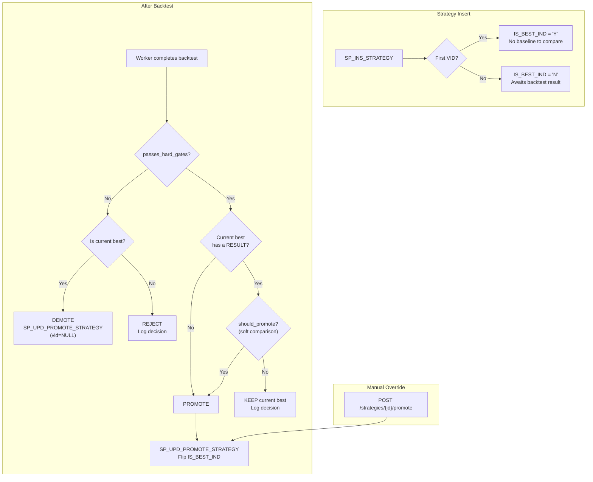

# Best-VID Promotion Model

**Status:** Implemented (DB + Python + API + UI). Deployed to prod.

## Problem

`SP_INS_STRATEGY` always makes the newest VID active (`TRANSACT_TO_TS = 9999-12-31`) and closes the previous one — even if the new VID performs worse. There is no way to distinguish "latest version" from "best version".

## Design — `IS_BEST_IND` column

Separate two concerns:
- **`TRANSACT_TO_TS`** = temporal versioning (which version is the latest/current) — unchanged
- **`IS_BEST_IND`** = quality flag (which version performed best) — new column



### Key semantics

- `TRANSACT_TO_TS = 9999-12-31` = **latest version** (temporal, unchanged behavior)
- `IS_BEST_IND = 'Y'` = **best-performing version** (exactly one per `STRATEGY_ID`)
- VID 1 starts as `IS_BEST_IND = 'Y'` (no baseline) — **demoted** if its backtest fails hard gates
- VID 2+ starts as `IS_BEST_IND = 'N'` — promoted only after beating the current best
- Comparison only ever compares the new VID vs the one row with `IS_BEST_IND = 'Y'`
- **Demotion**: if the current best fails hard gates, it is demoted (`IS_BEST_IND = 'N'`) with no replacement — the strategy has no best VID until one passes

## 1. Database Changes

### 1a. Add column to `BT.STRATEGY`

```sql
IS_BEST_IND  CHAR(1) NOT NULL
```

No `DEFAULT` — value is always set explicitly by `SP_INS_STRATEGY`. Backfill (Liquibase 1.6.0-001): set `IS_BEST_IND = 'Y'` for every row where `TRANSACT_TO_TS = 9999-12-31` (current active row = presumed best since no comparison data exists yet), `'N'` for the rest.

### 1b. Modify `SP_INS_STRATEGY`

Insert column added. No change to the `TRANSACT_TO_TS` close-and-insert logic.

- **VID 1**: `IS_BEST_IND = 'Y'`
- **VID 2+**: `IS_BEST_IND = 'N'`

### 1c. `SP_UPD_PROMOTE_STRATEGY`

Signature:
```
IN  IN_STRATEGY_ID   UUID
IN  IN_STRATEGY_VID  INTEGER   -- the VID to promote (NULL = demote-only)
IN  IN_USER_ID       TEXT      -- audit
OUT status triplet
```

Logic:
1. Demote current best: `UPDATE BT.STRATEGY SET IS_BEST_IND = 'N' WHERE STRATEGY_ID = IN_STRATEGY_ID AND IS_BEST_IND = 'Y'`
2. If `IN_STRATEGY_VID IS NULL` → **demote-only** (no replacement promoted), return immediately
3. Promote target: `UPDATE BT.STRATEGY SET IS_BEST_IND = 'Y' WHERE STRATEGY_ID = IN_STRATEGY_ID AND STRATEGY_VID = IN_STRATEGY_VID`

### 1d. Update `SP_GET_STRATEGY`

Add `IS_BEST_IND` to all cursor SELECT lists. New parameter `IN_IS_BEST_IND` enables fetching the best VID directly (`SP_GET_STRATEGY(strategy_id, is_best_ind='Y')`).

### 1e. Terminal procs (`FN/SP_GET_QUEUE_FOR_TERMINAL`)

Updated to derive `STRAT_CURRENT_IND` from `TRANSACT_TO_TS` (instead of the dropped `IS_CURRENT_IND`) and include `IS_BEST_IND` in the result set. The function required `DROP FUNCTION` before `CREATE OR REPLACE` because the return type changed.

### 1f. Liquibase changesets

**`1.6.0-promote-strategy.xml`** (deployed):

- 001: `ALTER TABLE BT.STRATEGY ADD COLUMN IS_BEST_IND` + backfill
- 002: `SP_INS_STRATEGY` (add IS_BEST_IND to INSERT)
- 003: `SP_UPD_PROMOTE_STRATEGY` (new)
- 004: `SP_GET_STRATEGY` (add IS_BEST_IND to cursors)

**`1.7.0-auto-promote-terminal-fix.xml`** (deployed):

- 001: `SP_GET_STRATEGY` — add `IN_IS_BEST_IND` parameter (3 fetch modes: exact VID, best, active)
- 002: `SP_GET_QUEUE_FOR_TERMINAL` — derive `STRAT_CURRENT_IND` from `TRANSACT_TO_TS`
- 003a: `DROP FUNCTION FN_GET_QUEUE_FOR_TERMINAL` (return type changed)
- 003: `FN_GET_QUEUE_FOR_TERMINAL` — recreate with `IS_BEST_IND` output

## 2. Promotion Metric Configuration — REFDATA-driven

Promotion criteria are **not hardcoded** in Python. They are stored in `REFDATA.PROMOTION_METRIC` and loaded at runtime via `RedisRefData.get_promotion_metrics()`.

### REFDATA.PROMOTION_METRIC table

| Column | Type | Description |
|---|---|---|
| NAME | TEXT | Unique key (e.g. `sharpe_gate`) |
| DISPLAY_NAME | TEXT | UI label |
| METRIC_KEY | TEXT | Matches `performance.strategy_metrics` key in PAYLOAD_JSON |
| DIRECTION | TEXT | `higher_is_better` or `lower_is_better` |
| REQUIREMENT_TYPE | TEXT | `HARD` = threshold gate, `SOFT` = comparison metric |
| PRIORITY | INTEGER | Evaluation order (1 = first) |
| THRESHOLD | NUMERIC | Required value for HARD gates (NULL for SOFT) |

### Evaluation logic (`quant/queue/promote.py`)

1. **Phase 1 — Hard gates**: All HARD metrics must pass their threshold. Any failure → skip promote.
2. **Phase 2 — Soft comparison**: Compared in priority order against the current best VID. First decisive win/loss decides. All ties → no promote (conservative).

### Liquibase changeset

**`refdata/releases/1.3.0-promotion-metric.xml`** (deployed):

- 001: Create `REFDATA.PROMOTION_METRIC` table
- 002: Seed default metrics (wrapped in `CDATA` — display names contain GT/LTE)
- 003: Fix display names (avoid `>` / `<=` in XML: `Sharpe GT 0`, `Max DD LTE 40%`)

### Default seed data

Priority follows the same convention as `BT.QUEUE`: **lower number = higher priority** (evaluated first).

| NAME | DISPLAY_NAME | TYPE | PRIORITY | THRESHOLD | METRIC_KEY | DIRECTION |
|---|---|---|---|---|---|---|
| sharpe_gate | Sharpe GT 0 | HARD | 0 | 0 | Sharpe Ratio | higher_is_better |
| max_dd_gate | Max DD LTE 40% | HARD | 10 | 0.40 | Max Drawdown | lower_is_better |
| sharpe_compare | Sharpe Ratio | SOFT | 0 | — | Sharpe Ratio | higher_is_better |
| calmar_compare | Calmar Ratio | SOFT | 20 | — | Calmar Ratio | higher_is_better |
| total_return | Total Return | SOFT | 40 | — | Total Return | higher_is_better |
| annualized_return | Annualized Return | SOFT | 60 | — | Annualized Return | higher_is_better |
| max_drawdown | Max Drawdown | SOFT | 80 | — | Max Drawdown | lower_is_better |

## 3. Python — Auto-Promote in Worker

### 3a. Promotion helper (`quant/queue/promote.py`)

Two public functions:

```python
def passes_hard_gates(payload: dict, promotion_metrics: list[dict]) -> bool:
    """Return True if payload passes every HARD-type gate."""

def should_promote(
    new_payload: dict,
    best_payload: dict | None,
    promotion_metrics: list[dict],
) -> bool:
    """Full promotion check: hard gates then soft comparison."""
```

- Receives metric config from REFDATA (no hardcoded sets)
- `passes_hard_gates` — checks all `HARD` metrics against their thresholds, respecting `direction`
- `should_promote` — calls `passes_hard_gates` first, then evaluates `SOFT` metrics in priority order against the current best; first decisive win/loss decides; all ties = no promote (conservative)
- Handles NaN / missing gracefully (don't promote if new metric is NaN)

### 3b. Worker completion (`quant/queue/worker.py`)

After writing `BT.RESULT` and before marking COMPLETED:

1. Load `promotion_metrics` from `RefData.get_promotion_metrics()`
2. Find current best VID for this `strategy_id` via `SP_GET_STRATEGY(is_best_ind='Y')`
3. **Demotion check**: if the just-completed VID *is* the current best and fails `passes_hard_gates` → call `SP_UPD_PROMOTE_STRATEGY(strategy_id, vid=NULL)` to demote (no replacement)
4. **Promotion check**: if the just-completed VID is *not* the current best:
   a. If best VID has a `BT.RESULT` → fetch its `PAYLOAD_JSON`
   b. Call `should_promote(payload, best_payload, promotion_metrics)`
   c. If promote → `CALL BT.SP_UPD_PROMOTE_STRATEGY(strategy_id, new_vid, user_id)`
5. Log the decision either way

### 3c. `BtQueueRepo` wrapper (`quant/queue/repo.py`)

- `sp_upd_promote_strategy(strategy_id, strategy_vid, user_id)` — `strategy_vid=None` triggers demote-only mode
- `sp_get_strategy(strategy_id, is_best_ind='Y')` — fetches the current best VID for comparison


## 4. Manual Promote API

### 4a. New endpoint in `quant/api/routers/jobs.py`

```
POST /api/v1/backtest/strategies/{strategy_id}/promote
Body: { "strategy_vid": 3 }
```

- Validates user owns the strategy (via `get_for_user`)
- Calls `SP_PROMOTE_STRATEGY`
- Refreshes cache
- Returns new active VID

## 5. UI Changes

- **VID column** in `JobsTable`: displays `v{strategy_vid}` with a green "Best" chip when `is_best_ind === 'Y'`
- **Actions column**: "Clone" (opens enqueue form pre-filled with config) + "Promote" (calls `POST /strategies/{id}/promote`)
- `EnqueueRequest` does **not** include `strategy_id` — clone always creates a new strategy (new `strategy_id`, VID 1)

## 6. Shared Strategy Pool

Currently list mode requires `IN_USER_ID` and scopes to that user's rows. For the shared pool:
- When `IN_USER_ID` is supplied → returns that user's active strategies (current behavior, for "my strategies")
- Add a new mode or endpoint for "all active strategies" (shared pool browser)

Separate concern — defer to a follow-up.

## 7. Future — Promotion Outcome Persistence

Planned (`BT.PROMOTION_OUTCOME` table + `SP_INS_PROMOTION_OUTCOME` procedure designed, not yet deployed):

- Store structured outcome per completed `QUEUE_ID`: `PROMOTED` / `KEPT` / `DEMOTED` / `REJECTED`
- `GATE_RESULTS JSONB` — per-gate pass/fail detail
- `COMPARED_VID`, `COMPARED_METRIC`, `NEW_VALUE`, `BEST_VALUE` — the decisive soft comparison
- Enables UI features: recommended strategy banners, VID comparison drawers, promotion rules card

## Resolved Questions

- **Calmar / Max Drawdown**: Fixed in `quant/strategy/performance.py`. `cumu = cumsum()` was kept; only Calmar Ratio formula corrected.
- **Re-versioning flow**: `EnqueueRequest` does not include `strategy_id`. Clone always creates a new strategy. Re-versioning (VID 2+ under same strategy) deferred.
- **VID 1 fails hard gates**: Fine to set `IS_BEST_IND='Y'` at insert. Worker demotes via `SP_UPD_PROMOTE_STRATEGY(vid=NULL)` if hard gates fail.
