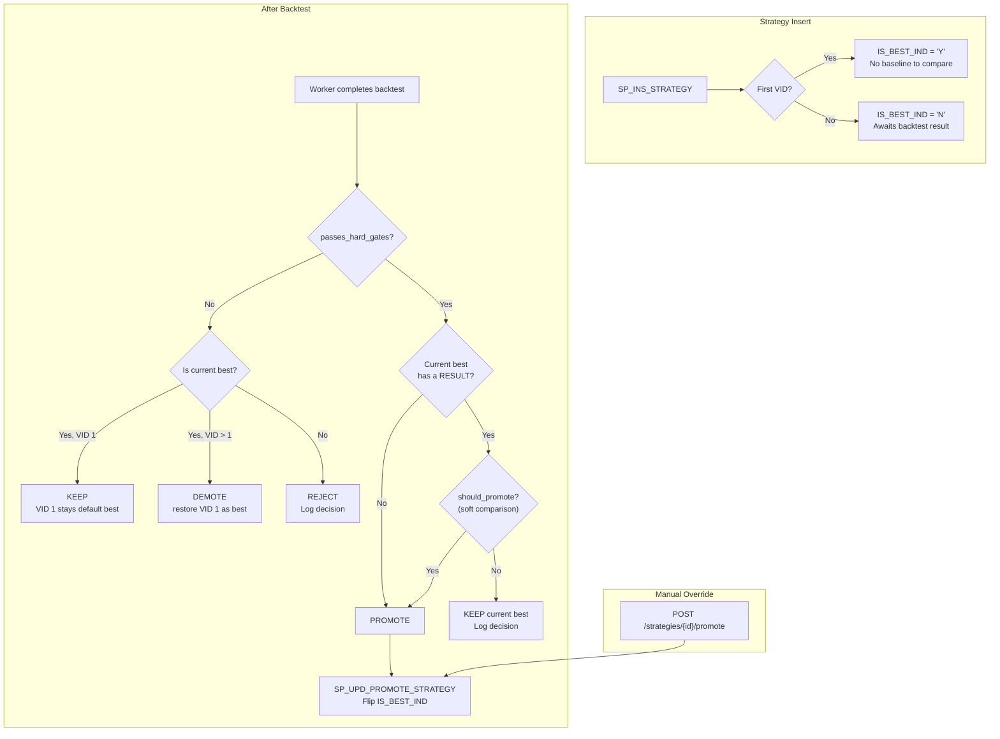
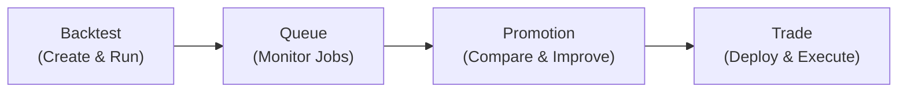

# Best-VID Promotion Model

**Status:** Implemented (DB + Python + API + UI + outcome persistence + Promotion tab). Deployed to prod.

## Problem

`SP_INS_STRATEGY` always makes the newest VID active (`TRANSACT_TO_TS = 9999-12-31`) and closes the previous one — even if the new VID performs worse. There is no way to distinguish "latest version" from "best version".

!!! note "Same name, duplicate VID=1 rows"
    A separate bug causes every enqueue to mint a **new** `STRATEGY_ID`, so the
    same `STRATEGY_NM` never increments VID. That breaks the Promotion UI (two
    cards both at `v1`). See [Strategy VID Versioning by Name](../archive/strategy-vid-versioning.md)
    for the fix, data cleanup, and `UNIQUE (USER_ID, STRATEGY_NM, STRATEGY_VID)`.

## Design — `IS_BEST_IND` column

Separate two concerns:
- **`TRANSACT_TO_TS`** = temporal versioning (which version is the latest/current) — unchanged
- **`IS_BEST_IND`** = quality flag (which version performed best) — new column



### Key semantics

- `TRANSACT_TO_TS = 9999-12-31` = **latest version** (temporal, unchanged behavior)
- `IS_BEST_IND = 'Y'` = **best-performing version** (exactly one per `STRATEGY_ID`)
- VID 1 starts as `IS_BEST_IND = 'Y'` and **remains** the default best even when its backtest fails hard gates
- VID 2+ starts as `IS_BEST_IND = 'N'` — promoted only after beating the current best
- Comparison only ever compares the new VID vs the one row with `IS_BEST_IND = 'Y'`
- **Demotion**: if a promoted VID (>1) fails hard gates while it is best, it is demoted and **VID 1 is restored** as the default best (`SP_UPD_PROMOTE_STRATEGY` demote-only fallback)

## 1. Database Changes

### 1a. Add column to `BT.STRATEGY`

```sql
IS_BEST_IND  CHAR(1) NOT NULL
```

No `DEFAULT` — value is always set explicitly by `SP_INS_STRATEGY`. Backfill (Liquibase 1.6.0-001): set `IS_BEST_IND = 'Y'` for every row where `TRANSACT_TO_TS = 9999-12-31` (current active row = presumed best since no comparison data exists yet), `'N'` for the rest.

### 1b. Modify `SP_INS_STRATEGY`

Insert column added. No change to the `TRANSACT_TO_TS` close-and-insert logic.

- **VID 1**: `IS_BEST_IND = 'Y'`
- **VID 2+**: `IS_BEST_IND = 'N'`

### 1c. `SP_UPD_PROMOTE_STRATEGY`

Signature:
```
IN  IN_STRATEGY_ID   UUID
IN  IN_STRATEGY_VID  INTEGER   -- the VID to promote (NULL = demote-only)
IN  IN_USER_ID       TEXT      -- audit
OUT status triplet
```

Logic:
1. Demote current best: `UPDATE BT.STRATEGY SET IS_BEST_IND = 'N' WHERE STRATEGY_ID = IN_STRATEGY_ID AND IS_BEST_IND = 'Y'`
2. If `IN_STRATEGY_VID IS NULL` → **demote-only**, then restore **VID 1** as `IS_BEST_IND='Y'` when no best remains
3. Promote target: `UPDATE BT.STRATEGY SET IS_BEST_IND = 'Y' WHERE STRATEGY_ID = IN_STRATEGY_ID AND STRATEGY_VID = IN_STRATEGY_VID`

### 1d. Update `SP_GET_STRATEGY`

Add `IS_BEST_IND` to all cursor SELECT lists. New parameter `IN_IS_BEST_IND` enables fetching the best VID directly (`SP_GET_STRATEGY(strategy_id, is_best_ind='Y')`).

### 1e. Terminal procs (`FN/SP_GET_QUEUE_FOR_TERMINAL`)

Updated to derive `STRAT_CURRENT_IND` from `TRANSACT_TO_TS` (instead of the dropped `IS_CURRENT_IND`) and include `IS_BEST_IND` in the result set. The function required `DROP FUNCTION` before `CREATE OR REPLACE` because the return type changed.

### 1f. Liquibase changesets

**`1.6.0-promote-strategy.xml`** (deployed):

- 001: `ALTER TABLE BT.STRATEGY ADD COLUMN IS_BEST_IND` + backfill
- 002: `SP_INS_STRATEGY` (add IS_BEST_IND to INSERT)
- 003: `SP_UPD_PROMOTE_STRATEGY` (new)
- 004: `SP_GET_STRATEGY` (add IS_BEST_IND to cursors)

**`1.7.0-auto-promote-terminal-fix.xml`** (deployed):

- 001: `SP_GET_STRATEGY` — add `IN_IS_BEST_IND` parameter (3 fetch modes: exact VID, best, active)
- 002: `SP_GET_QUEUE_FOR_TERMINAL` — derive `STRAT_CURRENT_IND` from `TRANSACT_TO_TS`
- 003a: `DROP FUNCTION FN_GET_QUEUE_FOR_TERMINAL` (return type changed)
- 003: `FN_GET_QUEUE_FOR_TERMINAL` — recreate with `IS_BEST_IND` output

## 2. Promotion Metric Configuration — REFDATA-driven

Promotion criteria are **not hardcoded** in Python. They are stored in `REFDATA.PROMOTION_METRIC` and loaded at runtime via `RedisRefData.get_promotion_metrics()`.

### REFDATA.PROMOTION_METRIC table

| Column | Type | Description |
|---|---|---|
| NAME | TEXT | Unique key (e.g. `sharpe_gate`) |
| DISPLAY_NAME | TEXT | UI label |
| METRIC_KEY | TEXT | Matches `performance.strategy_metrics` key in PAYLOAD_JSON |
| DIRECTION | TEXT | `higher_is_better` or `lower_is_better` |
| REQUIREMENT_TYPE | TEXT | `HARD` = threshold gate, `SOFT` = comparison metric |
| PRIORITY | INTEGER | Evaluation order (1 = first) |
| THRESHOLD | NUMERIC | Required value for HARD gates (NULL for SOFT) |

### Evaluation logic (`quant/queue/promote.py`)

1. **Phase 1 — Hard gates**: All HARD metrics must pass their threshold. Any failure → skip promote.
2. **Phase 2 — Soft comparison**: Compared in priority order against the current best VID. First decisive win/loss decides. All ties → no promote (conservative).

### Liquibase changeset

**`refdata/releases/1.3.0-promotion-metric.xml`** (deployed):

- 001: Create `REFDATA.PROMOTION_METRIC` table
- 002: Seed default metrics (wrapped in `CDATA` — display names contain GT/LTE)
- 003: Fix display names (avoid `>` / `<=` in XML: `Sharpe GT 0`, `Max DD LTE 40%`)

### Default seed data

Priority follows the same convention as `BT.QUEUE`: **lower number = higher priority** (evaluated first).

| NAME | DISPLAY_NAME | TYPE | PRIORITY | THRESHOLD | METRIC_KEY | DIRECTION |
|---|---|---|---|---|---|---|
| sharpe_gate | Sharpe GT 0 | HARD | 0 | 0 | Sharpe Ratio | higher_is_better |
| max_dd_gate | Max DD LTE 40% | HARD | 10 | 0.40 | Max Drawdown | lower_is_better |
| sharpe_compare | Sharpe Ratio | SOFT | 0 | — | Sharpe Ratio | higher_is_better |
| calmar_compare | Calmar Ratio | SOFT | 20 | — | Calmar Ratio | higher_is_better |
| total_return | Total Return | SOFT | 40 | — | Total Return | higher_is_better |
| annualized_return | Annualized Return | SOFT | 60 | — | Annualized Return | higher_is_better |
| max_drawdown | Max Drawdown | SOFT | 80 | — | Max Drawdown | lower_is_better |

## 3. Python — Auto-Promote in Worker

### 3a. Promotion helper (`quant/queue/promote.py`)

Three public functions:

```python
def passes_hard_gates(payload: dict, promotion_metrics: list[dict]) -> bool:
    """Return True if payload passes every HARD-type gate."""

def should_promote(
    new_payload: dict,
    best_payload: dict | None,
    promotion_metrics: list[dict],
) -> bool:
    """Full promotion check: hard gates then soft comparison."""

def evaluate_promotion(
    new_payload: dict,
    best_payload: dict | None,
    promotion_metrics: list[dict],
    *,
    is_current_best: bool = False,
    best_vid: int | None = None,
) -> PromotionDecision:
    """Structured evaluation — returns outcome + gate results + decisive metric."""
```

- Receives metric config from REFDATA (no hardcoded sets)
- `passes_hard_gates` / `should_promote` — original bool helpers (still used by tests)
- `evaluate_promotion` — wraps both and returns a `PromotionDecision` dataclass:
  - `outcome`: `PROMOTED` | `KEPT` | `DEMOTED` | `REJECTED`
  - `gate_results`: list of `GateResult(name, metric_key, passed, value, threshold)`
  - `compared_vid`, `decisive_metric`, `new_value`, `best_value` — the soft comparison that decided
- Handles NaN / missing gracefully (don't promote if new metric is NaN)

### 3b. Worker completion (`quant/queue/worker.py`)

After writing `BT.RESULT` and before marking COMPLETED:

1. Load `promotion_metrics` from `RefData.get_promotion_metrics()`
2. Find current best VID for this `strategy_id` via `SP_GET_STRATEGY(is_best_ind='Y')`
3. If not the current best, fetch the best VID's `BT.RESULT` payload for comparison
4. Call `evaluate_promotion(payload, best_payload, promotion_metrics, ...)`
5. Act on the outcome: `DEMOTED` → `SP_UPD_PROMOTE_STRATEGY(vid=NULL)`, `PROMOTED` → `SP_UPD_PROMOTE_STRATEGY(vid=new_vid)`
6. **Persist** the decision via `SP_INS_PROMOTION` with gate results and decisive metric detail

### 3c. `BtQueueRepo` wrapper (`quant/queue/repo.py`)

- `sp_upd_promote_strategy(strategy_id, strategy_vid, user_id)` — `strategy_vid=None` triggers demote-only mode
- `sp_get_strategy(strategy_id, is_best_ind='Y')` — fetches the current best VID for comparison
- `sp_ins_promotion(...)` — persists the structured promotion decision to `BT.PROMOTION`


## 4. Manual Promote API

### 4a. New endpoint in `quant/api/routers/jobs.py`

```
POST /api/v1/backtest/strategies/{strategy_id}/promote
Body: { "strategy_vid": 3 }
```

- Validates user owns the strategy (via `get_for_user`)
- Calls `SP_UPD_PROMOTE_STRATEGY`
- Refreshes cache
- Returns new active VID

## 5. UI — Pipeline Tab Model

The SPA uses a four-tab pipeline, where each tab represents a stage in the strategy lifecycle:



| Tab | User question | What they do |
|-----|---------------|--------------|
| **Backtest** | "What strategy should I test?" | Configure params, submit job |
| **Queue** | "How are my jobs doing?" | Monitor status, view results, clone |
| **Promotion** | "Which VID is best? How do I improve?" | Compare VIDs, see gate results, tweak metrics, re-backtest, deploy to Trade |
| **Trade** | "What's live? How is it performing?" | See deployed strategies, execution events, P&L |

The Promotion tab is the **strategy improvement loop** — users iterate there until satisfied, then deploy to Trade.

### 5a. Queue tab (implemented)

- **VID column** in `JobsTable`: displays `v{strategy_vid}` with a green "Best" chip when `is_best_ind === 'Y'`
- **Actions column**: "View" (load result), "Clone" (opens enqueue form pre-filled with config), "Promote" (calls `POST /strategies/{id}/promote`)
- `EnqueueRequest` does **not** include `strategy_id` — clone always creates a new strategy (new `strategy_id`, VID 1)

### 5b. Promotion tab (implemented)

Third tab in `BacktestPage` (`frontend/src/components/PromotionTab.tsx`), fed by
`GET /api/v1/backtest/promotions` (polled every 10s). `BT.SP_GET_PROMOTION` is
enriched with a `LEFT JOIN LATERAL` on `BT.RESULT` (candidate's shredded metrics)
and `BT.STRATEGY` (live `IS_BEST_IND`), so the whole tab renders from one query
with no N+1 round-trips.

Content:

- **Recommended strategy banner** — the overall best strategy across all `strategy_id`s (highest Sharpe among rows with `IS_BEST_IND = 'Y'`)
- **Strategy list** — accordions grouped by `strategy_id`, showing all VIDs with their promotion outcome chip (PROMOTED / KEPT / DEMOTED / REJECTED, label from `REFDATA.PROMOTION_STATE`), Sharpe/Calmar, and a "Best" chip on the current best VID
- **VID comparison panel** — click a VID to see hard gate results (pass/fail per gate with value + threshold from the `GATE_RESULTS` snapshot) and a soft-metric comparison vs the `COMPARED_VID` baseline; the first decisive soft metric (walked in `REFDATA.PROMOTION_METRIC` priority order) is highlighted
- **Promotion rules card** — read-only display of `REFDATA.PROMOTION_METRIC` (hard gates with thresholds, then soft metrics in priority order)
- **"Re-backtest" button** — fetches the decision's frozen `config_json` via its `QUEUE_ID`, prefills the Backtest drawer, and switches to the Backtest tab
- **"Deploy" button** — navigates to the Trade tab (`/trade/apply`) carrying `strategyId` + `strategyVid` in router state, ready for the Phase 1.7 apply form

The soft-comparison baseline reuses the decision row whose `strategy_vid` equals
`compared_vid` within the same strategy group — each row already carries that VID's
shredded metrics, so no extra fetch is needed.

### 5c. Design principle — progressive disclosure

Each tab answers a different question at a different stage. Adding a tab is justified when the **mental model** changes, not just when there is more data. The Promotion tab is a genuinely different task (strategy improvement) from Queue (job monitoring).

## 6. Shared Strategy Pool

Strategies are a **shared pool** — any authenticated user can read, browse, and deploy any strategy (decision #42). `USER_ID` on `BT.STRATEGY` is audit-only. Capital safety comes from credential ownership.

- The Promotion tab shows all strategies across all users
- The Trade tab filters to the caller's deployments (scoped by `APP_USER_ID`)

## 7. Promotion Outcome Persistence — Implemented

`BT.PROMOTION` — append-only log, no temporal versioning (each decision is immutable):

| Column | Type | Description |
|---|---|---|
| PROMOTION_ID | UUID PK | Client-generated UUID |
| QUEUE_ID | UUID | The completed backtest |
| STRATEGY_ID | UUID | Strategy being evaluated |
| STRATEGY_VID | INTEGER | VID being evaluated |
| OUTCOME | TEXT | `PROMOTED` / `KEPT` / `DEMOTED` / `REJECTED` |
| COMPARED_VID | INTEGER | Best VID compared against (NULL if no baseline) |
| GATE_RESULTS | JSONB | Point-in-time snapshot `[{name, passed, value, threshold}]` |
| USER_ID | TEXT | Audit |
| CREATED_AT | TIMESTAMPTZ | When decision was made |

Metric values (Sharpe, Calmar, etc.) are **not duplicated** here — they live as shredded columns on `BT.RESULT` (`SHARPE_RATIO`, `MAX_DRAWDOWN`, `CALMAR_RATIO`, `TOTAL_RETURN`, `ANNUALIZED_RETURN`). The UI derives the decisive soft metric by joining both results (candidate via `QUEUE_ID`, best via `COMPARED_VID`'s queue) and walking `REFDATA.PROMOTION_METRIC` in priority order. `GATE_RESULTS` is a snapshot because REFDATA thresholds may change after the decision.

- **SP:** `BT.SP_INS_PROMOTION` — simple insert + audit log
- **Liquibase:** `bt/releases/1.8.0-promotion.xml`
- **Worker:** persists one row per completed backtest, immediately after the promote/demote decision

## Resolved Questions

- **Calmar / Max Drawdown**: Fixed in `quant/strategy/performance.py`. `cumu = cumsum()` was kept; only Calmar Ratio formula corrected.
- **Re-versioning flow**: `EnqueueRequest` does not include `strategy_id`. Clone always creates a new strategy. Re-versioning (VID 2+ under same strategy) deferred.
- **VID 1 fails hard gates**: Fine to set `IS_BEST_IND='Y'` at insert. Worker demotes via `SP_UPD_PROMOTE_STRATEGY(vid=NULL)` if hard gates fail.
