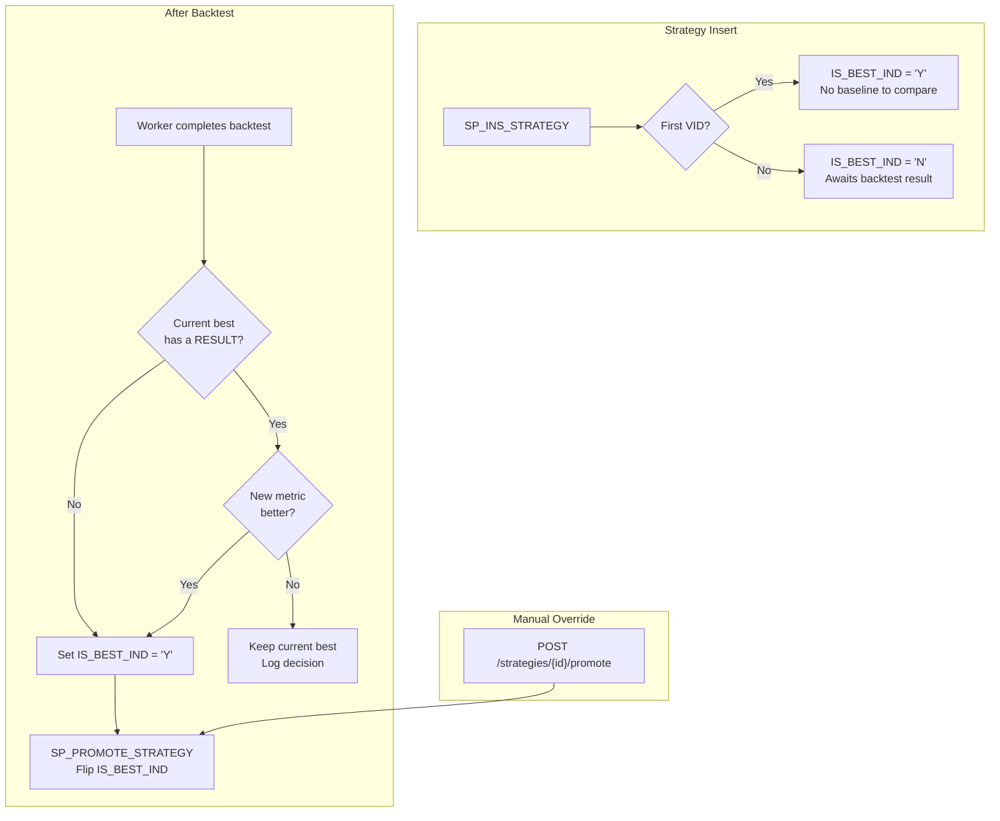

# Best-VID Promotion Model

## Current Problem

`SP_INS_STRATEGY` always makes the newest VID active (`TRANSACT_TO_TS = 9999-12-31`) and closes the previous one — even if the new VID performs worse. There is no way to distinguish "latest version" from "best version".

## Design — `IS_BEST_IND` column

Separate two concerns:
- **`TRANSACT_TO_TS`** = temporal versioning (which version is the latest/current) — unchanged
- **`IS_BEST_IND`** = quality flag (which version performed best) — new column



### Key semantics

- `TRANSACT_TO_TS = 9999-12-31` = **latest version** (temporal, unchanged behavior)
- `IS_BEST_IND = 'Y'` = **best-performing version** (exactly one per `STRATEGY_ID`)
- VID 1 is always best by default (no baseline)
- VID 2+ starts as `IS_BEST_IND = 'N'` — promoted only after beating the current best
- Comparison only ever compares the new VID vs the one row with `IS_BEST_IND = 'Y'`

## 1. Database Changes

### 1a. Add column to `BT.STRATEGY`

```sql
IS_BEST_IND  CHAR(1) NOT NULL DEFAULT 'N'
```

Backfill: set `IS_BEST_IND = 'Y'` for every row where `TRANSACT_TO_TS = 9999-12-31` (current active row = presumed best since no comparison data exists yet).

### 1b. Modify `SP_INS_STRATEGY`

Insert column added. No change to the `TRANSACT_TO_TS` close-and-insert logic.

- **VID 1**: `IS_BEST_IND = 'Y'`
- **VID 2+**: `IS_BEST_IND = 'N'`

### 1c. New `SP_PROMOTE_STRATEGY`

Signature:
```
IN  IN_STRATEGY_ID   UUID
IN  IN_STRATEGY_VID  INTEGER   -- the VID to promote
IN  IN_USER_ID       TEXT      -- audit
OUT status triplet
```

Logic:
1. Verify target VID exists and is not already best
2. `UPDATE BT.STRATEGY SET IS_BEST_IND = 'N' WHERE STRATEGY_ID = IN_STRATEGY_ID AND IS_BEST_IND = 'Y'`
3. `UPDATE BT.STRATEGY SET IS_BEST_IND = 'Y' WHERE STRATEGY_ID = IN_STRATEGY_ID AND STRATEGY_VID = IN_STRATEGY_VID`

### 1d. Update `SP_GET_STRATEGY`

Add `IS_BEST_IND` to all cursor SELECT lists so the cache and callers can see it.

### 1e. Liquibase changeset `1.6.0-promote-strategy.xml`

- changeSet 001: `ALTER TABLE BT.STRATEGY ADD COLUMN IS_BEST_IND` + backfill
- changeSet 002: `SP_INS_STRATEGY` (add IS_BEST_IND to INSERT)
- changeSet 003: `SP_PROMOTE_STRATEGY` (new)
- changeSet 004: `SP_GET_STRATEGY` (add IS_BEST_IND to cursors)

## 2. Promotion Metric Configuration — REFDATA-driven

Promotion criteria are **not hardcoded** in Python. They are stored in `REFDATA.PROMOTION_METRIC` and loaded at runtime via `RedisRefData.get_promotion_metrics()`.

### REFDATA.PROMOTION_METRIC table

| Column | Type | Description |
|---|---|---|
| NAME | TEXT | Unique key (e.g. `sharpe_gate`) |
| DISPLAY_NAME | TEXT | UI label |
| METRIC_KEY | TEXT | Matches `performance.strategy_metrics` key in PAYLOAD_JSON |
| DIRECTION | TEXT | `higher_is_better` or `lower_is_better` |
| REQUIREMENT_TYPE | TEXT | `HARD` = threshold gate, `SOFT` = comparison metric |
| PRIORITY | INTEGER | Evaluation order (1 = first) |
| THRESHOLD | NUMERIC | Required value for HARD gates (NULL for SOFT) |

### Evaluation logic (`quant/queue/promote.py`)

1. **Phase 1 — Hard gates**: All HARD metrics must pass their threshold. Any failure → skip promote.
2. **Phase 2 — Soft comparison**: Compared in priority order against the current best VID. First decisive win/loss decides. All ties → no promote (conservative).

### Default seed data

Priority follows the same convention as `BT.QUEUE`: **lower number = higher priority** (evaluated first).

| NAME | TYPE | PRIORITY | THRESHOLD | METRIC_KEY | DIRECTION |
|---|---|---|---|---|---|
| sharpe_gate | HARD | 0 | 0 | Sharpe Ratio | higher_is_better |
| max_dd_gate | HARD | 10 | 0.40 | Max Drawdown | lower_is_better |
| sharpe_compare | SOFT | 0 | — | Sharpe Ratio | higher_is_better |
| calmar_compare | SOFT | 20 | — | Calmar Ratio | higher_is_better |
| total_return | SOFT | 40 | — | Total Return | higher_is_better |
| annualized_return | SOFT | 60 | — | Annualized Return | higher_is_better |
| max_drawdown | SOFT | 80 | — | Max Drawdown | lower_is_better |

## 3. Python — Auto-Promote in Worker

### 3a. Promotion helper (`quant/queue/promote.py`)

```python
def should_promote(
    new_payload: dict,
    best_payload: dict | None,
    promotion_metrics: list[dict],  # REFDATA.PROMOTION_METRIC rows
) -> bool:
```

- Receives metric config from REFDATA (no hardcoded sets)
- Evaluates hard gates first, then soft comparisons in priority order
- Handles NaN / missing gracefully (don't promote if new metric is NaN)

### 3b. Worker completion (`quant/queue/worker.py`)

After writing `BT.RESULT` and before marking COMPLETED:

1. Load `promotion_metrics` from `RefData.get_promotion_metrics()`
2. Find current best VID for this `strategy_id` via `SP_GET_STRATEGY(is_best_ind='Y')`
3. If best VID has a `BT.RESULT` → fetch its `PAYLOAD_JSON`
4. Call `should_promote(payload, best_payload, promotion_metrics)`
5. If promote → `CALL BT.SP_UPD_PROMOTE_STRATEGY(strategy_id, new_vid, user_id)`
6. Log the decision either way

### 3c. `BtQueueRepo` wrapper

Add `sp_promote_strategy(strategy_id, strategy_vid, user_id)` to `quant/queue/repo.py`.

Add a lookup to fetch a RESULT by `(strategy_id, strategy_vid)` — joins QUEUE → RESULT.


## 4. Manual Promote API

### 4a. New endpoint in `quant/api/routers/jobs.py`

```
POST /api/v1/backtest/strategies/{strategy_id}/promote
Body: { "strategy_vid": 3 }
```

- Validates user owns the strategy (via `get_for_user`)
- Calls `SP_PROMOTE_STRATEGY`
- Refreshes cache
- Returns new active VID

## 5. Shared Strategy Pool

Currently list mode requires `IN_USER_ID` and scopes to that user's rows. For the shared pool:
- When `IN_USER_ID` is supplied → returns that user's active strategies (current behavior, for "my strategies")
- Add a new mode or endpoint for "all active strategies" (shared pool browser)

Separate concern — defer to a follow-up.

## Open Questions

- **Re-versioning flow**: The current enqueue endpoint always generates a fresh `strategy_id` (VID is always 1). To create VID 2+ under an existing strategy, `EnqueueRequest` needs an optional `strategy_id` field.
- **Calmar / Max Drawdown correctness**: Calmar ratio and max drawdown calculations may be incorrect — fix before wiring into promotion decisions.
