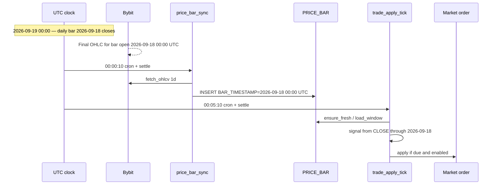

# ccxt bar timezones and when to apply

**Related:** [Scheduler & Price Bars](scheduler-price-bars.md),
[ccxt Trade & XREF Validation](ccxt-trade-and-xref-validation.md),
[Market Data Capture](market-data-capture.md),
decisions [#45](../decisions.md) (venue bars for live apply),
[#51](../decisions.md) (backtest on the same series you trade).

This page answers two questions that sound like one but are not:

1. **Which timezone does ccxt use for a daily candle?**
2. **When should a scheduled apply run so the order matches the bar that just closed?**

---

## Short answer

| Layer | Daily bar boundary | Timestamp meaning |
|-------|-------------------|-------------------|
| **ccxt (unified API)** | Milliseconds since Unix epoch, interpreted as **UTC** | Candle **open** time — not close |
| **Bybit / Binance (crypto spot & perp)** | **00:00 UTC** calendar days | Same as ccxt: open time of the interval |
| **This platform (`MARKET_DATA.PRICE_BAR`)** | Same as ccxt after fetch | `BAR_TIMESTAMP` = **open** time, stored `TIMESTAMPTZ` UTC |
| **Our interval math (`quant/shared/intervals.py`)** | Binned from the Unix epoch | Daily → midnight UTC; hourly → top of the hour UTC |

A daily bar is **usable for trading only after it has closed**. The close price is final at the **next** boundary (for daily: **00:00 UTC** on the following calendar day). Scheduled apply should therefore run **shortly after that close**, not at the open.

---

## What ccxt returns

`exchange.fetch_ohlcv(symbol, timeframe, since, limit)` returns rows:

```text
[timestamp_ms, open, high, low, close, volume]
```

**Convention (Binance, Bybit, and most ccxt exchanges):** `timestamp_ms` is the **opening time** of the candle in **UTC**. ccxt documents this explicitly for Binance; community issues treat open-time as the interoperability baseline ([ccxt #15010](https://github.com/ccxt/ccxt/issues/15010), [#21783](https://github.com/ccxt/ccxt/issues/21783)).

Implications:

- The **last row** in a response is often the **still-forming** candle. Its timestamp is the **start** of the current interval; OHLCV values keep updating until the interval ends.
- **`since`** is also in UTC milliseconds and selects candles by **open** time.
- ccxt does **not** apply your local timezone. Display with `exchange.iso8601(ts)` or `datetime.fromtimestamp(ms/1000, tz=UTC)`.

Our fetcher does exactly that in `quant/market_data/fetcher.py`:

```python
bar_timestamp=datetime.fromtimestamp(ts_ms / 1000, tz=UTC)
```

and maps `REFDATA.TM_INTERVAL.PERIOD_LENGTH` → ccxt strings via `ccxt_timeframe()` (`1d`, `1h`, …).

### Exchange-specific notes (venues we use)

| Venue | ccxt class | Daily timeframe | Boundary |
|-------|------------|-----------------|----------|
| Bybit | `bybit` | `1d` → API interval `D` | UTC midnight |
| Binance (USDM etc.) | `binanceusdm` / `binance` | `1d` | UTC midnight |

Crypto markets are 24/7; there is no “US equity session close” on these daily candles. Both venues align multi-day candles to **UTC calendar days**, which matches our epoch-based `floor_to_period(..., timedelta(days=1))`. REFDATA records that on `MARKET_CALENDAR` where `LISTING_EXCHANGE = ''` (default for ``.crypto`` products — see [Plan § REFDATA](#plan-align-apply-clock-to-bar-close-asap)).

**Not used on our REST bar path:** Binance’s optional `timezone` parameter on **spot websocket** kline streams ([ccxt #23252](https://github.com/ccxt/ccxt/pull/23252)). `CcxtBarFetcher` calls REST `fetch_ohlcv` only — no timezone offset is passed.

**Watch for outliers:** Some newer or thinly supported exchanges have returned **close** time instead of open time in ccxt parsers. Before adding a venue, fetch one daily candle and confirm the timestamp is midnight UTC for the expected **open**, not 23:59:59 for the **close**.

---

## How we store and name bars

`MARKET_DATA.PRICE_BAR.BAR_TIMESTAMP` is the **open** instant of the bar, always UTC. The row’s `CLOSE_PX` is the price at the **end** of that interval — i.e. at the next boundary.

Example (daily, Bybit BTCUSDT):

| Field | Value |
|-------|-------|
| `BAR_TIMESTAMP` | `2026-09-18 00:00:00+00` (open) |
| Interval covers | `[2026-09-18 00:00 UTC, 2026-09-19 00:00 UTC)` |
| `CLOSE_PX` | Last trade in that window — final only after `2026-09-19 00:00 UTC` |
| Forming bar (must not store) | `BAR_TIMESTAMP = 2026-09-19 00:00:00+00` while `now` is still before `2026-09-20 00:00 UTC` |

`PriceBarService` never persists the forming bar:

- `last_closed_bar(now, period)` = open time of the newest **fully closed** candle
- `ensure_fresh` / `fetch_bars` drop any row with `ts > until` where `until` is that closed boundary

See [Scheduler & Price Bars §4.7](scheduler-price-bars.md#47-failure-modes-and-error-handling) (partial / forming bar row).

---

## What the signal actually reads

Live apply loads the rolling window from `PRICE_BAR`, builds a DataFrame (`datetime`, `price`, …), and runs the same indicator / position logic as backtest. Indicators consume the **close** column; `data_as_of` on the apply report is the timestamp of the bar that produced the latest position — i.e. the **open** time of the last **closed** bar in the series.

So the decision chain is:

1. Wait until daily bar *D* has **closed** (UTC boundary passed).
2. Store bar *D* with `BAR_TIMESTAMP = D 00:00 UTC` and its final `CLOSE_PX`.
3. Compute signal from that close (and prior closes).
4. **Then** place the market order.

Trading on the open of bar *D* while still inside *D−1* would use stale closes and wrong signals.

---

## When we apply today (platform schedule)

EventBridge tasks (UTC):

| Task | Cron | In-process settle | Effective ~time |
|------|------|-------------------|-----------------|
| `price_bar_sync` | `0 * * * ? *` | 10s (`BarWarmer`) | `:00:10` each hour |
| `trade_apply_tick` | `5 * * * ? *` | 10s (`ScheduleSweeper`) | `:05:10` each hour |

Design intent ([Scheduler & Price Bars §6.2](scheduler-price-bars.md#62-schedule-management-one-platform-tick-not-a-schedule-per-deployment)):

1. **Warm on the boundary** — give the exchange a few seconds after the hour/day turns to publish the candle that just closed.
2. **Apply five minutes later** — bar sync usually finishes first; every apply still runs `ensure_fresh` and **fail-closed** if the newest closed bar is missing.

For **hourly** deployments, this is aligned: the 1H bar that closed at `:00` is targeted by `last_closed_bar` on the `:05` pass.

For **daily** deployments:

- The closed daily bar appears at **`00:00 UTC`** each day.
- `price_bar_sync` at **`00:00:10 UTC`** warms it; `trade_apply_tick` at **`00:05:10 UTC`** is the first apply pass after close — **if** the deployment’s `SCHEDULED_TS` cursor says it is due.
- The tick runs **every hour**, but a daily deployment only appears in `SP_GET_MISSED_DUE_DEPLOYMENTS` when its stored `SCHEDULED_TS <= now()`. In practice the first due pass after midnight is usually the **`00:05`** one, not a random hour — unless the cursor phase or backlog says otherwise.

Within the same closed interval, `last_closed_bar(now, period)` is identical whether you ask at `00:05` or `00:55` — the target bar does not change until the **next** boundary. The `:05` offset is about **publish latency and ordering**, not picking a different candle.



---

## Ideal execution rule (product)

> **Apply only after the newest closed bar’s close is final — as soon as practical after the interval end, never before.**

Operational checklist:

| Interval | Bar closes at (UTC) | Earliest safe apply (current design) | What goes wrong if too early |
|----------|---------------------|--------------------------------------|------------------------------|
| **1H** | Top of each hour | ~`:05` past the hour | Signal uses prior hour; may store forming bar |
| **1D** | `00:00` each day | ~`00:05` UTC | Signal uses prior day; may store forming daily |

Manual **Apply** in the UI follows the same bar rules: `ensure_fresh` + `load_window` use `last_closed_bar(now, period)` at click time. Clicking apply **before** the daily close uses yesterday’s bar — same as scheduled apply would.

---

## Where timezone mismatches still hurt

### Exchange bars vs provider bars (backtest)

Yahoo, Glassnode, and other **provider** dailies often use **exchange session** or **calendar** conventions that are **not** UTC midnight — e.g. US equity close, or “UTC date” with different adjustment rules.

That is why decision #51 requires backtests that will trade on Bybit to read `PRICE_BAR` for that venue, not a provider series. A strategy fitted on Yahoo `BTC-USD` dailies is fitted on **different days** than Bybit `BTCUSDT` `1d` candles even when both are called “daily”.

### Manual apply mid-session

A user clicking Apply at `2026-09-18 15:00 UTC` on a **daily** deployment correctly sees the last closed bar **`2026-09-18 00:00 UTC`** (yesterday’s close in wall-clock terms — the bar that opened at midnight **that morning** is still forming). That is correct behaviour but easy to misread as “stale data”.

### Phase offset from deploy time

`SP_INS_DEPLOYMENT` seeds `SCHEDULED_TS` from deploy time. A deployment created at `14:37 UTC` keeps that phase until each successful advance adds `PERIOD_LENGTH`. Daily deployments can become due at **`14:37 UTC`**, not at **`00:05 UTC`**, even though the **bar** they trade on is still the UTC-midnight daily candle. The signal is aligned to **bars**; the **clock** that triggers apply is separate. Fix: [Plan — align apply clock to bar close](#plan-align-apply-clock-to-bar-close-asap). See also [Scheduler & Trade Open Questions §4](scheduler-trade-open-questions.md#4-double-apply-poller-eventbridge-or-overlapping-polls).

---

## Verify on a venue (Bybit testnet)

From the repo root with network access:

```python
import ccxt
from datetime import UTC, datetime

ex = ccxt.bybit({"enableRateLimit": True, "options": {"defaultType": "spot"}})
ex.set_sandbox_mode(True)  # testnet

rows = ex.fetch_ohlcv("BTC/USDT", "1d", limit=3)
for ts, o, h, l, c, v in rows:
    open_utc = datetime.fromtimestamp(ts / 1000, tz=UTC)
    print(open_utc.isoformat(), "O", o, "C", c)

# Expect: timestamps on 00:00:00+00:00 calendar days.
# Last row may be today's forming candle — do not persist it as closed.
```

Compare with `MARKET_DATA.PRICE_BAR` for the same product:

- `BAR_TIMESTAMP` should match ccxt’s **open** times.
- `max_bar_timestamp` from coverage should equal `last_closed_bar(now, timedelta(days=1))` in Python.

---

## Code map

| Concern | Module |
|---------|--------|
| ccxt fetch + UTC parse | `quant/market_data/fetcher.py` |
| Closed-bar boundary | `quant/shared/intervals.py` — `last_closed_bar`, `floor_to_period` |
| Persist / read bars | `quant/market_data/service.py`, `quant/market_data/repo.py` |
| Live signal | `quant/strategy/live_service.py`, `quant/trade/live_apply.py` |
| When cron fires | `config/scheduler/price_bar_sync.yml`, `config/scheduler/trade_apply_tick.yml` |
| Listing session calendar | `REFDATA.MARKET_CALENDAR`, `RedisRefData.get_market_calendar(listing_exchange=...)` |
| Apply offset (broker × cadence) | `REFDATA.APP_APPLY_TIMING`, `RedisRefData.get_execute_offset()` |
| Both merged | `RedisRefData.get_apply_timing(app_id, interval, listing_exchange=...)` |
| Due deployments | `quant/trade/scheduler/tick.py`, `SP_GET_MISSED_DUE_DEPLOYMENTS` |

---

## Plan — align apply clock to bar close (ASAP)

**Status:** implemented in code ([decision #71](../decisions.md)); prod still needs the TRADE `1.7.0` migrate, a `quant-app` deploy, and the one-time backfill. A daily-only EventBridge rule remains unnecessary — the hourly `:05` sweep works now that the cursor phase matches.

### Problem

EventBridge and `ScheduleSweeper` are already timed correctly:

| Task | Cron (UTC) | Settle | Effective read |
|------|------------|--------|----------------|
| `price_bar_sync` | `:00` | 10 s | ~`:00:10` |
| `trade_apply_tick` | `:05` | 10 s | ~`:05:10` |

A **daily** deployment should become due on the **`00:05`** pass (first apply after the UTC-midnight close). That only happens when `DEPLOYMENT_SCHEDULE_STATUS.SCHEDULED_TS` sits on **`bar_boundary + 5 minutes`**, not on the deploy instant.

Today `SP_INS_DEPLOYMENT` seeds `SCHEDULED_TS := V_START_TS` (deploy time). A deployment created at `14:37 UTC` stays due at **`14:37`** every day — signal bars are still UTC-midnight dailies, but the **clock** fires mid-session.

### Target rule

**Calendar and offset come from REFDATA**, not Python constants — **two tables, two concerns**:

**``REFDATA.MARKET_CALENDAR``** — session calendar by **listing venue**, not broker:

| Column | Role |
|--------|------|
| `LISTING_EXCHANGE` | ``INST.PRODUCT.EXCHANGE`` (unique). `''` = default for ``EXCHANGE IS NULL`` (``.crypto`` spot): UTC 24/7, ccxt midnight dailies |
| `BAR_TIMEZONE` | IANA zone for `MARKET_*` wall-clock times |
| `MARKET_OPEN_TIME` / `MARKET_CLOSE_TIME` | Regular session local to `BAR_TIMEZONE`. **NULL** = continuous (24/7) |

Bybit and Binance share the same **`''`** row — the calendar describes the **instrument's market**, not which API routes the order.

**``REFDATA.APP_APPLY_TIMING``** — execute delay by **broker × cadence** (ops / API settle tuning):

| Column | Role |
|--------|------|
| `APP_ID` | `TRADE.DEPLOYMENT.APP_ID` |
| `TM_INTERVAL_ID` | Schedule cadence (`DAILY`, `1H`, …) |
| `EXECUTE_OFFSET` | `INTERVAL` after bar **close** before apply |

Seeded in release `1.25.0-app-apply-timing` (`context="refdata"`):

| `LISTING_EXCHANGE` | Calendar | `APP_APPLY_TIMING` |
|--------------------|----------|-------------------|
| `''` (default) | UTC, NULL session (24/7) | Bybit + Binance × DAILY, 1H @ 5 min |

Add `MARKET_CALENDAR` rows for `HKEX`, `NYSE`, etc. when listed products schedule; add `APP_APPLY_TIMING` rows when a new **broker** ships. Refresh Redis after migrate.

Lookup: ``get_market_calendar(listing_exchange=...)`` from the deployment's product; ``get_execute_offset(app_id, tm_interval_id)``; or ``get_apply_timing()`` (merged).

#### How REFDATA session times relate to ccxt bars

Three layers — do not conflate them:

1. **ccxt bar timestamp** — always UTC ms at **candle open**; Bybit/Binance dailies at **00:00 UTC** regardless of NULL session columns.
2. **Regular session** (`MARKET_OPEN_TIME` / `MARKET_CLOSE_TIME`) — **weekly** template for when the order book is open. NULL/NULL means the venue trades continuously; it does **not** change the UTC daily bar boundary on crypto. **Exchange holidays are not modeled here** — see [Later § holiday calendar](#later-not-blocking-the-shift).
3. **Apply clock** (`EXECUTE_OFFSET` on ``APP_APPLY_TIMING``) — how long after bar **close** the scheduler arms `SCHEDULED_TS`. The shipped path uses ``floor_to_period(..., PERIOD_LENGTH)`` from the Unix epoch (UTC midnight dailies), which is correct for 24/7 crypto and is why only crypto apps are scheduled today. Listed equity will need ``MARKET_CALENDAR`` keyed by the product's ``INST.PRODUCT.EXCHANGE``; the table and its reader exist, but nothing in the deployment path consults them yet.

``INST.PRODUCT.EXCHANGE`` selects the **calendar row**; ``DEPLOYMENT.APP_ID`` selects the **execute offset row**.

Pure interval math (offset passed in from REFDATA):

```python
# quant/shared/intervals.py
def next_apply_slot(after: datetime, period: timedelta, offset: timedelta) -> datetime:
    """Next scheduled apply: bar boundary + exchange-specific execute offset."""
    boundary = floor_to_period(after, period)
    candidate = boundary + offset
    if candidate > after:
        return candidate
    return boundary + period + offset
```

**Platform cron constraint:** `trade_apply_tick` fires at **`:05` UTC** hourly.
``EXECUTE_OFFSET`` for hourly cadences should stay **≤ 5 minutes** unless the
cron is tightened — a `10 minute` offset on `1H` would not become due until the
**next** hour's tick (up to ~55 minutes late). Daily offsets above 5 minutes
only slip within the same hour (e.g. `00:10` picked up at `01:05`).

Examples (`EXECUTE_OFFSET = 5 min` from REFDATA):

| Interval | Deploy / now | `next_apply_slot` |
|----------|--------------|-------------------|
| DAILY | `2026-09-18 14:37 UTC` | `2026-09-19 00:05 UTC` |
| DAILY | `2026-09-19 00:03 UTC` | `2026-09-19 00:05 UTC` (same-night pass) |
| 1H | `2026-09-18 11:03 UTC` | `2026-09-18 11:05 UTC` |
| 1H | `2026-09-18 11:06 UTC` | `2026-09-18 12:05 UTC` |

**Advance stays unchanged:** `SP_GET_MISSED_DUE_DEPLOYMENTS` returns `NEXT_SCHEDULED_TS = SCHEDULED_TS + PERIOD_LENGTH`. With `SCHEDULED_TS` on `:05`, every advance stays on `:05` (daily `00:05 → 00:05`, hourly `11:05 → 12:05`).

**UI:** `SP_GET_DEPLOYMENT.NEXT_DUE_AT` is already `SCHEDULED_TS` — no separate `next_run_at()` for the poller. Update the docstring on `next_run_at()` to say it is **boundary-only** (no offset); display should use `SCHEDULED_TS` once aligned.

### Implementation steps

| Step | Work | Blast radius |
|------|------|--------------|
| **1** | DDL + seed `REFDATA.MARKET_CALENDAR` + `APP_APPLY_TIMING`; reader resolvers | REFDATA release `1.25.0` (`context="refdata"`) + Python reader |
| **2** | Add `next_apply_slot()` + unit tests in `tests/unit/test_intervals.py` | Python only |
| **3** | Extend `SP_INS_DEPLOYMENT` with optional `IN_INITIAL_SCHEDULED_TS TIMESTAMPTZ` — when set and `VID = 1` with a schedule, use it instead of `V_START_TS`. Liquibase `1.7.0` (`context="trade,prod-deploy"` — replaces a procedure body, so the push queues the gated `migrate` job). | One proc body |
| **4** | `TradeRepo.write_deployment` / `TradeService.create_deployment`: when `schedule_tm_interval_id` is set, resolve `period` + `offset` from `RedisRefData`, pass `next_apply_slot(now(), period, offset)` into the SP | Create path |
| **5** | Same alignment on **schedule change** and **re-enable** (`IS_ENABLED_IND` flip back to `Y`, unpause): if the new row arms a `PENDING` schedule, seed with `next_apply_slot(now(), period, offset)` — not the prior deploy-phase cursor | Update path |
| **6** | **Backfill** existing enabled, scheduled deployments: one-shot `UPDATE` in `scripts/realign_schedule_phase.sql` (sets `SCHEDULED_TS` on current `PENDING` rows). Not in Liquibase deploy — run once per env after REFDATA 1.25.0. | Ops SQL |
| **7** | Log decision **#71** in `decisions.md` when step 4 ships | Docs |
| **8** | (Optional, later) Dedicated daily EventBridge rule at `00:05` — cosmetic; hourly sweep is sufficient once phase is aligned | AWS config |

**Do not change** `config/scheduler/trade_apply_tick.yml` for the first cut — `cron(5 * * * ? *)` matches the seeded **5 minute** `EXECUTE_OFFSET`. If ops raises an exchange offset above 5 minutes, update the cron or accept hourly slip.

### Backfill policy (step 6)

For each deployment that is enabled, not `PAUSED`/`STOPPED`, has `schedule_tm_interval_id`, and current `STATUS = 'PENDING'`:

1. Compute `offset = refdata.get_execute_offset(app_id, schedule_tm_interval_id)` and `aligned = next_apply_slot(now(), period, offset)`.
2. If `aligned == scheduled_ts` to the second (already on slot), skip.
3. Else `UPDATE` the current row's `SCHEDULED_TS` in place — this corrects a cursor rather than recording a new decision, so it does not append a version and leaves `USER_ID` untouched.

**Effect:** phase jumps to the **next** aligned slot from “now” — e.g. a daily row due at `14:37` at `10:00 UTC` moves to **`00:05` tomorrow**, not `14:37` today. That is intentional for “shift ASAP to bar close.” Ops should announce before running in prod.

Deployments mid-backlog (due `SCHEDULED_TS` in the past) keep catching up one interval per tick (decision #46); realigning the cursor does not replay missed bars.

### Verification

1. Unit: `next_apply_slot` cases above + advance arithmetic (`scheduled + period` stays on `:05`).
2. Integration: create daily deployment at arbitrary wall time → `NEXT_DUE_AT` is next `00:05 UTC`.
3. Manual: after backfill, confirm prod daily deployments appear in `SP_GET_MISSED_DUE_DEPLOYMENTS` only on the `00:05` tick pass (CloudWatch / `EXECUTION_EVENT.TRANSACT_AT`).

### Later (not blocking the shift)

| Idea | Why defer |
|------|-----------|
| **Daily-only tick at `00:05 UTC`** | Hourly sweep + aligned phase is enough; separate rule is ops clarity only. |
| **Per-venue boundary probe** | ccxt alignment is already documented; add when a non-UTC-midnight venue ships. |
| **Exchange holiday calendar** | `MARKET_CALENDAR.MARKET_OPEN/CLOSE` is Mon–Fri-style wall clock only. Listed venues need a holiday table or feed before skipping apply on closed days. Crypto uses the `''` row and never needs holidays. Likely `REFDATA.MARKET_HOLIDAY` keyed by `LISTING_EXCHANGE` + date — not in `1.25.0`. |

See [Scheduler open questions §10](scheduler-trade-open-questions.md#10-align-scheduled_ts-to-bar-close) and [Plan to Profit §1.9 follow-on](plan-to-profit.md#191-align-apply-clock-to-bar-close).

Flatten-on-pause and in-flight lease are unrelated; see [Scheduler & Trade Open Questions](scheduler-trade-open-questions.md).
