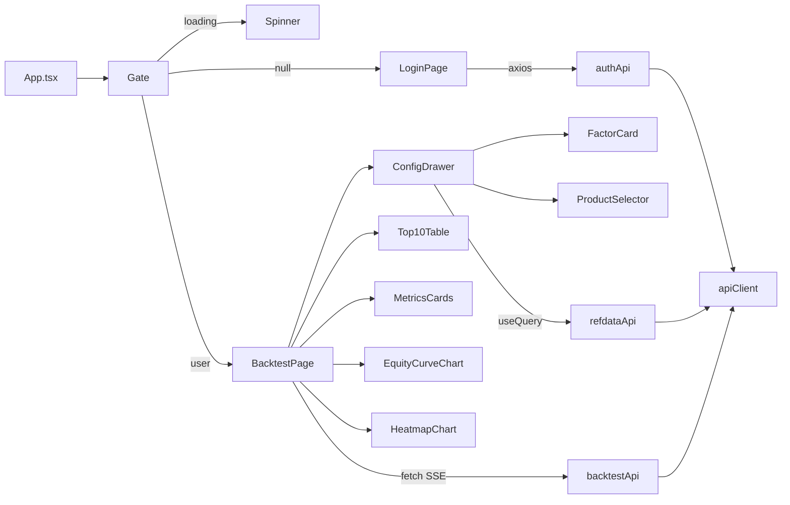

# Frontend Code Quality Audit

A prioritized review of issues in the React/TypeScript frontend (`frontend/`), with concrete file references and remediation suggestions. Findings only — no changes have been made as a result of this document.

## TL;DR

The frontend is small and consistent (MUI + TanStack Query + thin axios client). It avoids many common pitfalls (no `useEffect` in `src/`, controlled drawer, REFDATA-driven selects). However, it has:

- **Loose domain types** (`Top10Row` index signature) forcing `as` casts at boundaries
- **Async race conditions** in the `BacktestPage` lifecycle (optimize stream + per-row perf)
- **No SSE payload validation**
- **TypeScript `strict` mode is OFF**
- **God-component pressure** in `BacktestPage.tsx` (~349 lines, 12 `useState`)
- **Tooling debt** (Tailwind installed but unused, platform-specific dep in `dependencies`)

## Architecture today

## Critical issues — likely bug source / runtime risk

- **`Top10Row` index signature hides shape** — `frontend/src/types/backtest.ts` lines 120–125 use `[key: string]: unknown`. Call sites in `requestBuilders.ts` and `Top10Table.tsx` cast with `as number`. Fix: discriminated union for single vs multi rows.
- **SSE payload not validated** — `frontend/src/api/backtest.ts` lines 59–63 do `JSON.parse(eventData)` then `as OptimizeResponse`. Malformed payload throws inside `processChunk` and silently rejects. Fix: schema validation (Zod) or typed parser.
- **`response.body!` non-null assertion** — `frontend/src/api/backtest.ts` line 37. Theoretically empty body crashes. Fix: explicit `if (!response.body) reject(...)`.
- **Concurrent `loadPerf` race** — `frontend/src/pages/BacktestPage.tsx` lines 67–81. Click row A, then row B; if A's response returns last, A's data overwrites B's selection. Fix: `AbortController` per request or monotonic request id.
- **Optimize stream not aborted on unmount or new run** — `runOptimizeStream` accepts `signal?: AbortSignal` (`frontend/src/api/backtest.ts` lines 17–20) but `BacktestPage.handleRun` never passes one. Risk: progress callbacks fire after unmount.

## High-priority issues — maintainability / change risk

- **TypeScript `strict` mode is OFF** — `frontend/tsconfig.app.json` has no `"strict": true`. Weaker than industry standard.
- **Validation duplicated and divergent** — `validate()` in `frontend/src/pages/BacktestPage.tsx` lines 84–92 vs `missingFields` in `frontend/src/components/ConfigDrawer.tsx` lines 64–72. Easy to drift. Fix: one `validateBacktestConfig()` module.
- **`analysisTab` not reset on new run** — `frontend/src/pages/BacktestPage.tsx` lines 103–108. Tab index can point at a panel that no longer exists.
- **SSE uses `fetch`, REST uses `axios`** — Two transports, two error/auth/credential policies. Future header changes must be duplicated. Fix: single transport facade.
- **`Plot.ts` interop relies on `any`** — `frontend/src/lib/Plot.ts`. Bypasses types at the Plotly boundary.
- **Fragile auth error string match** — `frontend/src/api/auth.ts` line 25 (`err.message === 'Not authenticated'`). Backend copy change breaks the guard. Fix: status-code check before interceptor wraps.

## Medium-priority issues — code smells

- **`Top10Table` assumes all non-`sharpe` columns are numeric** — `frontend/src/components/Top10Table.tsx` lines 17–26.
- **Heatmap is O(signals × windows × grid)** — `frontend/src/components/HeatmapChart.tsx` lines 17–21 (`grid.find` inside nested maps). Fix: build a `Map` keyed by `(window,signal)` once.
- **Magic threshold drift** — `overfitColor` (0.3 / 0.5) vs `overfitLabel` (0.3 / 0.7) in `frontend/src/utils/format.ts` lines 3–14. Color and label can disagree.
- **`BacktestConfig` has both top-level `indicator/strategy/ranges` AND `factors[]`** — `frontend/src/types/backtest.ts` lines 42–51. UI only edits `factors`. Two sources of truth.
- **Misleading user copy `alert_internal_cusip`** — `frontend/src/components/ConfigDrawer.tsx` lines 184–189. Looks like debug text.
- **`FactorCard` casts nullable REFDATA numbers** — `frontend/src/components/config/FactorCard.tsx` lines 44–45 (`sig_min`/`sig_max` are nullable in `frontend/src/types/refdata.ts` lines 7–8).
- **`ErrorBoundary` "Try Again" only clears boundary state** — Faulty child may remain mounted. Fix: bump `key` to remount subtree.
- **`MetricsCards` magic metric names** — Hardcoded `PERCENT_KEYS` in `frontend/src/components/MetricsCards.tsx` lines 4–9. Drift if API renames.

## Low-priority — nice-to-have

- Charts not memoized; large literal `layout` rebuilt every render.
- Accessibility gaps: icon-only buttons without `aria-label` (e.g. `frontend/src/components/ConfigDrawer.tsx` line 89).
- Mixed styling: MUI `sx` + raw `style` + `
` (e.g. `frontend/src/components/MetricsCards.tsx` lines 30–31).
- **Tailwind installed but unused** — `frontend/package.json` lines 29–30, 41 + `frontend/vite.config.ts`. Zero `className=` in TSX. Either remove or adopt.
- **Platform-specific dep** — `@rolldown/binding-linux-x64-gnu` in `dependencies` in `frontend/package.json`. Unusual; usually managed by bundler.
- ESLint uses recommended only (no `strictTypeChecked`).

## Note on "no strict OOP"

React idiomatically uses **functional components, not OOP** — that's not a bad practice in itself. The real gap isn't classes, it's:

- **Domain modeling** (e.g. discriminated `SingleFactorRow | MultiFactorRow` instead of `[key: string]: unknown`)
- **Validation/parsing at boundaries** (Zod or hand-written parsers for SSE/REST responses)
- **Explicit lifecycle ownership** (one hook owns the optimize run + abort + perf load)

Whether implemented as classes, functions, or modules is a style choice. Adding classes for class's sake would not improve this codebase.

## Three larger redesign directions

1. **Backtest feature module + run-state hook** — Extract `useBacktestRun()` (or lightweight Zustand store) that owns: config snapshot, optimize stream with `AbortController`, perf load with abort/id, derived flags, and tab state derived from available analyses. Removes god-component pressure and fixes race/tab bugs systematically. **Touches:** `BacktestPage.tsx`, new `features/backtest/` folder.

2. **Typed API boundary + schema validation** — Replace ad hoc `as` casts with Zod schemas (or OpenAPI-generated types) shared between runtime parsing and tests. Single transport layer wrapping axios + streaming `fetch` with identical auth/error handling. Eliminates `Top10Row` escape hatch and SSE `as OptimizeResponse`. **Touches:** `api/`, `types/`.

3. **Presentation vs domain split for charts/tables** — Extract pure functions: "heatmap matrix from grid", "columns from Top10Row union", "equity plot specs from series". Components become thin and testable without Plotly/DataGrid. **Touches:** `components/HeatmapChart.tsx`, `Top10Table.tsx`, `EquityCurveChart.tsx`, new `domain/` helpers.

## Suggested remediation paths

Three options in increasing scope:

- **Surgical fixes** — Critical issues only. Small focused PR. Highest bug-prevention per hour invested.
- **Hardening pass** — Critical + High. Adds strict TS, validation module, abort plumbing. Roughly 1–2 PRs.
- **Full redesign** — All three redesigns above, staged over 3–4 PRs. Best long-term shape but the largest effort.
