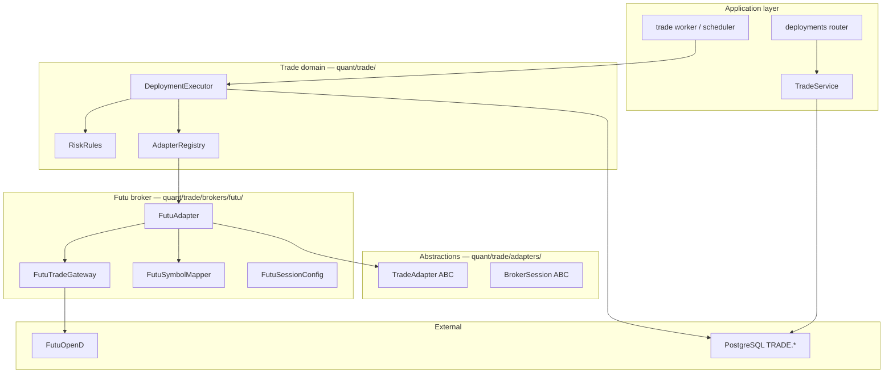
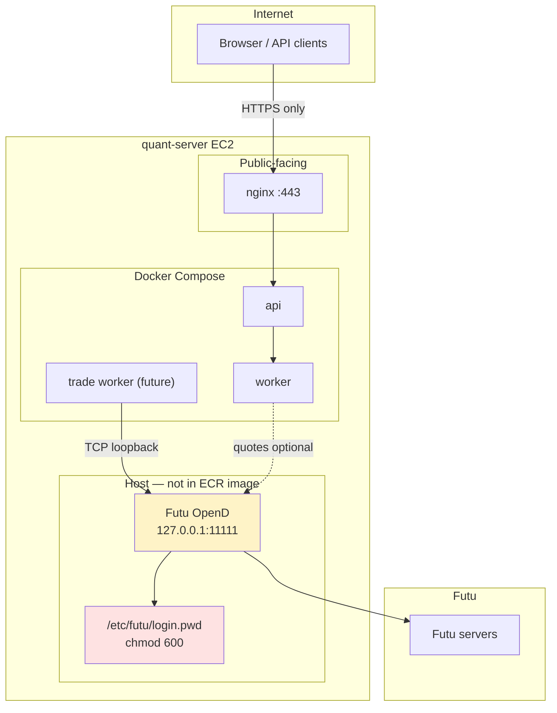
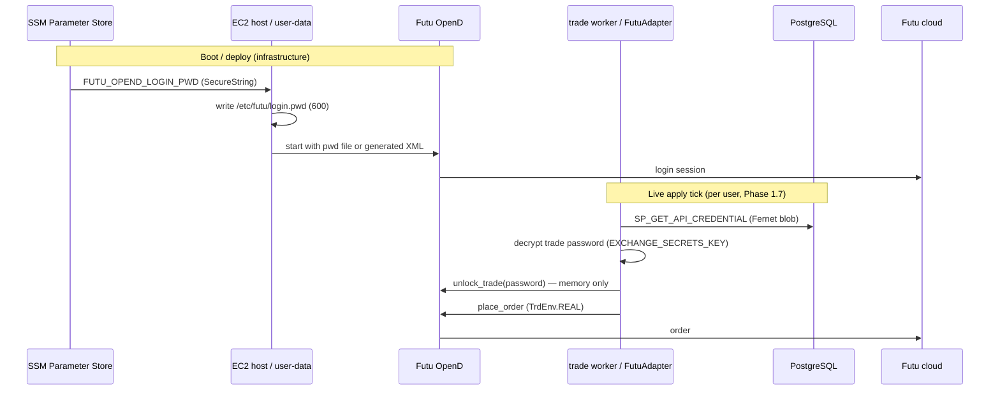
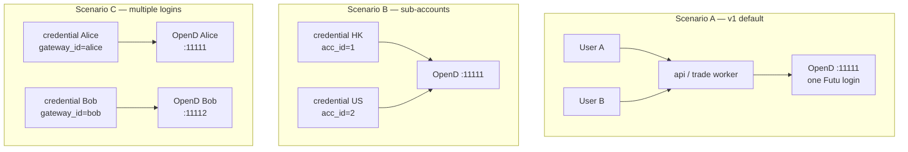
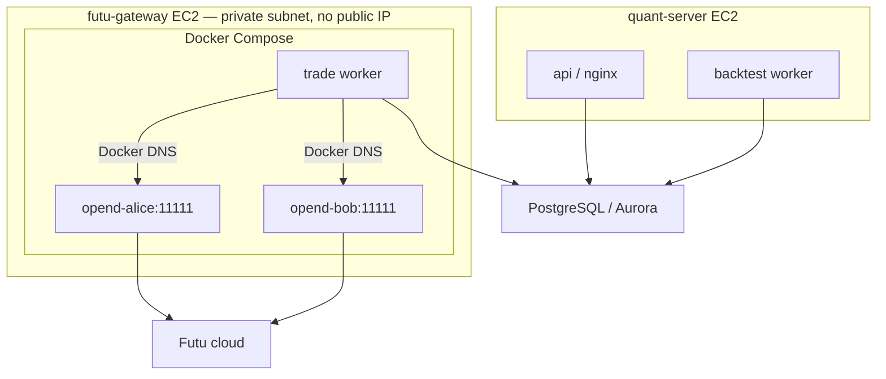
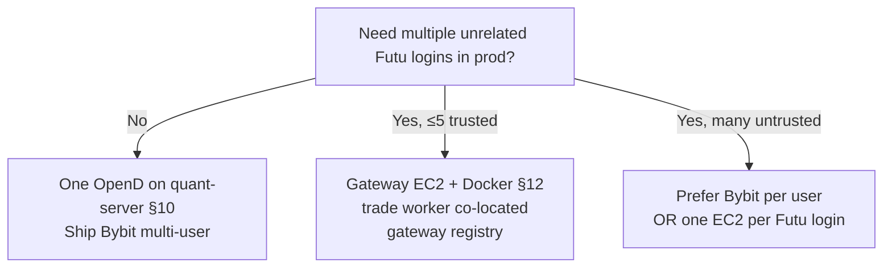

# Futu Trading — OOP Implementation Plan

!!! info "Status"
    **Design — not implemented.** A procedural prototype exists in `quant/trade/futu_trader.py` (single class). This document defines how to integrate Futu into the Plan-to-Profit trade pipeline using **strict OOP**, broker adapters, and the existing `TRADE.DEPLOYMENT` model.

**References**

| Source | Use |
|--------|-----|
| [Futu API — Program Samples](https://openapi.futunn.com/futu-api-doc/en/quick/demo.html) | Official `OpenSecTradeContext`, `TrdEnv.SIMULATE`, `unlock_trade` |
| [quincylin1/futubot](https://github.com/quincylin1/futubot) | Modular `Accounts` / `Robot` / `Portfolio` separation; paper vs live; pending-order guard |
| [GitHub topic: futu-api](https://github.com/topics/futu-api) | Ecosystem patterns (e.g. [billpwchan/futu_algo](https://github.com/billpwchan/futu_algo) for HK quant workflows) |
| [Trade API](trade-api.md) | `TradeAdapter`, deployment loop, risk checks |
| [Plan to Profit §1.1–1.7](plan-to-profit.md#phase-1--fastest-profit-pipeline) | Credentials, deployments, dry-run, live apply |

---

## 1. Goals

| Goal | Detail |
|------|--------|
| **Enable Futu live/paper trade** | HK / US / SG / JP equities via Futu OpenD — first broker adapter after deployments API |
| **Strict OOP** | Abstract interfaces, value objects, single-responsibility classes; **no** monolithic god-class or script-style loops in `quant/trade/` |
| **Fit existing architecture** | `REFDATA.APP` (`futu`, `APP_ID=3`), `TRADE.DEPLOYMENT`, `INST.PRODUCT_XREF` symbol mapping, `TradeService`, future trade worker |
| **Reuse backtest logic** | Signal path identical to [Trade API §6](trade-api.md#6-signal-execution-loop) — indicators from `quant/strategy/`, not reimplemented in the broker layer |
| **Safety** | Paper-first default; live requires unlock + explicit UI confirmation (Phase 1.7) |

**Out of scope for first cut**

- Intraday streaming dashboard (futubot-style Dash UI)
- Multi-stock basket robot in one process
- Replacing `quant/data/sources.py::FutuOpenD` quote path (keep quote vs trade contexts separate)

---

## 2. Current State

### 2.1 What exists

| Artifact | Location | Notes |
|----------|----------|--------|
| `FutuTrader` | `quant/trade/futu_trader.py` | Procedural wrapper around `OpenSecTradeContext`; `place_order`, `apply_signal`, queries |
| Quote data | `quant/data/sources.py::FutuOpenD` | `OpenQuoteContext` — **separate** from trade context (matches Futu docs) |
| Deployments API | `quant/api/routers/deployments.py` | Persist strategy + `api_credential_id` + `app_id` |
| Trade domain | `quant/trade/service.py`, `db_repo.py` | DB only — no broker calls yet |
| Legacy scripts | `quant/trade/trade.py`, `source.py`, `repo.py` | Old Bybit/ccxt experiments — **do not extend**; delete or move to `backup/deco/` when Futu adapter lands |
| Unit / E2E tests | `tests/unit/test_trade.py`, `tests/e2e/test_futu_trader_e2e.py` | Import via `quant.trade` (re-exported from `futu_trader`) |

### 2.2 Futu OpenD model (from official docs)

Futu splits responsibilities into two programs ([Program Samples](https://openapi.futunn.com/futu-api-doc/en/quick/demo.html)):

```
┌─────────────┐     TCP (host:port)      ┌──────────────┐     ┌─────────────┐
│  Your app   │ ◄──────────────────────► │  FutuOpenD   │ ◄──►│ Futu servers│
│  (futu-api) │                          │  (gateway)   │     │             │
└─────────────┘                          └──────────────┘     └─────────────┘
```

Python SDK contexts:

| Context | Purpose | Our module |
|---------|---------|------------|
| `OpenQuoteContext` | Snapshots, klines, subscriptions | `FutuOpenD` (data) — already exists |
| `OpenSecTradeContext` | Orders, positions, account | **New** `FutuTradeGateway` (trade) |

Paper vs live is **`trd_env`**, not a separate host:

```python
# Official pattern (paper)
trd_ctx.place_order(..., trd_env=TrdEnv.SIMULATE)

# Live — requires unlock_trade(password) first
trd_ctx.unlock_trade(trade_password)
trd_ctx.place_order(..., trd_env=TrdEnv.REAL)
```

### 2.3 Lessons from futubot

[futubot](https://github.com/quincylin1/futubot) modularizes:

| Module | Responsibility | Quant Strategies equivalent |
|--------|----------------|----------------------------|
| `Accounts` | Raw Futu API encapsulation | `FutuTradeGateway` (SDK only) |
| `Robot` | Signal → order orchestration | `SignalExecutor` + `FutuAdapter` |
| `Portfolio` | Positions, PnL, metrics | `PositionReader` protocol + adapter method |
| `Strategy/` | Pluggable strategy files | `BT.STRATEGY` JSON + existing `Strategy` class |

**Behaviours to adopt**

- **Pending-order guard** — futubot skips new signals while orders are pending; map to `Duplicate guard` in [Trade API §4](trade-api.md#4-risk--safety).
- **Paper order type** — Futu paper often rejects market orders; default paper path to **limit** or `NORMAL` with computed price (document in adapter).
- **Market hours** — E2E and worker should no-op or defer outside session (configurable per market).

**Behaviours we skip**

- Real-time Dash dashboard
- HK-only assumption — we support US/HK/SG/JP via `filter_trdmarket` (already in `FutuTrader.MARKET_MAP`)

---

## 3. OOP Design

### 3.1 Principles

1. **Depend on abstractions** — workers and API call `TradeAdapter`, never `import futu` outside the Futu package.
2. **Thin SDK boundary** — one class (`FutuTradeGateway`) owns all `futu.*` imports and `(ret, data)` tuple handling.
3. **Immutable config** — `@dataclass(frozen=True)` for connection and order requests.
4. **Explicit results** — `OrderResult`, `ConnectionStatus` value objects; no silent `None` except “no action needed”.
5. **Composition** — `FutuAdapter` holds `FutuTradeGateway` + `FutuSymbolMapper`; does not subclass the SDK context.
6. **Factory registration** — `AdapterRegistry.get(app_id)` resolves `REFDATA.APP` → adapter class.

### 3.2 Layer diagram



### 3.3 Package layout (target)

```
quant/trade/
├── __init__.py              # public exports: TradeService, AdapterRegistry, …
├── service.py               # existing — deployments CRUD
├── db_repo.py               # existing
├── errors.py                # existing + BrokerError, ConnectionError
├── executor.py              # NEW — DeploymentExecutor (signal → risk → adapter)
├── registry.py              # NEW — AdapterRegistry(app_id → TradeAdapter)
├── adapters/
│   ├── __init__.py
│   ├── base.py              # TradeAdapter, BrokerSession ABCs
│   └── protocols.py         # PositionReader, OrderPlacer (optional typing.Protocol)
├── models/
│   ├── __init__.py
│   ├── order.py             # OrderSide, OrderType, OrderRequest, OrderResult
│   └── session.py           # BrokerSessionState, ConnectionConfig
└── brokers/
    └── futu/
        ├── __init__.py
        ├── config.py        # FutuSessionConfig(frozen dataclass)
        ├── gateway.py       # FutuTradeGateway — sole futu import site
        ├── mapper.py        # internal_cusip → Futu code via INST.PRODUCT_XREF
        └── adapter.py       # FutuAdapter(TradeAdapter)
```

**Migration:** Move logic from `quant/trade/futu_trader.py` into `brokers/futu/*`, then delete `futu_trader.py` and update imports/tests. Keep a one-release shim only if needed — project convention is **no backward-compat shims**.

### 3.4 Abstract interfaces

```python
# quant/trade/adapters/base.py
from abc import ABC, abstractmethod
from quant.trade.models.order import OrderRequest, OrderResult
from quant.trade.models.session import BrokerSessionState


class BrokerSession(ABC):
    """Lifecycle: connect → (optional unlock) → use → disconnect."""

    @abstractmethod
    def connect(self) -> None: ...

    @abstractmethod
    def disconnect(self) -> None: ...

    @abstractmethod
    def health(self) -> BrokerSessionState: ...

    def __enter__(self) -> "BrokerSession":
        self.connect()
        return self

    def __exit__(self, *exc) -> None:
        self.disconnect()


class TradeAdapter(BrokerSession):
    """Broker-agnostic trading surface for the execution loop."""

    @abstractmethod
    def unlock_live_trading(self, trade_password: str) -> None:
        """Required for REAL env; no-op or skip for paper."""

    @abstractmethod
    def place_order(self, req: OrderRequest) -> OrderResult: ...

    @abstractmethod
    def cancel_order(self, vendor_order_id: str) -> OrderResult: ...

    @abstractmethod
    def get_open_orders(self, symbol: str | None = None) -> list[dict]: ...

    @abstractmethod
    def get_position_qty(self, symbol: str) -> int: ...

    @abstractmethod
    def apply_signal(self, symbol: str, signal: float, qty: int) -> OrderResult | None:
        """Translate {-1,0,1} signal to orders; None if no action."""
```

`TradeAdapter` extends `BrokerSession` so the worker can use `with adapter:` uniformly.

### 3.5 Futu concrete classes

#### `FutuSessionConfig` (frozen dataclass)

| Field | Source | Notes |
|-------|--------|-------|
| `host` | `.env` `FUTU_HOST` or deployment infra | OpenD is **per host**, not per user in v1 |
| `port` | `.env` `FUTU_PORT` | Default `11111` |
| `market` | `TrdMarket` from symbol prefix or deployment | `US`, `HK`, … |
| `paper` | `TRADE.DEPLOYMENT.is_paper_ind` | Maps to `TrdEnv.SIMULATE` / `REAL` |
| `trade_password` | Decrypted credential (live only) | See §4 |

#### `FutuTradeGateway`

Single class that wraps `OpenSecTradeContext`:

| Method | SDK call | Returns |
|--------|----------|---------|
| `connect()` | `OpenSecTradeContext(host, port, filter_trdmarket=…)` | — |
| `disconnect()` | `ctx.close()` | — |
| `unlock(password)` | `unlock_trade(password)` | raises `FutuApiError` if `ret != 0` |
| `place_order(req)` | `place_order(price, qty, code, trd_side, order_type, trd_env)` | `OrderResult` |
| `cancel_order(id)` | `modify_order(CANCEL, …)` | `OrderResult` |
| `list_orders()` | `order_list_query(trd_env=…)` | `list[OrderSnapshot]` |
| `list_positions()` | `position_list_query(trd_env=…)` | `list[PositionSnapshot]` |
| `account_info()` | `accinfo_query(trd_env=…)` | `AccountSnapshot` |

**Error handling:** Private `_call(ret, data)` raises `FutuApiError(ret, data)` — never leak raw tuples upward.

#### `FutuSymbolMapper`

| Input | Output |
|-------|--------|
| `internal_cusip` + `app_id=3` | Futu code e.g. `US.AAPL` |

Query `INST.PRODUCT_XREF` where vendor = futu (same pattern as Bybit Phase 1.3). Fail fast with `SymbolMappingError` if xref missing.

#### `FutuAdapter`

Implements `TradeAdapter`:

- Constructs `FutuTradeGateway` from `FutuSessionConfig`
- Delegates all SDK calls to gateway
- Implements `apply_signal` (port from current `FutuTrader.apply_signal` with pending-order check)
- **Paper order policy:** if `paper` and market order rejected, retry as limit at last snapshot price (optional strategy — document in adapter docstring)

### 3.6 Value objects

```python
# quant/trade/models/order.py
from dataclasses import dataclass
from enum import Enum


class OrderSide(str, Enum):
    BUY = "BUY"
    SELL = "SELL"


class OrderType(str, Enum):
    MARKET = "MARKET"
    LIMIT = "LIMIT"


@dataclass(frozen=True)
class OrderRequest:
    symbol: str          # broker-native, e.g. US.AAPL
    qty: int
    side: OrderSide
    order_type: OrderType = OrderType.MARKET
    limit_price: float | None = None


@dataclass(frozen=True)
class OrderResult:
    success: bool
    vendor_order_id: str | None
    message: str
    raw_status: str | None = None   # e.g. SUBMITTED, FILLED
```

---

## 4. Credentials & Multi-Account

Futu differs from Bybit: authentication is **OpenD session + trade password**, not REST API key/secret.

| Concern | Bybit (Phase 1.1) | Futu (this doc) |
|---------|-------------------|-----------------|
| Secret material | `api_key` + `api_secret` | **Trade unlock password** (live); paper may omit |
| Gateway | Public REST | Local **OpenD** (`FUTU_HOST`/`FUTU_PORT`) |
| Multi-account | Multiple `API_CREDENTIAL_ID` per `APP_ID` | Multiple Futu accounts under one OpenD login — use **label** + optional `acc_id` in future |

**Recommended v1 mapping to `CORE_ADMIN.API_CREDENTIAL`**

| Column | Futu usage |
|--------|------------|
| `APP_ID` | `3` (`REFDATA.APP` name `futu`) |
| `LABEL` | User label ("HK main", "US IRA") |
| `API_KEY_CIPHERTEXT` | Unused or store OpenD `acc_id` if needed |
| `API_SECRET_CIPHERTEXT` | Fernet-encrypted **trade password** (live unlock) |
| `IS_PAPER_IND` | `Y` = always `TrdEnv.SIMULATE` |

OpenD host/port remain **infrastructure** (`.env` / SSM on trade worker host), not per-user credential rows — unless you run multiple OpenD instances (§11–§12).

**Decision to log:** extend Phase 1.1 credential schema doc vs add `CONFIG_JSON` on credential for broker-specific fields (`gateway_id`, `acc_id`, `security_firm`). Record in [decisions.md](../decisions.md) when chosen.

---

## 5. Execution Flow

### 5.1 Dry run (Phase 1.3 analogue for Futu)

```
POST /api/v1/trade/deployments/{id}/dry-run   # future endpoint
```

1. Load deployment + strategy JSON + credential (masked check only).
2. Resolve symbol via `FutuSymbolMapper`.
3. `with FutuAdapter(...) as adapter:` — **no unlock** if paper.
4. Run signal loop in memory (fetch data via existing backtest data path or `FutuOpenD` quote).
5. Return report: `{ signal, intended_side, qty, symbol, errors[] }` — **no** `place_order`.

### 5.2 Live apply tick (worker)

Align with [Trade API §6](trade-api.md#6-signal-execution-loop):

```python
# quant/trade/executor.py (sketch)
class DeploymentExecutor:
    def __init__(self, repo: TradeRepo, registry: AdapterRegistry, risk: RiskRules):
        self._repo = repo
        self._registry = registry
        self._risk = risk

    def run_tick(self, deployment_id: UUID, app_user_id: UUID) -> None:
        dep = self._repo.sp_get_deployment(...)
        strategy = load_strategy(dep.strategy_id, dep.strategy_vid)
        adapter = self._registry.create(dep.app_id, dep.api_credential_id, dep)
        symbol = self._mapper.to_vendor_symbol(dep.internal_cusip, dep.app_id)

        with adapter:
            if dep.is_paper_ind == "N":
                adapter.unlock_live_trading(trade_password)
            signal = compute_signal(strategy)          # existing TA / Strategy code
            if not self._risk.passes(dep, signal):
                self._repo.sp_ins_execution_event(..., BUY_SELL_CD="REJECTED")
                return
            result = adapter.apply_signal(symbol, signal, int(dep.qty))
            self._repo.sp_ins_execution_event(...)
            if result and result.success:
                self._repo.sp_ins_transaction(...)     # when fill confirmed
```

### 5.3 UI integration (Phase 1.5–1.7)

Already scaffolded:

- Config toolbar: Exchange / Account / Paper|Live filters
- Deployments table: Exchange + Account columns

When Futu is enabled:

1. User registers Futu credential on Config (label + trade password, paper flag).
2. User creates deployment with `app_id=3`, `internal_cusip` → xref → `US.*` / `HK.*`.
3. Dry run → Apply on Trade page calls executor path above.

---

## 6. REFDATA & INST Wiring

| Lookup | Value |
|--------|-------|
| `REFDATA.APP` | `NAME='futu'`, `CLASS_NAME='FutuOpenD'`, `APP_ID=3` |
| `AdapterRegistry` | Register `3 → FutuAdapter` at worker/API startup |
| `INST.PRODUCT_XREF` | Map `internal_cusip` → `US.AAPL`, `HK.00700`, … |

Seed xref rows for instruments you intend to trade before dry-run.

---

## 7. Implementation Phases

Work in order; each phase has testable exit criteria.

### Phase A — Package skeleton (no behaviour change)

| Task | Exit |
|------|------|
| Create `adapters/`, `models/`, `brokers/futu/` per §3.3 | `pytest` imports succeed |
| Move `OrderResult` to `models/order.py` | Unit tests updated |
| Port `FutuTrader` logic → `FutuTradeGateway` + `FutuAdapter` | Existing `test_trade.py` green against new paths |
| Delete `quant/trade/futu_trader.py` after broker refactor | No stale imports |

### Phase B — Registry + mapper

| Task | Exit |
|------|------|
| `AdapterRegistry.register(3, FutuAdapter)` | Factory returns adapter for futu `app_id` |
| `FutuSymbolMapper` + INST xref query | Unit test: cusip → `US.WEAT` |
| `FutuApiError` → `TradeValidationError` at API boundary | Consistent HTTP 400/502 |

### Phase C — Executor + dry-run

| Task | Exit |
|------|------|
| `DeploymentExecutor.run_tick` (paper only) | E2E: deployment row → simulated order path |
| `GET/POST …/dry-run` endpoint | UI Dry run button enabled for Futu |
| Pending-order guard in `apply_signal` | Unit test: skips when open orders exist |

### Phase D — Persistence + UI

| Task | Exit |
|------|------|
| Wire `sp_ins_execution_event` / `sp_ins_transaction` on order result | Row appears after apply |
| Phase 1.1 credential API for Futu password | Config save → masked reload |
| Trade Apply button (paper) | End-to-end paper order on OpenD |

### Phase E — Live + ops

| Task | Exit |
|------|------|
| Live unlock + confirmation gate | Cannot apply live without explicit confirm |
| Rate-limit wrapper on gateway (futubot lesson) | Logs + backoff on Futu frequency errors |
| Docker OpenD note (optional) | Document [timontr/docker-futuopend](https://github.com/timontr/docker-futuopend) for headless EC2 if needed |

---

## 8. Testing Strategy

| Layer | Approach |
|-------|----------|
| **Unit** | Mock `FutuTradeGateway`; test `FutuAdapter.apply_signal` matrix (long/short/flat, existing position) |
| **Gateway** | Mock `OpenSecTradeContext` methods; assert `(ret, data)` handling |
| **Integration** | `tests/e2e/test_futu_trader_e2e.py` — real OpenD, `TrdEnv.SIMULATE`, skip if `FUTU_HOST` unset |
| **Registry** | `AdapterRegistry.create(3, …)` with fake credential repo |

Keep E2E **paper only** in CI; live unlock tests manual.

---

## 9. Configuration

| Variable | Required | Description |
|----------|----------|-------------|
| `FUTU_HOST` | Yes (trade host) | OpenD bind address — usually `127.0.0.1` dev |
| `FUTU_PORT` | Yes | Default `11111` |
| Trade password | Live only | From credential decrypt — **never** log or return in API |

Prod: OpenD runs on trade worker EC2; API container talks to OpenD via host network or sidecar. See [phase-0.3 topology](../archive/phase-0/phase-0.3-topology.md).

---

## 10. OpenD security on EC2

Futu OpenD requires a **login password** in its config (often `FutuOpenD.xml`). That is an OpenD limitation — you cannot eliminate it — but you **can** keep the blast radius small by treating OpenD as **host infrastructure**, not as a public API.

### 10.1 Two secrets — do not conflate

| Secret | Purpose | Who consumes it | Where it lives |
|--------|---------|-----------------|----------------|
| **OpenD login password** | OpenD process logs into Futu on startup | OpenD daemon on EC2 | SSM → file on host at deploy (see §10.4) |
| **Trade unlock password** | Live orders only (`unlock_trade`) | `FutuAdapter` at apply time | `CORE_ADMIN.API_CREDENTIAL` (Fernet) — see §4 |

Paper trading (`TrdEnv.SIMULATE`) does **not** need the trade unlock password. The React Trade UI and `/api/v1/credentials` never return full secrets — only masked fields.

### 10.2 Network topology (prod)

OpenD listens on **`127.0.0.1:11111` only**. Port **11111 is never opened** in the EC2 security group (only 22 / 80 / 443 today — see `aws/cfn/01-network.yml`).



**Rule:** If traffic is not from `127.0.0.1` on the same box, it must not reach OpenD.

### 10.3 Secret flow at deploy and runtime



**Never:** commit `FutuOpenD.xml` with passwords, bake secrets into Docker images, or put login/trade passwords in Liquibase.

### 10.4 Host bootstrap (recommended)

| Step | Action |
|------|--------|
| 1 | Store OpenD login password in SSM: `/quant/prod/FUTU_OPEND_LOGIN_PWD` (SecureString) |
| 2 | On EC2 boot or deploy script, fetch SSM and write `/etc/futu/login.pwd` with `chmod 600`, owner `root` |
| 3 | Start OpenD bound to `127.0.0.1` — prefer **`--login-pwd-file`** ([futu-opend-rs](https://futuapi.com/en/tutorials/cheatsheet/)) or Docker secrets over inline XML plaintext when possible |
| 4 | App containers use existing SSM params `FUTU_HOST=127.0.0.1`, `FUTU_PORT=11111` (already in [infrastructure.md](../architecture/infrastructure.md)) |
| 5 | Per-user trade password via Phase 1.1 credentials API → Fernet → `SP_INS_API_CREDENTIAL` |

Optional headless path: [timontr/docker-futuopend](https://github.com/timontr/docker-futuopend) or `futu-opend-rs` with `--login-pwd-file` mounted read-only — still **no** public port 11111.

### 10.5 Dev access without exposing prod

Use **SSM port forward** (same pattern as Aurora `:5433`), not a security-group rule on 11111:

```bash
aws ssm start-session --target i-<instance-id> \
  --document-name AWS-StartPortForwardingSession \
  --parameters '{"portNumber":["11111"],"localPortNumber":["11111"]}'
```

Then locally: `FUTU_HOST=127.0.0.1` `FUTU_PORT=11111` — tunnels to prod OpenD on loopback.

### 10.6 Security checklist

| ✓ | Control |
|---|---------|
| ☐ | OpenD binds `127.0.0.1` only — not `0.0.0.0` |
| ☐ | EC2 SG has **no** ingress on port 11111 |
| ☐ | Login password in SSM SecureString — not in git / `.env` on prod / ECR |
| ☐ | `/etc/futu/*` mode `600`, root-owned |
| ☐ | Trade password in DB (Fernet) — passed to `unlock_trade()` only, never logged |
| ☐ | Paper deployments skip unlock (`IS_PAPER_IND='Y'`) |
| ☐ | EC2 admin via SSM Session Manager — restrict SSH CIDR in prod |
| ☐ | EBS encryption enabled on instance volume (default on modern AMIs) |

### 10.7 What we explicitly avoid

- Publishing OpenD on the EC2 public IP or EIP
- Storing OpenD login password in `CORE_ADMIN.API_CREDENTIAL` (wrong lifecycle — it's infra, not per-user)
- Running OpenD inside the same container image as the FastAPI app (secrets in image layers)
- Using `FUTU_HOST=0.0.0.0` or opening 11111 “just for testing” on prod

---

## 11. Multi-user & multiple Futu logins

OpenD is **not** like Bybit REST: one OpenD process holds **one Futu brokerage login**. Port `11111` is the TCP endpoint for **that** login — not one port per app user.

### 11.1 Clients vs logins

| Question | Answer |
|----------|--------|
| Can many API/worker clients connect to the same `:11111`? | **Yes** — normal; OpenD accepts multiple SDK connections. |
| Can two different **Futu logins** share one `:11111`? | **No** — need separate OpenD processes (different ports or Docker service names). |
| Can two app users share one OpenD if they use the **same** Futu login? | **Yes** — v1 default; isolate by `APP_USER_ID` in Postgres. |
| Can one login have multiple **sub-accounts** (`acc_id`)? | **Yes** — one OpenD; route via `CONFIG_JSON` on credential (see §4). |

### 11.2 Scenarios



| Scenario | OpenD count | Port model |
|----------|-------------|------------|
| A — same Futu login, multiple app users | 1 | Single `127.0.0.1:11111` (§10) |
| B — same login, multiple sub-accounts | 1 | Same port; `acc_id` on orders |
| C — different Futu logins | 1 per login | `:11111`, `:11112`, … or Docker DNS (§12) |

### 11.3 Routing when login ≠ global `FUTU_PORT`

Today `FUTU_HOST` / `FUTU_PORT` are **global** (one login). For scenario C, store gateway info on the credential (or a registry table):

| Field | Example | Purpose |
|-------|---------|---------|
| `CONFIG_JSON` | `{"gateway_id": "bob", "acc_id": "…"}` | Pick OpenD instance + sub-account |
| `API_SECRET_CIPHERTEXT` | Fernet blob | **Trade unlock** password (live only) |

`FutuAdapter` resolves `gateway_id` → `(host, port)` before opening `OpenSecTradeContext`. OpenD **login** passwords remain infra (SSM per gateway — §10.4, §12.3).

**Do not build** a custom TCP proxy on `:11111` to multiplex logins — Futu uses a proprietary SDK protocol; a home-grown router is high effort with no official support.

---

## 12. Dedicated gateway EC2, Docker & consolidation

When scenario C is required (2+ unrelated Futu logins), prefer a **dedicated gateway host** over many host ports on `quant-server`.

### 12.1 Why Docker helps

On the **host**, only one process may bind `:11111`. Inside **Docker**, each container has its own network namespace — every OpenD container can listen on **internal** `:11111`:

```yaml
# docker-compose on futu-gateway EC2 (conceptual)
services:
  opend-alice:
    image: ghcr.io/futuleaf/futu-opend-rs:...
    networks: [opend-net]
    expose: ["11111"]
    secrets: [alice_login_pwd]

  opend-bob:
    image: ghcr.io/futuleaf/futu-opend-rs:...
    networks: [opend-net]
    expose: ["11111"]          # same port number — no conflict inside Docker
    secrets: [bob_login_pwd]
```

Clients on `opend-net` connect to `opend-alice:11111` vs `opend-bob:11111` — **Docker DNS**, not one shared hostname.

Host publish (only if a process outside the compose network must connect):

```yaml
ports:
  - "11111:11111"   # alice
  - "11112:11111"   # bob — host port differs; container still 11111
```

Prefer **`futu-opend-rs`** or [timontr/docker-futuopend](https://github.com/timontr/docker-futuopend) with `--login-pwd-file` — not XML baked into images.

### 12.2 Recommended topology — co-locate trade worker

**Better than** opening `11111–11199` from `quant-server` → gateway: run the **`trade` worker on the gateway EC2** in the same compose network as OpenD.



- Worker claims deployment ticks from Postgres (same pattern as `quant.queue.worker_loop`).
- Connects via **`opend-{gateway_id}:11111`** — always port 11111 inside Docker.
- API never talks to OpenD directly; no cross-VPC OpenD port range.

**Security group:** only gateway EC2 needs ingress from app SG on **Postgres path** (via Aurora SG); OpenD ports stay **inside** gateway EC2 (not exposed to VPC unless you deliberately publish host ports).

### 12.3 Gateway registry (consolidation layer)

Consolidate **routing metadata** in one place — not one physical TCP port for all logins.

| `gateway_id` | `host` | `port` or `docker_service` | SSM login pwd |
|--------------|--------|----------------------------|---------------|
| `alice` | `10.0.1.50` | `11111` or `opend-alice:11111` | `/quant/prod/futu-gw/alice/login` |
| `bob` | `10.0.1.50` | `11112` or `opend-bob:11111` | `/quant/prod/futu-gw/bob/login` |

Storage options (pick one when implementing scenario C):

- **`REFDATA.OPEND_GATEWAY`** table (admin-managed), or
- **`CONFIG_JSON`** on `CORE_ADMIN.API_CREDENTIAL` for small scale, or
- SSM JSON blob for ≤3 gateways (dev only).

App code: `registry.resolve(gateway_id)` → connection params; developers think in **`gateway_id`**, not raw ports.

### 12.4 Deployment patterns compared

| Pattern | When | Pros | Cons |
|---------|------|------|------|
| **One OpenD on `quant-server`** (§10) | v1 / M1, single login | Simplest | One Futu login only |
| **Gateway EC2 + Docker + co-located trade worker** (§12.2) | 2–5 trusted logins | Docker DNS; isolation from app box | Ops: N containers, N SSM secrets |
| **One EC2 per Futu login** | Untrusted tenants | Strong blast-radius isolation | Cost; Phase 3.7 × N |
| **TCP proxy on :11111** | — | — | **Avoid** — no official multiplexer |

---

## 13. Broker strategy & when to scale Futu

North star in [Plan to Profit](plan-to-profit.md): **Bybit live** with per-user REST keys. Futu OpenD is a **local gateway** — a poor fit for self-serve multi-tenant SaaS compared to Bybit. DB-level owner separation: [User isolation](user-isolation.md#futu-vs-bybit).

### 13.1 Recommended broker split (M1)

| Broker | Role | Multi-user model |
|--------|------|------------------|
| **Bybit** | Primary live candidate | `API_CREDENTIAL` per user (Phase 1.1) — normal SaaS |
| **Futu** | HK/US paper + house account | **One login**, one OpenD (§10) until product requires more |

**Do not** build multi-OpenD infrastructure before Phase 1.7 works for a **single** Futu login and Bybit credentials API is live.

### 13.2 Decision tree



### 13.3 Phased path

| Phase | Futu infra | Product |
|-------|------------|---------|
| **Now (v1)** | Single OpenD `127.0.0.1:11111`; Phase A–C adapter | Futu = admin/house account; paper first |
| **Parallel** | — | Phase 1.1 credentials + Bybit dry-run (real multi-user) |
| **Login #2 required** | Gateway EC2 + compose + `gateway_id` registry | Futu credential UI admin-gated |
| **Many tenants** | Per-tenant EC2 or **no Futu per tenant** | Bybit for SaaS; Futu optional add-on |

### 13.4 Explicitly defer or avoid

| Idea | Why |
|------|-----|
| Tunnel each user's home OpenD to EC2 | Fragile; not prod |
| GUI OpenD + VNC on EC2 | Ops burden |
| Share one Futu login across unrelated users | Audit / legal / execution risk |
| Multi-login Futu platform before Bybit live | Wrong M1 priority |
| Custom `:11111` TCP consolidator | Reimplements OpenD routing |

### 13.5 UI implication

Until gateway registry exists, Trade → Config should treat **Futu as “connected brokerage (admin)”** — not imply every user gets their own Futu login. Per-user multi-broker UX (toolbar filters) still applies for **deployments and labels** under shared or Bybit credentials.

---

## 14. Comparison: futubot vs this design

| futubot | Quant Strategies |
|---------|------------------|
| Config file (`futubot_config.py`) | `TRADE.DEPLOYMENT` + `BT.STRATEGY` JSON in DB |
| Intraday loop in `Robot` | Worker scheduler + `DeploymentExecutor` |
| Indicators module | Reuse `quant/strategy/` + `TechnicalAnalysis` |
| `StockFrame` pandas state | Transient DataFrame per tick; no separate frame class unless profiling shows need |
| Dash dashboard | React Trade tab + execution log (Phase 1.8) |
| Strategy folder per `.py` file | Strategy identity = `strategy_id` UUID from backtest |

---

## 15. Open Decisions

| # | Question | Options |
|---|----------|---------|
| 1 | Futu credential shape in `API_CREDENTIAL` | Trade password + `CONFIG_JSON` with `gateway_id`, `acc_id` — see §11.3 |
| 2 | OpenD on EC2 | **v1 decided:** same EC2, loopback only, SSM login pwd — §10. **Multi-login:** gateway EC2 + Docker + co-located trade worker — §12. Open item: C++ GUI vs `futu-opend-rs` |
| 3 | Multi-tenant Futu | **Deferred:** Bybit for SaaS multi-user; Futu house account v1 — §13 |
| 4 | Paper order type default | Limit-at-last vs market-with-fallback |
| 5 | Short selling | `apply_signal(-1)` — US/HK margin rules; may restrict to long-only v1 |
| 6 | Legacy `quant/trade/trade.py` | Delete vs move to `backup/deco/` |

Record resolutions in [decisions.md](../decisions.md).

---

## 16. Related Docs

| Doc | Relevance |
|-----|-----------|
| [Paper Trading guide](../guides/trading.md) | User-facing OpenD setup (update imports after Phase A) |
| [Trade API](trade-api.md) | Adapter interface, risk checks, DB schema |
| [Plan to Profit](plan-to-profit.md) | Phase 1.1 credentials, 1.3 dry-run, 1.7 live apply |
| [Database](../architecture/database.md) | `TRADE.*`, `CORE_ADMIN.API_CREDENTIAL` |
| [Pipeline](../architecture/pipeline.md) | Data vs trade separation |

---

## 17. Success Criteria

**Futu trade is “enabled” when:**

1. `AdapterRegistry` resolves `app_id=3` to `FutuAdapter`.
2. User with a Futu credential and deployment can **dry-run** and see intended signal/side/qty.
3. **Paper apply** places an order via OpenD (`TrdEnv.SIMULATE`) and writes `TRADE.EXECUTION_EVENT`.
4. All Futu SDK imports live under `quant/trade/brokers/futu/` only.
5. Unit tests cover adapter + executor; E2E covers OpenD paper path when gateway is available.

That satisfies the Futu slice of **M1 — Pipeline** alongside Bybit (Phase 1.3).
