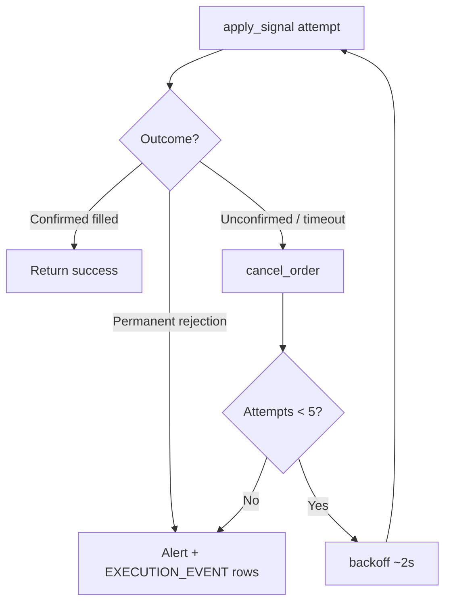

# Design: Live Order Execution — Fill Confirmation, Retry, Alerting

!!! info "Status"
    **Design — not yet implemented.** Golden-harness manual testing (`--apply-signal --confirm`)
    against Bybit testnet has validated order submission and surfaced two real bugs (fixed) plus
    two account-level blockers (resolved). The retry/alert orchestration described here
    (`quant/trade/live_apply.py`) does not exist yet.

**Related:** [Plan to Profit §1.7](plan-to-profit.md#phase-17--live-apply),
[Trade Deployment Rollout](trade-deployment-rollout.md),
[ccxt Trade & XREF Validation](ccxt-trade-and-xref-validation.md) (dry-run — out of scope there,
in scope here).

---

## Problem

Phase 1.7 needs to actually place orders, not just validate (dry-run, Phase 1.3). Live testnet
testing surfaced why "just call `create_order`" is not enough:

1. **ccxt's immediate response from `create_order` is not authoritative.** In our first live test,
   the response had `status=None` even though the order filled seconds later — Bybit's initial ack
   does not always carry terminal fill state.
2. **Bybit's position endpoint (`fetch_positions`) briefly lags a market fill.** Polling *position*
   as a proxy for "did the order fill" is unreliable and gives no failure signal if an order never
   fills.
3. **Orders can end up in a genuinely ambiguous state** (still `open`, `OrderNotFound` right after
   submission, network blip mid-poll) that must not block a caller (HTTP request or, later, a
   worker loop cycling through many deployments) indefinitely.
4. **Some order failures are permanent, others are transient** — retrying a permission error 5
   times wastes time; retrying a timeout/unconfirmed fill is exactly when retrying helps.

**Principle:** Confirm fills against the **order itself** (the authoritative source), not an
indirect signal like aggregate position. Bound every wait. Never silently drop a `vendor_order_id`,
even on failure — it is the only way to manually reconcile a stuck order later.

---

## Layering (mechanics vs policy)

Per repo convention: lower layers stay policy-agnostic; a single higher layer composes them.

| Layer | Module | Responsibility |
|-------|--------|-----------------|
| Mechanics — submit | `CcxtTradeGateway.create_market_order` | One market order, one ccxt call |
| Mechanics — confirm | `CcxtTradeGateway.fetch_order` (new) | Read one order's terminal status |
| Mechanics — cancel | `CcxtTradeGateway.cancel_order` | Cancel one order |
| Mechanics — submit+confirm | `CcxtTradeAdapter.place_order` | Submit **one** order, poll to a bounded terminal outcome, return `OrderResult` |
| Policy — retry/cancel/alert | `quant/trade/live_apply.py` (new) | Wrap one `apply_signal()` call in the retry/cancel/alert loop; persist `EXECUTION_EVENT`/`TRANSACTION` |
| Policy — notify | `quant/shared/notify.py` (new) | `Notifier` interface; `SlackNotifier` implementation |

`CcxtTradeAdapter.place_order` never retries — it submits once and confirms once (bounded). All
retry/cancel/alert decisions belong in `live_apply.py`, which is broker-agnostic (works the same
for ccxt or Futu adapters).

### Prerequisite: `TradeAdapter.cancel_order` signature fix

The ABC currently declares `cancel_order(self, vendor_order_id: str)` (one arg), but ccxt's
exchange API needs the symbol too — and the ccxt adapter already takes a second arg
`vendor_symbol: str | None = None`. The retry loop calls
`adapter.cancel_order(vendor_order_id, vendor_symbol)`, which would break if caller code is
typed against the ABC. **Before implementation:** update `TradeAdapter.cancel_order` to
`cancel_order(self, vendor_order_id: str, vendor_symbol: str | None = None)` and update
Futu's override to accept and ignore the extra arg.

---

## Fill confirmation (mechanics layer)

### Poll `fetch_order`, not position

```python
# CcxtTradeGateway (new)
def fetch_order(self, vendor_order_id: str, vendor_symbol: str) -> dict:
    # Bybit via ccxt requires params={"acknowledged": True} or raises:
    # "fetchOrder() can only access an order if it is in last 500 orders..."
    return self.exchange.fetch_order(vendor_order_id, vendor_symbol, params={"acknowledged": True})
```

### Bounded backoff

Total budget **~8-10s**, not indefinite — a synchronous broker call must never hang a caller.

| Attempt | Delay before poll |
|---------|--------------------|
| 1 | 0.3s |
| 2 | 0.6s |
| 3 | 1.2s |
| 4 | 2.4s |
| 5 | 3.5s |

`OrderNotFound` on the first 1-2 polls is **not** a failure — Bybit's own indexing can lag a few
hundred ms after `create_order` returns. Treat it as non-terminal and keep polling within budget.
A transient network/rate-limit error on the `fetch_order` call itself should also retry within the
same budget, not abort immediately.

### Terminal outcomes

| Outcome | Condition | `OrderResult` |
|---------|-----------|-----------------|
| **Confirmed filled** | `status='closed'`, or `status` ∈ `{canceled, expired}` with `filled > 0` (Bybit market orders behave IOC — a partial-then-auto-canceled remainder is still a real, terminal fill) | `success=True`; `filled_qty`, `avg_price`, `fee` populated from the order |
| **Confirmed rejected** | `status='rejected'`, or `filled=0` and `canceled`/`expired` | `success=False`; clear rejection message |
| **Unconfirmed (timeout)** | still `open` / `None` / `OrderNotFound` after the full backoff budget | `success=False`; message tagged distinctly, e.g. `"fill unconfirmed after 8s — vendor_order_id=X requires manual reconciliation"` |

`vendor_order_id` is always populated in the result if `create_order` returned an id — regardless
of which of the three outcomes above applies. This is the one piece of data that must never be
lost, since it is what lets a human look the order up on the exchange later.

### `OrderResult` extension (needed for `TRADE.TRANSACTION`)

```python
@dataclass(frozen=True)
class OrderResult:
    success: bool
    vendor_order_id: str | None
    message: str
    raw_status: str | None = None
    filled_qty: float | None = None   # new
    avg_price: float | None = None    # new
    fee: float | None = None          # new
```

Pulled from the confirmed `fetch_order` response's `filled` / `average` / `fee` fields — this is
exactly the data `TRADE.TRANSACTION.QUANTITY` / `PRICE` / `FEE_AMT` need (see
[Data model tie-in](#data-model-tie-in) below). Confirming the fill and capturing transaction
economics is the same call — no separate mechanism needed.

!!! warning "ccxt `fee` is a dict, not a float"
    ccxt's unified order structure returns `fee` as `{"cost": 0.05, "currency": "USDT"}`, not
    a bare float. The implementation must extract `order["fee"]["cost"]` (with a `None` guard)
    when populating `OrderResult.fee`.

---

## Retry & cancel policy (`live_apply.py`)

Wraps a single `adapter.apply_signal(...)` attempt in a bounded retry loop. **Not all failures earn
the same number of retries:**

| Error class | Examples (from real testnet testing) | Retry budget |
|-------------|----------------------------------------|--------------|
| **Permanent / non-retryable** | `10005 permission denied` (API key missing trade permission), `10024 regulatory/KYC block`, invalid symbol, invalid order params | **1 attempt** — fail fast, then alert immediately. Identical retries will fail identically and just burn ~10s × N and rate-limit budget for nothing. |
| **Retryable** | Unconfirmed/timeout fills, transient network errors, rate limits | **Up to 5 attempts** |

### Loop (retryable path)

1. **Recompute live position + intended action fresh on every attempt** — do not reuse stale
   numbers across retries. If a prior attempt partially filled, the qty needed on retry has
   changed. This is inherently handled by calling `adapter.apply_signal(...)` (not raw
   `place_order`) which re-reads position and re-derives the intended action internally on
   each invocation.
2. Call `adapter.apply_signal(...)` (single-attempt, bounded per the confirmation policy above).
3. **Confirmed success** → stop, return success.
4. **Confirmed permanent rejection** → stop after 1 attempt, go to alert.
5. **Unconfirmed (timeout)** → `adapter.cancel_order(vendor_order_id, vendor_symbol)` first (a
   stuck/resting order must not be left to fill later while we've moved on — that would create an
   untracked, unexpected position change), short backoff (~2s), then retry.
6. After the attempt budget is exhausted without a confirmed fill → **alert** (see below) and
   still write one `TRADE.EXECUTION_EVENT` row per attempt (`is_success_ind='N'`) so there is a full
   DB audit trail even if the alert channel itself is down.

!!! note "Why the loop calls `apply_signal`, not `place_order`"
    A cancel-before-retry can race the fill — the exchange may ack the cancel but the fill
    arrived first. If so, the live position on the next iteration has shifted (e.g. we went
    from flat to partially long). Calling `apply_signal` (which includes a fresh position
    read + `intended_side` derivation) instead of replaying the same `OrderRequest` naturally
    adapts the next order's side and qty to whatever position state actually exists.

Worst case for the retryable path: **5 attempts × ~10s ≈ 50s** before alerting. Acceptable for a
synchronous per-deployment apply call today; revisit if/when this runs inside a scheduled worker
looping over many deployments (Phase 2, per
[Trade Deployment Rollout §Worker](trade-deployment-rollout.md#worker-minimal-for-m1)) — may want a
tighter cap (e.g. 3 attempts, ~30s) there so one stuck deployment cannot starve the batch.



---

## Alerting

### Relation to the existing Telegram decision

[Plan to Profit §5.6](plan-to-profit.md#56-review-outcomes-2026-06-20) already
established: *"Keep Telegram in 2.4 as the first target; implement a notifier interface so Slack
can be added without rewiring trade logic."* That decision is about **user-facing** alerts (a
per-user Telegram chat id, notified on their own deployment's apply failures) — Phase 2.4, not
built yet.

The alert described here is a **different audience**: an **internal/ops** signal that a live order
is stuck in an unconfirmed state after exhausting retries and needs manual reconciliation against
the exchange. It is not per-user and does not wait for Phase 2.4.

**Resolution:** build the notifier interface now, starting with Slack (the immediate need) instead
of Telegram (the original 2.4 target) — satisfies the existing decision's intent ("notifier
interface so Slack can be added without rewiring trade logic") while unblocking today's need. When
Phase 2.4 lands, `TelegramNotifier` implements the same interface for the user-facing case.

```python
# quant/shared/notify.py (new)
class Notifier(Protocol):
    def send(self, message: str) -> None: ...

class SlackNotifier:
    """Best-effort — a notification failure must never crash the trading pipeline."""
    def __init__(self, webhook_url: str) -> None: ...
    def send(self, message: str) -> None:
        try:
            requests.post(self._webhook_url, json={"text": message}, timeout=5)
        except Exception:
            logger.warning("Slack alert failed to send", exc_info=True)
```

Env: `SLACK_WEBHOOK_URL` in `.env` (not committed — same convention as other secrets). If unset,
`live_apply.py` logs the alert at `ERROR` level instead of raising — an alerting misconfiguration
must never block order handling or crash the caller.

**When to point the webhook at a prod ops channel vs test-env:** [Live Trading Promotion](../guides/live-trading-promotion.md#4-slack-test-channel--production-ops).

### Alert content

Deployment id, strategy id/vid, symbol, signal, side + qty attempted, every `vendor_order_id`
attempted (even unconfirmed ones), the last error message, and a timestamp — enough for a human to
go straight to the exchange UI and reconcile without digging through logs first.

---

## Data model tie-in

Already fully modeled — see [`db/liquidbase/trade/tables/EXECUTION_EVENT.sql`](../../db/liquidbase/trade/tables/EXECUTION_EVENT.sql)
and [`TRANSACTION.sql`](../../db/liquidbase/trade/tables/TRANSACTION.sql), with Python wrappers
already on `TradeRepo` (`sp_ins_execution_event`, `sp_ins_transaction`). Nothing currently calls
them — that wiring is exactly what `live_apply.py` adds.

| Table | Written when | Key fields |
|-------|--------------|------------|
| `TRADE.EXECUTION_EVENT` | **Every** attempt (success, permanent rejection, or unconfirmed timeout) | `SIGNAL_VALUE`, `BUY_SELL_CD`, `QUANTITY` (requested), `VENDOR_ORDER_ID`, `IS_SUCCESS_IND` |
| `TRADE.TRANSACTION` | **Only** on a confirmed fill | `QUANTITY` (filled), `PRICE` (avg fill), `NOTIONAL_AMT`, `FEE_AMT`, `VENDOR_ORDER_ID`, `TRANS_CCY_CD` |

### Known gaps in the current schema

**`EXECUTION_EVENT` has no error message column.** When `IS_SUCCESS_IND='N'`, the *reason*
(e.g. `10005 permission denied`) is not stored — only the fact of failure plus the
`VENDOR_ORDER_ID` (if any). Error details are recoverable from application logs but not from
the DB alone. A future `MESSAGE TEXT` nullable column could close this gap; not blocking for M1
since the Slack alert captures the message in real time.

**`EXECUTION_EVENT` has no `INTENDED_SIDE` column.** The table stores `BUY_SELL_CD` (the raw
exchange order side — `BUY` or `SELL`) but not the richer 5-way action
(`BUY`/`SELL`/`HOLD`/`OPEN_SHORT`/`CLOSE_SHORT`). This is intentional: `HOLD` means no order
was attempted, so no event row is written. For the other four, the combination of `BUY_SELL_CD`
+ `SIGNAL_VALUE` + the position at the time is sufficient to reconstruct the action. A
dedicated column may be useful for simpler UI queries later but is not required.

**`TRANSACTION` requires `TRANS_CCY_CD TEXT NOT NULL`.** This column is not optional — for
USDT perpetuals it will always be `"USDT"`. The implementation must populate it from the
deployment's exchange context (e.g. derived from `INTERNAL_CUSIP` suffix or the exchange
preset's settlement currency). This should be resolved during `live_apply.py` implementation.

---

## Testing status (golden harness, Bybit testnet)

Manual lifecycle test via `scripts/bybit_local_testnet.py --apply-signal {signal} --confirm`,
human-verified against `testnet.bybit.com` after each step (see
[Plan to Profit §1.7](plan-to-profit.md#phase-17--live-apply) for the running log).

| Step | Result |
|------|--------|
| Account funding check | Found `usdt_nav=None` — UNIFIED account had `totalEquity=0`. Resolved by user funding via testnet faucet. |
| BUY (signal=+1, flat→long) | First 2 attempts failed on account-level blockers, not code: `10005 permission denied` (API key lacked trade permission — fixed via Bybit key settings) then `10024` regulatory/KYC risk-disclosure gate (fixed by accepting the one-time disclosure via Bybit's UI). Third attempt: **filled** — confirmed directly via raw `fetch_positions` (`size=0.001`, `side=Buy`, `entryPrice=62788`). |
| Bug found: `fetch_position_qty` symbol mismatch | Gateway compared `pos.get("symbol")` (ccxt unified, e.g. `BTC/USDT:USDT`) against `vendor_symbol` (raw exchange symbol, e.g. `BTCUSDT`) — always fell through to `0.0`. Masked previously because no test had an open position. **Fixed** — now checks unified symbol, raw symbol, and `info.symbol`. 3 regression tests added. |
| HOLD (signal=+1, already long) | Confirmed — no order sent, position unchanged. |
| SELL (signal=0, long→flat) | **Filled** — `position_before=0.001 → action=SELL qty=0.001`, `position_after=0.0`. |
| HOLD (signal=0, already flat) | Confirmed — no order sent. |
| OPEN_SHORT (signal=-1, flat→short) | **Filled** — `position_after=-0.001`; cross-checked directly against raw `fetch_positions`: `side=Sell, size=0.001, avgPrice=62766.6`. |
| CLOSE_SHORT (signal=0, short→flat) | **Filled** — `position_before=-0.001 → action=CLOSE_SHORT qty=0.001`, `position_after=0.0`. |
| Final suite re-run | `--suite`: **12 passed, 0 failed, 1 skipped**. Account flat (`position_qty=0.0`), `usdt_nav=4999.88` (down ~$0.12 from the initial 5000 USDT — consistent with trading fees across 4 real fills). |

**All 6 lifecycle actions (`BUY`, `HOLD`×2, `SELL`, `OPEN_SHORT`, `CLOSE_SHORT`) have now been
exercised and human-verified against live Bybit testnet.** Live order submission mechanics
(`create_market_order` → `place_order` → `apply_signal`) are proven correct; the fire-and-forget
confirmation (immediate response + harness-level position poll) worked for all 4 real fills in
this test run, but the poll-to-confirm-via-`fetch_order` design above is still needed for
production robustness (a fire-and-forget approach has no way to distinguish "still processing"
from "rejected" if position doesn't change as expected).

Unit suite: `tests/unit/test_bybit_adapter.py` (34 tests, includes new `place_order`/`apply_signal`/
`fetch_position_qty` coverage) + `test_trade*.py` (72 tests) — all green as of this design's
authoring.

---

## Open items (not yet implemented)

**Prerequisite fixes:**

- [x] Update `TradeAdapter.cancel_order` ABC signature to `(self, vendor_order_id: str, vendor_symbol: str | None = None)` — done; `FutuTrader` is standalone (not a `TradeAdapter` subclass), so no override needed
- [ ] Resolve `TRANS_CCY_CD` population strategy for `TRADE.TRANSACTION` (hardcode `"USDT"` per preset, or derive from cusip/exchange config)

**Core implementation:**

- [ ] `CcxtTradeGateway.fetch_order` (poll-to-confirm mechanics, Bybit `acknowledged=True` param)
- [ ] Extend `OrderResult` with `filled_qty` / `avg_price` / `fee` (extract `fee["cost"]` from ccxt's dict structure)
- [ ] `CcxtTradeAdapter.place_order` — replace fire-and-forget with bounded poll-to-confirm
- [ ] `quant/trade/live_apply.py` — retry/cancel policy loop + `EXECUTION_EVENT`/`TRANSACTION` writes
- [ ] `quant/shared/notify.py` — `Notifier` interface + `SlackNotifier`
- [ ] `SLACK_WEBHOOK_URL` in `.env.example`

**Testing:**

- [ ] Unit tests: retry loop (permanent vs retryable branching, attempt cap, cancel-before-retry), `Notifier`/`SlackNotifier`
- [x] Complete manual lifecycle test on testnet: BUY, HOLD, SELL, HOLD, OPEN_SHORT, CLOSE_SHORT — all 6 confirmed, see [Testing status](#testing-status-golden-harness-bybit-testnet)

**Deferred:**

- [ ] Slack notifier (`quant/shared/notify.py`, `SlackNotifier`, `SLACK_WEBHOOK_URL`) — explicitly deferred; user will provide further detail before implementation
- [ ] Decide worker-context retry budget (Phase 2) — likely tighter than the synchronous-apply budget above
- [ ] Optional: add `MESSAGE TEXT` column to `EXECUTION_EVENT` for DB-queryable error diagnostics

---

## Related docs

- [Plan to Profit §1.7](plan-to-profit.md#phase-17--live-apply) — phase tracking, exit criteria
- [Trade Deployment Rollout](trade-deployment-rollout.md) — Phase 1.6-1.8 rollout plan, worker options
- [ccxt Trade & XREF Validation](ccxt-trade-and-xref-validation.md) — dry-run design (Phase 1.3); explicitly out-of-scopes live order placement to this doc
- [Trade API](trade-api.md) — full API + schema reference
