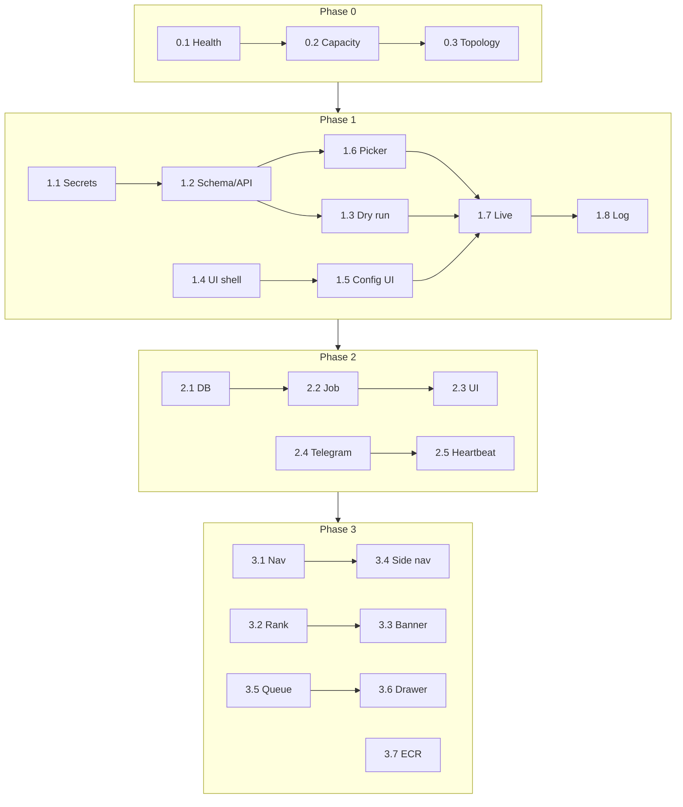
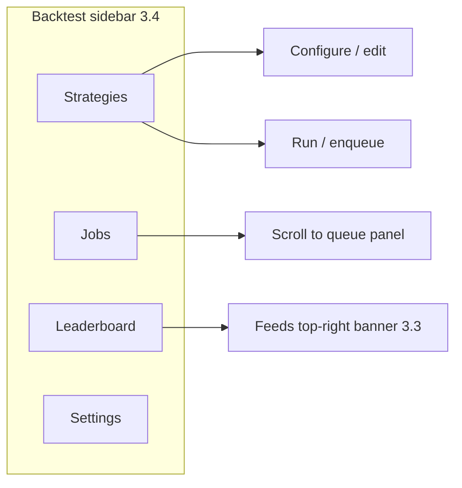
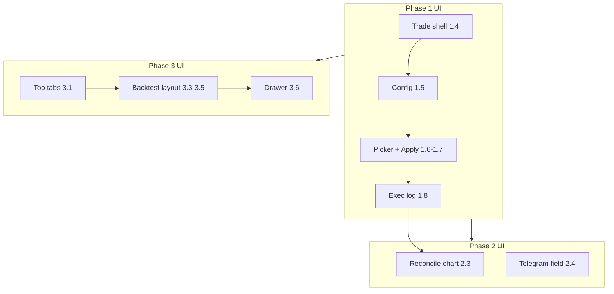

# Plan to Profit

!!! info "Status"
    **Planning — derived from product notes.** This document turns informal goals into a phased roadmap. It does not replace detailed design docs; it links to them and records open decisions.

**Source notes:** `../notes/plan_to_profit.md` (workspace sibling)

**North star:** Run the current best backtested strategy live on Bybit (Bollinger-band price signal), prove profitability with daily Sharpe reconciliation, and grow the React SPA into a two-tab product (**Backtest** | **Trade**).

---

## 1. Current Strategy & Confidence

| Item | Detail |
|------|--------|
| **Live candidate** | Bybit execution, Bollinger band on **price** |
| **Backtest Sharpe** | ~1.22 (historical) |
| **Expected live Sharpe** | ~1.08 (haircut vs backtest) |
| **Risk** | Sharpe may degrade over time — must monitor, not assume static edge |
| **Why it matters** | This is the **Phase 0** anchor: keep the strategy running while the profit pipeline is built around it |

**Immediate engineering implication:** Phase 1 deliverables should not block on perfect UI; they should unblock **deploy → execute → log → reconcile**.

---

## 2. Phased Roadmap

Work **one subphase at a time** — finish exit criteria before starting the next. Update the status column as you go (`—` → `in progress` → `done`).

### Progress tracker

| Subphase | Title | Status |
|----------|-------|--------|
| [0.1](#phase-01--strategy-health) | Strategy health | done |
| [0.2](#phase-02--host-capacity) | Host capacity | done |
| [0.3](#phase-03--deploy-topology-decision) | Deploy topology decision | done |
| [1.1](#phase-11--user-secrets) | User secrets | — |
| [1.2](#phase-12--trade-schema--apply-api) | Trade schema + apply API | — |
| [1.3](#phase-13--bybit-adapter-dry-run) | Bybit adapter (dry run) | — |
| [1.4](#phase-14--trade-ui-shell) | Trade UI shell | — |
| [1.5](#phase-15--exchange-config-ui) | Exchange config UI | — |
| [1.6](#phase-16--strategy-picker) | Strategy picker | — |
| [1.7](#phase-17--live-apply) | Live apply | — |
| [1.8](#phase-18--execution-log) | Execution log | — |
| [2.1](#phase-21--reconcile-data-model) | Reconcile data model | — |
| [2.2](#phase-22--daily-sharpe-job) | Daily Sharpe job | — |
| [2.3](#phase-23--reconcile-ui) | Reconcile UI | — |
| [2.4](#phase-24--telegram-error-alerts) | Telegram error alerts | — |
| [2.5](#phase-25--silent-failure-detection) | Silent failure detection | — |
| [3.1](#phase-31--top-nav--trade-tab) | Top nav + Trade tab | — |
| [3.2](#phase-32--strategy-ranking-backend) | Strategy ranking backend | — |
| [3.3](#phase-33--best-strategy-banner) | Best strategy banner | — |
| [3.4](#phase-34--backtest-side-nav) | Backtest side nav | — |
| [3.5](#phase-35--compact-queue-table) | Compact queue table | — |
| [3.6](#phase-36--job--strategy-detail-drawer) | Job / strategy detail drawer | — |
| [3.7](#phase-37--trade-host--ecr-optional) | Trade host / ECR (optional) | — |



---

### Phase 0 — Operational baseline

**Phase goal:** Confirm the live edge still exists and the host plan won’t break when TRADE containers/jobs land.

#### Phase 0.1 — Strategy health

| | |
|---|---|
| **Depends on** | — |
| **Blocks** | 1.6, 1.7 (confidence in strategy id) |

**Scope:** Research sign-off only — **not** production trade tracking. Use existing backtest tooling (`python -m quant.cli --walk-forward`); do **not** build rolling-Sharpe scripts against historical bars for go/no-go.

**Tasks**

- [x] Run walk-forward on the live candidate (e.g. `btcusdt.crypto`, Bollinger / momentum) via CLI or queued optimize + WF.
- [x] Record OOS Sharpe, overfitting ratio, and chosen `window` / `signal` in a ticket or [decisions log](../decisions.md).
- [x] Agree go / no-go / watch for promoting that `strategy_id` into the Trade picker.

**Exit criteria:** Written note with walk-forward OOS metrics; live candidate `strategy_id` confirmed for Phase 1.6 / 1.7.

**Result (2026-05-20):** **WATCH** — `bollinger_momentum_60_1.75` on `btcusdt.crypto`. Full Sharpe 1.19; OOS (30%) 0.42; WF OOS negative. Dry-run/paper OK; defer live apply. See [phase-0.1-signoff.md](phase-0.1-signoff.md) and decision #33.

---

#### Phase 0.2 — Host capacity

| | |
|---|---|
| **Depends on** | — (can run parallel with 0.1) |
| **Blocks** | 1.7, 3.7 |

**Tasks**

- [x] Capture current EC2 CPU/mem with API + worker + Redis (and any manual Bybit process).
- [x] Estimate headroom for +1 Docker service (trade worker or reconcile cron).
- [x] List which processes must move off the box first if headroom is tight.

**Exit criteria:** One-page capacity snapshot with “safe to add container Y/N” and rough CPU/mem budget.

**Result (2026-05-20):** t4g.small (2 GiB) — **NO** for +1 trade worker without upgrade; **YES** for daily reconcile cron. Recommend **t4g.medium** or separate TRADE host before Phase 1.7. See [phase-0.2-capacity.md](phase-0.2-capacity.md); live metrics: `bash aws/scripts/capacity_snapshot.sh` on EC2.

---

#### Phase 0.3 — Deploy topology decision

| | |
|---|---|
| **Depends on** | 0.2 |
| **Blocks** | 3.7 (execution only) |

**Tasks**

- [x] Decide timing: TRADE on same EC2 vs separate host vs ECR image.
- [x] Decide whether daily Sharpe job shares host with trade executor.
- [x] Log decision in [Decisions log](../decisions.md) (see [open decision #4](#8-open-decisions)).

**Exit criteria:** Recorded decision — no need to implement ECR yet unless chosen “now.”

**Result (2026-05-20):** **Same EC2** for Phase 1 TRADE + Phase 2 reconcile after **t4g.medium** upgrade. **ECR pull deploy adopted now** (before Phase 1 app work). Separate TRADE host only if needed in Phase 3.7. See [phase-0.3-topology.md](phase-0.3-topology.md) and decision #35.

---

### Phase 1 — Fastest profit pipeline

**Phase goal:** Closed loop — configure credentials → pick backtested strategy → dry-run → live apply → see executions in UI.  
**Out of scope until Phase 3:** strategy JSON popup, full optimization browser, enlarged queue, best-strategy banner.

#### Phase 1.1 — User secrets

| | |
|---|---|
| **Depends on** | Auth (`CORE_ADMIN`) |
| **Blocks** | 1.5, 1.7 |

**Tasks**

- [ ] DDL: per-user exchange credential storage (encrypt at rest; scoped by `USER_ID`).
- [ ] Stored procedures: insert / rotate / revoke (no raw DML).
- [ ] API: read masked config, write credentials (never return full secret in logs).
- [ ] Security review: no secrets in `.env` for multi-user prod paths.

**Exit criteria:** Can save and load Bybit API key for a test user via API only (UI optional in this subphase).

---

#### Phase 1.2 — Trade schema + apply API

| | |
|---|---|
| **Depends on** | — |
| **Blocks** | 1.3, 1.6, 1.7, 1.8, 2.1 |

**Tasks**

- [ ] DDL: `TRADE.DEPLOYMENT`, `TRADE.LOG` (per [Trade API](trade-api.md)).
- [ ] SP: create deployment linked to `BT.STRATEGY` id.
- [ ] API: `POST` apply / `GET` deployment status (skeleton OK without exchange call).

**Exit criteria:** Deployment row persists with `strategy_id` FK; status endpoint returns stored state.

---

#### Phase 1.3 — Bybit adapter (dry run)

| | |
|---|---|
| **Depends on** | 1.1, 1.2 |
| **Blocks** | 1.7 |

**Tasks**

- [ ] Implement `BybitAdapter` (or extend `quant/trade/`) with dry-run path.
- [ ] Validate credentials, `INST.PRODUCT_XREF` symbol mapping, sizing — no live orders.
- [ ] Return structured dry-run report (signals, intended side, errors).

**Exit criteria:** Dry-run API succeeds for test user against Bybit testnet or read-only validation path.

---

#### Phase 1.4 — Trade UI shell

| | |
|---|---|
| **Depends on** | React router |
| **Blocks** | 1.5, 1.6, 1.8, 3.1 |

**Tasks**

- [ ] Add **Trade** route (tab or path) with layout: sidebar + main + bottom-right panel placeholder.
- [ ] Sidebar nav entries: **Config** | **Trade** (pages can be stubs).
- [ ] Auth-gate same as Backtest.

**Exit criteria:** Logged-in user navigates to Trade layout; sidebar switches between stub pages.

---

#### Phase 1.5 — Exchange config UI

| | |
|---|---|
| **Depends on** | 1.1, 1.4 |
| **Blocks** | 1.7 |

**Tasks**

- [ ] Config page: exchange label, API key/secret, trade defaults (size, paper/live flag).
- [ ] Wire to secrets API from 1.1.
- [ ] Top-left exchange selector (user-named default).

**Exit criteria:** User saves Bybit config in UI and reload sees persisted settings (secrets masked).

---

#### Phase 1.6 — Strategy picker

| | |
|---|---|
| **Depends on** | 1.2, 1.4, 0.1 (recommended) |
| **Blocks** | 1.7 |

**Tasks**

- [ ] API: list user’s backtested strategies (id + name + minimal stats).
- [ ] Trade page: selectable list/table; no JSON drill-down required.
- [ ] Selecting row sets active `strategy_id` for apply.

**Exit criteria:** User picks a strategy by name/id in UI; selection passed to apply payload.

---

#### Phase 1.7 — Live apply

| | |
|---|---|
| **Depends on** | 1.2, 1.3, 1.5, 1.6 |
| **Blocks** | 1.8, 2.x |

**Tasks**

- [ ] UI: Dry-run button → show report; Apply button → confirm live.
- [ ] Backend: apply uses BT strategy config + deployment record + Bybit live path.
- [ ] Error responses surfaced in UI (Telegram deferred to 2.4).

**Exit criteria:** **M1 — Pipeline** met: one real (or testnet) live apply completes end-to-end for Bollinger strategy.

---

#### Phase 1.8 — Execution log

| | |
|---|---|
| **Depends on** | 1.2, 1.7, 1.4 |
| **Blocks** | 2.2 (live PnL inputs) |

**Tasks**

- [ ] SP: append execution rows to `TRADE.LOG` on each order/fill event.
- [ ] API: paginated transaction history per deployment.
- [ ] UI: bottom-right panel lists recent executions with refresh.

**Exit criteria:** After 1.7 apply, user sees at least one row in transaction history without DB access.

---

### Phase 2 — Prove profitability

**Phase goal:** Trust but verify — daily Sharpe vs backtest, loud failures, quiet success. Reconcile frequency can drop after stabilization.

#### Phase 2.1 — Reconcile data model

| | |
|---|---|
| **Depends on** | 1.2, 1.8 |
| **Blocks** | 2.2, 2.3 |

**Tasks**

- [ ] Design table(s) for daily deployment snapshots (live Sharpe, cumulative return, vs backtest expectation).
- [ ] Avoid full scan of `TRADE.LOG` / `BT.RESULT` each run — aggregate on write or nightly rollup.
- [ ] SP: insert daily snapshot; SP/GET: series for chart.

**Exit criteria:** Schema + procedures merged; manual insert of one test snapshot succeeds.

---

#### Phase 2.2 — Daily Sharpe job

| | |
|---|---|
| **Depends on** | 2.1, 1.8 |
| **Blocks** | 2.3 |

**Tasks**

- [ ] Scheduled job (cron / worker) runs once per day per active deployment.
- [ ] Computes live metrics vs stored backtest benchmark for same strategy.
- [ ] Idempotent per `(deployment_id, trade_date)`.

**Exit criteria:** Job runs manually twice; second run updates or no-ops without duplicate bad rows.

---

#### Phase 2.3 — Reconcile UI

| | |
|---|---|
| **Depends on** | 2.2, 1.4 |
| **Blocks** | — |

**Tasks**

- [ ] Trade page top-right: chart or summary of Sharpe / drift vs backtest.
- [ ] Show last reconcile timestamp and stale warning if &gt; 36h old.
- [ ] *(Nice-to-have)* Calendar-year live Sharpe table (Year | Sharpe | return) from reconcile snapshots — production tracking only, not backtest.

**Exit criteria:** User opens Trade and sees at least 7 days of reconcile data (or explicit “insufficient data”).

---

#### Phase 2.4 — Telegram error alerts

| | |
|---|---|
| **Depends on** | 1.7 |
| **Blocks** | 2.5 (optional coupling) |

**Tasks**

- [ ] User preference: Telegram chat id (Config or profile).
- [ ] Notify on apply failure, adapter errors, kill-switch trips — not on success heartbeats.
- [ ] Rate-limit duplicate alerts.

**Exit criteria:** Forced test error delivers one Telegram message; healthy apply sends none.

---

#### Phase 2.5 — Silent failure detection

| | |
|---|---|
| **Depends on** | 1.7, 2.4 (recommended) |
| **Blocks** | — |

**Tasks**

- [ ] Heartbeat or last-seen timestamp on deployment / worker.
- [ ] Alert if no heartbeat in N hours while deployment status = RUNNING.
- [ ] Document runbook: EC2 down, exchange disconnect, stuck process (see [open decision #5](#8-open-decisions)).

**Exit criteria:** **M2 — Proof** met: simulated missed heartbeat triggers Telegram; 24h healthy run triggers none.

---

### Phase 3 — Full product UX

**Phase goal:** Research and operations in one app — ranked strategies, structured backtest nav, rich queue UX. Can overlap Phase 2 subphases once M1 is done.

#### Phase 3.1 — Top nav + Trade tab

| | |
|---|---|
| **Depends on** | 1.4 |
| **Blocks** | 3.4 |

**Tasks**

- [ ] Top navigation: **Backtest** | **Trade** tabs.
- [ ] Route each tab to its own layout shell with side nav slot.

**Exit criteria:** Tab switch preserves auth; URLs deep-link (`/backtest`, `/trade`).

---

#### Phase 3.2 — Strategy ranking backend

| | |
|---|---|
| **Depends on** | [§3 Prerequisites](#3-prerequisites-data-model--ranking) |
| **Blocks** | 3.3 |

**Tasks**

- [ ] Add/queryable strategy summary columns (Sharpe, overfitting ratio, etc.).
- [ ] Background job writes rank cache (not computed on every page load).
- [ ] Define ranking formula and tie-break rules.

**Exit criteria:** `GET` rank endpoint returns ordered list from cache with `cached_at` timestamp.

---

#### Phase 3.3 — Best strategy banner

| | |
|---|---|
| **Depends on** | 3.2, 3.1 |
| **Blocks** | — |

**Tasks**

- [ ] Backtest page top-right: show #1 ranked strategy (name + key metrics).
- [ ] Link to strategy detail when 3.6 exists; stub until then.

**Exit criteria:** Banner matches rank API #1; updates after cache refresh job.

---

#### Phase 3.4 — Backtest side nav

| | |
|---|---|
| **Depends on** | 3.1, [side nav decision](#8-open-decisions) |
| **Blocks** | — |

**Tasks**

- [ ] Implement chosen taxonomy (recommended: **B — Object**: Strategies · Jobs · Leaderboard · Settings).
- [ ] Move **Configure** entry off center of monolithic backtest page into nav or sub-route.

**Exit criteria:** All backtest flows reachable via side nav without scrolling past unrelated sections.

---

#### Phase 3.5 — Compact queue table

| | |
|---|---|
| **Depends on** | Existing jobs API |
| **Blocks** | 3.6 |

**Tasks**

- [ ] Bottom-right (or Jobs section): compact table — `STRATEGY_NM`, status, View / Cancel / Re-enqueue.
- [ ] **Enlarge** opens full-width modal or route with same data + more columns.
- [ ] QUEUED jobs: status only, no partial optimization preview.

**Exit criteria:** User can cancel and re-enqueue from compact table; enlarge shows full queue view.

---

#### Phase 3.6 — Job / strategy detail drawer

| | |
|---|---|
| **Depends on** | 3.5, [Jobs Table Detail UX](jobs-table-detail-ux.md) |
| **Blocks** | — |

**Tasks**

- [ ] View action opens drawer: left = strategy JSON summary, right = optimization summary (not full equity curve unless stored).
- [ ] Deep-link `?job=<queue_id>`.
- [ ] Trade tab can link here for optional drill-down (nice-to-have).

**Exit criteria:** Shared drawer works from queue and from strategy banner link; `?job=` loads correct row.

---

#### Phase 3.7 — Trade host / ECR (optional)

| | |
|---|---|
| **Depends on** | 0.3, 1.7 stable |
| **Blocks** | — |

**Tasks**

- [ ] If 0.3 chose separate host: build/push TRADE image to ECR, deploy trade worker.
- [ ] If same host: document why and set revisit trigger (CPU &gt; X%).

**Exit criteria:** **M3 — Product** met when 3.1–3.6 done; 3.7 done only if topology decision requires it.

Align with [Backtest Queue](backtest-queue.md), [Deploy Build Pipeline](deploy-build-pipeline.md).

---

## 3. Prerequisites (data model & ranking)

Before the “best strategy” banner and one-liner strategy rows work at DB scale:

| Prerequisite | Purpose |
|--------------|---------|
| **Strategy summary columns** | Expose Sharpe, overfitting ratio, etc. as queryable columns (not only inside JSON blobs) for list views and ranking |
| **Ranking job** | Background process computes leaderboard; **cache** before UI reads |
| **Result retention policy** | Decide what optimization artifacts are stored vs recomputed (equity curve, full grid, etc.) |

**Retention principle (from notes):**

- Persist **immediately** when user **applies strategy to trade**.
- Other heavy artifacts: store only if needed for UX/cost tradeoff; otherwise require rerun.
- While job is **QUEUED**: show queue status only — no partial optimization UI.

---

## 4. Frontend shell

Wireframes, zone maps, and rollout-by-subphase: **[§4.0 UI visualization](#40-ui-visualization)**.

### 4.0 UI visualization

Layouts below use a **12-column grid** mental model. Subphase tags show when each region first ships.

#### App shell (Phase 3.1 — top nav)

```
┌──────────────────────────────────────────────────────────────────────────────┐
│  Quant Strategies          [ Backtest ]  [ Trade ]              user ▾  ⎋   │  ← 3.1
├──────────────────────────────────────────────────────────────────────────────┤
│                                                                              │
│                         (active tab content — see below)                     │
│                                                                              │
└──────────────────────────────────────────────────────────────────────────────┘
```

| Route | Tab | Notes |
|-------|-----|--------|
| `/backtest` | Backtest | Default after login today; gains side nav in 3.4 |
| `/trade` | Trade | Shell in **1.4**; full layout by **1.8** |

---

#### Phase 1 MVP — Trade tab only (subphases 1.4 – 1.8)

No top-level Backtest \| Trade split yet; Trade may live at `/trade` beside existing `/` backtest page.

```
┌──────────────────────────────────────────────────────────────────────────────┐
│  (existing app header / backtest link)                                       │
├──────────┬───────────────────────────────────────────────────────────────────┤
│ SIDE     │  Exchange: [ My Bybit ▾ ]                          (1.5)       │  ← top-left
│ 1.4      ├───────────────────────────────────────────────────────────────────┤
│          │                                                                   │
│ ● Config │   STRATEGY PICKER (1.6)                                           │
│ ○ Trade  │   ┌─────────────────────────────────────────────────────────┐    │
│          │   │ ○ bollinger_momentum_20_1.0    Sharpe 1.22              │    │
│          │   │ ● rsi_reversion_14_30          Sharpe 0.98              │    │
│          │   └─────────────────────────────────────────────────────────┘    │
│          │                                                                   │
│          │   [ Dry run ]    [ Apply live ]                    (1.7)        │
│          │   ┌ dry-run report / errors ────────────────────────────────┐    │
│          │   │ signals OK · size 0.01 BTC · mapped btc-usd.crypto      │    │
│          │   └─────────────────────────────────────────────────────────┘    │
│          ├───────────────────────────────────────────────────────────────────┤
│          │  EXECUTION LOG (1.8) — bottom panel                             │
│          │  ┌────────┬──────────┬────────┬─────────┐                        │
│          │  │ Time   │ Side     │ Qty    │ Status  │                        │
│          │  ├────────┼──────────┼────────┼─────────┤                        │
│          │  │ 10:01  │ BUY      │ 0.01   │ FILLED  │                        │
│          │  └────────┴──────────┴────────┴─────────┘                        │
└──────────┴───────────────────────────────────────────────────────────────────┘

Config page (sidebar ● Config):
┌────────────────────────────────────────┐
│ Exchange label    [ My Bybit      ]    │
│ API key           [ •••••••••••• ]    │  (1.1 / 1.5)
│ API secret        [ •••••••••••• ]    │
│ Default size      [ 0.01          ]    │
│ Telegram chat id  [ (Phase 2.4)  ]    │
│              [ Save ]                  │
└────────────────────────────────────────┘
```

---

#### Phase 3 target — Backtest tab (3.1 – 3.6)

```
┌──────────────────────────────────────────────────────────────────────────────┐
│  Quant Strategies          [ Backtest*]  [ Trade ]              user ▾       │
├──────────┬───────────────────────────────────────────────────────────────────┤
│ SIDE     │                    BEST STRATEGY (3.3)                            │
│ 3.4      │         ★ bollinger_momentum_20_1.0 · Sharpe 1.22 · [details]   │
│          ├─────────────────────────────────────────────┬─────────────────────┤
│ Strategies│  MAIN — Configure / Run / Charts           │ QUEUE compact (3.5)│
│ Jobs     │  (today’s backtest UI; Configure in nav)   │ ┌──────┬────┬─────┐ │
│ Leaderboard│                                            │ │ Name │ St │ Act │ │
│ Settings │                                              │ ├──────┼────┼─────┤ │
│          │                                              │ │ bol… │ RUN│ ⋮   │ │
│          │                                              │ └──────┴────┴─────┘ │
│          │                                              │      [ Enlarge ]   │
└──────────┴─────────────────────────────────────────────┴─────────────────────┘
          │◄──────────── ~8 cols main ────────────────►│◄── ~4 cols queue ──►│
```

**Side nav (recommended B — Object):**



| Side item | Main area shows |
|-----------|-----------------|
| **Strategies** | Factor cards, configure, run / enqueue |
| **Jobs** | Highlights queue panel; same compact table |
| **Leaderboard** | Ranked table (source for banner #1) |
| **Settings** | Backtest defaults (not exchange secrets) |

---

#### Phase 3 target — Trade tab (1.x layout + 2.3 reconcile)

```
┌──────────────────────────────────────────────────────────────────────────────┐
│  Quant Strategies          [ Backtest ]  [ Trade*]              user ▾       │
├──────────┬───────────────────────────────────────────────────────────────────┤
│ SIDE     │  Exchange: [ My Bybit ▾ ]          LIVE SHARPE / RECONCILE (2.3)  │
│          │                                     ┌─────────────────────────┐   │
│ ● Config │                                     │ chart: live vs BT exp   │   │
│ ○ Trade  │                                     │ last run: today 06:00   │   │
│          ├────────────────────────────────────────┴─────────────────────────┤
│          │  STRATEGY PICKER + [ Dry run ] [ Apply live ]                     │
│          │  (same as Phase 1 MVP main)                                       │
│          ├───────────────────────────────────────────────────────────────────┤
│          │  EXECUTION LOG                                                    │
│          │  (transaction table — full width bottom)                          │
└──────────┴───────────────────────────────────────────────────────────────────┘
```

---

#### Overlays (Phase 3.5 – 3.6)

**Enlarged queue** — triggered by `[ Enlarge ]` on Backtest (modal or `/backtest/jobs`):

```
┌──────────────────────────────────────────────────────────────────────────────┐
│  Jobs (full)                                                    [ ✕ Close ] │
├──────────────┬───────────┬──────────┬──────────┬────────────────────────────┤
│ STRATEGY_NM  │ Status    │ Queued   │ Updated  │ Actions                    │
├──────────────┼───────────┼──────────┼──────────┼────────────────────────────┤
│ bollinger_…  │ RUNNING   │ 10:00    │ 10:05    │ View · Cancel · Re-enqueue │
│ rsi_rev_…    │ QUEUED    │ 10:06    │ —        │ View · Cancel              │
└──────────────┴───────────┴──────────┴──────────┴────────────────────────────┘
```

**Job / strategy detail drawer** (3.6) — `View` or `?job=<id>`:

```
                                    ┌──────────────────────────────────────────┐
                                    │  Job detail                        [ ✕ ] │
                                    ├────────────────────┬─────────────────────┤
                                    │ STRATEGY (left)    │ RESULTS (right)     │
                                    │ · name, ticker     │ · best Sharpe       │
                                    │ · substrategies    │ · params grid sum.  │
                                    │ · JSON (collapsed) │ · (no equity curve  │
                                    │                    │   unless stored)    │
                                    │                    │                     │
                                    │ QUEUED: banner only│ "Queued — no preview"│
                                    └────────────────────┴─────────────────────┘
```

Slides in from the right; Backtest page dims behind. Trade tab may deep-link here later (optional).

---

#### UI rollout by subphase

| Subphase | UI change |
|----------|-----------|
| **1.4** | Trade route + empty sidebar + panel placeholders |
| **1.5** | Config form in sidebar |
| **1.6** | Strategy picker in Trade main |
| **1.7** | Dry-run report + Apply buttons |
| **1.8** | Bottom execution log table |
| **2.3** | Trade top-right reconcile chart |
| **2.4** | Telegram chat id on Config page |
| **3.1** | Top nav Backtest \| Trade |
| **3.3** | Backtest top-right best-strategy banner |
| **3.4** | Backtest left sidebar (4 items) |
| **3.5** | Backtest bottom-right compact queue + Enlarge |
| **3.6** | Detail drawer + `?job=` |



---

#### Zone map (full product)

| Zone | Backtest tab | Trade tab |
|------|--------------|-----------|
| Top bar | App title · **Backtest** \| **Trade** · user menu | Same |
| Left column | Side nav: Strategies, Jobs, Leaderboard, Settings | Side nav: **Config**, **Trade** |
| Top of main | — | Exchange selector (left) |
| Top-right of main | Best strategy banner | Live Sharpe / reconcile chart |
| Main center | Configure, run, charts | Picker, dry-run, apply |
| Bottom / right | Compact queue (+ Enlarge) | Execution log (full width bottom) |
| Overlay | Enlarged jobs · detail drawer | Optional link to drawer |

---

### 4.1 Backtest tab

| Zone | Content |
|------|---------|
| **Top right** | Best strategy ever (from cached rank) |
| **Main** | Existing backtest configure/run flows — move **Configure** entry out of monolithic page center if possible |
| **Bottom right** | Queue table (subset of columns) + **Enlarge** button |

**Queue columns (minimum):**

| Column | Notes |
|--------|--------|
| `STRATEGY_NM` | Human-readable name |
| Status | `QUEUED` / `RUNNING` / terminal states |
| Actions | View, Cancel, Re-enqueue |

**Later:** View opens drawer/popup — left: strategy details, right: optimization summary. Deep-link `?job=` per [Jobs Table Detail UX](jobs-table-detail-ux.md).

**Backtest side nav (proposed categories — pick one structure):**

| Option | Sections |
|--------|----------|
| **A — Workflow** | Configure → Run / Queue → Results → History |
| **B — Object** | Strategies → Jobs → Leaderboard → Settings |
| **C — Role** | Research (configure + run) · Operations (queue) · Review (ranked results) |

Recommendation: start with **B** — matches mental model (strategy artifact vs job vs leaderboard).

### 4.2 Trade tab

| Zone | Content |
|------|---------|
| **Side nav** | **Config** (exchange, API keys, defaults) · **Trade** (apply strategy) |
| **Top left** | Exchange selector (user-named label / default) |
| **Top right** | Live Sharpe / reconcile series (Phase 2) |
| **Main** | Dry-run → Apply (uses BT strategy in backend) |
| **Bottom right** | Execution / transaction history |

**Flow:**

1. User selects exchange (limits detection = later).
2. Optional **dry run** before live apply.
3. Apply uses strategy from BT module ([Trade API](trade-api.md), `TRADE.DEPLOYMENT` / `TRADE.LOG` per [Decisions log](../decisions.md)).
4. Errors → Telegram; refer strategy detail via Backtest/leaderboard when drill-down exists.

**Bybit:** Reference implementation in `backup/deco/`; active experimentation in `quant/trade/`. Adapter pattern: `BybitAdapter` in [Trade API](trade-api.md).

---

## 5. Cross-cutting concerns

### 5.1 User secrets (API keys & passwords)

| Requirement | Direction |
|-------------|-----------|
| Per-user credentials | Not in `.env` for production multi-user |
| Storage | Encrypt at rest in DB or secrets manager; never log |
| Access | Scoped to `USER_ID`; procedures for insert/rotate/revoke |
| UI | Trade → Config sidebar |

Align with [Login design](login.md) (`CORE_ADMIN` users) and app-layer validation (no CHECK constraints in DB).

### 5.2 Error handling & observability

| Signal | Channel |
|--------|---------|
| Trade / deployment errors | Telegram (user-supplied chat id) |
| Healthy steady state | No Telegram noise |
| Process / host health | Heartbeat or external monitor — TBD |

### 5.3 Dry run

Required before first live apply per deployment:

- Validate credentials, symbol mapping (`INST.PRODUCT_XREF`), position sizing, and signal path without placing orders (or exchange paper mode if available).

---

## 6. Infrastructure & ops

| Topic | Notes |
|-------|--------|
| **EC2 + Docker** | Measure CPU/mem before adding trade container alongside API + worker + Redis |
| **ECR** | **Adopt now** (Phase 0.3): CI → ECR → EC2 pull. Separate TRADE host in 3.7 reuses same images |
| **Priority** | ECR pipeline + t4g.medium upgrade, then Phase 1 profit pipeline |
| **Existing stack** | See [Infrastructure](../architecture/infrastructure.md), [Dev vs Prod](../architecture/dev-vs-prod.md) |

---

## 7. Work breakdown (maps to subphases)

| Subphase | Work item (summary) |
|----------|---------------------|
| **0.1** | Walk-forward sign-off on live candidate (`quant.cli --walk-forward`) |
| **0.2** | EC2 + Docker capacity snapshot |
| **0.3** | ECR / separate-host decision → decisions log |
| **1.1** | Per-user secrets schema + SP + API |
| **1.2** | `TRADE.DEPLOYMENT` / `TRADE.LOG` + apply endpoint |
| **1.3** | Bybit adapter dry-run |
| **1.4** | Trade tab shell + sidebar routes |
| **1.5** | Exchange config UI |
| **1.6** | Strategy picker from BT (id/name) |
| **1.7** | Live apply (dry-run → apply) |
| **1.8** | Execution log UI + `TRADE.LOG` writes |
| **2.1** | Reconcile snapshot schema + SP |
| **2.2** | Daily Sharpe reconcile job |
| **2.3** | Reconcile chart (Trade top-right) |
| **2.4** | Telegram error notifier + user chat id |
| **2.5** | Heartbeat / silent-failure alerts |
| **3.1** | Top nav Backtest \| Trade |
| **3.2** | Strategy summary columns + rank cache job |
| **3.3** | Best strategy banner |
| **3.4** | Backtest side nav + configure placement |
| **3.5** | Compact queue table + enlarge |
| **3.6** | Job / strategy detail drawer + `?job=` |
| **3.7** | Trade worker ECR / separate host (if 0.3 requires) |

Detailed tasks and exit criteria for each row are in [§2 Phased Roadmap](#2-phased-roadmap).

---

## 8. Open decisions

| # | Question | Options / notes |
|---|----------|-----------------|
| 1 | **Backtest side nav taxonomy** | See §4.1 options A/B/C |
| 2 | **What to store per optimization** | Full equity curve vs summary stats only |
| 3 | **Sharpe reconcile storage** | Daily snapshot table vs rolling window materialized view |
| 4 | **ECR cutover for TRADE** | **Resolved (0.3):** **ECR now** — see [deploy-build-pipeline.md § ECR implementation checklist](deploy-build-pipeline.md#ecr-implementation-checklist-file-by-file). |
| 5 | **Silent failure policy** | Heartbeat table, external uptime, exchange position reconcile |
| 6 | **Exchange limit detection** | Post-MVP per exchange |

Record resolutions in [Decisions log](../decisions.md) when agreed.

---

## 9. Out of scope (ideas captured, not roadmap)

Notes mentioned alternative profit paths (e.g. horse racing, Poisson/Bernoulli models with small *n*). These are **not** part of this codebase roadmap unless explicitly promoted later.

---

## 10. Related documentation

| Doc | Relevance |
|-----|-----------|
| [Trade API](trade-api.md) | Strategy JSON, deployment, adapters, risk checks |
| [Backtest Queue](backtest-queue.md) | Queue states, worker, jobs API |
| [Jobs Table Detail UX](jobs-table-detail-ux.md) | Drawer / `?job=` deep links |
| [Database](../architecture/database.md) | `BT.*`, planned `TRADE.*` |
| [Frontend](../architecture/frontend.md) | React SPA structure |
| [Paper Trading guide](../guides/trading.md) | Existing Futu utility (pattern reference) |
| [Deploy Build Pipeline](deploy-build-pipeline.md) | ECR file-by-file checklist (adopted, not yet implemented) |

---

## 11. Success criteria

| Milestone | Subphases | Definition of done |
|-----------|-----------|-------------------|
| **M1 — Pipeline** | 1.1 – 1.8 (after 0.x) | User configures Bybit credentials, selects a backtested strategy, dry-runs, applies live, sees transactions in UI |
| **M2 — Proof** | 2.1 – 2.5 | Daily Sharpe reconcile visible; Telegram on failure; no silent 24h outage without alert |
| **M3 — Product** | 3.1 – 3.6 (+ 3.7 if needed) | Backtest + Trade tabs with side nav, ranked best strategy, compact queue with enlarge/detail |

When **M1** is reached (subphase **1.7** + **1.8**), the project has a **closed loop** from research → execution → audit — the minimum bar for “plan to profit.”
