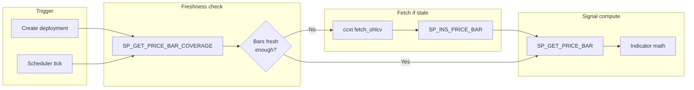
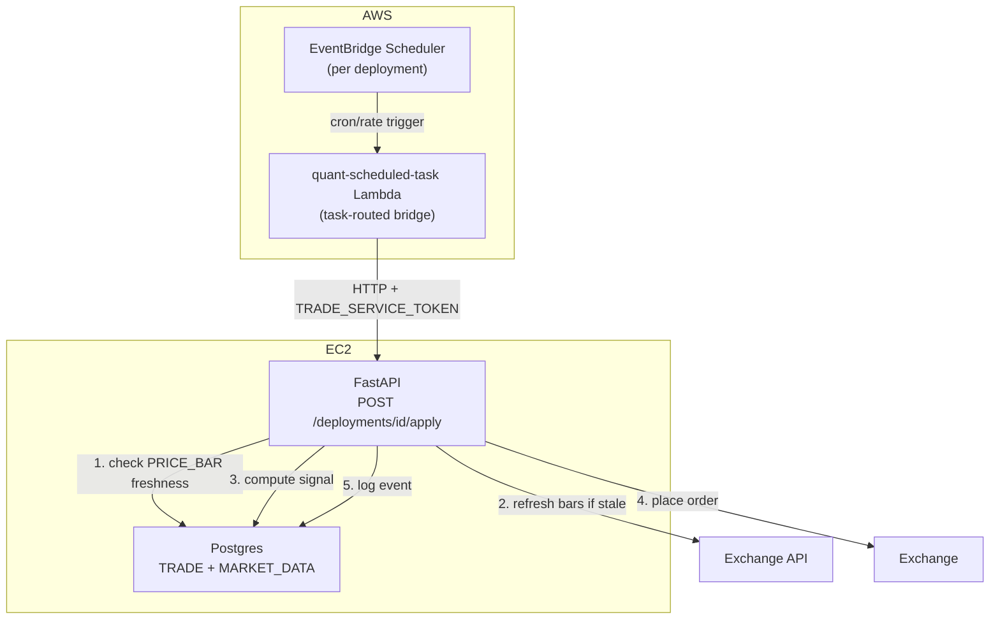

# Scheduler & Price Bars

!!! info "Status"
    **Design — Phase 1.9.** Covers automated trade scheduling via EventBridge and normalized price bars for live signal computation. Backtest cache versioning stays in the application layer (`BacktestCache.refresh_payload`).

**Parent:** [Plan to Profit](plan-to-profit.md) Phase 1.9  
**Related:** [Trade Deployment Rollout](trade-deployment-rollout.md), [Live Order Execution](live-order-execution.md), [Separate Underlying & Cache](separate-underlying.md), [Open questions (scheduler & trade)](scheduler-trade-open-questions.md)

---

## 1. Problem

Phase 1.7 (live apply) is synchronous — the user clicks Apply and the API runs one signal evaluation and places an order. There is no mechanism to execute a deployment automatically at a recurring interval. Two gaps need closing before automated trading is viable:

1. **No scheduler.** `TRADE.DEPLOYMENT` has no schedule metadata; nothing triggers apply at the right time.
2. **No normalized price bars.** Live signal computation currently reads full-history JSONB blobs from `BT.API_REQUEST_PAYLOAD` — wasteful for a scheduler that only needs the latest N bars. A relational bar table enables efficient range scans.

---

## 2. Decisions

| # | Decision | Rationale |
|---|----------|-----------|
| 1 | **EventBridge Scheduler + Lambda** for recurring execution | Schedule lives in AWS, survives instance restarts, idempotent per tick. Lambda is a thin HTTP caller; all business logic stays in FastAPI. |
| 2 | **Predefined intervals only**: `MANUAL`, `1H`, `DAILY` | Matches the bar granularities we store; no arbitrary cron expressions needed for v1. 4H dropped — few metrics exist at 4H, and 1H covers intraday. New intervals are just a REFDATA seed row away. |
| 3 | **Intervals keyed by `REFDATA.TM_INTERVAL`** — not free-text | The table already exists (used by `BT.API_REQUEST.TM_INTERVAL_ID`) but is **unseeded**; `BacktestCache.DEFAULT_TM_INTERVAL_ID = 1` hardcodes daily by convention. Seed it (`1=DAILY`, `2=1H`) and reference it from both `MARKET_DATA.PRICE_BAR` and `TRADE.DEPLOYMENT` — REFDATA stays the single source of truth for dropdowns. |
| 4 | **`MARKET_DATA` schema** for price bars (separate from `BT`) | Live apply reads are distinct from backtest reads. No migration of existing JSONB data. Both coexist. |
| 5 | **On-demand bar population** | Only products with active deployments get bars stored. No bulk ingest of all products. |
| 6 | **Application-owned API_REQUEST refresh** | `BacktestCache.refresh_payload` fetches the caller's range and reinserts via `SP_INS_API_REQUEST`; no DB consolidation SP. |

### 2.1 REFDATA.TM_INTERVAL seed

The table (`TM_INTERVAL_ID IDENTITY`, `NAME`, `DESCRIPTION`) exists since baseline but has no rows. Seed via Liquibase changeset:

| TM_INTERVAL_ID | NAME | PERIOD_LENGTH | DESCRIPTION |
|----------------|------|---------------|-------------|
| 1 | `DAILY` | `1 day` | Daily bars — matches `BacktestCache.DEFAULT_TM_INTERVAL_ID = 1` |
| 2 | `1H` | `1 hour` | Hourly bars |

`PERIOD_LENGTH` is the scheduler step (`last_run + PERIOD_LENGTH`). Poller uses `SP_GET_MISSED_DUE_DEPLOYMENTS`; UI preview may use `SP_GET_NEXT_DUE_DEPLOYMENTS` or compute in Python.

`MANUAL` is **not** a row here — it is not a time interval. Manual-only deployments are expressed as `SCHEDULE_TM_INTERVAL_ID IS NULL`.

!!! note "Seeding an IDENTITY column"
    `TM_INTERVAL_ID` is `GENERATED ALWAYS AS IDENTITY`, so the seed must pin ids explicitly (`INSERT ... OVERRIDING SYSTEM VALUE`) — `1=DAILY` must match the hardcoded `BacktestCache.DEFAULT_TM_INTERVAL_ID = 1` already in production data (`BT.API_REQUEST.TM_INTERVAL_ID = 1` rows).

---

## 3. TRADE.DEPLOYMENT — scheduler config + run state

**Config** (soft-versioned on `DEPLOYMENT` — qty, credential, schedule interval changes bump `DEPLOYMENT_VID`):

| Column | Type | Default | Purpose |
|--------|------|---------|---------|
| `SCHEDULE_TM_INTERVAL_ID` | `INTEGER NULL` | `NULL` | `REFDATA.TM_INTERVAL` id (`DAILY`/`1H`); **NULL = manual only** |

**Run state** (append-only versions on `TRADE.DEPLOYMENT_SCHEDULE_STATUS` — one logical schedule per `DEPLOYMENT_ID`):

| Column | Purpose |
|--------|---------|
| `DEPLOYMENT_SCHEDULE_ID` | Stable UUID (same as `DEPLOYMENT_ID` on create) |
| `DEPLOYMENT_SCHEDULE_VID` | Monotonic version per schedule change / tick advance |
| `DEPLOYMENT_ID` / `DEPLOYMENT_VID` | Links to deployment row at time of write |
| `STATUS` | `PENDING` \| `SUCCESS` \| `FAILED` — poller reads `PENDING` only |
| `SCHEDULED_TS` | **Next due** apply time |

Due check: latest row where `STATUS = 'PENDING'` and `SCHEDULED_TS <= NOW()`. Poller calls **`SP_GET_MISSED_DUE_DEPLOYMENTS(IN_TM_INTERVAL_ID)`** per interval tick (DAILY, 1H, …). After apply, **`SP_INS_DEPLOYMENT_SCHEDULE_STATUS`** with `NEXT_SCHEDULED_TS` from the cursor — no separate advance proc. `TradeRepo` wraps all three; `ScheduleTickRunner` sequences them (§6.3).

`EXECUTION_EVENT` remains a pure execution diary (`TRANSACT_AT` = tick time for audit). It carries **no scheduling anchor** — the diary never drives due-ness.

Same pattern as `BT.API_REQUEST.TM_INTERVAL_ID` — an integer reference to `REFDATA.TM_INTERVAL`, no free-text interval strings.

### DDL

```sql
-- TRADE.DEPLOYMENT (config only):
SCHEDULE_TM_INTERVAL_ID  INTEGER,       -- REFDATA.TM_INTERVAL; NULL = manual

-- TRADE.DEPLOYMENT_SCHEDULE_STATUS (scheduler state):
DEPLOYMENT_SCHEDULE_ID, DEPLOYMENT_SCHEDULE_VID, DEPLOYMENT_ID, DEPLOYMENT_VID,
STATUS, SCHEDULED_TS, IS_CURRENT_IND, USER_ID, CREATED_AT
```

### Stored procedure changes

| Procedure | Change |
|-----------|--------|
| `TRADE.SP_INS_DEPLOYMENT_SCHEDULE_STATUS` | Append schedule version (poller advance after apply) |
| `TRADE.SP_INS_DEPLOYMENT` | Seeds / syncs schedule row when interval set |
| `TRADE.SP_INS_EXECUTION_EVENT` | Diary only — no scheduler side effects |
| `TRADE.SP_GET_DEPLOYMENT` | `LAST_RUN_AT` / `NEXT_DUE_AT` from schedule status |
| `TRADE.SP_GET_MISSED_DUE_DEPLOYMENTS` | `IN_TM_INTERVAL_ID` — enabled, not paused, `PENDING` + due |
| `TRADE.SP_GET_NEXT_DUE_DEPLOYMENTS` | `PENDING` + `SCHEDULED_TS > NOW()` (optional UI) |

### Python

API layer exposes interval by `NAME` (resolved via `RedisRefData` from `refdata:tm_interval`, same pattern as every other REFDATA dropdown); the repo layer persists the integer id. `schedule_interval: str | None` (`None` = manual) on `CreateDeploymentRequest` / `DeploymentRow`, plus `last_run_at` / `next_due_at` from `DEPLOYMENT_SCHEDULE_STATUS`. No hardcoded interval enum in Python — valid values come from REFDATA per the [REFDATA single-source-of-truth decision](plan-to-profit.md).

---

## 4. MARKET_DATA schema — price bars for live apply

A new Postgres schema for normalized OHLCV data. Serves the live apply pipeline only — backtest continues using `BT.API_REQUEST_PAYLOAD` JSONB blobs unchanged.

### 4.1 `MARKET_DATA.PRICE_BAR`

```sql
CREATE SCHEMA IF NOT EXISTS MARKET_DATA;

CREATE TABLE MARKET_DATA.PRICE_BAR (
    INTERNAL_CUSIP   TEXT          NOT NULL,   -- INST.PRODUCT convention
    TM_INTERVAL_ID   INTEGER       NOT NULL,   -- REFDATA.TM_INTERVAL (1=DAILY, 2=1H)
    BAR_TIMESTAMP    TIMESTAMPTZ   NOT NULL,   -- bar open time (UTC)
    OPEN_PX          DECIMAL       NOT NULL,
    HIGH_PX          DECIMAL       NOT NULL,
    LOW_PX           DECIMAL       NOT NULL,
    CLOSE_PX         DECIMAL       NOT NULL,
    VOLUME           DECIMAL       NOT NULL,
    SOURCE_APP_ID    INTEGER       NOT NULL,   -- REFDATA.APP (e.g. Bybit=34)
    USER_ID          TEXT          NOT NULL,   -- audit convention (service user)
    CREATED_AT       TIMESTAMPTZ   NOT NULL DEFAULT NOW(),

    PRIMARY KEY (INTERNAL_CUSIP, TM_INTERVAL_ID, SOURCE_APP_ID, BAR_TIMESTAMP)
);
```

**PK rationale:** `(INTERNAL_CUSIP, TM_INTERVAL_ID, SOURCE_APP_ID, BAR_TIMESTAMP)` is the natural unique key. **`SP_INS_PRICE_BAR` is plain `INSERT`** — the app reads coverage / existing bars first and only passes missing bars. A duplicate PK raises `unique_violation` (visible failure); there is no silent upsert or `ON CONFLICT`.

!!! warning "`SOURCE_APP_ID` is in the key, not payload — decision #47"
    One `INTERNAL_CUSIP` is traded on several venues: decision #21 makes `btcusdt.crypto` a single product with a per-broker `INST.PRODUCT_XREF` row for Bybit **and** Binance. A venue-blind key lets whichever venue writes a timestamp first own it; the loser's insert raises `unique_violation`, `PriceBarService` absorbs it as a benign race, and that deployment's signal is then computed on the winner's prints. The window silently blends two order books and a backtest over it does not reproduce.

    Consequences that follow from the wide key:

    - **Every read scopes to one source.** `SP_GET_PRICE_BAR` and `SP_GET_PRICE_BAR_COVERAGE` both take `IN_SOURCE_APP_ID`. Coverage especially — unscoped, one venue's bars would mark another as fresh and the second venue would never fetch.
    - **A paid backfill provider is just another `SOURCE_APP_ID`**, sitting alongside live exchange bars rather than colliding with them. This is what makes the table usable as one source of truth for backtest and trade.
    - **Prices are not expected to agree across sources.** Bybit and Binance are separate order books, and provider daily bars differ again in session convention and adjustment. The guarantee is consistency *within* a series, not equality *between* them.

!!! note "No soft-versioning columns — deliberate"
    `PRICE_BAR` intentionally has **no** `TRANSACT_FROM/TO_TS` or `IS_CURRENT_IND`. Those fit mutable entities (`DEPLOYMENT`, `STRATEGY`) where a logical row gets superseded. A price bar is an **immutable fact** — nothing supersedes it.

    **Latest bar / freshness:** `SP_GET_PRICE_BAR_COVERAGE` → `MAX_BAR_TIMESTAMP` (`ORDER BY … DESC LIMIT 1`). **Bounds for catch-up:** same proc → `MIN_BAR_TIMESTAMP` / `MAX_BAR_TIMESTAMP` (two index probes; gap count derived in app from interval).

    1H and DAILY are separate PK subtrees — neither interval's volume affects the other's lookups. So are two venues on the same instrument.

**Indexes:**

```sql
CREATE INDEX IX_PRICE_BAR_LATEST
    ON MARKET_DATA.PRICE_BAR (INTERNAL_CUSIP, TM_INTERVAL_ID, SOURCE_APP_ID, BAR_TIMESTAMP DESC)
    INCLUDE (CLOSE_PX);
```

`IX_PRICE_BAR_LATEST` serves range scans (DESC), latest-bar / coverage probes (`ORDER BY … LIMIT 1`), and index-only latest `CLOSE_PX`. PK covers uniqueness and forward ASC reads. Both lead with the same four columns every read filters on, so a venue's series is one contiguous subtree.

### 4.2 Stored procedures

| Procedure | Purpose |
|-----------|---------|
| `MARKET_DATA.SP_GET_PRICE_BAR_COVERAGE` | `MIN`/`MAX` bar timestamps via `ORDER BY … LIMIT 1` (two index probes) — freshness uses `MAX` |
| `MARKET_DATA.SP_GET_PRICE_BAR` | OHLCV range read for signal computation |
| `MARKET_DATA.SP_INS_PRICE_BAR` | Insert **one bar** per call; plain `INSERT` |

**Division of labour:** the DB stores and reads bars; the **app** decides what window it needs, compares `SP_GET_PRICE_BAR_COVERAGE` to required range, fetches missing bars from the exchange, inserts gaps via `SP_INS_PRICE_BAR`. Single source of truth — no sync table.

### 4.3 Volume projections

| Interval | Bars/product/year | 10 products x 5 years | Row size est. |
|----------|-------------------|-----------------------|---------------|
| DAILY | 365 | 18,250 | ~120 bytes |
| 1H | 8,760 | 438,000 | ~120 bytes |
| **Total** | **9,125** | **456,250** | **~52 MB** |

Partitioning is not required at this scale. Revisit if product count exceeds 100.

### 4.4 On-demand population flow



**Freshness rule:** A bar set is "fresh enough" if `MAX_BAR_TIMESTAMP` from `SP_GET_PRICE_BAR_COVERAGE` is within one interval of now. For `DAILY`, if the latest bar is from today or yesterday, no fetch needed.

**Crash catch-up:** On retry, call `SP_GET_PRICE_BAR_COVERAGE` — compare `MIN`/`MAX` to the required window, fetch gaps, `SP_INS_PRICE_BAR` per missing bar (row-count check in app from interval + bounds).

### 4.5 Relationship to BT.API_REQUEST_PAYLOAD

| Concern | BT.API_REQUEST_PAYLOAD | MARKET_DATA.PRICE_BAR |
|---------|------------------------|----------------------|
| Purpose | Full-history backtest data (multi-year JSONB) | Normalized bars for **live signal computation** |
| Format | Single JSONB document per version | One row per bar (relational) |
| Query pattern | Load entire blob, parse in Python | SQL range scan |
| Write pattern | Full replace per version | Append-only insert (caller supplies missing bars only) |
| Used by | Backtest CLI, optimize worker | **Live apply scheduler, dry-run** |

Both coexist. There is no migration of data between them.

### 4.6 Backtest compatibility — same DataFrame contract

Backtest is **not required** to read `PRICE_BAR`, but the read path must not paint it into a corner. `PriceBarService.read_bars()` returns the **exact DataFrame shape the pipeline already consumes** (what `fetch_df` / `BacktestCache._payload_to_df` produce today):

| Pipeline column | Source in PRICE_BAR |
|-----------------|---------------------|
| index (`datetime`, UTC) | `BAR_TIMESTAMP` |
| `price` | `CLOSE_PX` |
| `factor` | `CLOSE_PX` (same as `price`, default) |
| `Open` / `High` / `Low` / `Close` / `Volume` | `OPEN_PX` / `HIGH_PX` / `LOW_PX` / `CLOSE_PX` / `VOLUME` |

Because the contract matches, `Performance` / indicator math work on bars from either source with **zero changes**. If backtest later wants intraday backtests on 1H bars, it plugs `read_bars()` in as another fetcher behind the same interface — an additive change, not a rework.

Reproducibility is what makes that safe, and it rests on decision #47: a backtest must pin `source_app_id`, because the same `(internal_cusip, tm_interval_id, bar_timestamp)` legitimately holds a different price per venue. A run pinned to a source re-reads identically no matter how many venues later start writing; an unpinned run would not. A paid historical provider backfilled under its own `SOURCE_APP_ID` sits beside the live exchange bars rather than overwriting them, so research history and traded history stay separable and comparable.

#### Continuity is not automatic — `ensure_fresh` is a rolling window

`ensure_fresh` repairs only `[newest - period × (lookback - 1), newest]`, and `lookback` is `live_lookback_bars(window) = max_window × 3 + 60` — a **bar count**, so what it covers in wall-clock time depends entirely on the interval:

| Interval | 120 bars covers | Host down 5 days | Host down 10 days |
|----------|-----------------|------------------|-------------------|
| DAILY | 120 days | fully repaired | fully repaired |
| 1H | 5 days | just covered | days 5–10 never requested again |
| 15m | 30 hours | lost | lost |

Bars older than the window are never asked for a second time, so the hole is permanent. That is fine for trading — `load_window` needs only the window and fails closed if it cannot complete it — but it means the table is a rolling window maintained as a *side effect of trading*, not a continuous history.

`PriceBarService.backfill(internal_cusip, tm_interval_id, source_app_id, start, end)` is what closes that gap: an explicit range, every hole in it filled. `find_gaps(...)` answers the same question read-only, without touching the exchange.

Backfill deliberately **does not fail closed**, inverting the rule the rest of this module follows. On the trade path a hole must stop the run because a wrong trade beats no trade; during a repair a hole is ordinary — the range may predate the listing, or reach past what the venue retains — and aborting would discard the bars that *were* recoverable. `BackfillResult.unfilled` reports what could not be filled, and `is_continuous` is the check a backtest should make before trusting a range.

Backfill depth is bounded by the venue, not by us: ccxt `fetch_ohlcv` history varies by exchange and timeframe, and deep intraday history is often unavailable at any price. A provider under its own `SOURCE_APP_ID` is the answer where the exchange cannot reach back far enough.

### 4.7 Failure modes and error handling

Same contract philosophy as `BacktestCache`: **reads may degrade loudly, writes never silently fail.** For trading, the overriding rule is **fail closed — never trade on data we cannot verify.**

| Failure | Behaviour |
|---------|-----------|
| **Apply fails** (order rejected, broker error) after signal computed | Retry up to **3 times** same `SCHEDULED_TS` (app). Then `SP_INS_DEPLOYMENT_SCHEDULE_STATUS` with `NEXT_SCHEDULED_TS` from GET cursor. Diary in `EXECUTION_EVENT`. |
| **Exchange fetch fails** (ccxt down, rate-limited, timeout) at scheduler tick | Do **not** compute a signal on stale bars. Abort the run, write `TRADE.EXECUTION_EVENT` row with `IS_SUCCESS_IND='N'` — schedule is **not** advanced (tick did not complete). Retry on next poll; does not consume the 3-attempt budget. |
| **Bars stale but within tolerance** (fetch OK, exchange lagging one bar) | Freshness rule (§4.4) decides: if `MAX_BAR_TIMESTAMP` is within one interval of now, proceed; otherwise treat as fetch failure above. |
| **Gap in bars** (exchange downtime, missed ticks) | `SP_GET_PRICE_BAR` returns what exists; `PriceBarService` validates row count vs expected window and refetches the missing range (ccxt `fetch_ohlcv` accepts a `since` param). If the gap persists, fail closed as above. |
| **Host down longer than the live lookback** | `ensure_fresh` refills the window and trading resumes on correct prices — a closed candle is immutable, so a bar fetched ten days late is identical to one fetched at the boundary. Bars *older* than the window are never requested again, so the table keeps a permanent hole (see [§4.6](#continuity-is-not-automatic--ensure_fresh-is-a-rolling-window)). Repair with `PriceBarService.backfill` over an explicit range; trading is unaffected either way. |
| **Instrument listed more recently than the lookback** | `ensure_fresh` tolerates it (warns, treats as pre-listing history) so warming still works; `load_window` refuses below **80% coverage** of the requested lookback, because an indicator computes happily on a short window and would return a plausible number off statistics the strategy was never fitted on. See [§7.3](#73-price-bar-service--quantmarket_dataservicepy). |
| **Partial (still-forming) bar** | Never inserted, and guarded twice: `ensure_fresh` never requests past `last_closed_bar`, and the fetcher discards any row with `ts > until` — the exchange *does* return the current candle when the window includes it. This matters because `PRICE_BAR` is append-only with a natural PK: a forming bar's high/low reflect only the elapsed portion, so storing one would freeze wrong values permanently and the corrected bar would later hit `unique_violation` instead of replacing it. Requires schedules to fire *after* the boundary — see [§6.2](#required-fire-after-the-boundary-never-on-it). |
| **Crash before insert commits** | `SP_GET_PRICE_BAR_COVERAGE` unchanged — refetch missing range, `SP_INS_PRICE_BAR` per bar. |
| **Crash after insert, before apply** | Coverage shows new bars — skip fetch/insert, re-run apply. |
| **Duplicate insert** | `SP_INS_PRICE_BAR` stays a plain INSERT and reports `unique_violation` — the SP does not hide it. `PriceBarService` treats **that one SQLSTATE (23505)** as a lost race and moves on; any other `ProcedureError` propagates. Deployments sharing an instrument and interval fire at the same boundary, so several legitimately decide the same bar is missing before any of them writes; the winner stored the same bar the losers fetched. That last clause only holds because `SOURCE_APP_ID` is in the key (decision #47) — a conflict therefore means the *same venue's* same bar. Venue-blind, this same swallow would quietly adopt another exchange's print. A genuine double-insert is already ruled out by the missing-set calculation, so absorbing it here costs no real safety. |
| **DB write fails after successful fetch** | Propagates (same as `BacktestCache.refresh_payload` contract). The scheduler run fails loudly; no order is placed on unpersisted data. |
| **Timezone bugs** | Everything is `TIMESTAMPTZ` stored UTC; `BAR_TIMESTAMP` is the bar **open** time. Python side uses tz-aware UTC (`pd.Timestamp` convention already enforced by `BacktestCache._to_utc`). |

---

## 5. BT.API_REQUEST versioning (application-owned)

### 5.1 Problem

Every "Refresh dataset" click creates a new `API_REQ_VID` in `BT.API_REQUEST` and a corresponding JSONB blob in `BT.API_REQUEST_PAYLOAD`. The **current** row (`TRANSACT_TO_TS = '9999-12-31'`) always holds the merged history the app needs; closed VIDs are superseded and are not read by the cache path.

### 5.2 Refresh contract (no DB consolidation SP)

`BacktestCache.refresh_payload` owns the write path:

1. Look up the current row for `(APP_ID, APP_METRIC_ID, TM_INTERVAL_ID, INTERNAL_CUSIP)`.
2. Fetch the requested `[RANGE_START_TS, RANGE_END_TS]` from the provider (the smallest range the caller needs for that refresh).
3. Call `BT.SP_INS_API_REQUEST` with the existing `API_REQ_ID` — the SP closes the prior VID and inserts a new current row + payload with the merged range.

There is **no** `BT.SP_CONSOLIDATE_API_REQUEST`. Purging closed rows / partition retention is separate future work ([Separate Underlying & Cache](separate-underlying.md) § scheduled purge of closed versions).

---

## 6. EventBridge Scheduler architecture



Lambda is a thin HTTP caller with a service auth token. All business logic stays in the FastAPI app.

### 6.1 AWS resources (implemented)

CloudFormation stack `quant-scheduler` — template [`aws/cfn/04-scheduler.yml`](../../aws/cfn/04-scheduler.yml). Ops detail: [Infrastructure — Trade scheduler](../architecture/infrastructure.md#trade-scheduler-eventbridge--lambda).

| Resource | Name |
|----------|------|
| Schedule group | `quant-trade-deployments` |
| Lambda | `quant-scheduled-task` ([`aws/lambda/scheduled-task/handler.py`](../../aws/lambda/scheduled-task/handler.py)) |
| Scheduler invoke role | `quant-scheduler-invoke` |
| Lambda execution role | `quant-scheduled-task-lambda` (CloudWatch Logs + SSM read of the service token) |
| EC2 manage policy | `quant-ec2-scheduler-manage` (on `quant-ec2-role`) |
| Service token SSM | `/quant/prod/TRADE_SERVICE_TOKEN` — fetched by the Lambda at cold start (CloudFormation does not support `ssm-secure` in Lambda env vars) |

The `deploy` workflow's `cfn` job runs this stack on pushes touching
`aws/cfn/04-scheduler.yml`, `aws/lambda/scheduled-task/**`, or
`config/scheduler/**`, and on a manual dispatch. Locally:

```bash
bash aws/scripts/init-ssm-params.sh   # creates TRADE_SERVICE_TOKEN if missing
bash aws/deploy.sh scheduler          # CFN + Lambda zip + sync_schedules.py
```

### 6.2 Schedule management (app — not yet wired)

Deployment create/update/stop talks to a **`ScheduleTrigger`** seam, not to
boto3 directly. Two implementations, selected by `SCHEDULER_BACKEND`
(default `local`):

| Backend | Trigger | Used by |
|---------|---------|---------|
| `eventbridge` | Per-deployment EventBridge schedule → Lambda → API (HTTPS + service token) | Prod (EC2, `USE_SSM=1`) |
| `local` | In-process poller inside FastAPI — no AWS needed | Dev / any box without AWS |

**Shared state, different alarm clock.** Schedule config lives on soft-versioned
`DEPLOYMENT`; scheduler cursor on append-only `DEPLOYMENT_SCHEDULE_STATUS`.
Due-ness = latest `PENDING` row with `SCHEDULED_TS <= NOW()` via
`SP_GET_MISSED_DUE_DEPLOYMENTS`. EventBridge and the local poller are just two
ways of waking up. Poller calls `SP_INS_DEPLOYMENT_SCHEDULE_STATUS` after apply;
`live_apply` appends `EXECUTION_EVENT` only — separate concerns.

When a deployment is created or updated with a non-NULL `SCHEDULE_TM_INTERVAL_ID`:

1. `SP_INS_DEPLOYMENT` persists `SCHEDULE_TM_INTERVAL_ID` (config change only — versions if other fields changed).
2. `ScheduleTrigger.sync(deployment)`:
    - **eventbridge** — creates/updates the schedule via `boto3` targeting the Lambda (`ScheduledTaskLambdaArn` + `SchedulerInvokeRoleArn` from stack outputs), with **`RetryPolicy.MaximumRetryAttempts = 0`** — the Scheduler default (185 retries over 24h) must never re-invoke a failing trade apply; order-level retries live in `OrderRetryExecutor`.
    - **local** — no-op; the poller reads `SP_GET_MISSED_DUE_DEPLOYMENTS` directly.

When a deployment is stopped or the schedule is cleared (`SCHEDULE_TM_INTERVAL_ID = NULL`):

1. `ScheduleTrigger.remove(deployment)` (eventbridge deletes the schedule; local no-op).
2. `SP_INS_DEPLOYMENT` with `SCHEDULE_TM_INTERVAL_ID = NULL`.

**Local poller** (dev) — `SchedulePoller` in `quant/trade/scheduler/poller.py`:
an asyncio background task started at FastAPI startup when
`SCHEDULER_BACKEND=local`. Every `poll_interval_s` (default 60s) it sweeps
every `TM_INTERVAL_ID` from `RedisRefData.interval_ids()` and hands each to
`ScheduleTickRunner.run_interval`, which reads
`SP_GET_MISSED_DUE_DEPLOYMENTS(IN_TM_INTERVAL_ID)`, invokes
`TradeService.apply_deployment` **in-process** (no HTTP, no
`TRADE_SERVICE_TOKEN`), then advances the cursor via
`SP_INS_DEPLOYMENT_SCHEDULE_STATUS` using `NEXT_SCHEDULED_TS` off the due row.

Sweeping all intervals beats tracking which ones have deployments: an empty
interval costs one read returning no rows, which is cheaper than keeping a
subscription list correct across create/pause/reschedule. `run_interval`
blocks on HTTP and DB, so the poller dispatches it through `asyncio.to_thread`
— an apply must not stall the API sharing the process.

#### 6.3.1 Startup drain — missed wakeups are the normal case

WSL stops outright when the laptop lid closes, so the local backend *will* miss
ticks. `SchedulePoller.run` therefore drains before its first timed pass, and
draining is only the tick repeated: each pass advances a due deployment by
exactly one interval, so a three-day daily gap takes three passes and leaves a
`DEPLOYMENT_SCHEDULE_STATUS` row per owed slot. That per-slot history is the
record of what the downtime cost — see decision #46.

The drain stops as soon as a pass moves nothing. A deployment that failed with
attempts left reports `RETRYING` and is deliberately left due, so its budget is
spent across poll cycles rather than burned in a tight loop. A pass reporting
`STUCK` — applied, but the cursor would not move — **aborts** the drain: another
immediate pass would place a second order seconds later. `max_drain_passes`
(default 2000) bounds the loop regardless.

> [!IMPORTANT]
> Catch-up does **not** replay the missed period. `load_window` derives its
> window from `now()`, so every pass computes today's signal and any order fills
> at today's price. Repeated applies converge rather than stack — `intended_side`
> compares the signal against the live broker position and returns `HOLD` once it
> already matches, so a three-day gap is one trade plus two no-ops.

Rejected for dev: **LocalStack** (EventBridge Scheduler emulation is
paid-tier; would test the emulator, not our logic) and **cron + curl**
(needs the service token on the dev box, machine must be awake, bypasses
`EXECUTION_EVENT` bookkeeping).

#### Bar sync is one schedule per interval, not one per deployment

Apply schedules are per-deployment, so N deployments trading `btcusdt.crypto` on 1H wake at the same instant. Without a shared warm-up each one fetches the same bar and they race to insert it.

`PriceBarService.sync(instruments, tm_interval_id, lookback)` collapses that: **one schedule per `TM_INTERVAL_ID`** fires shortly before the apply schedules, derives the distinct `(INTERNAL_CUSIP, APP_ID)` set from the due deployments, and fetches each instrument once. Duplicates are folded inside `sync`, since the caller passes deployment rows straight through.

It is **best effort and not a correctness dependency.** One unreachable symbol is recorded in `SyncResult.failures` and the batch continues; every apply still calls `ensure_fresh` and still fails closed on its own. A failed sync costs a redundant fetch on the apply path, never a bad trade. That is what lets sync catch broadly where apply must not.

Remaining wiring: the `POST /api/v1/market-data/price-bars/sync` endpoint, the `price_bar_sync` entry in the Lambda's `_TASK_PATHS` (already stubbed as a comment), and the per-interval schedule itself.

#### Required: fire *after* the boundary, never on it

**Every schedule expression must carry an offset of a minute or two past the interval boundary** — `cron(2 * * * ? *)` for hourly, `cron(2 0 * * ? *)` for daily. Not `0`.

`PriceBarService` computes its target as `last_closed_bar(now, period)`, so a tick at exactly 10:00:00 demands the `09:00` bar the instant it closed. The exchange has not necessarily published it yet, and the service **fails closed** — `StaleBarsError`, no signal, no order. The run recovers on the next poll and does not consume the 3-attempt apply budget, so this is a wasted tick rather than a correctness bug, but it is entirely avoidable.

The offset costs nothing: the target is derived by flooring `now` to the boundary, so any firing time within `[10:00, 11:00)` resolves to the same `09:00` bar. Firing at :02 is identical to firing at :00, minus the race.

This applies to both backends — the `eventbridge` schedule expression and the `local` poller's interval. Note the local poller's ~30s cycle is naturally offset, so the risk is concentrated in the EventBridge path.

### 6.3 Lambda function

Handler lives in-repo (stdlib + Lambda-bundled boto3 — no layers). It is a
**generic task bridge**: the event names the task, a dict maps task → API
path, and the token is fetched from SSM at cold start. Event shapes:

```json
{"task": "trade_apply", "deployment_id": "019abcde-…"}
{"task": "price_bar_sync", "payload": {"internal_cusip": "…", "interval": "1H"}}
```

`trade_apply` calls `POST {API_BASE_URL}/api/v1/trade/deployments/{id}/apply`
with `Authorization: Bearer {TRADE_SERVICE_TOKEN}`. `price_bar_sync` is the
planned second task for scheduled price-bar ingestion (§4) — enabling it is
one entry in the handler's `_TASK_PATHS` dict once the FastAPI endpoint
exists, with its own schedule(s) in the same group. No new Lambda or stack
change.

### 6.4 Service auth (app — not yet wired)

Lambda authenticates via `TRADE_SERVICE_TOKEN` (SSM SecureString), not a user JWT. The `/apply` endpoint must accept this service token for scheduled execution alongside `require_user` for manual apply. Until that lands, Lambda invokes reach the API but return **401**.

---

## 7. Python layer

### 7.1 Interval resolution — REFDATA, not a Python enum

No hardcoded interval enum. Valid intervals come from `REFDATA.TM_INTERVAL` via `RedisRefData` (same pattern as indicator/strategy dropdowns). API request/response models carry `schedule_interval: str | None` (the `NAME`, e.g. `"DAILY"`; `None` = manual); the repo layer resolves `NAME` to `TM_INTERVAL_ID` before calling SPs — mirroring how `BacktestCache` resolves `app_id`/`app_metric_id` through its refdata reader.

### 7.2 Interval arithmetic — `quant/shared/intervals.py`

Bar boundaries and scheduler ticks are the same arithmetic, so it lives in one cross-cutting module instead of once per caller:

```python
parse_period(value)            # REFDATA PERIOD_LENGTH → timedelta
floor_to_period(ts, period)    # bin from the Unix epoch: DAILY → 00:00 UTC, 1H → top of hour
last_closed_bar(now, period)   # newest bar that has finished forming
next_run_at(after, period)     # next boundary — UI display only
ccxt_timeframe(period)         # timedelta → "1h" / "1d"
```

The module is pure arithmetic and does no I/O. The REFDATA lookup itself is `RedisRefData.get_interval_period(tm_interval_id) -> timedelta`, which sits with the other resolvers (`resolve_app_id`, `resolve_queue_status_id`) rather than in `shared/`.

`parse_period` accepts both a `timedelta` (straight from psycopg) and the stringified form (`"1 day, 0:00:00"`) that REFDATA rows carry after the publisher's `json.dumps(default=str)` round-trip through Redis — a caller should not have to know which side its row came from.

Poller due-ness still comes from `SP_GET_MISSED_DUE_DEPLOYMENTS`; `next_run_at` is display only.

### 7.3 Price bar service — `quant/market_data/service.py`

```python
class PriceBarService:
    """Freshness check, gap fill and range read."""

    def ensure_fresh(self, *, internal_cusip, tm_interval_id, source_app_id, lookback, now=None) -> int:
        """Coverage probe; on a stale tail, reconcile the window and insert what is missing."""

    def sync(self, *, instruments, tm_interval_id, lookback, now=None) -> SyncResult:
        """Warm many instruments once per interval — see §6.2. Best effort."""

    def backfill(self, *, internal_cusip, tm_interval_id, source_app_id, start, end=None) -> BackfillResult:
        """Fill every hole in an explicit range — see §4.6. Reports, never raises."""

    def find_gaps(self, *, internal_cusip, tm_interval_id, source_app_id, start, end) -> list[datetime]:
        """Boundaries with no stored row. Read-only; no exchange call."""

    def read_bars(self, *, internal_cusip, tm_interval_id, source_app_id, start, end) -> pd.DataFrame:
        """Bars in the DataFrame shape of §4.6, from one source (decision #47)."""

    def load_window(self, internal_cusip, lookback, *, tm_interval_id, source_app_id, now=None) -> pd.DataFrame:
        """`ensure_fresh` then `read_bars` — the live-apply entry point."""
```

`ensure_fresh` gates on `MAX_BAR_TIMESTAMP >= last_closed_bar` (§4.4). When stale it reads the window, computes the missing boundaries, fetches from the oldest gap forward, and inserts **oldest first** — so a crash part-way leaves `MAX` short of the target and the next tick resumes from there rather than stepping over the hole.

It raises `StaleBarsError` when the exchange cannot supply the newest closed bar or leaves an interior gap. Bars missing *before* the oldest one the exchange returned are treated as history that predates the listing: logged, not fatal.

`load_window` is the only method live apply calls: one window, complete or raising. Its positional `(internal_cusip, lookback)` exists so a caller can bind the interval and broker once and vary the symbol — which is exactly the `BarLoader` shape §7.6 needs.

**Population tolerates a short window; serving a signal does not.** `ensure_fresh` deliberately allows bars older than the exchange's earliest — that is listing history, not a gap — because warming a newly listed instrument should not fail. `load_window` then applies a **coverage floor of 80% of the requested lookback** and raises `StaleBarsError` below it. Without the floor an indicator still computes on whatever arrived: a 20-bar Bollinger needs only 20 bars, so a 25-bar window returns a perfectly valid-looking number derived from statistics the strategy was never fitted on. The floor turns that into a loud failure:

| Indicator window | Lookback requested | Bars required |
|---|---|---|
| 20 | 120 | 96 |
| 60 | 240 | 192 |

80% rather than 100% because the newest bar is what the signal turns on and the oldest edge of a 3x-padded lookback is slack; 80% rather than less because falling far below the padding starves the indicator itself.

### 7.6 Signal source selection — `quant/strategy/live_service.py`

`compute_latest_position` takes an optional `bar_loader`, typed
`BarLoader = Callable[[str, int], pd.DataFrame]` — `(internal_cusip, lookback_bars)`.
Supplying one switches every series the strategy reads from the provider path
(`fetch_df`, addressed by **date**) to `MARKET_DATA.PRICE_BAR` (addressed by
**bar count**). Which source is used is the *only* difference: both paths call
one `build_data_dict_for_signal(config, load)`, differing only in the
`SymbolLoader` they are handed (`provider_loader` or `bars_loader`).

That single builder takes its symbol set from
`StrategyConfig.get_internal_cusips()` — the same accessor `Performance` resolves
factor frames through — so the data dict is keyed exactly the way the strategy
will look it up. Keying it any other way is not a style question: the live path
previously keyed factors by `symbol` while `build_config` writes
`vendor_symbol or symbol` onto the substrategy, so any cross-product strategy
using a `vendor_symbol` override (e.g. `^VIX`) raised `KeyError` in live and
dry-run while backtesting fine.

The lookback is `live_lookback_bars(window)` = `max_window * 3 + 60`. It is the
bar-indexed twin of `live_lookback_days` and deliberately drops that function's
`min(trading_period, 400)` floor, which buys roughly a year of daily history to
survive weekends and holidays — meaningless when every element of the window is
one bar of the interval being traded.

**Factors come from the same venue or not at all.** `bars_loader` routes *every*
symbol to the exchange, including factors that name their own `data_source`.
Mixing an exchange series with a provider series would align bars that were never
observed on the same clock; a symbol the exchange cannot supply raises out of the
loader rather than falling back.

### 7.7 Broker binding — `quant/trade/bar_source.py`

`PriceBarServiceFactory.for_app(app_id)` returns the `PriceBarService` reading
from the venue that `app_id` trades on, resolving it through
`registry.exchange_id_for_app` so the ccxt id is never restated next to the
price-bar code. Services are cached per `APP_ID` (a scheduled apply runs every
boundary and each build starts a ccxt client); the `PriceBarRepo` is **not**
per-broker, since it is one connection to one database and every venue's bars
land in the same table. It is built once in the FastAPI lifespan and lives on
`app.state.price_bars`, outliving the per-request `TradeService`.

`LiveApplyOrchestrator` chooses the source **by venue, not by schedule**: a live
signal reads the bars of the exchange it executes on whenever that exchange
serves market data. The schedule only sets the bar interval — no schedule means
**daily** (`resolve_interval_id(timedelta(days=1))`, id from REFDATA, never
hardcoded). The provider path survives solely for brokers with no market-data
venue, where the provider series is the only series that exists.

| Deployment | Source |
|---|---|
| App has no ccxt venue (e.g. Futu equities) | Provider path (`fetch_df`, by date) |
| Venue, no schedule (manual apply) | `PRICE_BAR` via `load_window`, daily interval |
| Venue, scheduled | `PRICE_BAR` via `load_window`, schedule's interval |
| Venue, factory missing | `TradeValidationError` — refuses rather than pricing a venue-bound strategy off the provider feed |

This means manual and scheduled applies of the same deployment read the **same
series** — attaching a schedule changes cadence, never the input data. Research
(backtest, dry-run) keeps the provider: daily 10-year history is what providers
are for, and the split matches how the data is used, not how the apply was
triggered.

`StaleBarsError` propagates out of the apply before an adapter is even
constructed, so no order can be placed on an incomplete window. The API maps it
to **503**, not 4xx: the request was valid and the caller should return on the
next tick.

#### Recording which series produced the signal

`ApplyReport.bar_source` carries `"price_bar:<venue>"` or `"provider"`, and the
same label is logged at apply time.

This is not bookkeeping for its own sake. **Strategy parameters are fitted on
provider history and a live apply trades them against exchange prints.**
The Phase 0.1 candidate was signed off on Glassnode daily data; the same
parameters now price against Bybit bars, which are a different series — so the
same config can produce a different position on the same day. Recording the
input next to the output is what makes such a divergence traceable instead of
speculative.

The label currently lives on the API response (which the Lambda logs to
CloudWatch) and in the application log. It is **not** persisted:
`TRADE.EXECUTION_EVENT` has no column for it, and adding one is a DDL change
plus an `SP_INS_EXECUTION_EVENT` signature change — worth doing once the
divergence is understood well enough to know what else belongs in that row.

### 7.4 Price bar repo — `quant/market_data/repo.py`

Follows the `BacktestCache` pattern — extends `DbGateway` (persistent connection, since a backfill is one `CALL` per bar), all access via `CALL MARKET_DATA.SP_*`:

```python
class PriceBarRepo(DbGateway):
    def get_coverage(self, *, internal_cusip, tm_interval_id, source_app_id) -> dict | None: ...
    def get_bars(self, *, internal_cusip, tm_interval_id, source_app_id, range_start, range_end) -> list[dict]: ...
    def ins_bar(self, *, internal_cusip, tm_interval_id, source_app_id, bar_timestamp, open_px, high_px, low_px, close_px, volume) -> None: ...
```

### 7.5 Bar fetcher — `quant/market_data/fetcher.py`

`CcxtBarFetcher` paginates `fetch_ohlcv` across the requested window and drops anything past the last closed boundary. It builds a **keyless** ccxt client rather than reusing `CcxtTradeGateway`: bars are public data, and market data must not depend on a user's API credentials or on a trading session being up. `PriceBarService` depends on the `BarFetcher` protocol, not on ccxt.

---

## 8. Files

### New (AWS — done)

| File | Content |
|------|---------|
| `aws/cfn/04-scheduler.yml` | Lambda + schedule group + IAM |
| `aws/lambda/scheduled-task/handler.py` | Task-routed API bridge (`trade_apply` now, `price_bar_sync` later) |
| `aws/deploy.sh` | `scheduler` stack + Lambda zip upload |

### New (DDL)

| File | Content |
|------|---------|
| `db/liquidbase/market_data/tables/PRICE_BAR.sql` | Table DDL |
| `db/liquidbase/market_data/procedures/SP_INS_PRICE_BAR.sql` | Single-row insert |
| `db/liquidbase/market_data/procedures/SP_GET_PRICE_BAR_COVERAGE.sql` | Stored min/max via index `LIMIT 1` (freshness + catch-up) |
| `db/liquidbase/market_data/procedures/SP_GET_PRICE_BAR.sql` | Range read |
| `db/liquidbase/market_data/releases/1.0.0-price-bars.xml` | `PRICE_BAR` table + insert / range-read / coverage SPs |
| `db/liquidbase/refdata/data/TM_INTERVAL.sql` + `releases/1.5.0-tm-interval.xml` | Seed `DAILY` / `1H` rows + `PERIOD_LENGTH` |
| `db/liquidbase/market_data/market_data-changelog.xml` | Liquibase changelog |
| `db/liquidbase/trade/procedures/SP_GET_MISSED_DUE_DEPLOYMENTS.sql` | Poller — apply-now rows |
| `db/liquidbase/trade/procedures/SP_GET_NEXT_DUE_DEPLOYMENTS.sql` | UI / ops — not-yet-due preview |
| `db/liquidbase/trade/releases/1.4.0-deployment-scheduler.xml` | `SCHEDULE_TM_INTERVAL_ID`, `EXECUTION_EVENT.TRANSACT_AT`, `DEPLOYMENT_SCHEDULE_STATUS` + scheduler SPs |

### Modified (DDL)

| File | Change |
|------|--------|
| `db/liquidbase/trade/tables/DEPLOYMENT.sql` | Add `SCHEDULE_TM_INTERVAL_ID` (config only) |
| `db/liquidbase/trade/procedures/SP_INS_DEPLOYMENT.sql` | Add schedule params |
| `db/liquidbase/trade/procedures/SP_GET_DEPLOYMENT.sql` | Include schedule columns |
| `db/liquidbase/quantdb-changelog.xml` | Include `market_data` changelog |

### New (Python)

| File | Content |
|------|---------|
| `quant/shared/intervals.py` | Interval arithmetic — period parsing, boundary alignment, `next_run_at`, ccxt timeframe |
| `quant/market_data/repo.py` | `PriceBarRepo` — MARKET_DATA SP wrappers |
| `quant/market_data/fetcher.py` | `CcxtBarFetcher` — paginated public `fetch_ohlcv` |
| `quant/market_data/service.py` | `PriceBarService` — freshness check, gap fill, range read, `load_window` |
| `quant/trade/bar_source.py` | `PriceBarServiceFactory` — `APP_ID` → venue → price bar service |
| `quant/trade/scheduler/tick.py` | `ScheduleTickRunner` — due rows → apply → advance, with a cross-pass attempt budget. Shared by both backends |
| `quant/trade/scheduler/poller.py` | `SchedulePoller` — dev asyncio loop with startup catch-up drain (`SCHEDULER_BACKEND=local`) |
| `quant/trade/scheduler/trigger.py` | `ScheduleTrigger` seam — `EventBridgeTrigger` (boto3) / `LocalTrigger` (no-op) — *pending* |

### Modified (Python)

| File | Change |
|------|--------|
| `quant/schemas/deployments.py` | `schedule_interval` / `last_run_at` fields (interval names from REFDATA) |
| `quant/trade/db_repo.py` | Schedule fields in SP calls; `get_missed_due_deployments()` |
| `quant/trade/service.py` | Next-run calculation on create/apply; passes the bar factory through |
| `quant/trade/registry.py` | `exchange_id_for_app` — `APP_ID` → ccxt exchange id |
| `quant/trade/live_apply.py` | Picks the signal source from `SCHEDULE_TM_INTERVAL_ID` (§7.7) |
| `quant/strategy/live_service.py` | `SymbolLoader` seam; symbols via `get_internal_cusips()` |
| `quant/strategy/performance.py` | `live_lookback_bars` alongside `live_lookback_days` |
| `quant/api/exception_handlers.py` | `StaleBarsError` → 503 |
| `quant/api/main.py` | `app.state.price_bars` built in the lifespan |

---

## 9. Implementation order

1. **DDL** — `REFDATA.TM_INTERVAL` seed; MARKET_DATA schema + tables + SPs; DEPLOYMENT scheduler columns + SP updates. ✅
2. **Python** — schedule fields in schemas, `PriceBarRepo`, `PriceBarService`, db_repo schedule fields, clock module. ✅
3. **Integration** — Price bar refresh wired into live apply ✅; scheduler tick *pending*.
4. **UI + Lambda** — Schedule dropdown in DeploymentDialog; EventBridge/Lambda CloudFormation.
5. **Tests** — Unit tests for clock, repos, service, updated schemas. ✅

Still open before a scheduled apply can run end to end: service auth (§6.4 — every
Lambda invoke 401s today), the `POST /api/v1/market-data/price-bars/sync` endpoint
with its `_TASK_PATHS` entry (§6.2), and the `ScheduleTrigger` seam.
