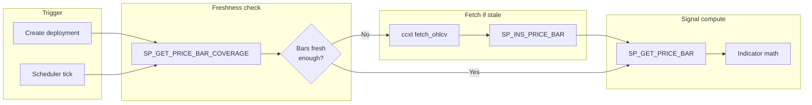
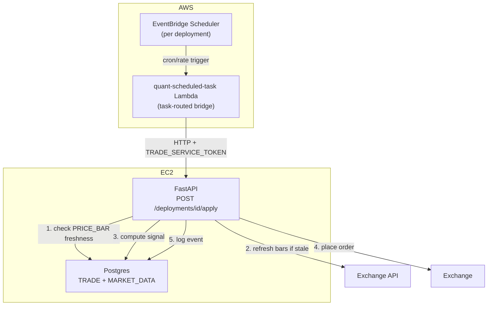

# Scheduler & Price Bars

!!! info "Status"
    **Design — Phase 1.9.** Covers automated trade scheduling via EventBridge and normalized price bars for live signal computation. Backtest cache versioning stays in the application layer (`BacktestCache.refresh_payload`).

**Parent:** [Plan to Profit](plan-to-profit.md) Phase 1.9  
**Related:** [Trade Deployment Rollout](trade-deployment-rollout.md), [Live Order Execution](live-order-execution.md), [Separate Underlying & Cache](separate-underlying.md), [Open questions (scheduler & trade)](scheduler-trade-open-questions.md)

---

## 1. Problem

Phase 1.7 (live apply) is synchronous — the user clicks Apply and the API runs one signal evaluation and places an order. There is no mechanism to execute a deployment automatically at a recurring interval. Two gaps need closing before automated trading is viable:

1. **No scheduler.** `TRADE.DEPLOYMENT` has no schedule metadata; nothing triggers apply at the right time.
2. **No normalized price bars.** Live signal computation currently reads full-history JSONB blobs from `BT.API_REQUEST_PAYLOAD` — wasteful for a scheduler that only needs the latest N bars. A relational bar table enables efficient range scans.

---

## 2. Decisions

| # | Decision | Rationale |
|---|----------|-----------|
| 1 | **EventBridge Scheduler + Lambda** for recurring execution | Schedule lives in AWS, survives instance restarts, idempotent per tick. Lambda is a thin HTTP caller; all business logic stays in FastAPI. |
| 2 | **Predefined intervals only**: `MANUAL`, `1H`, `DAILY` | Matches the bar granularities we store; no arbitrary cron expressions needed for v1. 4H dropped — few metrics exist at 4H, and 1H covers intraday. New intervals are just a REFDATA seed row away. |
| 3 | **Intervals keyed by `REFDATA.TM_INTERVAL`** — not free-text | The table already exists (used by `BT.API_REQUEST.TM_INTERVAL_ID`) but is **unseeded**; `BacktestCache.DEFAULT_TM_INTERVAL_ID = 1` hardcodes daily by convention. Seed it (`1=DAILY`, `2=1H`) and reference it from both `MARKET_DATA.PRICE_BAR` and `TRADE.DEPLOYMENT` — REFDATA stays the single source of truth for dropdowns. |
| 4 | **`MARKET_DATA` schema** for price bars (separate from `BT`) | Live apply reads are distinct from backtest reads. No migration of existing JSONB data. Both coexist. |
| 5 | **On-demand bar population** | Only products with active deployments get bars stored. No bulk ingest of all products. |
| 6 | **Application-owned API_REQUEST refresh** | `BacktestCache.refresh_payload` fetches the caller's range and reinserts via `SP_INS_API_REQUEST`; no DB consolidation SP. |

### 2.1 REFDATA.TM_INTERVAL seed

The table (`TM_INTERVAL_ID IDENTITY`, `NAME`, `DESCRIPTION`) exists since baseline but has no rows. Seed via Liquibase changeset:

| TM_INTERVAL_ID | NAME | PERIOD_LENGTH | DESCRIPTION |
|----------------|------|---------------|-------------|
| 1 | `DAILY` | `1 day` | Daily bars — matches `BacktestCache.DEFAULT_TM_INTERVAL_ID = 1` |
| 2 | `1H` | `1 hour` | Hourly bars |

`PERIOD_LENGTH` is the scheduler step (`last_run + PERIOD_LENGTH`). Poller uses `SP_GET_MISSED_DUE_DEPLOYMENTS`; UI preview may use `SP_GET_NEXT_DUE_DEPLOYMENTS` or compute in Python.

`MANUAL` is **not** a row here — it is not a time interval. Manual-only deployments are expressed as `SCHEDULE_TM_INTERVAL_ID IS NULL`.

!!! note "Seeding an IDENTITY column"
    `TM_INTERVAL_ID` is `GENERATED ALWAYS AS IDENTITY`, so the seed must pin ids explicitly (`INSERT ... OVERRIDING SYSTEM VALUE`) — `1=DAILY` must match the hardcoded `BacktestCache.DEFAULT_TM_INTERVAL_ID = 1` already in production data (`BT.API_REQUEST.TM_INTERVAL_ID = 1` rows).

---

## 3. TRADE.DEPLOYMENT — scheduler config + run state

**Config** (soft-versioned on `DEPLOYMENT` — qty, credential, schedule interval changes bump `DEPLOYMENT_VID`):

| Column | Type | Default | Purpose |
|--------|------|---------|---------|
| `SCHEDULE_TM_INTERVAL_ID` | `INTEGER NULL` | `NULL` | `REFDATA.TM_INTERVAL` id (`DAILY`/`1H`); **NULL = manual only** |

**Run state** (append-only versions on `TRADE.DEPLOYMENT_SCHEDULE_STATUS` — one logical schedule per `DEPLOYMENT_ID`):

| Column | Purpose |
|--------|---------|
| `DEPLOYMENT_SCHEDULE_ID` | Stable UUID (same as `DEPLOYMENT_ID` on create) |
| `DEPLOYMENT_SCHEDULE_VID` | Monotonic version per schedule change / tick advance |
| `DEPLOYMENT_ID` / `DEPLOYMENT_VID` | Links to deployment row at time of write |
| `STATUS` | `PENDING` \| `SUCCESS` \| `FAILED` — poller reads `PENDING` only |
| `SCHEDULED_TS` | **Next due** apply time |

Due check: latest row where `STATUS = 'PENDING'` and `SCHEDULED_TS <= NOW()`. Poller calls **`SP_GET_MISSED_DUE_DEPLOYMENTS(IN_TM_INTERVAL_ID)`** per interval tick (DAILY, 1H, …). After apply, **`SP_INS_DEPLOYMENT_SCHEDULE_STATUS`** with `NEXT_SCHEDULED_TS` from the cursor — no separate advance proc. `TradeRepo` wraps all three; `ScheduleTickRunner` sequences them (§6.3).

`EXECUTION_EVENT` remains a pure execution diary (`TRANSACT_AT` = tick time for audit, `POSITION_QTY` = the signed book the attempt decided against). It carries **no scheduling anchor** — the diary never drives due-ness.

Same pattern as `BT.API_REQUEST.TM_INTERVAL_ID` — an integer reference to `REFDATA.TM_INTERVAL`, no free-text interval strings.

### DDL

```sql
-- TRADE.DEPLOYMENT (config only):
SCHEDULE_TM_INTERVAL_ID  INTEGER,       -- REFDATA.TM_INTERVAL; NULL = manual

-- TRADE.DEPLOYMENT_SCHEDULE_STATUS (scheduler state):
DEPLOYMENT_SCHEDULE_ID, DEPLOYMENT_SCHEDULE_VID, DEPLOYMENT_ID, DEPLOYMENT_VID,
STATUS, SCHEDULED_TS, IS_CURRENT_IND, USER_ID, CREATED_AT
```

### Stored procedure changes

| Procedure | Change |
|-----------|--------|
| `TRADE.SP_INS_DEPLOYMENT_SCHEDULE_STATUS` | Append schedule version (poller advance after apply) |
| `TRADE.SP_INS_DEPLOYMENT` | Seeds / syncs schedule row when interval set |
| `TRADE.SP_INS_EXECUTION_EVENT` | Diary only — no scheduler side effects. `IN_POSITION_QTY` since `1.7.0` |
| `TRADE.SP_GET_DEPLOYMENT` | `LAST_RUN_AT` / `NEXT_DUE_AT` from schedule status |
| `TRADE.SP_GET_MISSED_DUE_DEPLOYMENTS` | `IN_TM_INTERVAL_ID` — enabled, not paused, `PENDING` + due |
| `TRADE.SP_GET_NEXT_DUE_DEPLOYMENTS` | `PENDING` + `SCHEDULED_TS > NOW()` (optional UI) |

### Python

API layer exposes interval by `NAME` (resolved via `RedisRefData` from `refdata:tm_interval`, same pattern as every other REFDATA dropdown); the repo layer persists the integer id. `schedule_tm_interval_id: int | None` (`None` = manual) on `CreateDeploymentRequest` / `DeploymentRow`, plus `last_run_at` / `next_due_at` from `DEPLOYMENT_SCHEDULE_STATUS`. No hardcoded interval enum in Python — valid values come from REFDATA per the [REFDATA single-source-of-truth decision](plan-to-profit.md).

### 3.1 Product UX — how scheduling is enabled

Two layers must not be conflated:

| Layer | What it is | Enablement |
|-------|------------|------------|
| **Platform schedules** | `price_bar_sync` and `trade_apply_tick` in `config/scheduler/` | Always on in EventBridge — no per-deployment toggle |
| **Per-deployment schedule** | `SCHEDULE_TM_INTERVAL_ID` on `TRADE.DEPLOYMENT` | Explicit user opt-in via the product UI |

**Decision: UI control with manual as the default — not auto-enable on deploy.**

- **`NULL` (manual only) stays the create default.** Deploying a strategy is not the same as opting into automated trading. Paper deployments, one-off applies, and dry-run workflows must not silently start placing orders on the hourly tick.
- **Do not default `schedule_tm_interval_id` in the API** when the client omits the field. The 1.4.0 backfill (`SCHEDULE_TM_INTERVAL_ID = 1` on existing open rows) was migration hygiene, not product policy.
- **Do not add a separate “enable price sync” control** *for a deployment*. `price_bar_sync` derives its instrument list from `SP_GET_SCHEDULED_INSTRUMENTS` — any deployment with a non-null schedule and `IS_ENABLED_IND = 'Y'` is warmed automatically. Manual deployments still fetch bars on each apply via `ensure_fresh`. Capturing bars for an instrument **nobody is trading yet** is a different question, and decision #5 does not serve it — see §3.2.
- **Do not create per-deployment EventBridge schedules.** One platform tick serves every interval (§6.2).

**Shipped UI:**

1. **`DeploymentDialog`** — `REFDATA.TM_INTERVAL` dropdown: *Manual only* (`null`), *Daily* (`1`), *Hourly* (`2`, disabled — see §3.1.1). Default selection: **Manual only**. Helper copy states that manual means the Apply button only and no scheduled price data, while a cadence applies on each closed bar and keeps the product's bars current.
2. **`TradeApplyPage`** — `ScheduleCell` in a Schedule column: the same dropdown, editable in place via `PATCH /trade/deployments/{id}`, with `next_due_at` beneath it when scheduled.
3. **Live cadence takes its own confirmation.** Automating a live deployment is a second, separate tick-box in the dialog (`I confirm automatic live trading on this schedule`) and a `window.confirm` on the inline edit. One manual live apply is a human watching a single order; an hourly cadence is unattended real money, so the existing live confirmation does not cover it. Switching mode re-arms it.

Labels come from `REFDATA.TM_INTERVAL.DISPLAY_NAME` (`1.7.0`). The table had no such column, since nothing displayed an interval until this control; without it the frontend would have to map `NAME` (`DAILY`, `1H`) to friendly text, which the REFDATA single-source-of-truth decision forbids. `intervalLabel()` falls back to `NAME` so a database that predates the migration renders `DAILY` rather than a blank row. `REFDATA.SP_GET_ENUM` opens `SELECT *`, so the column reached Redis and the API with no procedure change.

**Still optional:** smart pre-selection — when launching from Promotion with a backtest job, pre-select the interval matching the job's bar cadence if known, otherwise stay on Manual. Not built; Manual is always the default today. Note that §3.1.1 makes this cosmetic rather than protective: an unfitted cadence can no longer be *chosen*, so pre-selection would only save a click.

`schedule_tm_interval_id` remains settable directly via `PATCH /api/v1/trade/deployments/{id}` or on `POST /api/v1/trade/deployments`.

#### 3.1.1 The cadence is not free — it selects the bars, not just the clock

Choosing a cadence looks like choosing a frequency, but `LiveApplyOrchestrator`
resolves the deployment's interval straight into the window it loads, so the
schedule also decides **which bars the signal is computed from**. Every backtest
on this platform fits on **daily** bars, so putting a strategy on the hourly
cadence would run daily-fitted parameters over hourly bars.

That combination fails **silently**, which is what makes it the dangerous one: a
20-period band computes perfectly well over 20 hourly bars, the signal has the
right shape, the order places, and the execution diary looks healthy. Nothing in
the stack can tell the difference between a position justified by a backtest and
one justified by arithmetic nobody fitted.

`quant/trade/schedule_policy.py` closes it:

| Piece | Behaviour |
|---|---|
| `schedulable_interval_ids(refdata)` | `RedisRefData.resolve_interval_id(FITTED_BAR_PERIOD)` — the module states the fitted **period** (`timedelta(days=1)`) and REFDATA owns what that period is numbered, exactly as an unscheduled apply resolves its cadence (decision #45). No interval id is hardcoded, so renumbering `DAILY` moves the guard with it |
| `require_fitted_interval()` | **400** on create and on update, naming both the rejected and the fitted cadence via `RedisRefData.interval_label()`. `null` (manual) always passes — it prices off the fitted daily interval |
| `GET /trade/schedule-options` | Publishes the same set so `DeploymentDialog` and `ScheduleCell` grey out what the API would refuse, instead of the frontend re-stating a backtest-side rule |

`interval_label()` lives on `RedisRefData` beside `resolve_interval_id` and
`get_interval_period`, not in the trade module: every `REFDATA.TM_INTERVAL`
lookup stays in the one class that owns the snapshot (decision #44), so no
caller reads raw `tm_interval` rows to render a name. It falls back
`DISPLAY_NAME → NAME → id`, because its only callers are error messages and one
that cannot name an interval must still say which one it meant.

The fitted period widens to a set when multi-interval backtests land, and
`FITTED_BAR_PERIOD` is the one line that changes.

Two deliberate choices in that guard:

- **Update validates only what the caller sets**, never the stored value.
 A deployment whose cadence predates this rule must stay reachable by the kill
 switch; refusing its `PATCH` would mean refusing to disable it.
- **Unfitted cadences are disabled, not hidden.** A missing option reads as a
 missing feature; a greyed one with the helper line beneath it says the schedule
 chooses the bars, which is the thing users do not expect.

### 3.2 Capturing bars for an instrument nobody trades yet

Decision #5 ties bar population to active deployments, so today the only way to
accumulate history for a product is to deploy a strategy against it. That does
not serve a real need: **wanting the data before deciding to trade**, because
the backtest that informs the decision needs history that does not exist yet.

Two things make the coupling incidental rather than necessary:

- **Bars are public.** `CcxtBarFetcher` builds a *keyless* ccxt client (§7.5), so
  capture needs no credential, no strategy and no quantity — none of what a
  `TRADE.DEPLOYMENT` row exists to carry.
- **The divergence in §7.7 is what capture would fix.** Parameters fitted on
  provider history are traded against exchange prints, so the same config can
  produce a different position on the same day. Capturing a venue's bars ahead of
  time is what would let a strategy be fitted on the series it will actually trade.

It needs an instrument subscription independent of `TRADE.DEPLOYMENT` (the warmer
would union it with `SP_GET_SCHEDULED_INSTRUMENTS`), `PriceBarService.backfill`
exposed — it exists and is reachable from no route or CLI — and the backtest read
path pointed at `PRICE_BAR`, which §4.6 argues is additive but is not wired.
Capture alone would accumulate bars that backtest still cannot see.

**Designed in full, not built:** [Market Data Capture](market-data-capture.md)
carries the subscription shape, where the warm loop should live once "which
instruments matter" stops being a deployment question (§7.8), and the
`data_source`-based backtest seam.

---

## 4. MARKET_DATA schema — price bars for live apply

A new Postgres schema for normalized OHLCV data. Serves the live apply pipeline only — backtest continues using `BT.API_REQUEST_PAYLOAD` JSONB blobs unchanged.

### 4.1 `MARKET_DATA.PRICE_BAR`

```sql
CREATE SCHEMA IF NOT EXISTS MARKET_DATA;

CREATE TABLE MARKET_DATA.PRICE_BAR (
    INTERNAL_CUSIP   TEXT          NOT NULL,   -- INST.PRODUCT convention
    TM_INTERVAL_ID   INTEGER       NOT NULL,   -- REFDATA.TM_INTERVAL (1=DAILY, 2=1H)
    BAR_TIMESTAMP    TIMESTAMPTZ   NOT NULL,   -- bar open time (UTC)
    OPEN_PX          DECIMAL       NOT NULL,
    HIGH_PX          DECIMAL       NOT NULL,
    LOW_PX           DECIMAL       NOT NULL,
    CLOSE_PX         DECIMAL       NOT NULL,
    VOLUME           DECIMAL       NOT NULL,
    SOURCE_APP_ID    INTEGER       NOT NULL,   -- REFDATA.APP (e.g. Bybit=34)
    USER_ID          TEXT          NOT NULL,   -- audit convention (service user)
    CREATED_AT       TIMESTAMPTZ   NOT NULL DEFAULT NOW(),

    PRIMARY KEY (INTERNAL_CUSIP, TM_INTERVAL_ID, SOURCE_APP_ID, BAR_TIMESTAMP)
);
```

**PK rationale:** `(INTERNAL_CUSIP, TM_INTERVAL_ID, SOURCE_APP_ID, BAR_TIMESTAMP)` is the natural unique key. **`SP_INS_PRICE_BAR` is plain `INSERT`** — the app reads coverage / existing bars first and only passes missing bars. A duplicate PK raises `unique_violation` (visible failure); there is no silent upsert or `ON CONFLICT`.

!!! warning "`SOURCE_APP_ID` is in the key, not payload — decision #47"
    One `INTERNAL_CUSIP` is traded on several venues: decision #21 makes `btcusdt.crypto` a single product with a per-broker `INST.PRODUCT_XREF` row for Bybit **and** Binance. A venue-blind key lets whichever venue writes a timestamp first own it; the loser's insert raises `unique_violation`, `PriceBarService` absorbs it as a benign race, and that deployment's signal is then computed on the winner's prints. The window silently blends two order books and a backtest over it does not reproduce.

    Consequences that follow from the wide key:

    - **Every read scopes to one source.** `SP_GET_PRICE_BAR` and `SP_GET_PRICE_BAR_COVERAGE` both take `IN_SOURCE_APP_ID`. Coverage especially — unscoped, one venue's bars would mark another as fresh and the second venue would never fetch.
    - **A paid backfill provider is just another `SOURCE_APP_ID`**, sitting alongside live exchange bars rather than colliding with them. This is what makes the table usable as one source of truth for backtest and trade.
    - **Prices are not expected to agree across sources.** Bybit and Binance are separate order books, and provider daily bars differ again in session convention and adjustment. The guarantee is consistency *within* a series, not equality *between* them.

!!! note "No soft-versioning columns — deliberate"
    `PRICE_BAR` intentionally has **no** `TRANSACT_FROM/TO_TS` or `IS_CURRENT_IND`. Those fit mutable entities (`DEPLOYMENT`, `STRATEGY`) where a logical row gets superseded. A price bar is an **immutable fact** — nothing supersedes it.

    **Latest bar / freshness:** `SP_GET_PRICE_BAR_COVERAGE` → `MAX_BAR_TIMESTAMP` (`ORDER BY … DESC LIMIT 1`). **Bounds for catch-up:** same proc → `MIN_BAR_TIMESTAMP` / `MAX_BAR_TIMESTAMP` (two index probes; gap count derived in app from interval).

    1H and DAILY are separate PK subtrees — neither interval's volume affects the other's lookups. So are two venues on the same instrument.

**Indexes:**

```sql
CREATE INDEX IX_PRICE_BAR_LATEST
    ON MARKET_DATA.PRICE_BAR (INTERNAL_CUSIP, TM_INTERVAL_ID, SOURCE_APP_ID, BAR_TIMESTAMP DESC)
    INCLUDE (CLOSE_PX);
```

`IX_PRICE_BAR_LATEST` serves range scans (DESC), latest-bar / coverage probes (`ORDER BY … LIMIT 1`), and index-only latest `CLOSE_PX`. PK covers uniqueness and forward ASC reads. Both lead with the same four columns every read filters on, so a venue's series is one contiguous subtree.

### 4.2 Stored procedures

| Procedure | Purpose |
|-----------|---------|
| `MARKET_DATA.SP_GET_PRICE_BAR_COVERAGE` | `MIN`/`MAX` bar timestamps via `ORDER BY … LIMIT 1` (two index probes) — freshness uses `MAX` |
| `MARKET_DATA.SP_GET_PRICE_BAR` | OHLCV range read for signal computation |
| `MARKET_DATA.SP_INS_PRICE_BAR` | Insert **one bar** per call; plain `INSERT`. Writes no `LOG_PROC_DETAIL` row — one audit row per bar ([decision #59](../decisions.md)) |

**Division of labour:** the DB stores and reads bars; the **app** decides what window it needs, compares `SP_GET_PRICE_BAR_COVERAGE` to required range, fetches missing bars from the exchange, inserts gaps via `SP_INS_PRICE_BAR`. Single source of truth — no sync table.

### 4.3 Volume projections

| Interval | Bars/product/year | 10 products x 5 years | Row size est. |
|----------|-------------------|-----------------------|---------------|
| DAILY | 365 | 18,250 | ~120 bytes |
| 1H | 8,760 | 438,000 | ~120 bytes |
| **Total** | **9,125** | **456,250** | **~52 MB** |

Partitioning is not required at this scale. Revisit if product count exceeds 100.

### 4.4 On-demand population flow



**Freshness rule:** A bar set is "fresh enough" if `MAX_BAR_TIMESTAMP` from `SP_GET_PRICE_BAR_COVERAGE` is within one interval of now. For `DAILY`, if the latest bar is from today or yesterday, no fetch needed.

**Crash catch-up:** On retry, call `SP_GET_PRICE_BAR_COVERAGE` — compare `MIN`/`MAX` to the required window, fetch gaps, `SP_INS_PRICE_BAR` per missing bar (row-count check in app from interval + bounds).

### 4.5 Relationship to BT.API_REQUEST_PAYLOAD

| Concern | BT.API_REQUEST_PAYLOAD | MARKET_DATA.PRICE_BAR |
|---------|------------------------|----------------------|
| Purpose | Full-history backtest data (multi-year JSONB) | Normalized bars for **live signal computation** |
| Format | Single JSONB document per version | One row per bar (relational) |
| Query pattern | Load entire blob, parse in Python | SQL range scan |
| Write pattern | Full replace per version | Append-only insert (caller supplies missing bars only) |
| Used by | Backtest CLI, optimize worker | **Live apply scheduler, dry-run** |

Both coexist. There is no migration of data between them.

### 4.6 Backtest compatibility — same DataFrame contract

Backtest is **not required** to read `PRICE_BAR`, but the read path must not paint it into a corner. `PriceBarService.read_bars()` returns the **exact DataFrame shape the pipeline already consumes** (what `fetch_df` / `BacktestCache._payload_to_df` produce today):

| Pipeline column | Source in PRICE_BAR |
|-----------------|---------------------|
| index (`datetime`, UTC) | `BAR_TIMESTAMP` |
| `price` | `CLOSE_PX` |
| `factor` | `CLOSE_PX` (same as `price`, default) |
| `Open` / `High` / `Low` / `Close` / `Volume` | `OPEN_PX` / `HIGH_PX` / `LOW_PX` / `CLOSE_PX` / `VOLUME` |

Because the contract matches, `Performance` / indicator math work on bars from either source with **zero changes**. If backtest later wants intraday backtests on 1H bars, it plugs `read_bars()` in as another fetcher behind the same interface — an additive change, not a rework.

Reproducibility is what makes that safe, and it rests on decision #47: a backtest must pin `source_app_id`, because the same `(internal_cusip, tm_interval_id, bar_timestamp)` legitimately holds a different price per venue. A run pinned to a source re-reads identically no matter how many venues later start writing; an unpinned run would not. A paid historical provider backfilled under its own `SOURCE_APP_ID` sits beside the live exchange bars rather than overwriting them, so research history and traded history stay separable and comparable.

#### Continuity is not automatic — `ensure_fresh` is a rolling window

`ensure_fresh` repairs only `[newest - period × (lookback - 1), newest]`, and `lookback` is `live_lookback_bars(window) = max_window × 3 + 60` — a **bar count**, so what it covers in wall-clock time depends entirely on the interval:

| Interval | 120 bars covers | Host down 5 days | Host down 10 days |
|----------|-----------------|------------------|-------------------|
| DAILY | 120 days | fully repaired | fully repaired |
| 1H | 5 days | just covered | days 5–10 never requested again |
| 15m | 30 hours | lost | lost |

Bars older than the window are never asked for a second time, so the hole is permanent. That is fine for trading — `load_window` needs only the window and fails closed if it cannot complete it — but it means the table is a rolling window maintained as a *side effect of trading*, not a continuous history.

`PriceBarService.backfill(internal_cusip, tm_interval_id, source_app_id, start, end)` is what closes that gap: an explicit range, every hole in it filled. `find_gaps(...)` answers the same question read-only, without touching the exchange.

Backfill deliberately **does not fail closed**, inverting the rule the rest of this module follows. On the trade path a hole must stop the run because a wrong trade beats no trade; during a repair a hole is ordinary — the range may predate the listing, or reach past what the venue retains — and aborting would discard the bars that *were* recoverable. `BackfillResult.unfilled` reports what could not be filled, and `is_continuous` is the check a backtest should make before trusting a range.

Backfill depth is bounded by the venue, not by us: ccxt `fetch_ohlcv` history varies by exchange and timeframe, and deep intraday history is often unavailable at any price. A provider under its own `SOURCE_APP_ID` is the answer where the exchange cannot reach back far enough.

### 4.7 Failure modes and error handling

Same contract philosophy as `BacktestCache`: **reads may degrade loudly, writes never silently fail.** For trading, the overriding rule is **fail closed — never trade on data we cannot verify.**

| Failure | Behaviour |
|---------|-----------|
| **Apply fails** (order rejected, broker error) after signal computed | Retry up to **3 times** same `SCHEDULED_TS` (app). Then `SP_INS_DEPLOYMENT_SCHEDULE_STATUS` with `NEXT_SCHEDULED_TS` from GET cursor. Diary in `EXECUTION_EVENT`. |
| **Exchange fetch fails** (ccxt down, rate-limited, timeout) at scheduler tick | Do **not** compute a signal on stale bars. Abort the run, write `TRADE.EXECUTION_EVENT` row with `IS_SUCCESS_IND='N'` — schedule is **not** advanced (tick did not complete). Retry on next poll; does not consume the 3-attempt budget. |
| **Bars stale but within tolerance** (fetch OK, exchange lagging one bar) | Freshness rule (§4.4) decides: if `MAX_BAR_TIMESTAMP` is within one interval of now, proceed; otherwise treat as fetch failure above. |
| **Gap in bars** (exchange downtime, missed ticks) | `SP_GET_PRICE_BAR` returns what exists; `PriceBarService` validates row count vs expected window and refetches the missing range (ccxt `fetch_ohlcv` accepts a `since` param). If the gap persists, fail closed as above. |
| **Host down longer than the live lookback** | `ensure_fresh` refills the window and trading resumes on correct prices — a closed candle is immutable, so a bar fetched ten days late is identical to one fetched at the boundary. Bars *older* than the window are never requested again, so the table keeps a permanent hole (see [§4.6](#continuity-is-not-automatic-ensure_fresh-is-a-rolling-window)). Repair with `PriceBarService.backfill` over an explicit range; trading is unaffected either way. |
| **Instrument listed more recently than the lookback** | `ensure_fresh` tolerates it (warns, treats as pre-listing history) so warming still works; `load_window` refuses below **80% coverage** of the requested lookback, because an indicator computes happily on a short window and would return a plausible number off statistics the strategy was never fitted on. See [§7.3](#73-price-bar-service-quantmarket_dataservicepy). |
| **Partial (still-forming) bar** | Never inserted, and guarded twice: `ensure_fresh` never requests past `last_closed_bar`, and the fetcher discards any row with `ts > until` — the exchange *does* return the current candle when the window includes it. This matters because `PRICE_BAR` is append-only with a natural PK: a forming bar's high/low reflect only the elapsed portion, so storing one would freeze wrong values permanently and the corrected bar would later hit `unique_violation` instead of replacing it. Requires the newest-closed-bar decision to happen *after* the boundary settles — the sync fires on it and sleeps 10 s before reading the clock; see [Schedule timing](#schedule-timing-warm-at-00-apply-at-05). |
| **Crash before insert commits** | `SP_GET_PRICE_BAR_COVERAGE` unchanged — refetch missing range, `SP_INS_PRICE_BAR` per bar. |
| **Crash after insert, before apply** | Coverage shows new bars — skip fetch/insert, re-run apply. |
| **Duplicate insert** | `SP_INS_PRICE_BAR` stays a plain INSERT and reports `unique_violation` — the SP does not hide it. `PriceBarService` treats **that one SQLSTATE (23505)** as a lost race and moves on; any other `ProcedureError` propagates. Deployments sharing an instrument and interval fire at the same boundary, so several legitimately decide the same bar is missing before any of them writes; the winner stored the same bar the losers fetched. That last clause only holds because `SOURCE_APP_ID` is in the key (decision #47) — a conflict therefore means the *same venue's* same bar. Venue-blind, this same swallow would quietly adopt another exchange's print. A genuine double-insert is already ruled out by the missing-set calculation, so absorbing it here costs no real safety. |
| **DB write fails after successful fetch** | Propagates (same as `BacktestCache.refresh_payload` contract). The scheduler run fails loudly; no order is placed on unpersisted data. |
| **Timezone bugs** | Everything is `TIMESTAMPTZ` stored UTC; `BAR_TIMESTAMP` is the bar **open** time. Python side uses tz-aware UTC (`pd.Timestamp` convention already enforced by `BacktestCache._to_utc`). |

---

## 5. BT.API_REQUEST versioning (application-owned)

### 5.1 Problem

Every "Refresh dataset" click creates a new `API_REQ_VID` in `BT.API_REQUEST` and a corresponding JSONB blob in `BT.API_REQUEST_PAYLOAD`. The **current** row (`TRANSACT_TO_TS = '9999-12-31'`) always holds the merged history the app needs; closed VIDs are superseded and are not read by the cache path.

### 5.2 Refresh contract (no DB consolidation SP)

`BacktestCache.refresh_payload` owns the write path:

1. Look up the current row for `(APP_ID, APP_METRIC_ID, TM_INTERVAL_ID, INTERNAL_CUSIP)`.
2. Fetch the requested `[RANGE_START_TS, RANGE_END_TS]` from the provider (the smallest range the caller needs for that refresh).
3. Call `BT.SP_INS_API_REQUEST` with the existing `API_REQ_ID` — the SP closes the prior VID and inserts a new current row + payload with the merged range.

There is **no** `BT.SP_CONSOLIDATE_API_REQUEST`. Purging closed rows / partition retention is separate future work ([Separate Underlying & Cache](separate-underlying.md) § scheduled purge of closed versions).

---

## 6. EventBridge Scheduler architecture



Lambda is a thin HTTP caller with a service auth token. All business logic stays in the FastAPI app.

### 6.1 AWS resources (implemented)

CloudFormation stack `quant-scheduler` — template `aws/cfn/04-scheduler.yml`. Ops detail: [Infrastructure — Trade scheduler](../architecture/infrastructure.md#trade-scheduler-eventbridge-lambda).

| Resource | Name |
|----------|------|
| Schedule group | `quant-trade-deployments` |
| Lambda | `quant-scheduled-task` (`aws/lambda/scheduled-task/handler.py`) |
| Scheduler invoke role | `quant-scheduler-invoke` |
| Lambda execution role | `quant-scheduled-task-lambda` (CloudWatch Logs + SSM read of the service token) |
| EC2 manage policy | `quant-ec2-scheduler-manage` (on `quant-ec2-role`) |
| Service token SSM | `/quant/prod/TRADE_SERVICE_TOKEN` — fetched by the Lambda at cold start (CloudFormation does not support `ssm-secure` in Lambda env vars) |

The `deploy` workflow's `cfn` job runs this stack on pushes touching
`aws/cfn/04-scheduler.yml`, `aws/lambda/scheduled-task/**`, or
`config/scheduler/**`, and on a manual dispatch. Locally:

```bash
bash aws/scripts/init-ssm-params.sh   # creates TRADE_SERVICE_TOKEN if missing
bash aws/deploy.sh scheduler          # CFN + Lambda zip + sync_schedules.py
```

### 6.2 Schedule management — one platform tick, not a schedule per deployment

!!! note "Supersedes the `ScheduleTrigger` seam"
    This section previously specified a `ScheduleTrigger` abstraction that
    created, updated and deleted **one EventBridge schedule per deployment** via
    boto3 on create/update/stop. That was dropped in favour of a single
    platform-owned schedule. Reasons below; nothing creates AWS schedules from
    application code any more, so `SCHEDULER_BACKEND` is gone too.

Deployment create/update/stop writes only to the database. **Nothing calls
boto3.** One EventBridge schedule, defined in
`config/scheduler/trade_apply_tick.yml` and applied by `sync_schedules.py` like
every other job, wakes the platform hourly:

```
EventBridge (hourly) → Lambda {"task": "trade_apply_tick"}
                     → POST /api/v1/scheduler/tick
                     → ScheduleSweeper.sweep()
                     → ScheduleTickRunner.run_interval() per TM_INTERVAL_ID
```

**Why not a schedule per deployment.** It would make AWS a second source of
truth for something the database already owns. A stop that succeeds in Postgres
but fails to delete the schedule leaves an orphan that keeps invoking apply — a
live trader absent from the UI. With one sweep, stopping a deployment removes it
from `SP_GET_MISSED_DUE_DEPLOYMENTS` and it stops trading by construction. The
sweep also needs no IAM role for the app, no schedule naming scheme and no
reconciliation job.

The cost is granularity: the sweep can only act as often as it wakes. Hourly
covers `REFDATA.TM_INTERVAL` as it stands (`DAILY`, `1H`); an interval shorter
than the wakeup would need the schedule tightened.

**Auth.** `/trade/deployments/{id}/apply` requires a human — it trades on the
caller's own account — so the Lambda's service token cannot use it, and no
scheduled job names it. The tick is the platform's own route, gated by
`require_user_or_service`, and it applies each due deployment as the
`APP_USER_ID` that `SP_GET_MISSED_DUE_DEPLOYMENTS` returns for it. Scheduled
trading therefore needs no human token and no loosening of the human route.

**Shared state, different alarm clock.** Schedule config lives on soft-versioned
`DEPLOYMENT`; scheduler cursor on append-only `DEPLOYMENT_SCHEDULE_STATUS`.
Due-ness = latest `PENDING` row with `SCHEDULED_TS <= NOW()` via
`SP_GET_MISSED_DUE_DEPLOYMENTS`. EventBridge and the local poller are just two
ways of waking up. The tick calls `SP_INS_DEPLOYMENT_SCHEDULE_STATUS` after
apply; `live_apply` appends `EXECUTION_EVENT` only — separate concerns.

**The pass itself** — `ScheduleSweeper` in `quant/trade/scheduler/sweep.py`,
shared by both drivers so they cannot disagree about what a tick does. It reads
`RedisRefData.interval_ids()` and hands each to `ScheduleTickRunner.run_interval`,
which reads `SP_GET_MISSED_DUE_DEPLOYMENTS(IN_TM_INTERVAL_ID)`, invokes
`TradeService.apply_deployment` **in-process**, then advances the cursor via
`SP_INS_DEPLOYMENT_SCHEDULE_STATUS` using `NEXT_SCHEDULED_TS` off the due row. A
failure in one interval is logged and the others continue.

Sweeping all intervals beats tracking which ones have deployments: an empty
interval costs one read returning no rows, which is cheaper than keeping a
subscription list correct across create/pause/reschedule. It is also what lets
one hourly wakeup serve a `DAILY` strategy — that deployment is simply not due
on most passes.

`ScheduleSweeper.settle_s` (`DEFAULT_SETTLE_S = 10s`, used by the endpoint and
not by the poller) waits before asking what is due. The apply schedule fires at
`:05` UTC (`cron(5 * * * ? *)`), five minutes after `price_bar_sync` at `:00`,
so the warm usually finishes first. The settle still clears a cursor standing
exactly on the boundary: delivery a few milliseconds early would answer "not yet"
and wait a whole interval. Overlap is safe regardless — the bar insert treats a
unique violation as a concurrent write.

The tick runner is **application-scoped** (`app.state.schedule_sweeper`, built
in `quant/api/main.py`). Its per-`(deployment, due time)` attempt budget lives in
memory, and that budget is what eventually abandons a deployment that cannot
trade so its schedule moves on. Rebuilt per request, the count would reset on
every wakeup and a broken deployment would retry for ever.

**Local poller** (dev) — `SchedulePoller` in `quant/trade/scheduler/poller.py`
supplies wakeups only, every `poll_interval_s` (default 60s), plus a startup
drain. It dispatches the sweep through `asyncio.to_thread`, since the pass blocks
on HTTP and DB and must not stall the API sharing the process.

#### 6.3.1 Startup drain — missed wakeups are the normal case

WSL stops outright when the laptop lid closes, so the local backend *will* miss
ticks. `SchedulePoller.run` therefore drains before its first timed pass, and
draining is only the tick repeated: each pass advances a due deployment by
exactly one interval, so a three-day daily gap takes three passes and leaves a
`DEPLOYMENT_SCHEDULE_STATUS` row per owed slot. That per-slot history is the
record of what the downtime cost — see decision #46.

The drain stops as soon as a pass moves nothing. A deployment that failed with
attempts left reports `RETRYING` and is deliberately left due, so its budget is
spent across poll cycles rather than burned in a tight loop. A pass reporting
`STUCK` — applied, but the cursor would not move — **aborts** the drain: another
immediate pass would place a second order seconds later. `max_drain_passes`
(default 2000) bounds the loop regardless.

> [!IMPORTANT]
> Catch-up does **not** replay the missed period. `load_window` derives its
> window from `now()`, so every pass computes today's signal and any order fills
> at today's price. Repeated applies converge rather than stack — `intended_side`
> compares the signal against the live broker position and returns `HOLD` once it
> already matches, so a three-day gap is one trade plus two no-ops.

Rejected for dev: **LocalStack** (EventBridge Scheduler emulation is
paid-tier; would test the emulator, not our logic) and **cron + curl**
(needs the service token on the dev box, machine must be awake, bypasses
`EXECUTION_EVENT` bookkeeping).

#### Bar sync is one schedule per interval, not one per deployment

Apply schedules are per-deployment, so N deployments trading `btcusdt.crypto` on 1H wake at the same instant. Without a shared warm-up each one fetches the same bar and they race to insert it.

`PriceBarService.sync(instruments, tm_interval_id, lookback)` collapses that: **one schedule per `TM_INTERVAL_ID`** fires shortly before the apply schedules, derives the distinct `(INTERNAL_CUSIP, APP_ID)` set from the due deployments, and fetches each instrument once. Duplicates are folded inside `sync`, since the caller passes deployment rows straight through.

It is **best effort and not a correctness dependency.** One unreachable symbol is recorded in `SyncResult.failures` and the batch continues; every apply still calls `ensure_fresh` and still fails closed on its own. A failed sync costs a redundant fetch on the apply path, never a bad trade. That is what lets sync catch broadly where apply must not.

All of that wiring is now in place: `POST /api/v1/market-data/price-bars/sync` is served, and `config/scheduler/price_bar_sync.yml` declares the task, its path and an hourly expression. One schedule covers every interval rather than one per `TM_INTERVAL_ID` — the warmer sweeps them all, so an interval with no deployments contributes no rows (§7.8).

#### Schedule timing — warm at :00, apply at :05

Two platform schedules, staggered:

| Task | Expression | In-process settle | Effective start |
|------|------------|-------------------|-----------------|
| `price_bar_sync` | `cron(0 * * * ? *)` | `BarWarmer.DEFAULT_SETTLE_S` = 10s | ~`:00:10` UTC |
| `trade_apply_tick` | `cron(5 * * * ? *)` | `ScheduleSweeper.DEFAULT_SETTLE_S` = 10s | ~`:05:10` UTC |

**Warm on the boundary, apply five minutes later.** `price_bar_sync` fires at
`:00` and sleeps before reading the clock so the exchange can publish the candle
that just closed. `trade_apply_tick` at `:05` gives the warm several minutes to
finish; every apply still calls `ensure_fresh` and fails closed on its own, so a
slow warm costs a redundant fetch, never a bad trade.

`PriceBarService` computes its target as `last_closed_bar(now, period)`, so any
firing time within the same closed interval resolves to the same bar. The 10s
warm settle and the `:05` apply offset are about exchange publish latency and
ordering, not changing which bar is targeted.

This applies to the EventBridge path. The local poller's ~60s cycle is naturally
offset; `ScheduleSweeper` uses `settle_s=0` there.

### 6.3 Lambda function

Handler lives in-repo (stdlib + Lambda-bundled boto3 — no layers). It is a
**generic bridge**: the event carries the task name *and* the path, and the
token is fetched from SSM at cold start. Event shapes:

```json
{"task": "trade_apply_tick",  "path": "/api/v1/scheduler/tick"}
{"task": "price_bar_sync",    "path": "/api/v1/market-data/price-bars/sync"}
{"task": "log_proc_summary",  "path": "/api/v1/admin/log-proc-summary/summarize"}
```

Each calls `POST {API_BASE_URL}<path>` with
`Authorization: Bearer {TRADE_SERVICE_TOKEN}`.

**The path is declared in `config/scheduler/<task>.yml`, and nowhere else.**
`sync_schedules.py` copies both fields into the schedule's target input, so
adding a task is one YAML file — no handler change and no Lambda redeploy.

That replaced a `_TASK_PATHS` dict in the handler. The dict made three artefacts
have to agree (YAML `task`, the map, the served route) when it was itself a
second copy of what the YAML implied, kept in step only by a unit test. It also
served as an allowlist of paths the service token could reach; the API's own gate
is the real control there, since `require_user_or_service` admits the token on
three routers and every route touching a user's account demands a human token
regardless of path. The handler does still reject a `path` that is a URL rather
than an absolute path, so an event cannot redirect the token to another host.

No path carries substitution fields, because every scheduled route acts on
*everything due* — which is what keeps one schedule serving all deployments; a
`{deployment_id}` would imply something has to create a schedule per row (§6.2).
`tests/unit/test_scheduled_task_paths.py` checks each declared path against the
gated routers and pins both that property and the absence of any job pointing at
the human-only apply route.

### 6.4 Service auth (implemented)

Lambda authenticates via `TRADE_SERVICE_TOKEN` (SSM SecureString), not a user JWT. `require_user_or_service` admits either: the service token for scheduled execution, or a session for manual apply.

The gate is applied at **router level** in `quant/api/main.py` for the routers the Lambda drives (`admin`, `market_data`, `scheduler`), so a new maintenance route cannot be added without one; a route that needs a human adds `require_user` itself. Refusals are pinned in `tests/unit/test_service_token_auth.py` — an unset, blank or placeholder secret admits nothing, since a gate that fails open is worse than one that never worked.

This is what makes scheduled trading possible without a per-user token: the tick
route admits the service token, and resolves each deployment's owner from the
database rather than from the caller (§6.2).

---

## 7. Python layer

### 7.1 Interval resolution — REFDATA, not a Python enum

No hardcoded interval enum. Valid intervals come from `REFDATA.TM_INTERVAL` via `RedisRefData` (same pattern as indicator/strategy dropdowns). API request/response models carry `schedule_interval: str | None` (the `NAME`, e.g. `"DAILY"`; `None` = manual); the repo layer resolves `NAME` to `TM_INTERVAL_ID` before calling SPs — mirroring how `BacktestCache` resolves `app_id`/`app_metric_id` through its refdata reader.

### 7.2 Interval arithmetic — `quant/shared/intervals.py`

Bar boundaries and scheduler ticks are the same arithmetic, so it lives in one cross-cutting module instead of once per caller:

```python
parse_period(value)            # REFDATA PERIOD_LENGTH → timedelta
floor_to_period(ts, period)    # bin from the Unix epoch: DAILY → 00:00 UTC, 1H → top of hour
last_closed_bar(now, period)   # newest bar that has finished forming
next_run_at(after, period)     # next boundary — UI display only
ccxt_timeframe(period)         # timedelta → "1h" / "1d"
```

The module is pure arithmetic and does no I/O. The REFDATA lookup itself is `RedisRefData.get_interval_period(tm_interval_id) -> timedelta`, which sits with the other resolvers (`resolve_app_id`, `resolve_queue_status_id`) rather than in `shared/`.

`parse_period` accepts both a `timedelta` (straight from psycopg) and the stringified form (`"1 day, 0:00:00"`) that REFDATA rows carry after the publisher's `json.dumps(default=str)` round-trip through Redis — a caller should not have to know which side its row came from.

Poller due-ness still comes from `SP_GET_MISSED_DUE_DEPLOYMENTS`; `next_run_at` is display only.

### 7.3 Price bar service — `quant/market_data/service.py`

```python
class PriceBarService:
    """Freshness check, gap fill and range read."""

    def ensure_fresh(self, *, internal_cusip, tm_interval_id, source_app_id, lookback, now=None) -> int:
        """Coverage probe; on a stale tail, reconcile the window and insert what is missing."""

    def sync(self, *, instruments, tm_interval_id, lookback, now=None) -> SyncResult:
        """Warm many instruments once per interval — see §6.2. Best effort."""

    def backfill(self, *, internal_cusip, tm_interval_id, source_app_id, start, end=None) -> BackfillResult:
        """Fill every hole in an explicit range — see §4.6. Reports, never raises."""

    def find_gaps(self, *, internal_cusip, tm_interval_id, source_app_id, start, end) -> list[datetime]:
        """Boundaries with no stored row. Read-only; no exchange call."""

    def read_bars(self, *, internal_cusip, tm_interval_id, source_app_id, start, end) -> pd.DataFrame:
        """Bars in the DataFrame shape of §4.6, from one source (decision #47)."""

    def load_window(self, internal_cusip, lookback, *, tm_interval_id, source_app_id, now=None) -> pd.DataFrame:
        """`ensure_fresh` then `read_bars` — the live-apply entry point."""
```

`ensure_fresh` gates on `MAX_BAR_TIMESTAMP >= last_closed_bar` (§4.4). When stale it reads the window, computes the missing boundaries, fetches from the oldest gap forward, and inserts **oldest first** — so a crash part-way leaves `MAX` short of the target and the next tick resumes from there rather than stepping over the hole.

It raises `StaleBarsError` when the exchange cannot supply the newest closed bar or leaves an interior gap. Bars missing *before* the oldest one the exchange returned are treated as history that predates the listing: logged, not fatal.

`load_window` is the only method live apply calls: one window, complete or raising. Its positional `(internal_cusip, lookback)` exists so a caller can bind the interval and broker once and vary the symbol — which is exactly the `BarLoader` shape §7.6 needs.

**Population tolerates a short window; serving a signal does not.** `ensure_fresh` deliberately allows bars older than the exchange's earliest — that is listing history, not a gap — because warming a newly listed instrument should not fail. `load_window` then applies a **coverage floor of 80% of the requested lookback** and raises `StaleBarsError` below it. Without the floor an indicator still computes on whatever arrived: a 20-bar Bollinger needs only 20 bars, so a 25-bar window returns a perfectly valid-looking number derived from statistics the strategy was never fitted on. The floor turns that into a loud failure:

| Indicator window | Lookback requested | Bars required |
|---|---|---|
| 20 | 120 | 96 |
| 60 | 240 | 192 |

80% rather than 100% because the newest bar is what the signal turns on and the oldest edge of a 3x-padded lookback is slack; 80% rather than less because falling far below the padding starves the indicator itself.

### 7.6 Signal source selection — `quant/strategy/live_service.py`

`compute_latest_position` takes an optional `bar_loader`, typed
`BarLoader = Callable[[str, int], pd.DataFrame]` — `(internal_cusip, lookback_bars)`.
Supplying one switches every series the strategy reads from the provider path
(`fetch_df`, addressed by **date**) to `MARKET_DATA.PRICE_BAR` (addressed by
**bar count**). Which source is used is the *only* difference: both paths call
one `build_data_dict_for_signal(config, load)`, differing only in the
`SymbolLoader` they are handed (`provider_loader` or `bars_loader`).

That single builder takes its symbol set from
`StrategyConfig.get_internal_cusips()` — the same accessor `Performance` resolves
factor frames through — so the data dict is keyed exactly the way the strategy
will look it up. Keying it any other way is not a style question: the live path
previously keyed factors by `symbol` while `build_config` writes
`vendor_symbol or symbol` onto the substrategy, so any cross-product strategy
using a `vendor_symbol` override (e.g. `^VIX`) raised `KeyError` in live and
dry-run while backtesting fine.

The lookback is `live_lookback_bars(window)` = `max_window * 3 + 60`. It is the
bar-indexed twin of `live_lookback_days` and deliberately drops that function's
`min(trading_period, 400)` floor, which buys roughly a year of daily history to
survive weekends and holidays — meaningless when every element of the window is
one bar of the interval being traded.

**Factors come from the same venue or not at all.** `bars_loader` routes *every*
symbol to the exchange, including factors that name their own `data_source`.
Mixing an exchange series with a provider series would align bars that were never
observed on the same clock; a symbol the exchange cannot supply raises out of the
loader rather than falling back.

### 7.7 Broker binding — `quant/trade/bar_source.py`

`PriceBarServiceFactory.for_app(app_id)` returns the `PriceBarService` reading
from the venue that `app_id` trades on, resolving it through
`registry.exchange_id_for_app` so the ccxt id is never restated next to the
price-bar code. Services are cached per `APP_ID` (a scheduled apply runs every
boundary and each build starts a ccxt client); the `PriceBarRepo` is **not**
per-broker, since it is one connection to one database and every venue's bars
land in the same table. It is built once in the FastAPI lifespan and lives on
`app.state.price_bars`, outliving the per-request `TradeService`.

`LiveApplyOrchestrator` chooses the source **by venue, not by schedule**: a live
signal reads the bars of the exchange it executes on whenever that exchange
serves market data. The schedule only sets the bar interval — no schedule means
**daily** (`resolve_interval_id(timedelta(days=1))`, id from REFDATA, never
hardcoded). The provider path survives solely for brokers with no market-data
venue, where the provider series is the only series that exists.

| Deployment | Source |
|---|---|
| App has no ccxt venue (e.g. Futu equities) | Provider path (`fetch_df`, by date) |
| Venue, no schedule (manual apply) | `PRICE_BAR` via `load_window`, daily interval |
| Venue, scheduled | `PRICE_BAR` via `load_window`, schedule's interval |
| Venue, factory missing | `TradeValidationError` — refuses rather than pricing a venue-bound strategy off the provider feed |

This means manual and scheduled applies of the same deployment read the **same
series** — attaching a schedule changes cadence, never the input data. Research
(backtest, dry-run) keeps the provider: daily 10-year history is what providers
are for, and the split matches how the data is used, not how the apply was
triggered.

`StaleBarsError` propagates out of the apply before an adapter is even
constructed, so no order can be placed on an incomplete window. The API maps it
to **503**, not 4xx: the request was valid and the caller should return on the
next tick.

#### Recording which series produced the signal

`ApplyReport.bar_source` carries `"price_bar:<venue>"` or `"provider"`, and the
same label is logged at apply time.

This is not bookkeeping for its own sake. **Strategy parameters are fitted on
provider history and a live apply trades them against exchange prints.**
The Phase 0.1 candidate was signed off on Glassnode daily data; the same
parameters now price against Bybit bars, which are a different series — so the
same config can produce a different position on the same day. Recording the
input next to the output is what makes such a divergence traceable instead of
speculative.

The label currently lives on the API response (which the Lambda logs to
CloudWatch) and in the application log. It is **not** persisted:
`TRADE.EXECUTION_EVENT` has no column for it, and adding one is a DDL change
plus an `SP_INS_EXECUTION_EVENT` signature change — worth doing once the
divergence is understood well enough to know what else belongs in that row.

`POSITION_QTY` turned out to be the first thing that belonged there, and
`1.7.0` added it (see [Recording the position](#recording-the-position)), so the
cost of adding `BAR_SOURCE` the same way is now known rather than estimated.

#### Recording the position

The broker position is read on **every** attempt, before any order:
`intended_side(signal, position_qty)` answers HOLD when the position already
agrees with the signal, which is what stops repeated applies from stacking. It
is not an optional diagnostic — it is half of the decision.

`1.7.0` persists it as `TRADE.EXECUTION_EVENT.POSITION_QTY`, signed (negative
is short), written **per attempt** because each attempt re-reads the book, so a
partial fill between two of them shows as a moving position rather than one
number repeated. `ScheduleTickRunner` also carries it onto `TickResult`, and
`POST /api/v1/scheduler/tick` returns it per deployment.

Before this the number reached `ApplyReport` and the UI and was then dropped.
That was survivable while every apply was a human reading the report back; the
hourly tick made it a hole. Unattended, **a HOLD and a tick that did nothing
leave the same trace**, and a liquidation or a manual trade on the exchange
moves the position with nothing recording that it moved.

!!! note "`0` and `NULL` are different"
    `0.0` is a flat book. `NULL` means the position was never read — the apply
    raised before reaching the broker. The column is nullable rather than
    defaulted to zero precisely so those two cannot be confused, and
    `_position_of` in `tick.py` maps anything it cannot read to `None` rather
    than guessing.

### 7.4 Price bar repo — `quant/market_data/repo.py`

Follows the `BacktestCache` pattern — extends `DbGateway` (persistent connection, since a backfill is one `CALL` per bar), all access via `CALL MARKET_DATA.SP_*`:

```python
class PriceBarRepo(DbGateway):
    def get_coverage(self, *, internal_cusip, tm_interval_id, source_app_id) -> dict | None: ...
    def get_bars(self, *, internal_cusip, tm_interval_id, source_app_id, range_start, range_end) -> list[dict]: ...
    def ins_bar(self, *, internal_cusip, tm_interval_id, source_app_id, bar_timestamp, open_px, high_px, low_px, close_px, volume) -> None: ...
```

### 7.5 Bar fetcher — `quant/market_data/fetcher.py`

`CcxtBarFetcher` paginates `fetch_ohlcv` across the requested window and drops anything past the last closed boundary. It builds a **keyless** ccxt client rather than reusing `CcxtTradeGateway`: bars are public data, and market data must not depend on a user's API credentials or on a trading session being up. `PriceBarService` depends on the `BarFetcher` protocol, not on ccxt.

### 7.8 Scheduled bar warming — `quant/market_data/warm.py`

`BarWarmer` is the `price_bar_sync` task: it pre-fetches the bars somebody is
about to want, so the applies find them stored.

**It moved here from `quant/trade/scheduler/warm.py`.** The original
justification for the trade package was that the question it answers — *which*
instruments matter — is a deployment question. [Market data
capture](market-data-capture.md) is what stopped that being true: a subscription
is an equally good answer, so warming became a market-data job with a trading
input. The warmer now takes `InstrumentSource` implementations and unions them,
and composition still runs one way only — `quant/market_data/` knows a protocol,
not deployments ([decision #50](../decisions.md)).

**The reads.** `TRADE.SP_GET_SCHEDULED_INSTRUMENTS` exists because neither
existing deployment query fits: `SP_GET_MISSED_DUE_DEPLOYMENTS` returns only
rows already *due*, and warming has to happen before a deployment comes due;
`SP_GET_DEPLOYMENT` requires `IN_APP_USER_ID` and so cannot see the whole
estate. It returns `DISTINCT (TM_INTERVAL_ID, INTERNAL_CUSIP, APP_ID)` for every
interval in one read. `MARKET_DATA.SP_GET_ACTIVE_BAR_SUBSCRIPTIONS` returns the
same three columns under the same names, which is what makes the union a
concatenation rather than a translation. The warmer sweeps all intervals, and
one nobody uses simply contributes no rows.

Rows are grouped by `(interval, venue)` and each group becomes one
`PriceBarService.sync` call. Venue is part of the key because a `PriceBarService`
is bound to one exchange, and because one `INTERNAL_CUSIP` on two venues is two
separate order books (decision #47).

**Nothing downstream trusts it.** Every apply still calls `ensure_fresh` and
still fails closed, so a failed warm costs a redundant fetch later, never a bad
trade. That is what licenses the broad `except` per group: one unreachable venue
must not stop the rest of the estate. It is also why a partial failure still
returns 200 — reporting it as an error would make the Lambda log a pass that did
most of its work as failed.

The tolerance stops at the sources. A venue that will not answer is weather; a
source that cannot be *read* is a missing procedure or a dead connection, and
warming a partial estate while reporting success would hide it — so that one
raises.

**Lookback is fixed**, sized by the same `live_lookback_bars` rule the live path
uses. The warmer cannot know each deployment's indicator windows without reading
every strategy config, and warming short is safe by construction: `ensure_fresh`
completes whatever the real window needs.

**Timing is the whole design.** See the schedule note in
[Infrastructure — Trade scheduler](../architecture/infrastructure.md#trade-scheduler-eventbridge-lambda):
it fires *on* the boundary so the warm precedes the applies, and sleeps
`DEFAULT_SETTLE_S` before reading the clock, because the instant it captures is
what every downstream "newest closed bar" derives from.

---

## 8. Files

### New (AWS — done)

| File | Content |
|------|---------|
| `aws/cfn/04-scheduler.yml` | Lambda + schedule group + IAM |
| `aws/lambda/scheduled-task/handler.py` | Task-routed API bridge (`trade_apply` now, `price_bar_sync` later) |
| `aws/deploy.sh` | `scheduler` stack + Lambda zip upload |

### New (DDL)

| File | Content |
|------|---------|
| `db/liquidbase/market_data/tables/PRICE_BAR.sql` | Table DDL |
| `db/liquidbase/market_data/procedures/SP_INS_PRICE_BAR.sql` | Single-row insert |
| `db/liquidbase/market_data/procedures/SP_GET_PRICE_BAR_COVERAGE.sql` | Stored min/max via index `LIMIT 1` (freshness + catch-up) |
| `db/liquidbase/market_data/procedures/SP_GET_PRICE_BAR.sql` | Range read |
| `db/liquidbase/market_data/releases/1.0.0-price-bars.xml` | `PRICE_BAR` table + insert / range-read / coverage SPs |
| `db/liquidbase/refdata/data/TM_INTERVAL.sql` + `releases/1.5.0-tm-interval.xml` | Seed `DAILY` / `1H` rows + `PERIOD_LENGTH` |
| `db/liquidbase/refdata/releases/1.7.0-tm-interval-display-name.xml` | `TM_INTERVAL.DISPLAY_NAME` — dropdown label for the schedule control (§3.1) |
| `db/liquidbase/market_data/market_data-changelog.xml` | Liquibase changelog |
| `db/liquidbase/trade/procedures/SP_GET_MISSED_DUE_DEPLOYMENTS.sql` | Poller — apply-now rows |
| `db/liquidbase/trade/procedures/SP_GET_NEXT_DUE_DEPLOYMENTS.sql` | UI / ops — not-yet-due preview |
| `db/liquidbase/trade/procedures/SP_GET_SCHEDULED_INSTRUMENTS.sql` | Bar warmer — distinct `(interval, cusip, app)` to warm |
| `db/liquidbase/trade/releases/1.6.0-scheduled-instruments.xml` | `SP_GET_SCHEDULED_INSTRUMENTS` |
| `db/liquidbase/trade/releases/1.7.0-execution-event-position.xml` | `EXECUTION_EVENT.POSITION_QTY` + `SP_INS_EXECUTION_EVENT` overload swap |
| `db/liquidbase/trade/releases/1.4.0-deployment-scheduler.xml` | `SCHEDULE_TM_INTERVAL_ID`, `EXECUTION_EVENT.TRANSACT_AT`, `DEPLOYMENT_SCHEDULE_STATUS` + scheduler SPs |

### Modified (DDL)

| File | Change |
|------|--------|
| `db/liquidbase/trade/tables/DEPLOYMENT.sql` | Add `SCHEDULE_TM_INTERVAL_ID` (config only) |
| `db/liquidbase/trade/procedures/SP_INS_DEPLOYMENT.sql` | Add schedule params |
| `db/liquidbase/trade/procedures/SP_GET_DEPLOYMENT.sql` | Include schedule columns |
| `db/liquidbase/quantdb-changelog.xml` | Include `market_data` changelog |

### New (Python)

| File | Content |
|------|---------|
| `quant/shared/intervals.py` | Interval arithmetic — period parsing, boundary alignment, `next_run_at`, ccxt timeframe |
| `quant/market_data/repo.py` | `PriceBarRepo` — MARKET_DATA SP wrappers |
| `quant/market_data/fetcher.py` | `CcxtBarFetcher` — paginated public `fetch_ohlcv` |
| `quant/market_data/service.py` | `PriceBarService` — freshness check, gap fill, range read, `load_window` |
| `quant/trade/bar_source.py` | `PriceBarServiceFactory` — `APP_ID` → venue → price bar service |
| `quant/trade/scheduler/tick.py` | `ScheduleTickRunner` — due rows → apply → advance, with a cross-pass attempt budget. One interval per call |
| `quant/trade/scheduler/sweep.py` | `ScheduleSweeper` — one tick per interval, plus the boundary settle. Shared by the endpoint and the poller (§6.2) |
| `quant/trade/scheduler/poller.py` | `SchedulePoller` — dev asyncio loop supplying wakeups, with a startup catch-up drain |
| `quant/market_data/warm.py` | `BarWarmer` — the `price_bar_sync` task: scheduled instruments ∪ subscriptions → grouped `PriceBarService.sync` (§7.8) |
| `quant/market_data/subscriptions.py` | `BarSubscriptionRepo` / `BarSubscriptionService` — capture requests with no deployment behind them ([market-data-capture.md](market-data-capture.md)) |
| `quant/api/market_data/router.py` | `POST /api/v1/market-data/price-bars/sync` — service-token gated |
| `quant/api/scheduler/router.py` | `POST /api/v1/scheduler/tick` — service-token gated; the platform's own wakeup |
| `config/scheduler/price_bar_sync.yml` | Hourly warm schedule, on the boundary |
| `config/scheduler/trade_apply_tick.yml` | Hourly apply sweep at :05 UTC, 10s settle |

### Modified (Python)

| File | Change |
|------|--------|
| `quant/schemas/deployments.py` | `schedule_interval` / `last_run_at` fields (interval names from REFDATA) |
| `quant/trade/db_repo.py` | Schedule fields in SP calls; `get_missed_due_deployments()` |
| `quant/trade/service.py` | Next-run calculation on create/apply; passes the bar factory through |
| `quant/trade/registry.py` | `exchange_id_for_app` — `APP_ID` → ccxt exchange id |
| `quant/trade/live_apply.py` | Picks the signal source from `SCHEDULE_TM_INTERVAL_ID` (§7.7) |
| `quant/strategy/live_service.py` | `SymbolLoader` seam; symbols via `get_internal_cusips()` |
| `quant/strategy/performance.py` | `live_lookback_bars` alongside `live_lookback_days` |
| `quant/api/exception_handlers.py` | `StaleBarsError` → 503; every handled error logged once ([api.md](../architecture/api.md#broker-failures-status-says-whether-to-retry)) |
| `quant/api/main.py` | `app.state.price_bars` and `app.state.schedule_sweeper` built in the lifespan; market-data and scheduler routers mounted behind the service gate |
| `quant/trade/db_repo.py` | `sp_get_scheduled_instruments()` for the warmer |
| `quant/api/routers/deployments.py` | `build_trade_service(state)` split out of the request dependency, so the tick can build one per apply |
| `aws/lambda/scheduled-task/handler.py` | Task table removed — the path comes from the event, validated as a path rather than a URL |
| `scripts/sync_schedules.py` | Copies `task` **and** `path` from each YAML into the schedule's target input; a job without a `path` is fatal |

### Frontend (§3.1 UI)

| File | Change |
|------|--------|
| `frontend/src/components/trade/ScheduleCell.tsx` | **New** — cadence dropdown per deployment row, editable in place; live cadence confirms first |
| `frontend/src/api/refdata.ts` | `useTmIntervals()` + `intervalLabel()` (`DISPLAY_NAME`, falling back to `NAME`) |
| `frontend/src/types/refdata.ts` | `TmIntervalRow` |
| `frontend/src/types/trade.ts` | `schedule_tm_interval_id` on the create and patch requests |
| `frontend/src/components/trade/DeploymentDialog.tsx` | Schedule dropdown, manual default, separate confirmation for an automated live deployment |
| `frontend/src/pages/trade/TradeApplyPage.tsx` | Schedule column wired to `ScheduleCell` |

---

## 9. Implementation order

1. **DDL** — `REFDATA.TM_INTERVAL` seed; MARKET_DATA schema + tables + SPs; DEPLOYMENT scheduler columns + SP updates. ✅
2. **Python** — schedule fields in schemas, `PriceBarRepo`, `PriceBarService`, db_repo schedule fields, clock module. ✅
3. **Integration** — Price bar refresh wired into live apply ✅; scheduled bar warming ✅; scheduler tick ✅.
4. **UI + Lambda** — EventBridge/Lambda CloudFormation ✅; schedule dropdown per §3.1 ✅ (`DeploymentDialog` create + `TradeApplyPage` inline edit, manual default, `DISPLAY_NAME` labels from REFDATA).
5. **Tests** — Unit tests for clock, repos, service, updated schemas. ✅

**Service auth is done** (§6.4). It was the blocker this section used to name
first — "every Lambda invoke 401s today" — but `require_user_or_service` is live
and `log_proc_summary` has been reaching the API through it on schedule.

**Scheduled bar warming is done.** `POST /api/v1/market-data/price-bars/sync`
(§7.8) is served and `config/scheduler/price_bar_sync.yml` schedules it at `:00`
UTC with a 10s in-process settle.

**The scheduled apply is done**, as one platform tick rather than the
`ScheduleTrigger` seam this section used to be waiting on — see §6.2 for why the
per-deployment design was dropped. `POST /api/v1/scheduler/tick` is served and
`config/scheduler/trade_apply_tick.yml` schedules it at `:05` UTC.

**The §3.1 UI has shipped**, which closes the last gap in this phase: a
deployment can now be put on a schedule from the product. `DeploymentDialog`
sets `SCHEDULE_TM_INTERVAL_ID` on create and `ScheduleCell` edits it in place,
both defaulting to manual, so the tick finds work only where a cadence was
chosen deliberately. Platform schedulers (`price_bar_sync`, `trade_apply_tick`)
need no separate enable step — they are already on and react to scheduled
deployments.

What remains open is **§3.2**: capturing bars for an instrument that has no
deployment, so a product's history accumulates before anyone decides to trade
it. That revises decision #5 and needs a subscription concept, `backfill`
exposed, and the backtest read path pointed at `PRICE_BAR`.
