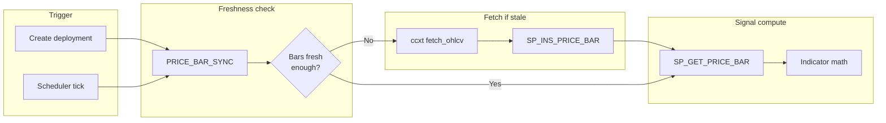
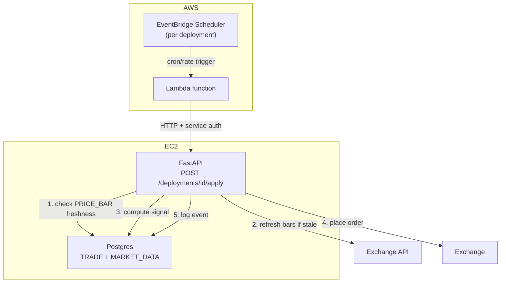

# Scheduler, Price Bars & Consolidation

!!! info "Status"
    **Design — Phase 1.9.** Covers three linked concerns: automated trade scheduling via EventBridge, normalized price bars for live signal computation, and weekend consolidation of backtest cache payloads.

**Parent:** [Plan to Profit](plan-to-profit.md) Phase 1.9  
**Related:** [Trade Deployment Rollout](trade-deployment-rollout.md), [Live Order Execution](live-order-execution.md), [Separate Underlying & Cache](separate-underlying.md)

---

## 1. Problem

Phase 1.7 (live apply) is synchronous — the user clicks Apply and the API runs one signal evaluation and places an order. There is no mechanism to execute a deployment automatically at a recurring interval. Three gaps need closing before automated trading is viable:

1. **No scheduler.** `TRADE.DEPLOYMENT` has no schedule metadata; nothing triggers apply at the right time.
2. **No normalized price bars.** Live signal computation currently reads full-history JSONB blobs from `BT.API_REQUEST_PAYLOAD` — wasteful for a scheduler that only needs the latest N bars. A relational bar table enables efficient range scans.
3. **No data cleanup.** Every "Refresh dataset" click creates a new full-history JSONB version in `BT.API_REQUEST_PAYLOAD`. Old versions are never purged, causing unbounded storage growth.

---

## 2. Decisions

| # | Decision | Rationale |
|---|----------|-----------|
| 1 | **EventBridge Scheduler + Lambda** for recurring execution | Schedule lives in AWS, survives instance restarts, idempotent per tick. Lambda is a thin HTTP caller; all business logic stays in FastAPI. |
| 2 | **Predefined intervals only**: `MANUAL`, `1H`, `DAILY` | Matches the bar granularities we store; no arbitrary cron expressions needed for v1. 4H dropped — few metrics exist at 4H, and 1H covers intraday. New intervals are just a REFDATA seed row away. |
| 3 | **Intervals keyed by `REFDATA.TM_INTERVAL`** — not free-text | The table already exists (used by `BT.API_REQUEST.TM_INTERVAL_ID`) but is **unseeded**; `BacktestCache.DEFAULT_TM_INTERVAL_ID = 1` hardcodes daily by convention. Seed it (`1=DAILY`, `2=1H`) and reference it from both `MARKET_DATA.PRICE_BAR` and `TRADE.DEPLOYMENT` — REFDATA stays the single source of truth for dropdowns. |
| 4 | **`MARKET_DATA` schema** for price bars (separate from `BT`) | Live apply reads are distinct from backtest reads. No migration of existing JSONB data. Both coexist. |
| 5 | **On-demand bar population** | Only products with active deployments get bars stored. No bulk ingest of all products. |
| 6 | **Weekend consolidation** for `BT.API_REQUEST` | Merge closed VIDs per subscription, delete superseded payloads. pg_cron Saturday job with 7-day retention. |

### 2.1 REFDATA.TM_INTERVAL seed

The table (`TM_INTERVAL_ID IDENTITY`, `NAME`, `DESCRIPTION`) exists since baseline but has no rows. Seed via Liquibase changeset:

| TM_INTERVAL_ID | NAME | DESCRIPTION |
|----------------|------|-------------|
| 1 | `DAILY` | Daily bars — matches `BacktestCache.DEFAULT_TM_INTERVAL_ID = 1` |
| 2 | `1H` | Hourly bars |

`MANUAL` is **not** a row here — it is not a time interval. Manual-only deployments are expressed as `SCHEDULE_TM_INTERVAL_ID IS NULL`.

!!! note "Seeding an IDENTITY column"
    `TM_INTERVAL_ID` is `GENERATED ALWAYS AS IDENTITY`, so the seed must pin ids explicitly (`INSERT ... OVERRIDING SYSTEM VALUE`) — `1=DAILY` must match the hardcoded `BacktestCache.DEFAULT_TM_INTERVAL_ID = 1` already in production data (`BT.API_REQUEST.TM_INTERVAL_ID = 1` rows).

---

## 3. TRADE.DEPLOYMENT — scheduler columns

Add three columns to the existing table:

| Column | Type | Default | Purpose |
|--------|------|---------|---------|
| `SCHEDULE_TM_INTERVAL_ID` | `INTEGER NULL` | `NULL` | `REFDATA.TM_INTERVAL` id (`DAILY`/`1H`); **NULL = manual only** |
| `NEXT_RUN_AT` | `TIMESTAMPTZ` | `NULL` | Next scheduled execution; NULL for manual-only |
| `LAST_RUN_AT` | `TIMESTAMPTZ` | `NULL` | Timestamp of last successful execution |

Same pattern as `BT.API_REQUEST.TM_INTERVAL_ID` — an integer reference to `REFDATA.TM_INTERVAL`, no free-text interval strings.

### DDL

```sql
-- Added to TRADE.DEPLOYMENT after DEPLOYMENT_STATUS:
SCHEDULE_TM_INTERVAL_ID  INTEGER,       -- REFDATA.TM_INTERVAL; NULL = manual
NEXT_RUN_AT              TIMESTAMPTZ,
LAST_RUN_AT              TIMESTAMPTZ,
```

### Index

```sql
CREATE INDEX IX_DEPLOYMENT_DUE
    ON TRADE.DEPLOYMENT (NEXT_RUN_AT)
    WHERE IS_ENABLED_IND = 'Y'
      AND SCHEDULE_TM_INTERVAL_ID IS NOT NULL
      AND TRANSACT_TO_TS = TIMESTAMPTZ '9999-12-31 00:00:00+00';
```

### Stored procedure changes

| Procedure | Change |
|-----------|--------|
| `TRADE.SP_INS_DEPLOYMENT` | Add `IN_SCHEDULE_TM_INTERVAL_ID INTEGER`, `IN_NEXT_RUN_AT TIMESTAMPTZ` params; include in INSERT |
| `TRADE.SP_GET_DEPLOYMENT` | Include `SCHEDULE_TM_INTERVAL_ID`, `NEXT_RUN_AT`, `LAST_RUN_AT` in SELECT |
| `TRADE.SP_GET_DUE_DEPLOYMENTS` | **New** — returns current rows where `NEXT_RUN_AT <= NOW()` and `IS_ENABLED_IND = 'Y'` and `SCHEDULE_TM_INTERVAL_ID IS NOT NULL` |

### Python

API layer exposes interval by `NAME` (resolved via `RedisRefData` from `refdata:tm_interval`, same pattern as every other REFDATA dropdown); the repo layer persists the integer id. `schedule_interval: str | None` (`None` = manual) on `CreateDeploymentRequest` / `DeploymentRow`, plus `next_run_at` / `last_run_at` on the row model. No hardcoded interval enum in Python — valid values come from REFDATA per the [REFDATA single-source-of-truth decision](plan-to-profit.md).

---

## 4. MARKET_DATA schema — price bars for live apply

A new Postgres schema for normalized OHLCV data. Serves the live apply pipeline only — backtest continues using `BT.API_REQUEST_PAYLOAD` JSONB blobs unchanged.

### 4.1 `MARKET_DATA.PRICE_BAR`

```sql
CREATE SCHEMA IF NOT EXISTS MARKET_DATA;

CREATE TABLE MARKET_DATA.PRICE_BAR (
    INTERNAL_CUSIP   TEXT          NOT NULL,   -- INST.PRODUCT convention
    TM_INTERVAL_ID   INTEGER       NOT NULL,   -- REFDATA.TM_INTERVAL (1=DAILY, 2=1H)
    BAR_TIMESTAMP    TIMESTAMPTZ   NOT NULL,   -- bar open time (UTC)
    OPEN_PX          NUMERIC       NOT NULL,
    HIGH_PX          NUMERIC       NOT NULL,
    LOW_PX           NUMERIC       NOT NULL,
    CLOSE_PX         NUMERIC       NOT NULL,
    VOLUME           NUMERIC       NOT NULL,
    SOURCE_APP_ID    INTEGER       NOT NULL,   -- REFDATA.APP (e.g. Bybit=34)
    USER_ID          TEXT          NOT NULL,   -- audit convention (service user)
    CREATED_AT       TIMESTAMPTZ   NOT NULL DEFAULT NOW(),

    PRIMARY KEY (INTERNAL_CUSIP, TM_INTERVAL_ID, BAR_TIMESTAMP)
);
```

**PK rationale:** `(INTERNAL_CUSIP, TM_INTERVAL_ID, BAR_TIMESTAMP)` is the natural unique key. Upsert by natural key is clean and idempotent. `SOURCE_APP_ID` tracks provenance but is not part of the PK. Interval is the same `REFDATA.TM_INTERVAL` id that `BT.API_REQUEST` already uses — no free-text interval strings.

!!! note "No soft-versioning columns — deliberate"
    `PRICE_BAR` intentionally has **no** `TRANSACT_FROM/TO_TS` or `IS_CURRENT_IND`. Those fit mutable entities (`DEPLOYMENT`, `STRATEGY`) where a logical row gets superseded. A price bar is an **immutable fact** — nothing supersedes it, so a current-flag would force every insert into UPDATE-flip + INSERT (double write volume, dead-tuple churn) with zero read benefit.

    "Latest bar" is answered two ways, both O(1)-ish:

    1. `PRICE_BAR_SYNC.RANGE_END_TS` — one row per `(INTERNAL_CUSIP, TM_INTERVAL_ID)`, maintained by `SP_INS_PRICE_BAR` in the same call that writes bars. This is the current-pointer.
    2. `ORDER BY BAR_TIMESTAMP DESC LIMIT 1` on the PK — a single B-tree descent to the rightmost leaf (~1 page read regardless of table size).

    1H and DAILY are separate PK subtrees and separate sync rows — neither interval's volume affects the other's lookups.

**Indexes:**

```sql
CREATE INDEX IX_PRICE_BAR_RANGE
    ON MARKET_DATA.PRICE_BAR (INTERNAL_CUSIP, TM_INTERVAL_ID, BAR_TIMESTAMP DESC);

CREATE INDEX IX_PRICE_BAR_LATEST
    ON MARKET_DATA.PRICE_BAR (INTERNAL_CUSIP, TM_INTERVAL_ID, BAR_TIMESTAMP DESC)
    INCLUDE (CLOSE_PX);
```

### 4.2 `MARKET_DATA.PRICE_BAR_SYNC`

Tracks sync metadata per product+interval so the scheduler knows whether to fetch new bars.

```sql
CREATE TABLE MARKET_DATA.PRICE_BAR_SYNC (
    INTERNAL_CUSIP   TEXT    NOT NULL,
    TM_INTERVAL_ID   INTEGER NOT NULL,      -- REFDATA.TM_INTERVAL
    SOURCE_APP_ID    INTEGER NOT NULL,
    RANGE_START_TS   TIMESTAMPTZ,
    RANGE_END_TS     TIMESTAMPTZ,
    LAST_SYNC_AT     TIMESTAMPTZ NOT NULL,
    USER_ID          TEXT    NOT NULL,
    CREATED_AT       TIMESTAMPTZ NOT NULL DEFAULT NOW(),
    UPDATED_AT       TIMESTAMPTZ NOT NULL DEFAULT NOW(),

    PRIMARY KEY (INTERNAL_CUSIP, TM_INTERVAL_ID)
);
```

`UPDATED_AT` is allowed here — this is a genuinely mutable table (same rule as REFDATA lookups), not a soft-versioned one.

### 4.3 Stored procedures

Naming follows the existing `SP_INS_*` / `SP_GET_*` convention (there is no `SP_UPSERT_*` prefix in this codebase — `SP_INS_PRICE_BAR` is an idempotent insert, like `SP_INS_QUEUE` handles multiple actions):

| Procedure | Purpose |
|-----------|---------|
| `MARKET_DATA.SP_INS_PRICE_BAR` | Bulk idempotent insert via `UNNEST` + `ON CONFLICT DO UPDATE`; updates `PRICE_BAR_SYNC` range + timestamp in the same call |
| `MARKET_DATA.SP_GET_PRICE_BAR` | Range read by `(INTERNAL_CUSIP, TM_INTERVAL_ID, start_ts, end_ts)` |
| `MARKET_DATA.SP_GET_PRICE_BAR_SYNC` | Check freshness for a product+interval |

### 4.4 Volume projections

| Interval | Bars/product/year | 10 products x 5 years | Row size est. |
|----------|-------------------|-----------------------|---------------|
| DAILY | 365 | 18,250 | ~120 bytes |
| 1H | 8,760 | 438,000 | ~120 bytes |
| **Total** | **9,125** | **456,250** | **~52 MB** |

Partitioning is not required at this scale. Revisit if product count exceeds 100.

### 4.5 On-demand population flow



**Freshness rule:** A bar set is "fresh enough" if `PRICE_BAR_SYNC.RANGE_END_TS` is within one interval of now. For `DAILY`, if the latest bar is from today or yesterday, no fetch needed.

### 4.6 Relationship to BT.API_REQUEST_PAYLOAD

| Concern | BT.API_REQUEST_PAYLOAD | MARKET_DATA.PRICE_BAR |
|---------|------------------------|----------------------|
| Purpose | Full-history backtest data (multi-year JSONB) | Normalized bars for **live signal computation** |
| Format | Single JSONB document per version | One row per bar (relational) |
| Query pattern | Load entire blob, parse in Python | SQL range scan |
| Write pattern | Full replace per version | Upsert individual bars |
| Used by | Backtest CLI, optimize worker | **Live apply scheduler, dry-run** |

Both coexist. There is no migration of data between them.

### 4.7 Backtest compatibility — same DataFrame contract

Backtest is **not required** to read `PRICE_BAR`, but the read path must not paint it into a corner. `PriceBarService.read_bars()` returns the **exact DataFrame shape the pipeline already consumes** (what `fetch_df` / `BacktestCache._payload_to_df` produce today):

| Pipeline column | Source in PRICE_BAR |
|-----------------|---------------------|
| index (`datetime`, UTC) | `BAR_TIMESTAMP` |
| `price` | `CLOSE_PX` |
| `factor` | `CLOSE_PX` (same as `price`, default) |
| `Open` / `High` / `Low` / `Close` / `Volume` | `OPEN_PX` / `HIGH_PX` / `LOW_PX` / `CLOSE_PX` / `VOLUME` |

Because the contract matches, `Performance` / indicator math work on bars from either source with **zero changes**. If backtest later wants intraday backtests on 1H bars, it plugs `read_bars()` in as another fetcher behind the same interface — an additive change, not a rework.

### 4.8 Failure modes and error handling

Same contract philosophy as `BacktestCache`: **reads may degrade loudly, writes never silently fail.** For trading, the overriding rule is **fail closed — never trade on data we cannot verify.**

| Failure | Behaviour |
|---------|-----------|
| **Exchange fetch fails** (ccxt down, rate-limited, timeout) at scheduler tick | Do **not** compute a signal on stale bars. Abort the run, write `TRADE.EXECUTION_EVENT` row with `IS_SUCCESS_IND='N'` and the error, leave `LAST_RUN_AT` unchanged. Next tick retries naturally. |
| **Bars stale but within tolerance** (fetch OK, exchange lagging one bar) | Freshness rule (§4.5) decides: if `RANGE_END_TS` is within one interval of now, proceed; otherwise treat as fetch failure above. |
| **Gap in bars** (exchange downtime, missed ticks) | `SP_GET_PRICE_BAR` returns what exists; `PriceBarService` validates row count vs expected window and refetches the missing range (ccxt `fetch_ohlcv` accepts a `since` param). If the gap persists, fail closed as above. |
| **Partial (still-forming) bar** | Never inserted. The fetch drops the last row when its `BAR_TIMESTAMP + interval > now()` — only **closed bars** enter the table. The clock module fires just after the boundary, so the newest closed bar is always available. |
| **Duplicate insert** (retry after crash, overlapping fetch) | Harmless by design — `ON CONFLICT (PK) DO UPDATE` is idempotent. A re-fetched closed bar carries identical values. |
| **DB write fails after successful fetch** | Propagates (same as `BacktestCache.refresh_payload` contract). The scheduler run fails loudly; no order is placed on unpersisted data. |
| **PRICE_BAR_SYNC drift** (sync row disagrees with actual bars) | Impossible by construction: `SP_INS_PRICE_BAR` updates bars + sync row in **one transaction**. |
| **Timezone bugs** | Everything is `TIMESTAMPTZ` stored UTC; `BAR_TIMESTAMP` is the bar **open** time. Python side uses tz-aware UTC (`pd.Timestamp` convention already enforced by `BacktestCache._to_utc`). |

---

## 5. BT.API_REQUEST consolidation and purge

### 5.1 Problem

Every "Refresh dataset" click creates a new `API_REQ_VID` in `BT.API_REQUEST` and a corresponding full-history JSONB blob in `BT.API_REQUEST_PAYLOAD`. Old closed VIDs (`TRANSACT_TO_TS < '9999-12-31'`) are never cleaned up. Since each VID stores the **complete** merged history, old VIDs are fully redundant.

```
Subscription: (APP_ID=1, APP_METRIC_ID=1, TM_INTERVAL_ID=1, INTERNAL_CUSIP='btcusdt.crypto')

  VID 1: range [2016-01-01, 2026-05-01]  CLOSED  <- redundant
  VID 2: range [2016-01-01, 2026-06-15]  CLOSED  <- redundant
  VID 3: range [2016-01-01, 2026-07-07]  CURRENT <- only this matters
```

Each payload is ~500KB-1MB of JSONB. Multiple VIDs per product cause unbounded growth.

### 5.2 Consolidation procedure

`BT.SP_CONSOLIDATE_API_REQUEST(IN_RETENTION_DAYS INTEGER DEFAULT 7)`

For each `API_REQ_ID`:

1. Identify the current row (`TRANSACT_TO_TS = '9999-12-31'`).
2. Find closed rows where `TRANSACT_TO_TS < NOW() - IN_RETENTION_DAYS`.
3. Verify the current row's `[RANGE_START_TS, RANGE_END_TS]` covers the closed row's range.
4. Delete the closed `API_REQUEST` row and its `API_REQUEST_PAYLOAD` row.
5. Return count of deleted rows.

**Safety:** If a closed VID has data outside the current range (should not happen), it is skipped and logged via `RAISE WARNING`.

### 5.3 Scheduling

Run as a **pg_cron** job during a weekend maintenance window:

```sql
SELECT cron.schedule(
    'consolidate-api-request',
    '0 3 * * 6',   -- Saturday 03:00 UTC
    $$CALL BT.SP_CONSOLIDATE_API_REQUEST(7)$$
);
```

The consolidation is safe to run while the app is live — it only touches closed (non-current) rows that no read path accesses. The 7-day retention period allows rollback if a bad refresh is detected within the week.

---

## 6. EventBridge Scheduler architecture



Lambda is a thin HTTP caller with a service auth token. All business logic stays in the FastAPI app.

### 6.1 Schedule management

When a deployment is created or updated with a non-NULL `SCHEDULE_TM_INTERVAL_ID`:

1. Python computes `NEXT_RUN_AT` based on the interval and current time.
2. `SP_INS_DEPLOYMENT` persists the schedule fields.
3. The API creates/updates an EventBridge schedule via `boto3` targeting the Lambda.

When a deployment is stopped or the schedule is cleared (`SCHEDULE_TM_INTERVAL_ID = NULL`):

1. The API deletes the EventBridge schedule.
2. `NEXT_RUN_AT` is set to `NULL`.

### 6.2 Lambda function

Minimal Python handler:

```python
def handler(event, context):
    deployment_id = event["deployment_id"]
    response = requests.post(
        f"{API_URL}/api/v1/trade/deployments/{deployment_id}/apply",
        headers={"Authorization": f"Bearer {SERVICE_TOKEN}"},
    )
    return {"statusCode": response.status_code}
```

### 6.3 Service auth

Lambda authenticates via a service API key or internal JWT (not a user JWT). The `/apply` endpoint accepts service auth for scheduled execution alongside user auth for manual apply.

---

## 7. Python layer

### 7.1 Interval resolution — REFDATA, not a Python enum

No hardcoded interval enum. Valid intervals come from `REFDATA.TM_INTERVAL` via `RedisRefData` (same pattern as indicator/strategy dropdowns). API request/response models carry `schedule_interval: str | None` (the `NAME`, e.g. `"DAILY"`; `None` = manual); the repo layer resolves `NAME` to `TM_INTERVAL_ID` before calling SPs — mirroring how `BacktestCache` resolves `app_id`/`app_metric_id` through its refdata reader.

### 7.2 Clock module

```python
# quant/trade/scheduler/clock.py
def next_run(interval_name: str, after: datetime) -> datetime:
    """Compute the next execution time for a given TM_INTERVAL name."""
```

Aligns to interval boundaries (`DAILY` runs at 00:00 UTC, `1H` at the top of each hour).

### 7.3 Price bar service

```python
# quant/data/price_bar_service.py
class PriceBarService:
    """Freshness check + ccxt fetch + insert orchestration."""

    def ensure_fresh(self, internal_cusip: str, tm_interval_id: int, lookback: int) -> None:
        """Check PRICE_BAR_SYNC; fetch from exchange if stale."""

    def read_bars(self, internal_cusip: str, tm_interval_id: int, start: datetime, end: datetime) -> pd.DataFrame:
        """Read bars from MARKET_DATA.PRICE_BAR via SP."""
```

### 7.4 Price bar repo

Follows the `BacktestCache` pattern — extends `DbGateway` (persistent connection), all access via `CALL MARKET_DATA.SP_*`:

```python
# quant/data/price_bar_repo.py
class PriceBarRepo(DbGateway):
    """SP wrappers for MARKET_DATA stored procedures."""

    def ins_bars(self, bars: list[dict]) -> None: ...
    def get_bars(self, cusip: str, tm_interval_id: int, start: datetime, end: datetime) -> list[dict]: ...
    def get_sync(self, cusip: str, tm_interval_id: int) -> dict | None: ...
```

---

## 8. Files

### New (DDL)

| File | Content |
|------|---------|
| `db/liquidbase/market_data/tables/PRICE_BAR.sql` | Table DDL |
| `db/liquidbase/market_data/tables/PRICE_BAR_SYNC.sql` | Sync metadata DDL |
| `db/liquidbase/market_data/procedures/SP_INS_PRICE_BAR.sql` | Bulk idempotent insert |
| `db/liquidbase/refdata/data/TM_INTERVAL.sql` + release XML | Seed `DAILY` / `1H` rows |
| `db/liquidbase/market_data/procedures/SP_GET_PRICE_BAR.sql` | Range read |
| `db/liquidbase/market_data/procedures/SP_GET_PRICE_BAR_SYNC.sql` | Freshness check |
| `db/liquidbase/market_data/market_data-changelog.xml` | Liquibase changelog |
| `db/liquidbase/trade/procedures/SP_GET_DUE_DEPLOYMENTS.sql` | Due deployments query |
| `db/liquidbase/trade/releases/1.4.0-scheduler-columns.xml` | Migration for scheduler columns |
| `db/liquidbase/bt/procedures/SP_CONSOLIDATE_API_REQUEST.sql` | Weekend consolidation/purge |
| `db/liquidbase/bt/releases/1.16.0-api-request-consolidation.xml` | Liquibase changeset |

### Modified (DDL)

| File | Change |
|------|--------|
| `db/liquidbase/trade/tables/DEPLOYMENT.sql` | Add `SCHEDULE_TM_INTERVAL_ID`, `NEXT_RUN_AT`, `LAST_RUN_AT` + index |
| `db/liquidbase/trade/procedures/SP_INS_DEPLOYMENT.sql` | Add schedule params |
| `db/liquidbase/trade/procedures/SP_GET_DEPLOYMENT.sql` | Include schedule columns |
| `db/liquidbase/quantdb-changelog.xml` | Include `market_data` changelog |

### New (Python)

| File | Content |
|------|---------|
| `quant/trade/scheduler/clock.py` | `next_run()` interval math |
| `quant/data/price_bar_repo.py` | `PriceBarRepo` — MARKET_DATA SP wrappers |
| `quant/data/price_bar_service.py` | Freshness check + fetch + upsert orchestration |

### Modified (Python)

| File | Change |
|------|--------|
| `quant/schemas/deployments.py` | `schedule_interval` / `next_run_at` / `last_run_at` fields (interval names from REFDATA) |
| `quant/trade/db_repo.py` | Schedule fields in SP calls; `get_due_deployments()` |
| `quant/trade/service.py` | Next-run calculation on create/apply |

---

## 9. Implementation order

1. **DDL** — `REFDATA.TM_INTERVAL` seed; MARKET_DATA schema + tables + SPs; DEPLOYMENT scheduler columns + SP updates; API_REQUEST consolidation SP.
2. **Python** — schedule fields in schemas, `PriceBarRepo`, `PriceBarService`, db_repo schedule fields, clock module.
3. **Integration** — Wire price bar refresh into live apply flow; connect scheduler tick.
4. **UI + Lambda** — Schedule dropdown in DeploymentDialog; EventBridge/Lambda CloudFormation.
5. **Ops** — pg_cron schedule for weekend API_REQUEST consolidation.
6. **Tests** — Unit tests for clock, repos, service, consolidation SP, updated schemas.
