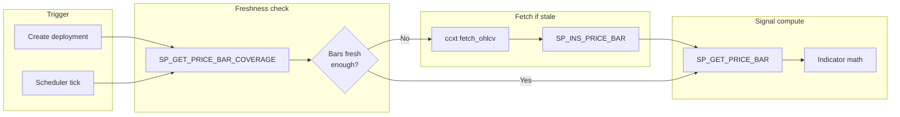
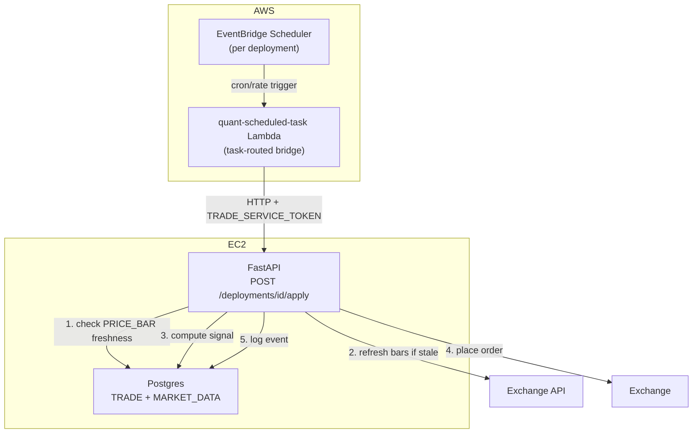

# Scheduler & Price Bars

!!! info "Status"
    **Design — Phase 1.9.** Covers automated trade scheduling via EventBridge and normalized price bars for live signal computation. Backtest cache versioning stays in the application layer (`BacktestCache.refresh_payload`).

**Parent:** [Plan to Profit](plan-to-profit.md) Phase 1.9  
**Related:** [Trade Deployment Rollout](trade-deployment-rollout.md), [Live Order Execution](live-order-execution.md), [Separate Underlying & Cache](separate-underlying.md), [Open questions (scheduler & trade)](scheduler-trade-open-questions.md)

---

## 1. Problem

Phase 1.7 (live apply) is synchronous — the user clicks Apply and the API runs one signal evaluation and places an order. There is no mechanism to execute a deployment automatically at a recurring interval. Two gaps need closing before automated trading is viable:

1. **No scheduler.** `TRADE.DEPLOYMENT` has no schedule metadata; nothing triggers apply at the right time.
2. **No normalized price bars.** Live signal computation currently reads full-history JSONB blobs from `BT.API_REQUEST_PAYLOAD` — wasteful for a scheduler that only needs the latest N bars. A relational bar table enables efficient range scans.

---

## 2. Decisions

| # | Decision | Rationale |
|---|----------|-----------|
| 1 | **EventBridge Scheduler + Lambda** for recurring execution | Schedule lives in AWS, survives instance restarts, idempotent per tick. Lambda is a thin HTTP caller; all business logic stays in FastAPI. |
| 2 | **Predefined intervals only**: `MANUAL`, `1H`, `DAILY` | Matches the bar granularities we store; no arbitrary cron expressions needed for v1. 4H dropped — few metrics exist at 4H, and 1H covers intraday. New intervals are just a REFDATA seed row away. |
| 3 | **Intervals keyed by `REFDATA.TM_INTERVAL`** — not free-text | The table already exists (used by `BT.API_REQUEST.TM_INTERVAL_ID`) but is **unseeded**; `BacktestCache.DEFAULT_TM_INTERVAL_ID = 1` hardcodes daily by convention. Seed it (`1=DAILY`, `2=1H`) and reference it from both `MARKET_DATA.PRICE_BAR` and `TRADE.DEPLOYMENT` — REFDATA stays the single source of truth for dropdowns. |
| 4 | **`MARKET_DATA` schema** for price bars (separate from `BT`) | Live apply reads are distinct from backtest reads. No migration of existing JSONB data. Both coexist. |
| 5 | **On-demand bar population** | Only products with active deployments get bars stored. No bulk ingest of all products. |
| 6 | **Application-owned API_REQUEST refresh** | `BacktestCache.refresh_payload` fetches the caller's range and reinserts via `SP_INS_API_REQUEST`; no DB consolidation SP. |

### 2.1 REFDATA.TM_INTERVAL seed

The table (`TM_INTERVAL_ID IDENTITY`, `NAME`, `DESCRIPTION`) exists since baseline but has no rows. Seed via Liquibase changeset:

| TM_INTERVAL_ID | NAME | PERIOD_LENGTH | DESCRIPTION |
|----------------|------|---------------|-------------|
| 1 | `DAILY` | `1 day` | Daily bars — matches `BacktestCache.DEFAULT_TM_INTERVAL_ID = 1` |
| 2 | `1H` | `1 hour` | Hourly bars |

`PERIOD_LENGTH` is the scheduler step (`last_run + PERIOD_LENGTH`). Poller uses `SP_GET_MISSED_DUE_DEPLOYMENTS`; UI preview may use `SP_GET_NEXT_DUE_DEPLOYMENTS` or compute in Python.

`MANUAL` is **not** a row here — it is not a time interval. Manual-only deployments are expressed as `SCHEDULE_TM_INTERVAL_ID IS NULL`.

!!! note "Seeding an IDENTITY column"
    `TM_INTERVAL_ID` is `GENERATED ALWAYS AS IDENTITY`, so the seed must pin ids explicitly (`INSERT ... OVERRIDING SYSTEM VALUE`) — `1=DAILY` must match the hardcoded `BacktestCache.DEFAULT_TM_INTERVAL_ID = 1` already in production data (`BT.API_REQUEST.TM_INTERVAL_ID = 1` rows).

---

## 3. TRADE.DEPLOYMENT — scheduler config + run state

**Config** (soft-versioned on `DEPLOYMENT` — qty, credential, schedule interval changes bump `DEPLOYMENT_VID`):

| Column | Type | Default | Purpose |
|--------|------|---------|---------|
| `SCHEDULE_TM_INTERVAL_ID` | `INTEGER NULL` | `NULL` | `REFDATA.TM_INTERVAL` id (`DAILY`/`1H`); **NULL = manual only** |

**Run state** (append-only versions on `TRADE.DEPLOYMENT_SCHEDULE_STATUS` — one logical schedule per `DEPLOYMENT_ID`):

| Column | Purpose |
|--------|---------|
| `DEPLOYMENT_SCHEDULE_ID` | Stable UUID (same as `DEPLOYMENT_ID` on create) |
| `DEPLOYMENT_SCHEDULE_VID` | Monotonic version per schedule change / tick advance |
| `DEPLOYMENT_ID` / `DEPLOYMENT_VID` | Links to deployment row at time of write |
| `STATUS` | `PENDING` \| `SUCCESS` \| `FAILED` — poller reads `PENDING` only |
| `SCHEDULED_TS` | **Next due** apply time |

Due check: latest row where `STATUS = 'PENDING'` and `SCHEDULED_TS <= NOW()`. Poller calls **`SP_GET_MISSED_DUE_DEPLOYMENTS(IN_TM_INTERVAL_ID)`** per interval tick (DAILY, 1H, …). After apply, **`SP_INS_DEPLOYMENT_SCHEDULE_STATUS`** with `NEXT_SCHEDULED_TS` from the cursor — no separate advance proc. `TradeRepo` wraps all three; the poller that sequences them is not written yet.

`EXECUTION_EVENT` remains a pure execution diary (`TRANSACT_AT` = tick time for audit). It carries **no scheduling anchor** — the diary never drives due-ness.

Same pattern as `BT.API_REQUEST.TM_INTERVAL_ID` — an integer reference to `REFDATA.TM_INTERVAL`, no free-text interval strings.

### DDL

```sql
-- TRADE.DEPLOYMENT (config only):
SCHEDULE_TM_INTERVAL_ID  INTEGER,       -- REFDATA.TM_INTERVAL; NULL = manual

-- TRADE.DEPLOYMENT_SCHEDULE_STATUS (scheduler state):
DEPLOYMENT_SCHEDULE_ID, DEPLOYMENT_SCHEDULE_VID, DEPLOYMENT_ID, DEPLOYMENT_VID,
STATUS, SCHEDULED_TS, IS_CURRENT_IND, USER_ID, CREATED_AT
```

### Stored procedure changes

| Procedure | Change |
|-----------|--------|
| `TRADE.SP_INS_DEPLOYMENT_SCHEDULE_STATUS` | Append schedule version (poller advance after apply) |
| `TRADE.SP_INS_DEPLOYMENT` | Seeds / syncs schedule row when interval set |
| `TRADE.SP_INS_EXECUTION_EVENT` | Diary only — no scheduler side effects |
| `TRADE.SP_GET_DEPLOYMENT` | `LAST_RUN_AT` / `NEXT_DUE_AT` from schedule status |
| `TRADE.SP_GET_MISSED_DUE_DEPLOYMENTS` | `IN_TM_INTERVAL_ID` — enabled, not paused, `PENDING` + due |
| `TRADE.SP_GET_NEXT_DUE_DEPLOYMENTS` | `PENDING` + `SCHEDULED_TS > NOW()` (optional UI) |

### Python

API layer exposes interval by `NAME` (resolved via `RedisRefData` from `refdata:tm_interval`, same pattern as every other REFDATA dropdown); the repo layer persists the integer id. `schedule_interval: str | None` (`None` = manual) on `CreateDeploymentRequest` / `DeploymentRow`, plus `last_run_at` / `next_due_at` from `DEPLOYMENT_SCHEDULE_STATUS`. No hardcoded interval enum in Python — valid values come from REFDATA per the [REFDATA single-source-of-truth decision](plan-to-profit.md).

---

## 4. MARKET_DATA schema — price bars for live apply

A new Postgres schema for normalized OHLCV data. Serves the live apply pipeline only — backtest continues using `BT.API_REQUEST_PAYLOAD` JSONB blobs unchanged.

### 4.1 `MARKET_DATA.PRICE_BAR`

```sql
CREATE SCHEMA IF NOT EXISTS MARKET_DATA;

CREATE TABLE MARKET_DATA.PRICE_BAR (
    INTERNAL_CUSIP   TEXT          NOT NULL,   -- INST.PRODUCT convention
    TM_INTERVAL_ID   INTEGER       NOT NULL,   -- REFDATA.TM_INTERVAL (1=DAILY, 2=1H)
    BAR_TIMESTAMP    TIMESTAMPTZ   NOT NULL,   -- bar open time (UTC)
    OPEN_PX          DECIMAL       NOT NULL,
    HIGH_PX          DECIMAL       NOT NULL,
    LOW_PX           DECIMAL       NOT NULL,
    CLOSE_PX         DECIMAL       NOT NULL,
    VOLUME           DECIMAL       NOT NULL,
    SOURCE_APP_ID    INTEGER       NOT NULL,   -- REFDATA.APP (e.g. Bybit=34)
    USER_ID          TEXT          NOT NULL,   -- audit convention (service user)
    CREATED_AT       TIMESTAMPTZ   NOT NULL DEFAULT NOW(),

    PRIMARY KEY (INTERNAL_CUSIP, TM_INTERVAL_ID, BAR_TIMESTAMP)
);
```

**PK rationale:** `(INTERNAL_CUSIP, TM_INTERVAL_ID, BAR_TIMESTAMP)` is the natural unique key. **`SP_INS_PRICE_BAR` is plain `INSERT`** — the app reads coverage / existing bars first and only passes missing bars. A duplicate PK raises `unique_violation` (visible failure); there is no silent upsert or `ON CONFLICT`.

!!! note "No soft-versioning columns — deliberate"
    `PRICE_BAR` intentionally has **no** `TRANSACT_FROM/TO_TS` or `IS_CURRENT_IND`. Those fit mutable entities (`DEPLOYMENT`, `STRATEGY`) where a logical row gets superseded. A price bar is an **immutable fact** — nothing supersedes it.

    **Latest bar / freshness:** `SP_GET_PRICE_BAR_COVERAGE` → `MAX_BAR_TIMESTAMP` (`ORDER BY … DESC LIMIT 1`). **Bounds for catch-up:** same proc → `MIN_BAR_TIMESTAMP` / `MAX_BAR_TIMESTAMP` (two index probes; gap count derived in app from interval).

    1H and DAILY are separate PK subtrees — neither interval's volume affects the other's lookups.

**Indexes:**

```sql
CREATE INDEX IX_PRICE_BAR_LATEST
    ON MARKET_DATA.PRICE_BAR (INTERNAL_CUSIP, TM_INTERVAL_ID, BAR_TIMESTAMP DESC)
    INCLUDE (CLOSE_PX);
```

`IX_PRICE_BAR_LATEST` serves range scans (DESC), latest-bar / coverage probes (`ORDER BY … LIMIT 1`), and index-only latest `CLOSE_PX`. PK covers uniqueness and forward ASC reads.

### 4.2 Stored procedures

| Procedure | Purpose |
|-----------|---------|
| `MARKET_DATA.SP_GET_PRICE_BAR_COVERAGE` | `MIN`/`MAX` bar timestamps via `ORDER BY … LIMIT 1` (two index probes) — freshness uses `MAX` |
| `MARKET_DATA.SP_GET_PRICE_BAR` | OHLCV range read for signal computation |
| `MARKET_DATA.SP_INS_PRICE_BAR` | Insert **one bar** per call; plain `INSERT` |

**Division of labour:** the DB stores and reads bars; the **app** decides what window it needs, compares `SP_GET_PRICE_BAR_COVERAGE` to required range, fetches missing bars from the exchange, inserts gaps via `SP_INS_PRICE_BAR`. Single source of truth — no sync table.

### 4.3 Volume projections

| Interval | Bars/product/year | 10 products x 5 years | Row size est. |
|----------|-------------------|-----------------------|---------------|
| DAILY | 365 | 18,250 | ~120 bytes |
| 1H | 8,760 | 438,000 | ~120 bytes |
| **Total** | **9,125** | **456,250** | **~52 MB** |

Partitioning is not required at this scale. Revisit if product count exceeds 100.

### 4.4 On-demand population flow



**Freshness rule:** A bar set is "fresh enough" if `MAX_BAR_TIMESTAMP` from `SP_GET_PRICE_BAR_COVERAGE` is within one interval of now. For `DAILY`, if the latest bar is from today or yesterday, no fetch needed.

**Crash catch-up:** On retry, call `SP_GET_PRICE_BAR_COVERAGE` — compare `MIN`/`MAX` to the required window, fetch gaps, `SP_INS_PRICE_BAR` per missing bar (row-count check in app from interval + bounds).

### 4.5 Relationship to BT.API_REQUEST_PAYLOAD

| Concern | BT.API_REQUEST_PAYLOAD | MARKET_DATA.PRICE_BAR |
|---------|------------------------|----------------------|
| Purpose | Full-history backtest data (multi-year JSONB) | Normalized bars for **live signal computation** |
| Format | Single JSONB document per version | One row per bar (relational) |
| Query pattern | Load entire blob, parse in Python | SQL range scan |
| Write pattern | Full replace per version | Append-only insert (caller supplies missing bars only) |
| Used by | Backtest CLI, optimize worker | **Live apply scheduler, dry-run** |

Both coexist. There is no migration of data between them.

### 4.6 Backtest compatibility — same DataFrame contract

Backtest is **not required** to read `PRICE_BAR`, but the read path must not paint it into a corner. `PriceBarService.read_bars()` returns the **exact DataFrame shape the pipeline already consumes** (what `fetch_df` / `BacktestCache._payload_to_df` produce today):

| Pipeline column | Source in PRICE_BAR |
|-----------------|---------------------|
| index (`datetime`, UTC) | `BAR_TIMESTAMP` |
| `price` | `CLOSE_PX` |
| `factor` | `CLOSE_PX` (same as `price`, default) |
| `Open` / `High` / `Low` / `Close` / `Volume` | `OPEN_PX` / `HIGH_PX` / `LOW_PX` / `CLOSE_PX` / `VOLUME` |

Because the contract matches, `Performance` / indicator math work on bars from either source with **zero changes**. If backtest later wants intraday backtests on 1H bars, it plugs `read_bars()` in as another fetcher behind the same interface — an additive change, not a rework.

### 4.7 Failure modes and error handling

Same contract philosophy as `BacktestCache`: **reads may degrade loudly, writes never silently fail.** For trading, the overriding rule is **fail closed — never trade on data we cannot verify.**

| Failure | Behaviour |
|---------|-----------|
| **Apply fails** (order rejected, broker error) after signal computed | Retry up to **3 times** same `SCHEDULED_TS` (app). Then `SP_INS_DEPLOYMENT_SCHEDULE_STATUS` with `NEXT_SCHEDULED_TS` from GET cursor. Diary in `EXECUTION_EVENT`. |
| **Exchange fetch fails** (ccxt down, rate-limited, timeout) at scheduler tick | Do **not** compute a signal on stale bars. Abort the run, write `TRADE.EXECUTION_EVENT` row with `IS_SUCCESS_IND='N'` — schedule is **not** advanced (tick did not complete). Retry on next poll; does not consume the 3-attempt budget. |
| **Bars stale but within tolerance** (fetch OK, exchange lagging one bar) | Freshness rule (§4.4) decides: if `MAX_BAR_TIMESTAMP` is within one interval of now, proceed; otherwise treat as fetch failure above. |
| **Gap in bars** (exchange downtime, missed ticks) | `SP_GET_PRICE_BAR` returns what exists; `PriceBarService` validates row count vs expected window and refetches the missing range (ccxt `fetch_ohlcv` accepts a `since` param). If the gap persists, fail closed as above. |
| **Partial (still-forming) bar** | Never inserted. The fetch drops the last row when its `BAR_TIMESTAMP + interval > now()` — only **closed bars** enter the table. The clock module fires just after the boundary, so the newest closed bar is always available. |
| **Crash before insert commits** | `SP_GET_PRICE_BAR_COVERAGE` unchanged — refetch missing range, `SP_INS_PRICE_BAR` per bar. |
| **Crash after insert, before apply** | Coverage shows new bars — skip fetch/insert, re-run apply. |
| **Duplicate insert** (app bug) | `unique_violation` on `SP_INS_PRICE_BAR` — fail loud. |
| **DB write fails after successful fetch** | Propagates (same as `BacktestCache.refresh_payload` contract). The scheduler run fails loudly; no order is placed on unpersisted data. |
| **Timezone bugs** | Everything is `TIMESTAMPTZ` stored UTC; `BAR_TIMESTAMP` is the bar **open** time. Python side uses tz-aware UTC (`pd.Timestamp` convention already enforced by `BacktestCache._to_utc`). |

---

## 5. BT.API_REQUEST versioning (application-owned)

### 5.1 Problem

Every "Refresh dataset" click creates a new `API_REQ_VID` in `BT.API_REQUEST` and a corresponding JSONB blob in `BT.API_REQUEST_PAYLOAD`. The **current** row (`TRANSACT_TO_TS = '9999-12-31'`) always holds the merged history the app needs; closed VIDs are superseded and are not read by the cache path.

### 5.2 Refresh contract (no DB consolidation SP)

`BacktestCache.refresh_payload` owns the write path:

1. Look up the current row for `(APP_ID, APP_METRIC_ID, TM_INTERVAL_ID, INTERNAL_CUSIP)`.
2. Fetch the requested `[RANGE_START_TS, RANGE_END_TS]` from the provider (the smallest range the caller needs for that refresh).
3. Call `BT.SP_INS_API_REQUEST` with the existing `API_REQ_ID` — the SP closes the prior VID and inserts a new current row + payload with the merged range.

There is **no** `BT.SP_CONSOLIDATE_API_REQUEST`. Purging closed rows / partition retention is separate future work ([Separate Underlying & Cache](separate-underlying.md) § scheduled purge of closed versions).

---

## 6. EventBridge Scheduler architecture



Lambda is a thin HTTP caller with a service auth token. All business logic stays in the FastAPI app.

### 6.1 AWS resources (implemented)

CloudFormation stack `quant-scheduler` — template [`aws/cfn/04-scheduler.yml`](../../aws/cfn/04-scheduler.yml). Ops detail: [Infrastructure — Trade scheduler](../architecture/infrastructure.md#trade-scheduler-eventbridge--lambda).

| Resource | Name |
|----------|------|
| Schedule group | `quant-trade-deployments` |
| Lambda | `quant-scheduled-task` ([`aws/lambda/scheduled-task/handler.py`](../../aws/lambda/scheduled-task/handler.py)) |
| Scheduler invoke role | `quant-scheduler-invoke` |
| Lambda execution role | `quant-scheduled-task-lambda` (CloudWatch Logs + SSM read of the service token) |
| EC2 manage policy | `quant-ec2-scheduler-manage` (on `quant-ec2-role`) |
| Service token SSM | `/quant/prod/TRADE_SERVICE_TOKEN` — fetched by the Lambda at cold start (CloudFormation does not support `ssm-secure` in Lambda env vars) |

```bash
bash aws/scripts/init-ssm-params.sh   # creates TRADE_SERVICE_TOKEN if missing
bash aws/deploy.sh scheduler          # CFN + upload Lambda zip
```

### 6.2 Schedule management (app — not yet wired)

Deployment create/update/stop talks to a **`ScheduleTrigger`** seam, not to
boto3 directly. Two implementations, selected by `SCHEDULER_BACKEND`
(default `local`):

| Backend | Trigger | Used by |
|---------|---------|---------|
| `eventbridge` | Per-deployment EventBridge schedule → Lambda → API (HTTPS + service token) | Prod (EC2, `USE_SSM=1`) |
| `local` | In-process poller inside FastAPI — no AWS needed | Dev / any box without AWS |

**Shared state, different alarm clock.** Schedule config lives on soft-versioned
`DEPLOYMENT`; scheduler cursor on append-only `DEPLOYMENT_SCHEDULE_STATUS`.
Due-ness = latest `PENDING` row with `SCHEDULED_TS <= NOW()` via
`SP_GET_MISSED_DUE_DEPLOYMENTS`. EventBridge and the local poller are just two
ways of waking up. Poller calls `SP_INS_DEPLOYMENT_SCHEDULE_STATUS` after apply;
`live_apply` appends `EXECUTION_EVENT` only — separate concerns.

When a deployment is created or updated with a non-NULL `SCHEDULE_TM_INTERVAL_ID`:

1. `SP_INS_DEPLOYMENT` persists `SCHEDULE_TM_INTERVAL_ID` (config change only — versions if other fields changed).
2. `ScheduleTrigger.sync(deployment)`:
    - **eventbridge** — creates/updates the schedule via `boto3` targeting the Lambda (`ScheduledTaskLambdaArn` + `SchedulerInvokeRoleArn` from stack outputs), with **`RetryPolicy.MaximumRetryAttempts = 0`** — the Scheduler default (185 retries over 24h) must never re-invoke a failing trade apply; order-level retries live in `OrderRetryExecutor`.
    - **local** — no-op; the poller reads `SP_GET_MISSED_DUE_DEPLOYMENTS` directly.

When a deployment is stopped or the schedule is cleared (`SCHEDULE_TM_INTERVAL_ID = NULL`):

1. `ScheduleTrigger.remove(deployment)` (eventbridge deletes the schedule; local no-op).
2. `SP_INS_DEPLOYMENT` with `SCHEDULE_TM_INTERVAL_ID = NULL`.

**Local poller** (dev): an asyncio background task started at FastAPI startup
when `SCHEDULER_BACKEND=local` — same polling pattern as the backtest
`WorkerLoop`. Every ~30s, for each seeded `TM_INTERVAL_ID`, it calls
`SP_GET_MISSED_DUE_DEPLOYMENTS(IN_TM_INTERVAL_ID)` and invokes
`TradeService.apply_deployment` **in-process** (no HTTP, no
`TRADE_SERVICE_TOKEN`). After a completed tick it calls
`SP_INS_DEPLOYMENT_SCHEDULE_STATUS` with `NEXT_SCHEDULED_TS` from the cursor.

Rejected for dev: **LocalStack** (EventBridge Scheduler emulation is
paid-tier; would test the emulator, not our logic) and **cron + curl**
(needs the service token on the dev box, machine must be awake, bypasses
`EXECUTION_EVENT` bookkeeping).

### 6.3 Lambda function

Handler lives in-repo (stdlib + Lambda-bundled boto3 — no layers). It is a
**generic task bridge**: the event names the task, a dict maps task → API
path, and the token is fetched from SSM at cold start. Event shapes:

```json
{"task": "trade_apply", "deployment_id": "019abcde-…"}
{"task": "price_bar_sync", "payload": {"internal_cusip": "…", "interval": "1H"}}
```

`trade_apply` calls `POST {API_BASE_URL}/api/v1/trade/deployments/{id}/apply`
with `Authorization: Bearer {TRADE_SERVICE_TOKEN}`. `price_bar_sync` is the
planned second task for scheduled price-bar ingestion (§4) — enabling it is
one entry in the handler's `_TASK_PATHS` dict once the FastAPI endpoint
exists, with its own schedule(s) in the same group. No new Lambda or stack
change.

### 6.4 Service auth (app — not yet wired)

Lambda authenticates via `TRADE_SERVICE_TOKEN` (SSM SecureString), not a user JWT. The `/apply` endpoint must accept this service token for scheduled execution alongside `require_user` for manual apply. Until that lands, Lambda invokes reach the API but return **401**.

---

## 7. Python layer

### 7.1 Interval resolution — REFDATA, not a Python enum

No hardcoded interval enum. Valid intervals come from `REFDATA.TM_INTERVAL` via `RedisRefData` (same pattern as indicator/strategy dropdowns). API request/response models carry `schedule_interval: str | None` (the `NAME`, e.g. `"DAILY"`; `None` = manual); the repo layer resolves `NAME` to `TM_INTERVAL_ID` before calling SPs — mirroring how `BacktestCache` resolves `app_id`/`app_metric_id` through its refdata reader.

### 7.2 Clock module (display only)

```python
# quant/trade/scheduler/clock.py
def next_run_at(interval_name: str, after: datetime) -> datetime:
    """Compute the next execution time for UI display — not persisted."""
```

Aligns to interval boundaries (`DAILY` runs at 00:00 UTC, `1H` at the top of each hour). Poller due-ness comes from `SP_GET_MISSED_DUE_DEPLOYMENTS`.

### 7.3 Price bar service

```python
# quant/data/price_bar_service.py
class PriceBarService:
    """Freshness check + ccxt fetch + insert orchestration."""

    def ensure_fresh(self, internal_cusip: str, tm_interval_id: int, lookback: int) -> None:
        """Check coverage / latest bar; fetch from exchange if stale."""

    def read_bars(self, internal_cusip: str, tm_interval_id: int, start: datetime, end: datetime) -> pd.DataFrame:
        """Read bars from MARKET_DATA.PRICE_BAR via SP."""
```

### 7.4 Price bar repo

Follows the `BacktestCache` pattern — extends `DbGateway` (persistent connection), all access via `CALL MARKET_DATA.SP_*`:

```python
# quant/data/price_bar_repo.py
class PriceBarRepo(DbGateway):
    """SP wrappers for MARKET_DATA stored procedures."""

    def ins_bar(self, *, bar_timestamp, open_px, high_px, low_px, close_px, volume, ...) -> None: ...
    def get_coverage(self, cusip: str, tm_interval_id: int) -> dict | None: ...
    def get_bars(self, cusip: str, tm_interval_id: int, start: datetime, end: datetime) -> list[dict]: ...
```

---

## 8. Files

### New (AWS — done)

| File | Content |
|------|---------|
| `aws/cfn/04-scheduler.yml` | Lambda + schedule group + IAM |
| `aws/lambda/scheduled-task/handler.py` | Task-routed API bridge (`trade_apply` now, `price_bar_sync` later) |
| `aws/deploy.sh` | `scheduler` stack + Lambda zip upload |

### New (DDL)

| File | Content |
|------|---------|
| `db/liquidbase/market_data/tables/PRICE_BAR.sql` | Table DDL |
| `db/liquidbase/market_data/procedures/SP_INS_PRICE_BAR.sql` | Single-row insert |
| `db/liquidbase/market_data/procedures/SP_GET_PRICE_BAR_COVERAGE.sql` | Stored min/max via index `LIMIT 1` (freshness + catch-up) |
| `db/liquidbase/market_data/procedures/SP_GET_PRICE_BAR.sql` | Range read |
| `db/liquidbase/market_data/releases/1.0.0-price-bars.xml` | `PRICE_BAR` table + insert / range-read / coverage SPs |
| `db/liquidbase/refdata/data/TM_INTERVAL.sql` + `releases/1.5.0-tm-interval.xml` | Seed `DAILY` / `1H` rows + `PERIOD_LENGTH` |
| `db/liquidbase/market_data/market_data-changelog.xml` | Liquibase changelog |
| `db/liquidbase/trade/procedures/SP_GET_MISSED_DUE_DEPLOYMENTS.sql` | Poller — apply-now rows |
| `db/liquidbase/trade/procedures/SP_GET_NEXT_DUE_DEPLOYMENTS.sql` | UI / ops — not-yet-due preview |
| `db/liquidbase/trade/releases/1.4.0-deployment-scheduler.xml` | `SCHEDULE_TM_INTERVAL_ID`, `EXECUTION_EVENT.TRANSACT_AT`, `DEPLOYMENT_SCHEDULE_STATUS` + scheduler SPs |

### Modified (DDL)

| File | Change |
|------|--------|
| `db/liquidbase/trade/tables/DEPLOYMENT.sql` | Add `SCHEDULE_TM_INTERVAL_ID` (config only) |
| `db/liquidbase/trade/procedures/SP_INS_DEPLOYMENT.sql` | Add schedule params |
| `db/liquidbase/trade/procedures/SP_GET_DEPLOYMENT.sql` | Include schedule columns |
| `db/liquidbase/quantdb-changelog.xml` | Include `market_data` changelog |

### New (Python)

| File | Content |
|------|---------|
| `quant/trade/scheduler/clock.py` | `next_run()` interval math |
| `quant/trade/scheduler/trigger.py` | `ScheduleTrigger` seam — `EventBridgeTrigger` (boto3) / `LocalTrigger` (no-op) |
| `quant/trade/scheduler/poller.py` | Dev-mode asyncio poller — due-deployment loop (`SCHEDULER_BACKEND=local`) |
| `quant/data/price_bar_repo.py` | `PriceBarRepo` — MARKET_DATA SP wrappers |
| `quant/data/price_bar_service.py` | Freshness check + fetch + upsert orchestration |

### Modified (Python)

| File | Change |
|------|--------|
| `quant/schemas/deployments.py` | `schedule_interval` / `last_run_at` fields (interval names from REFDATA) |
| `quant/trade/db_repo.py` | Schedule fields in SP calls; `get_missed_due_deployments()` |
| `quant/trade/service.py` | Next-run calculation on create/apply |

---

## 9. Implementation order

1. **DDL** — `REFDATA.TM_INTERVAL` seed; MARKET_DATA schema + tables + SPs; DEPLOYMENT scheduler columns + SP updates.
2. **Python** — schedule fields in schemas, `PriceBarRepo`, `PriceBarService`, db_repo schedule fields, clock module.
3. **Integration** — Wire price bar refresh into live apply flow; connect scheduler tick.
4. **UI + Lambda** — Schedule dropdown in DeploymentDialog; EventBridge/Lambda CloudFormation.
5. **Tests** — Unit tests for clock, repos, service, updated schemas.
