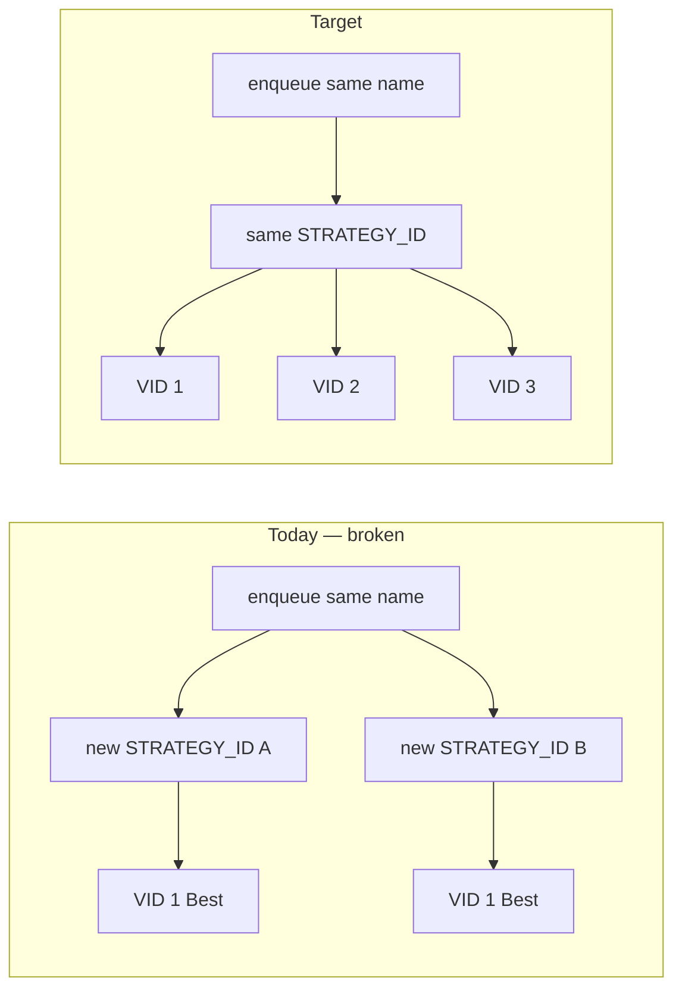

# Strategy VID Versioning by Name

**Status:** Design — not yet implemented (DB + API + data cleanup pending).

How to make repeated submissions of the **same strategy name** increment
`STRATEGY_VID` (`v1`, `v2`, `v3`, …) under **one** `STRATEGY_ID`, add a
uniqueness guarantee on `(USER_ID, STRATEGY_NM, STRATEGY_VID)`, and clean up
duplicate rows already in `BT.STRATEGY`.

## Summary

| Today | Target |
|-------|--------|
| Every enqueue mints a new random `STRATEGY_ID` | Same `(USER_ID, STRATEGY_NM)` reuses one `STRATEGY_ID` |
| Each submission is always `VID=1` | VID increments: `1, 2, 3, …` per name |
| Promotion UI shows two cards, both `v1` / Best | One card with `v1`, `v2`, … in time order |
| No uniqueness on name + VID | `UNIQUE (USER_ID, STRATEGY_NM, STRATEGY_VID)` |



## Symptom

Submitting the same configuration twice produces **two separate strategy blocks** in
the Promotion tab, each showing `v1` / `Best`, instead of one block with
`v1`, `v2`:

```
btcusdt.crypto · get_bollinger_band/momentum    v1  Best   (19:03:32)
btcusdt.crypto · get_bollinger_band/momentum    v1  Best   (19:03:46)
```

Same root cause in the Jobs queue: two rows with the same `strategy_nm`, both
at `v1`.

## Root cause

Identity is keyed on a **random** `STRATEGY_ID`, not on the strategy name.

- [`quant/api/services/jobs.py`](../../quant/api/services/jobs.py) mints
  `strategy_id = uuid.uuid4()` on **every** `enqueue()`.
- [`BT.SP_INS_STRATEGY`](../../db/liquidbase/bt/procedures/SP_INS_STRATEGY.sql)
  computes the next VID as
  `SELECT COALESCE(MAX(STRATEGY_VID),0)+1 WHERE STRATEGY_ID = IN_STRATEGY_ID`.

Because the incoming `STRATEGY_ID` is always new, the `MAX(VID)` lookup always
finds nothing and returns `VID=1`. The name (`STRATEGY_NM`) never participates in
version resolution.

## Target behaviour

1. Same logical strategy (same **owner + name**) → **one** `STRATEGY_ID`, with
   `STRATEGY_VID` incrementing `1, 2, 3, …` on each resubmission.
2. A **unique key** so duplicate `(name, vid)` rows cannot be created again.
3. Existing duplicated rows collapsed into the correct version history.

!!! note "Scoping: `(USER_ID, STRATEGY_NM, STRATEGY_VID)` — not global `(STRATEGY_NM, VID)`"
    Strategies are owned (`BT.STRATEGY.USER_ID`, see
    [User isolation](user-isolation.md)). Two different users may legitimately
    pick the same `STRATEGY_NM`. A **global** `UNIQUE (STRATEGY_NM, STRATEGY_VID)`
    would block user B from ever using a name user A already used.

    The constraint must be:

    ```sql
    UNIQUE (USER_ID, STRATEGY_NM, STRATEGY_VID)
    ```

    When people say "unique on strategy name and vid", include **`USER_ID`**
    unless the product decision is that names are globally unique across all users.

## Audit — find duplicates before cleanup

Run against prod (via SSM port-forward) to see how much cleanup is needed:

```sql
-- Duplicate (USER_ID, STRATEGY_NM, STRATEGY_VID) — blocks the unique constraint
SELECT USER_ID, STRATEGY_NM, STRATEGY_VID, COUNT(*) AS cnt
  FROM BT.STRATEGY
 GROUP BY 1, 2, 3
HAVING COUNT(*) > 1
 ORDER BY cnt DESC;

-- Same name, many STRATEGY_IDs each at VID=1 — the Promotion-tab symptom
SELECT USER_ID, STRATEGY_NM,
       COUNT(DISTINCT STRATEGY_ID) AS distinct_ids,
       COUNT(*)                    AS total_rows,
       MAX(STRATEGY_VID)           AS max_vid
  FROM BT.STRATEGY
 GROUP BY 1, 2
HAVING COUNT(DISTINCT STRATEGY_ID) > 1
    OR MAX(STRATEGY_VID) = 1 AND COUNT(*) > 1
 ORDER BY total_rows DESC;
```

## How to fix it (implementation)

There are two ways to bind identity to the name. **Design A is recommended.**

### Design A — Resolve `STRATEGY_ID` from the name inside the SP (recommended)

The procedure looks up an existing `STRATEGY_ID` for `(USER_ID, STRATEGY_NM)`;
if found it reuses that ID and increments the VID, otherwise it allocates a new
`STRATEGY_ID` at `VID=1`. Python stops generating an ID per enqueue.

**1. SP change** — `BT.SP_INS_STRATEGY` (new `db/liquidbase/bt/releases/*.xml`
changeset, `CREATE OR REPLACE PROCEDURE`):

```sql
-- Step 05: Resolve the logical strategy id from (USER_ID, STRATEGY_NM).
SELECT STRATEGY_ID
  INTO V_STRATEGY_ID
  FROM BT.STRATEGY
 WHERE USER_ID     = IN_USER_ID
   AND STRATEGY_NM = IN_STRATEGY_NM
 ORDER BY STRATEGY_VID DESC
 LIMIT 1;

IF V_STRATEGY_ID IS NULL THEN
    V_STRATEGY_ID := COALESCE(IN_STRATEGY_ID, gen_random_uuid());
END IF;

-- Step 10: Next VID for THIS logical strategy.
SELECT COALESCE(MAX(STRATEGY_VID), 0) + 1
  INTO V_VID
  FROM BT.STRATEGY
 WHERE STRATEGY_ID = V_STRATEGY_ID;
```

The existing Steps 20–30 (close prior active row, insert new active row) stay as
is but use `V_STRATEGY_ID`. Add an `OUT_STRATEGY_ID UUID` parameter so the caller
learns the resolved id (it is no longer the value it passed in).

**2. Python change** — [`quant/api/services/jobs.py`](../../quant/api/services/jobs.py)
and the wrapper in [`quant/queue/repo.py`](../../quant/queue/repo.py):
stop minting `strategy_id` per call; pass `NULL` and read back the resolved
`OUT_STRATEGY_ID` + `OUT_STRATEGY_VID`, then enqueue against that pair.

```python
# jobs.py — before
strategy_id = uuid.uuid4()
strategy_vid = self._repo.sp_ins_strategy(strategy_id=strategy_id, ...)

# after
strategy_id, strategy_vid = self._repo.sp_ins_strategy(
    strategy_nm=req.strategy_nm, config_json=req.config_json, user_id=user_id,
)
```

**3. Re-backtest / clone paths** — any code path that enqueues a job with an
existing `strategy_nm` must go through the same `SP_INS_STRATEGY` resolution
(Promotion tab "Re-backtest", Jobs "Clone & edit"). Do not mint a new
`STRATEGY_ID` there either.

### Design B — Deterministic `STRATEGY_ID` from the name (alternative)

Keep the SP unchanged; make the **id deterministic** in Python so the existing
"existing id ⇒ increment" path fires:

```python
strategy_id = uuid.uuid5(STRATEGY_NS, f"{user_id}|{req.strategy_nm}")
```

Simpler (no SP change) but couples the id to the name permanently — renaming a
strategy creates a new lineage. Prefer Design A unless renames are guaranteed
never to happen.

## Add the unique constraint

Once the insert path is fixed **and** existing duplicates are cleaned up, enforce
at the schema level. New `db/liquidbase/bt/releases/*.xml` changeset:

```sql
ALTER TABLE BT.STRATEGY
    ADD CONSTRAINT UQ_STRATEGY_USER_NM_VID
    UNIQUE (USER_ID, STRATEGY_NM, STRATEGY_VID);
```

!!! warning "Clean up data first"
    This `ALTER` **fails** while duplicate `(USER_ID, STRATEGY_NM, STRATEGY_VID)`
    rows still exist. Run the cleanup below **before** adding the constraint.

The table keeps its existing composite PK `(STRATEGY_ID, STRATEGY_VID)` for
temporal versioning and child-table joins. The new unique constraint is an
**additional** guarantee on the human-facing identity `(owner, name, version)`.

## Clean up existing data

Today the same name maps to many `STRATEGY_ID`s, each at `VID=1`. Collapse each
`(USER_ID, STRATEGY_NM)` group into a **single** `STRATEGY_ID` with VIDs
renumbered by `CREATED_AT`. Do this as a **one-off deploy-time Liquibase
changeset** (the sanctioned place for direct DML — see `AGENTS.md`).

### Steps

1. **Back up** — see [Database Dump & Restore](../guides/database-dump-restore.md).
2. **Pick a survivor id** per `(USER_ID, STRATEGY_NM)` — the `STRATEGY_ID` from
   the earliest `CREATED_AT` row in the group.
3. **Renumber** all rows in the group onto that survivor id, assigning
   `STRATEGY_VID` via
   `ROW_NUMBER() OVER (PARTITION BY USER_ID, STRATEGY_NM ORDER BY CREATED_AT)`.
4. **Repoint child tables** that store `(STRATEGY_ID, STRATEGY_VID)`:

   | Table | Repoint? | Notes |
   |-------|----------|-------|
   | `BT.QUEUE` | **Yes** | stores `STRATEGY_ID`, `STRATEGY_VID` |
   | `BT.PROMOTION` | **Yes** | decision log keyed by strategy + vid |
   | `TRADE.DEPLOYMENT` | **Yes** | deploy history |
   | `BT.RESULT` | **No** | links via `QUEUE_ID` only — fixed when `BT.QUEUE` is updated |

   Build a mapping `(old_strategy_id, old_vid) → (survivor_id, new_vid)` from
   step 3 and apply it to each child table. **Inventory every reference first**;
   a missed child orphans rows.

5. **Fix `TRANSACT_TO_TS`** — only the highest VID per group stays active
   (`9999-12-31`); older VIDs get `TRANSACT_TO_TS = next_version.CREATED_AT`.
6. **Fix `IS_BEST_IND`** — exactly one row per `(USER_ID, STRATEGY_NM)` is
   `'Y'` (keep the row that was best before migration, or the latest VID if
   ambiguous).
7. **Delete orphan `STRATEGY_ID`s** — after repointing, remove rows whose
   `STRATEGY_ID` is no longer the survivor for any name group (if any remain).
8. **Add the unique constraint** in the **same** changelog, after the data fix.

### SQL sketch

```sql
-- Step 3: renumber BT.STRATEGY (validate row counts in staging first!)
WITH ranked AS (
    SELECT ctid,
           FIRST_VALUE(STRATEGY_ID) OVER w  AS survivor_id,
           ROW_NUMBER()             OVER w  AS new_vid,
           STRATEGY_ID                          AS old_id,
           STRATEGY_VID                         AS old_vid
      FROM BT.STRATEGY
    WINDOW w AS (PARTITION BY USER_ID, STRATEGY_NM ORDER BY CREATED_AT)
)
UPDATE BT.STRATEGY s
   SET STRATEGY_ID  = r.survivor_id,
       STRATEGY_VID = r.new_vid
  FROM ranked r
 WHERE s.ctid = r.ctid;

-- Step 4: repoint BT.QUEUE / BT.PROMOTION / TRADE.DEPLOYMENT using (old_id, old_vid) → (survivor_id, new_vid)
-- Step 5–6: reset TRANSACT_TO_TS + IS_BEST_IND per group
-- Step 8: ALTER TABLE ... ADD CONSTRAINT UQ_STRATEGY_USER_NM_VID ...
```

!!! danger "Validate in staging"
    Renumbering a PK that other tables reference is irreversible without a
    restore. Run the audit queries before and after; compare row counts on every
    child table.

## Rollout order

1. **Back up** the database.
2. Deploy the **cleanup + unique-constraint** Liquibase changelog (data fixed,
   constraint live).
3. Deploy the **`SP_INS_STRATEGY`** change (Design A).
4. Deploy the **Python** change so the API/worker read back the resolved
   `STRATEGY_ID` / `STRATEGY_VID`.
5. Update unit + integration tests (`tests/unit/`, `tests/integration/`) to
   assert a second submission of the same name returns `VID=2`.
6. Verify in the UI: resubmitting the same strategy shows `v1`, `v2` under
   **one** Promotion block.

## UI follow-ups

Once versioning works, the Promotion and Jobs views should reflect **name +
owner**, not opaque UUIDs.

### Promotion tab

[`frontend/src/components/PromotionTab.tsx`](../../frontend/src/components/PromotionTab.tsx)

- **Group by `(user_id, strategy_nm)`** in the block header (not raw
  `strategy_id`) so two users with the same name stay distinct:

  ```
  btcusdt.crypto · get_bollinger_band/momentum · alice    5 decisions ▸
  ```

- **One block per logical strategy** — after the DB fix, all VIDs for a name
  appear under a single accordion.
- **Collapse blocks by default** when the list is long; pin the Recommended /
  `IS_BEST_IND='Y'` row in the preview slice.
- Optional **Mine / All** filter (Promotion is already global at the API layer).

### Jobs table

[`frontend/src/components/JobsTable.tsx`](../../frontend/src/components/JobsTable.tsx)

- Lead with **Strategy** (`strategy_nm`) and **Owner** (`user_id`); drop visible
  `Queue ID` (keep `queue_id` in row data for actions).
- See [Jobs Table Detail UX](jobs-table-detail-ux.md) for the full column plan.

## Related

- [`BT.STRATEGY` table](../../db/liquidbase/bt/tables/STRATEGY.sql)
- [`BT.SP_INS_STRATEGY`](../../db/liquidbase/bt/procedures/SP_INS_STRATEGY.sql)
- [Trade Deployment Rollout](trade-deployment-rollout.md) — **parallel track** (no queue changes; deploy pins explicit `(STRATEGY_ID, STRATEGY_VID)`)
- [Best-VID Promotion](best-vid-promotion.md) — `IS_BEST_IND` semantics (orthogonal to VID increment)
- [User isolation](user-isolation.md) — why scoping is per-`USER_ID`
