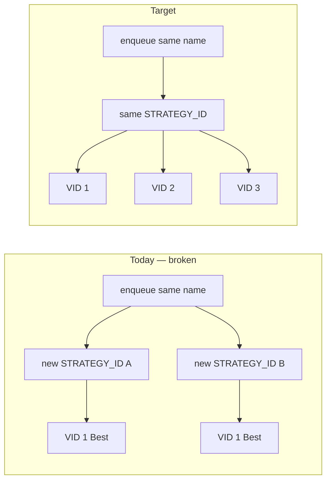
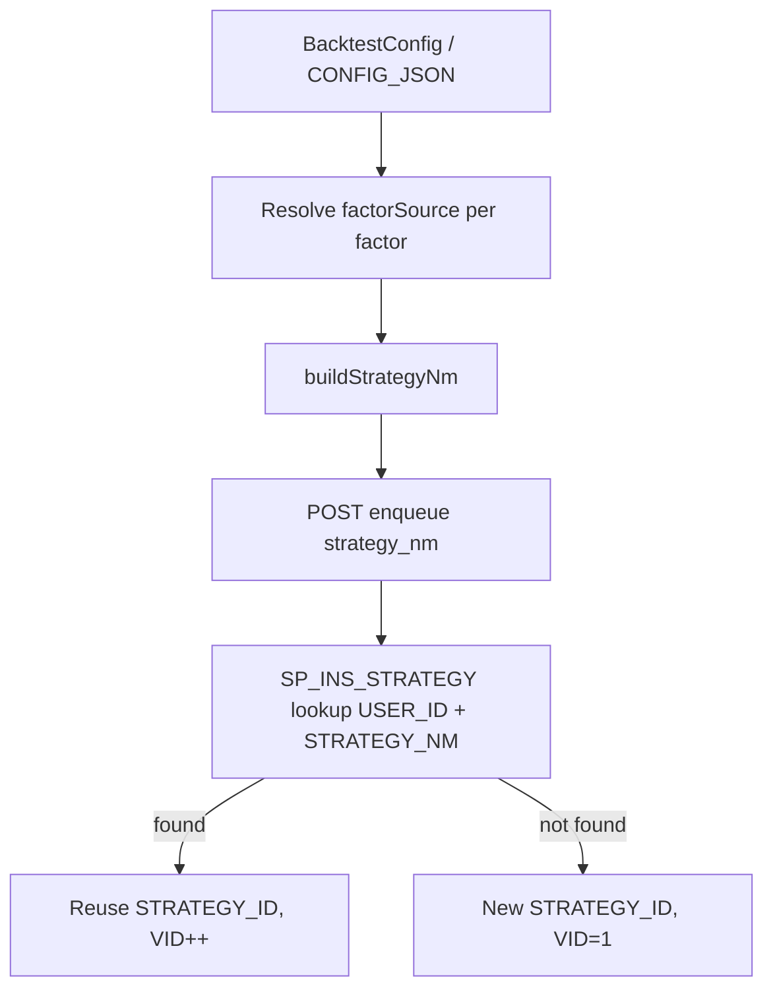
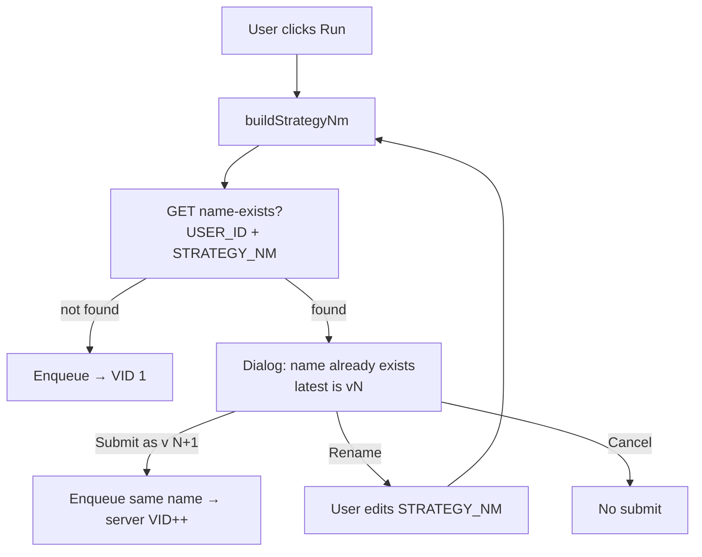
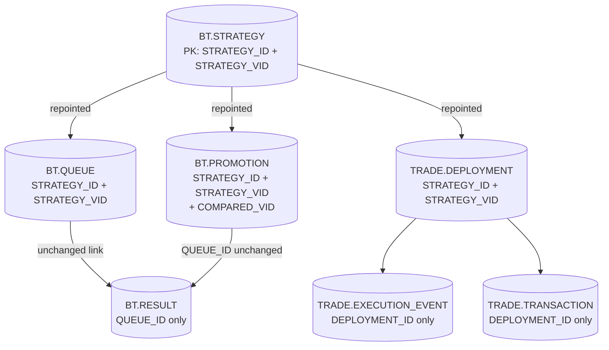

# Strategy VID Versioning by Name

**Status:** Implemented (release `1.10.0` — SP + Python + frontend name builder + data merge).

How to make repeated submissions of the **same strategy identity** increment
`STRATEGY_VID` (`v1`, `v2`, `v3`, …) under **one** `STRATEGY_ID`, add a
uniqueness guarantee on `(USER_ID, STRATEGY_NM, STRATEGY_VID)`, and clean up
duplicate rows already in `BT.STRATEGY`.

**Identity key:** `(USER_ID, STRATEGY_NM)` where `STRATEGY_NM` is a **canonical
recipe name** — trade product plus **per-factor signal source** (see
[Strategy name selection](#strategy-name-selection-and-identity)).

## Summary

| Today | Target |
|-------|--------|
| Every enqueue mints a new random `STRATEGY_ID` | Same `(USER_ID, STRATEGY_NM)` reuses one `STRATEGY_ID` |
| Each submission is always `VID=1` | VID increments: `1, 2, 3, …` per identity |
| Promotion UI shows two cards, both `v1` / Best | One card with `v1`, `v2`, … in time order |
| No uniqueness on name + VID | `UNIQUE (USER_ID, STRATEGY_NM, STRATEGY_VID)` |
| Name ignores factor underlying | Name includes trade product **and** each factor's signal source |



## Symptom

Submitting the same configuration twice produces **two separate strategy blocks** in
the Promotion tab, each showing `v1` / `Best`, instead of one block with
`v1`, `v2`:

```
btcusdt.crypto · get_bollinger_band/momentum    v1  Best   (19:03:32)
btcusdt.crypto · get_bollinger_band/momentum    v1  Best   (19:03:46)
```

Same root cause in the Jobs queue: two rows with the same `strategy_nm`, both
at `v1`.

## Root cause

Identity is keyed on a **random** `STRATEGY_ID`, not on the strategy name.

- `quant/api/services/jobs.py` mints
  `strategy_id = uuid.uuid4()` on **every** `enqueue()`.
- `BT.SP_INS_STRATEGY` (`db/liquidbase/bt/procedures/SP_INS_STRATEGY.sql`)
  computes the next VID as
  `SELECT COALESCE(MAX(STRATEGY_VID),0)+1 WHERE STRATEGY_ID = IN_STRATEGY_ID`.

Because the incoming `STRATEGY_ID` is always new, the `MAX(VID)` lookup always
finds nothing and returns `VID=1`. The name (`STRATEGY_NM`) never participates in
version resolution.

## Target behaviour

1. Same logical strategy (same **owner + canonical name**) → **one** `STRATEGY_ID`, with
   `STRATEGY_VID` incrementing `1, 2, 3, …` on each resubmission.
2. A **unique key** so duplicate `(name, vid)` rows cannot be created again.
3. Existing duplicated rows collapsed into the correct version history.

## Strategy name selection and identity

With [separated underlying](separate-underlying.md), the **trade product** (what
we buy/sell for PnL) and the **indicator underlying** (what each factor reads)
can differ. You do not necessarily trade the same product you use for the signal.

Example: trade **ETH**, compute RSI on **VIX**, combine with Bollinger on **BTC**.

Identity must capture **both** — not just the trade symbol.

### Problem — current name builder is too coarse

`frontend/src/pages/BacktestPage.tsx` builds
`strategy_nm` from the **trade symbol only** plus indicator/signal labels:

```typescript
const strategyNm = `${effectiveSymbol(config)} · ${config.factors
  .map((f) => `${f.indicator}/${f.strategy}`)
  .join(config.factors.length > 1 ? ` ${config.conjunction} ` : '')}`;
```

Per-factor overrides in `FactorConfig` (`frontend/src/types/backtest.ts`)
are **ignored**:

| Field | Meaning |
|-------|---------|
| `symbol` | `INTERNAL_CUSIP` for cross-product factor |
| `vendor_symbol` | Direct vendor symbol override for this factor |
| *(absent)* | Default — same as trade product |

These configs would **incorrectly collide** under Design A today:

| Trade on | Factor reads | Current (wrong) name |
|----------|--------------|----------------------|
| ETH | VIX | `ethusdt.crypto · get_rsi/momentum` |
| ETH | BTC | `ethusdt.crypto · get_rsi/momentum` |
| ETH | ETH (default) | `ethusdt.crypto · get_rsi/momentum` |

They are different strategies and must **not** share one `STRATEGY_ID`.

### What belongs in the identity key

Split **display** from **lookup** (Phase 1 can use one string for both; Phase 2
can add a separate fingerprint column).

| Included in identity | Excluded (same lineage, new VID per run) |
|--------------------|------------------------------------------|
| Trade product — top-level `symbol` / `vendorSymbol` | `start` / `end` date range |
| Per factor: **resolved signal source** | `window_range` / `signal_range` (grid bounds) |
| Per factor: `indicator`, `strategy` (signal type) | `fee_bps`, `walk_forward`, `split_ratio` |
| Per factor: **`data_column`** (the metric read) | Optimizer result params (`window`, `signal` values) |
| Per factor: `data_source` (when overridden) | |
| `conjunction` when `factors.length > 1` | |

**Resolved signal source** for each factor:

```text
factorSource(f, trade) = f.vendor_symbol ?? f.symbol ?? trade
```

Prefer `INTERNAL_CUSIP` in the stored name when available; resolve
`vendor_symbol` → cusip via `INST.PRODUCT_XREF` on the server when Phase 2
canonicalization lands (decision [#21 INTERNAL_CUSIP](../decisions.md)).

### Canonical name format (Phase 1 — recommended)

Single shared function used by **frontend enqueue** and **tests**; mirror in
Python for integration tests.

```typescript
// frontend/src/utils/strategyIdentity.ts (new)

import { effectiveSymbol } from './requestBuilders';

function factorSource(f: FactorConfig, trade: string): string {
  return f.vendor_symbol || f.symbol || trade;
}

/**
 * Canonical per-factor recipe: SOURCE/INDICATOR/SIGNAL on METRIC.
 *
 * `data_column` (the **metric** the indicator reads — e.g. `c`/close,
 * `v`/volume, or an on-chain series) is part of identity: trading the same
 * asset with the same indicator on a different metric is a DIFFERENT strategy.
 * `data_source` is appended only when explicitly overridden on the factor.
 */
function factorRecipe(f: FactorConfig, trade: string): string {
  const src = factorSource(f, trade);
  const metric = f.data_source ? `${f.data_source}:${f.data_column}` : f.data_column;
  return `${src}/${f.indicator}/${f.strategy} on ${metric}`;
}

/** Canonical STRATEGY_NM — used for DB identity lookup and UI display. */
export function buildStrategyNm(cfg: BacktestConfig): string {
  const trade = effectiveSymbol(cfg);
  const parts = cfg.factors.map((f) => factorRecipe(f, trade));
  const factors = parts.join(
    cfg.factors.length > 1 ? ` ${cfg.conjunction} ` : '',
  );
  return `${trade} ← ${factors}`;
}
```

**Examples:**

```text
ethusdt.crypto ← vix.equity_us/get_rsi/momentum_band_signal on c

ethusdt.crypto ← vix.equity_us/get_rsi/momentum_band_signal on c AND btcusdt.crypto/get_bollinger_band/momentum_band_signal on c

btcusdt.crypto ← btcusdt.crypto/get_bollinger_band/momentum_band_signal on c

# Same asset, same indicator, DIFFERENT metric → distinct strategies:
btcusdt.crypto ← btcusdt.crypto/get_bollinger_band/momentum_band_signal on c   (price)
btcusdt.crypto ← btcusdt.crypto/get_bollinger_band/momentum_band_signal on v   (volume)
btcusdt.crypto ← btcusdt.crypto/get_bollinger_band/momentum_band_signal on glassnode:sopr
```

The `←` reads as **“trade on left, signals on right”**. Pick a delimiter the
team likes; **stability** matters more than punctuation.

Wire-up:

1. Add `buildStrategyNm()` in `frontend/src/utils/strategyIdentity.ts`.
2. Replace inline string in `frontend/src/pages/BacktestPage.tsx`
   `handleRun` and any clone/re-backtest enqueue paths.
3. Unit tests in `strategyIdentity.test.ts` covering cross-product factors.
4. Pass result as `strategy_nm` on `POST /api/v1/backtest/jobs/enqueue` (unchanged API).

`JobsService.enqueue` (`quant/api/services/jobs.py`) stores the client-supplied
name; **Design A** resolves `STRATEGY_ID` from `(USER_ID, STRATEGY_NM)`.

### Optional Phase 2 — fingerprint column

If display text and identity must diverge (prettier labels, renames without
forking lineage), add:

| Column | Role |
|--------|------|
| `STRATEGY_NM` | Human label (editable display) |
| `STRATEGY_FINGERPRINT` | `SHA-256` of canonical JSON subset from `CONFIG_JSON` |

Lookup in `SP_INS_STRATEGY` becomes `(USER_ID, STRATEGY_FINGERPRINT)`.
Constraint: `UNIQUE (USER_ID, STRATEGY_FINGERPRINT, STRATEGY_VID)`.

Server builds fingerprint from `CONFIG_JSON` (not the client string) so UI and
API cannot drift:

```python
def strategy_fingerprint(config_json: dict) -> str:
    trade = config_json["symbol"]
    factors = config_json["factors"]
    canonical = {
        "trade": trade,
        "conjunction": config_json.get("conjunction"),
        "factors": [
            {
                "source": f.get("vendor_symbol") or f.get("symbol") or trade,
                "indicator": f["indicator"],
                "strategy": f["strategy"],
                "data_column": f.get("data_column", "v"),
                **({"data_source": f["data_source"]} if f.get("data_source") else {}),
            }
            for f in factors
        ],
    }
    return sha256(json.dumps(canonical, sort_keys=True).encode()).hexdigest()
```

Phase 1 does **not** require a schema change — fix the name builder first.

### Identity decision table

| Change | Same `STRATEGY_ID`? |
|--------|---------------------|
| Same trade + same factor sources + same indicators/signals + same metric | **Yes** → new VID |
| Factor source VIX → different product | **No** — new lineage |
| Same asset + same indicator, **different `data_column` (metric)** | **No** — new lineage |
| Same asset + same indicator/metric, **different `data_source`** | **No** — new lineage |
| Add or remove a factor | **No** |
| Change conjunction `AND` → `OR` | **No** |
| Change trade product, keep signals | **No** |
| Change date range or grid bounds only | **Yes** |
| `^VIX` vs `vix.equity_us` for same product | **Yes** after xref normalization (Phase 2) |



!!! note "Scoping: `(USER_ID, STRATEGY_NM, STRATEGY_VID)` — not global `(STRATEGY_NM, VID)`"
    Strategies are owned (`BT.STRATEGY.USER_ID`, see
    [User isolation](user-isolation.md)). Two different users may legitimately
    pick the same `STRATEGY_NM`. A **global** `UNIQUE (STRATEGY_NM, STRATEGY_VID)`
    would block user B from ever using a name user A already used.

    The constraint must be:

    ```sql
    UNIQUE (USER_ID, STRATEGY_NM, STRATEGY_VID)
    ```

    When people say "unique on strategy name and vid", include **`USER_ID`**
    unless the product decision is that names are globally unique across all users.

## Audit — find duplicates before cleanup

Run against prod (via SSM port-forward) to see how much cleanup is needed:

```sql
-- Duplicate (USER_ID, STRATEGY_NM, STRATEGY_VID) — blocks the unique constraint
SELECT USER_ID, STRATEGY_NM, STRATEGY_VID, COUNT(*) AS cnt
  FROM BT.STRATEGY
 GROUP BY 1, 2, 3
HAVING COUNT(*) > 1
 ORDER BY cnt DESC;

-- Same name, many STRATEGY_IDs each at VID=1 — the Promotion-tab symptom
SELECT USER_ID, STRATEGY_NM,
       COUNT(DISTINCT STRATEGY_ID) AS distinct_ids,
       COUNT(*)                    AS total_rows,
       MAX(STRATEGY_VID)           AS max_vid
  FROM BT.STRATEGY
 GROUP BY 1, 2
HAVING COUNT(DISTINCT STRATEGY_ID) > 1
    OR MAX(STRATEGY_VID) = 1 AND COUNT(*) > 1
 ORDER BY total_rows DESC;
```

## How to fix it (implementation)

There are three approaches. **Design A is the authoritative backbone and is
recommended; Design C is an optional UX layer that sits on top of it (see
[Which design is more solid](#which-design-is-more-solid)).** Design B is a
lighter alternative to A.

### Design A — Resolve `STRATEGY_ID` from the name inside the SP (recommended)

The procedure looks up an existing `STRATEGY_ID` for `(USER_ID, STRATEGY_NM)`;
if found it reuses that ID and increments the VID, otherwise it allocates a new
`STRATEGY_ID` at `VID=1`. Python stops generating an ID per enqueue.

**1. SP change** — `BT.SP_INS_STRATEGY` (new `db/liquidbase/bt/releases/*.xml`
changeset, `CREATE OR REPLACE PROCEDURE`):

```sql
-- Step 00: Serialize concurrent enqueues of the SAME identity so the
-- MAX(VID)+1 read below cannot race. Transaction-scoped — released on COMMIT.
-- Without this, two simultaneous submits of one (USER_ID, STRATEGY_NM) can both
-- read the same MAX(VID) and collide on the new UNIQUE constraint.
PERFORM pg_advisory_xact_lock(hashtextextended(IN_USER_ID || '|' || IN_STRATEGY_NM, 0));

-- Step 05: Resolve the logical strategy id from (USER_ID, STRATEGY_NM).
SELECT STRATEGY_ID
  INTO V_STRATEGY_ID
  FROM BT.STRATEGY
 WHERE USER_ID     = IN_USER_ID
   AND STRATEGY_NM = IN_STRATEGY_NM
 ORDER BY STRATEGY_VID DESC
 LIMIT 1;

IF V_STRATEGY_ID IS NULL THEN
    V_STRATEGY_ID := COALESCE(IN_STRATEGY_ID, gen_random_uuid());
END IF;

-- Step 10: Next VID for THIS logical strategy.
SELECT COALESCE(MAX(STRATEGY_VID), 0) + 1
  INTO V_VID
  FROM BT.STRATEGY
 WHERE STRATEGY_ID = V_STRATEGY_ID;
```

!!! warning "Concurrency: lock before the `MAX(VID)` read"
    Both Design A and Design B compute `MAX(STRATEGY_VID)+1` then `INSERT`. Two
    concurrent enqueues of the same identity can read the same `MAX` and try to
    insert the same VID — once `UQ_STRATEGY_USER_NM_VID` exists, one throws. The
    `pg_advisory_xact_lock` above serializes per identity; alternatively wrap the
    insert in a unique-violation retry loop. This is real here — the queue has a
    worker and multiple concurrent submitters.

The existing Steps 20–30 (close prior active row, insert new active row) stay as
is but use `V_STRATEGY_ID`. Add an `OUT_STRATEGY_ID UUID` parameter so the caller
learns the resolved id (it is no longer the value it passed in).

**2. Python change** — `quant/api/services/jobs.py`
and the wrapper in `quant/queue/repo.py`:
stop minting `strategy_id` per call; pass `NULL` and read back the resolved
`OUT_STRATEGY_ID` + `OUT_STRATEGY_VID`, then enqueue against that pair.

```python
# jobs.py — before
strategy_id = uuid.uuid4()
strategy_vid = self._repo.sp_ins_strategy(strategy_id=strategy_id, ...)

# after
strategy_id, strategy_vid = self._repo.sp_ins_strategy(
    strategy_nm=req.strategy_nm, config_json=req.config_json, user_id=user_id,
)
```

**3. Enqueue call sites** — today there is exactly **one** client path that
builds a name and enqueues: `handleRun` in
`frontend/src/pages/BacktestPage.tsx`. The existing
`reenqueueJob` (`frontend/src/api/jobs.ts`) path is **server-side** and
reuses the original queue row's `(STRATEGY_ID, STRATEGY_VID)` — it neither builds
a name nor mints an id, so it needs no change. Any **future** "Re-backtest" /
"Clone & edit" UI affordance that enqueues a fresh job must call the same
`buildStrategyNm()` (or server fingerprint in Phase 2) and must **not** mint a new
`STRATEGY_ID`. These UI paths do not exist yet — treat them as follow-up work,
not current call sites.

**4. Name builder** — implement [Strategy name selection](#strategy-name-selection-and-identity)
**before** or **with** the SP/Python change so cross-product configs do not
collide.

### Design B — Deterministic `STRATEGY_ID` from the name (alternative)

Keep the SP unchanged; make the **id deterministic** in Python so the existing
"existing id ⇒ increment" path fires:

```python
strategy_id = uuid.uuid5(STRATEGY_NS, f"{user_id}|{req.strategy_nm}")
```

Use the **canonical** `strategy_nm` from `buildStrategyNm()`, not the legacy
trade-only format. Simpler (no SP change) but couples the id to the name
permanently — renaming a strategy creates a new lineage. Prefer Design A unless
renames are guaranteed never to happen.

### Design C — Duplicate-name prompt at enqueue (intent capture, layered on A)

Instead of (or in addition to) silently versioning, **warn the user at submit
time** when their canonical name already exists, and let them choose:

- **Submit as next version** → reuse the existing `STRATEGY_ID`, `VID++`
  (exactly what Design A does on the server).
- **Rename / customize** → edit `STRATEGY_NM` so it becomes a **new** lineage
  (`VID=1`).

This captures **explicit intent** that Design A can only *assume*: a canonical
name collision might mean "this is v2" or it might mean "two genuinely different
strategies happen to share a name." The server cannot tell those apart; the user
can.



**Wire-up:**

1. Add a read-only lookup the dialog can call — a new `SP_GET_STRATEGY_BY_NM`
   (or extend an existing `SP_GET_STRATEGY`) returning the latest VID for
   `(USER_ID, STRATEGY_NM)`, exposed via a small `GET` endpoint. **Reads go
   through an SP** (see `AGENTS.md` — no raw `SELECT` in app code).
2. In `handleRun` (`frontend/src/pages/BacktestPage.tsx`),
   call the lookup after `buildStrategyNm()`; if a match exists, open a dialog
   showing the current latest version and the three choices above.
3. On **Submit as next version**, enqueue unchanged — the server (Design A) does
   the `VID++`. On **Rename**, replace `STRATEGY_NM` and re-run the check.

!!! danger "Design C is advisory — it is NOT the integrity guarantee"
    The dialog is a convenience that can be **bypassed**: the `reenqueue` path,
    direct API calls, scripts, other clients, or two tabs racing all skip it.
    Design C must therefore sit **on top of** Design A's server resolution **and**
    the `UNIQUE (USER_ID, STRATEGY_NM, STRATEGY_VID)` constraint — never replace
    them. If the dialog is skipped, the server still does the right thing.

### Which design is more solid

| Aspect | Design A (server resolves) | Design B (deterministic id) | Design C (popup + rename) |
|--------|----------------------------|------------------------------|----------------------------|
| Where identity is enforced | **Server SP + DB constraint** | Server SP + DB constraint (id derived in Python) | **Client UI only** |
| Bypassable (API/script/race) | **No** | **No** | **Yes** |
| Captures user intent (version vs. fork) | No (assumes same name = same lineage) | No | **Yes** |
| Handles concurrent submits | Yes, with advisory lock | Needs same lock | No (advisory) |
| Schema change required | `OUT_STRATEGY_ID` param | None | None (Phase 1) |
| Rename behaviour | Free — name is editable display | Rename forks lineage (id ∝ name) | User-driven by design |

**Verdict:** **Design A is the most solid** because identity is resolved and
enforced at the write boundary (SP + unique constraint), so it cannot be
bypassed or raced. **Design C is the best *complement***, not a substitute — it
adds the one thing A lacks (explicit intent on a name collision) but provides no
integrity on its own. Recommended target: **A + C** — server-authoritative
versioning with an optional intent dialog. Design B is a fallback only if the SP
change must be avoided and strategies are guaranteed never to be renamed.

!!! note "Where versioning is *surfaced*: the Promotion tab"
    Identity is **decided at enqueue** (server, optionally gated by the Design C
    dialog). VIDs are **consumed and compared** in the Promotion tab
    (`frontend/src/components/PromotionTab.tsx`), which
    groups decisions and renders `v1`, `v2`, … per strategy with soft-metric
    baselines (`COMPARED_VID`). The Promotion tab is **not** where identity is
    established — it reads the lineage the enqueue path created. After this fix
    it should group by `(user_id, strategy_nm)` rather than raw `strategy_id`
    (see [UI follow-ups](#ui-follow-ups)).

## Add the unique constraint

Once the insert path is fixed **and** existing duplicates are cleaned up, enforce
at the schema level. New `db/liquidbase/bt/releases/*.xml` changeset:

```sql
ALTER TABLE BT.STRATEGY
    ADD CONSTRAINT UQ_STRATEGY_USER_NM_VID
    UNIQUE (USER_ID, STRATEGY_NM, STRATEGY_VID);
```

!!! warning "Clean up data first"
    This `ALTER` **fails** while duplicate `(USER_ID, STRATEGY_NM, STRATEGY_VID)`
    rows still exist. Run the cleanup below **before** adding the constraint.

The table keeps its existing composite PK `(STRATEGY_ID, STRATEGY_VID)` for
temporal versioning and child-table joins. The new unique constraint is an
**additional** guarantee on the human-facing identity `(owner, name, version)`.

## Clean up existing data

Trade is **not live** — use a **one-off TRUNCATE** (release `1.10.0-001`), not a
merge/re-key. Wipes all backtest history and deployment rows so duplicate
`(USER_ID, STRATEGY_NM, VID=1)` rows cannot block `UQ_STRATEGY_USER_NM_VID`.

**Source:** `db/liquidbase/bt/data/strategy_vid_truncate.sql`

```sql
TRUNCATE TABLE
    BT.PROMOTION,
    BT.RESULT,
    BT.QUEUE,
    BT.STRATEGY;
```

Does **not** truncate `TRADE.*` — trade deployment is a separate track.

### Steps

1. **Back up** — see [Database Dump & Restore](../guides/database-dump-restore.md).
2. Run Liquibase **`1.10.0-strategy-vid-versioning`** (truncate changeset runs first).
3. Re-run backtests to repopulate `BT.STRATEGY` / queue / promotion under the new
   name + VID rules.

!!! danger "Pre-live only"
    Do **not** run this truncate after live trading or when deployment history must
    be kept. Use the [merge appendix](#cleanup-sql-appendix-merge-post-live-only)
    instead.

The unique constraint ships in the same release (`1.10.0-004`), after truncate + SP fix.

## Table dependencies and migration impact (appendix — merge path)

**Nothing is deleted.** Row counts for jobs, results, promotions, and deployments
stay the same. The migration **re-keys** rows in affected `(USER_ID, STRATEGY_NM)`
groups: many `STRATEGY_ID`s collapse to one **survivor** id (earliest
`CREATED_AT`), and duplicate `VID=1`s become `VID=1, 2, 3, …` by submission time.



No FK constraints — all links are logical. `BT.API_REQUEST`, `INST.*`, and
`REFDATA.*` are unrelated.

### Per-table action

| Table | Migration | Rows kept? | What changes |
|-------|-----------|------------|--------------|
| **BT.STRATEGY** | Renumber PK | **Yes — all** | Non-survivor UUIDs vanish as keys; `TRANSACT_TO_TS` / `IS_BEST_IND` repaired |
| **BT.QUEUE** | `UPDATE` strategy cols | **Yes — all** | `QUEUE_ID`, `QUEUE_VID`, status, user unchanged |
| **BT.PROMOTION** | `UPDATE` strategy cols | **Yes — all** | `PROMOTION_ID`, `QUEUE_ID`, `OUTCOME`, `GATE_RESULTS` unchanged |
| **BT.RESULT** | **Not touched** | **Yes — all** | Still joins via `QUEUE_ID` |
| **TRADE.DEPLOYMENT** | `UPDATE` strategy cols | **Yes — all** | `DEPLOYMENT_ID`, `DEPLOYMENT_VID` unchanged |
| **TRADE.EXECUTION_EVENT** | **Not touched** | **Yes** | Follows deployment via `DEPLOYMENT_ID` |
| **TRADE.TRANSACTION** | **Not touched** | **Yes** | Same |

### Complete reference inventory

Every place in the repo that stores or joins on strategy identity:

| Location | Column / field | Updated by base migration? | Needed for correct runtime? |
|----------|----------------|----------------------------|-----------------------------|
| `BT.STRATEGY` | `STRATEGY_ID`, `STRATEGY_VID` (PK) | **Yes** | **Yes** |
| `BT.STRATEGY` | `CONFIG_JSON→strategy_id` | No | Cosmetic / clone path only |
| `BT.STRATEGY` | `CONFIG_JSON→name` (contains id prefix) | No | Display only |
| `BT.QUEUE` | `STRATEGY_ID`, `STRATEGY_VID` | **Yes** | **Yes** — worker + Jobs UI join |
| `BT.PROMOTION` | `STRATEGY_ID`, `STRATEGY_VID` | **Yes** | **Yes** |
| `BT.PROMOTION` | `COMPARED_VID` | No (base script) | **Yes** — Promotion soft-comparison panel |
| `BT.PROMOTION` | `GATE_RESULTS` JSON | No | No strategy id inside |
| `BT.RESULT` | `PAYLOAD_JSON` | No | Worker payload has no top-level `strategy_id` today |
| `BT.RESULT` | shredded metric cols | No | Unaffected |
| `TRADE.DEPLOYMENT` | `STRATEGY_ID`, `STRATEGY_VID` | **Yes** | **Yes** — apply + existence check |
| `TRADE.EXECUTION_EVENT` | — | No | Indirect via `DEPLOYMENT_ID` |
| `TRADE.TRANSACTION` | — | No | Indirect via `DEPLOYMENT_ID` |
| `CORE_ADMIN.LOG_PROC_DETAIL` | `OTHER_TEXT` | No | Audit trail — keep old UUIDs |
| `BT.API_REQUEST` | — | No | Unrelated (data subscriptions) |

**Indirect tables** (`EXECUTION_EVENT`, `TRANSACTION`) need no strategy-column
update: repointing `TRADE.DEPLOYMENT` is enough.

### Optional extended updates (recommended)

These are **not required** for joins or worker correctness, but fix UI/history
consistency after merge.

#### 1. `BT.PROMOTION.COMPARED_VID` (recommended)

`COMPARED_VID` is an integer baseline **within the same `STRATEGY_ID` lineage**.
Before merge, duplicate names lived on separate ids, so many rows have
`COMPARED_VID IS NULL` even when a human would say “compare to v1”.

The Promotion tab resolves the baseline row like this:

```typescript
rows.find((r) => r.strategy_id === row.strategy_id && r.strategy_vid === row.compared_vid)
```

After merge, NULL `COMPARED_VID` on `v2+` rows → soft comparison shows
“(no baseline)” even though `v1` exists.

Run **before** repointing `BT.PROMOTION.STRATEGY_ID` / `STRATEGY_VID` (still on
old keys, `strategy_vid_map` already built):

```sql
-- 1a. Remap non-null COMPARED_VID through the vid map (same old STRATEGY_ID lineage)
UPDATE BT.PROMOTION p
   SET COMPARED_VID = mb.new_vid
  FROM strategy_vid_map mb
 WHERE mb.old_strategy_id = p.STRATEGY_ID
   AND mb.old_strategy_vid = p.COMPARED_VID
   AND p.COMPARED_VID IS NOT NULL
   AND EXISTS (
       SELECT 1 FROM strategy_vid_map m
        WHERE m.old_strategy_id = p.STRATEGY_ID
          AND m.old_strategy_vid = p.STRATEGY_VID
   );

-- 1b. Backfill NULL compared_vid for merged v2+ rows (baseline = v1 on survivor)
UPDATE BT.PROMOTION p
   SET COMPARED_VID = 1
  FROM strategy_vid_map m
 WHERE p.STRATEGY_ID  = m.old_strategy_id
   AND p.STRATEGY_VID = m.old_strategy_vid
   AND p.COMPARED_VID IS NULL
   AND m.new_vid > 1
   AND EXISTS (
       SELECT 1 FROM strategy_vid_map m1
        WHERE m1.survivor_id = m.survivor_id
          AND m1.new_vid = 1
   );
```

#### 2. `BT.STRATEGY.CONFIG_JSON→strategy_id` (optional)

Written by `strategy_config_to_json()` (`quant/strategy/signals.py`). Not
used for DB joins; stale value can confuse “clone & edit” if code ever reads
config JSON instead of queue/strategy SP columns.

Run **after** `BT.STRATEGY` PK renumber (rows keyed by `survivor_id`, `new_vid`):

```sql
UPDATE BT.STRATEGY s
   SET CONFIG_JSON = jsonb_set(
           s.CONFIG_JSON,
           '{strategy_id}',
           to_jsonb(m.survivor_id::text),
           false
       )
  FROM strategy_vid_map m
 WHERE s.STRATEGY_ID  = m.survivor_id
   AND s.STRATEGY_VID = m.new_vid
   AND s.CONFIG_JSON ? 'strategy_id'
   AND s.CONFIG_JSON->>'strategy_id' IS DISTINCT FROM m.survivor_id::text;
```

The auto-generated `name` field (`{cusip}_strategy_{id[:8]}`) can stay stale;
only update if you care about display parity.

#### 3. `BT.RESULT.PAYLOAD_JSON` (audit first — usually skip)

Current worker stores `OptimizeResponse.model_dump()` — **no top-level
`strategy_id`**. Audit before writing any update:

```sql
SELECT COUNT(*) AS rows_with_strategy_id
  FROM BT.RESULT
 WHERE PAYLOAD_JSON ? 'strategy_id';

-- nested search (slower)
SELECT COUNT(*)
  FROM BT.RESULT
 WHERE PAYLOAD_JSON::text ILIKE '%strategy_id%';
```

If count is 0, skip. If non-zero (legacy data), patch via queue join:

```sql
UPDATE BT.RESULT r
   SET PAYLOAD_JSON = jsonb_set(
           r.PAYLOAD_JSON,
           '{strategy_id}',
           to_jsonb(q.STRATEGY_ID::text),
           false
       )
  FROM BT.QUEUE q
  JOIN strategy_vid_map m
    ON m.survivor_id = q.STRATEGY_ID
   AND m.new_vid     = q.STRATEGY_VID
 WHERE r.QUEUE_ID = q.QUEUE_ID
   AND r.PAYLOAD_JSON ? 'strategy_id';
```

(Only rows whose queue row was repointed need this; use `DISTINCT ON (q.QUEUE_ID)`
if multiple queue versions exist.)

#### 4. `CORE_ADMIN.LOG_PROC_DETAIL` — do not update

`OTHER_TEXT` snapshots inputs like `IN_STRATEGY_ID=…` at call time. Updating
would erase useful audit history.

### Audit: find stale embedded ids before/after

```sql
-- CONFIG_JSON still pointing at a retired STRATEGY_ID
SELECT s.STRATEGY_ID, s.STRATEGY_VID, s.STRATEGY_NM,
       s.CONFIG_JSON->>'strategy_id' AS config_id
  FROM BT.STRATEGY s
 WHERE s.CONFIG_JSON ? 'strategy_id'
   AND s.CONFIG_JSON->>'strategy_id' IS DISTINCT FROM s.STRATEGY_ID::text;

-- Promotion soft-comparison gaps (merged groups, v2+, no baseline)
SELECT p.STRATEGY_ID, p.STRATEGY_VID, p.COMPARED_VID, p.OUTCOME
  FROM BT.PROMOTION p
  JOIN BT.STRATEGY s USING (STRATEGY_ID, STRATEGY_VID)
 WHERE p.COMPARED_VID IS NULL
   AND p.STRATEGY_VID > 1
   AND EXISTS (
       SELECT 1 FROM BT.STRATEGY s2
        WHERE s2.STRATEGY_ID = p.STRATEGY_ID
          AND s2.STRATEGY_VID = 1
   );

-- Orphan strategy refs (should be 0 after migration)
SELECT 'queue' AS src, COUNT(*) FROM BT.QUEUE q
  LEFT JOIN BT.STRATEGY s USING (STRATEGY_ID, STRATEGY_VID) WHERE s.STRATEGY_ID IS NULL
UNION ALL
SELECT 'promotion', COUNT(*) FROM BT.PROMOTION p
  LEFT JOIN BT.STRATEGY s USING (STRATEGY_ID, STRATEGY_VID) WHERE s.STRATEGY_ID IS NULL
UNION ALL
SELECT 'deployment', COUNT(*) FROM TRADE.DEPLOYMENT d
  LEFT JOIN BT.STRATEGY s USING (STRATEGY_ID, STRATEGY_VID) WHERE s.STRATEGY_ID IS NULL;
```

### Will any query suddenly return 0 rows?

| Scenario | Rows lost? |
|----------|------------|
| Global promotion / jobs list (no id filter) | **No** — same count, updated keys |
| Filter by **survivor** `STRATEGY_ID` after migration | **No** — may return **more** VIDs than before |
| Filter by **retired** UUID | **Yes → 0 rows** (expected) |
| Filter by survivor UUID + **old** VID number | **Yes → 0 rows** if VID was renumbered |
| `SP_GET_STRATEGY` for untouched single-id strategies | **No change** |
| Trade deploy list | **No** — deployments repointed |
| Result fetch by `QUEUE_ID` | **No** |
| Promotion soft panel “vs vN” | **May show “no baseline”** unless `COMPARED_VID` extended update runs |

### Not migrated (stale but harmless for joins)

| Location | Notes |
|----------|-------|
| **BT.STRATEGY.CONFIG_JSON** | Optional patch above; joins do not use it |
| **BT.RESULT.PAYLOAD_JSON** | Usually no `strategy_id`; audit first |
| **BT.PROMOTION.COMPARED_VID** | **Recommended** extended update — affects Promotion UI only |
| **CORE_ADMIN logs** | Intentionally kept |

### Groups left untouched

Migration runs only for `(USER_ID, STRATEGY_NM)` where
`COUNT(DISTINCT STRATEGY_ID) > 1` or multiple rows all at `VID=1`. Strategies
that already have one `STRATEGY_ID` with proper `v1, v2, v3` are unchanged.
Rows with **`STRATEGY_NM IS NULL`** are excluded — fix manually first.

### Queries that return 0 rows after migration

Only when using **retired** `(STRATEGY_ID, STRATEGY_VID)` keys:

| Query / usage | Why |
|---------------|-----|
| `SP_GET_STRATEGY(old_discarded_uuid, …)` | Rows moved to survivor id |
| `SP_GET_STRATEGY(survivor_uuid, old_vid)` | VID renumbered (e.g. old `v1` on duplicate id B → `v2` on survivor) |
| `SP_GET_QUEUE(IN_STRATEGY_ID = old_uuid)` | Queue rows repointed |
| `SP_GET_PROMOTION(IN_STRATEGY_ID = old_uuid)` | Promotion rows repointed |
| `POST /backtest/jobs/strategies/{old_uuid}/promote` | Id no longer exists |
| Trade API filtered by old `strategy_id` | Deployments repointed |

### Queries that do **not** lose rows

| Query / usage | Behaviour |
|---------------|-----------|
| `SP_GET_PROMOTION()` global (no filter) | Same row count — ids/vids updated in place |
| `SP_GET_QUEUE()` by `USER_ID` | Same jobs — strategy columns updated |
| `BT.RESULT` by `QUEUE_ID` | Unchanged |
| Promotion tab (global list) | Same decisions — **fewer** accordion blocks (names merge) |
| Jobs table | Same jobs — strategy name/vid should populate correctly |

**Example:** before, `(id=A,vid=1)` and `(id=B,vid=1)` for the same name; after,
`(id=A,vid=1)` and `(id=A,vid=2)`. `SP_GET_STRATEGY(B, 1)` → 0 rows;
global promotion list → still 2 rows.

---

## Cleanup SQL (appendix — merge, post-live only)

Run on **staging first**, with a backup. Replace `COMMIT` with `ROLLBACK` for a
dry-run. Deploy as a one-off Liquibase `<sql>` changeset when approved.

### Pre-flight audit (read-only)

```sql
-- Duplicate (USER_ID, STRATEGY_NM, STRATEGY_VID) — blocks the unique constraint
SELECT USER_ID, STRATEGY_NM, STRATEGY_VID, COUNT(*) AS cnt
  FROM BT.STRATEGY
 GROUP BY 1, 2, 3
HAVING COUNT(*) > 1
 ORDER BY cnt DESC;

-- Same name, many STRATEGY_IDs — the Promotion-tab symptom
SELECT USER_ID, STRATEGY_NM,
       COUNT(DISTINCT STRATEGY_ID) AS distinct_ids,
       COUNT(*)                    AS total_rows,
       MAX(STRATEGY_VID)           AS max_vid
  FROM BT.STRATEGY
 GROUP BY 1, 2
HAVING COUNT(DISTINCT STRATEGY_ID) > 1
    OR (COUNT(*) > 1 AND MAX(STRATEGY_VID) = 1 AND MIN(STRATEGY_VID) = 1)
 ORDER BY total_rows DESC;
```

### Migration (single transaction)

```sql
BEGIN;

-- ---------------------------------------------------------------------------
-- Build mapping: (old STRATEGY_ID, old STRATEGY_VID) → (survivor_id, new_vid)
-- Survivor = STRATEGY_ID from earliest CREATED_AT per (USER_ID, STRATEGY_NM).
-- ---------------------------------------------------------------------------
CREATE TEMP TABLE strategy_vid_map ON COMMIT DROP AS
WITH affected AS (
    SELECT USER_ID, STRATEGY_NM
      FROM BT.STRATEGY
     WHERE STRATEGY_NM IS NOT NULL
     GROUP BY 1, 2
    HAVING COUNT(DISTINCT STRATEGY_ID) > 1
        OR (COUNT(*) > 1 AND MAX(STRATEGY_VID) = 1 AND MIN(STRATEGY_VID) = 1)
),
ranked AS (
    SELECT s.STRATEGY_ID                    AS old_strategy_id,
           s.STRATEGY_VID                   AS old_strategy_vid,
           s.USER_ID,
           s.STRATEGY_NM,
           s.IS_BEST_IND = 'Y'              AS was_best,
           FIRST_VALUE(s.STRATEGY_ID) OVER (
               PARTITION BY s.USER_ID, s.STRATEGY_NM
               ORDER BY s.CREATED_AT, s.STRATEGY_ID, s.STRATEGY_VID
           )                                AS survivor_id,
           ROW_NUMBER() OVER (
               PARTITION BY s.USER_ID, s.STRATEGY_NM
               ORDER BY s.CREATED_AT, s.STRATEGY_ID, s.STRATEGY_VID
           )::INTEGER                       AS new_vid
      FROM BT.STRATEGY s
      JOIN affected a
        ON a.USER_ID     = s.USER_ID
       AND a.STRATEGY_NM = s.STRATEGY_NM
)
SELECT *
  FROM ranked;

-- Preview mapping before continuing:
-- SELECT * FROM strategy_vid_map ORDER BY USER_ID, STRATEGY_NM, new_vid;

-- Sanity: no duplicate target keys
DO $$
BEGIN
    IF EXISTS (
        SELECT 1
          FROM strategy_vid_map
         GROUP BY survivor_id, new_vid
        HAVING COUNT(*) > 1
    ) THEN
        RAISE EXCEPTION 'Mapping would create duplicate (survivor_id, new_vid)';
    END IF;

    -- The two-phase renumber below bumps VIDs by +1000000 to dodge PK
    -- collisions; fail loud if any real VID is already that large.
    IF EXISTS (SELECT 1 FROM BT.STRATEGY WHERE STRATEGY_VID >= 1000000) THEN
        RAISE EXCEPTION 'STRATEGY_VID >= 1000000 exists; +1000000 bump offset is unsafe';
    END IF;
END $$;

-- ---------------------------------------------------------------------------
-- Repoint child tables BEFORE touching BT.STRATEGY PK
-- BT.RESULT links via QUEUE_ID only — no update needed.
-- ---------------------------------------------------------------------------
UPDATE BT.QUEUE q
   SET STRATEGY_ID  = m.survivor_id,
       STRATEGY_VID = m.new_vid
  FROM strategy_vid_map m
 WHERE q.STRATEGY_ID  = m.old_strategy_id
   AND q.STRATEGY_VID = m.old_strategy_vid;

-- COMPARED_VID (optional but recommended) — while promotion rows still on old keys
UPDATE BT.PROMOTION p
   SET COMPARED_VID = mb.new_vid
  FROM strategy_vid_map mb
 WHERE mb.old_strategy_id = p.STRATEGY_ID
   AND mb.old_strategy_vid = p.COMPARED_VID
   AND p.COMPARED_VID IS NOT NULL
   AND EXISTS (
       SELECT 1 FROM strategy_vid_map m
        WHERE m.old_strategy_id = p.STRATEGY_ID
          AND m.old_strategy_vid = p.STRATEGY_VID
   );

UPDATE BT.PROMOTION p
   SET COMPARED_VID = 1
  FROM strategy_vid_map m
 WHERE p.STRATEGY_ID  = m.old_strategy_id
   AND p.STRATEGY_VID = m.old_strategy_vid
   AND p.COMPARED_VID IS NULL
   AND m.new_vid > 1
   AND EXISTS (
       SELECT 1 FROM strategy_vid_map m1
        WHERE m1.survivor_id = m.survivor_id
          AND m1.new_vid = 1
   );

UPDATE BT.PROMOTION p
   SET STRATEGY_ID  = m.survivor_id,
       STRATEGY_VID = m.new_vid
  FROM strategy_vid_map m
 WHERE p.STRATEGY_ID  = m.old_strategy_id
   AND p.STRATEGY_VID = m.old_strategy_vid;

UPDATE TRADE.DEPLOYMENT d
   SET STRATEGY_ID  = m.survivor_id,
       STRATEGY_VID = m.new_vid
  FROM strategy_vid_map m
 WHERE d.STRATEGY_ID  = m.old_strategy_id
   AND d.STRATEGY_VID = m.old_strategy_vid;

-- ---------------------------------------------------------------------------
-- Renumber BT.STRATEGY (two-phase to avoid PK collisions)
-- ---------------------------------------------------------------------------

-- Phase 1: bump VIDs out of the way for rows that will change
UPDATE BT.STRATEGY s
   SET STRATEGY_VID = s.STRATEGY_VID + 1000000
  FROM strategy_vid_map m
 WHERE s.STRATEGY_ID  = m.old_strategy_id
   AND s.STRATEGY_VID = m.old_strategy_vid
   AND (m.old_strategy_id, m.old_strategy_vid)
       IS DISTINCT FROM (m.survivor_id, m.new_vid);

-- Phase 2: apply survivor_id + final VID
UPDATE BT.STRATEGY s
   SET STRATEGY_ID  = m.survivor_id,
       STRATEGY_VID = m.new_vid
  FROM strategy_vid_map m
 WHERE s.STRATEGY_ID  = m.old_strategy_id
   AND s.STRATEGY_VID = m.old_strategy_vid + 1000000;

-- ---------------------------------------------------------------------------
-- Fix temporal columns: only latest VID stays open (9999-12-31)
-- ---------------------------------------------------------------------------
WITH migrated AS (
    SELECT DISTINCT survivor_id AS strategy_id
      FROM strategy_vid_map
),
ordered AS (
    SELECT s.STRATEGY_ID,
           s.STRATEGY_VID,
           LEAD(s.CREATED_AT) OVER (
               PARTITION BY s.STRATEGY_ID
               ORDER BY s.STRATEGY_VID
           ) AS next_created_at
      FROM BT.STRATEGY s
      JOIN migrated m ON m.strategy_id = s.STRATEGY_ID
)
UPDATE BT.STRATEGY s
   SET TRANSACT_TO_TS = COALESCE(
           o.next_created_at,
           TIMESTAMPTZ '9999-12-31 00:00:00+00'
       )
  FROM ordered o
 WHERE s.STRATEGY_ID  = o.STRATEGY_ID
   AND s.STRATEGY_VID = o.STRATEGY_VID;

-- ---------------------------------------------------------------------------
-- Fix IS_BEST_IND: one Y per (USER_ID, STRATEGY_NM)
-- Prefer row that was best before migration; else highest new_vid.
-- ---------------------------------------------------------------------------
UPDATE BT.STRATEGY s
   SET IS_BEST_IND = 'N'
  FROM strategy_vid_map m
 WHERE s.STRATEGY_ID = m.survivor_id;

WITH best_pick AS (
    SELECT DISTINCT ON (m.USER_ID, m.STRATEGY_NM)
           m.survivor_id AS strategy_id,
           m.new_vid     AS strategy_vid
      FROM strategy_vid_map m
     ORDER BY m.USER_ID, m.STRATEGY_NM,
              CASE WHEN m.was_best THEN 0 ELSE 1 END,
              m.new_vid DESC
)
UPDATE BT.STRATEGY s
   SET IS_BEST_IND = 'Y'
  FROM best_pick b
 WHERE s.STRATEGY_ID  = b.strategy_id
   AND s.STRATEGY_VID = b.strategy_vid;

-- CONFIG_JSON strategy_id (optional) — after PK renumber
UPDATE BT.STRATEGY s
   SET CONFIG_JSON = jsonb_set(
           s.CONFIG_JSON,
           '{strategy_id}',
           to_jsonb(m.survivor_id::text),
           false
       )
  FROM strategy_vid_map m
 WHERE s.STRATEGY_ID  = m.survivor_id
   AND s.STRATEGY_VID = m.new_vid
   AND s.CONFIG_JSON ? 'strategy_id'
   AND s.CONFIG_JSON->>'strategy_id' IS DISTINCT FROM m.survivor_id::text;

-- BT.RESULT.PAYLOAD_JSON — audit first; usually no-op (see extended updates section)

COMMIT;
```

### Post-flight validation (read-only)

```sql
-- Should return 0 rows
SELECT USER_ID, STRATEGY_NM, STRATEGY_VID, COUNT(*) AS cnt
  FROM BT.STRATEGY
 GROUP BY 1, 2, 3
HAVING COUNT(*) > 1;

-- Should return 0 rows (one STRATEGY_ID per name per user)
SELECT USER_ID, STRATEGY_NM, COUNT(DISTINCT STRATEGY_ID) AS distinct_ids
  FROM BT.STRATEGY
 GROUP BY 1, 2
HAVING COUNT(DISTINCT STRATEGY_ID) > 1;

-- Orphan check — all should be 0
SELECT COUNT(*) AS orphan_queues
  FROM BT.QUEUE q
  LEFT JOIN BT.STRATEGY s
         ON s.STRATEGY_ID  = q.STRATEGY_ID
        AND s.STRATEGY_VID = q.STRATEGY_VID
 WHERE s.STRATEGY_ID IS NULL;

SELECT COUNT(*) AS orphan_promotions
  FROM BT.PROMOTION p
  LEFT JOIN BT.STRATEGY s
         ON s.STRATEGY_ID  = p.STRATEGY_ID
        AND s.STRATEGY_VID = p.STRATEGY_VID
 WHERE s.STRATEGY_ID IS NULL;

SELECT COUNT(*) AS orphan_deployments
  FROM TRADE.DEPLOYMENT d
  LEFT JOIN BT.STRATEGY s
         ON s.STRATEGY_ID  = d.STRATEGY_ID
        AND s.STRATEGY_VID = d.STRATEGY_VID
 WHERE s.STRATEGY_ID IS NULL;

-- BT.RESULT count unchanged (spot-check before vs after)
SELECT COUNT(*) FROM BT.RESULT;
```

### Add unique constraint (separate changeset step, after cleanup succeeds)

```sql
ALTER TABLE BT.STRATEGY
    ADD CONSTRAINT UQ_STRATEGY_USER_NM_VID
    UNIQUE (USER_ID, STRATEGY_NM, STRATEGY_VID);
```

!!! danger "Validate in staging"
    Renumbering a PK that other tables reference is irreversible without a
    restore. Run the audit queries before and after; compare row counts on every
    child table. Use `ROLLBACK` instead of `COMMIT` on first staging pass.

## Rollout order

!!! danger "Order matters — the unique constraint must land AFTER the insert-path fix"
    Adding `UQ_STRATEGY_USER_NM_VID` while the **old** code is still live breaks
    enqueue: the old path mints a fresh `STRATEGY_ID` at `VID=1` on every
    submit, so the **second** submission of any repeated name collides on
    `(USER_ID, STRATEGY_NM, 1)` and the SP throws a 500. Deploy the SP + Python
    fix **first**, then the constraint — never the reverse.

1. **Back up** the database.
2. Run Liquibase **`1.10.0`** (truncate → SP → unique constraint) in one deploy.
3. Deploy **`buildStrategyNm()`** (frontend + tests) — cross-product identity.
4. Deploy the **`SP_INS_STRATEGY`** change (Design A, with the advisory lock).
5. Deploy the **Python** change so the API/worker read back the resolved
   `STRATEGY_ID` / `STRATEGY_VID`.
6. **Now** add the **`UQ_STRATEGY_USER_NM_VID`** constraint — the insert path can
   no longer create duplicates, so the constraint is safe to enforce.
7. *(Optional)* Deploy the **Design C** duplicate-name dialog + lookup endpoint.
8. Update unit + integration tests (`tests/unit/`, `tests/integration/`) to
   assert a second submission of the same canonical name returns `VID=2`, and
   that different factor sources get **different** `STRATEGY_ID`s.
9. Verify in the UI: resubmitting the same strategy shows `v1`, `v2` under
   **one** Promotion block; VIX-vs-BTC cross-product names stay distinct.

## UI follow-ups

Once versioning works, the Promotion and Jobs views should reflect **name +
owner**, not opaque UUIDs.

### Promotion tab

`frontend/src/components/PromotionTab.tsx`

- **Group by `(user_id, strategy_nm)`** in the block header (not raw
  `strategy_id`) so two users with the same name stay distinct:

  ```
  ethusdt.crypto ← vix.equity_us/get_rsi/momentum · alice    5 decisions ▸
  ```

- **One block per logical strategy** — after the DB fix, all VIDs for a canonical
  name appear under a single accordion.
- **Collapse blocks by default** when the list is long; pin the Recommended /
  `IS_BEST_IND='Y'` row in the preview slice.
- Optional **Mine / All** filter (Promotion is already global at the API layer).

### Jobs table

`frontend/src/components/JobsTable.tsx`

- Lead with **Strategy** (`strategy_nm`) and **Owner** (`user_id`); drop visible
  `Queue ID` (keep `queue_id` in row data for actions).
- See [Jobs Table Detail UX](jobs-table-detail-ux.md) for the full column plan.

## Related

- `BT.STRATEGY` table (`db/liquidbase/bt/tables/STRATEGY.sql`)
- `BT.SP_INS_STRATEGY` (`db/liquidbase/bt/procedures/SP_INS_STRATEGY.sql`)
- [Separate underlying & cache](separate-underlying.md) — trade vs indicator product
- [Trade Deployment Rollout](trade-deployment-rollout.md) — **parallel track** (no queue changes; deploy pins explicit `(STRATEGY_ID, STRATEGY_VID)`)
- [Best-VID Promotion](best-vid-promotion.md) — `IS_BEST_IND` semantics (orthogonal to VID increment)
- [User isolation](user-isolation.md) — why scoping is per-`USER_ID`
