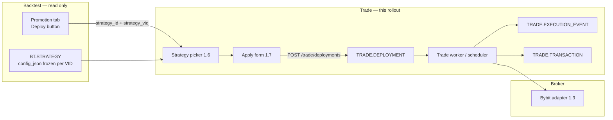
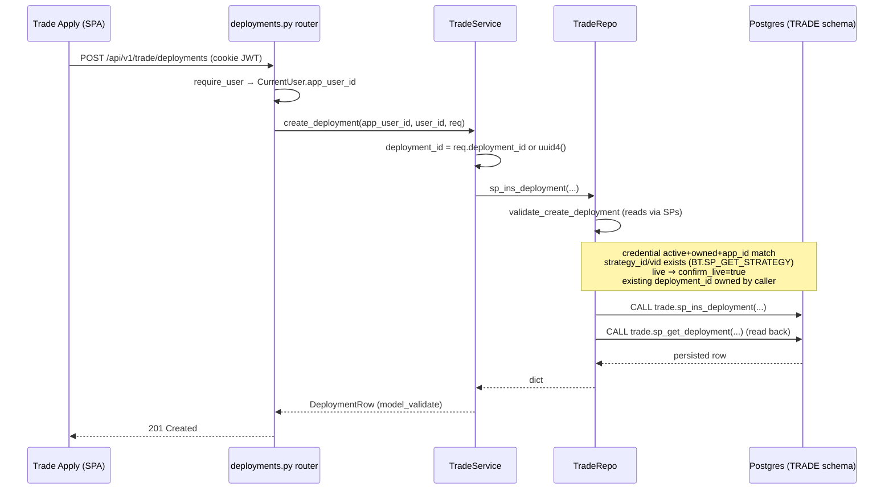
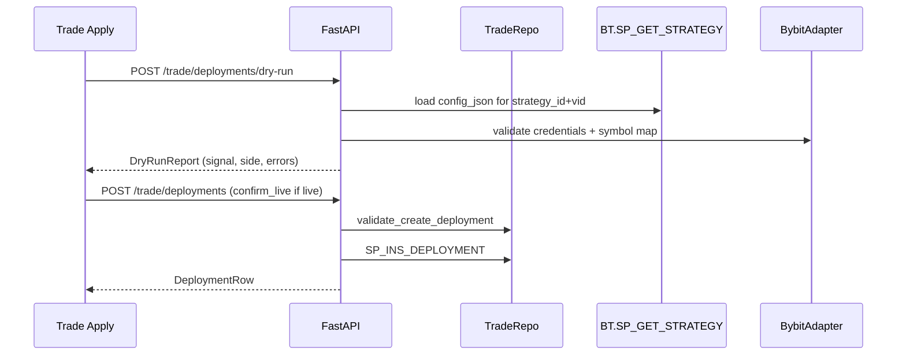

# Trade Deployment Rollout (Queue-free path)

**Status:** Design — active track. Implements Phases **1.6 → 1.7 → 1.8** from
[Plan to Profit](plan-to-profit.md) without touching the backtest **queue** or
strategy **VID increment** work.

## Why this path first

Other work is in flight on `BT.QUEUE` and enqueue. Trade deployment can move
forward independently because it only **reads** a pinned `(STRATEGY_ID,
STRATEGY_VID)` from `BT.STRATEGY` and writes to the **`TRADE`** schema.

| Area | Touch in this rollout? | Notes |
|------|------------------------|-------|
| `TRADE.DEPLOYMENT` | **Yes** | create / list / version |
| `TRADE.EXECUTION_EVENT` / `TRANSACTION` | **Yes** (1.8) | append-only logs |
| `BT.SP_GET_STRATEGY` | **Read only** | list + exact VID lookup for picker |
| `BT.QUEUE` | **No** | frozen — others changing enqueue |
| `BT.SP_INS_STRATEGY` | **Yes** (1.10.0) | Resolves identity by `(USER_ID, STRATEGY_NM)` — see [Strategy VID Versioning](strategy-vid-versioning.md) |
| `BT.PROMOTION` | **No** | UI already navigates to Trade with `{ strategy_id, strategy_vid }` |

!!! note "Duplicate v1 rows are OK for now"
    Until [Strategy VID Versioning](strategy-vid-versioning.md) lands, the same
    `STRATEGY_NM` may appear as multiple `STRATEGY_ID`s each at `VID=1`. The
    Trade picker must show **`strategy_nm` + `strategy_id` prefix + `vid` + Best
    chip** so the user picks the exact row they intend to deploy. Deployment
    stores the explicit pair — no ambiguity at apply time.

## Goal

End-to-end: user promotes a backtest → clicks **Deploy** → lands on Trade Apply
with strategy pre-selected → picks exchange account + product + qty → **Dry
run** → **Apply (paper/live)** → deployment row persists → execution events
appear in the log panel.



## Already live (baseline)

| Phase | What | Where |
|-------|------|-------|
| **1.2** | `TRADE.DEPLOYMENT` + `SP_INS/GET_DEPLOYMENT` | `db/liquidbase/trade/` |
| **1.2** | `POST/GET /api/v1/trade/deployments` | `quant/api/routers/deployments.py` |
| **1.4** | Trade UI shell (Config + Apply routes) | `frontend/src/pages/trade/` |
| **1.5** | Credentials CRUD + toolbar filters | `TradeConfigPage`, `/api/v1/credentials` |
| **Promotion** | Deploy navigates with router state | `PromotionTab` → `/trade/apply` |

Validation on create (in `TradeRepo.validate_create_deployment`):

- Strategy row exists: `BT.SP_GET_STRATEGY(strategy_id, strategy_vid)`
- Credential exists and matches `app_id` / paper-live mode
- Live apply requires `confirm_live=true` when `paper=false`

## Implemented deployment logic (today)

This section documents the **runtime code path** that is actually wired for
`POST /api/v1/trade/deployments` — i.e. what executes when a user clicks
**Apply**. Everything here is a synchronous DB write inside one HTTP request; no
background worker is involved (see [Worker](#worker-minimal-for-m1)).

### Layers

| Layer | File | Responsibility |
|-------|------|----------------|
| HTTP router | [`quant/api/routers/deployments.py`](../../quant/api/routers/deployments.py) | Auth (`require_user`), request/response models, error → HTTP status mapping |
| Service | [`quant/trade/service.py`](../../quant/trade/service.py) (`TradeService`) | HTTP-agnostic orchestration; generates `deployment_id` UUID client-side |
| Repo | [`quant/trade/db_repo.py`](../../quant/trade/db_repo.py) (`TradeRepo`) | Validation reads + `CALL trade.sp_*`; extends `DbGateway` (the Postgres connection) |
| Stored procedures | `db/liquidbase/trade/` | `trade.sp_ins_deployment`, `trade.sp_get_deployment(_check)` — the only writers of `TRADE.*` |

`TradeRepo` is built **per request** in `get_trade_service()` — it reads the
app-wide `request.app.state.db_conninfo`, constructs a `BtQueueRepo` (injected so
the strategy-existence check reuses `BT.SP_GET_STRATEGY` from its owning repo,
not a pasted `CALL`), then wraps both in `TradeService`.

### Request flow — `POST /trade/deployments`



Validation reads all go **through stored procedures** (no raw `SELECT`):
`core_admin.sp_get_credential_check`, `trade.sp_get_deployment_check`, and
`bt.sp_get_strategy`. On any failure `TradeRepo` raises `TradeValidationError`
with a status code (400/403/404) that the router maps to the HTTP response.

### Live endpoints

| Method | Path | Handler | Notes |
|--------|------|---------|-------|
| `POST` | `/api/v1/trade/deployments` | `create_deployment` | Validates → `SP_INS_DEPLOYMENT` → reads back; `201` |
| `GET` | `/api/v1/trade/deployments` | `list_deployments` | Current rows for the caller (`app_user_id` scoped) |
| `GET` | `/api/v1/trade/deployments/{id}` | `get_deployment` | `404` via `DeploymentNotFound` |

`EXECUTION_EVENT` / `TRANSACTION` writers (`sp_ins_execution_event`,
`sp_ins_transaction`) exist on `TradeRepo` with the same validate-then-`CALL`
shape, but the worker that calls them is **Phase 1.8** — not live yet.

### Database connection (the "5432 database")

`TRADE.DEPLOYMENT`, `TRADE.EXECUTION_EVENT`, and `TRADE.TRANSACTION` live in the
**QuantDB Postgres** instance — the same database as `BT`, `INST`, `REFDATA`,
and `CORE_ADMIN`. There is no separate trade DB.

The connection string is built **once at FastAPI startup** by
[`quant/shared/config.py`](../../quant/shared/config.py) `_build_db_conninfo()`
from `QUANTDB_*` env vars and stored on `app.state.db_conninfo`
([`quant/api/main.py`](../../quant/api/main.py)). Port depends on where the app runs:

| Context | Host : Port | Source |
|---------|-------------|--------|
| **Local dev (native Postgres)** | `127.0.0.1:5432` | `docker-compose.dev.yml` (`QUANTDB_PORT=5432`, host networking) |
| **Local tooling via SSM tunnel** | `localhost:5433` → Aurora `5432` | `.env` (`QUANTDB_PORT`), SSM port-forward task |
| **Production (EC2)** | Aurora cluster endpoint `:5432` | SSM Parameter Store `/quant/prod/QUANTDB_*` |

`_build_db_conninfo()` defaults to port **5433** (the SSM-tunnel convention) but
the deployed app always supplies an explicit `QUANTDB_PORT`. Use `sslmode=require`
for Aurora; local dev compose sets `QUANTDB_SSLMODE=disable`.

## Data model (Trade side)

### `TRADE.DEPLOYMENT` — pins a strategy version to a broker account

One logical deployment = one `DEPLOYMENT_ID` (UUID). Config changes bump
`DEPLOYMENT_VID` (soft versioning — same pattern as `BT.STRATEGY`).

| Column | Role |
|--------|------|
| `STRATEGY_ID` + `STRATEGY_VID` | **Frozen backtest config** to execute (join `BT.STRATEGY`) |
| `API_CREDENTIAL_ID` | Which exchange account |
| `APP_ID` | Broker (`REFDATA.APP`) |
| `INTERNAL_CUSIP` | Product to trade (`INST.PRODUCT`) |
| `QTY` | Order size |
| `IS_PAPER_IND` | `Y` / `N` — **server enforced**, not UI-only |
| `IS_ENABLED_IND` | Kill switch |
| `DEPLOYMENT_STATUS` | `CREATED` → `ACTIVE` / `PAUSED` / `STOPPED` |

DDL: [`db/liquidbase/trade/tables/DEPLOYMENT.sql`](../../db/liquidbase/trade/tables/DEPLOYMENT.sql)

### Execution log (Phase 1.8)

| Table | Purpose |
|-------|---------|
| `TRADE.EXECUTION_EVENT` | Signal computed, order submitted, errors |
| `TRADE.TRANSACTION` | Filled trades |

SPs exist (`SP_INS_EXECUTION_EVENT`, `SP_INS_TRANSACTION`); wiring from the
worker is **1.8**.

## Phase 1.6 — Strategy picker (next)

**Scope:** Read catalog from `BT.STRATEGY`; no queue writes.

### Backend

New module `quant/api/strategies/` (or extend trade router):

```
GET /api/v1/strategies?versions=best|all&limit=100
```

Returns caller-owned rows the picker needs. Default `versions=best` — one row per logical strategy (`IS_BEST_IND='Y'`). Use `versions=all` to list every VID.

```json
{
  "strategy_id": "uuid",
  "strategy_vid": 1,
  "strategy_nm": "btcusdt.crypto · get_bollinger_band/momentum",
  "is_best_ind": "Y",
  "created_at": "2026-06-04T19:03:46Z",
  "sharpe_ratio": 1.25,
  "calmar_ratio": 0.8,
  "max_drawdown": -0.12,
  "total_return": 0.45,
  "annualized_return": 0.22
}
```

**SP:** `BT.SP_GET_STRATEGY_LIST` (release `1.12.0`) — list catalog; metrics via `BT.RESULT (STRATEGY_ID, STRATEGY_VID)` (release `1.13.0`).

### Frontend

| Piece | Detail |
|-------|--------|
| `frontend/src/api/strategies.ts` | TanStack Query hook |
| `StrategyPicker` | Table: Name · VID · Best · Sharpe · Created; **Best only / All versions** toggle (default best); row select |
| `TradeApplyPage` | Replace placeholder; read `location.state` from Promotion Deploy |
| Deployments table | Show `strategy_nm` (join or denormalize later) instead of UUID prefix |

**Promotion pre-fill:** `navigate('/trade/apply', { state: { strategyId, strategyVid } })`
already exists — picker should highlight matching row on mount.

### Exit criteria

User selects a strategy in Trade Apply; selection is `{ strategy_id, strategy_vid }`
ready for the apply payload.

## Phase 1.7 — Dry run + Apply

**Depends on:** 1.6 (picker), 1.3 (Bybit dry-run adapter), 1.5 (credentials).

**Live order placement mechanics** (fill confirmation, retry/cancel policy, alerting) are detailed
separately in [Live Order Execution](live-order-execution.md) — this section covers the apply
endpoint/UI flow only.

### Apply form fields

| Field | Source |
|-------|--------|
| Strategy | Picker (`strategy_id`, `strategy_vid`) |
| Exchange / Account | Toolbar + `api_credential_id` |
| Product | `internal_cusip` dropdown from `INST.PRODUCT` / xref |
| Qty | User input |
| Paper / Live | Toolbar `tradingMode` → `paper: bool` |

### API flow



**New endpoints (proposed):**

| Method | Path | Purpose |
|--------|------|---------|
| `POST` | `/api/v1/trade/deployments/dry-run` | No DB write; returns report |
| `POST` | `/api/v1/trade/deployments` | **Exists** — wire from UI |
| `PATCH` | `/api/v1/trade/deployments/{id}` | Kill switch / pause (planned) |

### Security (server-side — non-negotiable)

From [Plan to Profit §5.5](plan-to-profit.md#55-auth--security-guardrails):

1. **Ownership:** `BT.STRATEGY.USER_ID` must match caller (or shared-read policy
   documented) before create.
2. **Paper/live:** reject `paper=false` without `confirm_live=true` and prior
   dry-run token/timestamp (exact mechanism TBD — session or request body).
3. **Kill switch:** `IS_ENABLED_IND='N'` blocks worker execution even if status
   is `ACTIVE`.

### Worker (minimal for M1)

**Do promote and deployment-create need a worker? No.** Both are synchronous DB
writes inside the API request:

- **Promote** = flip `IS_BEST_IND` (`BT.SP_UPD_PROMOTE_STRATEGY`) — already wired.
- **Deploy** = `POST /trade/deployments` → `TRADE.SP_INS_DEPLOYMENT`
  ([`quant/trade/service.py`](../../quant/trade/service.py) `create_deployment`).

Creating a `TRADE.DEPLOYMENT` row just persists **intent** — nothing runs in the
background for that to succeed. A worker is only needed to **execute** a
deployment at the broker on a recurring schedule (recompute signal → place /
cancel orders → reconcile fills).

#### Recommendation given our AWS infra

Compute is a **single `t4g` EC2** running docker compose (redis, api, backtest
worker, nginx) with Aurora behind it, and strategies are **daily**
([new-user-website.md](../guides/new-user-website.md) — daily data only). So
execution cadence is **once per day**, which argues against an always-on loop.

| Option | When | Verdict |
|--------|------|---------|
| **C. Synchronous apply only** — user clicks Apply; API runs one evaluation + optional order; no scheduler | **M1** (paper / testnet) | ✅ **Use now** — zero new infra |
| **A. EventBridge Scheduler → one-shot run** (cron rule invokes `python -m quant.trade.run_due` or an internal endpoint that loops `SP_GET_DEPLOYMENT` where `IS_ENABLED_IND='Y'`) | **Phase 2** (automation) | ✅ **Use for automation** — schedule lives in AWS, survives restarts, idempotent per day, nothing always-on |
| **B. Long-lived trade scheduler container** in compose (mirrors the backtest worker loop) | — | ⚠️ **Avoid** — a daily job does not justify Redis-wake / long-poll machinery; if the box is down at run time the tick is silently missed |

**Decision: C now, A later. Do not build B.**

#### Live-trading guardrails (before `paper=false`)

These differ from the backtest worker and are **non-negotiable** for real money:

1. **Reconcile on boot — never blind-fail.** The backtest worker marks
   `RUNNING → FAILED` on startup (safe — just recompute). For trades that is
   **dangerous**: an order may be live at the broker. Any trade executor must
   **query the broker for open orders / positions and reconcile** on start,
   not mark-failed.
2. **Idempotent orders.** Send a deterministic **client order ID** so a
   crash-and-retry cannot double-submit. Required even in synchronous mode
   (Option C).
3. **Single-instance risk.** Aurora is multi-AZ; compute is **not**. A
   missed / duplicated tick has financial consequences. Acceptable for paper /
   testnet; for live, Option A keeps the **schedule** alive in AWS even across
   instance restarts and can run catch-up.

For milestone **M1 — Pipeline**, a synchronous dry-run + manual apply
(Option C) is enough.

**Promotion runbook** (testnet → mainnet, Slack test → prod ops):
[Live Trading Promotion](../guides/live-trading-promotion.md).


### Exit criteria

One Bollinger strategy deploys paper or testnet end-to-end; row in
`TRADE.DEPLOYMENT`; errors surfaced in UI.

## Phase 1.8 — Execution log

Wire worker/adapter to append:

- `TRADE.SP_INS_EXECUTION_EVENT` on signal / submit / error
- `TRADE.SP_INS_TRANSACTION` on fill

**API:**

```
GET /api/v1/trade/deployments/{id}/events?limit=50
GET /api/v1/trade/deployments/{id}/transactions?limit=50
```

**UI:** bottom panel in `TradeLayout` (placeholder today) — poll or SSE.

## What we explicitly defer

| Item | Doc | Why defer |
|------|-----|-----------|
| VID increment by `strategy_nm` | [strategy-vid-versioning.md](strategy-vid-versioning.md) | Requires `SP_INS_STRATEGY` + enqueue changes |
| `UNIQUE (USER_ID, STRATEGY_NM, STRATEGY_VID)` | same | Data migration touches queue children |
| Jobs table UX / shared queue | [strategy-vid-versioning.md](strategy-vid-versioning.md) § UI | Queue owned by others |
| Live scheduler (EventBridge one-shot) + reconciliation | [plan-to-profit.md](plan-to-profit.md) Phase 2 | After M1 pipeline; M1 is synchronous apply only |

## Suggested implementation order

1. **`BT.SP_GET_STRATEGY_LIST`** (release `1.12.0`) + `GET /api/v1/strategies`
2. **`StrategyPicker`** + Promotion pre-fill on `TradeApplyPage`
3. **Apply form** (product, qty) + enable `POST /trade/deployments` from UI
4. **`POST .../dry-run`** + Bybit adapter dry path
5. **Live apply guards** + `confirm_live`
6. **Execution log** SP writes + GET endpoints + UI panel

## Related docs

- [Trade API](trade-api.md) — full API + schema reference (§7 = DDL truth)
- [Plan to Profit](plan-to-profit.md) — phases 1.2–1.8, M1 milestone
- [Best-VID Promotion](best-vid-promotion.md) — where Deploy button comes from
- [Strategy VID Versioning](strategy-vid-versioning.md) — later queue/BT track
- [User isolation](user-isolation.md) — ownership rules for deploy create
