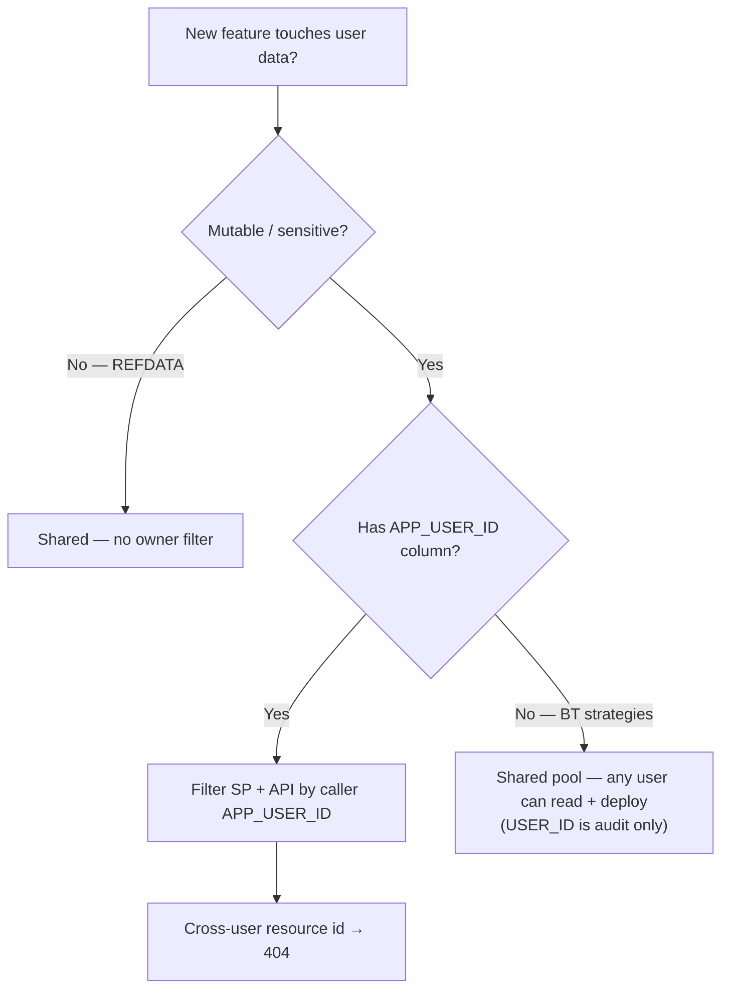

# User isolation requirements

**Status:** v1 — partial enforcement. Credentials, deployments, and job queue are scoped by owner; strategies are a **shared pool** — any authenticated user can read and deploy any strategy.

Related: [Login §14 Phase 2](login.md#14-phased-plan), [Plan to Profit §5.5](plan-to-profit.md#55-auth--security-guardrails), [Trade API §2.1](trade-api.md#21-strategy-catalog--phase-16), [Futu Trading §13](futu-trading.md#13-broker-strategy--when-to-scale-futu).

---

## Two identifiers — do not conflate

| Field | Type | Role |
|-------|------|------|
| **`APP_USER_ID`** | `UUID` | **Owner** — who may read/write this row (credentials, deployments) |
| **`USER_ID`** | `TEXT` | **Audit** — who created the row; also used as queue filter in `BT.QUEUE` |

JWT `sub` = `APP_USER_ID`. `require_user` resolves that to `CurrentUser { app_user_id, username }`.

The FastAPI connection pool logs in as Postgres role `quant_app`. The human identity is passed as `IN_APP_USER_ID` / `IN_USER_ID` into stored procedures — not as a separate DB login per user. See [Login §6](login.md#6-database--grants).

### Design debt (normalize before hardening)

| Table / path | What is stored in `USER_ID` today |
|--------------|-------------------------------------|
| `BT.STRATEGY`, `BT.QUEUE` (jobs API) | `str(app_user_id)` — UUID as text |
| `TRADE.DEPLOYMENT` audit column | `str(app_user_id)` — UUID as text (normalized) |
| Sync backtest (`/optimize`) | Pool user / cache path — **not** per-human today |

~~**Phase 1.7 ownership checks** must compare `BT.STRATEGY.USER_ID` against what jobs actually wrote (`str(caller.app_user_id)`), not username.~~ **Removed** — strategies are a shared pool (decision #42). `USER_ID` on `BT.STRATEGY` is audit-only.

---

## Requirement matrix

| Domain | Owner column | Enforced today? | Requirement | Phase |
|--------|--------------|-----------------|-------------|-------|
| **Login / session** | `APP_USER_ID` in JWT | **Yes** | One session per human; `SESSION_GEN` revoke | Done |
| **Credentials** | `CORE_ADMIN.API_CREDENTIAL.APP_USER_ID` | **Yes** | SP + API scoped; cross-user id → **404** | 1.1 |
| **Deployments** | `TRADE.DEPLOYMENT.APP_USER_ID` | **Yes** | `SP_GET_DEPLOYMENT(IN_APP_USER_ID)`; credential must match owner | 1.2 |
| **Job queue** | `BT.QUEUE.USER_ID` | **Yes** | List/cancel/SSE scoped; max 20 `QUEUED` per user | Done |
| **Strategy picker (read)** | `BT.STRATEGY.USER_ID` | **Yes** | Any logged-in user sees all strategies (shared pool) | 1.6 — Done |
| **Strategy deploy (write)** | — | **N/A** | Any user can deploy any strategy with their own credentials (shared pool) | By design (decision #42) |
| **Sync backtest** | — | **No** | No per-user result isolation on `/optimize` | login Phase 2 |
| **`BT.RESULT`** | `USER_ID` audit only | **No** | Globally readable | login Phase 2 |
| **REFDATA / INST** | — | N/A | Shared catalog | By design (v1) |
| **Futu OpenD** | Infra (not per user) | **Partial** | One gateway in v1; **DB** still separates by `APP_USER_ID` | v1 house account |

---

## Enforced today

### Credentials (Phase 1.1)

- Every SP call passes `CurrentUser.app_user_id`.
- Cross-user `api_credential_id` → **404** (never 403 — no existence leak).
- Responses never include `*_CIPHERTEXT`.

Implementation: `quant/api/credentials/`, `CORE_ADMIN.SP_*_API_CREDENTIAL`.

### Deployments (Phase 1.2)

- `SP_GET_DEPLOYMENT` requires `IN_APP_USER_ID`.
- `TradeRepo` rejects credentials and deployments that belong to another user before `CALL TRADE.SP_INS_DEPLOYMENT`.
- **Paper-vs-live gate:** live deployments (`paper=false`) are rejected unless `confirm_live=true` is set in the request. Prevents accidental live trading via crafted API calls.

Implementation: `quant/trade/db_repo.py`, `quant/api/routers/deployments.py`.

### Job queue

- Enqueue / list / cancel / SSE use `str(user.app_user_id)`.
- `SP_GET_QUEUE` filters by `USER_ID` when provided.

Implementation: `quant/api/routers/jobs.py`, `quant/api/services/jobs.py`.

---

## Required before live apply (Phase 1.7)

| Check | Rule |
|-------|------|
| ~~**Strategy ownership**~~ | ~~`BT.STRATEGY.USER_ID` must match caller~~ — **Removed** (decision #42: shared strategy pool) |
| **Credential ownership** | Already enforced |
| **Deployment ownership** | Already enforced on get/list |
| **Paper vs live** | `is_paper_ind` enforced on server — `confirm_live=true` required for live deployments |
| **Live apply step-up** | Dry-run first + explicit confirm ([Trade API §4.1](trade-api.md#41-confirmation-flow-for-live-trading)) |

Strategies are a shared pool — any authenticated user can deploy any strategy using their own exchange credentials. `USER_ID` on `BT.STRATEGY` is **audit-only** (who created the config). Capital safety comes from credential ownership (user can only trade with their own keys) and the paper-vs-live gate.

**Exit criteria (1.7):** deployment create validates credential ownership (done) + paper/live gate (done — `confirm_live` required); see [plan-to-profit §1.7](plan-to-profit.md#phase-17--live-apply).

---

## Phase 1.6 — strategy picker (read path) — Done

All strategies are visible to all authenticated users (shared pool). `SP_GET_STRATEGY` list mode is deployed. `IS_BEST_IND` marks the best-performing VID per strategy — see [Best-VID Promotion](best-vid-promotion.md).

---

## Deferred — login Phase 2 (multi-user isolation)

From [Login §14](login.md#14-phased-plan):

- Add `USER_ID` / owner filter to `BT.STRATEGY`, `BT.RESULT`, and sync backtest read paths.
- Per-user result lists in the SPA.
- Optional `ROLE` column — admin sees all runs.

**Trigger:** a second logged-in user who is **not fully trusted** ([plan-to-profit §5.5](plan-to-profit.md#55-auth--security-guardrails)).

Until then, v1 explicitly allows any authenticated user to browse shared backtest artifacts; mutating paths for credentials, deployments, and jobs are already scoped.

---

## Futu vs Bybit

| Broker | Per-user isolation | Infrastructure |
|--------|-------------------|----------------|
| **Bybit** | `API_CREDENTIAL` per `APP_USER_ID` | Normal SaaS — each user their own REST keys |
| **Futu v1** | **One OpenD / one Futu login** (house account) | Postgres still separates deployments, credentials, and audit by `APP_USER_ID` |

Futu migration does **not** remove DB-level separation — only the **gateway** is shared. See [Futu Trading §13](futu-trading.md#13-broker-strategy--when-to-scale-futu).

Multiple unrelated Futu logins → gateway EC2 + `gateway_id` registry (§12), not ECS. Each credential row still maps to `APP_USER_ID`.

---

## Decision tree

---

## Implementation backlog

| Priority | Task | Blocks |
|----------|------|--------|
| ~~**P0**~~ | ~~Deployment create: verify `BT.STRATEGY.USER_ID == str(app_user_id)`~~ | ~~1.7 live apply~~ — **Removed** (shared pool) |
| ~~**P0**~~ | ~~Deployment create: verify credential + product belong to caller~~ | ~~1.7 (credential done)~~ — **Done** |
| ~~**P0**~~ | ~~Paper-vs-live gate: `confirm_live=true` required for live deployments~~ | ~~1.7~~ — **Done** |
| ~~**P1**~~ | ~~`SP_GET_STRATEGY` list mode deployed; wire `GET /api/v1/strategies`~~ | ~~1.6~~ — **Done** |
| ~~**P1**~~ | ~~Normalize TRADE `USER_ID` — UUID string **or** username consistently~~ | ~~Audit consistency~~ — **Done** (all paths use `str(app_user_id)`) |
| **P1** | Frontend: clear TanStack Query cache on login (prevent stale cross-user data) | Done |
| **P2** | Filter `BT.RESULT`, sync backtest cache by owner | login Phase 2 |
| **P2** | `ROLE` + admin bypass | Multi-tenant admin |
| **P3** | Postgres RLS or `SET LOCAL app.user_id` GUC | Defense in depth — see [Login §6.3](login.md#63-optional-session-guc) |

---

## Cross-user response policy

| Situation | HTTP status | Rationale |
|-----------|-------------|-----------|
| Resource id exists but belongs to another user | **404** | Do not leak existence |
| Invalid id format | **400** or **404** | Match existing router patterns |
| Authenticated but not allowed (future RBAC) | **403** | Only when role model exists |

Credentials API established this pattern in Phase 1.1 — reuse for deployments, strategies, and jobs.
