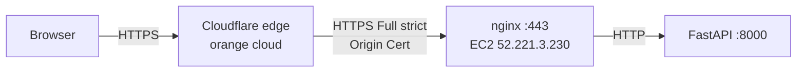

# HTTPS via Cloudflare (algodaemon.com)

This guide covers moving production from **plain HTTP** to **HTTPS** by putting
the site behind **Cloudflare** (proxied / "orange cloud") with a **Cloudflare
Origin Certificate** on the nginx origin, and Cloudflare SSL/TLS mode set to
**Full (strict)**.

## Why this approach

The origin currently serves **HTTP only**:

- nginx listens on `:80` with `server_name _;`
- only port **80** is published on the EC2 host (`443` is not)
- there are **no TLS certificates** on the origin

Cloudflare **Full (strict)** requires Cloudflare to reach the origin over
**HTTPS on 443 with a valid certificate**. So the one real blocker to enabling
the orange cloud is: **the origin must serve HTTPS**.

For a proxied (orange) setup the cleanest fix is a **Cloudflare Origin CA
certificate** rather than Let's Encrypt:

- free, valid for **15 years**, trusted by the Cloudflare edge
- **no certbot, no HTTP-01 challenge, no renewal automation**
- browsers never see it — they only see Cloudflare's edge certificate



!!! note "Alternative: grey cloud + Let's Encrypt"
    If you keep Cloudflare **DNS-only** (grey cloud), use the existing
    Let's Encrypt flow ([`docker/init-letsencrypt.sh`](https://github.com/alfred1123/Quant_Strategies/blob/main/docker/init-letsencrypt.sh)
    + [`docker-compose.tls.yml`](https://github.com/alfred1123/Quant_Strategies/blob/main/docker-compose.tls.yml))
    instead of an Origin Certificate. The rest of this guide assumes the
    proxied / Origin-Certificate path.

## Current production facts

| Item | Value |
|------|-------|
| Domain | `algodaemon.com` (registered on Cloudflare) |
| EC2 instance | Resolve from `quant-compute` CFN output `InstanceId` ([Dev vs Prod](../architecture/dev-vs-prod.md#resolve-the-current-prod-ec2-instance-id)) |
| Elastic IP (origin) | Resolve from `quant-compute` CFN output `PublicIp` (or `ORIGIN_IP` in `.env`) |
| Region | `ap-southeast-1` |
| Origin protocol today | HTTP only (`:80`) |
| Secrets store | AWS SSM Parameter Store under `/quant/prod/*` |

## Prerequisites

- Cloudflare account with `algodaemon.com` active (nameservers delegated).
- AWS access to SSM, EC2, and CloudFormation in `ap-southeast-1`.
- The repo deploy pipeline ([`.github/workflows/deploy.yml`](https://github.com/alfred1123/Quant_Strategies/blob/main/.github/workflows/deploy.yml)).

---

## Step 1 — DNS records (automated)

Create **proxied** (orange cloud) `A` records pointing at the origin EIP:

| Type | Name | Content | Proxy |
|------|------|---------|-------|
| `A` | `algodaemon.com` | `52.221.3.230` | Proxied |
| `A` | `www` | `52.221.3.230` | Proxied |

### Script (recommended)

From the repo root, with a Cloudflare API token that has **Zone → DNS → Edit**
on `algodaemon.com`:

```bash
export CLOUDFLARE_API_TOKEN=<your-token>

# Dry-run — report missing or drifted records
bash aws/scripts/cloudflare-dns.sh --check

# Apply (idempotent create/update)
bash aws/scripts/cloudflare-dns.sh
```

Defaults (override via env):

| Variable | Default |
|----------|---------|
| `DOMAIN` | `algodaemon.com` |
| `ORIGIN_IP` | `52.221.3.230` (or resolved from AWS `quant-eip` / `quant-compute` stack) |
| `CLOUDFLARE_PROXIED` | `true` (orange cloud) |

Create the token in Cloudflare: **My Profile → API Tokens → Create Token →
Edit zone DNS** (zone: `algodaemon.com`). Store it in GitHub Actions secrets
as `CLOUDFLARE_API_TOKEN` when wiring the deploy pipeline.

### Manual (dashboard)

Cloudflare → **DNS → Records** → add the two `A` records above with proxy
enabled (orange cloud).

Redirect `www` → apex (or apex → `www`) with a Cloudflare Redirect Rule if you
want a single canonical host.

## Step 2 — Generate a Cloudflare Origin Certificate

### Script (recommended)

Requires a Cloudflare API token with **Zone → SSL and Certificates → Edit**
on `algodaemon.com` (same token family as Origin CA API), or a legacy
**Origin CA Key** (`CLOUDFLARE_ORIGIN_CA_KEY`).

The script generates an RSA key **locally**, builds a CSR, requests the signed
Origin CA cert from Cloudflare, and writes:

| File | Purpose |
|------|---------|
| `secrets/origin.pem` | Origin certificate (nginx `ssl_certificate`) |
| `secrets/origin-key.pem` | Private key (nginx `ssl_certificate_key`) |

```bash
export CLOUDFLARE_API_TOKEN=<your-token>

# Create cert + key under ./secrets/ (gitignored)
bash aws/scripts/cloudflare-origin-cert.sh

# Or create and upload to SSM in one step (Steps 2 + 3)
bash aws/scripts/cloudflare-origin-cert.sh --upload-ssm

# Check whether SSM already has the cert/key
bash aws/scripts/cloudflare-origin-cert.sh --check-ssm
```

Defaults:

| Variable | Default |
|----------|---------|
| `DOMAIN` | `algodaemon.com` |
| `ORIGIN_VALIDITY_DAYS` | `5475` (15 years) |
| `OUTPUT_DIR` | `./secrets` |

### Manual (dashboard)

In the Cloudflare dashboard: **SSL/TLS → Origin Server → Create Certificate**.

- Hostnames: `algodaemon.com`, `*.algodaemon.com`
- Key type: RSA or ECDSA (RSA is the safe default)
- Validity: 15 years

Cloudflare returns a **certificate** and a **private key**. Treat the private
key like any other secret — never commit it, never paste it into chat. Then
proceed to Step 3.

## Step 3 — Store the cert and key in SSM

If you used `bash aws/scripts/cloudflare-origin-cert.sh --upload-ssm` in Step 2,
this step is **already done** — skip to Step 4.

Otherwise store both under `/quant/prod/*` (the EC2 IAM role already grants read access to
this path — see [`aws/cfn/03-compute.yml`](https://github.com/alfred1123/Quant_Strategies/blob/main/aws/cfn/03-compute.yml)).

```bash
# Certificate (not secret, but kept alongside the key for convenience)
aws ssm put-parameter \
  --name /quant/prod/ORIGIN_TLS_CERT \
  --type String \
  --value file://origin-cert.pem \
  --region ap-southeast-1 --overwrite

# Private key — SecureString. Run this yourself; do not share the key.
aws ssm put-parameter \
  --name /quant/prod/ORIGIN_TLS_KEY \
  --type SecureString \
  --value file://origin-key.pem \
  --region ap-southeast-1 --overwrite
```

After upload, delete the local `origin-key.pem` securely.

## Step 4 — nginx + compose changes (origin TLS)

These changes are **already implemented** in the repo:

- [`docker/nginx/nginx.cloudflare.conf`](https://github.com/alfred1123/Quant_Strategies/blob/main/docker/nginx/nginx.cloudflare.conf)
  — HTTPS server block whose `ssl_certificate` / `ssl_certificate_key` point at
  the mounted Origin cert/key (`/etc/nginx/ssl/origin.pem`,
  `origin-key.pem`), no ACME challenge block, plus the `:80 → :443` redirect,
  security headers, and the Cloudflare real-IP restore (Step 5).
- [`docker-compose.cloudflare.yml`](https://github.com/alfred1123/Quant_Strategies/blob/main/docker-compose.cloudflare.yml)
  — overlay that **publishes 443**, sets `COOKIE_SECURE=1`, mounts the Origin
  cert/key from `./secrets/`, and renders the nginx template with `envsubst`.
- [`.github/workflows/deploy.yml`](https://github.com/alfred1123/Quant_Strategies/blob/main/.github/workflows/deploy.yml)
  — when the `DOMAIN` GitHub Variable is set, the EC2 deploy fetches the cert/key
  from SSM into `/opt/quant/secrets/` and layers
  `docker-compose.cloudflare.yml` onto the stack. If `DOMAIN` is set but the
  cert/key are missing in SSM, it logs a warning and **stays HTTP-only** — a
  safe no-op until Step 3 is complete.

The `DOMAIN` Variable is set to `algodaemon.com`. Nothing in this step is manual
once the cert/key from Step 3 are in SSM — the next deploy flips the origin to
HTTPS automatically.

## Step 5 — Restore the real client IP behind the proxy

Already implemented in
[`docker/nginx/nginx.cloudflare.conf`](https://github.com/alfred1123/Quant_Strategies/blob/main/docker/nginx/nginx.cloudflare.conf):
nginx restores the real client IP from Cloudflare edge IPs so the login
rate-limiter (`limit_req zone=login`) keys on the actual visitor:

```nginx
real_ip_header CF-Connecting-IP;
set_real_ip_from 173.245.48.0/20;   # ... all current Cloudflare ranges
# https://www.cloudflare.com/ips/
```

FastAPI already receives `X-Forwarded-Proto` from nginx, so `Secure` cookies and
HTTPS-aware redirects work once `COOKIE_SECURE=1`.

!!! warning "Keep the Cloudflare ranges current"
    The `set_real_ip_from` list is hard-coded from
    <https://www.cloudflare.com/ips/>. Re-check it periodically; if Cloudflare
    adds a range and it is missing here, affected visitors will be rate-limited
    by their edge IP instead of their real IP.

## Step 6 — Lock the origin to Cloudflare only

Port `443` is already allowed in [`aws/cfn/01-network.yml`](https://github.com/alfred1123/Quant_Strategies/blob/main/aws/cfn/01-network.yml),
but to `0.0.0.0/0`. With the orange cloud, restrict **80/443 ingress to
Cloudflare's published IP ranges** so no one can bypass the proxy and hit the
origin directly. Update the security group ingress rules and redeploy the
network stack.

## Step 7 — Enable Full (strict) at Cloudflare

Once the origin serves HTTPS with the Origin Certificate:

- **SSL/TLS → Overview → Full (strict)**
- **SSL/TLS → Edge Certificates → Always Use HTTPS: On**
- **Automatic HTTPS Rewrites: On**

## Step 8 — Deploy and verify

Deploy through the normal pipeline (push to `main` or `workflow_dispatch`), then
verify:

```bash
# Edge serves HTTPS and the app is healthy
curl -I https://algodaemon.com/health      # expect 200

# HTTP is redirected to HTTPS
curl -I http://algodaemon.com/             # expect 301 -> https://

# Origin presents the Cloudflare Origin Certificate on 443
echo | openssl s_client -connect 52.221.3.230:443 -servername algodaemon.com 2>/dev/null \
  | openssl x509 -noout -issuer -subject -dates
```

---

## Rollback

If HTTPS misbehaves, set the Cloudflare DNS records back to **DNS-only** (grey
cloud) and Cloudflare SSL/TLS mode to **Off** or **Flexible** to restore HTTP
access to the origin while you debug. The origin keeps serving `:80`
throughout, so flipping the proxy off is a non-destructive escape hatch.

## Required GitHub / SSM configuration summary

| Name | Where | Purpose | Status |
|------|-------|---------|--------|
| `DOMAIN` = `algodaemon.com` | GitHub Variable | nginx `envsubst` template / TLS overlay | ✅ set |
| `/quant/prod/ORIGIN_TLS_CERT` | SSM String | Cloudflare Origin certificate | ⬜ Step 3 |
| `/quant/prod/ORIGIN_TLS_KEY` | SSM SecureString | Cloudflare Origin private key | ⬜ Step 3 |
| `CLOUDFLARE_API_TOKEN` | SSM SecureString + GitHub Secret | optional DNS automation | ✅ set |

See [Environment Variables](../env-vars.md) for the full app config contract.
