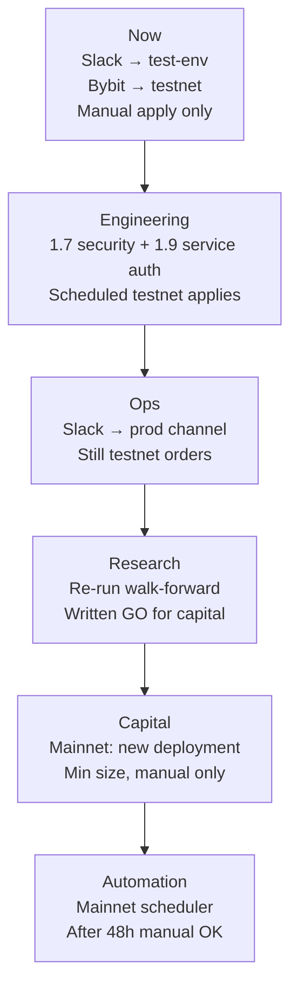

# Live Trading Promotion — Slack & Bybit Mainnet

!!! info "Status"
    **Operational runbook.** When and how to move Slack alerts from a test channel to
    production ops, and when to promote Bybit from testnet to mainnet. Applies to
    Phase 1.7 (live apply) and Phase 1.9 (scheduler).

**Related:** [Plan to Profit §1.7](../design/plan-to-profit.md#phase-17--live-apply),
[Live Order Execution](../design/live-order-execution.md),
[Scheduler & Price Bars](../design/scheduler-price-bars.md),
[Infrastructure — Trade scheduler](../architecture/infrastructure.md#trade-scheduler-eventbridge--lambda),
[Phase 0.1 signoff](../archive/phase-0/phase-0.1-signoff.md)

---

## 1. Two separate promotions

Slack and Bybit mainnet are **independent decisions** with different gates:

| Promotion | Risk | Gate type |
|-----------|------|-----------|
| **Slack test → prod ops channel** | Wrong people paged, alert fatigue | Ops readiness — pipeline proven on testnet |
| **Bybit testnet → mainnet** | Real capital at risk | Research sign-off **and** pipeline checklist |

Do **not** tie them together. You can run prod Slack alerts while orders still go to
testnet. You should **not** run mainnet orders while Slack still points at a dev-only
test channel you never check.

---

## 2. Current baseline (as of 2026-07)

| Item | Status |
|------|--------|
| Strategy sign-off (Phase 0.1) | **WATCH** — full Sharpe 1.19; walk-forward OOS negative → defer live apply ([signoff](../archive/phase-0/phase-0.1-signoff.md), decision #33) |
| Bybit testnet apply | Done — 6 lifecycle actions verified on `testnet.bybit.com` |
| Bybit mainnet | Not started — requires `is_paper_ind='N'`, mainnet API keys, `confirm_live=true` |
| Slack | Wired for apply failures; webhook should point at **test-env** until §4 |
| Scheduler (Phase 1.9) | AWS infra deployed; app work remaining — service auth, boto3 schedule sync, local poller for dev |
| Phase 1.7 security | Partial — ownership, dry-run-before-apply, kill switch enforcement still on checklist |

**Honest default:** stay on **testnet + test Slack** until research and pipeline gates
in §5–§6 clear.

---

## 3. Environment matrix

| Environment | Bybit | Slack webhook | Scheduler |
|-------------|-------|---------------|-----------|
| **Local dev** | Testnet keys only | `#quant-test-env` (or unset → log-only) | `SCHEDULER_BACKEND=local` (when poller lands) |
| **Prod EC2 (pre-mainnet)** | Testnet deployment | Test channel OK; prod ops channel once §4 done | EventBridge → Lambda → API (testnet deployment) |
| **Prod EC2 (mainnet)** | Mainnet deployment, min size first | **Prod ops channel** (§4) | Manual apply 48h before enabling schedule (§6) |

Never use mainnet API keys in local `.env` or point dev failures at the prod ops channel.

---

## 4. Slack: test channel → production ops

### 4.1 When to move

Move **after** the full apply path is proven on **Bybit testnet** — manual apply and,
once Phase 1.9 app work lands, at least a few **scheduled** testnet applies with alerts
behaving correctly.

**Do not move yet if:**

- Scheduler service auth is not wired (`TRADE_SERVICE_TOKEN` → API still returns 401)
- You have not seen a real failure alert end-to-end (success should be silent)
- Dev experiments would spam the prod channel

### 4.2 What Slack is for (now vs later)

| Channel | Audience | When |
|---------|----------|------|
| **Slack (ops)** | You / team | Apply failed after retries, permanent broker rejection, scheduler tick failure |
| **Telegram (Phase 2.4)** | Per-user | Same class of errors on *their* deployment |
| **Healthy steady state** | — | **No messages** (by design) |

See [Plan to Profit §5.3](../design/plan-to-profit.md#53-error-handling--observability).

### 4.3 How to move

1. Create a dedicated Slack channel, e.g. `#quant-ops-prod`.
2. Create a **new** Incoming Webhook for that channel — do not reuse the test webhook URL.
3. **Prod EC2:** set the webhook:
   - SSM: `/quant/prod/SLACK_WEBHOOK_URL` (SecureString), or
   - `.env` on host if not using SSM for this key yet.
4. Restart the API so `Notifier.from_env()` picks up the new URL.
5. **Dev / local:** keep `SLACK_WEBHOOK_URL` on `#quant-test-env` or leave unset (falls back to `LoggingNotifier`).
6. **Smoke test** on testnet: trigger a known failure (e.g. read-only API key, qty below minimum) and confirm one alert in the prod channel with deployment id, symbol, vendor order ids, and error text.
7. Rotate or delete the old test webhook if it was ever exposed.

### 4.4 Configuration reference

| Variable | Where | Notes |
|----------|-------|-------|
| `SLACK_WEBHOOK_URL` | `.env` (dev) or SSM `/quant/prod/SLACK_WEBHOOK_URL` | If unset, alerts go to logs only (`LoggingNotifier`) |
| Implementation | `quant/shared/notify.py` | `SlackNotifier`, `TradeAlertFormatter` |

---

## 5. Bybit: testnet → mainnet

### 5.1 When to move

Only after **both**:

1. **Research gate** — written **GO** (not WATCH) from an updated Phase 0.1 / walk-forward
   signoff for the exact `strategy_id` + `strategy_vid` you will deploy.
2. **Pipeline gate** — checklist in §5.2 complete on **testnet**.

Phase 0.1 result today is **WATCH** (WF OOS negative). That alone means **do not mainnet yet**.

### 5.2 Pipeline gate (testnet)

Complete on testnet before any mainnet credential:

- [ ] Dry-run succeeds for this deployment (credentials, `INST.PRODUCT_XREF`, qty).
- [ ] Manual apply on testnet; verify fill on `testnet.bybit.com` + `TRADE.EXECUTION_EVENT` / `TRANSACTION`.
- [ ] Kill switch: `PATCH` deployment `enabled=false` stops apply ([Trade API §4](../design/trade-api.md#4-risk--safety)).
- [ ] Slack alert tested: failure → alert; success → no alert.
- [ ] Scheduler (when app work lands): `TRADE_SERVICE_TOKEN` accepted by API; one scheduled testnet apply completes; EventBridge schedule uses **`MaximumRetryAttempts = 0`** ([scheduler design §6.2](../design/scheduler-price-bars.md#62-schedule-management-app--not-yet-wired)).
- [ ] Price bars (Phase 1.9): live apply fails closed on stale data — do not trade on unverified bars ([scheduler design §4.8](../design/scheduler-price-bars.md#48-failure-modes-and-error-handling)).

Remaining Phase 1.7 security items (ownership, dry-run-before-apply enforcement) should
be done before mainnet — see [Plan to Profit §1.7](../design/plan-to-profit.md#phase-17--live-apply).

### 5.3 How mainnet works in code

| `is_paper_ind` | Bybit environment | Keys from |
|----------------|-------------------|-----------|
| `Y` | Testnet (`set_sandbox_mode`) | [testnet.bybit.com](https://testnet.bybit.com/) |
| `N` | Mainnet | [www.bybit.com](https://www.bybit.com/) |

Server enforces live create with `confirm_live=true` when `paper=false`
(`TRADE.SP_INS_DEPLOYMENT`). The UI Paper/Live toolbar is a **filter only** — not an auth
boundary.

Diagnose which env accepts your keys:

```bash
python scripts/bybit_local_testnet.py --diagnose
```

Golden harness (testnet lifecycle):

```bash
python scripts/bybit_local_testnet.py --suite
```

See [Plan to Profit §1.3](../design/plan-to-profit.md#phase-13--bybit-adapter-dry-run).

### 5.4 Mainnet cutover procedure

Use a **new deployment** — do not flip an existing testnet row to live in place.

1. **New API credential** in Trade UI: Bybit, **Paper = off**, keys from mainnet.
   Confirm with `--diagnose`.
2. **Bybit account prep** (same blockers hit on testnet):
   - API key has **trade** permission (not read-only).
   - Derivatives / risk disclosure accepted (error `10024` gate).
   - IP whitelist on key if you use it in prod.
3. **Create deployment** with:
   - `paper: false`, `confirm_live: true`
   - **Minimum qty** (smallest allowed `BTCUSDT` linear size you can tolerate)
   - `enabled: false` initially
4. **Dry-run** → review report (symbol, signal, intended action, qty).
5. **Enable deployment** → **one manual Apply** → verify fill on Bybit mainnet UI +
   `TRADE.EXECUTION_EVENT` / `TRADE.TRANSACTION`.
6. **Wait 48 hours** manual-only (no scheduler): confirm signals, holds, Slack on failure.
7. **Then** attach schedule (`DAILY` or `1H`) for this deployment only.

!!! warning "Live signals read the venue's own bars — not the research series"
    Every apply of a deployment on a ccxt venue — manual **or** scheduled —
    reads `MARKET_DATA.PRICE_BAR`, bars pulled from the exchange it trades on
    (daily when no schedule is attached; the schedule only changes the interval
    — [design §7.7](../design/scheduler-price-bars.md#77-broker-binding--quanttradebar_sourcepy)).
    Backtest and dry-run keep the provider (Glassnode / Yahoo), and so do
    brokers without a market-data venue (Futu equities).

    These are different series. The Phase 0.1 parameters (Bollinger 60 / 1.75)
    were fitted on Glassnode daily data; against Bybit prints the same config
    can produce a different position on the same day. The 48h manual window in
    step 6 already exercises the exchange series — compare those signals
    against a dry-run (provider series) on the same day before attaching the
    schedule. `ApplyReport.bar_source` names the series behind each signal
    (`price_bar:bybit` vs `provider`).

**Never:** point mainnet keys at testnet endpoints, or enable scheduler on mainnet before
steps 5–6 succeed on testnet and manual mainnet.

---

## 6. Recommended timeline



| Step | Slack | Bybit | Trigger |
|------|-------|-------|---------|
| **Now** | `#test-env` | Testnet | Default |
| **Next engineering** | Test | Testnet | Merge scheduler + apply; wire service auth; scheduled testnet apply green |
| **Ops channel** | `#quant-ops-prod` | Testnet | ≥3 successful scheduled testnet runs; failure alert verified |
| **Capital** | Prod ops | **Mainnet** | Updated Phase 0.1 **GO** + §5.2 checklist |
| **Automation on real money** | Prod ops | Mainnet + schedule | 48h manual mainnet without surprises |

---

## 7. Dev without AWS

Local dev does not need EventBridge or Lambda:

- **`SCHEDULER_BACKEND=local`** (default when implemented): in-process poller reads
  `SP_GET_MISSED_DUE_DEPLOYMENTS` and calls apply in-process — no HTTP, no `TRADE_SERVICE_TOKEN`.
- Keep **testnet keys** and **test Slack** (or log-only) locally.

See [Scheduler design §6.2](../design/scheduler-price-bars.md#62-schedule-management-app--not-yet-wired)
and [Infrastructure — Trade scheduler](../architecture/infrastructure.md#trade-scheduler-eventbridge--lambda).

---

## 8. Quick reference — do / don't

| Do | Don't |
|----|-------|
| Prove pipeline on testnet first | Mainnet while Phase 0.1 is still WATCH |
| Separate webhooks per Slack channel | Reuse test webhook for prod ops |
| New mainnet deployment + min qty | Flip testnet deployment to `paper=false` |
| Manual mainnet 48h before scheduler | Enable EventBridge on mainnet day one |
| Set `MaximumRetryAttempts = 0` on schedules | Rely on Scheduler default retries for apply |
| Keep dev on testnet + test Slack | Mainnet keys in local `.env` |
