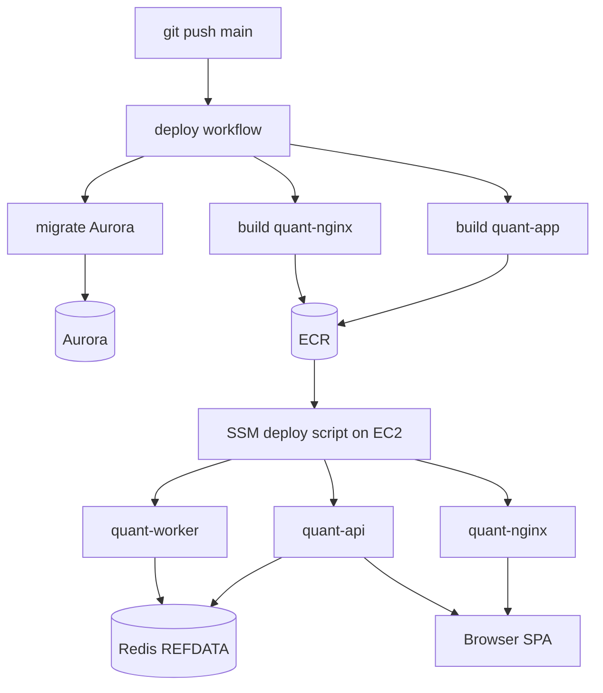

# Production Rollout — Keeping Layers in Sync

!!! info "Not just REFDATA"
    Most prod incidents that look like "bad config" are **version skew** between
    independent layers: Aurora schema/data, stored procedures, Python containers,
    Redis snapshots, and the nginx SPA bundle. Refreshing REFDATA cache fixes
    only one of those. This page is the ops checklist for any prod push.

**Related:** [Infrastructure — deployment logic](../architecture/infrastructure.md#deployment-logic),
[REFDATA Cache](../architecture/refdata-cache.md),
[Dev vs Prod](../architecture/dev-vs-prod.md)

---

## The five layers

| Layer | What it holds | How prod updates |
|-------|---------------|------------------|
| **Aurora** | Tables, seeds, procedure bodies | Liquibase `migrate` job (`production-db` approval when `context` includes `prod-deploy`) |
| **`quant-app`** (`api`, `worker`) | Python under `quant/` — signal funcs, repos, worker logic | ECR image built in CI, pulled on EC2 when `DEPLOY_APP=true` |
| **Redis** | REFDATA JSON snapshots (`refdata:*`) | API startup `publish_all()`, `POST /api/v1/refdata/refresh`, or publisher CLI on EC2 |
| **`quant-nginx`** | Built React SPA | ECR nginx image when `DEPLOY_NGINX=true` |
| **Browser** | TanStack Query client cache | Hard refresh after backend layers match |

These layers update **independently**. A successful step on one does not imply the
others moved.



---

## When each layer must change

| Change type | Aurora | `quant-app` | Redis | nginx | Example |
|-------------|--------|-------------|-------|-------|---------|
| REFDATA seed only (existing func names) | ✅ migrate | — | ✅ refresh* | — | New promotion state label |
| REFDATA seed + new Python code | ✅ | ✅ | ✅ refresh* | — | Long-only signals (`1.24.0`) |
| BT/TRADE procedure body | ✅ new changeset | ✅ if caller changed | — | — | `SP_INS_RESULT` signature change |
| `quant/` only (no DDL) | — | ✅ | —** | — | Bug fix in worker |
| `frontend/` only | — | — | — | ✅ | JobsTable layout fix |
| Both `quant/` + `frontend/` | per DDL | ✅ | per REFDATA | ✅ | Feature spanning API + UI |

\*Skip Redis refresh if `api`/`worker` **just** restarted **after** migrate — startup
`publish_all()` reloads from Aurora. Re-run refresh if migrate and container restart
were hours apart or you refreshed before redeploying.

\**Worker/API pick up non-REFDATA code on container restart only — no Redis step.

---

## How partial deploys happen (real incident pattern)

The deploy workflow uses **path filters** (`.github/workflows/deploy.yml`):

- `quant/**` → `build-app` → `DEPLOY_APP=true` → restart `api` + `worker`
- `frontend/**` → `build-nginx` (after frontend CI) → `DEPLOY_NGINX=true`
- `db/liquidbase/**` → `migrate` job (separate approval gate)
- `db/liquidbase/refdata/**` → after migrate, **`REFRESH_REFDATA`** runs the publisher on EC2 (no container rebuild required for seeds alone)

**Automated safeguards (2026-09):**

- `quant-app` builds **without waiting on the frontend job** — a TypeScript failure no longer blocks a Python-only push.
- `DEPLOY_APP` is also set when **`build-app` succeeded** in the same run (not only when `quant/**` changed in the path filter).
- `REFRESH_REFDATA` republishes Redis after a REFDATA Liquibase migrate when `quant-app` was not redeployed.
- `aws/scripts/verify-https.sh` **retries the Cloudflare edge probe** (`EDGE_RETRIES`, default 10 × 6 s) instead of failing on the first non-200. Cloudflare returns **522** for a few seconds while it re-opens a connection to the origin after nginx restarts, which had been marking successful deploys as failed — the image was already live. The origin probe ahead of it stays single-shot: if the origin itself is not serving, there is nothing to wait for.

**Failure mode:** push A changes `quant/` but **CI fails** on the frontend job
(e.g. TypeScript error) → **no `quant-app` image** is pushed. Push B fixes only
`frontend/` → deploy succeeds with `DEPLOY_APP=false` → nginx updates, **`api` and
`worker` stay on the old image**.

Symptoms depend on what skewed:

| Symptom | Skew |
|---------|------|
| `SignalDirection has no method '…'` | Aurora/Redis reference code the **worker image** lacks |
| `Unknown signal type: …` | **Redis** stale; Aurora has the row |
| API 500 calling a new SP signature | **Aurora** migrated; **Python** not deployed |
| UI missing a button the API already exposes | **nginx** stale; API current |
| Dropdown shows new option but backtest fails | Often **Redis + worker** out of sync with each other |

**Fix when layers diverged:** confirm which layer is stale, then run the minimum
recovery — usually `gh workflow run deploy --ref main` (rebuilds **both** images and
restarts all services). Do not assume REFDATA refresh alone fixes a Python skew.

---

## Standard checklist after a feature push

1. **CI green** — if `quant/**` changed, confirm the deploy run built and pushed
   `quant-app`, not only nginx. A failed frontend job blocks the app image even
   when Python tests passed.
2. **Migrate approved** (if `db/liquidbase/**` changed) — GitHub Actions →
   `migrate database` in the `production-db` environment.
3. **Containers restarted** — deploy job `deploy to EC2` succeeded; on the instance
   `docker compose ps` shows recent `Up` times for `quant-api` and `quant-worker`.
4. **REFDATA** (if seeds changed) — refresh prod Redis or rely on post-migrate
   container restart; verify with `refdata:version` and table payload (below).
5. **Browser** — hard refresh the prod site.

### Verify `quant-app` matches git

On EC2 (via SSM):

```bash
docker exec quant-worker python -c "import quant; print('ok')"
# For a specific symbol you shipped:
docker exec quant-worker python -c \
  "from quant.strategy.signals import SignalDirection; \
   print(hasattr(SignalDirection, 'momentum_band_signal_long_only'))"
```

Check ECR tags if unsure which commit is live:

```bash
aws ecr describe-images --repository-name quant-app --region ap-southeast-1 \
  --query 'sort_by(imageDetails,& imagePushedAt)[-3:].imageTags' --output json
```

Compare to `git rev-parse HEAD` on `main`.

### Verify REFDATA (when seeds changed)

```bash
docker exec quant-redis redis-cli GET refdata:version
docker exec quant-redis redis-cli GET refdata:signal_type \
  | python3 -c "import sys,json; print([r['name'] for r in json.load(sys.stdin)])"
```

Refresh prod Redis (does **not** update Python):

```bash
docker exec quant-api python -m quant.refdata.publisher
```

Or `POST /api/v1/refdata/refresh` while logged into the prod site.

---

## Prod access from a laptop

Operations against live prod require an active AWS session:

```bash
aws sso login --profile alfcheun
```

| Task | Command / path |
|------|----------------|
| Aurora from laptop | `./scripts/appctl.sh prod tunnel start` → `localhost:5433` |
| EC2 ops | SSM `send-command` to instance from `quant-compute` CFN output |
| Force full redeploy | `gh workflow run deploy --ref main` |
| Inspect running containers | SSM shell or `aws ssm send-command` with `docker compose ps` |

**Agents and automation:** tools may block SSM commands, pushes to `main`, or other
prod mutations until you **approve** them in Cursor. That is intentional. When an
agent asks for prod access:

1. Run `aws sso login --profile alfcheun` if the session may have expired.
2. Approve the specific action (SSM refresh, deploy trigger, etc.).
3. Ask the agent to **verify all affected layers**, not only Redis.

---

## Quick recovery commands

| Situation | Action |
|-----------|--------|
| Unsure which layer is stale | `gh workflow run deploy --ref main` — rebuilds app + nginx, restarts stack |
| DB migrated, REFDATA dropdown wrong | Refresh Redis + hard-refresh browser |
| Worker traceback mentions missing Python method | Full deploy; verify `quant-worker` image tag/digest |
| Only frontend needed | Normal push to `frontend/**` is enough (`DEPLOY_NGINX`) |
| Migrate stuck / rejected | Do **not** refresh cache or restart expecting schema — fix migrate first |

---

## Related

- [REFDATA Cache](../architecture/refdata-cache.md) — Redis key layout and publish mechanics
- [Infrastructure](../architecture/infrastructure.md) — CI/CD, ECR, SSM deploy script
- [Adding Strategies](adding-strategies.md) — example of seed + Python + prod checklist
- [Database](../architecture/database.md) — Liquibase and procedure deploy rules (`AGENTS.md`)
