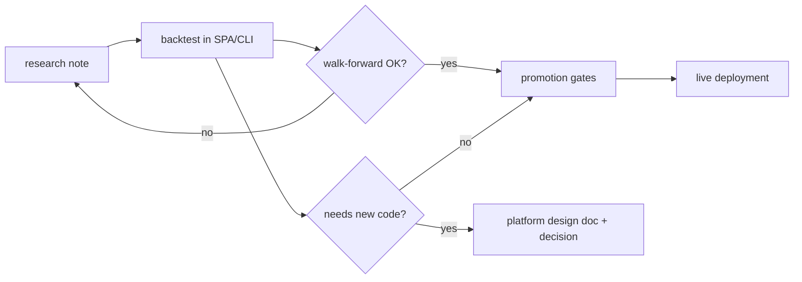

# Strategy research

Notes on **markets, signals, and alpha** — what to backtest, external claims, and gaps in
today's indicator set. These pages do **not** specify how the platform is built.

## How this differs from other wiki sections

| Section | Subject | Question it answers |
|---------|---------|-------------------|
| **[Architecture](../architecture/overview.md)** | The running system | How does X work **today**? |
| **[Guides](../guides/indicators-strategies.md)** | Using the product | How do I configure indicators, fees, and backtests? |
| **[Platform design](../design/backtest-queue.md)** | Software to build | What API, schema, scheduler, or UI change do we need? |
| **Strategy research** (here) | Edge hypotheses | What recipe might improve Sharpe, and can we express it now? |
| **[Decisions](../decisions.md)** | Agreed platform choices | What did we commit to for **engineering** (not "trade BTC with gate X")? |
| **[Archive](../archive/README.md)** | Historical | What shipped or was superseded? |

**Rule of thumb:** if the main reader is an **engineer implementing a feature**, it belongs
under `docs/design/` (or architecture once shipped). If the main reader is a **researcher
choosing the next backtest**, it belongs here.

`docs/design/plan-to-profit.md` is a **product roadmap** (research → live pipeline). It names
a live candidate strategy but is still about **delivery phases**, not alpha research — it
stays under platform design until we split roadmaps into their own nav section.

## Page template

Every file under `docs/research/` should start with:

```markdown
**Doc type:** strategy research  
**Status:** …
```

Use **Status** honestly, for example:

- `hypothesis — not backtested here`
- `backtested — see BT.STRATEGY …` (optional VID/name)
- `rejected after walk-forward`
- `promoted to live — see TRADE deployment …`

!!! note "Not a decision log entry"
    Agreeing to **try** a FILTER gate in the UI is research. Agreeing to **add Sortino to
    Performance** is platform design → `decisions.md` when merged.

## Suggested lifecycle



When research exposes a **platform gap** (new indicator, position sizing, 4h interval), add
or link a design doc — do not turn the research page into a spec.

## Index

| Page | Topic |
|------|--------|
| [Crypto spot — baseline improvements](crypto-spot-baseline-improvements.md) | BB momentum long, squeeze, trend filter, external Sharpe claims |
