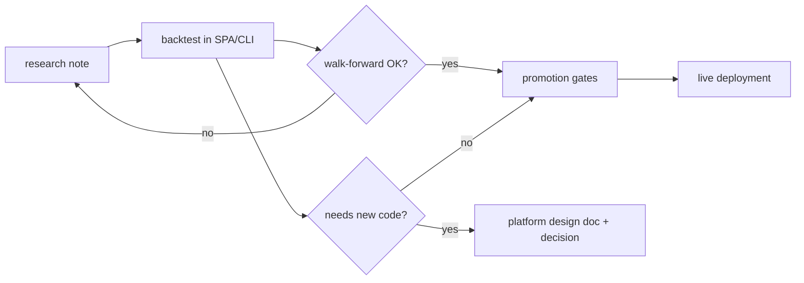

# Strategy research

Notes on **markets, signals, and alpha** — what to backtest, external claims, and gaps in
today's indicator set. These pages do **not** specify how the platform is built.

## How this differs from other wiki sections

| Section | Subject | Question it answers |
|---------|---------|-------------------|
| **[Architecture](../architecture/overview.md)** | The running system | How does X work **today**? |
| **[Guides](../guides/indicators-strategies.md)** | Using the product | How do I configure indicators, fees, and backtests? |
| **[Platform design](../design/backtest-queue.md)** | Software to build | What API, schema, scheduler, or UI change do we need? |
| **Strategy research** (here) | Edge hypotheses | What recipe might improve Sharpe, and can we express it now? |
| **[Decisions](../decisions.md)** | Agreed platform choices | What did we commit to for **engineering** (not "trade BTC with gate X")? |
| **[Archive](../archive/README.md)** | Historical | What shipped or was superseded? |

**Rule of thumb:** if the main reader is an **engineer implementing a feature**, it belongs
under `docs/design/` (or architecture once shipped). If the main reader is a **researcher
choosing the next backtest**, it belongs here.

`docs/design/plan-to-profit.md` is a **product roadmap** (research → live pipeline). It names
a live candidate strategy but is still about **delivery phases**, not alpha research — it
stays under platform design until we split roadmaps into their own nav section.

## Page template

Every file under `docs/research/` should start with:

```markdown
**Doc type:** strategy research  
**Status:** …
```

Each strategy section should also include a short **AlgoDaemon testability** note:
as-is, needs adapting, or can't be tested under the bot limits in
[AlgoDaemon hand-off](sharpe-ideas-index.md#algodaemon-hand-off).

Use **Status** honestly, for example:

- `hypothesis — not backtested here`
- `backtested — see BT.STRATEGY …` (optional VID/name)
- `rejected after walk-forward`
- `promoted to live — see TRADE deployment …`

!!! note "Not a decision log entry"
    Agreeing to **try** a FILTER gate in the UI is research. Agreeing to **add Sortino to
    Performance** is platform design → `decisions.md` when merged.

## Suggested lifecycle



When research exposes a **platform gap** (new indicator, position sizing, 4h interval), add
or link a design doc — do not turn the research page into a spec.

## Index

| Page | Topic |
|------|--------|
| [Crypto spot — baseline improvements](crypto-spot-baseline-improvements.md) | BB momentum long, squeeze, trend filter, external Sharpe claims |
| [Sharpe ideas — where to start](sharpe-ideas-index.md) | Ranked shortlist, [AlgoDaemon hand-off](sharpe-ideas-index.md#algodaemon-hand-off), source log |
| [Momentum, reversal, and filters](momentum-reversal-filters.md) | Time-series momentum, liquid vs illiquid reversal, cross-product gate |
| [Catching crypto trends](catching-crypto-trends.md) | Donchian ensemble, 10 bp net results on BTC/ETH/BNB, 1× cap |
| [Volatility and the cross-section](volatility-and-cross-section.md) | Vol targeting, size/momentum factors, risk-balanced baskets |
| [Funding, basis, and carry](funding-basis-carry.md) | Funding as a filter, 8-hour normalization, perp-spot convergence |
| [Microstructure, on-chain, and unusual](microstructure-onchain-unusual.md) | 24h roll-out, clock-time flow, attention, on-chain value |

Before treating a Sharpe from these pages as a result, read the
[backtest review (2026-09-25)](../design/2026-09-25-backtest-review.md). It records
how this engine annualizes, promotes, and costs a backtest. Engineering quality
of the same tree — the worker, the scheduler, typing, and the session cookie —
is in the [code quality review (2026-09-26)](../design/2026-09-26-code-quality-review.md).

## AlgoDaemon hand-off

The bot is Bybit spot only, BTC/ETH/BNB only, 10 bps per trade, daily bars preferred, backtests only. No perps, so funding and basis cannot be *traded*. Full rules, indicators, and sweep grids are in [AlgoDaemon hand-off](sharpe-ideas-index.md#algodaemon-hand-off). Most promising first:

1. Donchian ensemble with a ratcheting mid-line stop and a 25% vol target, long or flat, daily, cap 1×. BTC, ETH, BNB. Net-of-10 bp figures are the paper's, not ours.
2. Trend-gated Bollinger momentum, long or flat, daily, each coin.
3. Time-series momentum: long when the N-day return is positive.
4. Cross-asset SMA gate among the three coins.
5. Flat when realized volatility is high.
6. Long-only rank of BTC vs ETH vs BNB.
7. Bandwidth-squeeze breakout (still daily OHLC).
8. Funding z-score as a veto only (needs a funding file; do not trade the perp).
9. One attention or on-chain series as a veto (needs that file; BTC first).

Perp basis, cash-and-carry, the 24-hour roll-out, and any book that needs another coin are written up and marked **can't be tested**.
