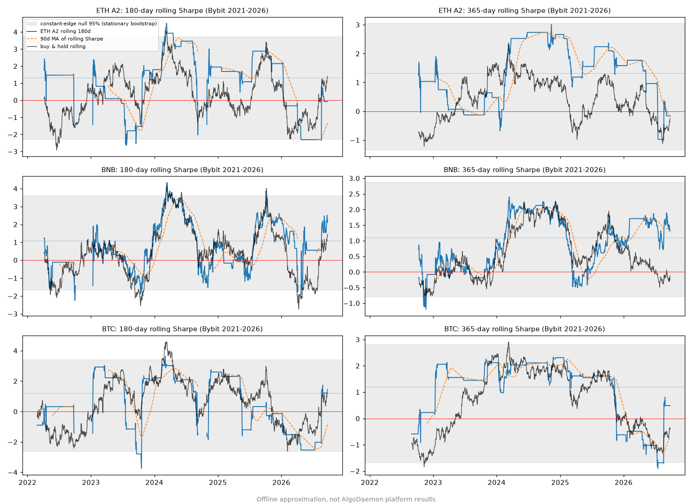
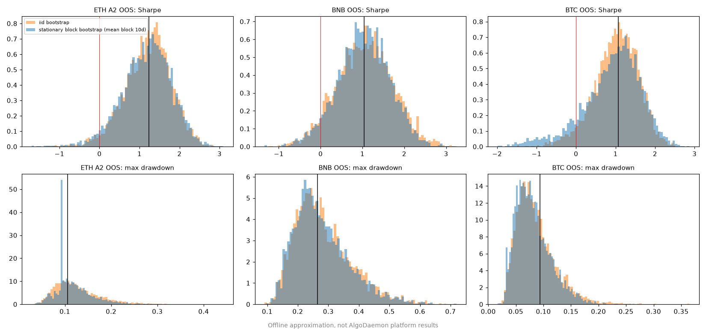
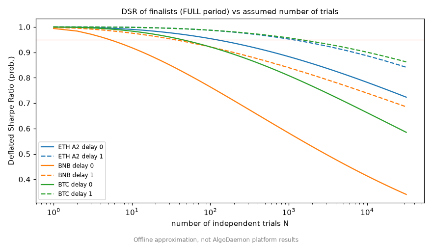
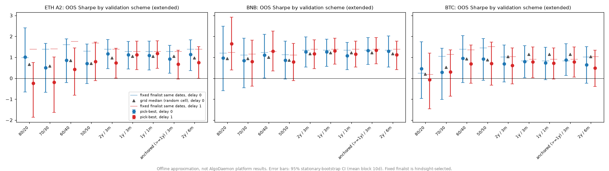
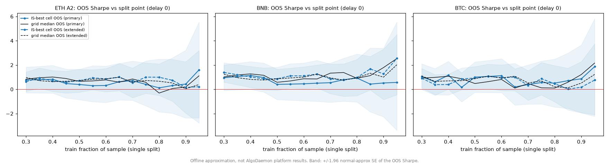
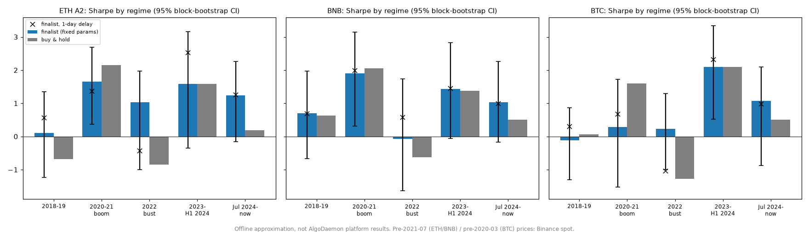
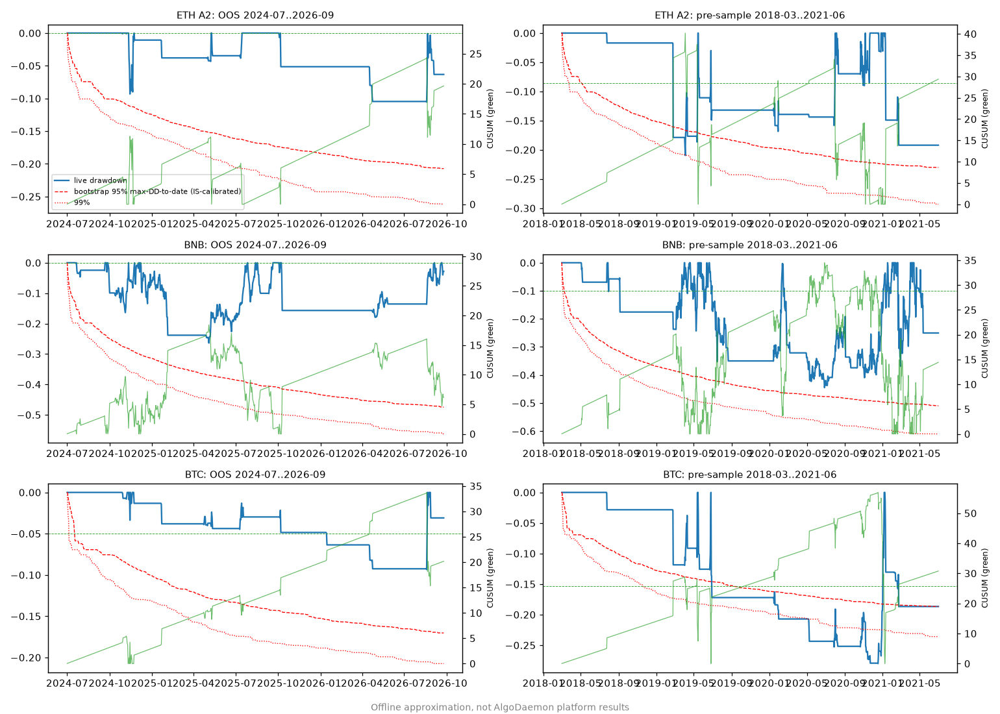

# How do we confirm a strategy's edge will last?

**Doc type:** strategy research  
**Status:** offline validation study of the three finalists (ETH A2, BNB, BTC). No platform runs, no deployments. The engine features at the end are proposals only.

!!! warning "Every number on this page is an offline approximation, not AlgoDaemon platform results"
    The figures come from the offline replica of the engine's P&L: pnl = yesterday's position × today's close-to-close return − |position change| × 10 bps. On the recorded finalists it reproduces the platform's IS / OOS / LATE / FULL Sharpe exactly (ETH A2 1.398 / 1.241 / 1.002 / 1.324, BNB 1.144 / 1.037 / 1.215 / 1.094, BTC 1.313 / 1.068 / 0.646 / 1.211). All charts carry the same label. The scripts live outside this repository.

## The question

Alfred asked: *how can we confirm a strategy's edge will last?* He suggested three ideas:

1. Watch a **moving average of the rolling Sharpe**.
2. **Bootstrap** the returns.
3. Give the **test set a bigger share** of the data (for example 60/40 or 50/50 instead of 80/20).

He also raised a concern: the 2020–2022 boom and bust may dominate the results and may not look like today's market.

The short answer is that no single test proves an edge will last. What we can do is (a) measure how much of the backtest could be luck, (b) check that the edge shows up in periods and regimes the selection never saw, and (c) watch it live with alarms set in advance. The sections below show what each method can and cannot tell us, with results for the three finalists.

## Setup

| Item | Value |
|---|---|
| Finalists | **ETH A2**: hold ETH when `FILTER(BTC BB z(65) > 2.25, ETH BB z(100) > −1.0)` (in the market about 9% of days). **BNB**: hold BNB when `BTC BB z(100) > 0.5` (about 44%). **BTC**: hold BTC when `BTC BB z(60) > 2.25` (about 9%) |
| Execution | Daily bars, long or flat, fill at the close that produced the signal (delay 0). **Delay 1** fills one close later |
| Fees | 10 bps per side on position changes |
| Main data | Bybit spot daily closes, 2021-07-01 to 2026-09-25, as cached from platform responses. The finalists' daily net returns equal the platform-exact return files to within 1e-16 at both delays. IS = to 2024-06-30. OOS = 2024-07-01 to 2026-09-25 (817 days) |
| Extended data | Binance spot daily klines (data.binance.vision) before the Bybit start, chain-linked to the Bybit series. Covers 2018-03 onward. Daily returns correlate ≥ 0.9997 with Bybit where the two overlap. **2018-03 to 2021-06 is data the finalists were never tuned on** |
| Small grid (for DSR, walk-forward, regimes) | BNB and BTC: BTC BB length 20–120 step 5 × threshold −1.0 to 2.5 step 0.25 (315 cells). ETH: BTC gate length 20–120 step 5 × gate threshold {0, 0.5, 1, 1.5, 1.75, 2, 2.25, 2.5} × ETH length {20, 40, …, 120} × ETH threshold {−1, −0.5, 0, 0.5, 1} (5,040 cells). Every grid includes the finalist cell |
| Annualisation | 365 days |

## What each method answers

| Method | Question it answers | What it cannot do |
|---|---|---|
| Rolling Sharpe (180 d / 365 d) | Has recent performance been unusual? | Tell a real decay from noise, unless the drop falls outside what a constant edge would produce. The standard error of a 180-day Sharpe is about ±1.2–1.4 |
| Moving average of rolling Sharpe | Smooths the rolling line | Adds lag, not information. A 90-day average of a 180-day Sharpe is roughly a longer-window Sharpe |
| Stationary block bootstrap | How wide is the range of plausible Sharpe, drawdown, and CAGR for this return stream, keeping short-term clustering? | Remove selection bias. It resamples the chosen strategy, so it cannot know how many others were tried. It also assumes the future looks like a reshuffled past |
| PSR (probabilistic Sharpe) | Probability the true Sharpe is above a benchmark (0 or 0.5), allowing for skew and fat tails | Account for the number of trials |
| DSR (deflated Sharpe) | The same, but the benchmark is the best Sharpe you would expect from N useless trials | Tell you N. It has to be estimated |
| Minimum track record length | How many days of this Sharpe are needed before PSR reaches 95% | Say anything about regime change |
| Walk-forward | Would the *selection procedure* have worked if we had re-run it through time without seeing the future? | Validate one fixed parameter set chosen with hindsight |
| Single train/test split at different ratios | Same as walk-forward, but with one cut | Give a stable answer. The result depends on where the cut falls |
| Regime split / leave-one-regime-out | Does the edge depend on one market period? | Cover regimes that have not happened yet |
| PBO / CSCV (done earlier, see [Chin Shum review](chinshum-review.md)) | How often does the in-sample best cell rank below the median out of sample? | Estimate the edge's size. Earlier result: PBO about 0.4–0.8 at delay 0, so the exact finalist cells are noise inside profitable families |
| Incubation / paper trading | Does it work on data that did not exist when we chose it, with real fills? | Give a verdict quickly. See the minimum track record lengths below |

## Results on the three finalists

### 1. Rolling Sharpe

*Offline approximation, not AlgoDaemon platform results. The grey band is the 95% range of rolling Sharpe when the full-period returns are resampled (stationary bootstrap), meaning what a constant edge would produce. The same chart on the extended 2018–2026 data is `img/persistence-rolling-sharpe-extended.png`.*

| Strategy | Window | Full Sharpe | SE of a window's Sharpe (Mertens, with skew and kurtosis) | SE if returns were normal | Observed std of rolling Sharpe | Constant-edge bootstrap std | Observed percentile in the null | Latest (2026-09-25) |
|---|---|---|---|---|---|---|---|---|
| ETH A2 | 180 d | 1.32 | 1.23 | 1.43 | 1.71 | 1.49 | 78% | −0.08 |
| ETH A2 | 365 d | 1.32 | 0.87 | 1.00 | 1.01 | 0.87 | 68% | −0.16 |
| BNB | 180 d | 1.09 | 1.39 | 1.43 | 1.30 | 1.24 | 59% | 2.22 |
| BNB | 365 d | 1.09 | 0.98 | 1.00 | 0.83 | 0.76 | 61% | 1.35 |
| BTC | 180 d | 1.21 | 1.17 | 1.43 | 1.76 | 1.61 | 74% | 1.22 |
| BTC | 365 d | 1.21 | 0.83 | 1.00 | 1.13 | 1.01 | 69% | 0.49 |

What this shows:

- **One year of daily data measures Sharpe to about ±0.8–1.0 (one standard error). Six months measures it to about ±1.2–1.4.** A 365-day Sharpe of 1.3 is statistically compatible with a true Sharpe anywhere from about −0.4 to 3.
- **The observed swings are what noise alone would produce.** In every case the observed variation sits at the 58th–79th percentile of the constant-edge bootstrap, both on Bybit data and on the extended data. We cannot reject "same edge throughout, just noise".
- ETH A2's 365-day Sharpe is now slightly negative (−0.16). That also sits inside the constant-edge band: the null spends about 10% of the time below zero at 365 days.

**Does a moving average of rolling Sharpe add anything?** No, not on this evidence. We tested whether a trailing Sharpe (180 d, 365 d, a 90-day MA of the 180-day Sharpe, a 180-day MA of the 365-day Sharpe, or the expanding Sharpe) predicts the next 180 days, using the extended 2018–2026 data with fixed finalist parameters:

| Strategy | Trailing 365 d | 90-day MA of 180 d | 180-day MA of 365 d | Expanding |
|---|---|---|---|---|
| ETH A2 | −0.10 | −0.10 | −0.11 | −0.18 |
| BNB | −0.45 | −0.40 | −0.45 | −0.43 |
| BTC | 0.05 | 0.12 | 0.08 | −0.09 |

*Spearman correlation with the next 180-day Sharpe, daily overlapping samples. Only 12–15 non-overlapping windows exist, so none of these are reliable. Offline approximation, not AlgoDaemon platform results.*

The correlations are near zero or negative. The sign hit rates (47–72%) match the base rate of the next window simply being positive (47–73%). The MA smooths the line and adds lag. It does not tell us whether the edge is still there.

### 2. Block bootstrap confidence intervals

Stationary bootstrap (Politis–Romano), 5,000 resamples, mean block 10 days. The Politis–White automatic block length ranged from 0.4 to 20.6 days across the series, so 5, 10, and 20 days were also run. The iid bootstrap (block length 1) is shown for comparison.

*Offline approximation, not AlgoDaemon platform results.*

| Strategy | Period | Days | Sharpe | Block 95% CI | iid 95% CI | P(SR < 0) | P(SR < 0.5) | Max DD (block CI) | CAGR (block CI) |
|---|---|---|---|---|---|---|---|---|---|
| ETH A2 | FULL | 1813 | 1.32 | 0.45 to 2.10 | 0.52 to 2.04 | 0% | 3% | 19% (9–27%) | 23% (5% to 48%) |
| ETH A2 | OOS | 817 | 1.24 | −0.11 to 2.28 | −0.02 to 2.26 | 3% | 13% | 11% (6–22%) | 23% (−2% to 61%) |
| ETH A2 | 2018-03 to 2021-06 (unseen) | 1218 | 0.95 | −0.23 to 1.90 | −0.10 to 1.90 | 6% | 23% | 21% (14–51%) | 28% (−8% to 95%) |
| BNB | FULL | 1813 | 1.09 | 0.26 to 1.90 | 0.22 to 1.92 | 0% | 8% | 30% (22–58%) | 38% (3% to 90%) |
| BNB | OOS | 817 | 1.04 | −0.25 to 2.18 | −0.24 to 2.33 | 5% | 19% | 26% (15–50%) | 31% (−11% to 89%) |
| BNB | 2018-03 to 2021-06 (unseen) | 1218 | 1.54 | 0.41 to 2.55 | 0.56 to 2.42 | 0% | 4% | 45% (33–73%) | 155% (7% to 654%) |
| BTC | FULL | 1853 | 1.21 | 0.23 to 1.96 | 0.42 to 1.90 | 1% | 7% | 9% (7–22%) | 17% (2% to 39%) |
| BTC | OOS | 817 | 1.07 | −0.93 to 2.09 | −0.23 to 1.97 | 11% | 24% | 9% (3–16%) | 13% (−5% to 43%) |
| BTC | 2018-03 to 2021-06 (unseen) | 1218 | 0.14 | −1.02 to 1.18 | −0.91 to 1.18 | 42% | 76% | 28% (16–54%) | 1% (−17% to 28%) |
| B&H ETH | OOS | 817 | 0.19 | −1.14 to 1.54 | −1.13 to 1.46 | 39% | 67% | 68% (43–93%) | −10% (−65% to 131%) |
| B&H BNB | OOS | 817 | 0.51 | −0.73 to 1.73 | −0.81 to 1.81 | 21% | 49% | 58% (28–80%) | 14% (−40% to 109%) |
| B&H BTC | OOS | 817 | 0.51 | −0.70 to 1.83 | −0.83 to 1.81 | 21% | 48% | 53% (26–76%) | 14% (−36% to 106%) |

*FULL and OOS use the platform's metric windows. Delay 0. Offline approximation, not AlgoDaemon platform results.*

What this shows:

- **Every OOS interval includes zero.** 817 days is not enough to prove a Sharpe of about 1. The FULL-period intervals exclude zero for all three.
- **The iid bootstrap is too narrow where returns cluster, but only by a modest amount here.** The clearest case is BTC. The OOS lower bound is −0.23 with iid and −0.93 with 10-day blocks (−1.09 with 20-day blocks). The FULL lower bound is 0.42 with iid and 0.23 with blocks. For BNB, where returns barely cluster (Politis–White block 0.6 days on FULL), iid and block intervals are nearly the same. Use the block version. It costs nothing and never makes the interval misleadingly tight.
- **The unseen 2018–2021 data is the strongest persistence check we have.** ETH A2 (0.95, vs buy-and-hold 0.81) and BNB (1.54, vs buy-and-hold 1.44) held up. **BTC did not: Sharpe 0.14 and +1% a year over 3.3 years**, below buy-and-hold's 0.87.

Delay-1 results (block CI): ETH A2 OOS 1.26 (0.10 to 2.24), BNB OOS 0.99 (−0.14 to 1.97), BTC OOS 0.97 (−0.69 to 1.93). The full tables with 5-, 10-, and 20-day blocks are in `results_bootstrap.csv`.

### 3. PSR, deflated Sharpe, and minimum track record

**Formulas** (per-day Sharpe `SR`, skew `g3`, raw kurtosis `g4`, `n` days):

- `PSR(SR*) = Φ( (SR − SR*) · √(n−1) / √(1 − g3·SR + (g4−1)/4 · SR²) )`
- DSR = PSR with `SR* = SR0 = √V · ((1−γ)·Φ⁻¹(1−1/N) + γ·Φ⁻¹(1−1/(N·e)))`, where `V` is the variance of Sharpe across trials, `N` is the number of independent trials, and `γ` ≈ 0.5772.
- `MinTRL = 1 + (1 − g3·SR + (g4−1)/4 · SR²) · (z₀.₉₅ / (SR − SR*))²` days.

**Trial count assumption.** The earlier rounds evaluated roughly 8,000+ parameter sets across families and assets (the round-3 grids alone were about 7,850). Those trials are heavily correlated. On our grids the eigenvalue participation ratio is only 2.3–3.2, and 23–47 eigenvectors explain 95% of the variance within one family. Across the several families and three assets searched, a plausible effective N is in the low hundreds. **We use N = 1,000 as a conservative headline and show 10, 100, and 10,000 as well.** The trial-Sharpe standard deviation comes from the grids: 0.26 (ETH), 0.31 (BNB), 0.27 (BTC) annualised on the full period.

*Offline approximation, not AlgoDaemon platform results.*

| Strategy | Period | Sharpe | Skew | Kurtosis | PSR(0) | PSR(0.5) | DSR N=10 | N=100 | **N=1000** | N=10000 | MinTRL vs 0 | MinTRL vs 0.5 | MinTRL vs SR0 (N=1000) |
|---|---|---|---|---|---|---|---|---|---|---|---|---|---|
| ETH A2 | FULL | 1.32 | 4.4 | 46 | 1.00 | 0.98 | 0.99 | 0.95 | **0.88** | 0.78 | 1.2 y | 3.0 y | 9.5 y |
| ETH A2 | OOS | 1.24 | 5.3 | 56 | 0.99 | 0.91 | 0.93 | 0.84 | **0.75** | 0.65 | 1.3 y | 3.5 y | 13 y |
| BNB | FULL | 1.09 | 1.1 | 17 | 0.99 | 0.91 | 0.92 | 0.76 | **0.58** | 0.41 | 2.2 y | 7.3 y | 311 y |
| BNB | OOS | 1.04 | 0.7 | 18 | 0.94 | 0.79 | 0.80 | 0.65 | **0.52** | 0.41 | 2.5 y | 9.2 y | 2,353 y |
| BTC | FULL | 1.21 | 6.5 | 92 | 1.00 | 0.97 | 0.98 | 0.92 | **0.81** | 0.66 | 1.3 y | 3.6 y | 18 y |
| BTC | OOS | 1.07 | 8.3 | 119 | 0.98 | 0.86 | 0.89 | 0.76 | **0.63** | 0.51 | 1.5 y | 5.3 y | 55 y |

*Delay 0. Delay-1 FULL DSR at N=1000: ETH 0.95, BNB 0.84, BTC 0.96 (delay 1 raises the in-sample Sharpe, see §5). Offline approximation, not AlgoDaemon platform results.*

What this shows:

- **We can be confident the finalists are not zero-edge strategies** (PSR vs 0 ≥ 0.94 in every row of the table). **We cannot yet be confident they beat 0.5** out of sample (OOS PSR(0.5) 0.79–0.91).
- **None of the finalists passes DSR ≥ 0.95 at N = 1,000.** ETH A2 is closest (0.88 FULL) and passes at N = 100 (0.95). BNB is weakest (0.58).
- **Minimum track record.** To show a Sharpe above 0 at 95% confidence takes about 1.2–2.5 years of this kind of return stream. To show it is above 0.5 takes 3–9 years. We have 2.2 years of OOS so far.
- Caveat: the PSR formula assumes independent days. The strong positive skew (a few big up-days) *shrinks* the formula's standard error. For BTC OOS the bootstrap interval (−0.93 to 2.09) is wider than the formula implies. Treat PSR as optimistic for these sparse, spiky strategies.

### 4. Walk-forward vs train/test ratios

At each refit the procedure picks the grid cell with the best train Sharpe, trades it for the next test window, and stitches the test windows together. Fees include switching between cells. The fixed-finalist column shows the finalist over the same dates. **The fixed finalist was chosen with hindsight over 2021–2026, so it is not a fair out-of-sample competitor.** The fair benchmark is the grid median (a randomly chosen cell).

*Offline approximation, not AlgoDaemon platform results. Bybit-only version: `img/persistence-walkforward-bybit.png`.*

**Extended data (2018–2026, delay 0).** This gives the longest out-of-sample record and the most refits.

| Asset | Scheme | OOS from | OOS days | Refits | Distinct picks | Pick-best OOS Sharpe (95% CI) | Grid median | Fixed finalist | B&H | Train→test rank IC |
|---|---|---|---|---|---|---|---|---|---|---|
| ETH A2 | 80/20 | 2025-01-08 | 626 | 1 | 1 | 1.01 (−0.66 to 2.40) | 0.66 | 0.98 | 0.16 | 0.32 |
| ETH A2 | 70/30 | 2024-03-01 | 939 | 1 | 1 | 0.50 (−0.67 to 1.67) | 0.59 | 1.38 | 0.22 | −0.15 |
| ETH A2 | 60/40 | 2023-04-23 | 1252 | 1 | 1 | 0.86 (−0.20 to 1.88) | 0.85 | 1.60 | 0.48 | −0.07 |
| ETH A2 | 50/50 | 2022-06-14 | 1565 | 1 | 1 | 0.70 (−0.25 to 1.64) | 0.71 | 1.29 | 0.61 | 0.00 |
| ETH A2 | WF 2y / 3m | 2020-03-02 | 2399 | 27 | 19 | 1.17 (0.46 to 1.85) | 0.97 | 1.38 | 0.88 | 0.08 |
| ETH A2 | WF 1y / 3m | 2019-03-03 | 2764 | 31 | 25 | 1.13 (0.44 to 1.76) | 1.05 | 1.28 | 0.90 | 0.02 |
| ETH A2 | WF 1y / 1m | 2019-03-03 | 2764 | 93 | 43 | 1.09 (0.40 to 1.77) | 1.05 | 1.28 | 0.90 | −0.01 |
| ETH A2 | WF anchored / 3m | 2019-03-03 | 2764 | 31 | 14 | 0.92 (0.24 to 1.57) | 1.05 | 1.28 | 0.90 | 0.02 |
| BNB | 80/20 | 2025-01-08 | 626 | 1 | 1 | 0.96 (−0.59 to 2.49) | 0.94 | 1.20 | 0.37 | 0.13 |
| BNB | 70/30 | 2024-03-01 | 939 | 1 | 1 | 0.84 (−0.45 to 1.91) | 0.94 | 1.11 | 0.75 | 0.03 |
| BNB | 60/40 | 2023-04-23 | 1252 | 1 | 1 | 1.10 (0.01 to 2.10) | 1.00 | 1.24 | 0.74 | 0.24 |
| BNB | 50/50 | 2022-06-14 | 1565 | 1 | 1 | 0.87 (−0.04 to 1.77) | 0.86 | 1.13 | 0.81 | 0.38 |
| BNB | WF 2y / 3m | 2020-03-02 | 2399 | 27 | 12 | 1.26 (0.53 to 1.97) | 1.17 | 1.33 | 1.09 | 0.09 |
| BNB | WF 1y / 3m | 2019-03-03 | 2764 | 31 | 24 | 1.27 (0.56 to 1.87) | 1.22 | 1.34 | 1.07 | −0.01 |
| BNB | WF 1y / 1m | 2019-03-03 | 2764 | 93 | 42 | 1.07 (0.40 to 1.71) | 1.22 | 1.34 | 1.07 | −0.03 |
| BNB | WF anchored / 3m | 2019-03-03 | 2764 | 31 | 6 | 1.33 (0.66 to 1.94) | 1.22 | 1.34 | 1.07 | 0.10 |
| BTC | 80/20 | 2025-01-08 | 626 | 1 | 1 | 0.45 (−0.96 to 1.74) | 0.20 | 0.24 | 0.03 | 0.30 |
| BTC | 70/30 | 2024-03-01 | 939 | 1 | 1 | 0.28 (−1.02 to 1.43) | 0.52 | 1.04 | 0.50 | 0.04 |
| BTC | 60/40 | 2023-04-23 | 1252 | 1 | 1 | 0.95 (−0.21 to 2.04) | 0.93 | 1.39 | 0.93 | 0.10 |
| BTC | 50/50 | 2022-06-14 | 1565 | 1 | 1 | 0.92 (−0.10 to 1.90) | 0.88 | 1.45 | 0.88 | 0.12 |
| BTC | WF 2y / 3m | 2020-03-02 | 2399 | 27 | 18 | 0.69 (−0.18 to 1.58) | 1.03 | 1.02 | 0.88 | 0.02 |
| BTC | WF 1y / 3m | 2019-03-03 | 2764 | 31 | 23 | 0.80 (0.03 to 1.56) | 1.13 | 0.83 | 0.97 | −0.03 |
| BTC | WF 1y / 1m | 2019-03-03 | 2764 | 93 | 44 | 0.73 (−0.07 to 1.48) | 1.13 | 0.83 | 0.97 | 0.01 |
| BTC | WF anchored / 3m | 2019-03-03 | 2764 | 31 | 8 | 0.88 (0.14 to 1.66) | 1.13 | 0.83 | 0.97 | 0.02 |

*95% CI: stationary bootstrap, 10-day blocks, 2,000 resamples. "Rank IC" is the Spearman correlation between the train Sharpe and the test Sharpe across all grid cells, averaged over refits. Offline approximation, not AlgoDaemon platform results.*

**Bybit-only data (2021-10 to 2026-09, delay 0), pick-best OOS Sharpe:**

| Scheme | ETH A2 | BNB | BTC |
|---|---|---|---|
| 80/20 | 0.12 | 0.93 | 0.51 |
| 70/30 | 0.71 | 0.54 | 0.39 |
| 60/40 | 0.31 | 0.45 | 1.12 |
| 50/50 | 0.39 | 0.40 | 1.00 |
| IS to 2024-06-30 (our split) | 0.29 (−1.47 to 1.34) | 0.42 (−0.70 to 1.25) | 1.05 (−0.91 to 2.11) |
| WF 2y / 3m | 1.32 (0.18 to 2.30) | 1.49 (0.25 to 2.50) | 0.46 (−0.89 to 1.51) |
| WF 1y / 3m | 0.72 | 1.12 | 0.56 |
| WF 1y / 1m | 0.44 | 0.81 | 0.58 |
| WF anchored / 3m | 0.81 | 0.81 | 0.69 |

*Offline approximation, not AlgoDaemon platform results.*

What this shows:

- **A single split gives an answer that mostly reflects where you cut.** Moving the cut from 30% to 95% train changes the finalist's own OOS Sharpe from −0.16 to 1.79 (ETH, Bybit data). Across 84 split-point × asset × dataset cases, the in-sample best cell beat the grid median out of sample in 41, a coin flip. This matches the earlier PBO of about 0.5.
- **Growing the test share narrows the OOS confidence interval, but only as fast as the square root of the test length.** The normal-approximation half-width is ±2.8 with a 10% test, ±1.4 with 40%, and ±1.1 with 70% on Bybit data. It never gets narrow enough to be decisive, and a shorter train window makes the pick noisier.
- **Walk-forward gives the longest honest out-of-sample record, so it gives the tightest intervals.** On extended data, all 8 rolling-scheme intervals for ETH and BNB in the table exclude zero, against 1 of 8 single-split intervals.
- **But pick-best walk-forward does not beat picking a random cell.** The train→test rank IC is about 0 for every rolling scheme (−0.03 to 0.15 on extended data, −0.15 to 0.04 on Bybit data). Last year's best cell tells us nothing about next quarter's ranking. The walk-forward Sharpe lands near the grid median: for rolling schemes on extended data, ETH is −0.13 to +0.20 against it, BNB −0.15 to +0.13, and BTC −0.40 to −0.25 below it.
- Among walk-forward variants, **monthly refits were the best scheme in only 1 of 12 asset × dataset × delay cases** (ETH, extended, delay 1). They also churn the most (17–48 distinct picks). **Anchored (expanding) with quarterly refits is the most stable** (3–14 distinct picks) and the best scheme for BNB and BTC on extended data at delay 0.

### 5. One-day execution delay

| Strategy | OOS Sharpe, delay 0 → delay 1 | FULL, delay 0 → delay 1 | Unseen 2018–2021, delay 0 → delay 1 |
|---|---|---|---|
| ETH A2 | 1.24 → 1.26 | 1.32 → 1.57 | 0.95 → 1.03 |
| BNB | 1.04 → 0.99 | 1.09 → 1.25 | 1.54 → 1.50 |
| BTC | 1.07 → 0.97 | 1.21 → 1.44 | 0.14 → 0.43 |

*Offline approximation, not AlgoDaemon platform results.*

The three finalists were already chosen partly for delay robustness, so the fixed finalists barely move. The "delay halves OOS Sharpe" effect from earlier work applies to **pick-best selection**. With our IS-to-2024-06 split, the in-sample best cell's OOS Sharpe goes from 0.29 to −0.81 (ETH) and from 1.05 to −0.31 (BTC), while BNB goes from 0.42 to 0.94. Grid-median OOS falls from 0.69 to 0.42 (ETH), 0.68 to 0.59 (BNB) and 0.62 to 0.51 (BTC). On Bybit data, BTC pick-best walk-forward collapses under delay 1: −0.22 to 0.10 for the 2y/3m, 1y/3m, and 1y/1m schemes, against 0.68 for 2y/6m and 0.99 for anchored. A one-day delay also raises in-sample and FULL Sharpe while lowering OOS. That pattern is a warning sign that the recent edge sits in the first day after a signal.

### 6. Regimes: does the edge depend on the 2020–2022 boom and bust?

Regimes (UTC dates, extended data):

| Code | Dates | Character |
|---|---|---|
| R1 | 2018-03-01 to 2019-12-31 | Post-2017 bear market and the 2019 recovery |
| R2 | 2020-01-01 to 2021-12-31 | Boom, including the March 2020 crash |
| R3 | 2022-01-01 to 2022-12-31 | Bust (LUNA, FTX) |
| R4 | 2023-01-01 to 2024-06-30 | Recovery and spot-ETF period |
| R5 | 2024-07-01 to 2026-09-25 | Current market (our OOS) |

*Offline approximation, not AlgoDaemon platform results. Prices before 2021-07 (ETH, BNB) and before 2020-03 (BTC) are Binance spot.*

**(a) Per-regime performance, fixed finalist parameters (delay 0)**

| Strategy | Regime | Sharpe (95% CI) | CAGR | Max DD | Time in market | Delay-1 Sharpe | Grid median Sharpe | B&H Sharpe | B&H CAGR | B&H Max DD |
|---|---|---|---|---|---|---|---|---|---|---|
| ETH A2 | R1 2018–19 | 0.10 (−1.24 to 1.35) | −0% | 21% | 5% | 0.56 | 0.49 | −0.68 | −64% | 90% |
| ETH A2 | R2 boom | 1.65 (0.36 to 2.69) | 67% | 19% | 16% | 1.37 | 1.49 | 2.15 | 432% | 62% |
| ETH A2 | R3 bust | 1.03 (−1.00 to 1.97) | 2% | 1% | 1% | −0.44 | −0.68 | −0.85 | −67% | 74% |
| ETH A2 | R4 2023–H1 2024 | 1.59 (−0.36 to 3.16) | 34% | 19% | 15% | 2.53 | 1.14 | 1.59 | 102% | 29% |
| ETH A2 | R5 now | 1.24 (−0.16 to 2.26) | 23% | 11% | 8% | 1.26 | 0.69 | 0.19 | −10% | 68% |
| BNB | R1 2018–19 | 0.71 (−0.66 to 1.97) | 25% | 35% | 27% | 0.69 | 0.63 | 0.62 | 16% | 74% |
| BNB | R2 boom | 1.90 (0.31 to 3.15) | 315% | 44% | 66% | 1.99 | 1.93 | 2.06 | 509% | 65% |
| BNB | R3 bust | −0.08 (−1.63 to 1.73) | −1% | 10% | 4% | 0.58 | −0.67 | −0.63 | −52% | 63% |
| BNB | R4 2023–H1 2024 | 1.43 (−0.06 to 2.83) | 74% | 22% | 71% | 1.44 | 1.32 | 1.38 | 78% | 41% |
| BNB | R5 now | 1.04 (−0.17 to 2.26) | 31% | 26% | 43% | 0.99 | 0.68 | 0.51 | 14% | 58% |
| BTC | R1 2018–19 | −0.11 (−1.31 to 0.87) | −4% | 17% | 5% | 0.29 | 0.71 | 0.06 | −18% | 72% |
| BTC | R2 boom | 0.28 (−1.52 to 1.73) | 4% | 23% | 15% | 0.68 | 1.58 | 1.59 | 153% | 54% |
| BTC | R3 bust | 0.23 (−1.00 to 1.30) | 0% | 1% | 1% | −1.04 | −1.47 | −1.28 | −64% | 67% |
| BTC | R4 2023–H1 2024 | 2.09 (0.53 to 3.34) | 49% | 8% | 14% | 2.32 | 1.62 | 2.09 | 143% | 20% |
| BTC | R5 now | 1.07 (−0.87 to 2.10) | 13% | 9% | 8% | 0.97 | 0.62 | 0.51 | 14% | 53% |

In 2022 the finalists were in the market only 1–4% of the time, so their 2022 "Sharpe" rests on a handful of days. What matters there is CAGR of −1% to +2% and drawdowns of 1–10%, against buy-and-hold losses of 52–67%.

**(b) Train on one era, test on the other (pick-best from the grid)**

| Asset | Direction | Pick | Train SR | Test SR (95% CI) | Pick's percentile in test grid | Grid median test | B&H test |
|---|---|---|---|---|---|---|---|
| ETH A2 | 2020–22 → 2023–now | (55, 0.5, 120, −1.0) | 2.12 | 1.06 (−0.03 to 2.04) | 76% | 0.85 | 0.66 |
| ETH A2 | 2023–now → 2020–22 | (55, 2.25, 20, 0.0) | 1.57 | 1.20 (−0.04 to 2.22) | 53% | 1.17 | 1.26 |
| BNB | 2020–22 → 2023–now | (55, 0.5) | 1.98 | 1.16 (0.21 to 2.04) | 84% | 0.99 | 0.86 |
| BNB | 2023–now → 2020–22 | (65, 1.75) | 1.46 | 1.08 (−0.04 to 1.91) | 26% | 1.50 | 1.41 |
| BTC | 2020–22 → 2023–now | (55, 0.75) | 1.69 | 1.16 (0.01 to 2.19) | 58% | 1.11 | 1.16 |
| BTC | 2023–now → 2020–22 | (65, 2.25) | 1.60 | 0.87 (−0.31 to 1.85) | 32% | 1.04 | 0.76 |

*Delay 0. Delay-1 values are in `results_regimes.json`. Offline approximation, not AlgoDaemon platform results.*

**(c) Fixed finalist parameters with 2020–2022 removed**

| Asset | 2018–19 + 2023–now (2020–22 excluded) | 2023–now only | 2020–22 only | All 2018–now |
|---|---|---|---|---|
| ETH A2 | 0.88 (0.01 to 1.68) | 1.39 (0.29 to 2.35) | 1.37 (0.32 to 2.24) | 1.08 (0.43 to 1.68) |
| BNB | 1.01 (0.25 to 1.71) | 1.21 (0.26 to 2.12) | 1.54 (0.33 to 2.64) | 1.21 (0.59 to 1.84) |
| BTC | 0.91 (0.07 to 1.66) | 1.56 (0.52 to 2.39) | 0.23 (−1.22 to 1.40) | 0.68 (0.01 to 1.34) |

*Sharpe with block-bootstrap 95% CI (10-day blocks). Delay 0. Offline approximation, not AlgoDaemon platform results.*

**Post-2023 data alone (2023-01-01 to 2026-09-25, 1,364 days), block bootstrap:**

| Asset | Sharpe | 95% CI (10-day blocks) | 95% CI (iid) | P(SR < 0) | P(SR < 0.5) | Max DD (CI) | CAGR (CI) |
|---|---|---|---|---|---|---|---|
| ETH A2 | 1.39 | 0.29 to 2.35 | 0.47 to 2.22 | 1% | 5% | 19% (9–28%) | 27% (3% to 61%) |
| BNB | 1.21 | 0.26 to 2.12 | 0.20 to 2.20 | 1% | 7% | 27% (20–54%) | 46% (3% to 115%) |
| BTC | 1.56 | 0.52 to 2.39 | 0.70 to 2.27 | 0% | 2% | 9% (5–18%) | 26% (5% to 58%) |

Caution: the finalists were chosen using 2021–2026 data, so post-2023 is not independent of the selection. These intervals are optimistic.

**(d) Leave-one-regime-out (pick the best cell on the other four regimes, score the held-out one)**

| Asset | Held out | Pick | Held-out SR | Pick's percentile | Grid median | Fixed finalist | B&H | Rank IC |
|---|---|---|---|---|---|---|---|---|
| ETH A2 | R1 | (40, 0.0, 80, −1.0) | 0.04 | 6% | 0.49 | 0.10 | −0.68 | −0.31 |
| ETH A2 | R2 | (40, 1.75, 120, 1.0) | 1.25 | 27% | 1.49 | 1.65 | 2.15 | 0.04 |
| ETH A2 | R3 | (40, 0.0, 40, 0.0) | −1.07 | 17% | −0.68 | 1.03 | −0.85 | −0.02 |
| ETH A2 | R4 | (120, 0.0, 40, 0.0) | 0.71 | 17% | 1.14 | 1.59 | 1.59 | −0.03 |
| ETH A2 | R5 | (40, 0.0, 60, 0.0) | 0.90 | 75% | 0.69 | 1.24 | 0.19 | 0.21 |
| BNB | R1 | (55, 0.5) | 0.56 | 41% | 0.63 | 0.71 | 0.62 | 0.25 |
| BNB | R2 | (80, 0.75) | 1.99 | 54% | 1.93 | 1.90 | 2.06 | −0.00 |
| BNB | R3 | (45, 0.25) | −0.43 | 51% | −0.67 | −0.08 | −0.63 | −0.12 |
| BNB | R4 | (95, −0.25) | 1.20 | 33% | 1.32 | 1.43 | 1.38 | 0.33 |
| BNB | R5 | (45, 0.25) | 0.58 | 40% | 0.68 | 1.04 | 0.51 | 0.27 |
| BTC | R1 | (55, 0.5) | 0.44 | 32% | 0.71 | −0.11 | 0.06 | 0.16 |
| BTC | R2 | (115, 1.0) | 1.46 | 37% | 1.58 | 0.28 | 1.59 | −0.05 |
| BTC | R3 | (45, 0.25) | −2.30 | 10% | −1.47 | 0.23 | −1.28 | −0.19 |
| BTC | R4 | (70, 1.0) | 1.26 | 17% | 1.62 | 2.09 | 2.09 | −0.13 |
| BTC | R5 | (55, 0.75) | 0.75 | 63% | 0.62 | 1.07 | 0.51 | 0.27 |

*Delay 0. Offline approximation, not AlgoDaemon platform results.*

**Does the edge depend on the 2020–2022 boom? No.**

- **ETH A2 and BNB** keep a positive, statistically non-zero Sharpe with 2020–2022 removed (0.88 and 1.01, both intervals above zero) and on post-2023 data alone (1.39 and 1.21). BNB also held up in the unseen 2018–2021 data.
- **BTC is the opposite of the worry.** Its edge is almost all post-2023: 0.28 in the 2020–21 boom (buy-and-hold 1.59) and −0.11 in 2018–19. Its hindsight fit to recent data is the risk, not dependence on the boom.
- **What 2020–2022 does is test both sides of the filter.** In the boom the finalists lagged buy-and-hold on return (ETH A2 +67% a year vs +432%). In the bust they were almost entirely flat (drawdown 1–10% vs 63–74%). Removing those years deletes the only full bust in the sample.
- **Training on 2020–2022 transfers to today at least as well as anything else.** Cells picked on 2020–22 ranked in the 58th–84th percentile on 2023–now. Cells picked on 2023–now ranked in the 26th–53rd percentile on 2020–22.
- **Leave-one-regime-out repeats the walk-forward lesson.** The pick's held-out percentile is below 50% in 11 of 15 cases at delay 0, and the rank IC is near zero. Choosing the single best cell does not generalise across regimes. The family as a whole does.

**Recommendation on 2020–2022:** keep it **in the training and evaluation sample, and also report it separately as a stress test.** Excluding it cuts the sample by about a third and widens every interval, and it is the only bust we have. A candidate should pass two regime checks: in the bust, drawdown well below buy-and-hold and roughly flat returns; in the boom, a positive return. Do **not** select parameters on post-2023 data alone. 1,364 days is shorter than the 3–7-year minimum track record needed to separate a Sharpe of 1 from 0.5.

### 7. Live monitoring (optional rule, tested historically)

Three alarms were calibrated on IS returns (2021-07 to 2024-06) with a stationary bootstrap, then applied to (i) the OOS period and (ii) the unseen 2018–2021 period as if it were live:

- **Drawdown alarm:** current drawdown above the 95th (or 99th) percentile of bootstrapped max-drawdown-to-date for the same elapsed days.
- **Return alarm:** cumulative return below the 5th percentile of bootstrapped paths.
- **CUSUM:** one-sided Page CUSUM for a drop in mean daily return from the IS mean to zero. The threshold is set for a 5% false-alarm chance per year under the IS edge.

*Offline approximation, not AlgoDaemon platform results.*

| Strategy | Live window | Return | Max DD | 95% DD band at 1 year | DD > 95% first | DD > 99% first | Return < 5% band first | CUSUM first |
|---|---|---|---|---|---|---|---|---|
| ETH A2 | OOS 2024-07 to 2026-09 | 58% | 11% | 16% | never | never | never | never |
| ETH A2 | 2018-03 to 2021-06 | 126% | 21% | 16% | 2019-02-24 | 2019-04-04 | 2019-02-24 | 2019-02-24 |
| BNB | OOS | 82% | 26% | 39% | never | never | never | never |
| BNB | 2018-03 to 2021-06 | 2171% | 45% | 39% | never | never | never | 2020-05-10 |
| BTC | OOS | 32% | 9% | 13% | never | never | never | 2026-04-18 |
| BTC | 2018-03 to 2021-06 | 3% | 28% | 13% | 2019-06-29 | 2020-01-31 | 2019-02-24 | 2019-02-24 |

What this shows:

- In the actual OOS period, only BTC's CUSUM fired (2026-04-18). That matches BTC's weak 2026 rolling Sharpe.
- Run over the unseen 2018–2021 data, the alarms caught BTC correctly: it stayed above the 95% drawdown band for 677 days and earned 3% over 3.3 years. They also fired on ETH A2 in early 2019, which then went on to +126%. **An alarm means "review and cut size", not "switch off".**
- For ETH A2 and BTC, which are in the market only about 8–9% of days (BNB is in about 44%), the CUSUM mostly measures how long it has been since the last winning trade. It rises steadily while flat. A per-trade version would be better (see proposals).

### Family ensemble (a side result)

Walk-forward and leave-one-regime-out both say the family matters more than the cell. So we also tested trading the **average position of every grid cell** (fractional size 0–1):

| Asset | Unseen 2018–2021: ensemble vs finalist | Extended 2018–2026: ensemble vs finalist | Bybit OOS: ensemble vs finalist |
|---|---|---|---|
| ETH | 1.51 vs 0.95 | 1.17 vs 1.08 | 0.90 vs 1.24 |
| BNB | 1.60 vs 1.54 | 1.23 vs 1.21 | 0.77 vs 1.04 |
| BTC | 1.45 vs 0.14 | 1.12 vs 0.68 | 0.73 vs 1.07 |

*Sharpe, delay 0. Offline approximation, not AlgoDaemon platform results.*

The ensemble beats the finalist on data the finalist never saw. It loses on the recent data the finalist was tuned on, as hindsight would predict. The BTC ensemble spans thresholds from −1 to 2.5, so it is a broader trend strategy with deeper drawdowns (38% vs 28% on 2018–2026). The current engine cannot express it: it needs fractional sizing or a multi-rule combiner.

## Verdict on Alfred's three ideas

| Idea | Verdict | Why |
|---|---|---|
| **Moving average of rolling Sharpe** | **Useful as a dashboard. Not useful as a test.** | A 180-day Sharpe has a standard error of about ±1.2–1.4, and a 365-day Sharpe about ±0.8–1.0. The observed swings sit at the 58th–79th percentile of what a constant edge produces. Trailing Sharpe and its MAs did not predict the next 180 days (correlations −0.45 to +0.12). The MA adds lag. Replace it with a bootstrap band around rolling Sharpe and drawdown, set in advance, as in §7 |
| **Bootstrap** | **Yes. Use the stationary block bootstrap, not iid.** | It gives honest intervals for Sharpe, Sortino, drawdown, and CAGR. The iid version is too narrow where returns cluster (BTC OOS lower bound −0.23 iid vs −0.93 block). It does not remove selection bias, so pair it with DSR and walk-forward |
| **Bigger test share (60/40, 50/50)** | **Not on its own. Prefer walk-forward.** | One split's result mostly reflects where the cut falls (finalist OOS −0.16 to 1.79 depending on the cut). A bigger test share narrows the interval only with the square root of test length. Walk-forward uses every day after the first train window as honest OOS, which gives the tightest intervals (for example BNB anchored 1.33, CI 0.66 to 1.94). Quarterly refits beat monthly. Even so, pick-best walk-forward only matches the grid median, so the stable choice is to fix a family and trade its median or ensemble |

## Summary per finalist

| | ETH A2 | BNB | BTC |
|---|---|---|---|
| FULL / OOS Sharpe | 1.32 / 1.24 | 1.09 / 1.04 | 1.21 / 1.07 |
| OOS block-bootstrap 95% CI | −0.11 to 2.28 | −0.25 to 2.18 | −0.93 to 2.09 |
| Unseen 2018–21 Sharpe (B&H) | 0.95 (0.81) | 1.54 (1.44) | 0.14 (0.87) |
| Post-2023 Sharpe (CI) | 1.39 (0.29 to 2.35) | 1.21 (0.26 to 2.12) | 1.56 (0.52 to 2.39) |
| 2020–22 excluded Sharpe (CI) | 0.88 (0.01 to 1.68) | 1.01 (0.25 to 1.71) | 0.91 (0.07 to 1.66) |
| PSR(0) / PSR(0.5), FULL | 1.00 / 0.98 | 0.99 / 0.91 | 1.00 / 0.97 |
| DSR at N = 100 / 1,000, FULL | 0.95 / 0.88 | 0.76 / 0.58 | 0.92 / 0.81 |
| MinTRL vs 0 / vs 0.5 | 1.2 y / 3.0 y | 2.2 y / 7.3 y | 1.3 y / 3.6 y |
| Best walk-forward (extended, delay 0) vs grid median / fixed | 2y/3m 1.17 vs 0.97 / 1.38 | anchored/3m 1.33 vs 1.22 / 1.34 | anchored/3m 0.88 vs 1.13 / 0.83 |
| Delay 1, OOS | 1.24 → 1.26 | 1.04 → 0.99 | 1.07 → 0.97 |
| Live alarm in OOS | none | none | CUSUM 2026-04-18 |
| Overall | Most credible edge. Holds on unseen data, not boom-dependent. 365-day Sharpe now about 0 (within noise) | Credible, but the Sharpe advantage over B&H is small. Its value is lower drawdown. Weakest DSR | Weakest persistence evidence. Fails on unseen 2018–21 data. Edge concentrated post-2023. Treat as hindsight-fitted and size it down |

## Recommended validation protocol

For every new candidate family, and yearly for live strategies:

1. **Define the family before looking.** Write down the grid (lengths, thresholds, gates) and count every configuration tried, so N for DSR comes from a log rather than memory.
2. **Report the family, not just the cell.** Grid median Sharpe, CSCV PBO at S = 10/12/16, and delay 0 and delay 1 together.
3. **Walk-forward, anchored (expanding), quarterly refit,** on the longest clean history (use the Binance extension before the Bybit start). Report the stitched OOS Sharpe with its block-bootstrap CI next to the grid median. Accept the family if the stitched OOS CI excludes zero and the walk-forward result is not below the grid median.
4. **Block bootstrap** (stationary, 10-day mean block, also 5 and 20) for Sharpe, Sortino, max drawdown, CAGR, and P(SR < 0), on FULL, OOS, and post-2023 data.
5. **PSR and DSR** at the logged N. Target PSR(0) ≥ 0.95 on OOS and DSR ≥ 0.9 on FULL. Report MinTRL so everyone knows how long live evidence will take.
6. **Regime table** (R1–R5 above) with buy-and-hold alongside. The bust must show a small drawdown, the boom a positive return, and post-2023 a Sharpe CI above zero. Keep 2020–2022 in training, and read it as a stress test as well.
7. **Unseen-history check.** Wherever older data exists (pre-2021 Binance), run the fixed candidate on it untouched.
8. **Incubate** (paper or small size) with the alarms from §7 fixed in advance: drawdown above the 95% bootstrap band triggers a size cut, 99% triggers a review, and a CUSUM alarm triggers a review. Promote to full size only after the incubation Sharpe's PSR(0) reaches 0.95 or the MinTRL is met, whichever comes first.
9. **Do not re-tune on a bad quarter.** The rank IC of about 0 means re-tuning is noise-chasing. Re-tune only on a schedule set in advance (anchored, quarterly) or when a new family is validated.

## Future directions and proposed engine features

These are proposals for discussion, not code.

- **Walk-forward mode in the backtester.** Train/test windows (rolling or anchored), refit frequency, and selection rule (max Sharpe, grid median, ensemble). Output the stitched OOS series, the list of picks, and the rank IC per refit.
- **Bootstrap output in `performance`.** Stationary-bootstrap CIs for Sharpe, Sortino, MDD, and CAGR, plus P(SR < 0) and P(SR < 0.5), with a configurable block length.
- **PSR / DSR / MinTRL fields**, fed by a **trial counter** that logs every optimize and performance call per strategy family, so N is measured.
- **Regime-stratified report:** metrics per user-defined date range, with buy-and-hold beside each.
- **Delay-1 by default** alongside delay 0 in every result.
- **Family / ensemble strategies:** fractional sizing or a multi-rule combiner, so the average position of a grid can be traded (§ Family ensemble).
- **CSCV PBO** as a built-in optimize output.
- **Live monitor:** a drawdown-vs-bootstrap band and a per-trade CUSUM, calibrated at deployment and stored with the strategy version.
- **Longer history ingestion** (Binance spot back to 2017) for research runs, flagged as a different venue.
- Research follow-ups: per-trade (not per-day) statistics for sparse strategies; a regime-aware sizing test (for example, a smaller BTC sleeve); a repeat of this study each quarter as OOS grows.

## Charts on this page

Copy these from the study output into `docs/research/img/`:

- `img/persistence-rolling-sharpe-bybit.png`
- `img/persistence-rolling-sharpe-extended.png`
- `img/persistence-bootstrap-oos.png`
- `img/persistence-dsr-vs-trials.png`
- `img/persistence-walkforward-bybit.png`
- `img/persistence-walkforward-extended.png`
- `img/persistence-split-sweep.png`
- `img/persistence-regime-sharpe.png`
- `img/persistence-monitoring.png`

## Caveats

- Offline replica, not the platform. It is exact on the recorded finalists, but the extended history mixes venues (Binance before the Bybit start).
- The fixed finalists were chosen with knowledge of 2021–2026 data, including OOS reviews. Any "fixed finalist" comparison over that span is optimistic. Only the 2018–2021 check is truly unseen.
- N for DSR is an estimate. The grid variance of Sharpe comes from small grids, not the full search history.
- PSR and MinTRL assume independent days. With strong positive skew they are optimistic compared with the block bootstrap.
- Bootstrap intervals describe a reshuffled past. They do not cover regimes that have not happened yet.
- The 2022 Sharpe figures rest on a few days in the market. Read them through CAGR and drawdown instead.
